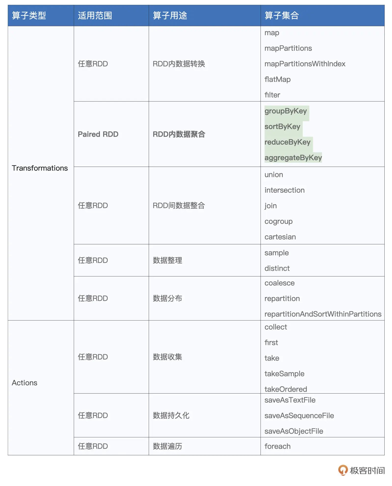
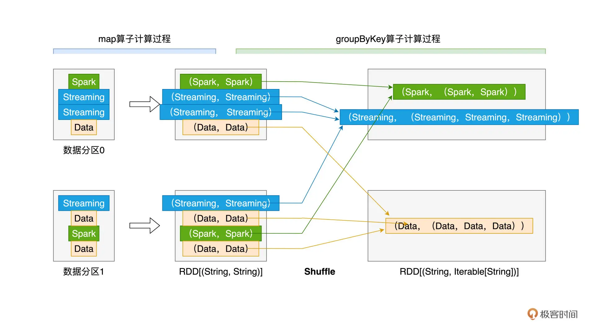
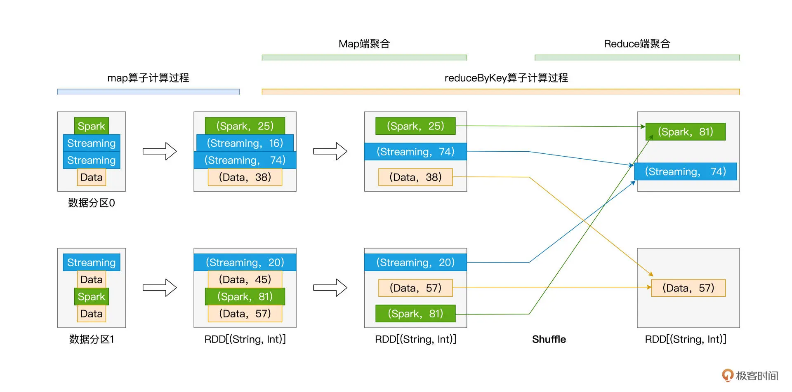
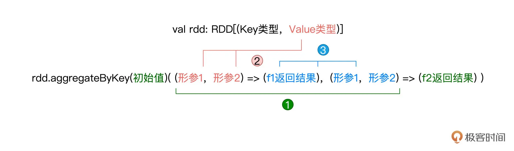
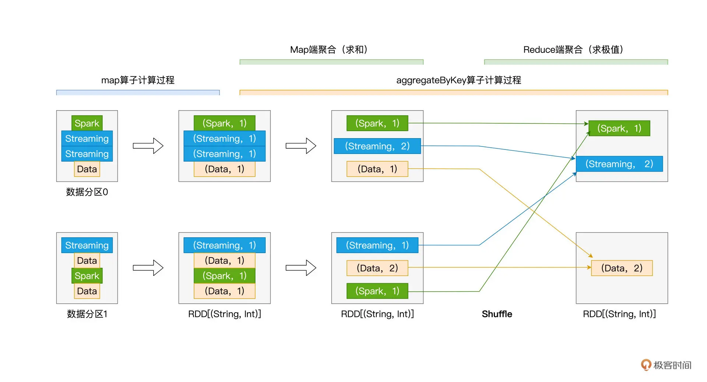

## 07 RDD常用算子（二）：Spark如何实现数据聚合？

积累了一定的理论基础之后，今天我们继续来学习 RDD 常用算子。在[RDD 常用算子（一）那一讲](https://time.geekbang.org/column/article/418079)，我们讲了四个算子 map、mapPartitions、flatMap 和 filter，同时留了这样一道思考题：“这些算子之间，有哪些共同点？”。

今天我们就来揭晓答案。首先，在功能方面，这 4 个算子都用于 RDD 内部的数据转换，而学习过 Shuffle 的工作原理之后，我们不难发现，这 4 个算子当中，没有任何一个算子，会引入 Shuffle 计算。

而今天我们要学习的几个算子则恰恰相反，它们都会引入繁重的 `Shuffle` 计算。这些算子分别是 `groupByKey`、`reduceByKey`、`aggregateByKey` 和 `sortByKey`，也就是表格中加粗的部分。

我们知道，在数据分析场景中，典型的计算类型分别是分组、聚合和排序。而 `groupByKey`、`reduceByKey`、`aggregateByKey` 和 `sortByKey` 这些算子的功能，恰恰就是用来实现分组、聚合和排序的计算逻辑。



尽管这些算子看上去相比其他算子的适用范围更窄，也就是它们只能作用（Apply）在 `Paired RDD` 之上，所谓 `Paired RDD`，它指的是元素类型为`（Key，Value）`键值对的 RDD。

但是在功能方面，可以说，它们承担了数据分析场景中的大部分职责。因此，掌握这些算子的用法，是我们能够游刃有余地开发数据分析应用的重要基础。那么接下来，我们就通过一些实例，来熟悉并学习这些算子的用法。我们先来说说 `groupByKey`，坦白地说，相比后面的 3 个算子，`groupByKey` 在我们日常开发中的“出镜率”并不高。之所以要先介绍它，主要是为后续的 `reduceByKey` 和 `aggregateByKey` 这两个重要算子做铺垫。

### groupByKey：分组收集

`groupByKey` 的字面意思是“按照 Key 做分组”，但实际上，`groupByKey` 算子包含两步，即**分组和收集**。

具体来说，对于元素类型为（Key，Value）键值对的 `Paired RDD`，`groupByKey` 的功能就是对 `Key` 值相同的元素做分组，然后把相应的 `Value` 值，以集合的形式收集到一起。换句话说，`groupByKey` 会把 RDD 的类型，由 `RDD[(Key, Value)]` 转换为 `RDD[(Key, Value 集合)]`。

这么说比较抽象，我们还是用一个小例子来说明 `groupByKey` 的用法。还是我们熟知的 `Word Count`，对于分词后的一个个单词，假设我们不再统计其计数，而仅仅是把相同的单词收集到一起，那么我们该怎么做呢？按照老规矩，咱们还是先来给出代码实现：

```
import org.apache.spark.rdd.RDD
 
// 以行为单位做分词
val cleanWordRDD: RDD[String] = _ // 完整代码请参考第一讲的Word Count
// 把普通RDD映射为Paired RDD
val kvRDD: RDD[(String, String)] = cleanWordRDD.map(word => (word, word))
 
// 按照单词做分组收集
val words: RDD[(String, Iterable[String])] = kvRDD.groupByKey()
```

结合前面的代码可以看到，相比之前的 `Word Count`，我们仅需做两个微小的改动，即可实现新的计算逻辑。第一个改动，是把 map 算子的映射函数 f，由原来的 `word => （word，1）`变更为 `word => （word，word）`，这么做的效果，是把 `kvRDD` 元素的 `Key` 和 `Value` 都变成了单词。

紧接着，第二个改动，我们用 `groupByKey` 替换了原先的 `reduceByKey`。相比 `reduceByKey`，`groupByKey` 的用法要简明得多。`groupByKey` 是无参函数，要实现对 `Paired RDD` 的分组、收集，我们仅需在 RDD 之上调用 `groupByKey()` 即可。

尽管 `groupByKey` 的用法非常简单，但它的计算过程值得我们特别关注，下面我用一张示意图来讲解上述代码的计算过程，从而让你更加直观地感受 `groupByKey` 可能存在的性能隐患。



从图上可以看出，为了完成分组收集，对于 Key 值相同、但分散在不同数据分区的原始数据记录，Spark 需要通过 `Shuffle` 操作，跨节点、跨进程地把它们分发到相同的数据分区。我们之前在[第 6 讲](https://time.geekbang.org/column/article/420399)中说了，Shuffle 是资源密集型计算，对于动辄上百万、甚至上亿条数据记录的 RDD 来说，这样的 Shuffle 计算会产生大量的磁盘 I/O 与网络 I/O 开销，从而严重影响作业的执行性能。

虽然 `groupByKey` 的执行效率较差，不过好在它在应用开发中的“出镜率”并不高。原因很简单，在数据分析领域中，分组收集的使用场景很少，而分组聚合才是统计分析的刚需。

为了满足分组聚合多样化的计算需要，Spark 提供了 3 种 RDD 算子，允许开发者灵活地实现计算逻辑，它们分别是 `reduceByKey`、`aggregateByKey` 和 `combineByKey`。

`reduceByKey` 我们并不陌生，第 1 讲的 `Word Count` 实现就用到了这个算子，`aggregateByKey` 是 `reduceByKey` 的“升级版”，相比 `reduceByKey`，`aggregateByKey` 用法更加灵活，支持的功能也更加完备。接下来，我们先来回顾 `reduceByKey`，然后再对 `aggregateByKey` 进行展开。相比 `aggregateByKey`，`combineByKey` 仅在初始化方式上有所不同，因此，我把它留给你作为课后作业去探索。

### reduceByKey：分组聚合

`reduceByKey` 的字面含义是“按照 Key 值做聚合”，它的计算逻辑，就是根据聚合函数 `f` 给出的算法，把 `Key` 值相同的多个元素，聚合成一个元素。在第 1 讲 `Word Count` 的实现中，我们使用了 `reduceByKey` 来实现分组计数：

```
// 把RDD元素转换为（Key，Value）的形式
val kvRDD: RDD[(String, Int)] = cleanWordRDD.map(word => (word, 1))
 
// 按照单词做分组计数
val wordCounts: RDD[(String, Int)] = kvRDD.reduceByKey((x: Int, y: Int) => x + y)
```

重温上面的这段代码，你有没有觉得 `reduceByKey` 与之前讲过的 `map`、`filter` 这些算子有一些相似的地方？没错，给定处理函数 `f`，它们的用法都是“算子 (f)”。只不过**对于 `map` 来说，我们把 `f` 称作是映射函数，对 `filter` 来说，我们把 f 称作判定函数，而对于 `reduceByKey`，我们把 `f` 叫作聚合函数**。

在上面的代码示例中，`reduceByKey` 的聚合函数是匿名函数：`(x, y) => x + y`。与 `map`、`filter` 等算子的用法一样，你也可以明确地定义带名函数 `f`，然后再用 `reduceByKey(f)` 的方式实现同样的计算逻辑。

需要强调的是，给定 RDD[(Key 类型，Value 类型)]，聚合函数 f 的类型，必须是（Value 类型，Value 类型） => （Value 类型）。换句话说，函数 f 的形参，必须是两个数值，且数值的类型必须与 Value 的类型相同，而 f 的返回值，也必须是 Value 类型的数值。

咱们不妨再举一个小例子，让你加深对于 `reduceByKey` 算子的理解。接下来，我们把 `Word Count` 的计算逻辑，改为随机赋值、提取同一个 `Key` 的最大值。也就是在 `kvRDD` 的生成过程中，我们不再使用映射函数 `word => (word, 1)`，而是改为 `word => (word, 随机数)`，然后再使用 `reduceByKey` 算子来计算同一个 word 当中最大的那个随机数。

你可以先停下来，花点时间想一想这个逻辑该怎么实现，然后再来参考下面的代码：

```
import scala.util.Random._
 
// 把RDD元素转换为（Key，Value）的形式
val kvRDD: RDD[(String, Int)] = cleanWordRDD.map(word => (word, nextInt(100)))
 
// 显示定义提取最大值的聚合函数f
def f(x: Int, y: Int): Int = {
    return math.max(x, y)
}
 
// 按照单词提取最大值
val wordCounts: RDD[(String, Int)] = kvRDD.reduceByKey(f)
```

观察上面的代码片段，不难发现，`reduceByKey` 算子的用法还是比较简单的，只需要先定义好聚合函数 f，然后把它传给 `reduceByKey` 算子就行了。那么在运行时，上述代码的计算又是怎样的一个过程呢？我把 `reduceByKey` 的计算过程抽象成了下图：



从图中你可以看出来，尽管 `reduceByKey` 也会引入 Shuffle，**但相比 `groupByKey` 以全量原始数据记录的方式消耗磁盘与网络，`reduceByKey` 在落盘与分发之前，会先在 `Shuffle` 的 `Map` 阶段做初步的聚合计算**。

比如，在数据分区 0 的处理中，**在 `Map` 阶段，`reduceByKey` 把 Key 同为 `Streaming` 的两条数据记录聚合为一条，聚合逻辑就是由函数 `f`` 定义的、取两者之间 `Value` 较大的数据记录，这个过程我们称之为“Map 端聚合”。相应地，数据经由网络分发之后，在 Reduce 阶段完成的计算，我们称之为“Reduce 端聚合”**。

你可能会说：“做了 Map 聚合又能怎样呢？相比 `groupByKey`，`reduceByKey` 带来的性能收益并不算明显呀！”确实，就上面的示意图来说，我们很难感受到 `reduceByKey` 带来的性能收益。不过，量变引起质变，在工业级的海量数据下，相比 `groupByKey`，`reduceByKey` 通过在 Map 端大幅削减需要落盘与分发的数据量，往往能将执行效率提升至少一倍。

应该说，对于大多数分组 & 聚合的计算需求来说，只要设计合适的聚合函数 f，你都可以使用 `reduceByKey` 来实现计算逻辑。不过，术业有专攻，`reduceByKey` 算子的局限性，**在于其 Map 阶段与 Reduce 阶段的计算逻辑必须保持一致，这个计算逻辑统一由聚合函数 f 定义**。当一种计算场景需要在两个阶段执行不同计算逻辑的时候，`reduceByKey` 就爱莫能助了。

比方说，还是第 1 讲的 `Word Count`，我们想对单词计数的计算逻辑做如下调整：

- 在 Map 阶段，以数据分区为单位，计算单词的加和；
- 而在 Reduce 阶段，对于同样的单词，取加和最大的那个数值。
 
显然，`Map` 阶段的计算逻辑是 `sum`，而 `Reduce` 阶段的计算逻辑是 `max`。对于这样的业务需求，`reduceByKey` 已无用武之地，这个时候，就轮到 `aggregateByKey` 这个算子闪亮登场了。

### aggregateByKey：更加灵活的聚合算子

老规矩，算子的介绍还是从用法开始。相比其他算子，`aggregateByKey` 算子的参数比较多。要在 `Paired RDD` 之上调用 `aggregateByKey`，**你需要提供一个初始值，一个 Map 端聚合函数 f1，以及一个 Reduce 端聚合函数 f2**，`aggregateByKey` 的调用形式如下所示：

```
val rdd: RDD[(Key类型，Value类型)] = _
rdd.aggregateByKey(初始值)(f1, f2)
```

初始值可以是任意数值或是字符串，而聚合函数我们也不陌生，它们都是带有两个形参和一个输出结果的普通函数。就这 3 个参数来说，比较伤脑筋的，是它们之间的类型需要保持一致，具体来说：

- 初始值类型，必须与 f2 的结果类型保持一致；
- f1 的形参类型，必须与 Paired RDD 的 Value 类型保持一致；
- f2 的形参类型，必须与 f1 的结果类型保持一致。

不同类型之间的一致性描述起来比较拗口，咱们不妨结合示意图来加深理解：



熟悉了 `aggregateByKey` 的用法之后，接下来，我们用 `aggregateByKey` 这个算子来实现刚刚提到的“先加和，再取最大值”的计算逻辑，代码实现如下所示：

```
// 把RDD元素转换为（Key，Value）的形式
val kvRDD: RDD[(String, Int)] = cleanWordRDD.map(word => (word, 1))
 
// 显示定义Map阶段聚合函数f1
def f1(x: Int, y: Int): Int = {
return x + y
}
 
// 显示定义Reduce阶段聚合函数f2
def f2(x: Int, y: Int): Int = {
return math.max(x, y)
}
 
// 调用aggregateByKey，实现先加和、再求最大值
val wordCounts: RDD[(String, Int)] = kvRDD.aggregateByKey(0) (f1, f2)
```

怎么样？是不是很简单？结合计算逻辑的需要，我们只需要提前定义好两个聚合函数，同时保证参数之间的类型一致性，然后把初始值、聚合函数传入 `aggregateByKey` 算子即可。按照惯例，我们还是通过 `aggregateByKey` 在运行时的计算过程，来帮你深入理解算子的工作原理：



不难发现，在运行时，与 `reduceByKey` 相比，`aggregateByKey` 的执行过程并没有什么两样，最主要的区别，还是 Map 端聚合与 Reduce 端聚合的计算逻辑是否一致。值得一提的是，与 `reduceByKey` 一样，`aggregateByKey` 也可以通过 Map 端的初步聚合来大幅削减数据量，在降低磁盘与网络开销的同时，提升 `Shuffle` 环节的执行性能。

### sortByKey：排序

在这一讲的最后，我们再来说说 `sortByKey` 这个算子，顾名思义，它的功能是“按照 Key 进行排序”。给定包含（Key，Value）键值对的 `Paired RDD`，`sortByKey` 会以 Key 为准对 RDD 做排序。算子的用法比较简单，只需在 RDD 之上调用 `sortByKey()` 即可：

```
val rdd: RDD[(Key类型，Value类型)] = _
rdd.sortByKey()
```

在默认的情况下，sortByKey 按照 Key 值的升序（Ascending）对 RDD 进行排序，如果想按照降序（Descending）来排序的话，你需要给 sortByKey 传入 false。总结下来，关于排序的规则，你只需要记住如下两条即可：

- 升序排序：调用 sortByKey()、或者 sortByKey(true)；
- 降序排序：调用 sortByKey(false)。

### 重点回顾

今天这一讲，我们介绍了数据分析场景中常用的 4 个算子，它们分别是 `groupByKey`、`reduceByKey`、`aggregateByKey` 和 `sortByKey`，掌握这些算子的用法与原理，将为你游刃有余地开发数据分析应用打下坚实基础。

关于这些算子，你首先需要了解它们之间的共性。**一来，这 4 个算子的作用范围，都是 `Paired RDD`；二来，在计算的过程中，它们都会引入 `Shuffle`**。而 `Shuffle` 往往是 `Spark` 作业执行效率的瓶颈，因此，在使用这 4 个算子的时候，对于它们可能会带来的性能隐患，我们要做到心中有数。

再者，你需要掌握每一个算子的具体用法与工作原理。`groupByKey` 是无参算子，你只需在 RDD 之上调用 `groupByKey()` 即可完成对数据集的分组和收集。但需要特别注意的是，**以全量原始数据记录在集群范围内进行落盘与网络分发，会带来巨大的性能开销。因此，除非必需，你应当尽量避免使用 groupByKey 算子**。

利用聚合函数 f，reduceByKey 可以在 Map 端进行初步聚合，大幅削减需要落盘与分发的数据量，从而在一定程度上能够显著提升 Shuffle 计算的执行效率。对于绝大多数分组 & 聚合的计算需求，只要聚合函数 f 设计得当，reduceByKey 都能实现业务逻辑。reduceByKey 也有其自身的局限性，那就是其 Map 阶段与 Reduce 阶段的计算逻辑必须保持一致。

对于 Map 端聚合与 Reduce 端聚合计算逻辑不一致的情况，aggregateByKey 可以很好地满足这样的计算场景。aggregateByKey 的用法是 aggregateByKey(初始值)(Map 端聚合函数，Reduce 端聚合函数)，对于 aggregateByKey 的 3 个参数，你需要保证它们之间类型的一致性。一旦类型一致性得到满足，你可以通过灵活地定义两个聚合函数，来翻着花样地进行各式各样的数据分析。

最后，对于排序类的计算需求，你可以通过调用 sortByKey 来进行实现。sortByKey 支持两种排序方式，在默认情况下，sortByKey() 按 Key 值的升序进行排序，sortByKey() 与 sortByKey(true) 的效果是一样的。如果想按照降序做排序，你只需要调用 sortByKey(false) 即可。

到此为止，我们一起学习了 RDD 常用算子的前两大类，也就是数据转换和数据聚合。在日常的开发工作中，应该说绝大多数的业务需求，都可以通过这些算子来实现。

### Reference

- [07 | RDD常用算子（二）：Spark如何实现数据聚合？](https://time.geekbang.org/column/article/421566)