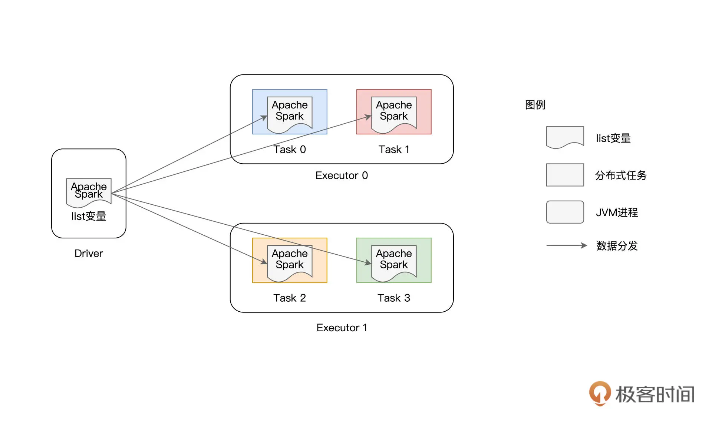
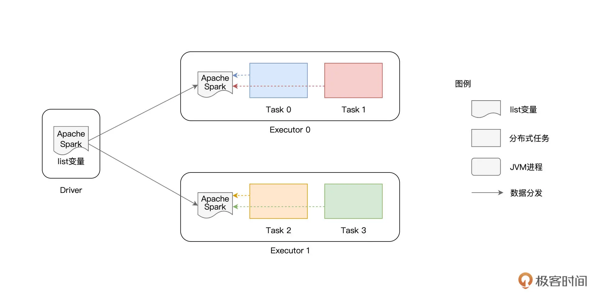

## 10 | 广播变量 & 累加器：共享变量是用来做什么的？

学习过 RDD 常用算子之后，回顾这些算子，你会发现它们都是作用（Apply）在 RDD 之上的。RDD 的计算以数据分区为粒度，依照算子的逻辑，Executors 以相互独立的方式，完成不同数据分区的计算与转换。

不难发现，对于 Executors 来说，分区中的数据都是局部数据。换句话说，在同一时刻，隶属于某个 Executor 的数据分区，对于其他 Executors 来说是不可见的。

不过，在做应用开发的时候，总会有一些计算逻辑需要访问“全局变量”，比如说全局计数器，而这些全局变量在任意时刻对所有的 Executors 都是可见的、共享的。那么问题来了，像这样的全局变量，或者说共享变量，Spark 又是如何支持的呢？

今天这一讲，我就来和你聊聊 Spark 共享变量。按照创建与使用方式的不同，Spark 提供了两类共享变量，分别是广播变量（Broadcast variables）和累加器（Accumulators）。接下来，我们就正式进入今天的学习，去深入了解这两种共享变量的用法、以及它们各自的适用场景。

### 广播变量（Broadcast variables）

我们先来说说广播变量。广播变量的用法很简单，给定普通变量 `x`，通过调用 `SparkContext` 下的 `broadcast API` 即可完成广播变量的创建，我们结合代码例子看一下。

```
val list: List[String] = List("Apache", "Spark")
 
// sc为SparkContext实例
val bc = sc.broadcast(list)
```

在上面的代码示例中，我们先是定义了一个字符串列表 `list`，它包含 “Apache” 和 “Spark” 这两个单词。然后，我们使用 `broadcast` 函数来创建广播变量 `bc`，`bc` 封装的内容就是 `list` 列表。

```
// 读取广播变量内容
bc.value
// List[String] = List(Apache, Spark)
 
// 直接读取列表内容
list
// List[String] = List(Apache, Spark)
```

广播变量创建好之后，通过调用它的 `value` 函数，我们就可以访问它所封装的数据内容。可以看到调用 `bc.value` 的效果，这与直接访问字符串列表 `list` 的效果是完全一致的。

看到这里，你可能会问：“明明通过访问 `list` 变量就可以直接获取字符串列表，为什么还要绕个大弯儿，先去封装广播变量，然后又通过它的 `value` 函数来获取同样的数据内容呢？”实际上，这是个非常好的问题，要回答这个问题，咱们需要做个推演，看看直接访问 `list` 变量会产生哪些弊端。

在前面的几讲中，我们换着花样地变更 `Word Count` 的计算逻辑。尽管 `Word Count` 都快被我们“玩坏了”，不过，一以贯之地沿用同一个实例，有助于我们通过对比迅速掌握新的知识点、技能点。因此，为了让你迅速掌握广播变量的“精髓”，咱们不妨“故技重施”，继续在 `Word Count` 这个实例上做文章。

#### 普通变量的痛点

这一次，为了对比使用广播变量前后的差异，我们把 `Word Count` 变更为“定向计数”。

所谓定向计数，它指的是只对某些单词进行计数，例如，给定单词列表 `list`，我们只对文件 `wikiOfSpark.txt` 当中的 “Apache” 和 “Spark” 这两个单词做计数，其他单词我们可以忽略。结合第 1 讲 `Word Count` 的完整代码，这样的计算逻辑很容易实现，如下表所示。

```
import org.apache.spark.rdd.RDD
val rootPath: String = _
val file: String = s"${rootPath}/wikiOfSpark.txt"
// 读取文件内容
val lineRDD: RDD[String] = spark.sparkContext.textFile(file)
// 以行为单位做分词
val wordRDD: RDD[String] = lineRDD.flatMap(line => line.split(" "))
 
// 创建单词列表list
val list: List[String] = List("Apache", "Spark")
// 使用list列表对RDD进行过滤
val cleanWordRDD: RDD[String] = wordRDD.filter(word => list.contains(word))
// 把RDD元素转换为（Key，Value）的形式
val kvRDD: RDD[(String, Int)] = cleanWordRDD.map(word => (word, 1))
// 按照单词做分组计数
val wordCounts: RDD[(String, Int)] = kvRDD.reduceByKey((x, y) => x + y)
// 获取计算结果
wordCounts.collect
// Array[(String, Int)] = Array((Apache,34), (Spark,63))
```

将上述代码丢进 `spark-shell`，我们很快就能算出，在 `wikiOfSpark.txt` 文件中，“Apache” 这个单词出现了 34 次，而 “Spark” 则出现了 63 次。虽说得出计算结果挺容易的，不过知其然，还要知其所以然，接下来，咱们一起来分析一下，这段代码在运行时是如何工作的。



如上图所示，`list` 变量本身是在 Driver 端创建的，它并不是分布式数据集（如 `lineRDD`、`wordRDD`）的一部分。因此，在分布式计算的过程中，Spark 需要把 `list` 变量分发给每一个分布式任务（Task），从而对不同数据分区的内容进行过滤。

在这种工作机制下，如果 RDD 并行度较高、或是变量的尺寸较大，那么重复的内容分发就会引入大量的网络开销与存储开销，而这些开销会大幅削弱作业的执行性能。为什么这么说呢？

要知道，**`Driver` 端变量的分发是以 `Task` 为粒度的，系统中有多少个 `Task`，变量就需要在网络中分发多少次**。更要命的是，每个 `Task` 接收到变量之后，都需要把它暂存到内存，以备后续过滤之用。换句话说，在同一个 `Executor` 内部，多个不同的 `Task` 多次重复地缓存了同样的内容拷贝，毫无疑问，这对宝贵的内存资源是一种巨大的浪费。

DD 并行度较高，意味着 RDD 的数据分区数量较多，而 Task 数量与分区数相一致，这就代表系统中有大量的分布式任务需要执行。如果变量本身尺寸较大，大量分布式任务引入的网络开销与内存开销会进一步升级。在工业级应用中，RDD 的并行度往往在千、万这个量级，在这种情况下，诸如 `list` 这样的变量会在网络中分发成千上万次，作业整体的执行效率自然会很差 。

面对这样的窘境，我们有没有什么办法，能够避免同一个变量的重复分发与存储呢？答案当然是肯定的，这个时候，我们就可以祭出广播变量这个“杀手锏”。

#### 广播变量的优势

想要知道广播变量到底有啥优势，我们可以先用广播变量重写一下前面的代码实现，然后再做个对比，很容易就能发现广播变量为什么能解决普通变量的痛点。

```
import org.apache.spark.rdd.RDD
val rootPath: String = _
val file: String = s"${rootPath}/wikiOfSpark.txt"
// 读取文件内容
val lineRDD: RDD[String] = spark.sparkContext.textFile(file)
// 以行为单位做分词
val wordRDD: RDD[String] = lineRDD.flatMap(line => line.split(" "))
 
// 创建单词列表list
val list: List[String] = List("Apache", "Spark")
// 创建广播变量bc
val bc = sc.broadcast(list)
// 使用bc.value对RDD进行过滤
val cleanWordRDD: RDD[String] = wordRDD.filter(word => bc.value.contains(word))
// 把RDD元素转换为（Key，Value）的形式
val kvRDD: RDD[(String, Int)] = cleanWordRDD.map(word => (word, 1))
// 按照单词做分组计数
val wordCounts: RDD[(String, Int)] = kvRDD.reduceByKey((x, y) => x + y)
// 获取计算结果
wordCounts.collect
// Array[(String, Int)] = Array((Apache,34), (Spark,63))
```

可以看到，代码的修改非常简单，我们先是使用 `broadcast` 函数来封装 `list` 变量，然后在 RDD 过滤的时候调用 `bc.value` 来访问 `list` 变量内容。**你可不要小看这个改写，尽管代码的改动微乎其微，几乎可以忽略不计，但在运行时，整个计算过程却发生了翻天覆地的变化**。



在使用广播变量之前，list 变量的分发是以 Task 为粒度的，而在使用广播变量之后，变量分发的粒度变成了以 Executors 为单位，同一个 Executor 内多个不同的 Tasks 只需访问同一份数据拷贝即可。换句话说，**变量在网络中分发与存储的次数，从 RDD 的分区数量，锐减到了集群中 Executors 的个数**。

要知道，在工业级系统中，Executors 个数与 RDD 并行度相比，二者之间通常会相差至少两个数量级。在这样的量级下，广播变量节省的网络与内存开销会变得非常可观，省去了这些开销，对作业的执行性能自然大有裨益。

好啦，到现在为止，我们讲解了广播变量的用法、工作原理，以及它的优势所在。在日常的开发工作中，**当你遇到需要多个 Task 共享同一个大型变量（如列表、数组、映射等数据结构）的时候，就可以考虑使用广播变量来优化你的 Spark 作业**。接下来，我们继续来说说 Spark 支持的第二种共享变量：累加器。

### 累加器（Accumulators）

累加器，顾名思义，它的主要作用是全局计数（Global counter）。与单机系统不同，在分布式系统中，我们不能依赖简单的普通变量来完成全局计数，而是必须依赖像累加器这种特殊的数据结构才能达到目的。

与广播变量类似，累加器也是在 `Driver` 端定义的，但它的更新是通过在 RDD 算子中调用 `add` 函数完成的。在应用执行完毕之后，开发者在 `Driver` 端调用累加器的 `value` 函数，就能获取全局计数结果。按照惯例，咱们还是通过代码来熟悉累加器的用法。

聪明的你可能已经猜到了，我们又要对 Word Count“动手脚”了。在第 1 讲的 `Word Count` 中，我们过滤掉了空字符串，然后对文件 `wikiOfSpark.txt` 中所有的单词做统计计数。

不过这一次，我们在过滤掉空字符的同时，还想知道文件中到底有多少个空字符串，这样我们对文件中的“脏数据”就能做到心中有数了。

注意，这里对于空字符串的计数，不是主代码逻辑，它的计算结果不会写入到 `Word Count` 最终的统计结果。所以，只是简单地去掉 `filter` 环节，是无法实现空字符计数的。

那么，你自然会问：“不把 filter 环节去掉，怎么对空字符串做统计呢？”别着急，这样的计算需求，正是累加器可以施展拳脚的地方。你可以先扫一眼下表的代码实现，然后我们再一起来熟悉累加器的用法。

```
import org.apache.spark.rdd.RDD
val rootPath: String = _
val file: String = s"${rootPath}/wikiOfSpark.txt"
// 读取文件内容
val lineRDD: RDD[String] = spark.sparkContext.textFile(file)
// 以行为单位做分词
val wordRDD: RDD[String] = lineRDD.flatMap(line => line.split(" "))
 
// 定义Long类型的累加器
val ac = sc.longAccumulator("Empty string")
 
// 定义filter算子的判定函数f，注意，f的返回类型必须是Boolean
def f(x: String): Boolean = {
if(x.equals("")) {
// 当遇到空字符串时，累加器加1
ac.add(1)
return false
} else {
return true
}
}
 
// 使用f对RDD进行过滤
val cleanWordRDD: RDD[String] = wordRDD.filter(f)
// 把RDD元素转换为（Key，Value）的形式
val kvRDD: RDD[(String, Int)] = cleanWordRDD.map(word => (word, 1))
// 按照单词做分组计数
val wordCounts: RDD[(String, Int)] = kvRDD.reduceByKey((x, y) => x + y)
// 收集计数结果
wordCounts.collect
 
// 作业执行完毕，通过调用value获取累加器结果
ac.value
// Long = 79
```

与第 1 讲的 `Word Count` 相比，这里的代码主要有 4 处改动：

- 使用 `SparkContext` 下的 `longAccumulator` 来定义 `Long` 类型的累加器；
- 定义 `filter` 算子的判定函数 f，当遇到空字符串时，调用 add 函数为累加器计数；
- 以函数 f 为参数，调用 filter 算子对 RDD 进行过滤；
- 作业完成后，调用累加器的 value 函数，获取全局计数结果。

你不妨把上面的代码敲入到 spark-shell 里，直观体验下累加器的用法与效果，ac.value 给出的结果是 79，这说明以空格作为分隔符切割源文件 wikiOfSpark.txt 之后，就会留下 79 个空字符串。

另外，你还可以验证 `wordCounts` 这个 RDD，它包含所有单词的计数结果，不过，你会发现它的元素并不包含空字符串，这与我们预期的计算逻辑是一致的。

除了上面代码中用到的 longAccumulator，SparkContext 还提供了 doubleAccumulator 和 collectionAccumulator 这两种不同类型的累加器，用于满足不同场景下的计算需要，感兴趣的话你不妨自己动手亲自尝试一下。

其中，doubleAccumulator 用于对 Double 类型的数值做全局计数；而 collectionAccumulator 允许开发者定义集合类型的累加器，相比数值类型，集合类型可以为业务逻辑的实现，提供更多的灵活性和更大的自由度。

不过，就这 3 种累加器来说，尽管类型不同，但它们的用法是完全一致的。**都是先定义累加器变量，然后在 RDD 算子中调用 add 函数，从而更新累加器状态，最后通过调用 value 函数来获取累加器的最终结果**。

### 重点回顾

广播变量由 Driver 端定义并初始化，各个 Executors 以只读（`Read only`）的方式访问广播变量携带的数据内容。累加器也是由 Driver 定义的，但 Driver 并不会向累加器中写入任何数据内容，累加器的内容更新，完全是由各个 Executors 以只写（`Write only`）的方式来完成，而 Driver 仅以只读的方式对更新后的内容进行访问。

关于广播变量，你首先需要掌握它的基本用法。给定任意类型的普通变量，你都可以使用 SparkContext 下面的 broadcast API 来创建广播变量。接下来，在 RDD 的转换与计算过程中，你可以通过调用广播变量的 value 函数，来访问封装的数据内容，从而辅助 RDD 的数据处理。

需要额外注意的是，在 Driver 与 Executors 之间，普通变量的分发与存储，是以 Task 为粒度的，因此，它所引入的网络与内存开销，会成为作业执行性能的一大隐患。在使用广播变量的情况下，数据内容的分发粒度变为以 Executors 为单位。相比前者，广播变量的优势高下立判，它可以大幅度消除前者引入的网络与内存开销，进而在整体上提升作业的执行效率。

关于累加器，首先你要清楚它的适用场景，当你需要做全局计数的时候，累加器会是个很好的帮手。其次，你需要掌握累加器的具体用法，可以分为这样 3 步：

- 使用 SparkContext 下的[long | double | collection]Accumulator 来定义累加器；
- 在 RDD 的转换过程中，调用 add 函数更新累加器状态；
- 在作业完成后，调用 value 函数，获取累加器的全局结果。

### Reference

- [10 | 广播变量 & 累加器：共享变量是用来做什么的？](https://time.geekbang.org/column/article/423878)