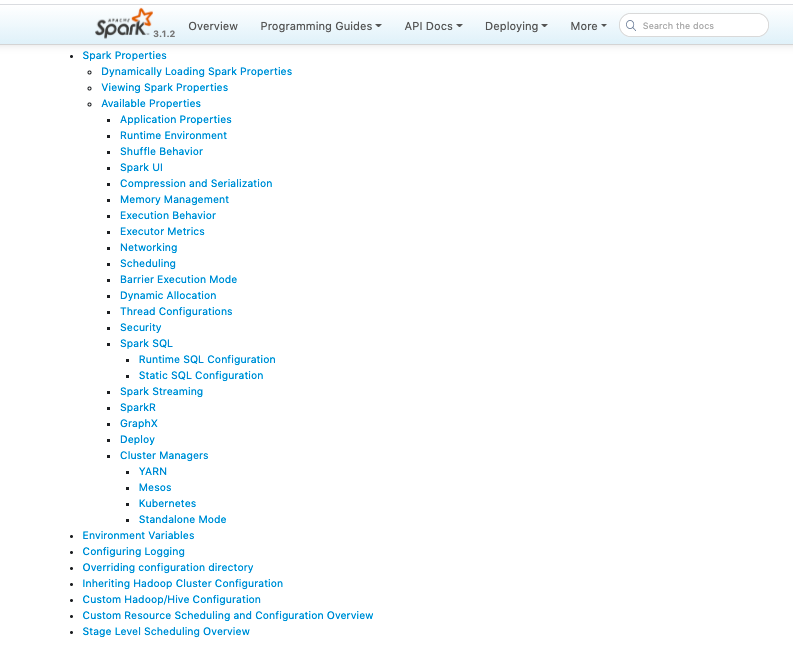
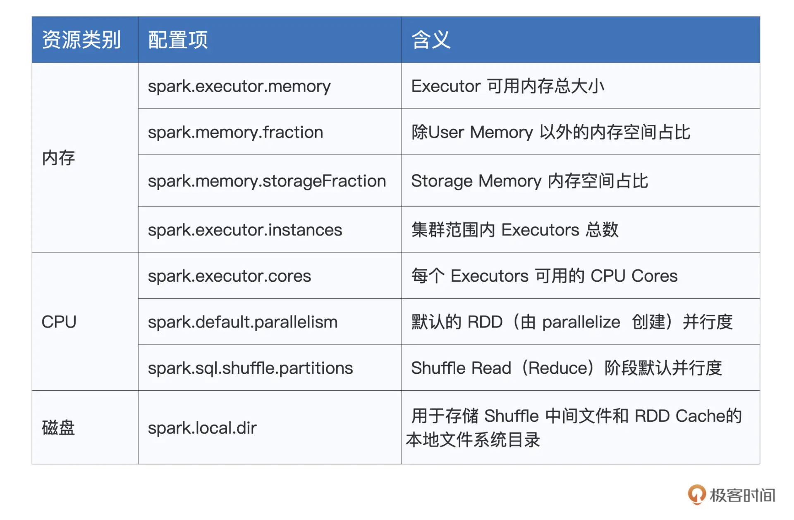

## 12 | 基础配置详解：哪些参数会影响应用程序稳定性？

到目前为止，我们一起学习了 RDD 编程模型、Spark 分布式部署、Spark 工作原理，以及 RDD 常用算子。恭喜你，到这里，可以说你已经完全跨入了 Spark 分布式应用开发的大门。有了现在的知识储备，对于大多数的业务需求，我相信你都能很快地实现。

不过，快速用代码实现各式各样的业务需求，这还只是第一步。我们不光要让代码跑起来，还需要让代码跑得又快又稳。要想做到这些，我们还需要配置项来帮忙。如果把 Spark 看作是一部 F1 赛车的话，那么配置项就是赛车车身的各项配置参数，如发动机缸数、最大转矩、车身轴距、悬挂方式、整车装备质量，等等。只有合理地配置车身参数，才能让车子本身的稳定性和性能得到保障，为选手的出色发挥奠定基础。

今天这一讲，我们就来说一说 Spark 都有哪些配置项，以及这些配置项的含义与作用。

### 配置项

打开 Spark 官网的 [Configuration](https://spark.apache.org/docs/latest/configuration.html) 页面，在这里你能找到全部的 Spark 配置项。

不过，让人沮丧的是，配置项数目过于庞大，种类繁多，有的需要设置 true/false，有的则需要我们给出明确的数值，让人看上去眼花缭乱、无所适从。



那么问题来了，面对这么多的配置项，我们应该从哪里入手呢？别着急，既然我们的目的是让车子“跑得稳”、“跑得快”，那咱们不妨从这两个角度出发，来整理那些我们必须要掌握的配置项。

在这一讲，咱们先来梳理那些能让 Spark 跑得稳的配置项，而在后续介绍 `Spark SQL` 的时候，我们再去关注那些与“跑得快”有关的部分。

关于跑得稳这件事，你可能会有这样的疑问：“一般的车子，出厂就能开，并不需要特别调整什么车辆参数。同理，大部分 Spark 配置项都有默认值，开发者使用出厂设置、省去调参的麻烦，它不香吗？” 遗憾的是，对于大多数的应用场景来说，在默认的参数设置下，Spark 还真就跑不起来。

以 `spark.executor.memory` 这个配置项为例，它用于指定 Executor memory，也就是 Executor 可用内存上限。这个参数的默认值是 1GB，显然，对于动辄上百 GB、甚至上 TB 量级的工业级数据来说，这样的设置太低了，分布式任务很容易因为 OOM（内存溢出，`Out of memory`）而中断。

你看，为了能让 Spark 跑得稳，咱们还是得花些心思。对于刚才说的情况，如果你以为直接把内存参数设置到上百 GB，就可以一劳永逸，那未免有些草率。单纯从资源供给的角度去调整配置项参数，是一种“简单粗暴”的做法，并不可取。**实际上，应用程序运行得稳定与否，取决于硬件资源供给与计算需要是否匹配**。

这就好比是赛车组装，要得到一辆高性能的车子，我们并不需要每一个部件都达到“顶配”的要求，而是要让组装配件之间相互契合、匹配，才能让车子达到预期的马力输出。

因此，咱们不妨从硬件资源的角度切入，去探索开发者必须要关注的配置项都有哪些。既然上面我们用内存举例，而且关于内存的配置项，我们在内存管理那一讲简单提过，你可能还有一些印象，那么接下来，我们就从内存入手，说一说和它有关的配置项。

### 内存

说起内存，咱们不妨先来回顾一下 Spark 的内存划分。对于给定的 `Executor Memory`，Spark 将 JVM Heap 划分为 4 个区域，分别是 `Reserved Memory`、`User Memory`、`Execution Memory` 和 `Storage Memory`，如下图所示。

不同内存区域的含义和它们的计算公式，我们在第 8 讲做过详细讲解，如果你印象不深了可以回顾一下，这里我们重点分析一下这些内存配置项数值的设置思路。


结合图解，其中 `Reserved Memory` 大小固定为 `300MB`，其他 3 个区域的空间大小，则有 3 个配置项来划定，它们分别是 `spark.executor.memory`、`spark.memory.fraction`、`spark.memory.storageFraction`。

为了后续叙述方便，我们分别把它们简称为 M、mf 和 sf，其中大写的 M 是绝对值，而小写的 mf 和 sf 都是比例值，这一点需要你注意。

其中，M 用于指定划分给 Executor 进程的 JVM Heap 大小，也即是 Executor Memory。Executor Memory 由 Execution Memory、Storage Memory 和 User Memory“这三家”瓜分。

（M – 300）* mf 划分给 Execution Memory 和 Storage Memory，而 User Memory 空间大小由（M – 300）*（1 - mf）这个公式划定，它用于存储用户自定义的数据结构，比如，RDD 算子中包含的各类实例化对象或是集合类型（如数组、列表等），都属于这个范畴。

因此，如果你的分布式应用，并不需要那么多自定义对象或集合数据，你应该把 mf 的值设置得越接近 1 越好，这样 User Memory 无限趋近于 0，大面积的可用内存就可以都留给 Execution Memory 和 Storage Memory 了。

们知道，在 1.6 版本之后，Spark 推出了统一的动态内存管理模式，在对方资源未被用尽的时候，Execution Memory 与 Storage Memory 之间可以互相进行抢占。不过，即便如此，我们仍然需要 sf 这个配置项来划定它们之间的那条虚线，从而明确告知 Spark 我们开发者更倾向于“偏袒”哪一方。

那么对于 sf 的设置，开发者该如何进行取舍呢？答案是看数据的复用频次。这是什么意思呢？我们分场景举例来说。

对于 ETL（Extract、Transform、Load）类型的作业来说，数据往往都是按照既定的业务逻辑依序处理，其中绝大多数的数据形态只需访问一遍，很少有重复引用的情况。

因此，在 ETL 作业中，`RDD Cache` 并不能起到提升执行性能的作用，那么自然我们也就没必要使用缓存了。在这种情况下，我们就应当把 sf 的值设置得低一些，压缩 `Storage Memory` 可用空间，从而尽量把内存空间留给 Execution Memory。

相反，如果你的应用场景是机器学习、或是图计算，这些计算任务往往需要反复消耗、迭代同一份数据，处理方式就不一样了。在这种情况下，咱们要充分利用 RDD Cache 提供的性能优势，自然就要把 sf 这个参数设置得稍大一些，从而让 Storage Memory 有足够的内存空间，来容纳需要频繁访问的分布式数据集。

好啦，到此为止，对于内存的 3 个配置项，我们分别解读了它们的含义，以及设置的一般性原则。你需要根据你的应用场景，合理设置这些配置项，这样程序运行才会高速、稳定。学会了这些，内存配置项这一关，你基本上已经拿到 80 分了。而剩下的 20 分，需要你从日常开发的反复实践中去获取，期待你总结归纳出更多的配置经验。

在硬件资源方面，内存的服务对象是 CPU。内存的有效配置，一方面是为了更好地容纳数据，另一方面，更重要的就是提升 CPU 的利用率。那说完内存，接下来，我们再来看看 CPU。

### CPU

与 CPU 直接相关的配置项，我们只需关注两个参数，它们分别是 `spark.executor.instances` 和 `spark.executor.cores`。其中前者指定了集群内 `Executors` 的个数，而后者则明确了每个 `Executors` 可用的 `CPU Cores（CPU 核数）`。

我们知道，一个 `CPU Core` 在同一时间只能处理一个分布式任务，因此，`spark.executor.instances` 与 `spark.executor.cores` 的乘积实际上决定了集群的并发计算能力，这个乘积，我们把它定义为“并发度”（`Degree of concurrency`）。

说到并发度，我们就不得不说另外一个概念：并行度（Degree of parallism）。相比并发度，并行度是一个高度相关、但又完全不同的概念。并行度用于定义分布式数据集划分的份数与粒度，它直接决定了分布式任务的计算负载。**并行度越高，数据的粒度越细，数据分片越多，数据越分散**。

这也就解释了，并行度为什么总是跟分区数量、分片数量、Partitions 这些属性相一致。举个例子，第 9 讲我们就说过，并行度对应着 RDD 的数据分区数量。

与并行度相关的配置项也有两个，分别是 `spark.default.parallelism` 和 `spark.sql.shuffle.partitions`。其中前者定义了由 `SparkContext.parallelize` API 所生成 RDD 的默认并行度，而后者则用于划定 Shuffle 过程中 `Shuffle Read` 阶段（Reduce 阶段）的默认并行度。

对比下来，并发度的出发点是计算能力，它与执行内存一起，共同构成了计算资源的供给水平，而并行度的出发点是数据，它决定着每个任务的计算负载，对应着计算资源的需求水平。一个是供给，一个是需求，供需的平衡与否，直接影响着程序运行的稳定性。

### CPU、内存与数据的平衡

由此可见，所谓供需的平衡，实际上就是指 CPU、内存与数据之间的平衡。那么问题来了，有没有什么量化的办法，来让三者之间达到供需之间平衡的状态呢？其实，只需要一个简单的公式，我们就可以轻松地做到这一点。

为了叙述方便，我们把由配置项 `spark.executor.cores` 指定的 `CPU Cores` 记为 `c`，把 `Execution Memory` 内存大小记为 `m`，还记得吗？`m` 的尺寸由公式（M - 300）* mf *（1 - sf）给出。不难发现，`c` 和 `m`，一同量化了一个 Executor 的可用计算资源。

量化完资源供给，我们接着再来说数据。对于一个待计算的分布式数据集，我们把它的存储尺寸记为 D，而把其并行度记录为 P。给定 D 和 P，不难推出，D/P 就是分布式数据集的划分粒度，也就是每个数据分片的存储大小。

学习过调度系统，我们知道，在 Spark 分布式计算的过程中，一个数据分片对应着一个 Task（分布式任务），而一个 Task 又对应着一个 `CPU Core`。因此，把数据看作是计算的需求方，要想达到 CPU、内存与数据这三者之间的平衡，我们必须要保证每个 Task 都有足够的内存，来让 CPU 处理对应的数据分片。

为此，我们要让数据分片大小与 Task 可用内存之间保持在同一量级，具体来说，我们可以使用下面的公式来进行量化。

```
D/P ~ m/c
```

其中，波浪线的含义，是其左侧与右侧的表达式在同一量级。左侧的表达式 D/P 为数据分片大小，右侧的 m/c 为每个 Task 分到的可用内存。以这个公式为指导，结合分布式数据集的存储大小，我们就可以有的放矢、有迹可循地对上述的 3 类配置项进行设置或调整，也就是与 CPU、内存和并行度有关的那几个配置项。

### 磁盘

说完了 CPU 和内存，接下来，我们再来说说磁盘。与前两者相比，磁盘的配置项相对要简单得多，值得我们关注的，仅有 `spark.local.dir` 这一个配置项，为了叙述方便，后续我们把它简称为 `ld`。这个配置项的值可以是任意的本地文件系统目录，它的默认值是 `/tmp` 目录。

ld 参数对应的目录用于存储各种各样的临时数据，如 `Shuffle` 中间文件、`RDD Cache`（存储级别包含“disk”），等等。这些临时数据，对程序能否稳定运行，有着至关重要的作用。

例如，`Shuffle` 中间文件是 `Reduce` 阶段任务执行的基础和前提，如果中间文件丢失，Spark 在 Reduce 阶段就会抛出 “Shuffle data not found” 异常，从而中断应用程序的运行。

既然这些临时数据不可或缺，我们就不能盲从默认选项了，而是有必要先考察下 /tmp 目录的情况。遗憾的是，ld 参数默认的 `/tmp` 目录一来存储空间有限，二来该目录本身的稳定性也值得担忧。因此，在工业级应用中，我们通常都不能接受使用 `/tmp` 目录来设置 ld 配置项。

了解了 ld 这个配置项的作用之后，我们自然就能想到，应该把它设置到一个存储空间充沛、甚至性能更有保障的文件系统，比如空间足够大的 SSD（Solid State Disk）文件系统目录。

好啦，到此为止，我们分别介绍了与 CPU、内存、磁盘有关的配置项，以及它们的含义、作用与设置技巧。说到这里，你可能有些按捺不住：“这些配置项的重要性我已经 get 到了，那我应该在哪里设置它们呢？”接下来，我们继续来说说，开发者都可以通过哪些途径来设置配置项。

### 配置项的设置途径

为了满足不同的应用场景，Spark 为开发者提供了 3 种配置项设置方式，分别是`配置文件`、`命令行参数`和 `SparkConf 对象`，这些方式都以`（Key，Value）键值对`的形式记录并设置配置项。

配置文件指的是 `spark-defaults.conf`，这个文件存储在 Spark 安装目录下面的 conf 子目录。该文件中的参数设置适用于集群范围内所有的应用程序，因此它的生效范围是全局性的。对于任意一个应用程序来说，如果开发者没有通过其他方式设置配置项，那么应用将默认采用 `spark-defaults.conf` 中的参数值作为基础设置。

在 spark-defaults.conf 中设置配置项，你只需要用空格把配置项的名字和它的设置值分隔开即可。比如，以 `spark.executor.cores`、`spark.executor.memory` 和 `spark.local.dir` 这 3 个配置项为例，我们可以使用下面的方式对它们的值进行设置。

```
spark.executor.cores 2
spark.executor.memory 4g
spark.local.dir /ssd_fs/large_dir
```

不过，在日常的开发工作中，不同应用对于资源的诉求是不一样的：有些需要更多的 CPU Cores，有些则需要更高的并行度，凡此种种、不一而足，可谓是众口难调，这个时候，我们只依赖 `spark-defaults.conf` 来进行全局设置就不灵了。为此，Spark 为开发者提供了两种应用级别的设置方式，也即命令行参数和 SparkConf 对象，它们的生效范围仅限于应用本身，我们分别看看这两种方式具体怎么用。

先说命令行参数，它指的是在运行了 `spark-shell` 或是 `spark-submit` 命令之后，通过 `–conf` 关键字来设置配置项。我们知道，`spark-shell` 用于启动交互式的分布式运行环境，而 `spark-submit` 则用于向 Spark 计算集群提交分布式作业。

还是以刚刚的 3 个配置项为例，以命令行参数的方式进行设置的话，你需要在提交 `spark-shell` 或是 `spark-submit` 命令的时候，以 `–conf Key=Value` 的形式对参数进行赋值。

```
spark-shell --master local[*] --conf spark.executor.cores=2 --conf spark.executor.memory=4g --conf spark.local.dir=/ssd_fs/large_dir
```

不难发现，尽管这种方式能让开发者在应用级别灵活地设置配置项，但它的书写方式过于繁琐，每个配置项都需要以 `–conf` 作前缀。不仅如此，命令行参数的设置方式不利于代码管理，随着时间的推移，参数值的设置很可能会随着数据量或是集群容量的变化而变化，但是这个变化的过程却很难被记录并维护下来，而这无疑会增加开发者与运维同学的运维成本。

相比之下，不论是隔离性还是可维护性，SparkConf 对象的设置方式都更胜一筹。在代码开发的过程中，我们可以通过定义 SparkConf 对象，并调用其 set 方法来对配置项进行设置。老规矩，还是用刚刚的 CPU、内存和磁盘 3 个配置项来举例。

```
import org.apache.spark.SparkConf
val conf = new SparkConf()
conf.set("spark.executor.cores", "2")
conf.set("spark.executor.memory", "4g")
conf.set("spark.local.dir", "/ssd_fs/large_dir") 
```

好啦，到此为止，我们一起梳理了 CPU、内存、磁盘的相关配置项，并重点强调了 CPU、内存与数据之间的供需平衡。掌握了这些设置方法与要点之后，你不妨自己动手去试试这些配置项，可以拿之前的 `Word Count` 小例子练练手，巩固一下今天所学的内容。

### 重点回顾

今天这一讲，我们分别从 CPU、内存和磁盘三个方面，讲解了影响应用程序稳定性的几个重要参数。你需要掌握它们的含义、作用还有适用场景，为了方便你记忆，我把它们整理到后面的表格里，你可以随时拿来参考。



熟悉了这些关键配置项之后，你还需要了解它们的设置方式。Spark 提供了 3 种配置项设置途径，分别是 `spark-defaults.conf` 配置文件、命令行参数和 `SparkConf` 对象。其中第一种方式用于全局设置，而后两者的适用范围是应用本身。

对于这 3 种方式，**Spark 会按照“SparkConf 对象 -> 命令行参数 -> 配置文件”的顺序，依次读取配置项的参数值**。对于重复设置的配置项，Spark 以前面的参数取值为准。

### Reference

- [12 | 基础配置详解：哪些参数会影响应用程序稳定性？](https://time.geekbang.org/column/article/424337)