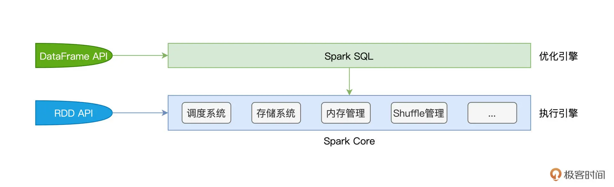
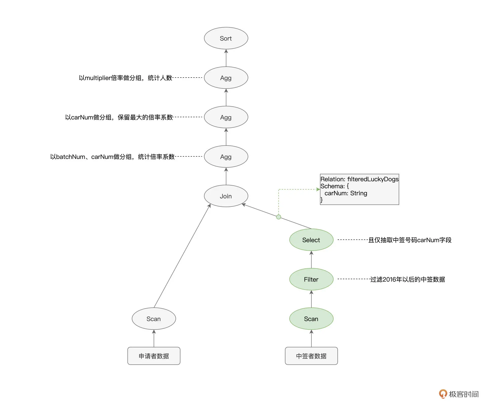
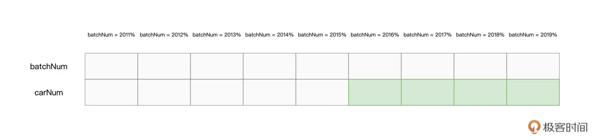
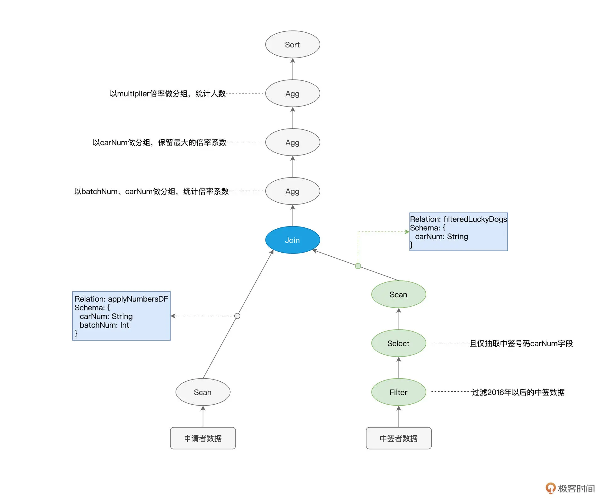
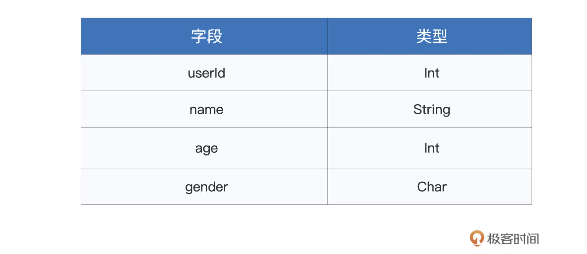
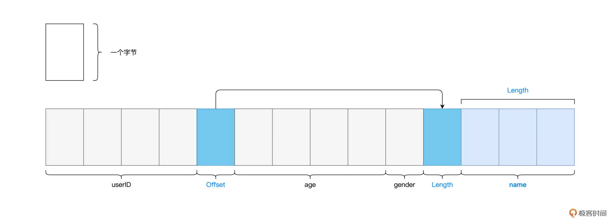

## 14 | 台前幕后：DataFrame与Spark SQL的由来

在上一讲，结合“小汽车倍率分析”的例子，我们学习了在 Spark SQL 子框架下做应用开发的一般模式。我们先是使用 `SparkSession` 的 `read` API 来创建 `DataFrame`，然后，以 `DataFrame` 为入口，通过调用各式各样的算子来完成不同 `DataFrame` 之间的转换，从而进行数据分析。

尽管我们说过，你可以把 `DataFrame` 看作是一种特殊的 `RDD`，但你可能仍然困惑 `DataFrame` 到底跟 `RDD` 有什么本质区别。Spark 已经有了 `RDD` 这个开发入口，为什么还要重复造轮子，整出个 `DataFrame` 来呢？

相信学完了上一讲，这些问题一定萦绕在你的脑海里，挥之不去。别着急，今天我们就来高屋建瓴地梳理一下 `DataFrame` 的来龙去脉，然后再追本溯源，看看帮助 `DataFrame` 崭露头角的幕后大佬 `Spark SQL` 又是怎么回事儿。

### RDD 之殇：优化空间受限

RDD 算子那一讲（第 3 讲），我们曾经留过一道思考题，像 `map`、`mapPartitions`、`filter`、`flatMap` 这些算子，它们之间都有哪些共性？

今天，我们从一个全新的视角，来重新审视这个问题。先说结论，它们都是高阶函数（Higher-order Functions）。所谓高阶函数，它指的是形参为函数的函数，或是返回类型为函数的函数。换句话说，高阶函数，首先本质上也是函数，特殊的地方在于它的形参和返回类型，这两者之中只要有一个是函数类型，那么原函数就属于高阶函数。

上面提到的这些算子，如 `map`、`filter`，它们都需要一个辅助函数 `f` 来作为形参，通过调用 `map(f)`、`filter(f)` 才能完成计算。以 `map` 为例，我们需要函数 `f` 来明确对哪些字段做映射，以什么规则映射。`filter` 也一样，我们需要函数 `f` 来指明以什么条件在哪些字段上过滤。

但是这样一来，Spark 只知道开发者要做 `map`、`filter`，但并不知道开发者打算怎么做 `map` 和 `filter`。换句话说，对于 Spark 来说，辅助函数 `f` 是透明的。**在 RDD 的开发框架下，Spark Core 只知道开发者要“做什么”，而不知道“怎么做”**。这让 Spark Core 两眼一抹黑，除了把函数 `f` 以闭包的形式打发到 `Executors` 以外，实在是没有什么额外的优化空间。而这，就是 RDD 之殇。

### DataFrame 横空出世

针对 `RDD` 优化空间受限的问题，Spark 社区在 `1.3` 版本发布了 `DataFrame`。那么，相比 `RDD`，`DataFrame` 到底有何不同呢？我们不妨从两个方面来对比它们的不同：一个是数据的表示形式（Data Representation），另一个是开发算子。

DataFrame 与 RDD 一样，都是用来封装分布式数据集的。但在数据表示方面就不一样了，`DataFrame` 是携带数据模式（Data Schema）的结构化数据，而 `RDD` 是不携带 `Schema` 的分布式数据集。恰恰是因为有了 `Schema` 提供明确的类型信息，Spark 才能耳聪目明，有针对性地设计出更紧凑的数据结构，从而大幅度提升数据存储与访问效率。

在开发 API 方面，**RDD 算子多采用高阶函数，高阶函数的优势在于表达能力强，它允许开发者灵活地设计并实现业务逻辑。而 DataFrame 的表达能力却很弱，它定义了一套 DSL 算子（Domain Specific Language）**，如我们上一节课用到的 `select`、`filter`、`agg`、`groupBy`，等等，它们都属于 DSL 算子。

DSL 语言往往是为了解决某一类特定任务而设计，非图灵完备，因此在表达能力方面非常有限。`DataFrame` 的算子大多数都是标量函数（`Scalar Functions`），它们的形参往往是结构化二维表的数据列（`Columns`）。

尽管 DataFrame 算子在表达能力方面更弱，但是 DataFrame 每一个算子的计算逻辑都是确定的，比如 `select` 用于提取某些字段，`groupBy` 用于对数据做分组，等等。这些计算逻辑对 Spark 来说，不再是透明的，因此，Spark 可以基于启发式的规则或策略，甚至是动态的运行时信息，去优化 DataFrame 的计算过程。

总结下来，相比 RDD，`DataFrame` 通过携带明确类型信息的 `Schema`、以及计算逻辑明确的转换算子，为 Spark 引擎的内核优化打开了全新的空间。

### 幕后英雄：Spark SQL

那么问题来了，优化空间打开之后，真正负责优化引擎内核（`Spark Core`）的那个幕后英雄是谁？相信不用我说，你也能猜到，它就是 Spark SQL。

想要吃透 Spark SQL，我们先得弄清楚它跟 Spark Core 的关系。随着学习进程的推进，我们接触的新概念、知识点会越来越多，厘清 Spark SQL 与 Spark Core 的关系，有利于你构建系统化的知识体系和全局视角，从而让你在学习的过程中“既见树木、也见森林”

首先，Spark Core 特指 Spark 底层执行引擎（Execution Engine），它包括了我们在基础知识篇讲过的调度系统、存储系统、内存管理、Shuffle 管理等核心功能模块。而 Spark SQL 则凌驾于 Spark Core 之上，是一层独立的优化引擎（Optimization Engine）。换句话说，`Spark Core` 负责执行，而 `Spark SQL` 负责优化，`Spark SQL` 优化过后的代码，依然要交付 `Spark Core` 来做执行。



再者，从开发入口来说，在 RDD 框架下开发的应用程序，会直接交付 Spark Core 运行。而使用 `DataFrame` API 开发的应用，则会先过一遍 `Spark SQL`，由 `Spark SQL` 优化过后再交由 `Spark Core` 去做执行。

弄清二者的关系与定位之后，接下来的问题是：“基于 DataFrame，Spark SQL 是如何进行优化的呢？”要回答这个问题，我们必须要从 Spark SQL 的两个核心组件说起：`Catalyst` 优化器和 `Tungsten`。

先说 `Catalyst` 优化器，它的职责在于创建并优化执行计划，它包含 3 个功能模块，分别是创建语法树并生成执行计划、逻辑阶段优化和物理阶段优化。`Tungsten` 用于衔接 `Catalyst` 执行计划与底层的 `Spark Core` 执行引擎，它主要负责优化数据结果与可执行代码。


接下来，我们结合上一讲“倍率分析”的例子，来说一说，那段代码在 Spark SQL 这一层，是如何被优化的。我把“倍率分析”完整的代码实现贴在了这里，你不妨先简单回顾一下。

```
import org.apache.spark.sql.DataFrame
 
val rootPath: String = _
// 申请者数据
val hdfs_path_apply: String = s"${rootPath}/apply"
// spark是spark-shell中默认的SparkSession实例
// 通过read API读取源文件
val applyNumbersDF: DataFrame = spark.read.parquet(hdfs_path_apply)
 
// 中签者数据
val hdfs_path_lucky: String = s"${rootPath}/lucky"
// 通过read API读取源文件
val luckyDogsDF: DataFrame = spark.read.parquet(hdfs_path_lucky)
 
// 过滤2016年以后的中签数据，且仅抽取中签号码carNum字段
val filteredLuckyDogs: DataFrame = luckyDogsDF.filter(col("batchNum") >= "201601").select("carNum")
 
// 摇号数据与中签数据做内关联，Join Key为中签号码carNum
val jointDF: DataFrame = applyNumbersDF.join(filteredLuckyDogs, Seq("carNum"), "inner")
 
// 以batchNum、carNum做分组，统计倍率系数
val multipliers: DataFrame = jointDF.groupBy(col("batchNum"),col("carNum"))
.agg(count(lit(1)).alias("multiplier"))
 
// 以carNum做分组，保留最大的倍率系数
val uniqueMultipliers: DataFrame = multipliers.groupBy("carNum")
.agg(max("multiplier").alias("multiplier"))
 
// 以multiplier倍率做分组，统计人数
val result: DataFrame = uniqueMultipliers.groupBy("multiplier")
.agg(count(lit(1)).alias("cnt"))
.orderBy("multiplier")
 
result.collect
```

### Catalyst 优化器

首先，我们先来说说 Catalyst 的优化过程。基于代码中 DataFrame 之间确切的转换逻辑，Catalyst 会先使用第三方的 SQL 解析器 ANTLR 生成抽象语法树（AST，Abstract Syntax Tree）。AST 由节点和边这两个基本元素构成，其中节点就是各式各样的操作算子，如 select、filter、agg 等，而边则记录了数据表的 Schema 信息，如字段名、字段类型，等等。

以下图“倍率分析”的语法树为例，它实际上描述了从源数据到最终计算结果之间的转换过程。因此，在 Spark SQL 的范畴内，AST 语法树又叫作“执行计划”（Execution Plan）。



可以看到，由算子构成的语法树、或者说执行计划，给出了明确的执行步骤。即使不经过任何优化，`Spark Core` 也能把这个“原始的”执行计划按部就班地运行起来。

还记得吗？我们的源文件是以 Parquet 格式进行存储的，而 **Parquet 格式在文件层面支持“谓词下推”（Predicates Pushdown）和“列剪枝”（Columns Pruning）这两项特性**。

谓词下推指的是，利用像“batchNum >= 201601”这样的过滤条件，在扫描文件的过程中，只读取那些满足条件的数据文件。又因为 Parquet 格式属于列存（Columns Store）数据结构，因此 Spark 只需读取字段名为“carNum”的数据文件，而“剪掉”读取其他数据文件的过程。



以中签数据为例，在谓词下推和列剪枝的帮助下，Spark Core 只需要扫描图中绿色的文件部分。显然，这两项优化，都可以有效帮助 Spark Core 大幅削减数据扫描量、降低磁盘 I/O 消耗，从而显著提升数据的读取效率。

因此，如果能把 3 个绿色节点的执行顺序，从`“Scan > Filter > Select”`调整为`“Filter > Select > Scan”`，那么，相比原始的执行计划，调整后的执行计划能给 `Spark Core` 带来更好的执行性能。

像谓词下推、列剪枝这样的特性，都被称为启发式的规则或策略。而 Catalyst 优化器的核心职责之一，就是在逻辑优化阶段，基于启发式的规则和策略调整、优化执行计划，为物理优化阶段提升性能奠定基础。经过逻辑阶段的优化之后，原始的执行计划调整为下图所示的样子，**请注意绿色节点的顺序变化**。



经过逻辑阶段优化的执行计划，依然可以直接交付 Spark Core 去运行，不过在性能优化方面，Catalyst 并未止步于此。

除了逻辑阶段的优化，Catalyst 在物理优化阶段还会进一步优化执行计划。与逻辑阶段主要依赖先验的启发式经验不同，物理阶段的优化，主要依赖各式各样的统计信息，如数据表尺寸、是否启用数据缓存、Shuffle 中间文件，等等。换句话说，**逻辑优化更多的是一种“经验主义”，而物理优化则是“用数据说话”**。

以图中蓝色的 Join 节点为例，执行计划仅交代了 applyNumbersDF 与 filteredLuckyDogs 这两张数据表需要做内关联，但是，它并没有交代清楚这两张表具体采用哪种机制来做关联。按照实现机制来分类，数据关联有 3 种实现方式，分别是嵌套循环连接（NLJ，Nested Loop Join）、排序归并连接（Sort Merge Join）和哈希连接（Hash Join）。

而按照数据分发方式来分类，数据关联又可以分为 `Shuffle Join` 和 `Broadcast Join` 这两大类。因此，在分布式计算环境中，至少有 6 种 Join 策略供 Spark SQL 来选择。对于这 6 种 `Join` 策略，我们以后再详细展开，这里你只需要了解不同策略在执行效率上有着天壤之别即可。

回到蓝色 Join 节点的例子，在物理优化阶段，Catalyst 优化器需要结合 applyNumbersDF 与 filteredLuckyDogs 这两张表的存储大小，来决定是采用运行稳定但性能略差的 Shuffle Sort Merge Join，还是采用执行性能更佳的 Broadcast Hash Join。

论 Catalyst 决定采用哪种 Join 策略，优化过后的执行计划，都可以丢给 Spark Core 去做执行。不过，Spark SQL 优化引擎并没有就此打住，当 Catalyst 优化器完成它的“历史使命”之后，Tungsten 会接过接力棒，在 Catalyst 输出的执行计划之上，继续打磨、精益求精，力求把最优的执行代码交付给底层的 SparkCore 执行引擎。


### Tungsten

站在 Catalyst 这个巨人的肩膀上，Tungsten 主要是在数据结构和执行代码这两个方面，做进一步的优化。数据结构优化指的是 Unsafe Row 的设计与实现，执行代码优化则指的是全阶段代码生成（WSCG，Whole Stage Code Generation）。

我们先来看看为什么要有 `Unsafe Row`。对于 DataFrame 中的每一条数据记录，Spark SQL 默认采用 `org.apache.spark.sql.Row` 对象来进行封装和存储。我们知道，使用 Java Object 来存储数据会引入大量额外的存储开销。

为此，Tungsten 设计并实现了一种叫做 `Unsafe Row` 的二进制数据结构。`Unsafe Row` 本质上是字节数组，它以极其紧凑的格式来存储 DataFrame 的每一条数据记录，大幅削减存储开销，从而提升数据的存储与访问效率。

以下表的 Data Schema 为例，对于包含如下 4 个字段的每一条数据记录来说，如果采用默认的 Row 对象进行存储的话，那么每条记录需要消耗至少 60 个字节。



但如果用 Tungsten Unsafe Row 数据结构进行存储的话，每条数据记录仅需消耗十几个字节，如下图所示。



说完了 Unsafe Row 的数据结构优化，接下来，我们再来说说 WSCG：全阶段代码生成。所谓全阶段，其实就是我们在调度系统中学过的 Stage。以图中的执行计划为例，标记为绿色的 3 个节点，在任务调度的时候，会被划分到同一个 Stage。


而代码生成，指的是 Tungsten 在运行时把算子之间的“链式调用”捏合为一份代码。以上图 3 个绿色的节点为例，在默认情况下，Spark Core 会对每一条数据记录都依次执行 `Filter`、`Select` 和 `Scan` 这 3 个操作。

经过了 Tungsten 的 WSCG 优化之后，`Filter`、`Select` 和 `Scan` 这 3 个算子，会被“捏合”为一个函数 f。这样一来，Spark Core 只需要使用函数 f 来一次性地处理每一条数据，就能消除不同算子之间数据通信的开销，一气呵成地完成计算。

好啦，到此为止，分别完成 `Catalyst` 和 `Tungsten` 这两个优化环节之后，`Spark SQL` 终于“心满意足”地把优化过的执行计划、以及生成的执行代码，交付给老大哥 `Spark Core`。`Spark Core` 拿到计划和代码，在运行时利用 `Tungsten Unsafe Row` 的数据结构，完成分布式任务计算。到此，我们这一讲的内容也就讲完了。

### 重点回顾

首先，在 RDD 开发框架下，Spark Core 的优化空间受限。绝大多数 RDD 高阶算子所封装的封装的计算逻辑（形参函数 f）对于 Spark Core 是透明的，Spark Core 除了用闭包的方式把函数 f 分发到 Executors 以外，没什么优化余地。

而 DataFrame 的出现带来了新思路，它携带的 Schema 提供了丰富的类型信息，而且 DataFrame 算子大多为处理数据列的标量函数。DataFrame 的这两个特点，为引擎内核的优化打开了全新的空间。在 DataFrame 的开发框架下，负责具体优化过程的正是 Spark SQL。

**Spark SQL，则是凌驾于 Spark Core 之上的一层优化引擎，它的主要职责，是在用户代码交付 Spark Core 之前，对用户代码进行优化**。

Spark SQL 由两个核心组件构成，分别是 `Catalyst` 优化器和 `Tungsten`，其优化过程也分为 `Catalyst` 和 `Tungsten` 两个环节。


在 Catalyst 优化环节，Spark SQL 首先把用户代码转换为 AST 语法树，又叫执行计划，然后分别通过逻辑优化和物理优化来调整执行计划。逻辑阶段的优化，主要通过先验的启发式经验，如谓词下推、列剪枝，对执行计划做优化调整。而物理阶段的优化，更多是利用统计信息，选择最佳的执行机制、或添加必要的计算节点。

Tungsten 主要从数据结构和执行代码两个方面进一步优化。与默认的 Java Object 相比，二进制的 Unsafe Row 以更加紧凑的方式来存储数据记录，大幅提升了数据的存储与访问效率。全阶段代码生成消除了同一 Stage 内部不同算子之间的数据传递，把多个算子融合为一个统一的函数，并将这个函数一次性地作用（Apply）到数据之上，相比不同算子的“链式调用”，这会显著提升计算效率。


### Refernce

- [14 | 台前幕后：DataFrame与Spark SQL的由来](https://time.geekbang.org/column/article/425322)

