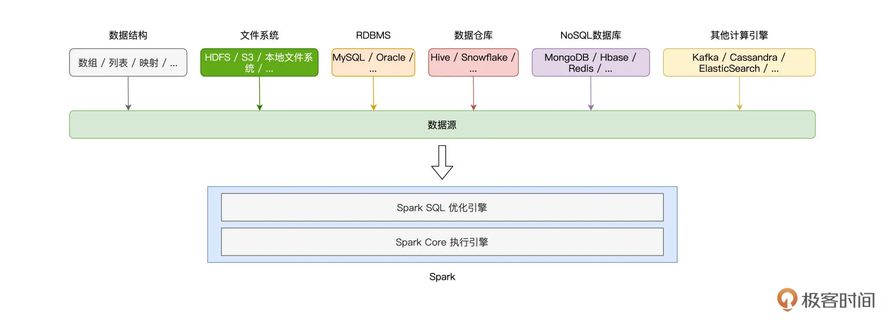

## 15 | 数据源与数据格式：DataFrame从何而来？

在上一讲，我们重点讲解了 DataFrame 与 Spark SQL 的渊源，并提到，DataFrame 是 Spark SQL 的重要入口。换句话说，通过创建 DataFrame 并沿用 DataFrame 开发 API，我们才能充分利用 Spark SQL 优化引擎提供种种“性能红利”。显然，对于初学者来说，第一步的创建 DataFrame 就变得至关重要。

之前 第 13 讲，我们做小汽车摇号倍率分析时，用了 `SparkSession` 的 `read` API 从 `Parquet` 文件创建 `DataFrame`，其实创建 DataFrame 的方法还有很多。毫不夸张地说，DataFrame 的创建途径异常丰富，为什么这么说呢？如下图所示，Spark 支持多种数据源，按照数据来源进行划分，这些数据源可以分为如下几个大类：`Driver` 端自定义的数据结构、（分布式）文件系统、关系型数据库 RDBMS、关系型数据仓库、`NoSQL` 数据库，以及其他的计算引擎。



显然，要深入地介绍 Spark 与每一种数据源的集成并不现实，也没必要，咱们只需要把注意力放在那些最常用、最常见的集成方式即可。这一讲，我会从 `Driver`、文件系统与 RDBMS 三个方面，为你讲解 5 种常见的 DataFrame 创建方式，然后带你了解不同方式的使用场景跟优劣分析。

### 1. 从 Driver 创建 DataFrame

在 Driver 端，Spark 可以直接从数组、元组、映射等数据结构创建 DataFrame。使用这种方式创建的 DataFrame 通常数据量有限，因此这样的 DataFrame 往往不直接参与分布式计算，而是用于辅助计算或是数据探索。尽管如此，学习这部分知识点还是非常必要的，因为它可以帮我们更直观地理解 `DataFrame` 与 `RDD` 的关系。

还记得吗？在数据表示（Data Representation）上，相比 RDD，DataFrame 仅仅是多了一个 `Schema`。甚至可以说，DataFrame 就是带 `Schema` 的 `RDD`。因此，**创建 DataFrame 的第一种方法，就是先创建 RDD，然后再给它“扣上”一顶 Schema 的“帽子”**。

从本地数据结构创建 RDD，我们用的是 `SparkContext` 的 `parallelize` 方法，而给 RDD “扣帽子”，我们要用到 `SparkSession` 的 `createDataFrame` 方法。

#### 1.1 createDataFrame 方法

为了创建 RDD，我们先来定义列表数据 `seq`。`seq` 的每个元素都是二元元组，元组第一个元素的类型是 `String`，第二个元素的类型是 `Int`。有了列表数据结构，接下来我们创建 RDD，如下所示。

```
import org.apache.spark.rdd.RDD
val seq: Seq[(String, Int)] = Seq(("Bob", 14), ("Alice", 18))
val rdd: RDD[(String, Int)] = sc.parallelize(seq)
```

有了 RDD 之后，我们来给它制作一顶“帽子”，也就是我们刚刚说的 `Schema`。创建 `Schema`，我们需要用到 Spark SQL 内置的几种类型，如 `StructType`、`StructField`、`StringType`、`IntegerType`，等等。

其中，StructType 用于定义并封装 Schema，StructFiled 用于定义 Schema 中的每一个字段，包括字段名、字段类型，而像 StringType、IntegerType 这些 *Type 类型，表示的正是字段类型。为了和 RDD 数据类型保持一致，Schema 对应的元素类型应该是（`StringType`，`IntegerType`）。

```
import org.apache.spark.sql.types.{StringType, IntegerType, StructField, StructType}
val schema:StructType = StructType( Array(
StructField("name", StringType),
StructField("age", IntegerType)
))
```

好啦，到此为止，我们有了 RDD，也有了为它量身定做的“帽子”Schema。不过，在把帽子扣上去之前，我们还要先给 RDD 整理下“发型”。这是什么意思呢？

createDataFrame 方法有两个形参，第一个参数正是 `RDD`，第二个参数是 `Schema`。`createDataFrame` 要求 `RDD` 的类型必须是 `RDD[Row]`，其中的 `Row` 是 `org.apache.spark.sql.Row`，因此，对于类型为 `RDD[(String, Int)]` 的 `rdd`，我们需要把它转换为 `RDD[Row]`。

```
import org.apache.spark.sql.Row
val rowRDD: RDD[Row] = rdd.map(fileds => Row(fileds._1, fileds._2))
```

“发型”整理好之后，我们就可以调用 `createDataFrame` 来创建 `DataFrame`，代码如下所示。

```
import org.apache.spark.sql.DataFrame
val dataFrame: DataFrame = spark.createDataFrame(rowRDD,schema)
```

DataFrame 创建好之后，别忘了验证它的可用性，我们可以通过调用 `show` 方法来做简单的数据探索，验证 DataFrame 创建是否成功。

```
dataFrame.show
 
/** 结果显示
+----+---+
| name| age|
+----+---+
| Bob| 14|
| Alice| 18|
+----+---+
*/
```

历尽千辛万苦，我们先是用 Driver 端数据结构创建 RDD，然后再调用 createDataFrame 把 RDD 转化为 DataFrame。你可能会说：“相比用 `parallelize` 创建 RDD，用 `createDataFrame` 创建 DataFrame 的方法未免复杂了些，有没有更简便的方法呢？”我们接着往下看。

#### 1.2 toDF 方法

其实要把 RDD 转化为 DataFrame，我们并不一定非要亲自制作 Schema 这顶帽子，还可以直接在 RDD 之后调用 `toDF` 方法来做到这一点。咱们先来看 `toDF` 函数的用法，然后再去分析，`spark.implicits` 是如何帮我们轻松创建 DataFrame 的。

```
import spark.implicits._
val dataFrame: DataFrame = rdd.toDF
dataFrame.printSchema
/** Schema显示
root
|-- _1: string (nullable = true)
|-- _2: integer (nullable = false)
*/
```

可以看到，我们显示导入了 `spark.implicits` 包中的所有方法，然后通过在 RDD 之上调用 `toDF` 就能轻松创建 `DataFrame`。实际上，利用 `spark.implicits`，我们甚至可以跳过创建 RDD 这一步，直接通过 `seq` 列表来创建 `DataFrame`。

```
import spark.implicits._
val dataFrame: DataFrame = seq.toDF
dataFrame.printSchema
/** Schema显示
root
|-- _1: string (nullable = true)
|-- _2: integer (nullable = false)
*/
```

是不是感觉这个方法很简洁、很轻松？不过，你可能会问：“既然有 toDF 这条捷径，一开始干嘛还要花功夫去学步骤繁琐的 createDataFrame 方法呢？”

网络上流行过这么一句话：“你的岁月静好，是有人在背后帮你负重前行。”toDF 也是同样的道理，我们之所以能用 toDF 轻松创建 DataFrame，关键在于 spark.implicits 这个包提供了各种隐式方法。

**隐式方法是 Scala 语言中一类特殊的函数，这类函数不需要开发者显示调用，函数体中的计算逻辑在适当的时候会自动触发。正是它们在背后默默地帮我们用 seq 创建出 RDD，再用 `createDataFrame` 方法把 RDD 转化为 DataFrame**。

### 2. 从文件系统创建 DataFrame

#### 2.1 从 CSV 创建 DataFrame

#### 2.2 从 Parquet/ORC 创建 DataFrame

### 3. 从 RDBMS 创建 DataFrame

### 4. 重点回顾


### Reference

- [15 | 数据源与数据格式：DataFrame从何而来？](https://time.geekbang.org/column/article/426101)