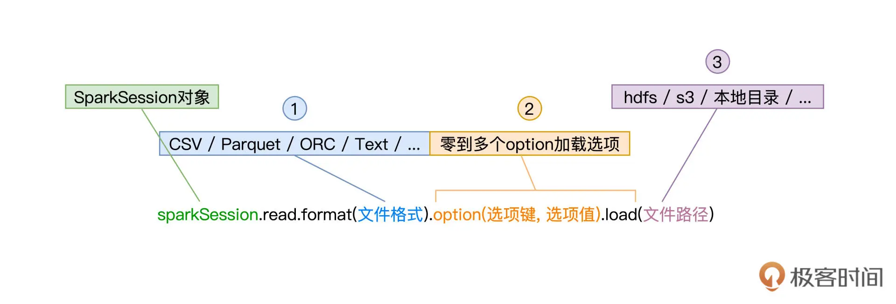

## 15 | 数据源与数据格式：DataFrame从何而来？

在上一讲，我们重点讲解了 DataFrame 与 Spark SQL 的渊源，并提到，DataFrame 是 Spark SQL 的重要入口。换句话说，通过创建 DataFrame 并沿用 DataFrame 开发 API，我们才能充分利用 Spark SQL 优化引擎提供种种“性能红利”。显然，对于初学者来说，第一步的创建 DataFrame 就变得至关重要。

之前 第 13 讲，我们做小汽车摇号倍率分析时，用了 `SparkSession` 的 `read` API 从 `Parquet` 文件创建 `DataFrame`，其实创建 DataFrame 的方法还有很多。毫不夸张地说，DataFrame 的创建途径异常丰富，为什么这么说呢？如下图所示，Spark 支持多种数据源，按照数据来源进行划分，这些数据源可以分为如下几个大类：`Driver` 端自定义的数据结构、（分布式）文件系统、关系型数据库 RDBMS、关系型数据仓库、`NoSQL` 数据库，以及其他的计算引擎。


显然，要深入地介绍 Spark 与每一种数据源的集成并不现实，也没必要，咱们只需要把注意力放在那些最常用、最常见的集成方式即可。这一讲，我会从 `Driver`、文件系统与 RDBMS 三个方面，为你讲解 5 种常见的 DataFrame 创建方式，然后带你了解不同方式的使用场景跟优劣分析。

### 1. 从 Driver 创建 DataFrame

在 Driver 端，Spark 可以直接从数组、元组、映射等数据结构创建 DataFrame。使用这种方式创建的 DataFrame 通常数据量有限，因此这样的 DataFrame 往往不直接参与分布式计算，而是用于辅助计算或是数据探索。尽管如此，学习这部分知识点还是非常必要的，因为它可以帮我们更直观地理解 `DataFrame` 与 `RDD` 的关系。

还记得吗？在数据表示（Data Representation）上，相比 RDD，DataFrame 仅仅是多了一个 `Schema`。甚至可以说，DataFrame 就是带 `Schema` 的 `RDD`。因此，**创建 DataFrame 的第一种方法，就是先创建 RDD，然后再给它“扣上”一顶 Schema 的“帽子”**。

从本地数据结构创建 RDD，我们用的是 `SparkContext` 的 `parallelize` 方法，而给 RDD “扣帽子”，我们要用到 `SparkSession` 的 `createDataFrame` 方法。

#### 1.1 createDataFrame 方法

为了创建 RDD，我们先来定义列表数据 `seq`。`seq` 的每个元素都是二元元组，元组第一个元素的类型是 `String`，第二个元素的类型是 `Int`。有了列表数据结构，接下来我们创建 RDD，如下所示。

```
import org.apache.spark.rdd.RDD
val seq: Seq[(String, Int)] = Seq(("Bob", 14), ("Alice", 18))
val rdd: RDD[(String, Int)] = sc.parallelize(seq)
```

有了 RDD 之后，我们来给它制作一顶“帽子”，也就是我们刚刚说的 `Schema`。创建 `Schema`，我们需要用到 Spark SQL 内置的几种类型，如 `StructType`、`StructField`、`StringType`、`IntegerType`，等等。

其中，StructType 用于定义并封装 Schema，StructFiled 用于定义 Schema 中的每一个字段，包括字段名、字段类型，而像 StringType、IntegerType 这些 *Type 类型，表示的正是字段类型。为了和 RDD 数据类型保持一致，Schema 对应的元素类型应该是（`StringType`，`IntegerType`）。

```
import org.apache.spark.sql.types.{StringType, IntegerType, StructField, StructType}
val schema:StructType = StructType( Array(
StructField("name", StringType),
StructField("age", IntegerType)
))
```

好啦，到此为止，我们有了 RDD，也有了为它量身定做的“帽子”Schema。不过，在把帽子扣上去之前，我们还要先给 RDD 整理下“发型”。这是什么意思呢？

createDataFrame 方法有两个形参，第一个参数正是 `RDD`，第二个参数是 `Schema`。`createDataFrame` 要求 `RDD` 的类型必须是 `RDD[Row]`，其中的 `Row` 是 `org.apache.spark.sql.Row`，因此，对于类型为 `RDD[(String, Int)]` 的 `rdd`，我们需要把它转换为 `RDD[Row]`。

```
import org.apache.spark.sql.Row
val rowRDD: RDD[Row] = rdd.map(fileds => Row(fileds._1, fileds._2))
```

“发型”整理好之后，我们就可以调用 `createDataFrame` 来创建 `DataFrame`，代码如下所示。

```
import org.apache.spark.sql.DataFrame
val dataFrame: DataFrame = spark.createDataFrame(rowRDD,schema)
```

DataFrame 创建好之后，别忘了验证它的可用性，我们可以通过调用 `show` 方法来做简单的数据探索，验证 DataFrame 创建是否成功。

```
dataFrame.show
 
/** 结果显示
+----+---+
| name| age|
+----+---+
| Bob| 14|
| Alice| 18|
+----+---+
*/
```

历尽千辛万苦，我们先是用 Driver 端数据结构创建 RDD，然后再调用 createDataFrame 把 RDD 转化为 DataFrame。你可能会说：“相比用 `parallelize` 创建 RDD，用 `createDataFrame` 创建 DataFrame 的方法未免复杂了些，有没有更简便的方法呢？”我们接着往下看。

#### 1.2 toDF 方法

其实要把 RDD 转化为 DataFrame，我们并不一定非要亲自制作 Schema 这顶帽子，还可以直接在 RDD 之后调用 `toDF` 方法来做到这一点。咱们先来看 `toDF` 函数的用法，然后再去分析，`spark.implicits` 是如何帮我们轻松创建 DataFrame 的。

```
import spark.implicits._
val dataFrame: DataFrame = rdd.toDF
dataFrame.printSchema
/** Schema显示
root
|-- _1: string (nullable = true)
|-- _2: integer (nullable = false)
*/
```

可以看到，我们显示导入了 `spark.implicits` 包中的所有方法，然后通过在 RDD 之上调用 `toDF` 就能轻松创建 `DataFrame`。实际上，利用 `spark.implicits`，我们甚至可以跳过创建 RDD 这一步，直接通过 `seq` 列表来创建 `DataFrame`。

```
import spark.implicits._
val dataFrame: DataFrame = seq.toDF
dataFrame.printSchema
/** Schema显示
root
|-- _1: string (nullable = true)
|-- _2: integer (nullable = false)
*/
```

是不是感觉这个方法很简洁、很轻松？不过，你可能会问：“既然有 toDF 这条捷径，一开始干嘛还要花功夫去学步骤繁琐的 createDataFrame 方法呢？”

网络上流行过这么一句话：“你的岁月静好，是有人在背后帮你负重前行。”toDF 也是同样的道理，我们之所以能用 toDF 轻松创建 DataFrame，关键在于 spark.implicits 这个包提供了各种隐式方法。

**隐式方法是 Scala 语言中一类特殊的函数，这类函数不需要开发者显示调用，函数体中的计算逻辑在适当的时候会自动触发。正是它们在背后默默地帮我们用 seq 创建出 RDD，再用 `createDataFrame` 方法把 RDD 转化为 DataFrame**。

### 2. 从文件系统创建 DataFrame

说完第一类数据源，接下来，我们再来看看 Spark 如何从文件系统创建 DataFrame。

Spark 支持多种文件系统，常见的有 `HDFS`、`Amazon S3`、`本地文件系统`，等等。不过无论哪种文件系统，Spark 都要通过 `SparkSession` 的 `read` API 来读取数据并创建 `DataFrame`。所以接下来，我们需要先弄明白 `read` API 要怎样使用，都有哪些注意事项。

`read` API 由 `SparkSession` 提供，它允许开发者以统一的形式来创建 DataFrame，如下图所示。



可以看到，要使用 read API 创建 DataFrame，开发者只需要调用 SparkSession 的 `read` 方法，同时提供 3 类参数即可。这 3 类参数分别是文件格式、加载选项和文件路径，它们分别由函数 `format`、`option` 和 `load` 来指定。

先来看第 1 类参数文件格式，它就是文件的存储格式，如 `CSV（Comma Separated Values）`、`Text`、`Parquet`、`ORC`、`JSON`。Spark SQL 支持种类丰富的文件格式，除了这里列出的几个例子外，Spark SQL 还支持像 Zip 压缩文件、甚至是图片 `Image` 格式。

完整的格式支持，你可以参考下图，或是访问官网给出的列表。在后续的讲解中，我们还会挑选一些常用的数据格式来演示 read API 的具体用法。


文件格式决定了第 2 类参数加载选项的可选集合，也就是说，不同的数据格式，可用的选型有所不同。比如，CSV 文件格式可以通过 `option(“header”, true)`，来表明 CSV 文件的首行为 `Data Schema`，但其他文件格式就没有这个选型。之后讲到常见文件格式用法时，我们再对其加载选项做具体讲解。

值得一提的是，加载选项可以有零个或是多个，当需要指定多个选项时，我们可以用 “option(选项 1, 值 1).option(选项 2, 值 2)” 的方式来实现。

read API 的第 3 类参数是文件路径，这个参数很好理解，它就是文件系统上的文件定位符。比如本地文件系统中的 “/dataSources/wikiOfSpark.txt”，HDFS 分布式文件系统中的 “hdfs://hostname:port/myFiles/userProfiles.csv”，或是 Amazon S3 上的 “s3://myBucket/myProject/myFiles/results.parquet”，等等。

了解了 read API 的一般用法之后，接下来，我们结合一些常见的数据格式，来进行举例说明。对于那些在这节课没有展开介绍的文件格式，你可以参考[官网给出的用法](https://docs.databricks.com/external-data/index.html)来做开发。

#### 2.1 从 CSV 创建 DataFrame

以可读性好的纯文本方式来存储结构化数据，CSV 文件格式的身影常见于数据探索、数据分析、机器学习等应用场景。经过上面的分析，我们知道，要从 CSV 文件成功地创建 DataFrame，关键在于了解并熟悉与之有关的加载选项。那么我们就来看看，CSV 格式都有哪些对应的 `option`，它们的含义都是什么。


从上往下看，首先是“header”，header 的设置值为布尔值，也即 true 或 false，它用于指定 CSV 文件的首行是否为列名。如果是的话，那么 Spark SQL 将使用首行的列名来创建 DataFrame，否则使用“_c”加序号的方式来命名每一个数据列，比如“_c0”、“_c1”，等等。

对于加载的每一列数据，不论数据列本身的含义是什么，Spark SQL 都会将其视为 `String` 类型。例如，对于后面这个 CSV 文件，Spark SQL 将 “name” 和 “age” 两个字段都视为 String 类型。

```
name,age
alice,18
bob,14
```

```
import org.apache.spark.sql.DataFrame
val csvFilePath: String = _
val df: DataFrame = spark.read.format("csv").option("header", true).load(csvFilePath)
// df: org.apache.spark.sql.DataFrame = [name: string, age: string]
df.show
/** 结果打印
+-----+---+
| name| age|
+-----+---+
| alice| 18|
| bob| 14|
+-----+---+
*/
```

要想在加载的过程中，为 DataFrame 的每一列指定数据类型，我们需要显式地定义 Data Schema，并在 `read` API 中通过调用 schema 方法，来将 Schema 传递给 Spark SQL。Data Schema 的定义我们讲 `createDataFrame` 函数的时候提过，咱们不妨一起来回顾一下。

```
import org.apache.spark.sql.types.{StringType, IntegerType, StructField, StructType}

val schema:StructType = StructType( Array(
StructField("name", StringType),
StructField("age", IntegerType)
))
```

调用 schema 方法来传递 Data Schema：

```
val csvFilePath: String = _

val df: DataFrame = spark.read.format("csv").schema(schema).option("header", true).load(csvFilePath)
// df: org.apache.spark.sql.DataFrame = [name: string, age: int]
```

可以看到，在使用 schema 方法明确了 Data Schema 以后，数据加载完成之后创建的 DataFrame 类型由原来的 `“[name: string, age: string]”`，变为 `“[name: string, age: int]”`。需要注意的是，**并不是所有文件格式都需要 `schema` 方法来指定 Data Schema**，因此在 `read` API 的一般用法中，`schema` 方法并不是必需环节。


好，我们接着说 CSV 格式的 `option` 选项。在 “header” 之后，第二个选项是 “seq”，它是用于分隔列数据的分隔符，可以是任意字符串，默认值是逗号。常见的分隔符还有 `Tab`、“|”，等等。

之后的“escape”和“nullValue”分别用于指定文件中的转义字符和空值，而“dateFormat”则用于指定日期格式，它的设置值是任意可以转换为 Java SimpleDateFormat 类型的字符串，默认值是“yyyy-MM-dd”。

最后一个选项是“mode”，它用来指定文件的读取模式，更准确地说，它明确了 Spark SQL 应该如何对待 CSV 文件中的“脏数据”。所谓脏数据，它指的是数据值与预期数据类型不符的数据记录。比如说，CSV 文件中有一列名为“age”数据，它用于记录用户年龄，数据类型为整型 Int。那么显然，age 列数据不能出现像“8.5”这样的小数、或是像“8 岁”这样的字符串，这里的“8.5”或是“8 岁”就是我们常说的脏数据。

在不调用 schema 方法来显示指定 Data Schema 的情况下，Spark SQL 将所有数据列都看作是 String 类型。我们不难发现，`mode` 选项的使用，往往会与 `schema` 方法的调用如影随形。

`mode` 支持 3 个取值，分别是 `permissive`、`dropMalformed` 和 `failFast`，它们的含义如下表所示。


可以看到，除了“failFast”模式以外，另外两个模式都不影响 DataFrame 的创建。以下面的 CSV 文件为例，要想剔除脏数据，也就是 “cassie, six” 这条记录，同时正常加载满足类型要求的“干净”数据，我们需要同时结合 `schema` 方法与 `mode` 选项来实现。

CSV 文件内容：

```
name,age
alice,18
bob,14
cassie, six
```

调用 schema 方法来传递 Data Schema：

```
val csvFilePath: String = "./nameage.csv"
val df: DataFrame = spark.read.format("csv")
.schema(schema)
.option("header", true)
.option("mode", "dropMalformed")
.load(csvFilePath)
// df: org.apache.spark.sql.DataFrame = [name: string, age: int]
df.show
/** 结果打印
+-----+---+
| name| age|
+-----+---+
| alice| 18|
| bob| 14|
+-----+---+
*/
```

好啦，关于从 CSV 文件创建 DataFrame，我们就讲完了。不难发现，从 CSV 创建 DataFrame，过程相对比较繁琐，开发者需要注意的细节也很多。不过，毕竟 CSV 简单直接、跨平台、可读性好、应用广泛，因此掌握这部分开发技巧，还是非常值得的。

#### 2.2 从 Parquet/ORC 创建 DataFrame

接下来，我们就来说说 Parquet 格式和 ORC 格式，相比从 CSV 创建 DataFrame，这两个方法就没那么麻烦了。Parquet 与 ORC，都是应用广泛的列存（Column-based Store）文件格式。顾名思义，列存，是相对行存（Row-based Store）而言的。

在传统的行存文件格式中，数据记录以行为单位进行存储。虽然这非常符合人类的直觉，但在数据的检索与扫描方面，行存数据往往效率低下。例如，在数据探索、数据分析等数仓应用场景中，我们往往仅需扫描数据记录的某些字段，但在行存模式下，我们必须要扫描全量数据，才能完成字段的过滤。

SV 就是典型的行存数据格式，以如下的内容为例，如果我们想要统计文件中女生的数量，那么我们不得不扫描每一行数据，判断 `gender` 的取值，然后才能决定是否让当前记录参与计数。

CSV 文件内容：

```
name,age,gender
alice,18,female
bob,14,male
```

列存文件则不同，它以列为单位，对数据进行存储，每一列都有单独的文件或是文件块。还是以上面的文件内容为例，如果采用列存格式的话，那么文件的存储方式将会变成下面的样子。


可以看到，数据按列存储，想要统计女生的数量，我们只需扫描 gender` 列的数据文件，而不必扫描 `name` 与 `age` 字段的数据文件。相比行存，列存有利于大幅削减数据扫描所需的文件数量。

不仅如此，对于每一个列存文件或是文件块，列存格式往往会附加 `header` 和 `footer` 等数据结构，来记录列数据的统计信息，比如最大值、最小值、记录统计个数，等等。这些统计信息会进一步帮助提升数据访问效率，例如，对于 max=“male” 同时 min=“male” 的 `gender` 文件来说，在统计女生计数的时候，我们完全可以把这样的文件跳过，不进行扫描。

再者，很多列存格式往往在文件中记录 Data Schema，比如 Parquet 和 ORC，它们会利用 Meta Data 数据结构，来记录所存储数据的数据模式。这样一来，在读取类似列存文件时，我们无需再像读取 CSV 一样，去手工指定 Data Schema，这些繁琐的步骤都可以省去。因此，使用 read API 来读取 Parquet 或是 ORC 文件，就会变得非常轻松，如下所示。

使用 read API 读取 Parquet 文件：

```
val parquetFilePath: String = _
val df: DataFrame = spark.read.format("parquet").load(parquetFilePath)
```

使用 read API 读取 ORC 文件：

```
val orcFilePath: String = _
val df: DataFrame = spark.read.format("orc").load(orcFilePath)
```

可以看到，在 read API 的用法中，我们甚至不需要指定任何 option，只要有 format 和 load 这两个必需环节即可。是不是非常简单？

好啦，到此为止，我们梳理了如何从文件系统，在不同的数据格式下创建 DataFrame。在这一讲的最后，我们再来简单地了解一下如何从关系型数据库创建 DataFrame，毕竟，这个场景在我们日常的开发中还是蛮常见的。从 RDBMS 创建 DataFrame。

### 3. 从 RDBMS 创建 DataFrame

使用 read API 读取数据库，就像是使用命令行连接数据库那么简单。而使用命令行连接数据库，我们往往需要通过参数来指定数据库驱动、数据库地址、用户名、密码等关键信息。read API 也是一样，只不过，这些参数通通由 `option` 选项来指定，以 MySQL 为例，read API 的使用方法如下。

使用 read API 连接数据库并创建 DataFrame：

```
spark.read.format("jdbc")
.option("driver", "com.mysql.jdbc.Driver")
.option("url", "jdbc:mysql://hostname:port/mysql")
.option("user", "用户名")
.option("password","密码")
.option("numPartitions", 20)
.option("dbtable", "数据表名 ")
.load()
```

访问数据库，我们同样需要 format 方法来指定“数据源格式”，这里的关键字是 “jdbc”。请注意，由于数据库 URL 通过 `option` 来指定，因此调用 `load` 方法不再需要传入“文件路径”，我们重点来关注 `option` 选项的设置。

与命令行一样，option 选项同样需要 driver、url、user、password 这些参数，来指定数据库连接的常规设置。不过，毕竟调用 read API 的目的是创建 DataFrame，因此，我们还需要指定“dbtable”选项来确定要访问哪个数据表。

有意思的是，除了将表名赋值给“dbtable”以外，我们还可以把任意的 SQL 查询语句赋值给该选项，这样在数据加载的过程中就能完成数据过滤，提升访问效率。例如，我们想从 `users` 表选出所有的女生数据，然后在其上创建 DataFrame。

```
val sqlQuery: String = “select * from users where gender = ‘female’”
spark.read.format("jdbc")
.option("driver", "com.mysql.jdbc.Driver")
.option("url", "jdbc:mysql://hostname:port/mysql")
.option("user", "用户名")
.option("password","密码")
.option("numPartitions", 20)
.option("dbtable", sqlQuery)
.load()
```

此外，为了提升后续的并行处理效率，我们还可以通过 “numPartitions” 选项来控制 DataFrame 的并行度，也即 DataFrame 的 `Partitions` 数量。

要额外注意的是，在默认情况下，Spark 安装目录并没有提供与数据库连接有关的任何 Jar 包，因此，对于想要访问的数据库，不论是 MySQL、PostgreSQL，还是 Oracle、DB2，我们都需要把相关 Jar 包手工拷贝到 Spark 安装目录下的 Jars 文件夹。与此同时，我们还要在 spark-shell 命令或是 spark-submit 中，通过如下两个命令行参数，来告诉 Spark 相关 Jar 包的访问地址。

- –driver-class-path mysql-connector-java-version.jar
- –jars mysql-connector-java-version.jar

好啦，到此为止，这一讲的内容就全部讲完啦！今天的内容有点多，我们来一起总结一下。

### 4. 重点回顾

天这一讲，我们聚焦在 DataFrame 的创建方式上。Spark 支持种类丰富的数据源与数据格式，我们今天的重点，是通过 Driver、文件系统和关系型数据库，来创建 DataFrame。

在 Driver 端，我们可以使用 createDataFrame 方法来创建 DataFrame，需要注意的是，这种创建方式有两个前提条件。**一是底层 RDD 的类型必须是 RDD[Row]，二是我们需要手工创建 Data Schema**。Schema 的创建需要用到 StructType、StructField 等数据类型，你要牢记在心。

```
import org.apache.spark.sql.types.{StringType, IntegerType, StructField, StructType}
val schema:StructType = StructType( Array(
StructField("name", StringType),
StructField("age", IntegerType)
))
```

除了这种比较繁琐的方式之外，我们还可以利用 spark.implicits._ 提供的隐式方法，通过在 RDD 或是原始序列数据之上调用 toDF 方法，轻松创建 DataFrame。

接着，使用 SparkSession 的 read API，我们分别讲解了从 CSV、Parquet、ORC 和关系型数据库创建 DataFrame 的一般方法。read API 调用的一般方法，需要你熟练掌握。


由于 Parquet、ORC 这类列存格式在文件中内置了 Data Schema，因此，访问这类文件格式，只有 format 和 load 两个方法是必需的。

相比之下，读取 CSV 较为复杂。首先，为了指定 Data Schema，开发者需要额外通过 schema 方法，来输入预定义的数据模式。再者，CSV 的 option 选项比较多，你可以参考后面的表格，来更好地控制 CSV 数据的加载过程。


最后，我们学习了 read API 访问 RDBMS 的一般方法。与命令行的访问方式类似，你需要通过多个 option 选项，来指定数据库连接所必需的访问参数，如数据库驱动、URL 地址、用户名、密码，等等。特别地，你还可以为“dbtable”选项指定表名或是查询语句，对数据的加载过程进行干预和控制。

### Reference

- [15 | 数据源与数据格式：DataFrame从何而来？](https://time.geekbang.org/column/article/426101)