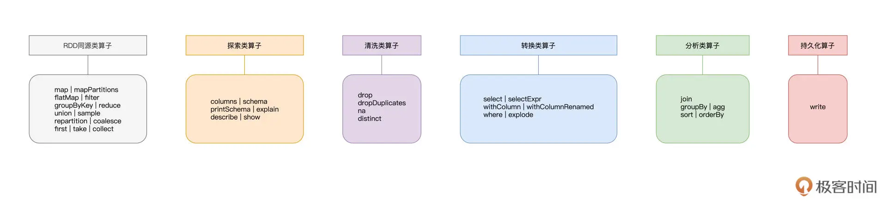
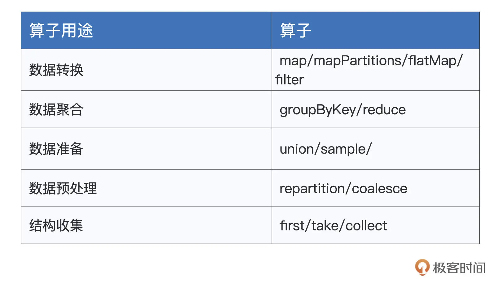
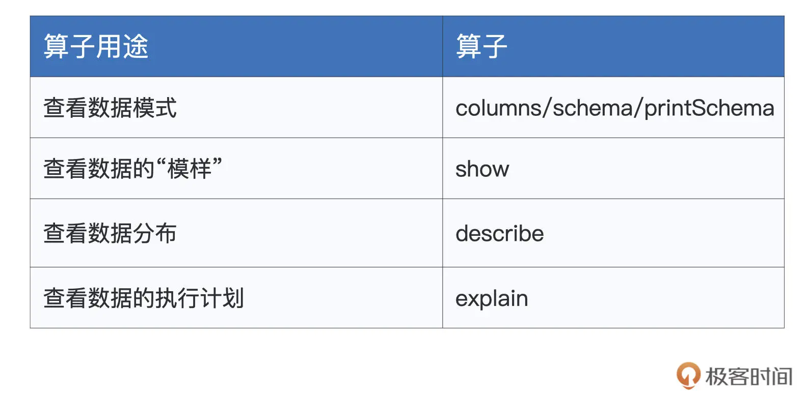
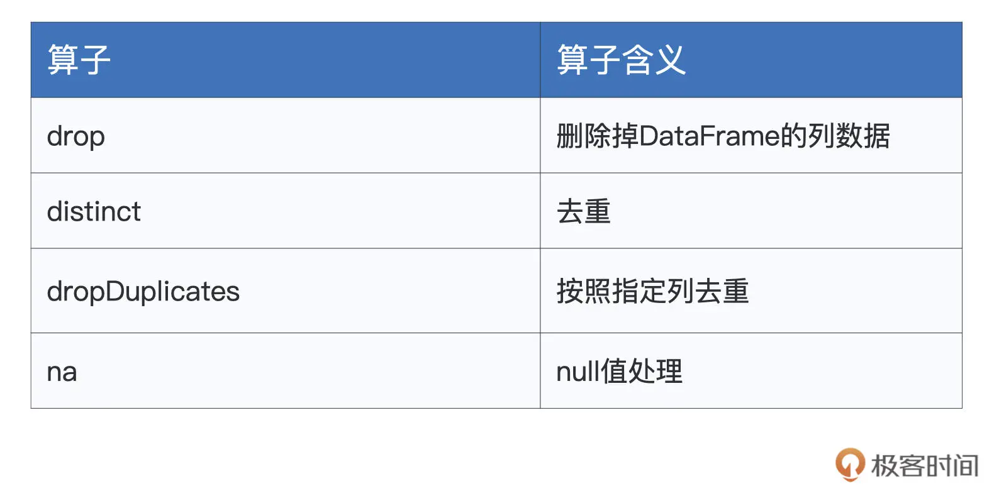
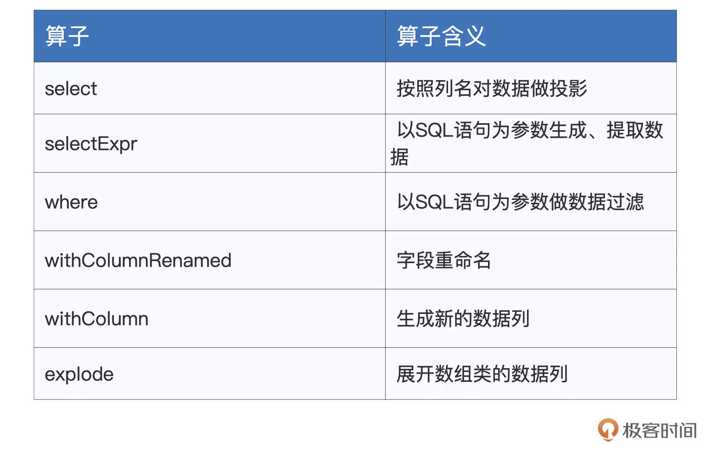
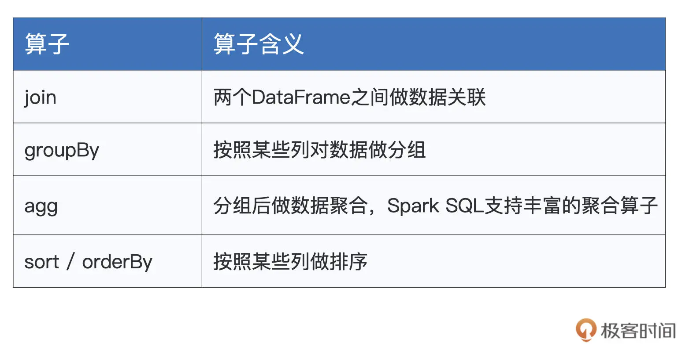
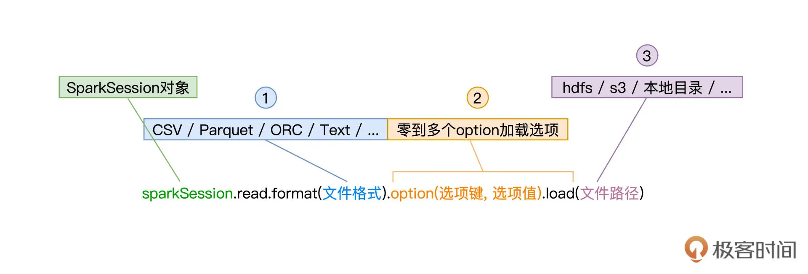
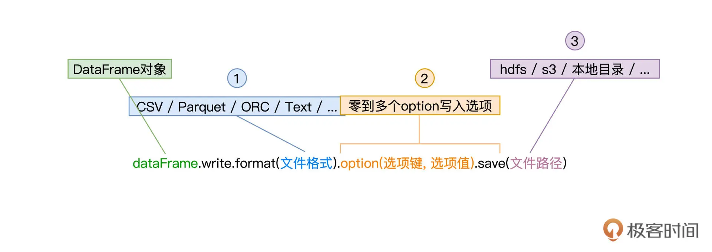
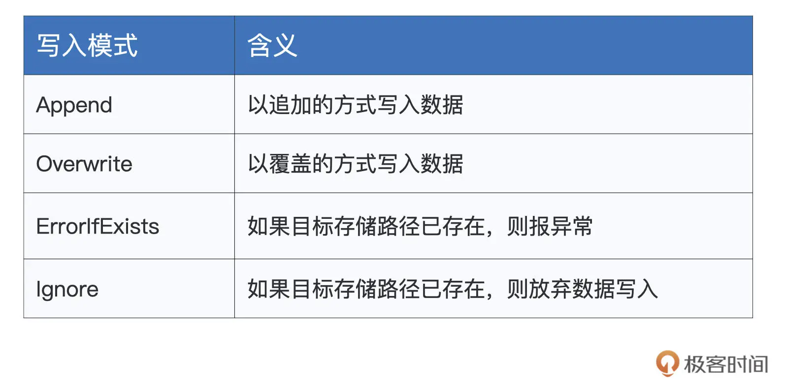

## 16 | 数据转换：如何在DataFrame之上做数据处理？

在上一讲，我们学习了创建 `DataFrame` 的各种途径与方法，那么，有了 `DataFrame` 之后，我们该如何在 `DataFrame` 之上做数据探索、数据分析，以及各式各样的数据转换呢？在数据处理完毕之后，我们又该如何做数据展示与数据持久化呢？今天这一讲，我们就来解答这些疑问。

为了给开发者提供足够的灵活性，对于 `DataFrame` 之上的数据处理，Spark SQL 支持两类开发入口：**一个是大家所熟知的结构化查询语言：SQL，另一类是 `DataFrame` 开发算子**。就开发效率与执行效率来说，二者并无优劣之分，选择哪种开发入口，完全取决于开发者的个人偏好与开发习惯。

与 RDD 类似，DataFrame 支持种类繁多的开发算子，但相比 SQL 语言，DataFrame 算子的学习成本相对要高一些。因此，本着先易后难的思路，咱们先来说说 DataFrame 中 SQL 语句的用法，然后再去理解 DataFrame 开发算子。

### 1. SQL 语句

对于任意的 DataFrame，我们都可以使用 `createTempView` 或是 `createGlobalTempView` 在 Spark SQL 中创建临时数据表。

两者的区别在于，`createTempView` 创建的临时表，其生命周期仅限于 `SparkSession` 内部，而 `createGlobalTempView` 创建的临时表，可以在同一个应用程序中跨 `SparkSession` 提供访问。有了临时表之后，我们就可以使用 SQL 语句灵活地倒腾表数据。

通过后面这段代码，我为你演示了如何使用 `createTempView` 创建临时表。我们首先用 `toDF` 创建了一个包含名字和年龄的 `DataFrame`，然后调用 `createTempView` 方法创建了临时表。

```
import org.apache.spark.sql.DataFrame
import spark.implicits._
 
val seq = Seq(("Alice", 18), ("Bob", 14))
val df = seq.toDF("name", "age")
 
df.createTempView("t1")
val query: String = "select * from t1"
// spark为SparkSession实例对象
val result: DataFrame = spark.sql(query)
 
result.show
 
/** 结果打印
+-----+---+
| n ame| age|
+-----+---+
| Alice| 18|
| Bob| 14|
+-----+---+
*/
```

以上表为例，我们先是使用 `spark.implicits._` 隐式方法通过 `toDF` 来创建 `DataFrame`，然后在其上调用 `createTempView` 来创建临时表 “t1”。接下来，给定 SQL 查询语句 “query”，我们可以通过调用 `SparkSession` 提供的 `sql` API 来提请执行查询语句，得到的查询结果被封装为新的 DataFrame。

值得一提的是，与 RDD 的开发模式一样，**DataFrame 之间的转换也属于延迟计算，当且仅当出现 `Action` 类算子时，如上表中的 `show`，所有之前的转换过程才会交付执行**。

Spark SQL 采用 [ANTLR](https://www.antlr.org/) 语法解析器，来解析并处理 SQL 语句。我们知道，ANTLR 是一款强大的、跨语言的语法解析器，因为它全面支持 SQL 语法，所以广泛应用于 Oracle、Presto、Hive、ElasticSearch 等分布式数据仓库和计算引擎。因此，像 Hive 或是 Presto 中的 SQL 查询语句，都可以平滑地迁移到 Spark SQL。

不仅如此，Spark SQL 还提供大量 `Built-in Functions`（内置函数），用于辅助数据处理，如 `array_distinct`、`collect_list`，等等。你可以浏览[官网的 Built-in Functions 页面]((https://spark.apache.org/docs/3.0.1/api/sql/index.html))查找完整的函数列表。结合 SQL 语句以及这些灵活的内置函数，你就能游刃有余地应对数据探索、数据分析这些典型的数据应用场景。

SQL 语句相对比较简单，学习路径短、成本低，你只要搞清楚如何把 DataFrame 转化为数据表，剩下的事就水到渠成了。接下来，我们把主要精力放在 DataFrame 支持的各类算子上，这些算子提供的功能，往往能大幅提升开发效率，让我们事半功倍。

### 2. DataFrame 算子

不得不说，DataFrame 支持的算子丰富而又全面，这主要源于 DataFrame 特有的“双面”属性。一方面，DataFrame 来自 RDD，与 RDD 具有同源性，因此 RDD 支持的大部分算子，DataFrame 都支持。另一方面，DataFrame 携带 Schema，是结构化数据，因此它必定要提供一套与结构化查询同源的计算算子。

正是由于这样“双面”的特性，我们从下图可以看到，DataFrame 所支持的算子，用“琳琅满目”来形容都不为过。



人类的大脑偏好结构化的知识，为了方便你记忆与理解，我把 DataFrame 上述两个方面的算子，进一步划分为 6 大类，**它们分别是 RDD 同源类算子、探索类算子、清洗类算子、转换类算子、分析类算子和持久化算子**。

你可能会困扰：“天呐！这么多算子要学，这不是逼我从入门到放弃吗？”别着急，上面这张图，你可以把它当作是“DataFrame 算子脑图”，或是一本字典。在日常的开发中，思路枯竭的时候，你不妨把它翻出来，看看哪些算子能够帮你实现业务逻辑。今天这一讲，我们也会根据这张“脑图”，重点讲解其中最常用、最关键的部分。

#### 2.1 同源类算子

我们从 DataFrame 中的 RDD 同源类算子说起，这些算子在 RDD 算子那三讲做过详细的介绍，如果你对有哪个算子的作用或含义记不清了，不妨回看之前的三讲。我按照之前的分类，把这些算子整理成了一张表格。



#### 2.2 探索类算子

接下来就是 DataFrame 的探索类算子。所谓探索，指的是数据探索，这类算子的作用，在于帮助开发者初步了解并认识数据，比如数据的模式（`Schema`）、数据的分布、数据的“模样”，等等，为后续的应用开发奠定基础。

对于常用的探索类算子，我把它们整理到了下面的表格中，你不妨先看一看，建立“第一印象”。



我们来依次“避轻就重”地说一说这些算子。首先，`columns/schema/printSchema` 这 3 个算子类似，都可以帮我们获取 DataFrame 的数据列和 `Schema`。尤其是 `printSchema`，它以纯文本的方式将 Data Schema 打印到屏幕上，如下所示。

```
import org.apache.spark.sql.DataFrame
import spark.implicits._
 
val employees = Seq((1, "John", 26, "Male"), (2, "Lily", 28, "Female"), (3, "Raymond", 30, "Male"))
val employeesDF: DataFrame = employees.toDF("id", "name", "age", "gender")
 
employeesDF.printSchema
 
/** 结果打印
root
|-- id: integer (nullable = false)
|-- name: string (nullable = true)
|-- age: integer (nullable = false)
|-- gender: string (nullable = true)
*/
```

了解数据模式之后，我们往往想知道数据具体长什么样子，对于这个诉求，`show` 算子可以帮忙达成。在默认情况下，`show` 会随机打印出 DataFrame 的 20 条数据记录。

```
employeesDF.show
 
/** 结果打印
+---+-------+---+------+
| id| name|age|gender|
+---+-------+---+------+
| 1| John| 26| Male|
| 2| Lily| 28|Female|
| 3|Raymond| 30| Male|
+---+-------+---+------+
*/
```

看清了数据的“本来面目”之后，你还可以进一步利用 `describe` 去查看数值列的统计分布。比如，通过调用 `employeesDF.describe(“age”)`，你可以查看 `age` 列的极值、平均值、方差等统计数值。

初步掌握了数据的基本情况之后，如果你对当前 DataFrame 的执行计划感兴趣，可以通过调用 `explain` 算子来获得 Spark SQL 给出的执行计划。`explain` 对于执行效率的调优来说，有着至关重要的作用，后续课程中我们还会结合具体的实例，来深入讲解 `explain` 的用法和释义，在这里，你仅需知道 `explain` 是用来查看执行计划的就好。

#### 2.3 清洗类算子

完成数据探索以后，我们正式进入数据应用的开发阶段。在数据处理前期，我们往往需要对数据进行适当地“清洗”，“洗掉”那些不符合业务逻辑的“脏数据”。DataFrame 提供了如下算子，来帮我们完成这些脏活儿、累活儿。



首先，`drop` 算子允许开发者直接把指定列从 DataFrame 中予以清除。举个例子，对于上述的 `employeesDF`，假设我们想把性别列清除，那么直接调用 `employeesDF.drop(“gender”)` 即可。如果要同时清除多列，只需要在 `drop` 算子中用逗号把多个列名隔开即可。

第二个是 `distinct`，它用来为 DataFrame 中的数据做去重。还是以 `employeesDF` 为例，当有多条数据记录的所有字段值都相同时，使用 `distinct` 可以仅保留其中的一条数据记录。

接下来是 `dropDuplicates`，它的作用也是去重。不过，与 `distinct` 不同的是，`dropDuplicates` 可以指定数据列，因此在灵活性上更胜一筹。还是拿 `employeesDF` 来举例，这个 DataFrame 原本有 3 条数据记录，如果我们按照性别列去重，最后只会留下两条记录。其中，一条记录的 `gender` 列是 “Male”，另一条的 `gender` 列为 “Female”，如下所示。

```
employeesDF.show
 
/** 结果打印
+---+-------+---+------+
| id| name|age|gender|
+---+-------+---+------+
| 1| John| 26| Male|
| 2| Lily| 28|Female|
| 3|Raymond| 30| Male|
+---+-------+---+------+
*/
 
employeesDF.dropDuplicates("gender").show
 
/** 结果打印
+---+----+---+------+
| id|name|age|gender|
+---+----+---+------+
| 2|Lily| 28|Female|
| 1|John| 26| Male|
+---+----+---+------+
*/
```

表格中的最后一个算子是 na，它的作用是选取 DataFrame 中的 `null` 数据，`na` 往往要结合 `drop` 或是 `fill` 来使用。例如，`employeesDF.na.drop` 用于删除 DataFrame 中带 `null` 值的数据记录，而 `employeesDF.na.fill(0)` 则将 DataFrame 中所有的 `null` 值都自动填充为整数零。这两种用例在数据清洗的场景中都非常常见，因此，你需要牢牢掌握 `na.drop` 与 `na.fill` 的用法。

数据清洗过后，我们就得到了一份“整洁而又干净”的数据，接下来，可以放心大胆地去做各式各样的数据转换，从而实现业务逻辑需求。

#### 2.4 转换类算子

转换类算子的主要用于数据的生成、提取与转换。转换类的算子的数量并不多，但使用方式非常灵活，开发者可以变着花样地变换数据。



首先，select 算子让我们可以按照列名对 DataFrame 做投影，比如说，如果我们只关心年龄与性别这两个字段的话，就可以使用下面的语句来实现。

```
employeesDF.select("name", "gender").show
 
/** 结果打印
+-------+------+
| name|gender|
+-------+------+
| John| Male|
| Lily|Female|
|Raymond| Male|
+-------+------+
*/
```

不过，虽然用起来比较简单，但 `select` 算子在功能方面不够灵活。在灵活性这方面，`selectExpr` 做得更好。比如说，基于 `id` 和姓名，我们想把它们拼接起来生成一列新的数据。像这种需求，正是 `selectExpr` 算子的用武之地。

```
employeesDF.selectExpr("id", "name", "concat(id, '_', name) as id_name").show
 
/** 结果打印
+---+-------+---------+
| id| name| id_name|
+---+-------+---------+
| 1| John| 1_John|
| 2| Lily| 2_Lily|
| 3|Raymond|3_Raymond|
+---+-------+---------+
*/
```

这里，我们使用 `concat` 这个函数，把 `id` 列和 `name` 列拼接在一起，生成新的 `id_name` 数据列。

接下来的 `where` 和 `withColumnRenamed` 这两个算子比较简单，`where` 使用 SQL 语句对 DataFrame 做数据过滤，而 `withColumnRenamed` 的作用是字段重命名。

比如，想要过滤出所有性别为男的员工，我们就可以用 `employeesDF.where(“gender = ‘Male’”)` 来实现。如果打算把 `employeesDF` 当中的 “gender” 重命名为“sex”，就可以用 `withColumnRenamed` 来帮忙：employeesDF.withColumnRenamed(“gender”, “sex”)。

紧接着的是 `withColumn`，虽然名字看上去和 `withColumnRenamed` 很像，但二者在功能上有着天壤之别。

`withColumnRenamed` 是重命名现有的数据列，而 `withColumn` 则用于生成新的数据列，这一点上，`withColumn` 倒是和 `selectExpr` 有着异曲同工之妙。`withColumn` 也可以充分利用 Spark SQL 提供的 `Built-in Functions` 来灵活地生成数据。

比如，基于年龄列，我们想生成一列脱敏数据，隐去真实年龄，你就可以这样操作。

```
employeesDF.withColumn("crypto", hash($"age")).show
 
/** 结果打印
+---+-------+---+------+-----------+
| id| name|age|gender| crypto|
+---+-------+---+------+-----------+
| 1| John| 26| Male|-1223696181|
| 2| Lily| 28|Female|-1721654386|
| 3|Raymond| 30| Male| 1796998381|
+---+-------+---+------+-----------+
*/
```

可以看到，我们使用内置函数 `hash`，生成一列名为 “crypto” 的新数据，数据值是对应年龄的哈希值。有了新的数据列之后，我们就可以调用刚刚讲的 `drop`，把原始的 `age` 字段丢弃掉。

表格中的最后一个算子是 `explode`，这个算子很有意思，它的作用是展开数组类型的数据列，数组当中的每一个元素，都会生成一行新的数据记录。为了更好地演示 `explode` 的用法与效果，我们把 `employeesDF` 数据集做个简单的调整，给它加上一个 `interests` 兴趣字段。

```
val seq = Seq( (1, "John", 26, "Male", Seq("Sports", "News")),
(2, "Lily", 28, "Female", Seq("Shopping", "Reading")),
(3, "Raymond", 30, "Male", Seq("Sports", "Reading"))
)
 
val employeesDF: DataFrame = seq.toDF("id", "name", "age", "gender", "interests")
employeesDF.show
 
/** 结果打印
+---+-------+---+------+-------------------+
| id| name|age|gender| interests|
+---+-------+---+------+-------------------+
| 1| John| 26| Male| [Sports, News]|
| 2| Lily| 28|Female|[Shopping, Reading]|
| 3|Raymond| 30| Male| [Sports, Reading]|
+---+-------+---+------+-------------------+
*/
 
employeesDF.withColumn("interest", explode($"interests")).show
 
/** 结果打印
+---+-------+---+------+-------------------+--------+
| id| name|age|gender| interests|interest|
+---+-------+---+------+-------------------+--------+
| 1| John| 26| Male| [Sports, News]| Sports|
| 1| John| 26| Male| [Sports, News]| News|
| 2| Lily| 28|Female|[Shopping, Reading]|Shopping|
| 2| Lily| 28|Female|[Shopping, Reading]| Reading|
| 3|Raymond| 30| Male| [Sports, Reading]| Sports|
| 3|Raymond| 30| Male| [Sports, Reading]| Reading|
+---+-------+---+------+-------------------+--------+
*/
```

可以看到，我们多加了一个兴趣列，列数据的类型是数组，每个员工都有零到多个兴趣。

如果我们想把数组元素展开，让每个兴趣都可以独占一条数据记录。这个时候就可以使用 `explode`，再结合 `withColumn`，生成一列新的 `interest` 数据。这列数据的类型是单个元素的 String，而不再是数组。有了新的 `interest` 数据列之后，我们可以再次利用 `drop` 算子，把原本的 `interests` 列抛弃掉。

据转换完毕之后，我们就可以通过数据的关联、分组、聚合、排序，去做数据分析，从不同的视角出发去洞察数据。这个时候，我们还要依赖 Spark SQL 提供的多个分析类算子。

#### 2.5 分析类算子

毫不夸张地说，前面的探索、清洗、转换，都是在为数据分析做准备。在大多数的数据应用中，**数据分析往往是最为关键的那环，甚至是应用本身的核心目的**。因此，熟练掌握分析类算子，有利于我们提升开发效率。

park SQL 的分析类算子看上去并不多，但灵活组合使用，就会有“千变万化”的效果，让我们一起看看。



为了演示上述算子的用法，我们先来准备两张数据表：`employees` 和 `salaries`，也即员工信息表和薪水表。我们的想法是，通过对两张表做数据关联，来分析员工薪水的分布情况。

```
import spark.implicits._
import org.apache.spark.sql.DataFrame
 
// 创建员工信息表
val seq = Seq((1, "Mike", 28, "Male"), (2, "Lily", 30, "Female"), (3, "Raymond", 26, "Male"))
val employees: DataFrame = seq.toDF("id", "name", "age", "gender")
 
// 创建薪水表
val seq2 = Seq((1, 26000), (2, 30000), (4, 25000), (3, 20000))
val salaries:DataFrame = seq2.toDF("id", "salary")
 
employees.show
 
/** 结果打印
+---+-------+---+------+
| id| name|age|gender|
+---+-------+---+------+
| 1| Mike| 28| Male|
| 2| Lily| 30|Female|
| 3|Raymond| 26| Male|
+---+-------+---+------+
*/
 
salaries.show
 
/** 结果打印
+---+------+
| id|salary|
+---+------+
| 1| 26000|
| 2| 30000|
| 4| 25000|
| 3| 20000|
+---+------+
*/
```

那么首先，我们先用 `join` 算子把两张表关联起来，关联键（Join Keys）我们使用两张表共有的 `id` 列，而关联形式（Join Type）自然是内关联（Inner Join）。

```
val jointDF: DataFrame = salaries.join(employees, Seq("id"), "inner")
 
jointDF.show
 
/** 结果打印
+---+------+-------+---+------+
| id|salary| name|age|gender|
+---+------+-------+---+------+
| 1| 26000| Mike| 28| Male|
| 2| 30000| Lily| 30|Female|
| 3| 20000|Raymond| 26| Male|
+---+------+-------+---+------+
*/
```

可以看到，我们在 salaries 之上调用 join 算子，join 算子的参数有 3 类。第一类是待关联的数据表，在我们的例子中就是员工表 employees。第二类是关联键，也就是两张表之间依据哪些字段做关联，我们这里是 id 列。第三类是关联形式，我们知道，关联形式有 inner、left、right、anti、semi 等等，这些关联形式我们下一讲再展开，这里你只需要知道 Spark SQL 支持这些种类丰富的关联形式即可。

数据完成关联之后，我们实际得到的仅仅是最细粒度的事实数据，也就是每个员工每个月领多少薪水。这样的事实数据本身并没有多少价值，我们往往需要从不同的维度出发，对数据做分组、聚合，才能获得更深入、更有价值的数据洞察。

比方说，我们想以性别为维度，统计不同性别下的总薪水和平均薪水，借此分析薪水与性别之间可能存在的关联关系。

```
val aggResult = fullInfo.groupBy("gender").agg(sum("salary").as("sum_salary"), avg("salary").as("avg_salary"))
 
aggResult.show
 
/** 数据打印
+------+----------+----------+
|gender|sum_salary|avg_salary|
+------+----------+----------+
|Female| 30000| 30000.0|
| Male| 46000| 23000.0|
+------+----------+----------+
*/
```

这里，我们先是使用 groupBy 算子按照“gender”列做分组，然后使用 agg 算子做聚合运算。在 agg 算子中，我们分别使用 sum 和 avg 聚合函数来计算薪水的总数和平均值。Spark SQL 对于聚合函数的支持，我们同样可以通过Built-in Functions 页面来进行检索。结合 Built-in Functions 提供的聚合函数，我们就可以灵活地对数据做统计分析。

得到统计结果之后，为了方便查看，我们还可以使用 sort 或是 orderBy 算子对结果集进行排序，二者在用法与效果上是完全一致的，如下表所示。

```
aggResult.sort(desc("sum_salary"), asc("gender")).show
 
/** 结果打印
+------+----------+----------+
|gender|sum_salary|avg_salary|
+------+----------+----------+
| Male| 46000| 23000.0|
|Female| 30000| 30000.0|
+------+----------+----------+
*/
 
aggResult.orderBy(desc("sum_salary"), asc("gender")).show
 
/** 结果打印
+------+----------+----------+
|gender|sum_salary|avg_salary|
+------+----------+----------+
| Male| 46000| 23000.0|
|Female| 30000| 30000.0|
+------+----------+----------+
*/
```

可以看到，sort / orderBy 支持按照多列进行排序，且可以通过 desc 和 asc 来指定排序方向。其中 desc 表示降序排序，相应地，asc 表示升序排序。

好啦，到此为止，我们沿着数据的生命周期，分别梳理了生命周期不同阶段的 Spark SQL 算子，它们分别是探索类算子、清洗类算子、转换类算子和分析类算子。


所谓行百里者半九十，纵观整个生命周期，我们还剩下数据持久化这一个环节。对于最后的这个持久化环节，Spark SQL 提供了 write API，与上一讲介绍的 read API 相对应，write API 允许开发者把数据灵活地物化为不同的文件格式。

#### 2.6 持久化算子

没有对比就没有鉴别，在学习 write API 之前，我们不妨先来回顾一下上一讲介绍的 read API。



如上图所示，read API 有 3 个关键点，一是由 format 指定的文件格式，二是由零到多个 option 组成的加载选项，最后一个是由 load 标记的源文件路径。

与之相对，write API 也有 3 个关键环节，分别是同样由 format 定义的文件格式，零到多个由 option 构成的“写入选项”，以及由 save 指定的存储路径，如下图所示。



这里的 format 和 save，与 read API 中的 format 和 load 是一一对应的，分别用于指定文件格式与存储路径。实际上，option 选项也是类似的，除了 mode 以外，write API 中的选项键与 read API 中的选项键也是相一致的，如 seq 用于指定 CSV 文件分隔符、dbtable 用于指定数据表名、等等，你可以通过回顾上一讲来获取更多的 option 选项。

在 read API 中，`mode` 选项键用于指定读取模式，如 `permissive`, `dropMalformed`, `failFast`。但在 `write` API 中，`mode` 用于指定“写入模式”，分别有 `Append`、`Overwrite`、`ErrorIfExists`、`Ignore` 这 4 种模式，它们的含义与描述如下表所示。



有了 write API，我们就可以灵活地把 DataFrame 持久化到不同的存储系统中，为数据的生命周期画上一个圆满的句号。

### 3. 重点回顾

今天这一讲，我们主要围绕数据的生命周期，学习了 Spark SQL 在不同数据阶段支持的处理算子，如下图所示。


图中涉及的算子很多，尽管大部分我们都举例讲过了，但要在短时间之内一下子掌握这么多内容，确实强人所难。不过，你不用担心，今天这一讲，最主要的目的，还是想让你对 Spark SQL 支持的算子有一个整体的把握。

至于每个算子具体是用来做什么的，在日后的开发工作中，你可以反复地翻看这一讲，结合实践慢慢地加深印象，这样学习更高效。我也强烈建议你空闲时把官网的Built-in Functions 列表过一遍，对这些内置函数的功能做到心中有数，实现业务逻辑时才会手到擒来。

除了 DataFrame 本身支持的算子之外，在功能上，SQL 完全可以实现同样的数据分析。给定 DataFrame，你只需通过 createTempView 或是 createGlobalTempView 来创建临时表，然后就可以通过写 SQL 语句去进行数据的探索、倾斜、转换与分析。

最后，需要指出的是，DataFrame 算子与 SQL 查询语句之间，并没有优劣之分，他们可以实现同样的数据应用，而且在执行性能方面也是一致的。因此，你可以结合你的开发习惯与偏好，自由地在两者之间进行取舍。

### Reference

- [16 | 数据转换：如何在DataFrame之上做数据处理？](https://time.geekbang.org/column/article/426789)