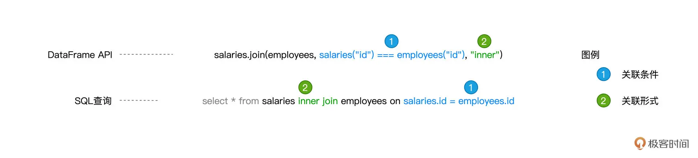
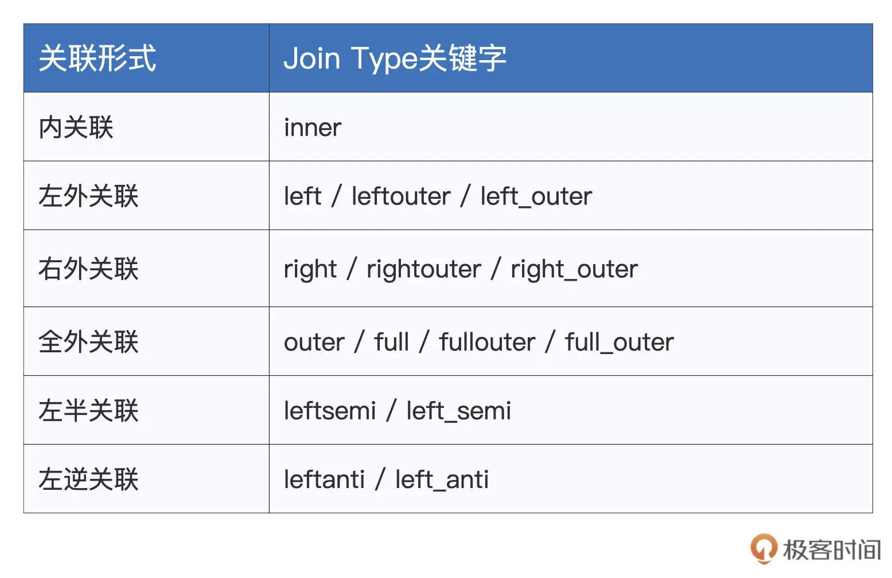
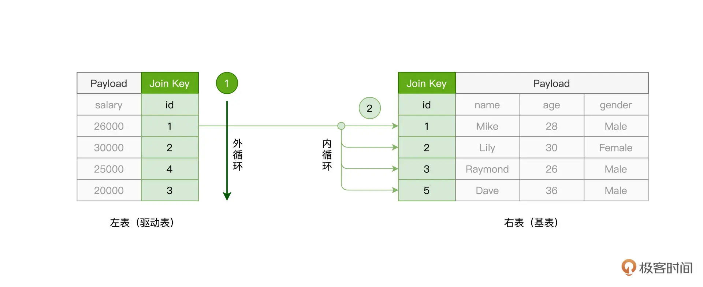
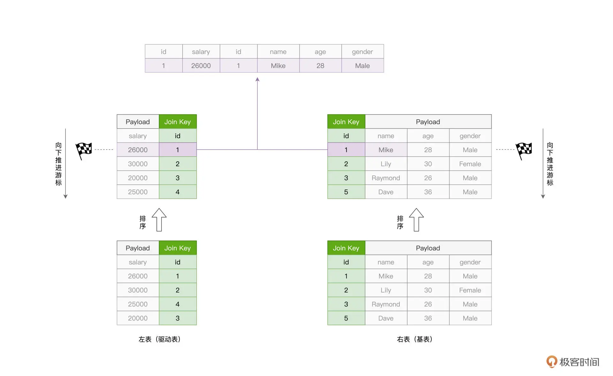
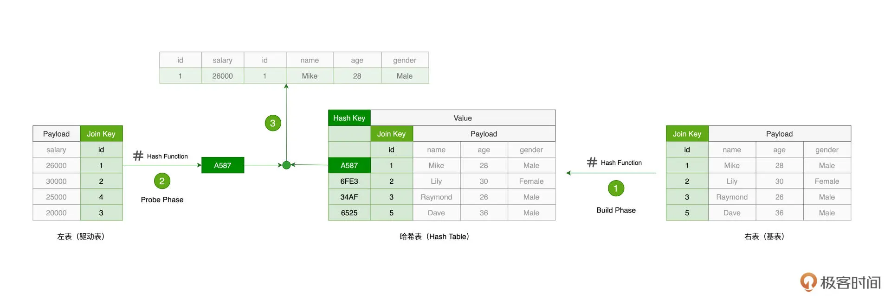
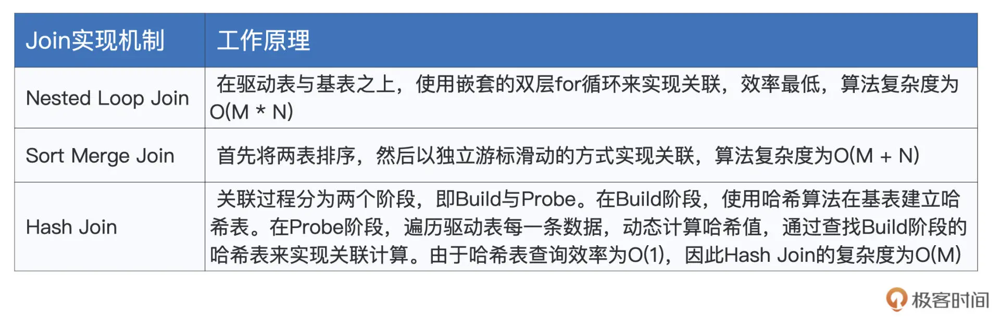

## 17 | 数据关联：不同的关联形式与实现机制该怎么选？

在上一讲，我们学习了 Spark SQL 支持的诸多算子。其中数据关联（Join）是数据分析场景中最常见、最重要的操作。毫不夸张地说，几乎在所有的数据应用中，你都能看到数据关联的“身影”。因此，今天这一讲，咱们继续详细说一说 Spark SQL 对于 Join 的支持。

众所周知，Join 的种类非常丰富。如果按照关联形式（Join Types）来划分，数据关联分为内关联、外关联、左关联、右关联，等等。对于参与关联计算的两张表，关联形式决定了结果集的数据来源。因此，在开发过程中选择哪种关联形式，是由我们的业务逻辑决定的。

而从实现机制的角度，Join 又可以分为 NLJ（Nested Loop Join）、SMJ（Sort Merge Join）和 HJ（Hash Join）。也就是说，同样是内关联，我们既可以采用 NLJ 来实现，也可以采用 SMJ 或是 HJ 来实现。区别在于，在不同的计算场景下，这些不同的实现机制在执行效率上有着天壤之别。因此，了解并熟悉这些机制，对咱们开发者来说至关重要。

今天，我们就分别从这两个角度，来说一说 Spark SQL 当中数据关联的来龙去脉。

### 1. 数据准备

为了让你更好地掌握新知识，我会通过一个个例子，为你说明 Spark SQL 数据关联的具体用法。在去介绍数据关联之前，咱们先把示例中会用到的数据准备好。

```
import spark.implicits._
import org.apache.spark.sql.DataFrame
 
// 创建员工信息表
val seq = Seq((1, "Mike", 28, "Male"), (2, "Lily", 30, "Female"), (3, "Raymond", 26, "Male"), (5, "Dave", 36, "Male"))
val employees: DataFrame = seq.toDF("id", "name", "age", "gender")
 
// 创建薪资表
val seq2 = Seq((1, 26000), (2, 30000), (4, 25000), (3, 20000))
val salaries:DataFrame = seq2.toDF("id", "salary")
```

如上表所示，我们创建了两个 DataFrame，一个用于存储员工基本信息，我们称之为员工表；另一个存储员工薪水，我们称之为薪资表。

数据准备好之后，我们有必要先弄清楚一些数据关联的基本概念。所谓数据关联，它指的是这样一个计算过程：给定关联条件（Join Conditions）将两张数据表以不同关联形式拼接在一起的过程。关联条件包含两层含义，一层是两张表中各自关联字段（Join Key）的选择，另一层是关联字段之间的逻辑关系。

在上一讲我们说到，Spark SQL 同时支持 DataFrame 算子与 SQL 查询，因此咱们不妨结合刚刚准备好的数据，分别以这两者为例，来说明数据关联中的基本概念。



首先，约定俗成地，我们把主动参与 Join 的数据表，如上图中的 salaries 表，称作“左表”；而把被动参与关联的数据表，如 employees 表，称作是“右表”。

然后，我们来关注图中蓝色的部分。可以看到，两张表都选择 id 列作为关联字段，而两者的逻辑关系是“相等”。这样的一个等式，就构成了我们刚刚说的关联条件。接下来，我们再来看图中绿色的部分，inner 指代的就是内关联的关联形式。

关联形式，是我们今天要学习的重点内容之一。接下来，我们还是一如既往地绕过 SQL 查询这种开发方式，以 DataFrame 算子这种开发模式为例，说一说 Spark SQL 都支持哪些关联形式，以及不同关联形式的效果是怎样的。

### 2. 关联形式（Join Types）

在关联形式这方面，Spark SQL 的支持比较全面，为了让你一上来就建立一个整体的认知，我把 Spark SQL 支持的 Joint Types 都整理到了如下的表格中，你不妨先粗略地过一遍。



结合已经准备好的数据，我们分别来说一说每一种关联形式的用法，以及它们各自的作用与效果。我们先从最简单、最基础、也是最常见的内关联说起。

#### 2.1 内关联（Inner Join）

对于登记在册的员工，如果我们想获得他们每个人的薪资情况，就可以使用内关联来实现，如下所示。

```
// 内关联
val jointDF: DataFrame = salaries.join(employees, salaries("id") === employees("id"), "inner")
 
jointDF.show
 
/** 结果打印
+---+------+---+-------+---+------+
| id|salary| id| name|age|gender|
+---+------+---+-------+---+------+
| 1| 26000| 1| Mike| 28| Male|
| 2| 30000| 2| Lily| 30|Female|
| 3| 20000| 3|Raymond| 26| Male|
+---+------+---+-------+---+------+
*/
 
// 左表
salaries.show
 
/** 结果打印
+---+------+
| id|salary|
+---+------+
| 1| 26000|
| 2| 30000|
| 4| 25000|
| 3| 20000|
+---+------+
*/
 
// 右表
employees.show
 
/** 结果打印
+---+-------+---+------+
| id| name|age|gender|
+---+-------+---+------+
| 1| Mike| 28| Male|
| 2| Lily| 30|Female|
| 3|Raymond| 26| Male|
| 5| Dave| 36| Male|
+---+-------+---+------+
*/
```

可以看到，基于 join 算子的一般用法，我们只要在第 3 个参数中指定 `“inner”` 这种关联形式，就可以使用内关联的方式，来达成两表之间的数据拼接。不过，如果仔细观察上面打印的关联结果集，以及原始的薪资表与员工表，你会发现，左表和右表的原始数据，并没有都出现在结果集当中。

例如，在原始的薪资表中，有一条 `id` 为 `4` 的薪资记录；而在员工表中，有一条 `id` 为 `5`、`name` 为 “Dave” 的数据记录。这两条数据记录，都没有出现在内关联的结果集中，而这正是“内关联”这种关联形式的作用所在。

内关联的效果，是仅仅保留左右表中满足关联条件的那些数据记录。以上表为例，关联条件是 salaries(“id”) === employees(“id”)，而在员工表与薪资表中，只有 1、2、3 这三个值同时存在于他们各自的 id 字段中。相应地，结果集中就只有 id 分别等于 1、2、3 的这三条数据记录。

解了内关联的含义与效果之后，你再去学习其他的关联形式，比如说外关联，就会变得轻松许多。

#### 2.2 外关联（Outer Join）

外关联还可以细分为 3 种形式，分别是左外关联、右外关联、以及全外关联。这里的左、右，对应的实际上就是左表、右表。

由简入难，我们先来说左外关联。要把 `salaries` 与 `employees` 做左外关联，我们只需要把“inner”关键字，替换为“left”、“leftouter” 或是 “left_outer”即可，如下所示。

```
val leftJointDF: DataFrame = salaries.join(employees, salaries("id") === employees("id"), "left")
 
leftJointDF.show
 
/** 结果打印
+---+------+----+-------+----+------+
| id|salary| id| name| age|gender|
+---+------+----+-------+----+------+
| 1| 26000| 1| Mike| 28| Male|
| 2| 30000| 2| Lily| 30|Female|
| 4| 25000|null| null|null| null|
| 3| 20000| 3|Raymond| 26| Male|
+---+------+----+-------+----+------+
*/
```

不难发现，左外关联的结果集，**实际上就是内关联结果集，再加上左表 salaries 中那些不满足关联条件的剩余数据**，也即 `id` 为 `4` 的数据记录。值得注意的是，由于右表 `employees` 中并不存在 `id` 为 `4` 的记录，因此结果集中 `employees` 对应的所有字段值均为空值 `null`。

没有对比就没有鉴别，为了更好地理解前面学的内关联、左外关联，我们再来看看右外关联的执行结果。为了计算右外关联，在下面的代码中，我们把 “left” 关键字，替换为“right”、“rightouter”或是“right_outer”。

```
val rightJointDF: DataFrame = salaries.join(employees, salaries("id") === employees("id"), "right")
 
rightJointDF.show
 
/** 结果打印
+----+------+---+-------+---+------+
| id|salary| id| name|age|gender|
+----+------+---+-------+---+------+
| 1| 26000| 1| Mike| 28| Male|
| 2| 30000| 2| Lily| 30|Female|
| 3| 20000| 3|Raymond| 26| Male|
|null| null| 5| Dave| 36| Male|
+----+------+---+-------+---+------+
*/
```

仔细观察，你会发现，与左外关联相反，右外关联的结果集，**恰恰是内关联的结果集，再加上右表 employees 中的剩余数据**，也即 `id` 为 `5`、`name` 为 “Dave” 的数据记录。同样的，由于左表 `salaries` 并不存在 `id` 等于 `5` 的数据记录，因此，结果集中 `salaries` 相应的字段置空，以 null 值进行填充。

理解了左外关联与右外关联，全外关联的功用就显而易见了。全外关联的结果集，就是内关联的结果，再加上那些不满足关联条件的左右表剩余数据。要进行全外关联的计算，关键字可以取“full”、“outer”、“fullouter”、或是“full_outer”，如下表所示。

```
val fullJointDF: DataFrame = salaries.join(employees, salaries("id") === employees("id"), "full")
 
fullJointDF.show
 
/** 结果打印
+----+------+----+-------+----+------+
| id|salary| id| name| age|gender|
+----+------+----+-------+----+------+
| 1| 26000| 1| Mike| 28| Male|
| 3| 20000| 3|Raymond| 26| Male|
|null| null| 5| Dave| 36| Male|
| 4| 25000|null| null|null| null|
| 2| 30000| 2| Lily| 30|Female|
+----+------+----+-------+----+------+
*/
```

到这里，内、外关联的作用我们就讲完了。聪明的你可能早已发现，这里的“内”，它指的是，在关联结果中，仅包含满足关联条件的那些数据记录；**而“外”，它的含义是，在关联计算的结果集中，还包含不满足关联条件的数据记录。而外关联中的“左”、“右”、“全”，恰恰是在表明，那些不满足关联条件的记录，来自于哪里**。

弄清楚“内”、“外”、“左”、“右”这些说法的含义，能够有效地帮我们避免迷失在种类繁多、却又彼此相关的关联形式中。其实除了内关联和外关联，Spark SQL 还支持左半关联和左逆关联，这两个关联又是用来做什么的呢？

#### 2.3 左半 / 逆关联（Left Semi Join / Left Anti Join）

尽管名字听上去拗口，但它们的含义却很简单。我们先来说左半关联，它的关键字有 “leftsemi” 和 “left_semi”。左半关联的结果集，实际上是内关联结果集的子集，它仅保留左表中满足关联条件的那些数据记录，如下表所示。

```
// 内关联
val jointDF: DataFrame = salaries.join(employees, salaries("id") === employees("id"), "inner")
 
jointDF.show
 
/** 结果打印
+---+------+---+-------+---+------+
| id|salary| id| name|age|gender|
+---+------+---+-------+---+------+
| 1| 26000| 1| Mike| 28| Male|
| 2| 30000| 2| Lily| 30|Female|
| 3| 20000| 3|Raymond| 26| Male|
+---+------+---+-------+---+------+
*/
 
// 左半关联
val leftSemiJointDF: DataFrame = salaries.join(employees, salaries("id") === employees("id"), "leftsemi")
 
leftSemiJointDF.show
 
/** 结果打印
+---+------+
| id|salary|
+---+------+
| 1| 26000|
| 2| 30000|
| 3| 20000|
+---+------+
*/
```

为了方便你进行对比，我分别打印出了内关联与左半关联的计算结果。这里你需要把握左半关联的两大特点：**首先，左半关联是内关联的一个子集；其次，它只保留左表 salaries 中的数据**。这两个特点叠加在一起，很好地诠释了“左、半”这两个字。

有了左半关联的基础，左逆关联会更好理解一些。左逆关联同样只保留左表的数据，它的关键字有 “leftanti” 和 “left_anti”。**但与左半关联不同的是，它保留的，是那些不满足关联条件的数据记录**，如下所示。

```
// 左逆关联
val leftAntiJointDF: DataFrame = salaries.join(employees, salaries("id") === employees("id"), "leftanti")
 
jointDF.show
 
/** 结果打印
+---+------+
| id|salary|
+---+------+
| 4| 25000|
+---+------+
*/
```

通过与上面左半关联的结果集做对比，我们一眼就能看出左逆关联和它的区别所在。显然，`id` 为 `4` 的薪资记录是不满足关联条件 `salaries(“id”) === employees(“id”)` 的，而左逆关联留下的，恰恰是这些“不达标”的数据记录。

好啦，关于 Spark SQL 支持的关联形式，到这里我们就全部说完了。根据这些不同关联形式的特点与作用，再结合实际场景中的业务逻辑，相信你可以在日常的开发中做到灵活取舍。

### 3. 关联机制（Join Mechanisms）

不过，从功能的角度出发，使用不同的关联形式来实现业务逻辑，可以说是程序员的一项必备技能。要在众多的开发者中脱颖而出，咱们还要熟悉、了解不同的关联机制。哪怕同样是内关联，不同的 Join 实现机制在执行效率方面差异巨大。因此，掌握不同关联机制的原理与特性，有利于我们逐渐培养出以性能为导向的开发习惯。

在这一讲的开头，我们提到 Join 有 3 种实现机制，分别是 NLJ（Nested Loop Join）、SMJ（Sort Merge Join）和 HJ（Hash Join）。接下来，我们以内关联为例，结合 salaries 和 employees 这两张表，来说说它们各自的实现原理与特性。

```
// 内关联
val jointDF: DataFrame = salaries.join(employees, salaries("id") === employees("id"), "inner")
 
jointDF.show
 
/** 结果打印
+---+------+---+-------+---+------+
| id|salary| id| name|age|gender|
+---+------+---+-------+---+------+
| 1| 26000| 1| Mike| 28| Male|
| 2| 30000| 2| Lily| 30|Female|
| 3| 20000| 3|Raymond| 26| Male|
+---+------+---+-------+---+------+
*/
```

#### 3.1 NLJ：Nested Loop Join

对于参与关联的两张表，如 `salaries` 和 `employees`，按照它们在代码中出现的顺序，我们约定俗成地把 `salaries` 称作“左表”，而把 `employees` 称作“右表”。在探讨关联机制的时候，我们又常常把左表称作是“驱动表”，而把右表称为“基表”。

**一般来说，驱动表的体量往往较大，在实现关联的过程中，驱动表是主动扫描数据的那一方。而基表相对来说体量较小，它是被动参与数据扫描的那一方**。

在 NLJ 的实现机制下，算法会使用外、内两个嵌套的 for 循环，来依次扫描驱动表与基表中的数据记录。在扫描的同时，还会判定关联条件是否成立，如内关联例子中的 salaries(“id”) === employees(“id”)。如果关联条件成立，就把两张表的记录拼接在一起，然后对外进行输出。



在实现的过程中，外层的 for 循环负责遍历驱动表的每一条数据，如图中的步骤 1 所示。对于驱动表中的每一条数据记录，内层的 for 循环会逐条扫描基表的所有记录，依次判断记录的 id 字段值是否满足关联条件，如步骤 2 所示。

不难发现，假设驱动表有 M 行数据，而基表有 N 行数据，那么 NLJ 算法的计算复杂度是 `O(M * N)`。尽管 NLJ 的实现方式简单、直观、易懂，但它的执行效率显然很差。

#### 3.2 NLJ：SMJ：Sort Merge Join

于 NLJ 低效的计算效率，SMJ 应运而生。`Sort Merge Join`，顾名思义，SMJ 的实现思路是先排序、再归并。给定参与关联的两张表，SMJ 先把他们各自排序，然后再使用独立的游标，对排好序的两张表做归并关联。



具体计算过程是这样的：起初，驱动表与基表的游标都会先锚定在各自的第一条记录上，然后通过对比游标所在记录的 id 字段值，来决定下一步的走向。对比结果以及后续操作主要分为 3 种情况：

- 足关联条件，两边的 id 值相等，那么此时把两边的数据记录拼接并输出，然后把驱动表的游标滑动到下一条记录；
- 不满足关联条件，驱动表 id 值小于基表的 id 值，此时把驱动表的游标滑动到下一条记录；
- 不满足关联条件，驱动表 id 值大于基表的 id 值，此时把基表的游标滑动到下一条记录。

基于这 3 种情况，SMJ 不停地向下滑动游标，直到某张表的游标滑到尽头，即宣告关联结束。对于驱动表的每一条记录，由于基表已按 id 字段排序，且扫描的起始位置为游标所在位置，因此，SMJ 算法的计算复杂度为 `O(M + N)`。

然而，计算复杂度的降低，仰仗的其实是两张表已经事先排好了序。但是我们知道，排序本身就是一项很耗时的操作，更何况，为了完成归并关联，参与 Join 的两张表都需要排序。

因此，SMJ 的计算过程我们可以用“先苦后甜”来形容。苦，指的是要先花费时间给两张表做排序，而甜，指的则是有序表的归并关联能够享受到线性的计算复杂度。

#### 3.3 HJ：Hash Join

考虑到 SMJ 对于排序的苛刻要求，后来又有人推出了 HJ 算法。HJ 的设计初衷是以空间换时间，力图将基表扫描的计算复杂度降低至 O(1)。



具体来说，HJ 的计算分为两个阶段，分别是 Build 阶段和 Probe 阶段。在 Build 阶段，在基表之上，算法使用既定的哈希函数构建哈希表，如上图的步骤 1 所示。哈希表中的 Key 是 id 字段应用（Apply）哈希函数之后的哈希值，而哈希表的 Value 同时包含了原始的 Join Key（id 字段）和 Payload。

在 Probe 阶段，算法依次遍历驱动表的每一条数据记录。首先使用同样的哈希函数，以动态的方式计算 Join Key 的哈希值。然后，算法再用哈希值去查询刚刚在 Build 阶段创建好的哈希表。如果查询失败，则说明该条记录与基表中的数据不存在关联关系；相反，如果查询成功，则继续对比两边的 Join Key。如果 Join Key 一致，就把两边的记录进行拼接并输出，从而完成数据关联。

好啦，到此为止，对于 Join 的 3 种实现机制，我们暂时说到这里。对于它们各自的实现原理，想必你已经有了充分的把握。至于这 3 种机制都适合哪些计算场景，以及 Spark SQL 如何利用这些机制在分布式环境下做数据关联，我们留到下一讲再去展开。

### 4. 重点回顾

今天这一讲，我们重点介绍了数据关联中的关联形式（Join Types）与实现机制（Join Mechanisms）。掌握了不同的关联形式，我们才能游刃有余地满足不断变化的业务需求。而熟悉并理解不同实现机制的工作原理，则有利于培养我们以性能为导向的开发习惯。

Spark SQL 支持的关联形式多种多样，为了方便你查找，我把它们的含义与效果统一整理到了如下的表格中。在日后的开发工作中，当你需要区分并确认不同的关联形式时，只要回顾这张表格，就能迅速得到结论。


在此之后，我们又介绍了 Join 的 3 种实现机制，它们分别是 Nested Loop Join、Sort Merge Join 和 Hash Join。这 3 种实现机制的工作原理，我也整理成了表格，方便你随时查看。



### Reference

- [17 | 数据关联：不同的关联形式与实现机制该怎么选？](https://time.geekbang.org/column/article/427470)