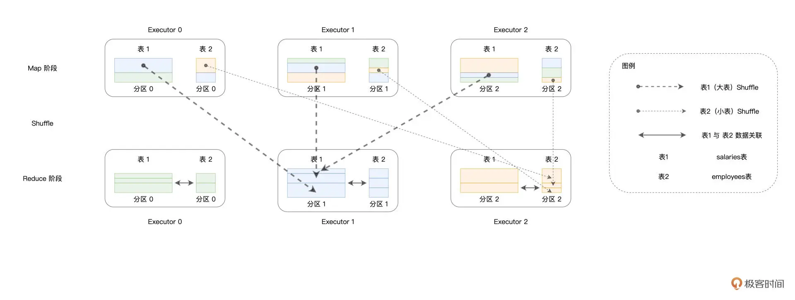
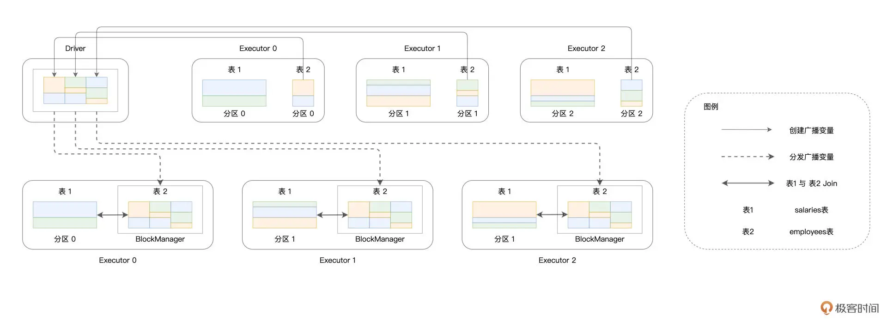
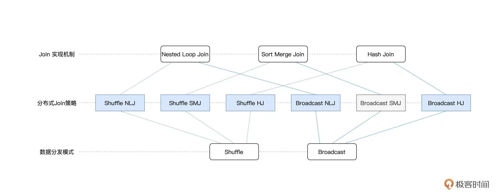
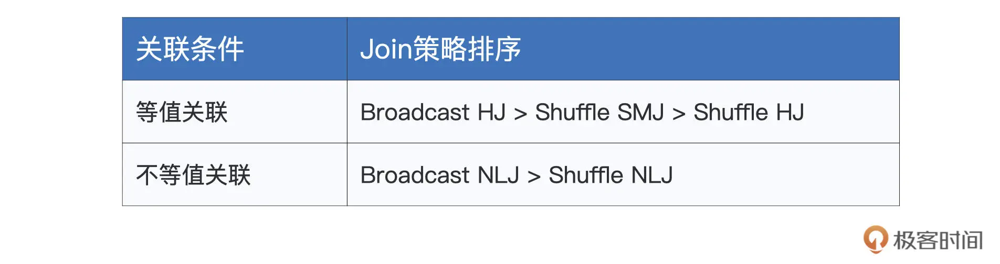
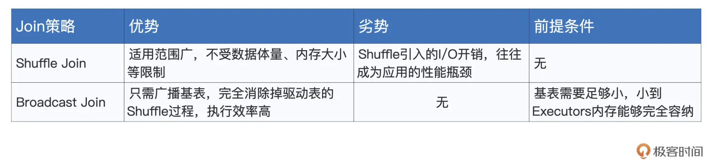
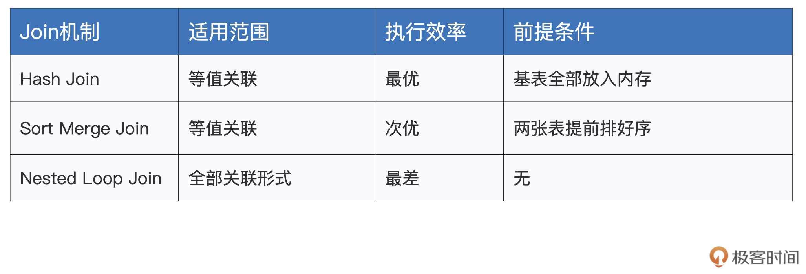

## 18 | 数据关联优化：都有哪些Join策略，开发者该如何取舍？

在上一讲，我们分别从关联形式与实现机制这两个方面，对数据分析进行了讲解和介绍。对于不同关联形式的用法和实现机制的原理，想必你已经了然于胸。不过，在大数据的应用场景中，数据的处理往往是在分布式的环境下进行的，在这种情况下，数据关联的计算还要考虑网络分发这个环节。

我们知道，在分布式环境中，Spark 支持两类数据分发模式。一类是我们在第 7 讲学过的 Shuffle，Shuffle 通过中间文件来完成 Map 阶段与 Reduce 阶段的数据交换，因此它会引入大量的磁盘与网络开销。另一类是我们在第 10 讲介绍的广播变量（Broadcast Variables），广播变量在 Driver 端创建，并由 Driver 分发到各个 Executors。

因此，从数据分发模式的角度出发，数据关联又可以分为 `Shuffle Join` 和 `Broadcast Join` 这两大类。将两种分发模式与 `Join` 本身的 `3` 种实现机制相结合，就会衍生出分布式环境下的 `6` 种 `Join` 策略。

那么，对于这 6 种 Join 策略，Spark SQL 是如何支持的呢？它们的优劣势与适用场景都有哪些？开发者能否针对这些策略有的放矢地进行取舍？今天这一讲，咱们就来聊聊这些话题。

### Join 实现机制的优势对比

首先，我们先来说一说不同 Join 实现机制本身的一些特性与适用场景，从而为后续的讨论打好基础。需要说明的是，咱们这里说的 Join 实现机制，指的是算法层面的工作原理，不同的算法有着不同的适用场景与复杂度，我们需要对它们有足够认识并有所区分。

我们知道，Join 支持 3 种实现机制，它们分别是 `Hash Join`、`Sort Merge Join` 和 `Nested Loop Join`。三者之中，`Hash Join` 的执行效率最高，这主要得益于哈希表 O(1) 的查找效率。不过，在 `Probe` 阶段享受哈希表的“性能红利”之前，`Build` 阶段得先在内存中构建出哈希表才行。因此，`Hash Join` 这种算法对于内存的要求比较高，适用于内存能够容纳基表数据的计算场景。

相比之下，Sort Merge Join 就没有内存方面的限制。不论是排序、还是合并，SMJ 都可以利用磁盘来完成计算。所以，在稳定性这方面，SMJ 更胜一筹。

而且与 Hash Join 相比，SMJ 的执行效率也没有差太多，前者是 O(M)，后者是 O(M + N)，可以说是不分伯仲。当然，O(M + N) 的复杂度得益于 SMJ 的排序阶段。因此，如果准备参与 Join 的两张表是有序表，那么这个时候采用 SMJ 算法来实现关联简直是再好不过了。

与前两者相比，Nested Loop Join 看上去有些多余，嵌套的双层 for 循环带来的计算复杂度最高：O(M * N)。不过，尺有所短寸有所长，执行高效的 HJ 和 SMJ 只能用于等值关联，也就是说关联条件必须是等式，像 salaries(“id”) < employees(“id”) 这样的关联条件，HJ 和 SMJ 是无能为力的。相反，NLJ 既可以处理等值关联（Equi Join），也可以应付不等值关联（Non Equi Join），可以说是数据关联在实现机制上的最后一道防线。

### Shuffle Join 与 Broadcast Join

分析完不同 Join 机制的优缺点之后，接下来，我们再来说说分布式环境下的 Join 策略。与单机环境不同，在分布式环境中，两张表的数据各自散落在不同的计算节点与 Executors 进程。因此，要想完成数据关联，Spark SQL 就必须先要把 `Join Keys` 相同的数据，分发到同一个 Executors 中去才行。

我们还是用上一讲的员工信息和薪资表来举例，如果我们打算对 salaries 和 employees 两张表按照 id 列做关联，那么，对于 id 字段值相同的薪资数据与员工数据，我们必须要保证它们坐落在同样的 Executors 进程里，Spark SQL 才能利用刚刚说的 HJ、SMJ、以及 NLJ，以 Executors（进程）为粒度并行地完成数据关联。

换句话说，以 Join Keys 为基准，两张表的数据分布保持一致，是 Spark SQL 执行分布式数据关联的前提。而能满足这个前提的途径只有两个：Shuffle 与广播。这里我额外提醒一下，Shuffle 和广播变量我们在前面的课程有过详细的介绍，如果你记不太清了，不妨翻回去看一看。

回到正题，开篇咱们说到，如果按照分发模式来划分，数据关联可以分为 Shuffle Join 和 Broadcast Join 两大类。**通常来说，在执行性能方面，相比 Shuffle Join，Broadcast Join 往往会更胜一筹**。为什么这么说呢？

接下来，我们就一起来分析分析，这两大类 Join 在分布式环境下的执行过程，~~ 然后再来回答这个问题。~~ 理解了执行过程，你自然就能解答这个问题了。

#### Shuffle Join

在没有开发者干预的情况下，Spark SQL 默认采用 `Shuffle Join` 来完成分布式环境下的数据关联。对于参与 `Join` 的两张数据表，Spark SQL 先是按照如下规则，来决定不同数据记录应当分发到哪个 `Executors` 中去：

- 根据 `Join Keys` 计算哈希值将哈希值对并行度（Parallelism）取模
- 由于左表与右表在并行度（分区数）上是一致的，因此，按照同样的规则分发数据之后，一定能够保证 `id` 字段值相同的薪资数据与员工数据坐落在同样的 `Executors` 中。



如上图所示，颜色相同的矩形代表 Join Keys 相同的数据记录，可以看到，在 Map 阶段，数据分散在不同的 Executors 当中。经过 Shuffle 过后，Join Keys 相同的记录被分发到了同样的 Executors 中去。接下来，在 Reduce 阶段，Reduce Task 就可以使用 HJ、SMJ、或是 NLJ 算法在 Executors 内部完成数据关联的计算。

park SQL 之所以在默认情况下一律采用 Shuffle Join，原因在于 Shuffle Join 的“万金油”属性。也就是说，在任何情况下，不论数据的体量是大是小、不管内存是否足够，Shuffle Join 在功能上都能够“不辱使命”，成功地完成数据关联的计算。然而，有得必有失，功能上的完备性，往往伴随着的是性能上的损耗。

学习过 Shuffle 的原理（第 6 讲）之后，不用我多说，Shuffle 的弊端想必你早已烂熟于心。我们知道，从 CPU 到内存，从磁盘到网络，Shuffle 的计算几乎需要消耗所有类型的硬件资源。尤其是磁盘和网络开销，这两座大山往往是应用执行的性能瓶颈。

那么问题来了，除了 Shuffle Join 这种“万金油”式的 Join 策略，开发者还有没有其他效率更高的选择呢？答案当然是肯定的，Broadcast Join 就是用来克制 Shuffle 的“杀手锏”。

#### Broadcast Join

在广播变量那一讲（第 10 讲），我们讲过把用户数据结构封装为广播变量的过程。实际上，Spark 不仅可以在普通变量上创建广播变量，在分布式数据集（如 RDD、DataFrame）之上也可以创建广播变量。这样一来，对于参与 Join 的两张表，我们可以把其中较小的一个封装为广播变量，然后再让它们进行关联。

光说思路你可能体会不深，我们还是结合例子理解。以薪资表和员工表为例，只要对代码稍加改动，我们就能充分利用广播变量的优势。

更改后的代码如下所示。

```
import org.apache.spark.sql.functions.broadcast
 
// 创建员工表的广播变量
val bcEmployees = broadcast(employees)
 
// 内关联，PS：将原来的employees替换为bcEmployees
val jointDF: DataFrame = salaries.join(bcEmployees, salaries("id") === employees("id"), "inner")
```

在 Broadcast Join 的执行过程中，Spark SQL 首先从各个 Executors 收集 employees 表所有的数据分片，然后在 Driver 端构建广播变量 bcEmployees，构建的过程如下图实线部分所示。



可以看到，散落在不同 Executors 内花花绿绿的矩形，代表的正是 employees 表的数据分片。这些数据分片聚集到一起，就构成了广播变量。接下来，如图中虚线部分所示，携带着 employees 表全量数据的广播变量 bcEmployees，被分发到了全网所有的 Executors 当中去。

在这种情况下，体量较大的薪资表数据只要“待在原地、保持不动”，就可以轻松关联到跟它保持之一致的员工表数据了。通过这种方式，Spark SQL 成功地避开了 Shuffle 这种“劳师动众”的数据分发过程，转而用广播变量的分发取而代之。

尽管广播变量的创建与分发同样需要消耗网络带宽，但相比 Shuffle Join 中两张表的全网分发，因为仅仅通过分发体量较小的数据表来完成数据关联，Spark SQL 的执行性能显然要高效得多。这种小投入、大产出，用极小的成本去博取高额的性能收益，可以说是“四两拨千斤”！

### Spark SQL 支持的 Join 策略

不论是 Shuffle Join，还是 Broadcast Join，一旦数据分发完毕，理论上可以采用 HJ、SMJ 和 NLJ 这 3 种实现机制中的任意一种，完成 Executors 内部的数据关联。因此，两种分发模式，与三种实现机制，它们组合起来，总共有 6 种分布式 Join 策略，如下图所示。



虽然组合起来选择多样，但你也不必死记硬背，抓住里面的规律才是关键，我们一起来分析看看。

在这 6 种 Join 策略中，Spark SQL 支持其中的 5 种来应对不用的关联场景，也即图中蓝色的 5 个矩形。对于等值关联（Equi Join），Spark SQL 优先考虑采用 Broadcast HJ 策略，其次是 Shuffle SMJ，最次是 Shuffle HJ。对于不等值关联（Non Equi Join），Spark SQL 优先考虑 Broadcast NLJ，其次是 Shuffle NLJ。



不难发现，**不论是等值关联、还是不等值关联，只要 Broadcast Join 的前提条件成立，Spark SQL 一定会优先选择 Broadcast Join 相关的策略**。那么问题来了，Broadcast Join 的前提条件是什么呢？

回顾 Broadcast Join 的工作原理图，我们不难发现，Broadcast Join 得以实施的基础，是被广播数据表（图中的表 2）的全量数据能够完全放入 Driver 的内存、以及各个 Executors 的内存，如下图所示。


另外，为了避免因广播表尺寸过大而引入新的性能隐患，Spark SQL 要求被广播表的内存大小不能超过 8GB。

好，这里我们简单总结一下。只要被广播表满足上述两个条件，我们就可以利用 SQL Functions 中的 broadcast 函数来创建广播变量，进而利用 Broadcast Join 策略来提升执行性能。

当然，在 Broadcast Join 前提条件不成立的情况下，Spark SQL 就会退化到 Shuffle Join 的策略。在不等值的数据关联中，Spark SQL 只有 Shuffle NLJ 这一种选择，因此咱们无需赘述。

但在等值关联的场景中，Spark SQL 有 Shuffle SMJ 和 Shuffle HJ 这两种选择。尽管如此，Shuffle SMJ 与 Shuffle HJ 的关系，就像是关羽和周仓的关系。周仓虽说武艺也不错，但他向来只是站在关公后面提刀。大战在即，刘备仰仗的自然是站在前面的关羽，而很少启用后面的周仓。在 Shuffle SMJ 与 Shuffle HJ 的取舍上，Spark SQL 也是如此。

学习过 Shuffle 之后，我们知道，Shuffle 在 Map 阶段往往会对数据做排序，而这恰恰正中 SMJ 机制的下怀。对于已经排好序的两张表，SMJ 的复杂度是 O(M + N)，这样的执行效率与 HJ 的 O(M) 可以说是不相上下。再者，SMJ 在执行稳定性方面，远胜于 HJ，在内存受限的情况下，SMJ 可以充分利用磁盘来顺利地完成关联计算。因此，考虑到 Shuffle SMJ 的诸多优势，Shuffle HJ 就像是关公后面的周仓，Spark SQL 向来对之视而不见，所以对于 HJ 你大概知道它的作用就行。

### 重点回顾

好啦，到此为止，今天的课程就全部讲完了，我们一起来做个总结。首先，我们一起分析、对比了单机环境中不同 Join 机制的优劣势，我把它们整理到了下面的表格中，供你随时查看。



在分布式环境中，要想利用上述机制完成数据关联，Spark SQL 首先需要把两张表中 Join Keys 一致的数据分发到相同的 Executors 中。

因此，数据分发是分布式数据关联的基础和前提。Spark SQL 支持 Shuffle 和广播两种数据分发模式，相应地，Join 也被分为 Shuffle Join 和 Broadcast Join，其中 Shuffle Join 是默认的关联策略。关于两种策略的优劣势对比，我也整理到了如下的表格中，供你参考。



结合三种实现机制和两种数据分发模式，Spark SQL 支持 5 种分布式 Join 策略。对于这些不同的 Join 策略，Spark SQL 有着自己的选择偏好，我把它整理到了如下的表格中，供你随时查看。

其中，Broadcast Join 的生效前提，是基表能够放进内存，且存储尺寸小于 8GB。只要前提条件成立，Spark SQL 就会优先选择 Broadcast Join。


### Reference

- [18 | 数据关联优化：都有哪些Join策略，开发者该如何取舍？](https://time.geekbang.org/column/article/428259)