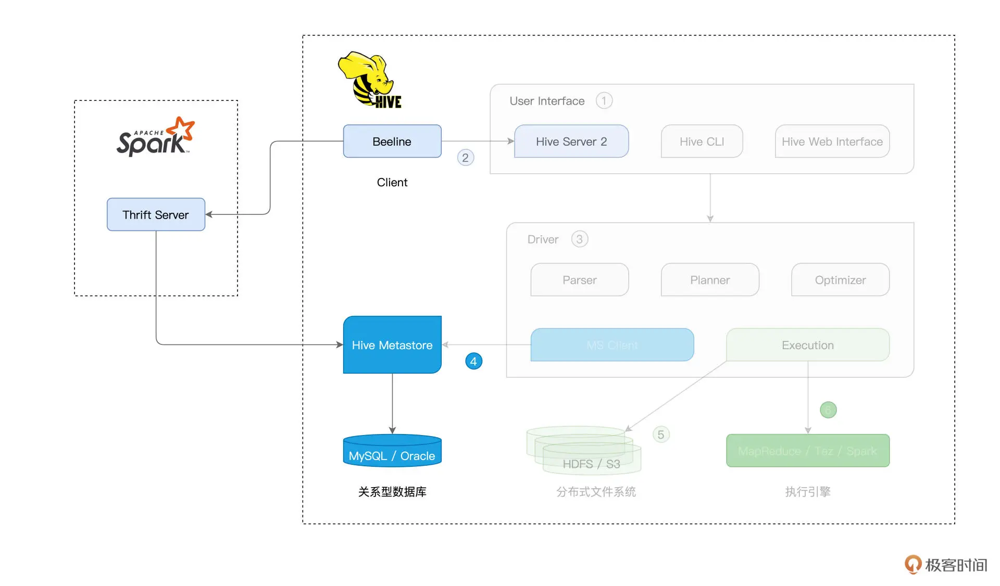

## 20 | Hive + Spark强强联合：分布式数仓的不二之选

在数据源与数据格式，以及数据转换那两讲（第 15、16 讲），我们介绍了在 Spark SQL 之上做数据分析应用开发的一般步骤。这里我们简单回顾一下：首先，我们通过 ``SparkSession read API` 从分布式文件系统创建 DataFrame。然后，通过创建临时表并使用 SQL 语句，或是直接使用 DataFrame API，来进行各式各样的数据转换、过滤、聚合等操作。最后，我们再用 SparkSession 的 write API 把计算结果写回分布式文件系统。

实际上，直接与文件系统交互，仅仅是 Spark SQL 数据应用的常见场景之一。Spark SQL 另一类非常典型的场景是与 Hive 做集成、构建分布式数据仓库。我们知道，数据仓库指的是一类带有主题、聚合层次较高的数据集合，它的承载形式，往往是一系列 `Schema` 经过精心设计的数据表。在数据分析这类场景中，数据仓库的应用非常普遍。在 Hive 与 Spark 这对“万金油”组合中，**Hive 擅长元数据管理，而 Spark 的专长是高效的分布式计算**，二者的结合可谓是“强强联合”。今天这一讲，我们就来聊一聊 Spark 与 Hive 集成的两类方式，**一类是从 Spark 的视角出发，我们称之为 Spark with Hive**；而另一类，则是**从 Hive 的视角出发，业界的通俗说法是：Hive on Spark**。


### 1. Hive 架构与基本原理

磨刀不误砍柴工，在讲解这两类集成方式之前，我们不妨先花点时间，来了解一下 Hive 的架构和工作原理，避免不熟悉 Hive 的同学听得云里雾里。

Hive 是 Apache Hadoop 社区用于构建数据仓库的核心组件，它负责提供种类丰富的用户接口，接收用户提交的 SQL 查询语句。这些查询语句经过 Hive 的解析与优化之后，往往会被转化为分布式任务，并交付 Hadoop MapReduce 付诸执行。


Hive 是名副其实的“集大成者”，它的核心部件，其实主要是 `User Interface`（1）和 Driver（3）。而不论是元数据库（4）、存储系统（5），还是计算引擎（6），Hive 都以“外包”、“可插拔”的方式交给第三方独立组件，所谓“把专业的事交给专业的人去做”，如下图所示。


Hive 的 User Interface 为开发者提供 SQL 接入服务，具体的接入途径有 `Hive Server 2`（2）、`CLI` 和 `Web Interface`（Web 界面入口）。其中，`CLI` 与 `Web Interface` 直接在本地接收 SQL 查询语句，而 `Hive Server 2` 则通过提供 `JDBC/ODBC` 客户端连接，允许开发者从远程提交 SQL 查询请求。显然，`Hive Server 2` 的接入方式更为灵活，应用也更为广泛。

我们以响应一个 SQL 查询为例，看一看 Hive 是怎样工作的。接收到 SQL 查询之后，Hive 的 Driver 首先使用其 Parser 组件，将查询语句转化为 AST（Abstract Syntax Tree，查询语法树）。

紧接着，Planner 组件根据 AST 生成执行计划，而 Optimizer 则进一步优化执行计划。要完成这一系列的动作，Hive 必须要能拿到相关数据表的元信息才行，比如表名、列名、字段类型、数据文件存储路径、文件格式，等等。而这些重要的元信息，通通存储在一个叫作“Hive Metastore”（4）的数据库中。

本质上，Hive Metastore 其实就是一个普通的关系型数据库（RDBMS），它可以是免费的 MySQL、Derby，也可以是商业性质的 Oracle、IBM DB2。实际上，除了用于辅助 SQL 语法解析、执行计划的生成与优化，**Metastore 的重要作用之一，是帮助底层计算引擎高效地定位并访问分布式文件系统中的数据源**。

这里的分布式文件系统，可以是 Hadoop 生态的 HDFS，也可以是云原生的 Amazon S3。而在执行方面，Hive 目前支持 3 类计算引擎，分别是 Hadoop MapReduce、Tez 和 Spark。

当 Hive 采用 Spark 作为底层的计算引擎时，我们就把这种集成方式称作 “Hive on Spark”。相反，当 Spark 仅仅是把 Hive 当成是一种元信息的管理工具时，我们把 Spark 与 Hive 的这种集成方式，叫作“Spark with Hive”。

你可能会觉得很困惑：“这两种说法听上去差不多嘛，两种集成方式，到底有什么本质的不同呢？”接下来，我们就按照“先易后难”的顺序，先来说说“Spark with Hive”这种集成方式，然后再去介绍“Hive on Spark”。

### 2. Spark with Hive

在开始正式学习 Spark with Hive 之前，我们先来说说这类集成方式的核心思想。前面我们刚刚说过，Hive Metastore 利用 RDBMS 来存储数据表的元信息，如表名、表类型、表数据的 Schema、表（分区）数据的存储路径、以及存储格式，等等。形象点说，Metastore 就像是“户口簿”，它记录着分布式文件系统中每一份数据集的“底细”。

Spark SQL 通过访问 Hive Metastore 这本“户口簿”，即可扩充数据访问来源。而这，就是 Spark with Hive 集成方式的核心思想。直白点说，在这种集成模式下，Spark 是主体，Hive Metastore 不过是 Spark 用来扩充数据来源的辅助工具。厘清 Spark 与 Hive 的关系，有助于我们后面区分 Hive on Spark 与 Spark with Hive 之间的差异。

作为开发者，我们可以通过 3 种途径来实现 Spark with Hive 的集成方式，它们分别是：

- 创建 SparkSession，访问本地或远程的 Hive Metastore；
- 通过 Spark 内置的 spark-sql CLI，访问本地 Hive Metastore；
- 通过 Beeline 客户端，访问 Spark Thrift Server。

#### 2.1 SparkSession + Hive Metastore

为了更好地理解 Hive 与 Spark 的关系，我们先从第一种途径，也就是通过 SparkSession 访问 Hive Metastore 说起。首先，我们使用如下命令来启动 Hive Metastore。

```
hive --service metastore
```

Hive Metastore 启动之后，我们需要让 Spark 知道 Metastore 的访问地址，也就是告诉它（Spark）数据源的“户口簿”藏在什么地方。

要传递这个消息，我们有两种办法。一种是在创建 SparkSession 的时候，通过 `config` 函数来明确指定 `hive.metastore.uris` 参数。另一种方法是让 Spark 读取 Hive 的配置文件 `hive-site.xml`，该文件记录着与 Hive 相关的各种配置项，其中就包括 `hive.metastore.uris` 这一项。把 `hive-site.xml` 拷贝到 Spark 安装目录下的 `conf` 子目录，Spark 即可自行读取其中的配置内容。

接下来，我们通过一个小例子，来演示第一种用法。假设 Hive 中有一张名为“salaries”的薪资表，每条数据都包含 `id` 和 `salary` 两个字段，表数据存储在 HDFS，那么，在 `spark-shell` 中敲入下面的代码，我们即可轻松访问 Hive 中的数据表。

```
import org.apache.spark.sql.SparkSession
import  org.apache.spark.sql.DataFrame
 
val hiveHost: String = _
// 创建SparkSession实例
val spark = SparkSession.builder()
                   .config("hive.metastore.uris", s"thrift://hiveHost:9083")
                   .enableHiveSupport()
                   .getOrCreate()
 
// 读取Hive表，创建DataFrame
val df: DataFrame = spark.sql(“select * from salaries”)
 
df.show
 
/** 结果打印
+---+------+
| id|salary|
+---+------+
|  1| 26000|
|  2| 30000|
|  4| 25000|
|  3| 20000|
+---+------+
*/
```

在第 16 讲，我们讲过利用 createTempView 函数从数据文件创建临时表的方法，临时表创建好之后，我们就可以使用 SparkSession 的 sql API 来提交 SQL 查询语句。连接到 `Hive Metastore` 之后，咱们就可以绕过第一步，直接使用 sql API 去访问 Hive 中现有的表，是不是很方便？

更重要的是，createTempView 函数创建的临时表，它的生命周期仅限于 Spark 作业内部，这意味着一旦作业执行完毕，临时表也就不复存在，没有办法被其他应用复用。Hive 表则不同，它们的元信息已经持久化到 Hive Metastore 中，不同的作业、应用、甚至是计算引擎，如 Spark、Presto、Impala，等等，都可以通过 Hive Metastore 来访问 Hive 表。

总结下来，在 SparkSession + Hive Metastore 这种集成方式中，Spark 对于 Hive 的访问，仅仅涉及到 Metastore 这一环节，对于 Hive 架构中的其他组件，Spark 并未触及。换句话说，在这种集成方式中，Spark 仅仅是“白嫖”了 Hive 的 Metastore，拿到数据集的元信息之后，Spark SQL 自行加载数据、自行处理，如下图所示。


在第一种集成方式下，通过 sql API，你可以直接提交复杂的 SQL 语句，也可以在创建 DataFrame 之后，再使用第 16 讲提到的各种算子去实现业务逻辑。

#### 2.2 spark-sql CLI + Hive Metastore

不过，你可能会说：“既然是搭建数仓，那么能不能像使用普通数据库那样，直接输入 SQL 查询，绕过 SparkSession 的 `sql API` 呢？”

答案自然是肯定的，接下来，我们就来说说 Spark with Hive 的第二种集成方式：`spark-sql CLI` + Hive Metastore。与 `spark-shell`、`spark-submit` 类似，`spark-sql` 也是 Spark 内置的系统命令。将配置好 `hive.metastore.uris` 参数的 `hive-site.xml` 文件放到 Spark 安装目录的 `conf` 下，我们即可在 `spark-sql` 中直接使用 SQL 语句来查询或是处理 Hive 表。

显然，在这种集成模式下，Spark 和 Hive 的关系，与刚刚讲的 SparkSession + Hive Metastore 一样，本质上都是 Spark 通过 Hive Metastore 来扩充数据源。

不过，相比前者，spark-sql CLI 的集成方式多了一层限制，那就是在部署上，spark-sql CLI 与 Hive Metastore 必须安装在同一个计算节点。换句话说，spark-sql CLI 只能在本地访问 Hive Metastore，而没有办法通过远程的方式来做到这一点。

在绝大多数的工业级生产系统中，不同的大数据组件往往是单独部署的，Hive 与 Spark 也不例外。由于 Hive Metastore 可用于服务不同的计算引擎，如前面提到的 Presto、Impala，因此为了减轻节点的工作负载，Hive Metastore 往往会部署到一台相对独立的计算节点。

在这样的背景下，不得不说，spark-sql CLI 本地访问的限制，极大地削弱了它的适用场景，这也是 spark-sql CLI + Hive Metastore 这种集成方式几乎无人问津的根本原因。不过，这并不妨碍我们学习并了解它，这有助于我们对 Spark 与 Hive 之间的关系加深理解。

#### 2.3 Beeline + Spark Thrift Server

说到这里，你可能会追问：“既然 spark-sql CLI 有这样那样的限制，那么，还有没有其他集成方式，既能够部署到生产系统，又能让开发者写 SQL 查询呢？”答案自然是“有”，Spark with Hive 集成的第三种途径，就是使用 `Beeline` 客户端，去连接 `Spark Thrift Server`，从而完成 Hive 表的访问与处理。

Beeline 原本是 Hive 客户端，通过 JDBC 接入 `Hive Server 2`。Hive Server 2 可以同时服务多个客户端，从而提供多租户的 Hive 查询服务。由于 `Hive Server 2` 的实现采用了 `Thrift RPC` 协议框架，因此很多时候我们又把 `Hive Server 2` 称为 “Hive Thrift Server 2”。

通过 Hive Server 2 接入的查询请求，经由 Hive Driver 的解析、规划与优化，交给 Hive 搭载的计算引擎付诸执行。相应地，查询结果再由 Hiver Server 2 返还给 Beeline 客户端，如下图右侧的虚线框所示。



`Spark Thrift Server` 脱胎于 `Hive Server 2`，在接收查询、多租户服务、权限管理等方面，这两个服务端的实现逻辑几乎一模一样。它们最大的不同，在于 SQL 查询接入之后的解析、规划、优化与执行。

我们刚刚说过，`Hive Server 2` 的“后台”是 Hive 的那套基础架构。而 SQL 查询在接入到 `Spark Thrift Server` 之后，它首先会交由 Spark SQL 优化引擎进行一系列的优化。

在第 14 讲我们提过，借助于 `Catalyst` 与 `Tungsten` 这对“左膀右臂”，Spark SQL 对 SQL 查询语句先后进行语法解析、语法树构建、逻辑优化、物理优化、数据结构优化、以及执行代码优化，等等。然后，Spark SQL 将优化过后的执行计划，交付给 Spark Core 执行引擎付诸运行。


不难发现，SQL 查询在接入 Spark Thrift Server 之后的执行路径，与 DataFrame 在 Spark 中的执行路径是完全一致的。

理清了 `Spark Thrift Server` 与 `Hive Server 2` 之间的区别与联系之后，接下来，我们来说说 `Spark Thrift Server` 的启动与 Beeline 的具体用法。要启动 `Spark Thrift Server`，我们只需调用 Spark 提供的 `start-thriftserver.sh` 脚本即可。

```
// SPARK_HOME环境变量，指向Spark安装目录
cd $SPARK_HOME/sbin
 
// 启动Spark Thrift Server
./start-thriftserver.sh
```

脚本执行成功之后，`Spark Thrift Server` 默认在 `10000` 端口监听 `JDBC/ODBC` 的连接请求。有意思的是，关于监听端口的设置，Spark 复用了 Hive 的 `hive.server2.thrift.port` 参数。与其他的 Hive 参数一样，`hive.server2.thrift.port` 同样要在 `hive-site.xml` 配置文件中设置。

一旦 `Spark Thrift Server` 启动成功，我们就可以在任意节点上通过 `Beeline` 客户端来访问该服务。在客户端与服务端之间成功建立连接（Connections）之后，咱们就能在 Beeline 客户端使用 SQL 语句处理 Hive 表了。需要注意的是，在这种集成模式下，SQL 语句背后的优化与计算引擎是 Spark。

```
/**
用Beeline客户端连接Spark Thrift Server，
其中，hostname是Spark Thrift Server服务所在节点
*/
./beeline -u jdbc:hive2://10.25.146.97:10000
```

好啦，到此为止，Spark with Hive 这类集成方式我们就讲完了。

为了巩固刚刚学过的内容，咱们趁热打铁，一起来做个简单的小结。**不论是 SparkSession + Hive Metastore、spark-sql CLI + Hive Metastore，还是 Beeline + Spark Thrift Server，Spark 扮演的角色都是执行引擎，而 Hive 的作用主要在于通过 Metastore 提供底层数据集的元数据。不难发现，在这类集成方式中，Spark 唱“主角”，而 Hive 唱“配角”**。

### 3. Hive on Spark

说到这里，你可能会好奇：“对于 Hive 社区与 Spark 社区来说，大家都是平等的，那么有没有 Hive 唱主角，而 Spark 唱配角的时候呢？”还真有，这就是 Spark 与 Hive 集成的另一种形式：Hive on Spark。基本原理

#### 3.1 基本原理

在这一讲的开头，我们简单介绍了 Hive 的基础架构。Hive 的松耦合设计，使得它的 Metastore、底层文件系统、以及执行引擎都是可插拔、可替换的。在执行引擎方面，Hive 默认搭载的是 Hadoop MapReduce，但它同时也支持 Tez 和 Spark。所谓的“Hive on Spark”，实际上指的就是 Hive 采用 Spark 作为其后端的分布式执行引擎，如下图所示。


从用户的视角来看，使用 Hive on MapReduce 或是 Hive on Tez 与使用 Hive on Spark 没有任何区别，执行引擎的切换对用户来说是完全透明的。不论 Hive 选择哪一种执行引擎，引擎仅仅负责任务的分布式计算，SQL 语句的解析、规划与优化，通通由 Hive 的 Driver 来完成。

为了搭载不同的执行引擎，Hive 还需要做一些简单的适配，从而把优化过的执行计划“翻译”成底层计算引擎的语义。

举例来说，在 Hive on Spark 的集成方式中，Hive 在将 SQL 语句转换为执行计划之后，还需要把执行计划“翻译”成 RDD 语义下的 DAG，然后再把 DAG 交付给 Spark Core 付诸执行。从第 14 讲到现在，我们一直在强调，Spark SQL 除了扮演数据分析子框架的角色之外，还是 Spark 新一代的优化引擎。

在 `Hive on Spark` 这种集成模式下，Hive 与 Spark 衔接的部分是 Spark Core，而不是 Spark SQL，这一点需要我们特别注意。这也是为什么，相比 `Hive on Spark`，`Spark with Hive` 的集成在执行性能上会更胜一筹。毕竟，`Spark SQL` + `Spark Core` 这种原装组合，相比 `Hive Driver` + `Spark Core` 这种适配组合，在契合度上要更高一些。

#### 3.2 集成实现

分析完原理之后，接下来，我们再来说说，Hive on Spark 的集成到底该怎么实现。

首先，既然我们想让 Hive 搭载 Spark，那么我们事先得准备好一套完备的 Spark 部署。对于 Spark 的部署模式，Hive 不做任何限定，Spark on Standalone、Spark on Yarn 或是 Spark on Kubernetes 都是可以的。

Spark 集群准备好之后，我们就可以通过修改 `hive-site.xml` 中相关的配置项，来轻松地完成 Hive on Spark 的集成，如下表所示。


其中，hive.execution.engine 用于指定 Hive 后端执行引擎，可选值有“mapreduce”、“tez”和“spark”，显然，将该参数设置为“spark”，即表示采用 Hive on Spark 的集成方式。

确定了执行引擎之后，接下来我们自然要告诉 Hive：“Spark 集群部署在哪里”，`spark.master` 正是为了实现这个目的。另外，为了方便 Hive 调用 Spark 的相关脚本与 Jar 包，我们还需要通过 `spark.home` 参数来指定 Spark 的安装目录。

配置好这 3 个参数之后，我们就可以用 Hive SQL 向 Hive 提交查询请求，而 Hive 则是先通过访问 Metastore 在 Driver 端完成执行计划的制定与优化，然后再将其“翻译”为 RDD 语义下的 DAG，最后把 DAG 交给后端的 Spark 去执行分布式计算。

当你在终端看到“Hive on Spark”的字样时，就证明 Hive 后台的执行引擎确实是 Spark，如下图所示。


当然，除了上述 3 个配置项以外，Hive 还提供了更多的参数，用于微调它与 Spark 之间的交互。对于这些参数，你可以通过访问 [Hive on Spark 配置项列表](https://cwiki.apache.org/confluence/pages/viewpage.action?pageId=82903061#ConfigurationProperties-Spark)来查看。不仅如此，在第 12 讲，我们详细介绍了 Spark 自身的基础配置项，这些配置项都可以配置到 hive-site.xml 中，方便你更细粒度地控制 Hive 与 Spark 之间的集成。

### 4. 重点回顾

好啦，到此为止，今天的内容就全部讲完啦！内容有点多，我们一起来做个总结。

今天这一讲，你需要了解 Spark 与 Hive 常见的两类集成方式，Spark with Hive 和 Hive on Spark。前者由 Spark 社区主导，以 Spark 为主、Hive 为辅；后者则由 Hive 社区主导，以 Hive 为主、Spark 为辅。两类集成方式各有千秋，适用场景各有不同。

在 Spark with Hive 这类集成方式中，Spark 主要是利用 Hive Metastore 来扩充数据源，从而降低分布式文件的管理与维护成本，如路径管理、分区管理、Schema 维护，等等。

对于 Spark with Hive，我们至少有 3 种途径来实现 Spark 与 Hive 的集成，分别是 SparkSession + Hive Metastore，spark-sql CLI + Hive Metastore 和 Beeline + Spark Thrift Server。对于这 3 种集成方式，我把整理了表格，供你随时查看。


与 Spark with Hive 相对，另一类集成方式是 Hive on Spark。这种集成方式，本质上是 Hive 社区为 Hive 用户提供了一种新的选项，这个选项就是，在执行引擎方面，除了原有的 MapReduce 与 Tez，开发者还可以选择执行性能更佳的 Spark。

因此，在 Spark 大行其道的当下，习惯使用 Hive 的团队与开发者，更愿意去尝试和采用 Spark 作为后端的执行引擎。熟悉了不同集成方式的区别与适用场景之后，在日后的工作中，当你需要将 Spark 与 Hive 做集成的时候，就可以做到有的放矢、有章可循，加油。

### Reference

- [20 | Hive + Spark强强联合：分布式数仓的不二之选](https://time.geekbang.org/column/article/429858)