## 21｜Spark UI（上）：如何高效地定位性能问题？

到目前为止，我们完成了基础知识和 Spark SQL 这两个模块的学习，这也就意味着，我们完成了 Spark 入门“三步走”中的前两步，首先恭喜你！在学习的过程中，我们逐渐意识到，Spark Core 与 Spark SQL 作为 Spark 并驾齐驱的执行引擎与优化引擎，承载着所有类型的计算负载，如批处理、流计算、数据分析、机器学习，等等。

那么显然，Spark Core 与 Spark SQL 运行得是否稳定与高效，决定着 Spark 作业或是应用的整体“健康状况”。不过，在日常的开发工作中，我们总会遇到 Spark 应用运行失败、或是执行效率未达预期的情况。对于这类问题，想找到根本原因，我们往往需要依赖 Spark UI 来获取最直接、最直观的线索。

如果我们把失败的、或是执行低效的 Spark 应用看作是“病人”的话，那么 Spark UI 中关于应用的众多度量指标（Metrics），就是这个病人的“体检报告”。结合多样的 Metrics，身为“大夫”的开发者即可结合经验来迅速地定位“病灶”。

今天这一讲，让我们以小汽车摇号中“倍率与中签率分析”的应用（详细内容你可以回顾第 13 讲）为例，用图解的方式，一步步地去认识 Spark UI，看一看它有哪些关键的度量指标，这些指标都是什么含义，又能为开发者提供哪些洞察（Insights）？

这里需要说明的是，Spark UI 的讲解涉及到大量的图解、代码与指标释义，内容庞杂。因此，为了减轻你的学习负担，我按照 Spark UI 的入口类型（一级入口、二级入口）把 Spark UI 拆成了上、下两讲。一级入口比较简单、直接，我们今天这一讲，先来讲解这一部分，二级入口的讲解留到下一讲去展开。

### 1. 准备工作

在正式开始介绍 Spark UI 之前，我们先来简单交代一下图解案例用到的环境、配置与代码。你可以参考这里给出的细节，去复现“倍率与中签率分析”案例 Spark UI 中的每一个界面，然后再结合今天的讲解，以“看得见、摸得着”的方式，去更加直观、深入地熟悉每一个页面与度量指标。

当然，如果你手头一时没有合适的执行环境，也不要紧。咱们这一讲的特点，就是图多，后面我特意准备了大量的图片和表格，带你彻底了解 Spark UI。

由于小汽车摇号数据体量不大，因此在计算资源方面，我们的要求并不高，“倍率与中签率分析”案例用到的资源如下所示：

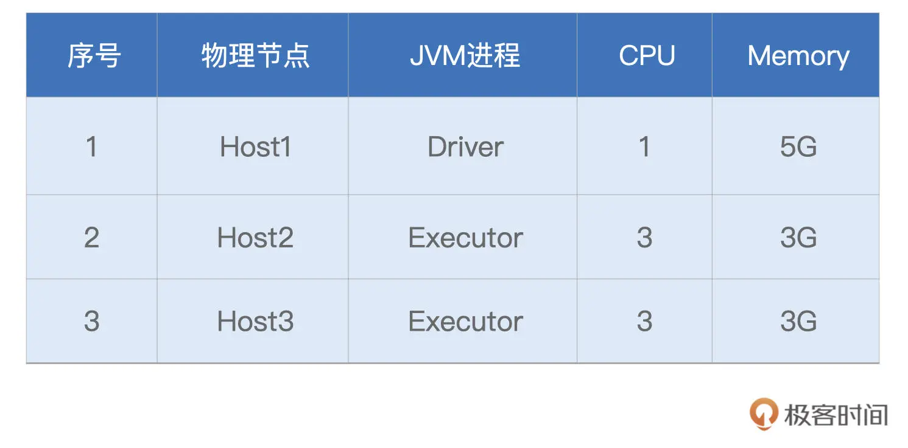

接下来是代码，在小汽车摇号应用开发那一讲，我们一步步地实现了“倍率与中签率分析”的计算逻辑，这里咱们不妨一起回顾一下。

```
import org.apache.spark.sql.DataFrame
 
val rootPath: String = _
// 申请者数据
val hdfs_path_apply: String = s"${rootPath}/apply"
// spark是spark-shell中默认的SparkSession实例
// 通过read API读取源文件
val applyNumbersDF: DataFrame = spark.read.parquet(hdfs_path_apply)
 
// 中签者数据
val hdfs_path_lucky: String = s"${rootPath}/lucky"
// 通过read API读取源文件
val luckyDogsDF: DataFrame = spark.read.parquet(hdfs_path_lucky)
 
// 过滤2016年以后的中签数据，且仅抽取中签号码carNum字段
val filteredLuckyDogs: DataFrame = luckyDogsDF.filter(col("batchNum") >= "201601").select("carNum")
 
// 摇号数据与中签数据做内关联，Join Key为中签号码carNum
val jointDF: DataFrame = applyNumbersDF.join(filteredLuckyDogs, Seq("carNum"), "inner")
 
// 以batchNum、carNum做分组，统计倍率系数
val multipliers: DataFrame = jointDF.groupBy(col("batchNum"),col("carNum"))
.agg(count(lit(1)).alias("multiplier"))
 
// 以carNum做分组，保留最大的倍率系数
val uniqueMultipliers: DataFrame = multipliers.groupBy("carNum")
.agg(max("multiplier").alias("multiplier"))
 
// 以multiplier倍率做分组，统计人数
val result: DataFrame = uniqueMultipliers.groupBy("multiplier")
.agg(count(lit(1)).alias("cnt"))
.orderBy("multiplier")
 
result.collect
```

今天我们在此基础上做一点变化，为了方便展示 StorageTab 页面内容，我们这里“强行”给 `applyNumbersDF` 和 `luckyDogsDF` 这两个 DataFrame 都加了 Cache。对于引用数量为 `1` 的数据集，实际上是没有必要加 Cache 的，这一点还需要你注意。

回顾完代码之后，再来看看配置项。为了让 Spark UI 能够展示运行中以及执行完毕的应用，我们还需要设置如下配置项并启动 `History Server`。

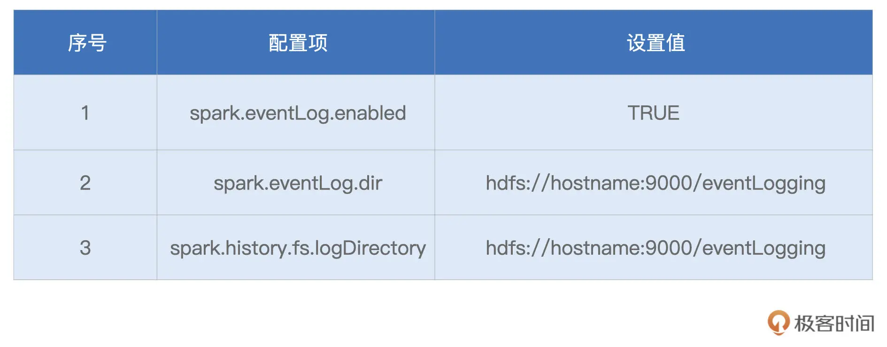

```
// SPARK_HOME表示Spark安装目录
${SPAK_HOME}/sbin/start-history-server.sh
```

好啦，到此为止，一切准备就绪。接下来，让我们启动 `spark-shell`，并提交“倍率与中签率分析”的代码，然后把目光转移到 `Host1` 的 `8080` 端口，也就是 `Driver` 所在节点的 `8080` 端口。

### 2. Spark UI 一级入口

今天的故事，要从 Spark UI 的入口开始，其实刚才说的 `8080` 端口正是 Spark UI 的入口，我们可以从这里进入 Spark UI。

打开 Spark UI，首先映入眼帘的是默认的 Jobs 页面。Jobs 页面记录着应用中涉及的 Actions 动作，以及与数据读取、移动有关的动作。其中，每一个 Action 都对应着一个 Job，而每一个 Job 都对应着一个作业。我们一会再去对 Jobs 页面做展开，现在先把目光集中在 Spark UI 最上面的导航条，这里罗列着 Spark UI 所有的一级入口，如下图所示。


导航条最左侧是 `Spark Logo` 以及版本号，后面则依次罗列着 6 个一级入口，每个入口的功能与作用我整理到了如下的表格中，你可以先整体过一下，后面我们再挨个细讲。

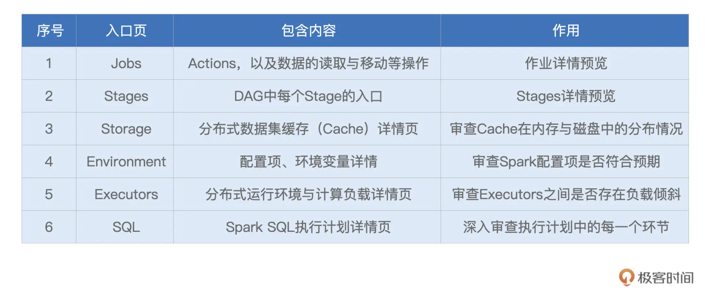

形象点说，这 6 个不同的入口，就像是体检报告中 6 大类不同的体检项，比如内科、外科、血常规，等等。接下来，让我们依次翻开“体检报告”的每一个大项，去看看“倍率与中签率分析”这个家伙的体质如何。

不过，本着由简入难的原则，咱们并不会按照 Spark UI 罗列的顺序去查看各个入口，而是按照 `Executors` > `Environment` > `Storage` > `SQL` > `Jobs` > `Stages` 的顺序，去翻看“体检报告”。

其中，前 3 个入口都是详情页，不存在二级入口；而后 3 个入口都是预览页，都需要访问二级入口，才能获取更加详细的内容。显然，相比预览页，详情页来得更加直接。接下来，让我们从 `Executors` 开始，先来了解一下应用的计算负载。

#### 2.1 Executors

Executors Tab 的主要内容如下，主要包含 “Summary” 和 “Executors” 两部分。这两部分所记录的度量指标是一致的，其中 “Executors” 以更细的粒度记录着每一个 Executor 的详情，而第一部分“Summary”是下面所有 Executors 度量指标的简单加和。

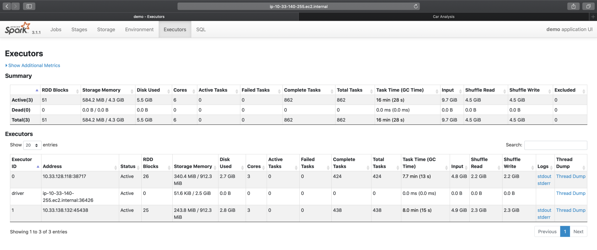

我们一起来看一下，Spark UI 都提供了哪些 Metrics，来量化每一个 Executor 的工作负载（Workload）。为了叙述方便，我们以表格的形式说明这些 Metrics 的含义与作用。

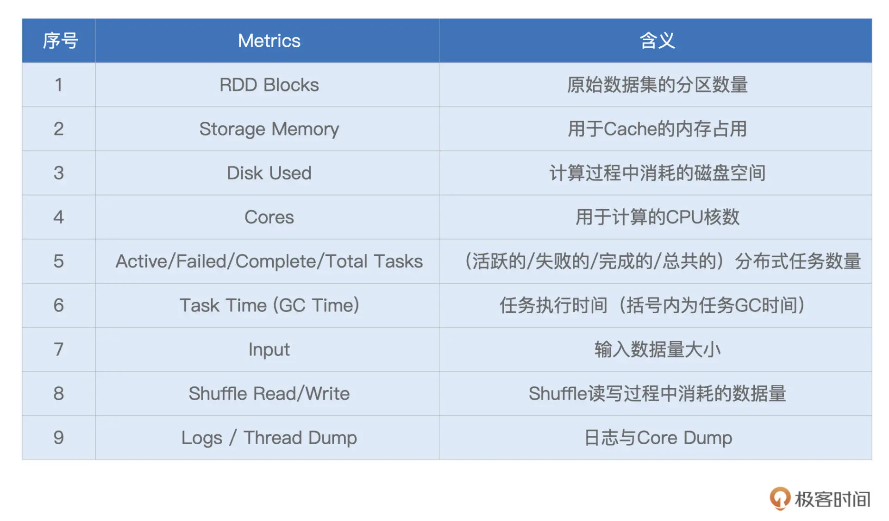

不难发现，Executors 页面清清楚楚地记录着每一个 Executor 消耗的数据量，以及它们对 CPU、内存与磁盘等硬件资源的消耗。基于这些信息，我们可以轻松判断不同 Executors 之间是否存在负载不均衡的情况，进而判断应用中是否存在数据倾斜的隐患。

对于 Executors 页面中每一个 Metrics 的具体数值，它们实际上是 Tasks 执行指标在 Executors 粒度上的汇总。因此，对于这些 Metrics 的释义，咱们留到 Stages 二级入口再去展开，这里暂时不做一一深入。你不妨结合“倍率与中签率分析”的应用，去浏览一下不同 Metrics 的具体数值，先对这些数字有一个直观上的感受。

实际上，这些具体的数值，并没有什么特别之处，除了 `RDD Blocks` 和 `Complete Tasks` 这两个 Metrics。细看一下这两个指标，你会发现，`RDD Blocks` 是 51（总数），而 `Complete Tasks`（总数）是 862。

之前讲 RDD 并行度的时候，我们说过，RDD 并行度就是 RDD 的分区数量，每个分区对应着一个 Task，因此 RDD 并行度与分区数量、分布式任务数量是一致的。可是，截图中的 51 与 862，显然不在一个量级，这是怎么回事呢？

这里我先买个关子，把它给你留作思考题，你不妨花些时间，去好好想一想。如果没想清楚也没关系，我们在评论区会继续讨论这个问题。

#### 2.2 Environment

接下来，我们再来说说 Environment。顾名思义，Environment 页面记录的是各种各样的环境变量与配置项信息，如下图所示。

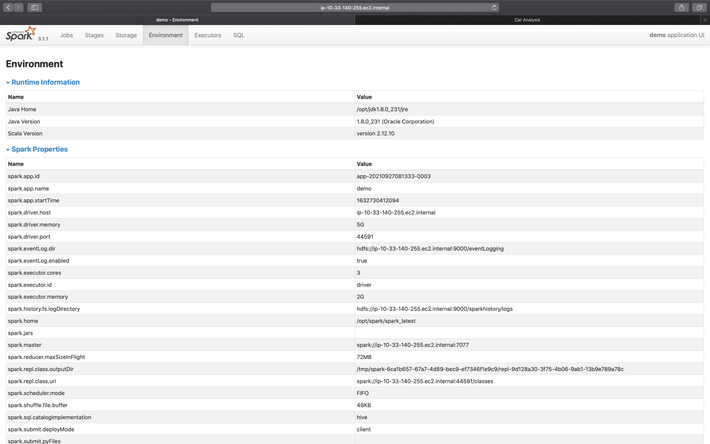

为了让你抓住主线，我并没有给你展示 Environment 页面所包含的全部信息，就类别来说，它包含 5 大类环境信息，为了方便叙述，我把它们罗列到了下面的表格中。

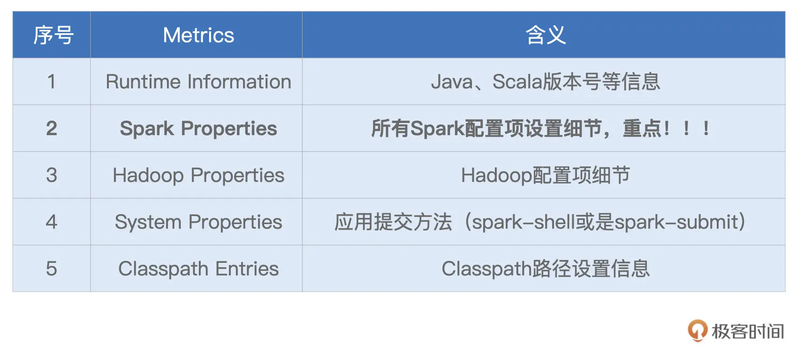

显然，这 5 类信息中，Spark Properties 是重点，其中记录着所有在运行时生效的 Spark 配置项设置。通过 Spark Properties，我们可以确认运行时的设置，与我们预期的设置是否一致，从而排除因配置项设置错误而导致的稳定性或是性能问题。

#### 2.3 Storage

说完 Executors 与 Environment，我们来看一级入口的最后一个详情页：Storage。

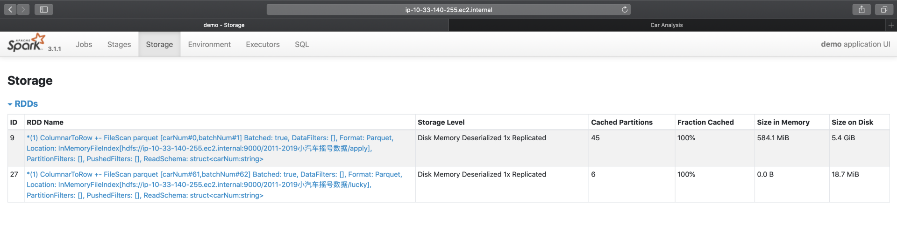

Storage 详情页，记录着每一个分布式缓存（RDD Cache、DataFrame Cache）的细节，包括缓存级别、已缓存的分区数、缓存比例、内存大小与磁盘大小。

在[第 8 讲](https://time.geekbang.org/column/article/422400)，我们介绍过 Spark 支持的不同缓存级别，它是存储介质（内存、磁盘）、存储形式（对象、序列化字节）与副本数量的排列组合。对于 DataFrame 来说，默认的级别是单副本的 `Disk Memory Deserialized`，如上图所示，也就是存储介质为内存加磁盘，存储形式为对象的单一副本存储方式

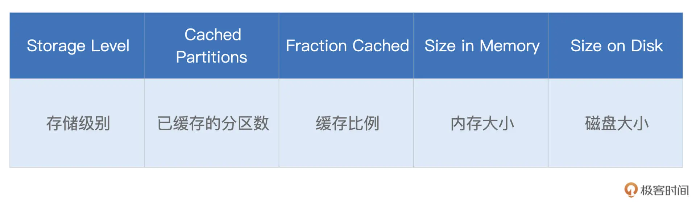

`Cached Partitions` 与 `Fraction Cached` 分别记录着数据集成功缓存的分区数量，以及这些缓存的分区占所有分区的比例。当 `Fraction Cached` 小于 `100%` 的时候，说明分布式数据集并没有完全缓存到内存（或是磁盘），对于这种情况，我们要警惕缓存换入换出可能会带来的性能隐患。

后面的 `Size in Memory` 与 `Size in Disk`，则更加直观地展示了数据集缓存在内存与硬盘中的分布。从上图中可以看到，由于内存受限（`3GB/Executor`），摇号数据几乎全部被缓存到了磁盘，只有 `584MB` 的数据，缓存到了内存中。坦白地说，这样的缓存，对于数据集的重复访问，并没有带来实质上的性能收益。

基于 Storage 页面提供的详细信息，我们可以有的放矢地设置与内存有关的配置项，如 `spark.executor.memory`、`spark.memory.fraction`、`spark.memory.storageFraction`，从而有针对性对 `Storage Memory` 进行调整。

#### 2.4 SQL

接下来，我们继续说一级入口的 SQL 页面。当我们的应用包含 `DataFrame`、`Dataset` 或是 SQL 的时候，`Spark UI` 的 SQL 页面，就会展示相应的内容，如下图所示。


具体来说，一级入口页面，以 Actions 为单位，记录着每个 Action 对应的 Spark SQL 执行计划。我们需要点击 “Description” 列中的超链接，才能进入到二级页面，去了解每个执行计划的详细信息。这部分内容，我们留到下一讲的二级入口详情页再去展开。

#### 2.5 Jobs

同理，对于 Jobs 页面来说，Spark UI 也是以 Actions 为粒度，记录着每个 Action 对应作业的执行情况。我们想要了解作业详情，也必须通过 “Description” 页面提供的二级入口链接。你先有个初步认识就好，下一讲我们再去展开。

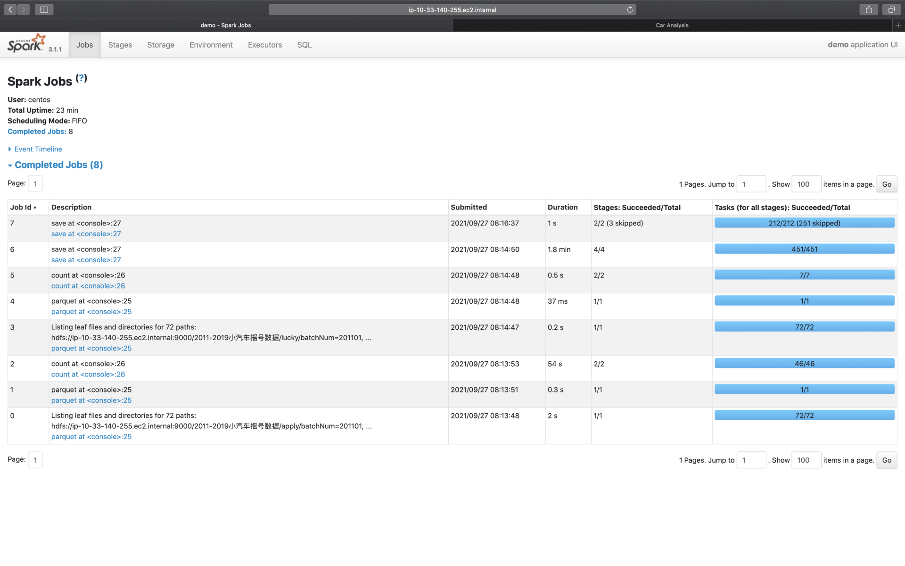

相比 SQL 页面的 3 个 Actions：`save`（保存计算结果）、`count`（统计申请编号）、`count`（统计中签编号），结合前面的概览页截图你会发现，Jobs 页面似乎凭空多出来很多 Actions。

主要原因在于，在 Jobs 页面，Spark UI 会把数据的读取、访问与移动，也看作是一类 “Actions”，比如图中 Job Id 为 `0`、`1`、`3`、`4` 的那些。这几个 Job，实际上都是在读取源数据（元数据与数据集本身）。

至于最后多出来的、Job Id 为 7 的 save，你不妨结合最后一行代码，去想想问什么。这里我还是暂时卖个关子，留给你足够的时间去思考，咱们评论区见。

```
result05_01.write.mode("Overwrite").format("csv").save(s"${rootPath}/results/result05_01")
```

#### 2.6 Stages

我们知道，每一个作业，都包含多个阶段，也就是我们常说的 Stages。在 Stages 页面，Spark UI 罗列了应用中涉及的所有 Stages，这些 Stages 分属于不同的作业。要想查看哪些 Stages 隶属于哪个 Job，还需要从 Jobs 的 `Descriptions` 二级入口进入查看。

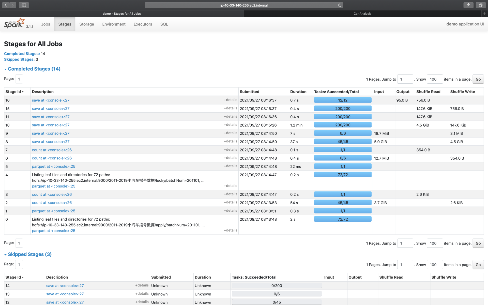

Stages 页面，更多地是一种预览，要想查看每一个 Stage 的详情，同样需要从 “Description” 进入 Stage 详情页（下一讲详细展开）。

好啦，到此为止，对于导航条中的不同页面，我们都做了不同程度的展开。简单汇总下来，其中 **Executors、Environment、Storage 是详情页，开发者可以通过这 3 个页面，迅速地了解集群整体的计算负载、运行环境，以及数据集缓存的详细情况；而 SQL、Jobs、Stages，更多地是一种罗列式的展示，想要了解其中的细节，还需要进入到二级入口**。

正如开篇所说，二级入口的讲解，我们留到下一讲再去探讨，敬请期待。

### 3. 重点回顾

好啦，今天的课程，到这里就讲完啦。今天的内容比较多，涉及的 Metrics 纷繁而又复杂，仅仅听一遍我的讲解，还远远不够，还需要你结合日常的开发，去多多摸索与体会，加油！

今天这一讲，我们从简单、直接的一级入口入手，按照 “Executors -> Environment -> Storage -> SQL -> Jobs -> Stages” 的顺序，先后介绍了一级入口的详情页与概览页。对于这些页面中的内容，我把需要重点掌握的部分，整理到了如下表格，供你随时参考。

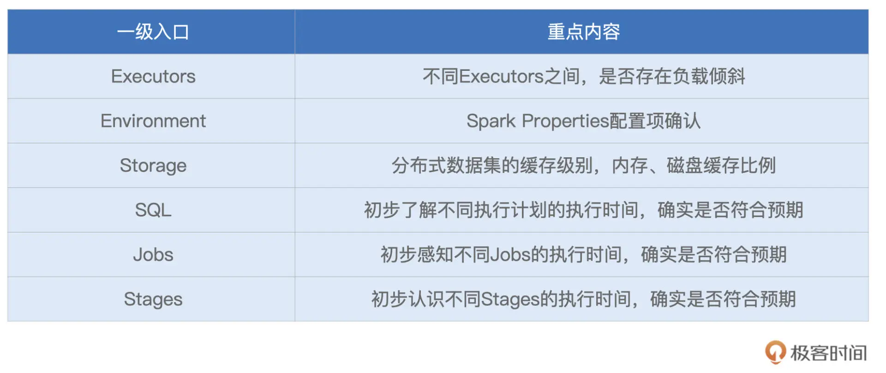

### Reference

- [21｜Spark UI（上）：如何高效地定位性能问题？](https://time.geekbang.org/column/article/431450)