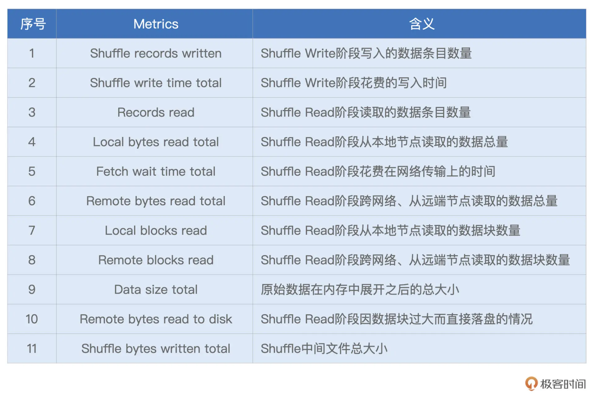

## 22｜Spark UI（下）：如何高效地定位性能问题？

在上一讲，我们一起梳理了 Spark UI 的一级入口。其中 Executors、Environment、Storage 是详情页，开发者可以通过这 3 个页面，迅速地了解集群整体的计算负载、运行环境，以及数据集缓存的详细情况。不过 SQL、Jobs、Stages，更多地是一种罗列式的展示，想要了解其中的细节，还需要进入到二级入口。

沿用之前的比喻，身为“大夫”的开发者想要结合经验，迅速定位“病灶”，离不开各式各样的指标项。而今天要讲的二级入口，相比一级入口，内容更加丰富、详尽。要想成为一名“临床经验丰富”的老医生，咱们先要做到熟练解读这些度量指标。

所谓二级入口，它指的是，**通过一次超链接跳转才能访问到的页面**。对于 `SQL`、`Jobs` 和 `Stages` 这 3 类入口来说，二级入口往往已经提供了足够的信息，基本覆盖了“体检报告”的全部内容。因此，尽管 Spark UI 也提供了少量的三级入口（需要两跳才能到达的页面），但是这些隐藏在“犄角旮旯”的三级入口，往往并不需要开发者去特别关注。

接下来，我们就沿着 `SQL -> Jobs -> Stages` 的顺序，依次地去访问它们的二级入口，从而针对全局 DAG、作业以及执行阶段，获得更加深入的探索与洞察。

### 1. SQL 详情页

在 SQL Tab 一级入口，我们看到有 3 个条目，分别是 count（统计申请编号）、count（统计中签编号）和 save。前两者的计算过程，都是读取数据源、缓存数据并触发缓存的物化，相对比较简单，因此，我们把目光放在 save 这个条目上。

点击图中的“save at:27”，即可进入到该作业的执行计划页面，如下图所示。

为了聚焦重点，这里我们仅截取了部分的执行计划，想要获取完整的执行计划，你可以通过访问这里来获得。为了方便你阅读，这里我手绘出了执行计划的示意图，供你参考，如下图所示。

可以看到，“倍率与中签率分析”应用的计算过程，非常具有代表性，它涵盖了数据分析场景中大部分的操作，也即**过滤、投影、关联、分组聚合和排序**。图中**红色的部分为 Exchange，代表的是 Shuffle 操作，蓝色的部分为 Sort，也就是排序，而绿色的部分是 Aggregate，表示的是（局部与全局的）数据聚合**。

无疑，这三部分是硬件资源的主要消费者，同时，对于这 3 类操作，Spark UI 更是提供了详细的 Metrics 来刻画相应的硬件资源消耗。接下来，咱们就重点研究一下这 3 类操作的度量指标。

#### Exchange

下图中并列的两个 Exchange，对应的是示意图中 SortMergeJoin 之前的两个 Exchange。它们的作用是对申请编码数据与中签编码数据做 Shuffle，为数据关联做准备。

可以看到，对于每一个 Exchange，Spark UI 都提供了丰富的 Metrics 来刻画 Shuffle 的计算过程。从 `Shuffle Write` 到 `Shuffle Read`，从数据量到处理时间，应有尽有。为了方便说明，对于 Metrics 的解释与释义，我以表格的方式进行了整理，供你随时查阅。

结合这份 Shuffle 的“体检报告”，我们就能以量化的方式，去掌握 Shuffle 过程的计算细节，从而为调优提供更多的洞察与思路。

为了让你获得直观感受，我还是举个例子说明。比方说，我们观察到过滤之后的中签编号数据大小不足 10MB（7.4MB），这时我们首先会想到，对于这样的大表 Join 小表，Spark SQL 选择了 `SortMergeJoin` 策略是不合理的。

基于这样的判断，我们完全可以让 Spark SQL 选择 BroadcastHashJoin 策略来提供更好的执行性能。至于调优的具体方法，想必不用我多说，你也早已心领神会：**要么用强制广播，要么利用 Spark 3.x 版本提供的 AQE 特性**。

你不妨结合本讲开头的代码，去完成 S`ortMergeJoin` 到 `BroadcastHashJoin` 策略转换的调优，期待你在留言区分享你的调优结果。

#### Sort

接下来，我们再来说说 Sort。相比 Exchange，Sort 的度量指标没那么多，不过，他们足以让我们一窥 Sort 在运行时，对于内存的消耗，如下图所示。

按照惯例，我们还是先把这些 Metrics 整理到表格中，方便后期查看。

可以看到，“Peak memory total” 和 “Spill size total” 这两个数值，足以指导我们更有针对性地去设置 `spark.executor.memory`、`spark.memory.fraction`、`spark.memory.storageFraction`，从而使得 Execution Memory 区域得到充分的保障。

以上图为例，结合 18.8GB 的峰值消耗，以及 12.5GB 的磁盘溢出这两条信息，我们可以判断出，当前 3GB 的 Executor Memory 是远远不够的。那么我们自然要去调整上面的 3 个参数，来加速 Sort 的执行性能。

#### Aggregate

与 Sort 类似，衡量 Aggregate 的度量指标，主要记录的也是操作的内存消耗，如图所示。

可以看到，对于 Aggregate 操作，Spark UI 也记录着磁盘溢出与峰值消耗，即 `Spill size` 和 `Peak memory total`。这两个数值也为内存的调整提供了依据，以上图为例，零溢出与 3.2GB 的峰值消耗，证明当前 3GB 的 Executor Memory 设置，对于 Aggregate 计算来说是绰绰有余的。

此为止，我们分别介绍了 Exchange、Sort 和 Aggregate 的度量指标，并结合“倍率与中签率分析”的例子，进行了简单的调优分析。

纵观“倍率与中签率分析”完整的 DAG，我们会发现它包含了若干个 Exchange、Sort、Aggregate 以及 Filter 和 Project。**结合上述的各类 Metrics，对于执行计划的观察与洞见，我们需要以统筹的方式，由点到线、由局部到全局地去进行**。

### 2. Jobs 详情页

接下来，我们再来说说 Jobs 详情页。Jobs 详情页非常的简单、直观，它罗列了隶属于当前 Job 的所有 Stages。要想访问每一个 Stage 的执行细节，我们还需要通过“Description”的超链接做跳转。

### 3. Stages 详情页

实际上，要访问 Stage 详情，我们还有另外一种选择，那就是直接从 Stages 一级入口进入，然后完成跳转。因此，Stage 详情页也归类到二级入口。接下来，我们以 Id 为 10 的 Stage 为例，去看一看详情页都记录着哪些关键信息。

在所有二级入口中，Stage 详情页的信息量可以说是最大的。点进 Stage 详情页，可以看到它主要包含 3 大类信息，分别是 `Stage DAG`、`Event Timeline` 与 `Task Metrics`。

其中，Task Metrics 又分为“Summary”与“Entry details”两部分，提供不同粒度的信息汇总。而 Task Metrics 中记录的指标类别，还可以通过“Show Additional Metrics”选项进行扩展。

#### 3.1 Stage DAG

接下来，我们沿着“Stage DAG -> Event Timeline -> Task Metrics”的顺序，依次讲讲这些页面所包含的内容。

首先，我们先来看最简单的 `Stage DAG`。点开蓝色的 “DAG Visualization” 按钮，我们就能获取到当前 Stage 的 DAG，如下图所示。

之所以说 Stage DAG 简单，是因为咱们在 SQL 二级入口，已经对 DAG 做过详细的说明。而 `Stage DAG` 仅仅是 SQL 页面完整 DAG 的一个子集，毕竟，SQL 页面的 DAG，针对的是作业（Job）。因此，只要掌握了作业的 DAG，自然也就掌握了每一个 Stage 的 DAG。

#### 3.2 Event Timeline

与“DAG Visualization”并列，在“Summary Metrics”之上，有一个“Event Timeline”按钮，点开它，我们可以得到如下图所示的可视化信息。

vent Timeline，记录着分布式任务调度与执行的过程中，不同计算环节主要的时间花销。图中的每一个条带，都代表着一个分布式任务，条带由不同的颜色构成。其中不同颜色的矩形，代表不同环节的计算时间。

为了方便叙述，我还是用表格形式帮你梳理了这些环节的含义与作用，你可以保存以后随时查看。

理想情况下，条带的大部分应该都是绿色的（如图中所示），也就是任务的时间消耗，大部分都是执行时间。不过，实际情况并不总是如此，比如，有些时候，蓝色的部分占比较多，或是橙色的部分占比较大。

在这些情况下，我们就可以结合 Event Timeline，来判断作业是否存在调度开销过大、或是 Shuffle 负载过重的问题，从而有针对性地对不同环节做调优。

比方说，如果条带中深蓝的部分（Scheduler Delay）很多，那就说明任务的调度开销很重。这个时候，我们就需要参考公式：D / P ~ M / C，来相应地调整 CPU、内存与并行度，从而减低任务的调度开销。其中，D 是数据集尺寸，P 为并行度，M 是 Executor 内存，而 C 是 Executor 的 CPU 核数。波浪线~ 表示的是，等式两边的数值，要在同一量级。

再比如，如果条带中黄色（Shuffle Write Time）与橙色（Shuffle Read Time）的面积较大，就说明任务的 Shuffle 负载很重，这个时候，我们就需要考虑，有没有可能通过利用 Broadcast Join 来消除 Shuffle，从而缓解任务的 Shuffle 负担。

#### 3.3 Task Metrics

说完 Stage DAG 与 Event Timeline，最后，我们再来说一说 Stage 详情页的重头戏：Task Metrics。之所以说它是重头戏，在于 Task Metrics 以不同的粒度，提供了详尽的量化指标。其中，“Tasks”以 Task 为粒度，记录着每一个分布式任务的执行细节，而“Summary Metrics”则是对于所有 Tasks 执行细节的统计汇总。我们先来看看粗粒度的“Summary Metrics”，然后再去展开细粒度的“Tasks”。

##### Summary Metrics

首先，我们点开“Show Additional Metrics”按钮，勾选“Select All”，让所有的度量指标都生效，如下图所示。这么做的目的，在于获取最详尽的 Task 执行信息。

可以看到，“Select All”生效之后，Spark UI 打印出了所有的执行细节。老规矩，为了方便叙述，我还是把这些 Metrics 整理到表格中，方便你随时查阅。其中，`Task Deserialization Time`、`Result Serialization Time`、`Getting Result Time`、`Scheduler Delay` 与刚刚表格中的含义相同，不再赘述，这里我们仅整理新出现的 Task Metrics。

对于这些详尽的 Task Metrics，难能可贵地，Spark UI 以最大最小（max、min）以及分位点（25% 分位、50% 分位、75% 分位）的方式，提供了不同 Metrics 的统计分布。这一点非常重要，原因在于，这些 Metrics 的统计分布，可以让我们非常清晰地量化任务的负载分布。

换句话说，根据不同 Metrics 的统计分布信息，我们就可以轻而易举地判定，当前作业的不同任务之间，是相对均衡，还是存在严重的倾斜。如果判定计算负载存在倾斜，那么我们就要利用 AQE 的自动倾斜处理，去消除任务之间的不均衡，从而改善作业性能。

在上面的表格中，有一半的 Metrics 是与 Shuffle 直接相关的，比如 Shuffle Read Size / Records，Shuffle Remote Reads，等等。

这些 Metrics 我们在介绍 SQL 详情的时候，已经详细说过了。另外，Duration、GC Time、以及 Peak Execution Memory，这些 Metrics 的含义，要么已经讲过，要么过于简单、无需解释。因此，对于这 3 个指标，咱们也不再多着笔墨。这里特别值得你关注的，

这里特别值得你关注的，是 Spill（Memory）和 Spill（Disk）这两个指标。Spill，也即溢出数据，它指的是因内存数据结构（PartitionedPairBuffer、AppendOnlyMap，等等）空间受限，而腾挪出去的数据。Spill（Memory）表示的是，这部分数据在内存中的存储大小，而 Spill（Disk）表示的是，这些数据在磁盘中的大小。

因此，用 Spill（Memory）除以 Spill（Disk），就可以得到“数据膨胀系数”的近似值，我们把它记为 Explosion ratio。有了 Explosion ratio，对于一份存储在磁盘中的数据，我们就可以估算它在内存中的存储大小，从而准确地把握数据的内存消耗。

##### Tasks

介绍完粗粒度的 Summary Metrics，接下来，我们再来说说细粒度的“Tasks”。实际上，Tasks 的不少指标，与 Summary 是高度重合的，如下图所示。同理，这些重合的 Metrics，咱们不再赘述，你可以参考 Summary 的部分，来理解这些 Metrics。唯一的区别，就是这些指标是针对每一个 Task 进行度量的。

按照惯例，咱们还是把 Tasks 中那些新出现的指标，整理到表格中，以备后续查看。

可以看到，新指标并不多，这里最值得关注的，是 Locality level，也就是本地性级别。在调度系统中，我们讲过，每个 Task 都有自己的本地性倾向。结合本地性倾向，调度系统会把 Tasks 调度到合适的 Executors 或是计算节点，尽可能保证“数据不动、代码动”。

Logs 与 Errors 属于 Spark UI 的三级入口，它们是 Tasks 的执行日志，详细记录了 Tasks 在执行过程中的运行时状态。一般来说，我们不需要深入到三级入口去进行 Debug。Errors 列提供的报错信息，往往足以让我们迅速地定位问题所在。

### 重点回顾

好啦，今天的课程，到这里就讲完啦。今天这一讲，我们分别学习了二级入口的 SQL、Jobs 与 Stages。每个二级入口的内容都很丰富，提前知道它们所涵盖的信息，对我们寻找、启发与探索性能调优的思路非常有帮助。

到此为止，关于 Spark UI 的全部内容就讲完啦。Spark UI 涉及的 Metrics 纷繁而又复杂，一次性记住确实有难度，所以通过这一讲，你只要清楚各级入口怎么找到，知道各个指标能给我们提供什么信息就好了。当然，仅仅跟着我去用“肉眼”学习一遍只是第一步，之后还需要你结合日常的开发，去多多摸索与体会，加油！

最后的最后，还是想提醒你，由于我们的应用是通过 spark-shell 提交的，因此节点 8080 端口的 Spark UI 会一直展示应用的“体检报告”。在我们退出 spark-shell 之后，节点 8080 端口的内存也随即消失（404 Page not found）。

要想再次查看应用的“体检报告”，需要移步至节点的 18080 端口，这里是 Spark History Server 的领地，它收集了所有（已执行完毕）应用的“体检报告”，并同样使用 Spark UI 的形式进行展示，切记切记。

### Reference

- [22｜Spark UI（下）：如何高效地定位性能问题？](https://time.geekbang.org/column/article/432066)