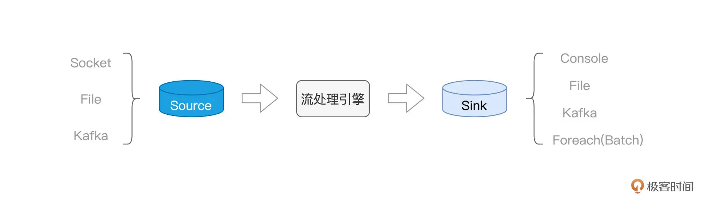
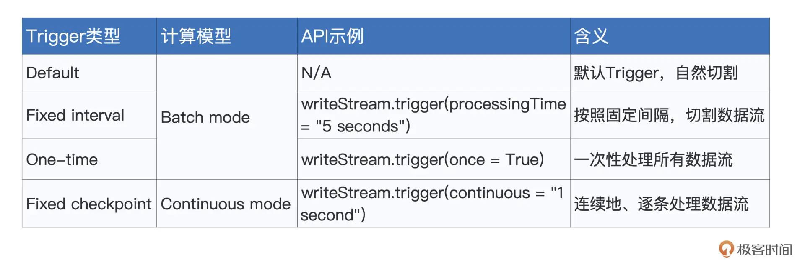
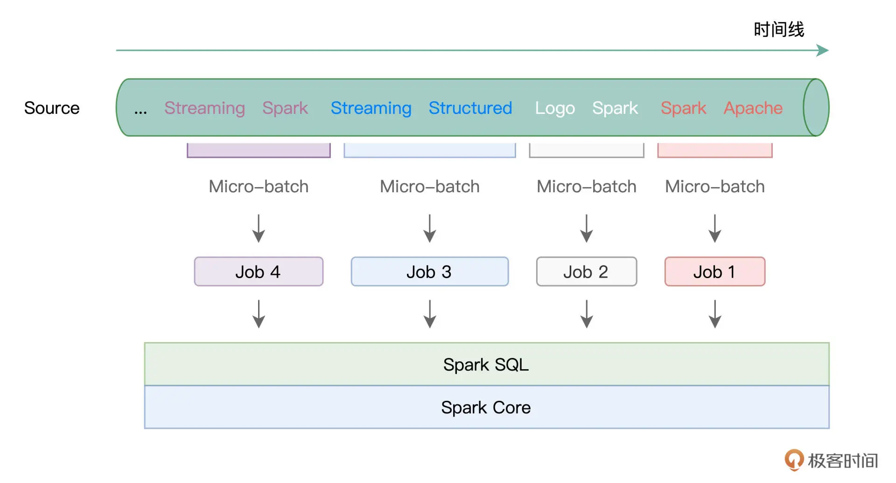
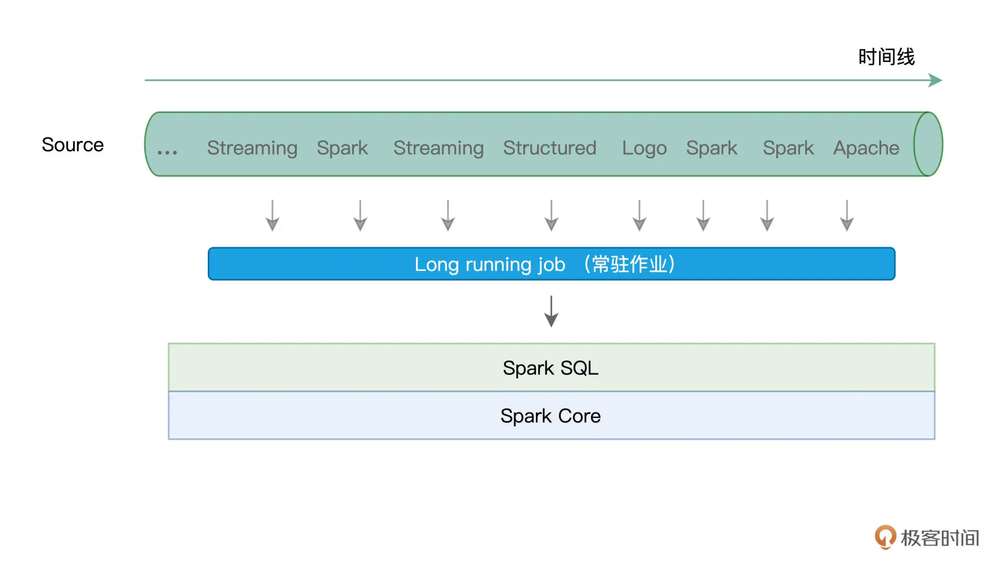
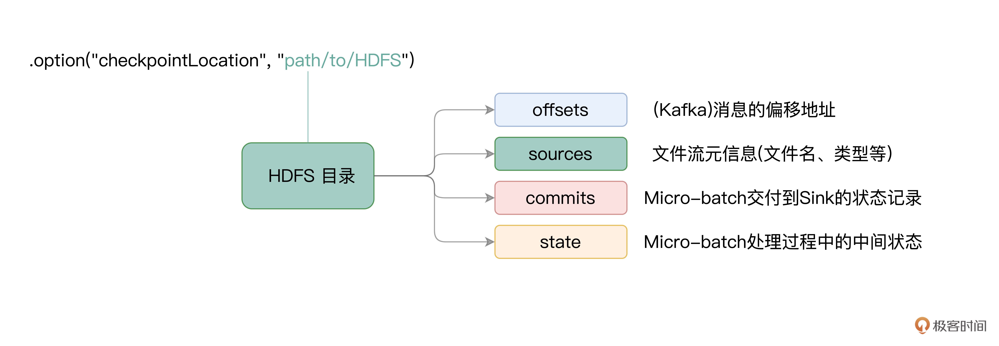
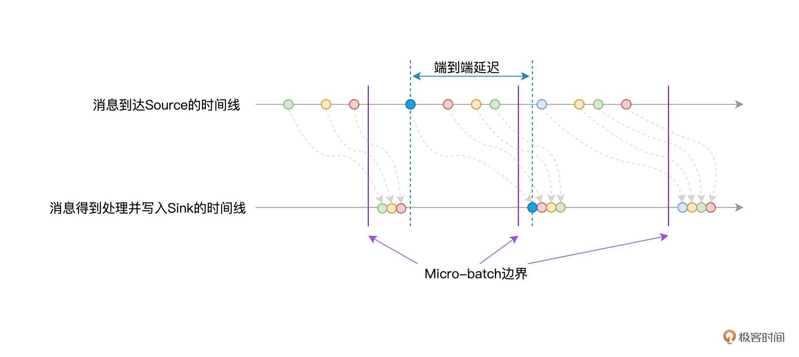
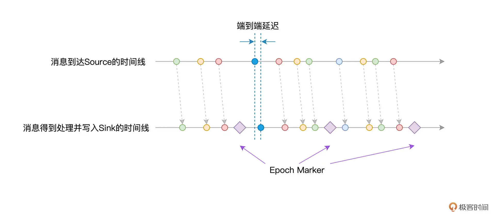

## 31｜新一代流处理框架：Batch mode和Continuous mode哪家强？

在上一讲，我们通过“流动的 Word Count”示例，初步结识了 `Structured Streaming`，并学习了流处理开发三要素，也就是 **Source、流处理引擎与 Sink**。



今天这一讲，让我们把目光集中到 `Structured Streaming`，也就是流处理引擎本身。`Structured Streaming` 与 `Spark MLlib` 并列，是 Spark 重要的子框架之一。值得一提的是，`Structured Streaming` 天然能够享受 `Spark SQL` 提供的处理能力与执行性能，同时也能与其他子框架无缝衔接。因此，基于 `Structured Streaming `这个新一代框架开发的流处理应用，天然具备优良的执行性能与良好的扩展性。

知己知彼，百战百胜。想要灵活应对不同的实时计算需求，我们就要先了解 `Structured Streaming` 的计算模型长啥样，搞清楚它如何应对容错、保持数据一致性。我们先从计算模型说起。

### 计算模型

当数据像水流一样，源源不断地流进 `Structured Streaming` 引擎的时候，引擎并不会自动地依次消费并处理这些数据，它需要一种叫做 `Trigger` 的机制，来触发数据在引擎中的计算。换句话说，Trigger 机制，决定了引擎在什么时候、以怎样的方式和频率去处理接收到的数据流。Structured Streaming 支持 4 种 Trigger，如下表所示。



要为流处理设置 `Trigger`，我们只需基于 `writeStream` API，调用 `trigger` 函数即可。`Trigger` 的种类比较多，一下子深入细节，容易让你难以把握重点，所以现在你只需要知道 `Structured Streaming` 支持种类繁多的 `Trigger` 即可。

我们先把注意力，放在计算模型上面。对于流数据，`Structured Streaming` 支持两种计算模型，分别是 `Batch mode` 和 `Continuous mode`。所谓计算模型，本质上，它要解决的问题，就是 Spark 以怎样的方式，来对待并处理流数据。这是什么意思呢？没有对比就没有鉴别，咱们不妨通过对比讲解 `Batch mode` 和 `Continuous mode`，来深入理解计算模型的含义。

### Batch mode

们先来说说 `Batch mode`，所谓 `Batch mode`，它指的是 Spark 将连续的数据流，切割为离散的数据微批（`Micro-batch`），也即小份的数据集。形象一点说，`Batch mode` 就像是“抽刀断水”，两刀之间的水量，就是一个 `Micro-batch`。而每一份 `Micro-batch`，都会触发一个 `Spark Job`，每一个 `Job` 会包含若干个 `Tasks`。学习过基础知识与 `Spark SQL` 模块之后，我们知道，这些 `Tasks` 最终会交由 `Spark SQL` 与 `Spark Core` 去做优化与执行。



在这样的计算模型下，不同种类的 `Trigger`，如 `Default`、`Fixed interval` 以及 `One-time`，无非是在以不同的方式控制 `Micro-batch` 切割的粒度罢了。

比方说，在 `Default Trigger` 下，Spark 会根据数据流的流入速率，自行决定切割粒度，无需开发者关心。而如果开发者想要对切割粒度进行人为的干预，则可以使用 `Fixed interval Trigger`，来明确定义 `Micro-batch` 切割的时间周期。例如，`Trigger.ProcessingTime(“5 seconds”)`，表示的是，每隔 `5` 秒钟，切割一个 `Micro-batch`。

### Continuous mode

与 `Batch mode` 不同，`Continuous mode` 并不切割数据流，而是以事件 / 消息（Event / Message）为粒度，用连续的方式来处理数据。这里的事件或是消息，指代的是原始数据流中最细粒度的数据形式，它可以是一个单词、一行文本，或是一个画面帧。

以“流动的 Word Count”为例，`Source` 中的事件 / 消息就是一个个英文单词。说到这里，你可能会有疑问：“在 `Batch mode` 下，`Structured Streaming` 不也是连续地创建 Micro-batch 吗？数据同样是不丢不漏，`Continuous mode` 与 `Batch mode` 有什么本质上的区别吗？”



一图胜千言，对比两种计算模型的示意图，我们可以轻松地发现它们之间的差异所在。在 `Continuous mode` 下，`Structured Streaming` 使用一个常驻作业（`Long running job`）来处理数据流（或者说服务）中的每一条消息。

那么问题来了，相比每个 `Micro-batch` 触发一个作业，`Continuous mode` 选择采用常驻作业来进行服务，有什么特别的收益吗？或者换句话说，这两种不同的计算模型，各自都有哪些优劣势呢？用一句话来概括，**Batch mode 吞吐量大、延迟高（秒级），而 Continuous mode 吞吐量低、延迟也更低（毫秒级）**。吞吐量指的是单位时间引擎处理的消息数量，批量数据能够更好地利用 Spark 分布式计算引擎的优势，因此 `Batch mode` 在吞吐量自然更胜一筹。

而要回答为什么 `Continuous mode` 能够在延迟方面表现得更加出色，我们还得从 `Structured Streaming` 的容错机制说起。

### 容错机制

对于任何一个流处理引擎来说，容错都是一项必备的能力。所谓容错，它指的是，在计算过程中出现错误（作业层面、或是任务层面，等等）的时候，流处理引擎有能力恢复被中断的计算过程，同时保证数据上的不重不漏，也即保证数据处理的一致性。

从数据一致性的角度出发，这种容错的能力，可以划分为 3 种水平：

- At most once：最多交付一次，数据存在丢失的风险；
- At least once：最少交付一次，数据存在重复的可能；
- Exactly once：交付且仅交付一次，数据不重不漏。


这里的交付，指的是数据从 `Source` 到 `Sink` 的整个过程。对于同一条数据，它可能会被引擎处理一次或（在有作业或是任务失败的情况下）多次，但根据容错能力的不同，计算结果最终可能会交付给 `Sink` 零次、一次或是多次。

聊完基本的容错概念之后，我们再说回 `Structured Streaming`。就 `Structured Streaming` 的容错能力来说，Spark 社区官方的说法是：“结合幂等的 `Sink`，`Structured Streaming` 能够提供 `Exactly once` 的容错能力”。

实际上，这句话应该拆解为两部分。在数据处理上，结合容错机制，`Structured Streaming` 本身能够提供 “At least once” 的处理能力。而结合幂等的 `Sink`，`Structured Streaming` 可以实现端到端的 “Exactly once” 容错水平。

比方说，应用广泛的 Kafka，在 `Producer` 级别提供跨会话、跨分区的幂等性。结合 Kafka 这样的 Sink，在端到端的处理过程中，`Structured Streaming` 可以实现“Exactly once”，保证数据的不重不漏。

不过，在 `Structured Streaming` 自身的容错机制中，为了在数据处理上做到 “At least once”，`Batch mode` 与 `Continuous mode` 这两种不同的计算模型，分别采用了不同的实现方式。而容错实现的不同，正是导致两种计算模型在延迟方面差异巨大的重要因素之一。

接下来，我们就来说一说，`Batch mode` 与 `Continuous mode` 分别如何做容错。

### Batch mode 容错

在 `Batch mode` 下，`Structured Streaming` 利用 `Checkpoint` 机制来实现容错。在实际处理数据流中的 `Micro-batch` 之前，`Checkpoint` 机制会把该 `Micro-batch` 的元信息全部存储到开发者指定的文件系统路径，比如 `HDFS` 或是 `Amazon S3`。这样一来，当出现作业或是任务失败时，引擎只需要读取这些事先记录好的元信息，就可以恢复数据流的“断点续传”。

要指定 Checkpoint 目录，只需要在 `writeStream` API 的 `option` 选项中配置 `checkpointLocation` 即可。我们以上一讲的“流动的 Word Count”为例，代码只需要做如下修改即可。

```
df.writeStream
// 指定Sink为终端（Console）
.format("console")
 
// 指定输出选项
.option("truncate", false)
 
// 指定Checkpoint存储地址
.option("checkpointLocation", "path/to/HDFS")
 
// 指定输出模式
.outputMode("complete")
//.outputMode("update")
 
// 启动流处理应用
.start()
// 等待中断指令
.awaitTermination()
```

在 `Checkpoint` 存储目录下，有几个子目录，分别是 `offsets`、`sources`、`commits` 和 `state`，它们所存储的内容，就是各个 `Micro-batch` 的元信息日志。对于不同子目录所记录的实际内容，我把它们整理到了下面的图解中，供你随时参考。



对于每一个 `Micro-batch` 来说，在它被 `Structured Streaming` 引擎实际处理之前，`Checkpoint` 机制会先把它的元信息记录到日志文件，因此，这些日志文件又被称为 `Write Ahead Log`（WAL 日志）。

换句话说，当源数据流进 `Source` 之后，它需要先到 `Checkpoint` 目录下进行“报道”，然后才会被 `Structured Streaming` 引擎处理。毫无疑问，“报道”这一步耽搁了端到端的处理延迟，如下图所示。



除此之外，由于每个 `Micro-batch` 都会触发一个 Spark 作业，我们知道，作业与任务的频繁调度会引入计算开销，因此也会带来不同程度的延迟。在运行模式与容错机制的双重加持下，`Batch mode` 的延迟水平往往维持在秒这个量级，在最好的情况下能达到几百毫秒左右。

### Continuous mode 容错

比 `Batch mode`，`Continuous mode` 下的容错没那么复杂。在 `Continuous mode` 下，`Structured Streaming` 利用 `Epoch Marker` 机制，来实现容错。因为 `Continuous mode` 天然没有微批，所以不会涉及到微批中的延迟，到达 `Source` 中的消息可以立即被 `Structured Streaming` 引擎消费并处理。但这同时也带来一个问题，那就是引擎如何把当前的处理进度做持久化，从而为失败重试提供可能。

为了解决这个问题，Spark 引入了 Epoch Marker 机制。所谓 `Epoch Marker`，你可以把它理解成是水流中的“游标”，这些“游标”随着水流一起流动。每个游标都是一个 `Epoch Marker`，而游标与游标之间的水量，就是一个 `Epoch`，开发者可以通过如下语句来指定 `Epoch` 间隔。

```
writeStream.trigger(continuous = "1 second")
```

以表格中的代码为例，对于 Source 中的数据流，`Structured Streaming` 每隔 1 秒，就会安插一个 `Epoch Marker`，而两个 `Epoch Marker` 之间的数据，就称为一个 `Epoch`。你可能会问：“Epoch Marker 的概念倒是不难理解，不过它有什么用呢？”

在引擎处理并交付数据的过程中，每当遇到 `Epoch Marker` 的时候，引擎都会把对应 `Epoch` 中最后一条消息的 `Offset` 写入日志，从而实现容错。需要指出的是，日志的写入是异步的，因此这个过程不会对数据的处理造成延迟。

有意思的是，对于这个日志的称呼，网上往往也把它叫作 `Write Ahead Log`。不过我觉得这么叫可能不太妥当，原因在于，准备写入日志的消息，都已经被引擎消费并处理过了。`Batch mode` 会先写日志、后处理数据，而 `Continuous mode` 不一样，它是先处理数据、然后再写日志。所以，把 `Continuous mode` 的日志称作是 “Write After Log”，也许更合适一些。

我们还是用对比的方法来加深理解，接下来，我们同样通过消息到达 `Source` 与 `Structured Streaming` 引擎的时间线，来示意 `Continuous mode` 下的处理延迟。



可以看到，消息从 Source 产生之后，可以立即被 Structured Streaming 引擎消费并处理，因而在延迟性方面，能够得到更好的保障。而 `Epoch Marker` 则会帮助引擎识别当前最新处理的消息，从而把相应的 `Offset` 记录到日志中，以备失败重试。

### 重点回顾

今天这一讲，我们学习了 Structured Streaming 中两种不同的计算模型——`Batch mode` 与 `Continuous mode`。只有了解了它们各自在吞吐量、延迟性和容错等方面的特点，在面对日常工作中不同的流计算场景时，我们才能更好地做出选择。

在 `Batch mode` 下，`Structured Streaming` 会将数据流切割为一个个的 `Micro-batch`。对于每一个 `Micro-batch`，引擎都会创建一个与之对应的作业，并将作业交付给 `Spark SQL` 与 `Spark Core` 付诸优化与执行。

`Batch mode` 的特点是吞吐量大，但是端到端的延迟也比较高，延迟往往维持在秒的量级。`Batch mode` 的高延迟，一方面来自作业调度本身，一方面来自它的容错机制，也就是 `Checkpoint` 机制需要预写 `WAL（Write Ahead Log）`日志。

要想获得更低的处理延迟，你可以采用 `Structured Streaming` 的 `Continuous mode` 计算模型。在 `Continuous mode` 下，引擎会创建一个 `Long running job`，来负责消费并服务来自 `Source` 的所有消息。

在这种情况下，`Continuous mode` 天然地避开了频繁生成、调度作业而引入的计算开销。与此同时，利用 `Epoch Marker`，通过先处理数据、后记录日志的方式，`Continuous mode` 进一步消除了容错带来的延迟影响。

尺有所短、寸有所长，`Batch mode` 在吞吐量上更胜一筹，而 `Continuous mode` 在延迟性方面则能达到毫秒级。

不过，需要特别指出的是，到目前为止，**在 Continuous mode 下，Structured Streaming 仅支持非聚合（Aggregation）类操作，比如 map、filter、flatMap，等等。而聚合类的操作，比如“流动的 Word Count”中的分组计数，Continuous mode 暂时是不支持的，这一点难免会限制 Continuous mode 的应用范围，需要你特别注意**。

### Reference

- [31｜新一代流处理框架：Batch mode和Continuous mode哪家强？](https://time.geekbang.org/column/article/447514)