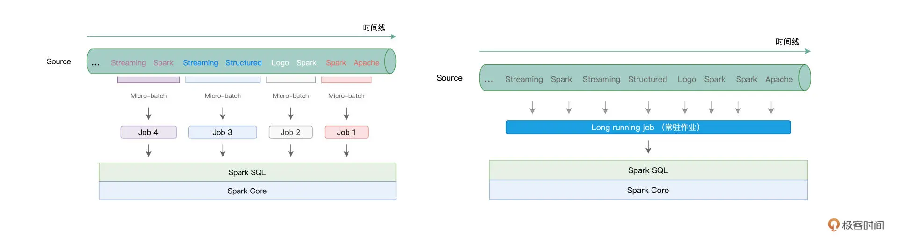

## 32｜Window操作&Watermark：流处理引擎提供了哪些优秀机制？

在上一讲，我们从原理的角度出发，学习了 `Structured Streaming` 的计算模型与容错机制。深入理解这些基本原理，会帮我们开发流处理应用打下坚实的基础。在“流动的 Word Count”那一讲，我们演示了在 Structured Streaming 框架下，如何做流处理开发的一般流程。基于 `readStream` API 与 `writeStream` API，我们可以像读写 `DataFrame` 那样，轻松地从 `Source` 获取数据流，并把处理过的数据写入 `Sink`。

今天这一讲，咱们从功能的视角出发，继续来聊一聊 `Structured Streaming` 流处理引擎都为开发者都提供了哪些特性与能力，让你更灵活地设计并实现流处理应用。

### Structured Streaming 怎样坐享其成？

学习过计算模型之后，我们知道，不管是 `Batch mode` 的多个 `Micro-batch`、多个作业的执行方式，还是 `Continuous mode` 下的一个 `Long running job`，这些作业的执行计划，最终都会交付给 `Spark SQL` 与 `Spark Core` 付诸优化与执行。

而这，会带来两个方面的收益。一方面，凡是 Spark SQL 支持的开发能力，不论是丰富的 `DataFrame` 算子，还是灵活的 SQL 查询，`Structured Streaming` 引擎都可以拿来即用。基于之前学过的内容，我们可以像处理普通的 `DataFrame` 那样，对基于流数据构建的 `DataFrame` 做各式各样的转换与聚合。

另一方面，既然开发入口同为 DataFrame，那么流处理应用同样能够享有 Spark SQL 提供的“性能红利”。在 Spark SQL 学习模块，我们学习过 `Catalyst` 优化器与 `Tungsten`，这两个组件会对用户代码做高度优化，从而提升应用的执行性能。

因此，就框架的功能来说，我们可以简单地概括为，`Spark SQL` 所拥有的能力，`Structured Streaming` 都有。不过，除了基本的数据处理能力以外，为了更好地支持流计算场景，`Structured Streaming` 引擎还提供了一些专门针对流处理的计算能力，比如说 `Window` 操作、`Watermark` 与延迟数据处理，等等。

### Window 操作

### Late data 与 Watermark

### 重点回顾

### Reference

- [32｜Window操作&Watermark：流处理引擎提供了哪些优秀机制？](https://time.geekbang.org/column/article/450916)