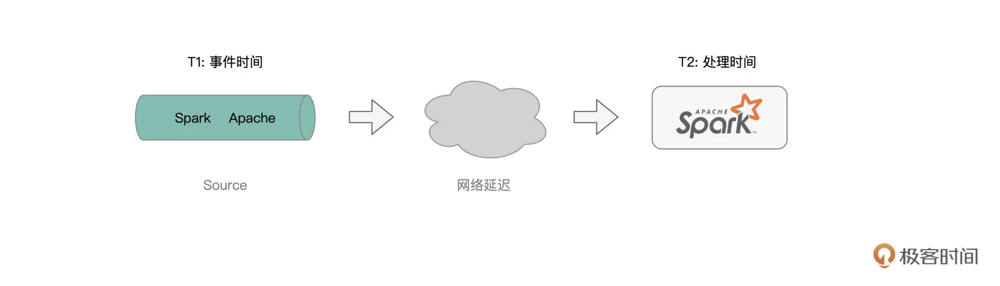
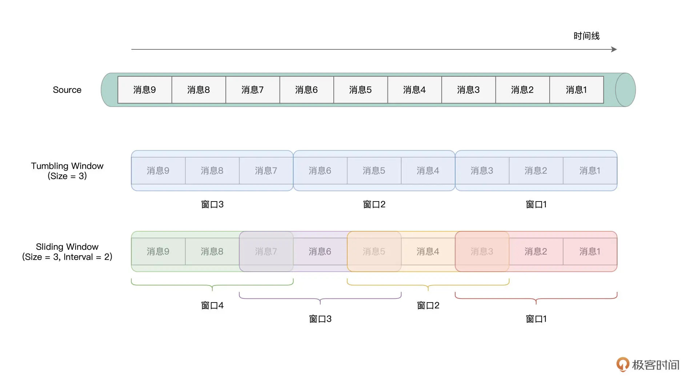
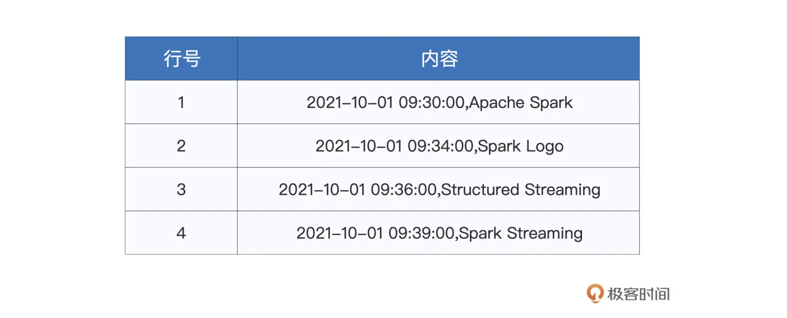
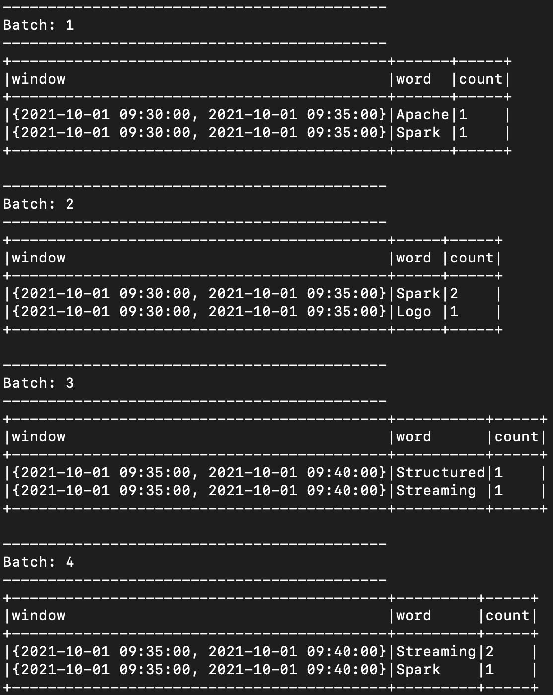
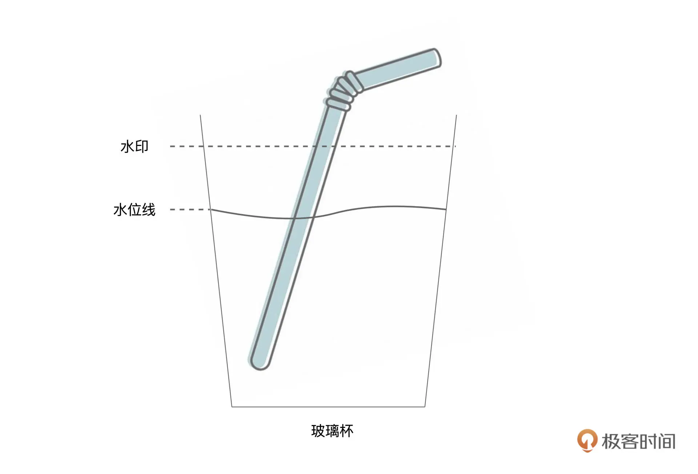
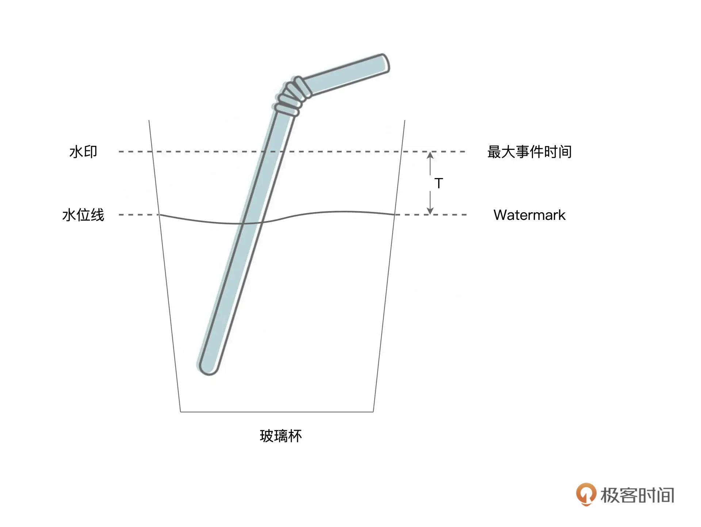
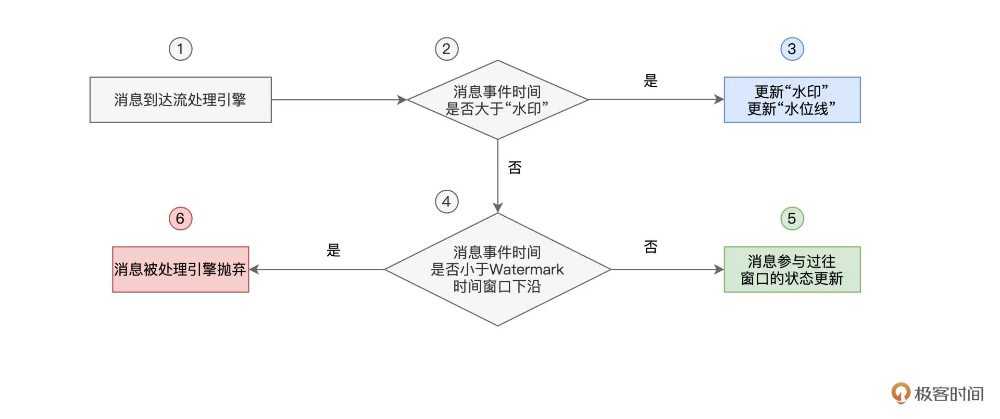
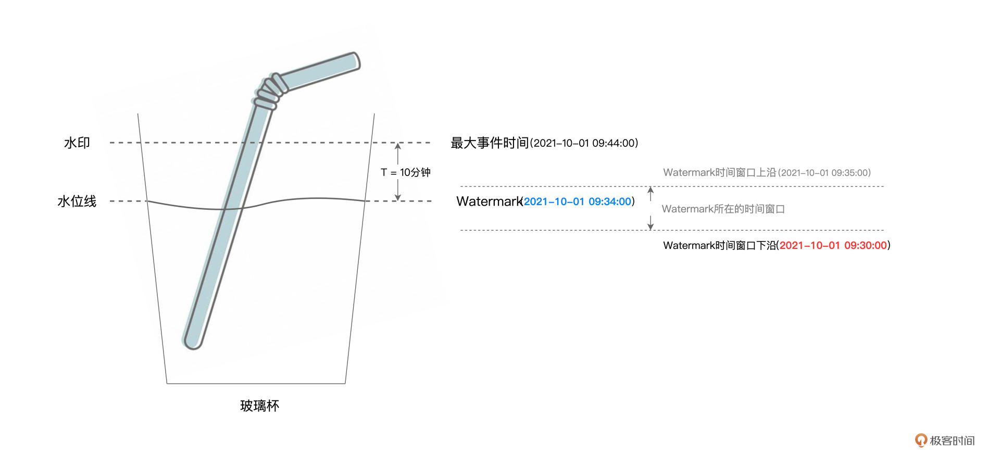
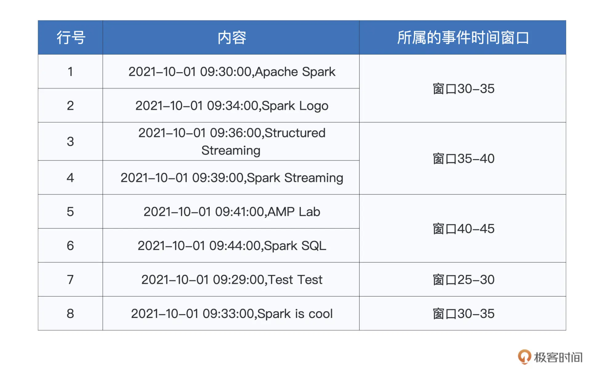
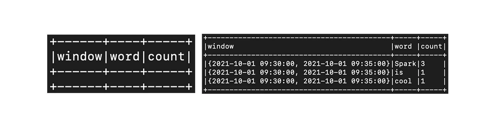

## 32｜Window操作&Watermark：流处理引擎提供了哪些优秀机制？

在上一讲，我们从原理的角度出发，学习了 `Structured Streaming` 的计算模型与容错机制。深入理解这些基本原理，会帮我们开发流处理应用打下坚实的基础。在“流动的 Word Count”那一讲，我们演示了在 Structured Streaming 框架下，如何做流处理开发的一般流程。基于 `readStream` API 与 `writeStream` API，我们可以像读写 `DataFrame` 那样，轻松地从 `Source` 获取数据流，并把处理过的数据写入 `Sink`。

今天这一讲，咱们从功能的视角出发，继续来聊一聊 `Structured Streaming` 流处理引擎都为开发者都提供了哪些特性与能力，让你更灵活地设计并实现流处理应用。

### Structured Streaming 怎样坐享其成？

学习过计算模型之后，我们知道，不管是 `Batch mode` 的多个 `Micro-batch`、多个作业的执行方式，还是 `Continuous mode` 下的一个 `Long running job`，这些作业的执行计划，最终都会交付给 `Spark SQL` 与 `Spark Core` 付诸优化与执行。


而这，会带来两个方面的收益。一方面，凡是 Spark SQL 支持的开发能力，不论是丰富的 `DataFrame` 算子，还是灵活的 SQL 查询，`Structured Streaming` 引擎都可以拿来即用。基于之前学过的内容，我们可以像处理普通的 `DataFrame` 那样，对基于流数据构建的 `DataFrame` 做各式各样的转换与聚合。

另一方面，既然开发入口同为 DataFrame，那么流处理应用同样能够享有 Spark SQL 提供的“性能红利”。在 Spark SQL 学习模块，我们学习过 `Catalyst` 优化器与 `Tungsten`，这两个组件会对用户代码做高度优化，从而提升应用的执行性能。

因此，就框架的功能来说，我们可以简单地概括为，`Spark SQL` 所拥有的能力，`Structured Streaming` 都有。不过，除了基本的数据处理能力以外，为了更好地支持流计算场景，`Structured Streaming` 引擎还提供了一些专门针对流处理的计算能力，比如说 `Window` 操作、`Watermark` 与延迟数据处理，等等。

### Window 操作

我们先来说说 `Window` 操作，它指的是，`Structured Streaming` 引擎会基于一定的时间窗口，对数据流中的消息进行消费并处理。这是什么意思呢？首先，我们需要了解两个基本概念：`Event Time` 和 `Processing Time`，也即事件时间和处理时间。

谓事件时间，它指的是消息生成的时间，比如，我们在 `netcat` 中敲入 “Apache Spark” 的时间戳是“2021-10-01 09:30:00”，那么这个时间，就是消息 “Apache Spark” 的事件时间。



而处理时间，它指的是，这个消息到达 `Structured Streaming` 引擎的时间，因此也有人把处理时间称作是到达时间（`Arrival Time`），也即消息到达流处理系统的时间。显然，处理时间要滞后于事件时间。

所谓 `Window` 操作，实际上就是 `Structured Streaming` 引擎基于事件时间或是处理时间，以固定间隔划定时间窗口，然后以窗口为粒度处理消息。在窗口的划分上，`Structured Streaming` 支持两种划分方式，一种叫做 `Tumbling Window`，另一种叫做 `Sliding Window`。我们可以用一句话来记住二者之间的区别，`Tumbling Window` 划分出来的时间窗口“不重不漏”，而 `Sliding Window` 划分出来的窗口，可能会重叠、也可能会有遗漏，如下图所示。



不难发现，`Sliding Window` 划分出来的窗口是否存在“重、漏”，取决于窗口间隔 `Interval` 与窗口大小 `Size` 之间的关系。`Tumbling Window` 与 `Sliding Window` 并无优劣之分，完全取决于应用场景与业务需要。干讲理论总是枯燥无趣，接下来，咱们对之前的 “流动的 Word Count” 稍作调整，来演示 `Structured Streaming` 中的 `Window` 操作。为了让演示的过程更加清晰明了，这里我们采用 `Tumbling Window` 的划分方式，`Sliding Window` 留给你作为课后作业。

为了完成实验，我们还是需要准备好两个终端。第一个终端用于启动 `spark-shell` 并提交流处理代码，而第二个终端用于启动 `netcat`、输入数据流。要基于窗口去统计单词，我们仅需调整数据处理部分的代码，`readStream` 与 `writeStream`（Update Mode）部分的代码不需要任何改动。因此，为了聚焦 `Window` 操作的学习，我这里仅贴出了有所变动的部分。

```
df = df.withColumn("inputs", split($"value", ","))
// 提取事件时间
.withColumn("eventTime", element_at(col("inputs"),1).cast("timestamp"))
// 提取单词序列
.withColumn("words", split(element_at(col("inputs"),2), " "))
// 拆分单词
.withColumn("word", explode($"words"))
// 按照Tumbling Window与单词做分组
.groupBy(window(col("eventTime"), "5 minute"), col("word"))
// 统计计数
.count()
```

为了模拟事件时间，我们在 `netcat` 终端输入的消息，会同时包含时间戳和单词序列。两者之间以逗号分隔，而单词与单词之间，还是用空格分隔，如下表所示。



因此，对于输入数据的处理，我们首先要分别提取出时间戳和单词序列，然后再把单词序列展开为单词。接下来，我们按照时间窗口与单词做分组，这里需要我们特别关注这行代码：

```
// 按照Tumbling Window与单词做分组
.groupBy(window(col("eventTime"), "5 minute"), col("word"))
```

其中 window(col(“eventTime”), “5 minute”) 的含义，就是以事件时间为准，以 `5` 分钟为间隔，创建 `Tumbling` 时间窗口。显然，`window` 函数的第一个参数，就是创建窗口所依赖的时间轴，而第二个参数，则指定了窗口大小 `Size`。说到这里，你可能会问：“如果我想创建 `Sliding Window`，该怎么做呢？”

其实非常简单，只需要在 `window` 函数的调用中，再添加第三个参数即可，也就是窗口间隔 `Interval`。比如说，我们还是想创建大小为 `5` 分钟的窗口，但是使用以 `3` 分钟为间隔进行滑动的方式去创建，那么我们就可以这样来实现：window(col(“eventTime”), “5 minute”, “3 minute”)。是不是很简单？

完成基于窗口和单词的分组之后，我们就可以继续调用 `count` 来完成计数了。不难发现，代码中的大多数转换操作，实际上都是我们常见的 `DataFrame` 算子，这也印证了这讲开头说的，`Structured Streaming` 先天优势就是能坐享其成，享有 Spark SQL 提供的“性能红利”。代码准备好之后，我们就可以把它们陆续敲入到 `spark-shell`，并等待来自 `netcat` 的数据流。切换到 `netcat` 终端，并陆续（注意，是陆续！）输入刚刚的文本内容，我们就可以在 `spark-shell` 终端看到如下的计算结果。



可以看到，与“流动的 Word Count”不同，这里的统计计数，是以窗口（5 分钟）为粒度的。对于每一个时间窗口来说，`Structured Streaming` 引擎都会把事件时间落入该窗口的单词统计在内。不难推断，随着时间向前推进，已经计算过的窗口，将不会再有状态上的更新。

比方说，当引擎处理到“2021-10-01 09:39:00,Spark Streaming”这条消息（记作消息 39）时，理论上，前一个窗口“{2021-10-01 09:30:00, 2021-10-01 09:35:00}”（记作窗口 30-35）的状态，也就是不同单词的统计计数，应该不会再有变化。说到这里，你可能会有这样的疑问：“那不见得啊！如果在消息 `39` 之后，引擎又接收到一条事件时间落在窗口 `30-35` 的消息，那该怎么办呢？”要回答这个问题，我们还得从 `Late data` 和 `Structured Streaming` 的 `Watermark` 机制说起。

### Late data 与 Watermark

我们先来说 `Late data`，所谓 `Late data`，它指的是那些事件时间与处理时间不一致的消息。虽然听上去有点绕，但通过下面的图解，我们就能瞬间理解 `Late data` 的含义。


通常来说，消息生成的时间，与消息到达流处理引擎的时间，应该是一致的。也即先生成的消息先到达，而后生成的消息后到达，就像上图中灰色部分消息所示意的那样。不过，在现实情况中，总会有一些消息，因为网络延迟或者这样那样的一些原因，它们的处理时间与事件时间存在着比较大的偏差。这些消息到达引擎的时间，甚至晚于那些在它们之后才生成的消息。像这样的消息，我们统称为 “Late data”，如图中红色部分的消息所示。

由于有 `Late data` 的存在，流处理引擎就需要一个机制，来判定 `Late data` 的有效性，从而决定是否让晚到的消息，参与到之前窗口的计算。

就拿红色的 “Spark is cool”消息来说，在它到达 `Structured Streaming` 引擎的时候，属于它的事件时间窗口 “{2021-10-01 09:30:00, 2021-10-01 09:35:00}”已经关闭了。那么，在这种情况下，`Structured Streaming` 到底要不要用消息 “Spark is cool” 中的单词，去更新窗口 `30-35` 的状态（单词计数）呢？

为了解决 `Late data` 的问题，`Structured Streaming` 采用了一种叫作 `Watermark` 的机制来应对。为了让你能够更容易地理解 `Watermark` 机制的原理，在去探讨它之前，我们先来澄清两个极其相似但是又完全不同的概念：水印和水位线。

要说清楚水印和水位线，咱们不妨来做个思想实验。假设桌子上有一盒鲜牛奶、一个吸管、还有一个玻璃杯。我们把盒子开个口，把牛奶全部倒入玻璃杯，接着，把吸管插入玻璃杯，然后通过吸管喝一口新鲜美味的牛奶。好啦，实验做完了，接下来，我们用它来帮我们澄清概念。



如图所示，最开始的时候，我们把牛奶倒到水印标示出来的高度，然后用吸管喝牛奶。不过，不论我们通过吸管喝多少牛奶，水印位置的牛奶痕迹都不会消失，也就是说，水印的位置是相对固定的。而水位线则不同，我们喝得越多，水位线下降得就越快，直到把牛奶喝光，水位线降低到玻璃杯底部。

好啦，澄清了水印与水位线的概念之后，我们还需要把这两个概念与流处理中的概念对应上。毕竟，“倒牛奶”的思想实验，是用来辅助我们学习 `Watermark` 机制的。

首先，水印与水位线，对标的都是消息的事件时间。水印相当于系统当前接收到的所有消息中最大的事件时间。而水位线指的是水印对应的事件时间，减去用户设置的容忍值。为了叙述方便，我们把这个容忍值记作 `T`。在 `Structured Streaming` 中，我们把水位线对应的事件时间，称作 `Watermark`，如下图所示。



显然，在流处理引擎不停地接收消息的过程中，水印与水位线也会相应地跟着变化。这个过程，跟我们刚刚操作的“倒牛奶、喝牛奶”的过程很像。每当新到消息的事件时间大于当前水印的时候，系统就会更新水印，这就好比我们往玻璃杯里倒牛奶，一直倒到最大事件时间的位置。然后，我们用吸管喝牛奶，吸掉深度为 `T` 的牛奶，让水位线下降到 `Watermark` 的位置。

把不同的概念关联上之后，接下来，我们来正式地介绍 `Structured Streaming` 的 `Watermark` 机制。我们刚刚说过，`Watermark` 机制是用来决定，哪些 `Late data` 可以参与过往窗口状态的更新，而哪些 `Late data` 则惨遭抛弃。

如果用文字去解释 `Watermark` 机制，很容易把人说得云里雾里，因此，咱们不妨用一张流程图，来阐释这个过程。



可以看到，当有新消息到达系统后，`Structured Streaming` 首先判断它的事件时间，是否大于水印。如果事件时间大于水印的话，`Watermark` 机制则相应地更新水印与水位线，也就是最大事件时间与 `Watermark`。

相反，假设新到消息的事件时间在当前水印以下，那么系统进一步判断消息的事件时间与 “Watermark 时间窗口下沿” 的关系。所谓 “Watermark 时间窗口下沿”，它指的是 `Watermark` 所属时间窗口的起始时间。

咱们来举例说明，假设 `Watermark` 为 “2021-10-01 09:34:00”，且事件时间窗口大小为 `5` 分钟，那么，`Watermark` 所在时间窗口就是[“2021-10-01 09:30:00”，“2021-10-01 09:35:00”]，也即窗口 `30-35`。这个时候，“Watermark 时间窗口下沿”，就是窗口 `30-35` 的起始时间，也就是“2021-10-01 09:30:00”，如下图所示。



对于最新到达的消息，如果其事件时间大于“Watermark 时间窗口下沿”，则消息可以参与过往窗口的状态更新，否则，消息将被系统抛弃，不再参与计算。换句话说，凡是事件时间小于“Watermark 时间窗口下沿”的消息，系统都认为这样的消息来得太迟了，没有资格再去更新以往计算过的窗口。

不难发现，在这个过程中，延迟容忍度 `T` 是 `Watermark` 机制中的决定性因素，它决定了“多迟”的消息可以被系统容忍并接受。那么问题来了，既然 `T` 是由用户设定的，那么用户通过什么途径来设定这个 `T` 呢？再者，在 `Structured Streaming` 的开发框架下，`Watermark` 机制要如何生效呢？

其实，要开启 `Watermark` 机制、并设置容忍度 `T`，我们只需一行代码即可搞定。接下来，我们就以刚刚 “带窗口的流动 Word Count”为例，演示并说明 `Watermark` 机制的具体用法。

```
df = df.withColumn("inputs", split($"value", ","))
// 提取事件时间
.withColumn("eventTime", element_at(col("inputs"),1).cast("timestamp"))
// 提取单词序列
.withColumn("words", split(element_at(col("inputs"),2), " "))
// 拆分单词
.withColumn("word", explode($"words"))
// 启用Watermark机制，指定容忍度T为10分钟
.withWatermark("eventTime", "10 minute")
// 按照Tumbling Window与单词做分组
.groupBy(window(col("eventTime"), "5 minute"), col("word"))
// 统计计数
.count()
```

可以看到，除了“.withWatermark(“eventTime”, “10 minute”)”这一句代码，其他部分与“带窗口的流动 Word Count”都是一样的。这里我们用 withWatermark 函数来启用 Watermark 机制，该函数有两个参数，第一个参数是事件时间，而第二个参数就是由用户指定的容忍度 `T`。

为了演示 Watermark 机制产生的效果，接下来，咱们对 `netcat` 输入的数据流做一些调整，如下表所示。注意，消息7 “Test Test” 和消息8 “Spark is cool” 都是 `Late data`。



基于我们刚刚对于 `Watermark` 机制的分析，在容忍度 `T` 为 `10` 分钟的情况下，`Late data` 消息8 “Spark is cool” 会被系统接受并消费，而消息7 “Test Test” 则将惨遭抛弃。你不妨先花点时间，自行推断出这一结论，然后再来看后面的结果演示。



上图中，左侧是输入消息 7“Test Test”时 spark-shell 端的输出，可以看到，消息 7 被系统丢弃，没能参与计算。而右侧是消息 8“Spark is cool”对应的执行结果，可以看到，“Spark”、“is”、“cool”这 3 个单词成功地更新了之前窗口 30-35 的状态（注意这里的“Spark”计数为 3，而不是 1）。

### 重点回顾

好啦，今天的内容，到这里就讲完了，我们一起来做个总结。首先，我们需要知道，在数据处理方面，`Structured Streaming` 完全可以复用 Spark SQL 现有的功能与性能优势。因此，开发者完全可以“坐享其成”，使用 DataFrame 算子或是 SQL 语句，来完成流数据的处理。

者，我们需要特别关注并掌握 Structured Streaming 的 `Window` 操作与 `Watermark` 机制。`Structured Streaming` 支持两类窗口，一个是“不重不漏”的 Tumbling Window，另一个是“可重可漏”的 Sliding Window。二者并无高下之分，作为开发者，我们可以使用 `window` 函数，结合事件时间、窗口大小、窗口间隔等多个参数，来灵活地在两种窗口之间进行取舍。

对于 `Late data` 的处理，`Structured Streaming` 使用 `Watermark` 机制来决定其是否参与过往窗口的计算与更新。关于 `Watermark` 机制的工作原理，我把它整理到了下面的流程图中，供你随时查看。


### Reference

- [32｜Window操作&Watermark：流处理引擎提供了哪些优秀机制？](https://time.geekbang.org/column/article/450916)