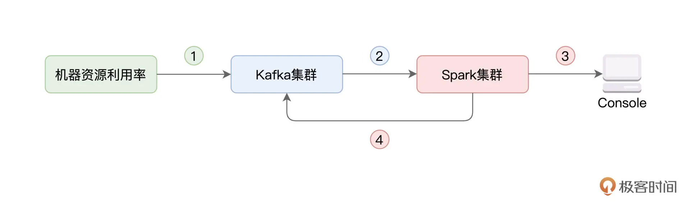
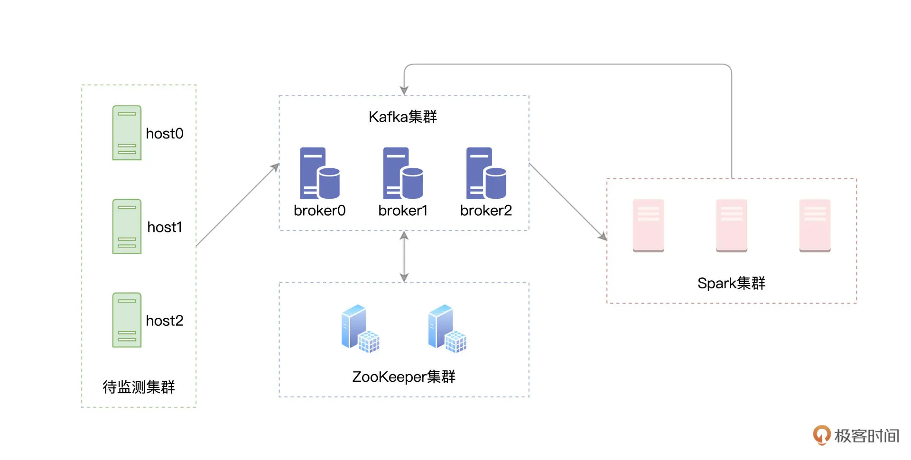

## 34｜Spark + Kafka：流计算中的“万金油”

在前面的几讲中，咱们不止一次提到，就数据源来说，`Kafka` 是 Structured Streaming 最重要的 Source 之一。在工业级的生产系统中，`Kafka` 与 Spark 这对组合最为常见。因此，掌握 `Kafka` 与 Spark 的集成，对于想从事流计算方向的同学来说，是至关重要的。今天这一讲，咱们就来结合实例，说一说 `Spark` 与 `Kafka` 这对“万金油”组合如何使用。随着业务飞速发展，各家公司的集群规模都是有增无减。在集群规模暴涨的情况下，资源利用率逐渐成为大家越来越关注的焦点。毕竟，不管是自建的 `Data center`，还是公有云，每台机器都是真金白银的投入。

### 实例：资源利用率实时计算

咱们今天的实例，就和资源利用率的实时计算有关。具体来说，我们首先需要搜集集群中每台机器的资源（CPU、内存）利用率，并将其写入 Kafka。然后，我们使用 Spark 的 Structured Streaming 来消费 Kafka 数据流，并对资源利用率数据做初步的分析与聚合。最后，再通过 Structured Streaming，将聚合结果打印到 `Console`、并写回到 Kafka，如下图所示。

一般来说，在工业级应用中，上图中的每一个圆角矩形，在部署上都是独立的。绿色矩形代表待监测的服务器集群，蓝色矩形表示独立部署的 Kafka 集群，而红色的 Spark 集群，也是独立部署的。所谓独立部署，它指的是，集群之间不共享机器资源，如下图所示。

如果你手头上没有这样的部署环境，也不用担心。要完成资源利用率实时计算的实例，咱们不必非要依赖独立部署的分布式集群。实际上，仅在单机环境中，你就可以复现今天的实例。

### 课程安排

今天这一讲涉及的内容比较多，在正式开始课程之前，咱们不妨先梳理一下课程内容，让你做到心中有数。

对于上图的 1、2、3、4 这四个步骤，我们会结合代码实现，分别讲解如下这四个环节：

1. 生成 CPU 与内存消耗数据流，写入 Kafka；
2. Structured Streaming 消费 Kafka 数据，并做初步聚合；
3. Structured Streaming 将计算结果打印到终端；
4. Structured Streaming 将计算结果写回 Kafka，以备后用。

除此之外，为了照顾不熟悉 Kafka 的同学，咱们还会对 Kafka 的安装、Topic 创建与消费、以及 Kafka 的基本概念，做一个简单的梳理。

### 速读 Kafka 的架构与运行机制

### Kafka 与 Spark 集成

### 重点回顾

### Reference

- [34｜Spark + Kafka：流计算中的“万金油”](https://time.geekbang.org/column/article/460492)