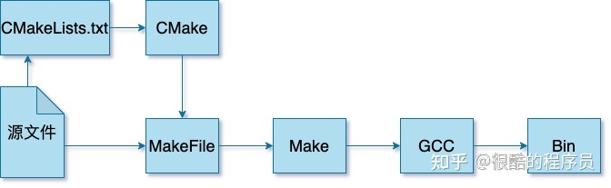

# CMake实践应用专题
> CMake是一个开源、跨平台的编译、测试和打包工具，它使用比较简单的语言描述编译、安装的过程，输出Makefile或者project文件，再去执行构建。
## $1 基础篇
在使用IDE开发软件的过程中，代码的编译和构建一般是使用IDE自带的编译工具和环境进行编译，开发者参与的并不算多。如果想要控制构建的细节，则需要开发者自己定义构建的过程。

本文主要介绍以下内容：
- 编译构建相关的核心概念及它们之间的关系
- CMake的一般使用流程
- 一个简单的实例
### 一 核心概念
#### 1. gcc、make和cmake
gcc（GNU Compiler Collection）将源文件编译（Compile）成可执行文件或者库文件；

而当需要编译的东西很多时，需要说明先编译什么，后编译什么，这个过程称为构建（Build）。常用的工具是make，对应的定义构建过程的文件为Makefile；

而编写Makefile对于大型项目又比较复杂，通过CMake就可以使用更加简洁的语法定义构建的流程，CMake定义构建过程的文件为CMakeLists.txt。

它们的大致关系如下图：



> 这里的GCC只是示例，也可以是其他的编译工具。这里的Bin表示目标文件，可以是可执行文件或者库文件。
### 二 CMake一般使用流程
CMake提供cmake、ctest和cpack三个命令行工具分别负责构建、测试和打包。本文主要介绍cmake命令。

使用cmake一般流程为：
- 生成构建系统（buildsystem，比如make工具对应的Makefile）；
- 执行构建（比如make），生成目标文件；
- 执行测试、安装或打包。
本文先介绍前面两个步骤。
#### 1. 生成构建系统
通过cmake命令生成构建系统。

通过 `cmake --help` 可以看到cmake命令支持的详细参数，常用的参数如下：
参数|含义
-------|--------
-S|指定源文件根目录，必须包含一个CMakeLists.txt文件
-B|指定构建目录，构建生成的中间文件和目标文件的生成路径
-D|指定变量，格式为-D <var>=<value>，-D后面的空格可以省略

比如，指明使用当前目录作为源文件目录，其中包含CMakeLists.txt文件；使用build目录作为构建目录；设定变量CMAKE_BUILD_TYPE的值为Debug，变量AUTHOR的值为RealCoolEngineer：
```
cmake -S . -B build -DCMAKE_BUILD_TYPE=Debug -DAUTHOR=RealCoolEngineer
```
> 使用-D设置的变量在CMakeLists.txt中生效，可以设置cmake的内置支持的一些变量控制构建的行为；当然也可以使用自定义的变量，在CMakeLists.txt中自行判断做不同的处理。
#### 2. 执行构建
使用 `cmake --build [<dir> | --preset <preset>]` 执行构建。

这里要指定的目录就是生成构建系统时指定的构建目录。常用的参数如下：
参数|含义
--------|--------
--target|指定构建目标代替默认的构建目标，可以指定多个
--parallel/-j [<jobs>]|指定构建目标时使用的进程数
> 在这一步，如果使用的是make构建工具，则可以在构建目录下直接使用make命令。
### 三 CMake应用示例
#### 1. 一个简单的例子
下面使用cmake编译一个c语言的 `hello world` 程序。创建一个项目文件夹 `cmake-template`，目录结构如下：
```
cmake-template
├── CMakeLists.txt
└── src
    └── c
        └── main.c
```
main.c内容如下：
```
// @Author: Farmer Li, 公众号: 很酷的程序员/RealCoolEngineer
// @Date: 2021-04-24

#include <stdio.h>

int main(void) {
  printf("Hello CMake!");

  return 0;
}
```
CMakeLists.txt的内容如下：
```
cmake_minimum_required(VERSION 3.12)
project(cmake_template VERSION 1.0.0 LANGUAGES C CXX)

add_executable(demo src/c/main.c)
```
该 `CMakeLists.txt` 声明了需要使用的cmake的最低版本；项目的名字、版本以及编译语言；最后一句定义了通过源文件 `main.c` 生成可执行文件 `demo`。
#### 2. 生成构建系统
在cmake-template目录下，执行以下命令：
```
cmake -B build
```
执行完成后，在项目的根目录下会创建build目录，可以看到其中生成了Makefile文件。
#### 3. 执行构建
还是在cmake-template目录下，执行以下命令：
```
cmake --build build
```
因为使用的是make工具，所以也可以在build目录直接执行make命令：
```
cd build && make && cd -
```
执行完成后，可以在build目录下看到已经生成可执行文件demo，执行demo：
```
cmake-template # ./build/demo
Hello CMake!
```
## $2 核心语法篇
> 本文是深入CMakeLists.txt之前的前导文章，介绍CMake语言的核心概念，以及常用的CMake脚本命令，以期对CMake的语法能有比较好的认知和实践基础。

在开始深入如何编写完备的CMakeLists.txt之前，先了解下CMake的语言和它的组织方式对后续内容的理解是很有帮助的。本文将会介绍以下内容：
- CMake语言的核心概念
- CMake常用脚本命令及示例
### 一 CMake语法核心概念
下面介绍的内容，可以只先有一些概念，不求甚解，在后续需要深入的时候查看文档即可。

CMake的命令有不同类型，包括**脚本命令、项目配置命令和测试命令**，细节可以查看官网[cmake-commands](https://link.zhihu.com/?target=https%3A//cmake.org/cmake/help/v3.20/manual/cmake-commands.7.html)。

CMake语言在项目配置中组织为三种源文件类型：
- 目录：`CMakeLists.txt`，针对的是一个目录，描述如何针对目录 `（Source tree）`生成构建系统，会用到项目配置命令；
- 脚本：`<script>.cmake`，就是一个CMake语言的脚本文件，可使用 `cmake -P` 直接执行，只能包含脚本命令；
- 模块：`<module>.cmake`，实现一些模块化的功能，可以被前面两者包含，比如 `include(CTest)` 启用测试功能。
#### 1. 注释
行注释使用 `"#"`；块注释使用 `"#[[Some comments can be multi lines or in side the command]]"`。比如:
```
# Multi line comments follow
#[[
Author: FarmerLi, 公众号: 很酷的程序员/RealCoolEngineer
Date: 2021-04-27
]]
```
#### 2. 变量
CMake中使用 `set` 和 `unset` 命令设置或者取消设置变量。CMake中有以下常用变量类型：
##### 一般变量
设置的变量可以是字符串，数字或者列表（直接设置多个值，或者使用分号隔开的字符串格式为"v1;v2;v3"），比如：
```
# Set variable
set(AUTHOR_NAME Farmer)
set(AUTHOR "Farmer Li")
set(AUTHOR Farmer\ Li)

# Set list
set(SLOGAN_ARR To be)   # Saved as "To;be"
set(SLOGAN_ARR To;be)
set(SLOGAN_ARR "To;be")

set(NUM 30)   # Saved as string, but can compare with other number string
set(FLAG ON)  # Bool value
```
主要有以下要点：
1. 如果要设置的变量值包含空格，则需要使用双引号或者使用"\"转义，否则可以省略双引号；
2. 如果设置多个值或者字符串值的中间有";"，则保存成list，同样是以";"分割的字符串；
3. 变量可以被list命令操作，单个值的变量相当于只有一个元素的列表；
4. 引用变量：`${<variable>}`，在if()条件判断中可以简化为只用变量名 `<variable>`。
##### Cache变量
Cache变量（缓存条目，`cache entries`）的作用主要是为了提供**用户配置选项**，如果用户没有指定，则使用默认值，设置方法如下：
```
# set(<variable> <value>... CACHE <type> <docstring> [FORCE])
set(CACHE_VAR "Default cache value" CACHE STRING "A sample for cache variable")
```
要点：
- 主要为了提供可配置变量，比如编译开关；
- 引用CACHE变量：$CACHE{<varialbe>}。
> Cache变量会被保存在构建目录下的CMakeCache.txt中，缓存起来之后是不变的，除非重新配置更新。 
##### 环境变量
修改当前处理进程的环境变量，设置和引用格式为：
```
# set(ENV{<variable>} [<value>])
set(ENV{ENV_VAR} "$ENV{PATH}")
message("Value of ENV_VAR: $ENV{ENV_VAR}")
```
和CACHE变量类似，要引用环境变量，格式为：`$ENV{<variable>}`。
#### 3. 条件语句
支持的语法有：
- 字符串比较，比如：**STREQUAL、STRLESS、STRGREATER** 等；
- 数值比较，比如：**EQUAL、LESS、GREATER** 等；
- 布尔运算，**AND、OR、NOT**；
- 路径判断，比如：**EXISTS、IS_DIRECTORY、IS_ABSOLUTE** 等；
- 版本号判断；等等；
- 使用小括号可以组合多个条件语句，比如：**(cond1) AND (cond2 OR (cond3))**。

对于**常量**：
1. **ON、YES、TRUE、Y和非0值**均被视为True；
2. **0、OFF、NO、FALSE、N、IGNORE、空字符串、NOTFOUND、及以"-NOTFOUND"结尾的字符串**均视为False。

对于**变量**，只要其值不是常量中为False的情形，则均视为True。
### 二 常用的脚本命令
有了前面的总体概念，下面掌握一些常用的CMake命令，对于CMake脚本编写就可以有不错的基础。
#### 1. 消息打印
前面已经有演示，即 `message` 命令，其实就是打印log，用来打印不同信息，常用命令格式为：
```
message([<mode>] "message text" ...)
```
其中 `mode` 就相当于打印的等级，常用的有这几个选项：
- 空或者NOTICE：比较重要的信息，如前面演示中的格式
- DEBUG：调试信息，主要针对开发者
- STATUS：项目使用者可能比较关心的信息，比如提示当前使用的编译器
- WARNING：CMake警告，不会打断进程
- SEND_ERROR：CMake错误，会继续执行，但是会跳过生成构建系统
- FATAL_ERROR：CMake致命错误，会终止进程
#### 2. 条件分支
这里以 `if()/elseif()/else()/endif()` 举个例子，`for/while` 循环也是类似的：
```
set(EMPTY_STR "")
if (NOT EMPTY_STR AND FLAG AND NUM LESS 50 AND NOT NOT_DEFINE_VAR)
    message("The first if branch...")
elseif (EMPTY_STR)
    message("EMPTY_STR is not empty")
else ()
    message("All other case")
endif()
```
#### 3. 列表操作
`list` 也是CMake的一个命令，有很多有用的子命令，比较常用的有：
- APPEND，往列表中添加元素；
- LENGTH，获取列表元素个数；
- JOIN，将列表元素用指定的分隔符连接起来；

示例如下：
```
set(SLOGAN_ARR To be)   # Saved as "To;be"
set(SLOGAN_ARR To;be)
set(SLOGAN_ARR "To;be")
set(WECHAT_ID_ARR Real Cool Eengineer)
list(APPEND SLOGAN_ARR a)                # APPEND sub command
list(APPEND SLOGAN_ARR ${WECHAT_ID_ARR}) # Can append another list
list(LENGTH SLOGAN_ARR SLOGAN_ARR_LEN)   # LENGTH sub command
# Convert list "To;be;a;Real;Cool;Engineer"
# To string "To be a Real Cool Engineer"
list(JOIN SLOGAN_ARR " " SLOGEN_STR)
message("Slogen list length: ${SLOGAN_ARR_LEN}")
message("Slogen list: ${SLOGAN_ARR}")
message("Slogen list to string: ${SLOGEN_STR}\n")
```
对于列表常用的操作，list命令都基本实现了，需要其他功能直接查阅官方文档即可。
#### 4. 文件操作
CMake的file命令支持的操作比较多，可以读写、创建或复制文件和目录、计算文件hash、下载文件、压缩文件等等。 使用的语法都比较类似，以笔者常用的递归遍历文件为例，下面是获取src目录下两个子目录内所有c文件的列表的示例：
```
file(GLOB_RECURSE ALL_SRC
        src/module1/*.c
        src/module2/*.c
        )
```
> GLOB_RECURSE表示执行递归查找，查找目录下所有符合指定正则表达式的文件。
#### 5. 配置文件生成
使用configure_file命令可以将配置文件模板中的特定内容替换，生成目标文件。输入文件中的内容@VAR@或者${VAR}在输出文件中将被对应的变量值替换。 使用方式为：
```
set(VERSION 1.0.0)
configure_file(version.h.in "${PROJECT_SOURCE_DIR}/version.h")
```
假设version.in.h的内容为：
```
#define VERSION "@VERSION@"
```
那么生成的version.h的内容为：
```
#define VERSION "1.0.0"
```
#### 6. 执行系统命令
使用 `execute_process` 命令可以执行一条或者顺序执行多条系统命令，对于需要使用系统命令获取一些变量值是有用的。比如获取当前仓库最新提交的 `commit` 的 `commit id`：
```
execute_process(COMMAND bash "-c" "git rev-parse --short HEAD" OUTPUT_VARIABLE COMMIT_ID)
```
#### 7. 查找库文件
通过 `find_library` 在指定的路径和相关默认路径下查找指定名字的库，常用的格式如下：
```
find_library (<VAR> name1 [path1 path2 ...])
```
找到的库就可以被其它target使用，表明依赖关系。
#### 8. include其他模块
`include` 命令将cmake文件或者模块加载并执行。比如：
```
include(CPack) # 开启打包功能
include(CTest) # 开启测试相关功能
```
CMake自带有很多有用的模块，可以看看官网的链接：[cmake-modules](https://cmake.org/cmake/help/latest/manual/cmake-modules.7.html)，对支持的功能稍微有所了解，后续有需要再细看文档。

当然，如果感兴趣，也可以直接看CMake安装路径下的目录 `CMake\share\cmake-<version>\Modules` 中的模块源文件。

文中的示例代码均共享在开源仓库：https://gitee.com/RealCoolEngineer/cmake-template，当前commit id：f8f3948。

关于CMake脚本源文件的示例位于路径：`cmake/script_demo.cmake`，可以使用 `cmake -P cmake/script_demo.cmake` 执行查看结果; 关于配置文件生成的操作在项目根目录的CMakeLists.txt中也有示例。
## $3 CMakeLists.txt完全指南
本文将会介绍如何书写一个完备的CMakeLists.txt文件，满足一般项目的基础构建要求，CMake的语法将会更多介绍项目配置命令，主要有以下内容：
- 设置一些自定义编译控制开关和自定义编译变量控制编译过程
- 根据不同编译类型配置不同的编译选项和链接选项
- 添加头文件路径、编译宏等常规操作
- 编译生成不同类型的目标文件，包括可执行文件、静态链接库和动态链接库
- 安装、打包和测试
### 一 基础配置
下面先介绍一些CMake项目通常都需要进行的配置。下面介绍的内容以make作为构建工具作为示例。

下面的示例代码可以在开源项目[cmake-template](https://gitee.com/RealCoolEngineer/cmake-template)中查看（当前commit id：c7c6b15）。 把仓库克隆下来结合源码阅读本文效果更佳，如果有帮助，请点下Star哟。
#### 1. 设置项目版本和生成 version.h
一般来说，项目一般需要设置一个版本号，方便进行版本的发布，也可以根据版本对问题或者特性进行追溯和记录。

通过project命令配置项目信息，如下：
```
project(CMakeTemplate VERSION 1.0.0 LANGUAGES C CXX)
```
第一个字段是项目名称；通过 `VERSION` 指定版本号，格式为 `main.minor.patch.tweak`，并且CMake会将对应的值分别赋值给以下变量（如果没有设置，则为空字符串）：
```
PROJECT_VERSION, <PROJECT-NAME>_VERSION
PROJECT_VERSION_MAJOR, <PROJECT-NAME>_VERSION_MAJOR
PROJECT_VERSION_MINOR, <PROJECT-NAME>_VERSION_MINOR
PROJECT_VERSION_PATCH, <PROJECT-NAME>_VERSION_PATCH
PROJECT_VERSION_TWEAK, <PROJECT-NAME>_VERSION_TWEAK
```
因此，结合前一篇文章提到的configure_file命令，可以配置自动生成版本头文件，将头文件版本号定义成对应的宏，或者定义成接口，方便在代码运行的时候了解当前的版本号。

比如:
```
configure_file(src/c/cmake_template_version.h.in "${PROJECT_SOURCE_DIR}/src/c/cmake_template_version.h")
```
假如 `cmake_template_version.h.in` 内容如下：
```
#define CMAKE_TEMPLATE_VERSION_MAJOR @CMakeTemplate_VERSION_MAJOR@
#define CMAKE_TEMPLATE_VERSION_MINOR @CMakeTemplate_VERSION_MINOR@
#define CMAKE_TEMPLATE_VERSION_PATCH @CMakeTemplate_VERSION_PATCH@
```
执行cmake配置构建系统后，将会自动生成文件：`cmake_template_version.h`，其中 `@<var-name>@` 将会被替换为对应的值：
```
#define CMAKE_TEMPLATE_VERSION_MAJOR 1
#define CMAKE_TEMPLATE_VERSION_MINOR 0
#define CMAKE_TEMPLATE_VERSION_PATCH 0
```
#### 2. 指定编程语言版本
为了在不同机器上编译更加统一，最好指定语言的版本，比如声明C使用c99标准，C++ 使用c++11标准：
```
set(CMAKE_C_STANDARD 99)
set(CMAKE_CXX_STANDARD 11)
```
这里设置的变量都是CMAKE_开头(包括project命令自动设置的变量)，这类变量都是CMake的内置变量，正是通过修改这些变量的值来配置CMake构建的行为。
> CMAKE_、_CMAKE或者以下划线开头后面加上任意CMake命令的变量名都是CMake保留的。
#### 3. 配置编译选项
通过命令 `add_compile_options` 命令可以为所有编译器配置编译选项（同时对多个编译器生效）； 通过设置变量 `CMAKE_C_FLAGS` 可以配置c编译器的编译选项； 而设置变量 `CMAKE_CXX_FLAGS` 可配置针对c++编译器的编译选项。 比如：
```
add_compile_options(-Wall -Wextra -pedantic -Werror)
set(CMAKE_C_FLAGS "${CMAKE_C_FLAGS} -pipe -std=c99")
set(CMAKE_CXX_FLAGS "${CMAKE_CXX_FLAGS} -pipe -std=c++11")
```
#### 4. 配置编译类型
通过设置变量CMAKE_BUILD_TYPE来配置编译类型，可设置为：Debug、Release、RelWithDebInfo、MinSizeRel等，比如：
```
set(CMAKE_BUILD_TYPE Debug)
```
当然，更好的方式应该是在执行cmake命令的时候通过参数 `-D` 指定：
```
cmake -B build -DCMAKE_BUILD_TYPE=Debug
```
如果设置编译类型为 `Debug`，那么对于c编译器，CMake会检查是否有针对此编译类型的编译选项 `CMAKE_C_FLAGS_DEBUG`，如果有，则将它的配置内容加到 `CMAKE_C_FLAGS` 中。

可以针对不同的编译类型设置不同的编译选项，比如对于Debug版本，开启调试信息，不进行代码优化：
```
set(CMAKE_C_FLAGS_DEBUG "${CMAKE_C_FLAGS_DEBUG} -g -O0")
set(CMAKE_CXX_FLAGS_DEBUG "${CMAKE_CXX_FLAGS_DEBUG} -g -O0")
```
对于Release版本，不包含调试信息，优化等级设置为2：
```
set(CMAKE_C_FLAGS_RELEASE "${CMAKE_C_FLAGS_RELEASE} -O2")
set(CMAKE_CXX_FLAGS_RELEASE "${CMAKE_CXX_FLAGS_RELEASE} -O2")
```
#### 5. 添加全局宏定义
通过命令 `add_definitions` 可以添加全局的宏定义，在源码中就可以通过判断不同的宏定义实现相应的代码逻辑。用法如下：
```
add_definitions(-DDEBUG -DREAL_COOL_ENGINEER)
```
#### 6. 添加include目录
通过命令include_directories来设置头文件的搜索目录，比如：
```
include_directories(src/c)
```
### 二 编译目标文件
一般来说，编译目标(target)的类型一般有静态库、动态库和可执行文件。 这时编写 `CMakeLists.txt` 主要包括两步：
1. 编译：确定编译目标所需要的源文件
2. 链接：确定链接的时候需要依赖的额外的库

下面以开源项目(cmake-template)来演示。项目的目录结构如下：
```
./cmake-template
├── CMakeLists.txt
├── src
│   └── c
│       ├── cmake_template_version.h
│       ├── cmake_template_version.h.in
│       ├── main.c
│       └── math
│           ├── add.c
│           ├── add.h
│           ├── minus.c
│           └── minus.h
└── test
    └── c
        ├── test_add.c
        └── test_minus.c
```
项目的构建任务为：
1. 将 `math` 目录编译成静态库，命名为 `math`
2. 编译 `main.c` 为可执行文件 `demo`，依赖 `math` 静态库
3. 编译 `test` 目录下的测试程序，可以通过命令执行所有的测试
4. 支持通过命令将编译产物安装及打包
#### 1. 编译静态库
这一步需要将项目目录路径 `src/c/math` 下的源文件编译为静态库，那么需要获取编译此静态库需要的文件列表，可以使用 `set` 命令，或者 `file` 命令来进行设置。比如：
```
file(GLOB_RECURSE MATH_LIB_SRC
        src/c/math/*.c
        )
add_library(math STATIC ${MATH_LIB_SRC})
```
使用file命令获取 `src/c/math` 目录下所有的 `*.c` 文件，然后通过 `add_library` 命令编译名为 `math` 的静态库，库的类型是第二个参数 `STATIC` 指定的。
> 如果指定为 `SHARED` 则编译的就是动态链接库。
#### 2. 编译可执行文件
通过 `add_executable` 命令来往构建系统中添加一个可执行构建目标，同样需要指定编译需要的源文件。但是对于可执行文件来说，有时候还会依赖其他的库，则需要使用 `target_link_libraries` 命令来声明构建此可执行文件需要链接的库。

在示例项目中，`main.c` 就使用了 `src/c/math` 下实现的一些函数接口，所以依赖于前面构建的 `math` 库。所以在 `CMakeLists.txt` 中添加以下内容：
```
add_executable(demo src/c/main.c)
target_link_libraries(demo math)
```
第一行说明编译可执行文件 `demo` 需要的源文件（可以指定多个源文件，此处只是以单个文件作为示例）；第二行表明对 `math` 库存在依赖。

此时可以在项目的根目录下执行构建和编译命令，并执行demo:
```
➜ # cmake -B cmake-build
➜ # cmake --build cmake-build
➜ # ./cmake-build/demo
Hello CMake!
10 + 24 = 34
40 - 96 = -56
```
### 三 安装和打包
#### 1. 安装
对于安装来说，其实就是要指定当前项目在执行安装时，需要安装什么内容:
1. 通过 `install` 命令来说明需要安装的内容及目标路径；
2. 通过设置 `CMAKE_INSTALL_PREFIX` 变量说明安装的路径；
3. `3.15` 往后的版本可以使用 `cmake --install --prefix <install-path>` 覆盖指定安装路径。

比如，在示例项目中，把 `math` 和 `demo` 两个目标按文件类型安装：
```
install(TARGETS math demo
        RUNTIME DESTINATION bin
        LIBRARY DESTINATION lib
        ARCHIVE DESTINATION lib)
```
这里通过 `TARGETS` 参数指定需要安装的目标列表；参数 `RUNTIME DESTINATION`、`LIBRARY DESTINATION`、`ARCHIVE DESTINATION` 分别指定可执行文件、库文件、归档文件分别应该安装到安装目录下个哪个子目录。

如果指定 `CMAKE_INSTALL_PREFIX` 为 `/usr/local`，那么 `math` 库将会被安装到路径 `/usr/local/lib/` 目录下；而 `demo` 可执行文件则在 `/usr/local/bin` 目录下。
> CMAKE_INSTALL_PREFIX在不同的系统上有不同的默认值，使用的时候最好显式指定路径。

同时，还可以使用install命令安装头文件：
```
file(GLOB_RECURSE MATH_LIB_HEADERS src/c/math/*.h)
install(FILES ${MATH_LIB_HEADERS} DESTINATION include/math)
```
假如将安装到当前项目的output文件夹下，可以执行：
```
➜ # cmake -B cmake-build -DCMAKE_INSTALL_PREFIX=./output
➜ # cmake --build cmake-build
➜ # cd cmake-build && make install && cd -
Install the project...
-- Install configuration: ""
-- Installing: .../cmake-template/output/lib/libmath.a
-- Installing: .../gitee/cmake-template/output/bin/demo
-- Installing: .../gitee/cmake-template/output/include/math/add.h
-- Installing: .../gitee/cmake-template/output/include/math/minus.h
```
可以看到安装了前面 `install` 命令指定要安装的文件，并且不同类型的目标文件安装到不同子目录。
#### 2. 打包
要使用打包功能，需要执行 `include(CPack)` 启用相关的功能，在执行构建编译之后使用cpack命令行工具进行打包安装；对于make工具，也可以使用命令 `make package`。

打包的内容就是install命令安装的内容，关键需要设置的变量有：
变量|含义
--------|--------
CPACK_GENERATOR|打包使用的压缩工具，比如"ZIP"
CPACK_OUTPUT_FILE_PREFIX|打包安装的路径前缀
CPACK_INSTALL_PREFIX|打包压缩包的内部目录前缀
CPACK_PACKAGE_FILE_NAME|打包压缩包的名称，由CPACK_PACKAGE_NAME、CPACK_PACKAGE_VERSION、CPACK_SYSTEM_NAME三部分构成

比如：
```
include(CPack)
set(CPACK_GENERATOR "ZIP")
set(CPACK_PACKAGE_NAME "CMakeTemplate")
set(CPACK_SET_DESTDIR ON)
set(CPACK_INSTALL_PREFIX "")
set(CPACK_PACKAGE_VERSION ${PROJECT_VERSION})
```
假如: `CPACK_OUTPUT_FILE_PREFIX` 设置为 `/usr/local/package`； `CPACK_INSTALL_PREFIX` 设置为 `real/cool/engineer`； `CPACK_PACKAGE_FILE_NAME` 设置为 `CMakeTemplate-1.0.0`； 那么执行打包文件的生成路径为：
```
/usr/local/package/CMakeTemplate-1.0.0.zip
```
解压这个包得到的目标文件则会位于路径下：
```
/usr/local/package/real/cool/engineer/
```
此时重新执行构建，使用cpack命令执行打包：
```
➜ # cmake -B cmake-build -DCPACK_OUTPUT_FILE_PREFIX=`pwd`/output
➜ # cmake --build cmake-build
➜ # cd cmake-build && cpack && cd -
CPack: Create package using ZIP
CPack: Install projects
CPack: - Run preinstall target for: CMakeTemplate
CPack: - Install project: CMakeTemplate
CPack: Create package
CPack: - package: /Users/Farmer/gitee/cmake-template/output/CMakeTemplate-1.0.0-Darwin.zip generated.
```
cpack有一些参数是可以覆盖 `CMakeLists.txt` 设置的参数的，比如这里的 `-G` 参数就会覆盖变量 `CPACK_GENERATOR`，具体细节可使用 `cpack --help` 查看。
### 四 测试
CMake的测试功能使用起来有几个步骤：
1. `CMakeLists.txt` 中通过命令 `enable_testing()` 或者 `include(CTest)` 来启用测试功能；
2. 使用add_test命令添加测试样例，指定测试的名称和测试命令、参数；
3. 构建编译完成后使用 `ctest` 命令行工具运行测试。

为了控制是否开启测试，可使用option命令设置一个开关，在开关打开时才进行测试，比如：
```
option(CMAKE_TEMPLATE_ENABLE_TEST "Whether to enable unit tests" ON)
if (CMAKE_TEMPLATE_ENABLE_TEST)
    message(STATUS "Unit tests enabled")
    enable_testing()
endif()
```
> 这里为了方便后续演示，暂时是默认开启的。
#### 1. 编写测试程序
在此文的示例代码中，针对 `add.c` 和 `minus.c` 实现了两个测试程序，它们的功能是类似的，接受三个参数，用第一和第二个计算两个参数的和或者差，判断是否和第三个参数相等，如 `test_add.c` 的代码为：
```
// @Author: Farmer Li, 公众号: 很酷的程序员/RealCoolEngineer
// @Date: 2021-05-10

#include <stdio.h>
#include <stdlib.h>

#include "math/add.h"

int main(int argc, char* argv[]) {
  if (argc != 4) {
    printf("Usage: test_add v1 v2 expected\n");
    return 1;
  }

  int x = atoi(argv[1]);
  int y = atoi(argv[2]);
  int expected = atoi(argv[3]);
  int res = add_int(x, y);

  if (res != expected) {
    return 1;
  } else {
    return 0;
  }
}
```
这里需要注意的是，对于测试程序来说，如果返回值非零，则表示测试失败。
#### 2. 添加测试
接下来先使用 `add_executable` 命令生成测试程序，然后使用 `add_test` 命令添加单元测试：
```
add_executable(test_add test/c/test_add.c)
add_executable(test_minus test/c/test_minus.c)
target_link_libraries(test_add math)
target_link_libraries(test_minus math)
add_test(NAME test_add COMMAND test_add 10 24 34)
add_test(NAME test_minus COMMAND test_minus 40 96 -56)
```
#### 3. 执行测试
现在重新执行cmake命令更新构建系统，执行构建，再执行测试：
```
➜ # cmake -B cmake-build
➜ # cmake --build cmake-build
➜ # cd cmake-build && ctest && cd -
Test project /Users/Farmer/gitee/cmake-template/cmake-build
    Start 1: test_add
1/2 Test #1: test_add .........................   Passed    0.00 sec
    Start 2: test_minus
2/2 Test #2: test_minus .......................   Passed    0.01 sec

100% tests passed, 0 tests failed out of 2
```
使用ctest -VV则可以看到更加详细的测试流程和结果。
> 在CMake 3.20往后的版本中，ctest可以使用--test-dir指定测试执行目录。

至此，一个较为完备的CMakeLists.txt就开发完成了。
## $4 模块化及库依赖
> 当项目比较大的时候，往往需要将代码划分为几个模块，可能还会分离出部分通用模块，在多个项目之间同时使用；当然，也可能是依赖开源的第三方库，在项目中包含第三方源代码或者编译好的库文件。本文将会介绍CMake中如何模块化地执行编译，以及指定目标对相应库文件的依赖。

上一篇文章介绍的CMakeLists.txt一般是在项目初期的样子，随着项目代码原来越多，或者功能越来越多，代码可能会分化出不同的功能模块，并且有一些可能是多个项目通用的模块，这时为了更好地管理各个模块，可以为每个模块都编写一个CMakeLists.txt文件，然后在父级目录中对不同编译目标按需添加依赖。

本文着重介绍下面的内容：
- 模块化管理构建系统(add_subdirectory)
- 导入编译好的目标文件
- 添加库依赖
### 一 模块化构建
在前面的文章中介绍过，CMakeLists.txt是定义一个目录（Source Tree）的构建系统的，所以对于模块化构建，其实就是分别为每一个子模块目录编写一个 CMakeLists.txt，在其父目录中“导入”子目录的构建系统生成对应的目标，以便在父目录中使用。

下面仍以开源项目：https://gitee.com/RealCoolEngineer/cmake-template为例，基于上一篇文章的状态进行修改，本文对应的commit id为：4bfb85b。

假设项目目录结构如下：
```
./cmake-template
├── CMakeLists.txt
├── src
│   └── c
│       ├── cmake_template_version.h
│       ├── cmake_template_version.h.in
│       ├── main.c
│       └── math
│           ├── add.c
│           ├── add.h
│           ├── minus.c
│           └── minus.h
└── test
    └── c
        ├── test_add.c
        └── test_minus.c
```
现在的编译任务为：
- 将math目录视为子模块，为其单独定义构建系统
- 整个项目依赖math模块的编译结果，生成其他目标文件
#### 1. 定义子目录的构建系统
只要是定义目录的构建系统，都是在此目录下创建一个CMakeLists.txt文件，其结构和语法在上一篇文章已经介绍的比较详细。

因为主要进行模块的编译工作，所以一般只需要编译构建库文件（静态库或者动态库），以及针对该库对外提供接口的一些单元测试即可，所以可以写的比较简单一些。

在src/math目录下新建CMakeLists.txt文件，内容如下：
```
cmake_minimum_required(VERSION 3.12)
project(CMakeTemplateMath VERSION 0.0.1 LANGUAGES C CXX)

aux_source_directory(. MATH_SRC)
message("MATH_SRC: ${MATH_SRC}")

add_library(math STATIC ${MATH_SRC})
```
如上代码所示，对于子目录（模块），一般也有自己的project命令，同时如果有需要，也可以指定自己的版本号。

这里使用了一个此前没有提到的命令：`aux_source_directory`，该命令可以搜索指定目录（第一个参数）下的所有源文件，将源文件的列表保存到指定的变量（第二个参数）。
#### 2. 包含子目录
通过命令 `add_subdirectory` 包含一个子目录的构建系统，其命令格式如下：
```
add_subdirectory(source_dir [binary_dir] [EXCLUDE_FROM_ALL])
```
其中 `source_dir` 就是要包含的目标目录，该目录下必须存在一个CMakeLists.txt文件，一般为相对于当前 CMakeLists.txt 的目录路径，当然也可以是绝对路径；

`binary_dir` 是可选的参数，用于指定子构建系统输出文件的路径，相对于当前的Binary tree，同样也可以是绝对路径。 一般情况下，`source_dir` 是当前目录的子目录，那么 `binary_dir` 的值为不做任何相对路径展开的 `source_dir`；但是如果 `source_dir` 不是当前目录的子目录，则必须指定 `binary_dir`，这样CMake才知道要将子构建系统的相关文件生成在哪个目录下。

如果指定了 `EXCLUDE_FROM_ALL` 选项，在子路径下的目标默认不会被包含到父路径的ALL目标里，并且也会被排除在IDE工程文件之外。但是，如果在父级项目显式声明依赖子目录的目标文件，那么对应的目标文件还是会被构建以满足父级项目的依赖需求。

综上，可以修改 `cmake-template` 项目根目录下的 `CMakeLists.txt` 文件，将原来的如下内容：
```
# Build math lib
add_library(math STATIC ${MATH_LIB_SRC})
```
修改为：
```
add_subdirectory(src/c/math)
```
构建的静态库的名字依旧是 `math`，所以在编译 `demo` 目标时，链接的库的名字不用修改：
```
# Build demo executable
add_executable(demo src/c/main.c)
target_link_libraries(demo math)
```
此时构建和编译的命令没有任何改变：
```
➜ cmake-template # cmake -B cmake-build
➜ cmake-template # cmake --build cmake-build
```
面的命令指定父项目的生成路径（Binary tree）为 `cmake-build`，那么子模块（math）的生成路径为 `cmake-build/src/c/math`，也就是说 `binary_dir` 为 `src/c/math`，等同于`source_dir`。
### 二 导入编译好的目标文件
在前面介绍的命令 `add_subdirectory` 其实是相当于通过源文件来构建项目所依赖的目标文件，但是CMake也可以通过命令来导入已经编译好的目标文件。
#### 1. 导入库文件
使用 `add_library` 命令，通过指定 `IMPORTED` 选项表明这是一个导入的库文件，通过设置其属性指明其路径：
```
add_library(math STATIC IMPORTED)
set_property(TARGET math PROPERTY
             IMPORTED_LOCATION "./lib/libmath.a")
```
对于库文件的路径，也可以使用 `find_library` 命令来查找，比如在 `lib` 目录下查找 `math` 的 `Realse` 和 `Debug` 版本：
```
find_library(LIB_MATH_DEBUG mathd HINTS "./lib")
find_library(LIB_MATH_RELEASE math HINTS "./lib")
```
对于不同的编译类型，可以通过IMPORTED_LOCATION_<CONFIG>来指明不同编译类型对应的库文件路径：
```
add_library(math STATIC IMPORTED GLOBAL)
set_target_properties(math PROPERTIES
  IMPORTED_LOCATION "${LIB_MATH_RELEASE}"
  IMPORTED_LOCATION_DEBUG "${LIB_MATH_DEBUG}"
  IMPORTED_CONFIGURATIONS "RELEASE;DEBUG"
)
```
导入成功以后，就可以将该库链接到其他目标上，但是**导入的目标不可以被install**。

这里以导入静态库为例，导入动态库或其他类型也是类似的操作，只需要将文件类型STATIC修改成对应的文件类型即可。
#### 2. 导入可执行文件
这个不是那么常用，为了文章完整性，顺便提一下。是和导入库文件类似的：
```
add_executable(demo IMPORTED)
set_property(TARGET demo PROPERTY
             IMPORTED_LOCATION "./bin/demo")
```
### 三 库依赖
这里主要着重介绍一下target_link_libraries命令的几个关键字：
- PRIVATE
- INTERFACE
- PUBLIC
这三个关键字的主要作用是指定的是目标文件依赖项的使用范围（scope），所以可以专门了解一下。

假设某个项目中存在两个动态链接库：动态链接库 `liball.so`、动态链接库 `libsub.so`。

对于 `PRIVATE` 关键字，使用的情形为：`liball.so` **使用了** `libsub.so`，但是 `liball.so` 并**不对外暴露** `libsub.so` 的接口：
```
target_link_libraries(all PRIVATE sub)
target_include_directories(all PRIVATE sub)
```

对于INTERFACE关键字，使用的情形为：`liball.so` **没有使用** `libsub.so`，但是 `liball.so` **对外暴露** `libsub.so` 的接口，也就是 `liball.so` 的头文件包含了 `libsub.so` 的头文件，在其它目标使用 `liball.so` 的功能的时候，可能必须要使用 `libsub.so` 的功能：
```
target_link_libraries(all INTERFACE sub)
target_include_directories(all INTERFACE sub)
```

对于 **PUBLIC关键字**（**PUBLIC=PRIVATE+INTERFACE**），使用的情形为：`liball.so` **使用了** `libsub.so`，并且 `liball.so` **对外暴露**了 `libsub.so` 的接口：
```
target_link_libraries(all PUBLIC sub)
target_include_directories(all PUBLIC sub)
```
这里的内容可以有个大概了解即可，随着后续深入使用，自然会水到渠成。

## Reference
- [本文首发专栏：CMake实践应用专题](https://www.zhihu.com/column/c_1369781372333240320)
- [本文示例代码上传到开源仓库：FarmerLi / cmake-template](https://gitee.com/RealCoolEngineer/cmake-template)