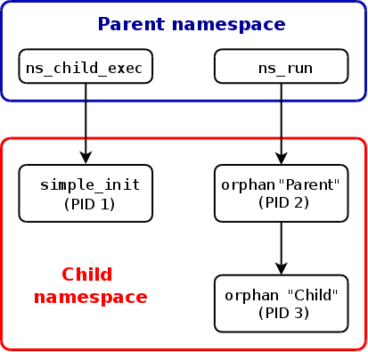
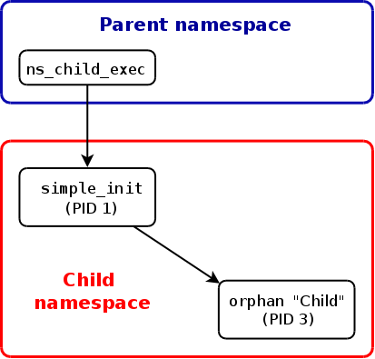

# Namespaces in operation
> By Michael Kerrisk January 4, 2013
## part 1: namespaces overview
从Linux 3.8的合并窗口可以看到Eric Biederman数量可观的系列[用户名字空间及相关补丁](https://lwn.net/Articles/528078/)。虽然还留有一些细节待完成--例如许多Linux 文件系统不是用户名字空间感知的--用户名字空间的功能实现尚未完全结束。

基于许多原因，用户名字空间工作的完成可从某种意义上视为一个里程碑。首先，这项工作代表了迄今为止最复杂的名字空间实现之一的完成，且被从用户名字空间实现的第一步（Linux 2.6.23）以来的近五年的工作所见证。其次，名字空间的工作最近达到了某个“稳定点”，其中大部分存在的名字空间实现已经完成。这并不意味着名字空间的工作已经结束：将来有可能加入其它的名字空间，已有的名字空间将来也有可能被扩展，例如[内核日志的名字空间隔离](https://lwn.net/Articles/527342/)的加入。最好，最近的用户名字空间实现的变化改变了游戏规则--它改变了名字空间的使用方式：从Linux 3.8 开始，非特权进程可以创建用户名字空间，且在其中它们拥有完全权限。它接下来可允许其它类型名字空间在用户名字空间被创建。

因此，当前节点可被视为一个很好的点来纵览名字空间，并以实际的观点检视名字空间API。本文是系列文章的第一篇：在本文中，我们提供了当前可用名字空间的一个概览；在接下来的文章中，我们将展示如何在程序中使用名字空间API。
### 1.1 名字空间（家族）
当前Linux实现了6种不同类型的名字空间。每种名字空间的目的在于将某种特定全局系统资源包装成某种抽象，使得这些名字空间里的进程看起来拥有这些全局资源的隔离实例。名字空间的一个综合目标是支持实现[容器](https://lwn.net/Articles/524952/)--一个轻量级虚拟化（也有其它目的）工具，可以为一组进程提供一种错觉--它们是系统里的唯一进程。

在下面的讨论中，我们按照实现的顺序讨论名字空间（或者至少，按照实现完成的顺序）。括号中的`CLONE_NEW*`标识符是用于调用名字空间相关API（如clone(), unshare(), 和 setns()）时用于识别名字空间类型的常量名，这些API将会在下面的文章讨论。

[挂载名字空间](http://lwn.net/2001/0301/a/namespaces.php3)（CLONE_NEWNS, Linux 2.4.19）隔离了一组进程看到的文件系统挂载点。因此，不同挂载名字空间的进程会看到不同的文件系统层级。随着挂载名字空间的引入， [mount()](http://man7.org/linux/man-pages/man2/mount.2.html) and [umount()](http://man7.org/linux/man-pages/man2/umount.2.html)系统调用停止了对系统上所有进程可见的全局文件系统挂载点集上操作，取而代之的是，仅仅对调用进程相关的挂载名字空间进行操作。

挂载名字空间的一个用例是创建类似chroot囚笼的环境。但是，不同于使用chroot()系统调用，挂载名字空间是针对这个任务更安全和更具弹性的工具。其它关于挂载名字空间的[更复杂使用](http://www.ibm.com/developerworks/linux/library/l-mount-namespaces/index.html)也是可能的。例如，不同的挂载名字空间可建立一种主从关系，如此挂载事件可自动从一个名字空间传播到另一个；这允许，比如说，在一个名字空间挂载的关盘设备自动出现在另一个名字空间。

挂载名字空间是Linux实现的第一种名字空间，出现于2002年。这个实时解释了相对通用的"NEWNS"名字（"new namespace"的简写）。在那个时间点，没人会想到将来还需要其它类型的名字空间。

[UTS名字空间](https://lwn.net/Articles/179345/)（CLONE_NEWUTS, Linux 2.6.19）隔离两种系统标识符--nodename 和 domainname--由[uname()](http://man7.org/linux/man-pages/man2/uname.2.html)系统调用返回；名字由`sethostname()` 和 `setdomainname()`系统调用设置。在容器上下文中，UTS名字空间特征允许每个容器有其自己的主机名和NIS 域名。这可能对于初数化或配置脚本有用--它们可以根据这些名字采取相应行动。术语"UTS"来自于传递给`uname()`系统调用的结构名：`struct utsname`。该结构的名字则来自于UNIX分时系统（"UNIX Time-sharing System"）。

[IPC名字空间](https://lwn.net/Articles/187274/) (CLONE_NEWIPC, Linux 2.6.19)隔离特定进程间通讯资源，即[System V IPC](http://www.kernel.org/doc/man-pages/online/pages/man7/svipc.7.html) 对象和 (since Linux 2.6.30) [POSIX 消息队列](http://www.kernel.org/doc/man-pages/online/pages/man7/mq_overview.7.html)。这些IPC机制的共同特征是IPC使用一种不同于文件系统路径的识别方法。每个IPC 名字空间有一套自己的System V IPC标识符和自己的POSIX 消息队列文件系统。

[PID名字空间](https://lwn.net/Articles/259217/) (CLONE_NEWPID, Linux 2.6.24) 隔离进程ID数字空间。换句话说，在不同PID名字空间的进程可以拥有相同的PID。PID名字空间的一个主要用处在于容器可以在不同宿主机上迁移，但容器里的进程可以保持相同的进程ID。PID 名字空间也允许每个容器有其自己的 init (PID 1)，“所有进程的祖先”--其负责管理各种各样系统初始化任务，以及当进程终止是收割孤儿子进程。

从一个特定PID名字空间实例看，一个进程拥有两个ID：PID名字空间内的进程ID，以及在PID名字空间外即宿主机系统里的进程ID。PID 名字空间可以前套：一个进程可以在从其所在PID名字空间的每一层拥有一个进程ID，直至根PID名字空间。一个进程仅能（通过kill()发送信号）看到自己所属PID名字空间以及该PID名字空间的附属PID名字空间里的进程。

[网络名字空间](https://lwn.net/Articles/219794/) (CLONE_NEWNET, 始于 Linux 2.6.24 大体完成于约 Linux 2.6.29)提供了于网络相关的系统资源的隔离。因此，每个网络名字空间拥有其自己的网络设备，IP地址，IP路由表，/proc/net 目录，端口号，等等。

从联网的视角看，网络名字空间使得容器更有用：每个容器拥有自己的（虚拟）网络设备，并且其应用有独立的端口号空间（per-namespace port number space）；合适的主机系统路由表可直接将网络包导向到与特定容器关联的网络设施。因此，在同一宿主机上拥有多个容器化的Web服务器是可能的，每个Web服务器在其（每个容器的）网络名字空间里绑定到80端口。

[用户名字空间](https://lwn.net/Articles/528078/) (CLONE_NEWUSER, 始于 Linux 2.6.23 完成于 Linux 3.8) 隔离用户与组数字空间。换句话说，一个进程的用户ID和组ID在一个用户名字空间的内部和外部可能是不同的。这里最有趣的事情是：一个进程在一个用户名字空间外拥有一个非特权用户ID，但在该名字空间里其同时有用用户ID 0。这意味着在用户名字空间里该进程有用完全的根用户特权来执行各种操作，但在用户名字空间外它只能执行非特权操作。

从Linux 3.8起，非特权进程可以创建用户名字空间，这为应用带来了一些新的有趣的可能性：既然一个非特权进程在一个用户名字空间里拥有根用户特权，非特权进程现在可以访问一些以前特定于根用户的功能。Eric Biederman 已经付出极大的努力以使得用户名字空间实现安全且正确。但是，这项工作带来的改变是微妙的，影响范围很广。因此，将来可能会有一些用户名字空间的未发现安全问题被报告出来并被解决。
### 1.2 总结评论（Concluding remarks）
从第一个Linux名字空间实现开始到现在已经过去了10年。从那时开始，名字空间的概念已经被扩展到一个更通用的框架用来隔离以前是系统范围的一些全局资源。结果，现在名字空间以容器的方式为一个完整的轻量级虚拟化系统提供了基础。由于名字空间的概念已经扩展，相关API也增加了--从一个简单的系统调用（clone()）以及一个到两个/proc文件--到现在包括许多别的系统调用以及更多/proc下的文件。API的细节将在本文的后续文章里讨论。
## Part 2: the namespaces API
一个名字空间将某种全局系统资源包装成某种抽象，使得这些名字空间里的进程看起来拥有这些全局资源的隔离实例。名字空间可用于各种目的，但其最值得注意的一点是实现[容器](https://lwn.net/Articles/524952/)--一个轻量级虚拟化计数，这是关于名字空间实现及其API的系列文章的第二篇。该系列文章的[第一篇](https://lwn.net/Articles/531114/)给出了一个名字空间概览。本篇文章介绍了名字空间API的一些字节，并结合实例介绍了API的使用。

名字空间API包括了三个系统调用--`clone()`, `unshare()`, 和 `setns()`--以及许多/proc文件。在本文中，我们将看到所有这些系统调用及一些/proc文件。为了指定在哪种名字空间类型上操作，3个系统调用使用了上篇文章列出的CLONE_NEW* 常量：CLONE_NEWIPC, CLONE_NEWNS, CLONE_NEWNET, CLONE_NEWPID, CLONE_NEWUSER, 和 CLONE_NEWUTS.
### 2.1 在新的名字空间创建子进程： clone()
创建名字空间的一种方法是借助 [clone()](http://man7.org/linux/man-pages/man2/clone.2.html)，一个创建新进程的系统调用。针对我们的目的，clone()拥有下面的原型：
```
int clone(int (*child_func)(void *), void *child_stack, int flags, void *arg);
```
本质上，`clone()` 是传统UNIX `fork()` 系统调用的一个更通用的版本，它的功能可以通过 flags 参数来控制。总之，越有超过20个的不同的 `CLONE_*` 标记来控制 clone() 操作的各个方面，包括父进程与子进程是否共享资源如虚拟内存，打开文件描述符，信号量处理等。如果一个 `CLONE_NEW*` 位在调用中指定，那么一个对应类型的新的名字空间将被创建，新进程将成为该名字空间的一个成员。`flags` 参数可以指定多个 `CLONE_NEW*` 标记位。

我们的示例应用（demo_uts_namespace.c）使用 clone() 并传递一个 CLONE_NEWUTS 以创建一个 UTS 名字空间。正如我们上个星期所见，UTS 名字空间隔离两个系统标识符--主机名和NIS域名--它们由 `sethostname()` 和 `setdomainname()` 系统调用设置，并由 `uname()` 系统调用返回。你可以在[这里](https://lwn.net/Articles/531245/)找到完整的源代码。下面，我们将关注应用的关键部分（为了简单，我们会跳过错误处理代码，它们在现在的完整版本代码中是存在的）。

示例应用需要一个命令行参数。当运行时，它创建一个子进程在一个新的 `UTS` 名字空间里运行。在该名字空间里，子进程将主机名更改为命令行参数传递进来的值。

主程序最重要的部分是调用clone()以创建子进程：
```
child_pid = clone(childFunc, 
    child_stack + STACK_SIZE,   /* Points to start of downwardly growing stack */ 
    CLONE_NEWUTS | SIGCHLD, argv[1]);

printf("PID of child created by clone() is %ld\n", (long) child_pid);
```
新的子进程将唉用户定义函数childFunc()中开始其执行，该函数将接受最终的 clone() 参数（argv[1]）作为其参数。因为 `CLONE_NEWUTS` 作为flags参数的一部分被指定，子进程静载一个新创建的UTS 名字空间里开始执行。

主进程然后睡眠一会儿，这是一个给予子进程时机在其名字空间更改其主机名（粗暴的）方式。然后程序在父进程的 UTS 名字空间检索主机名并显示它：
```
sleep(1);           /* Give child time to change its hostname */

uname(&uts);
printf("uts.nodename in parent: %s\n", uts.nodename);
```
同时，由clone()创建的子进程开始执行 childFunc() 函数，它首先改变主机名为提供给它的参数，然后检索并答应修改后的主机名：
```
sethostname(arg, strlen(arg);
    
uname(&uts);
printf("uts.nodename in child:  %s\n", uts.nodename);
```
在结束前，子进程睡眠了一会儿，这拥有让子进程的UTS名字空间保持开放的效果；这给了我们进行后面将显示的一些实验的机会。

运行该实例应用将展示父进程和子进程拥有独立的 UTS 名字空间：
```
$ su                   # Need privilege to create a UTS namespace
Password: 
# uname -n
antero
# ./demo_uts_namespaces bizarro
PID of child created by clone() is 27514
uts.nodename in child:  bizarro
uts.nodename in parent: antero
```
和其它大多数名字空间一样（用户名字空间除外），创建 UTS 名字空间需要特权（尤其是CAP_SYS_ADMIN）。这对于防止某些场景是必须的：set-user-ID应用可能呗糊弄以做出错误的事情，因为系统有一个不期待的主机名。

另一个可能性是set-user-ID应用可能使用主机名作为文件锁名字的一部分。如果一个非特权用户可以在一个UTS名字空间中以任意主机名运行应用，这将使得该应用对各种攻击开放。最简单的，这将使得文件锁无效，从而触发运行在不同 UTS 名字空间的应用行为异常。另外，一个不怀好意的用户可能在一个带有特定主机名的 UTS 名字空间运行set-user-ID应用创建锁文件而覆盖重要文件（主机名可以包含任意字符，甚至斜杠）。
### 2.2 /proc/PID/ns 文件
每个进程都拥有一个 `/proc/PID/ns` 目录，其下每个名字空间有一个对应文件。从Linux 3.8开始，每个文件是一个特殊的符号链接，它提供了对一个进程的名字空间执行相关操作的句柄（handler）:
```
$ ls -l /proc/$$/ns         # $$ is replaced by shell's PID
wangbb@c005mkkbjde03:~> ls -l /proc/15112/ns
total 0
lrwxrwxrwx. 1 wangbb wangbb 0 Dec 20 12:23 ipc -> ipc:[4026531839]
lrwxrwxrwx. 1 wangbb wangbb 0 Dec 20 12:23 mnt -> mnt:[4026531840]
lrwxrwxrwx. 1 wangbb wangbb 0 Dec 20 12:23 net -> net:[4026531956]
lrwxrwxrwx. 1 wangbb wangbb 0 Dec 20 12:23 pid -> pid:[4026531836]
lrwxrwxrwx. 1 wangbb wangbb 0 Dec 20 12:23 user -> user:[4026531837]
lrwxrwxrwx. 1 wangbb wangbb 0 Dec 20 12:23 uts -> uts:[4026531838]
```
这些符号链接的一个用途是发现两个进程是否在同一名字空间。内核做了一些魔法可以确保如果两个进程在同一名字空间，在`/proc/PID/ns`下的符号链接文件的inode号是一样的。inode号可以通过系统调用 [stat()](http://man7.org/linux/man-pages/man2/stat.2.html)（在返回结构体的st_ino成员里）。

但是，内核也在`/proc/PID/ns`构造了每一个符号链接，并且其名字包含可用于识别名字空间类型的字符串，其后跟随有inode号。我们可以使用 `ls -l` 或`readlink`命令来检查这个名字。让我们回到上次我们运行`demo_uts_namespaces`的shell会话，查看父进程和子进程在/proc/PID/ns下的符号链接提供了检测两个进程是否在同一个UTS名字空间的方法。
```
^Z                                # Stop parent and child
[1]+  Stopped          ./demo_uts_namespaces bizarro
# jobs -l                         # Show PID of parent process
[1]+ 27513 Stopped         ./demo_uts_namespaces bizarro
# readlink /proc/27513/ns/uts     # Show parent UTS namespace
uts:[4026531838]
# readlink /proc/27514/ns/uts     # Show child UTS namespace
uts:[4026532338]
```
正如你看到的，/proc/PID/ns/uts 符号链接的内容是不同的，指示两个进程位于不同的 UTS名字空间里。

/proc/PID/ns 符号链接也用于其它目的。如果我们打开其中任一文件，名字空间将保持打开，只要文件描述符把持打开，甚至名字空间里的所有进程都已经终止。通过绑定挂载（bind mounting）符号链接中的一个到文件系统的其它位置可以取得同样的效果。
```
# touch ~/uts                            # Create mount point
# mount --bind /proc/27514/ns/uts ~/uts
```
在Linux 3.8之前，/proc/PID/ns下的文件是硬链接而非上文描述的特殊符号链接形式。此外，只有ipc, net 和 uts 存在。
### 2.3 加入一个已有名字空间：setns()
保持一个没有任何进程在里面的名字空间开放只在一种情况下有用：我们稍后会向其添加新的进程。这是系统调用[setns()](http://man7.org/linux/man-pages/man2/setns.2.html)的任务，它允许调用进程加入到一个已经存在的名字空间。
```
int setns(int fd, int nstype);
```
更准确地讲，setns() 把调用进程与一个特定类型的名字空间实例解除绑定（disassociates ），然后将该进程与同类型名字空间的另一个实例绑定。

`fd` 参数指定了将要加入的名字空间，它是指向 `/proc/PID/ns` 下的一个符号链接的文件描述符。该文件描述符可以通过两种方式获得：直接打开一个符号链接或一个与该链接绑定挂载的文件。

`nstype` 参数让调用方检验`fd`参数引用的名字空间类型。如果这个参数被指定为0，就不会执行检查。当调用方已经知道名字空间类型或者不关心类型时，这个特性可能有用。我们售后将讨论的示例程序（ns_exec.c）属于后者：它被设计为与任何名字空间类型工作。指定`nstype`为CLONE_NEW* 常量之一会促使内核验证`fd`是指向对应名字空间类型的文件描述符。这可能很有用，例如，调用方被通过UNIX域套接字传递一个文件描述符，需要验证它所指向的名字空间类型。

使用`setns()` 和 `execve()` (或者其它 `exec()` 函数族之一) 可以让我们构建一个简单单有用的工具：一个程序可以加入到一个特定名字空间并在其中执行命令。

我们的应用（ns_exec.c，其完整代码可在[这里](https://lwn.net/Articles/531271/)找到）可传递两个或更多命令行参数。第一个参数是一个 `/proc/PID/ns/*` 下的符号链接的路径名（或一个文件绑定挂载指向这些符号链接中的一个）。剩余的参数是在名字空间执行的程序名，对应该符号链接以及一些传递给该程序的可选参数。程序的主要步骤如下：
```
fd = open(argv[1], O_RDONLY);   /* Get descriptor for namespace */

setns(fd, 0);                   /* Join that namespace */

execvp(argv[2], &argv[2]);      /* Execute a command in namespace */
```
在一个名字空间里执行的一个有趣的程序是 `shell`。我们可以使用连接UTS 名字空间的绑定挂载（该名字空间先前由ns_exec 创建）并在我们用demo_uts_namespaces创建的新的UTS名字空间里执行`shell`。
```
# ./ns_exec ~/uts /bin/bash     # ~/uts is bound to /proc/27514/ns/uts
My PID is: 28788
```
我们可以验证`shell`和由`demo_uts_namespaces`创建的子进程在同一个UTS名字空间里，都通过检查主机名以及比较 `/proc/PID/ns/uts` 文件的inode号，
```
# hostname
bizarro
# readlink /proc/27514/ns/uts
uts:[4026532338]
# readlink /proc/$$/ns/uts      # $$ is replaced by shell's PID
uts:[4026532338]
```
在早期内核版本中，不能使用setns()来加入挂载, 进程ID, 和用户名字空间，但是从Linux 3.8 开始，setns()支持加入所有的名字空间。
### 2.4 脱离一个名字空间：unshare()
名字空间API的最后一个系统调用是[unshare()](http://man7.org/linux/man-pages/man2/unshare.2.html):
```
    int unshare(int flags);
```
`unshare()` 系统调用提供了与 `clone()`相似的功能，但是作用于调用进程上：它新创建了由 `flags` 参数中的 `CLONE_NEW*` 位所指定的名字空间，并使调用方称为名字空间的一员。（就像clone()，unshare()提供了名字空间以外的功能，我们这里将忽略它们）。`unshare()`的主要功能是隔离名字空间（以及其它）副作用，而无需创建一个新的进程或线程（就像clone()所做的）。

把clone()系统调用的其它功能放在一边，以下调用形式
```
    clone(..., CLONE_NEWXXX, ....);
```
在名字空间术语上，与下面调用大致相同：
```
if (fork() == 0)
    unshare(CLONE_NEWXXX);      /* Executed in the child process */
```
`unshare()` 系统调用的一个主要用途是实现 `unshare` 命令，它允许用户在另一个与 `shell` 不同的名字空间执行命令。这个命令的一般形式如下：
```
unshare [options] program [arguments]
```
`options` 是命令行标记，它执行了在以 `arguments` 为参数执行 `program` 之前 `unshare` 的名字空间。

`unshare` 命令的实现的关键步骤是想直接的：
```
/* Code to initialize 'flags' according to command-line options omitted */

unshare(flags);

/* Now execute 'program' with 'arguments'; 'optind' is the index
of the next command-line argument after options */

execvp(argv[optind], &argv[optind]);
```
`unshare` 命令的一个简单实现（`unshare.c`）可在[这里](https://lwn.net/Articles/531826/)找到。

在下面的 `shell` 会话中，我们使用我们的 `unshare.c` 程序来在一个单独的挂载名字空间执行一个 `shell`。正如我们在上周的文章里提到的，挂载名字空间隔离了一组进程看到的文件系统挂载点，允许在不同挂载名字空间的进程看到不同层级的文件系统。
```
# echo $$                             # Show PID of shell
8490
# cat /proc/8490/mounts | grep mq     # Show one of the mounts in namespace
mqueue /dev/mqueue mqueue rw,seclabel,relatime 0 0
# readlink /proc/8490/ns/mnt          # Show mount namespace ID 
mnt:[4026531840]
# ./unshare -m /bin/bash              # Start new shell in separate mount namespace
# readlink /proc/$$/ns/mnt            # Show mount namespace ID 
mnt:[4026532325]
```
比较两个readlink 命令的输出可以看到两个shells 位于不同的挂载名字空间。在一个名字空间里更改挂载点，在别的名字空间检验该改变是否可见，这提供了位于两个进程位于两个不同名字空间的另一种展示方法。
```
# umount /dev/mqueue                  # Remove a mount point in this shell
# cat /proc/$$/mounts | grep mq       # Verify that mount point is gone
# cat /proc/8490/mounts | grep mq     # Is it still present in the other namespace?
mqueue /dev/mqueue mqueue rw,seclabel,relatime 0 0
```
可以从上面两个命令输出看到，/dev/mqueue 挂载点已经在一个挂载名字空间里被移除了，但在另一个名字空间里依然存在。
### 2.5 总结评论（Concluding remarks）
在本文中我们给出了名字空间API的基本概览，以及它们是如何使用的。在下面的文章中，我们将深入探讨一些别的名字空间，特别地，PID 以及用户名字空间；用户名字空间打开了一定范围的可能性--它使得应用可以使用之前只能被特权应用使用的一些内核接口。
## Part 3: PID namespaces
随着上两篇名字空间的文章，让我们转过头来看看 PID 名字空间。由 PID 名字空间隔离的全局资源是进程ID数字空间。这意味这在不同 PID 名字空间的进车该可以拥有相同的金册个ID，PID 名字空间用于实现在不同主机系统键迁移的容器，在不同的容器内部进程可以保持相同的进程ID。

就像传统Linux（或UNIX）上的进程，在PID名字空间里的进程ID是独一无二的，从PID 1起其顺序递增。同样地，像传统Linux系统，PID 1--初始化进程--时特别的：它是该名字空间创建的第一个进程，并且它在改名字空间执行一定的管理任务。
### 3.1  首次调查（First investigations）
一个新的PID名字空间通过调用[clone()](http://man7.org/linux/man-pages/man2/clone.2.html) 传递 `CLONE_NEWPID` 标记的方式创建。我们就展示一个简单的示例应用，它使用clone()创建一个新的PID名字空间，并利用该应用标出了PID名字空间的一些基本概念。这个应用（pidns_init_sleep.c）的完整代码可在[这里](https://lwn.net/Articles/532741/)找到。正如本系列之前的文章，为了简化目的，在讨论文章本体时，我们略过了错误处理代码（但这些错误处理代码在实例应用的完整版本中存在）。

主程序利用clone()创建了一个PID名字空间，并在打印了创建的子进程的进程ID：
```
        child_pid = clone(childFunc,
                child_stack + STACK_SIZE,   /* Points to start of downwardly growing stack */
                CLONE_NEWPID | SIGCHLD, argv[1]);

printf("PID returned by clone(): %ld\n", (long) child_pid);
```
新的子进程在childFunc()中开始执行，它接受了clone调用的最后一个参数（argv[1]）作为其参数。该参数的目的在售后将变得清晰起来。

childFunc()函数打印了进程ID以及clone()创建的子进程的父进程ID，并以执行标准 `sleep` 程序结束：
```
    printf("childFunc(): PID = %ld\n", (long) getpid());
    printf("ChildFunc(): PPID = %ld\n", (long) getppid()); 
    ...
    execlp("sleep", "sleep", "1000", (char *) NULL); 
```
执行`sleep`的主要好处在于它给我们提供了一个简单的方式来将子进程与父进程区别开来。

当我们执行这个应用时，头行输出如下：
```
    $ su         # Need privilege to create a PID namespace
    Password: 
    # ./pidns_init_sleep /proc2
    PID returned by clone(): 27656
    childFunc(): PID  = 1
    childFunc(): PPID = 0
    Mounting procfs at /proc2
```
pidns_init_sleep 的头两行输出显式了子进程在两个不同PID名字空间的进程ID：clone() 调用者所在的名字空间以及子进程所在的名字空间。换句话说，子进程拥有两个进程ID：在父进程名字空间是27656 ，在有clone()嗲用创建的名字空间是1。

下一行显示了子进程的父进程ID，在子进程驻留的PID名字空间上下文中（由getppid()返回的值）。父进程PID是0，演示了PID名字空间的一个小小借口。正如我们将详细讨论的，PID 名字空间形成了一个层级：一个进程仅能看到在其PID 名字空间以及其下嵌套名字空间里的进程，因为由clone()创建的子进程的父进程在一个不同的PID名字空间，子进程看不到父进程；因此，getppid()报告其父进程为0.

对pidns_init_sleep最后一行输出的解释，我们将返回到我们讨论childFunc()函数的实现时跳过的一部分代码。
### 3.2  /proc/PID 和 PID 名字空间（/proc/PID and PID namespaces）
Linux系统上的每个进程都有一个 `/proc/PID`--它容纳了描述该进程的伪文件。这个模式被直接用于 PID 名字空间模型。在一个PID 名字空间里，`/proc/PID` 目录仅仅显示在该 PID 名字空间或其子名字空间里的进程信息。

但是，为了使一个PID名字空间对应的`/proc/PID` 目录可见，proc文件系统（简称"procfs"）需要从PID名字空间内部挂载。从一个运行在PID名字空间内部的shell （可能通过system()库函数），我们可以使用mount 命令做到这一点，就像下面这个格式：
```
    # mount -t proc proc /mount_point
```
另外， 一个procfs可以通过mount()系统调用挂载，就像我们已经在我们的应用里的childFunc()函数里所做的那样：
```
    mkdir(mount_point, 0555);       /* Create directory for mount point */
    mount("proc", mount_point, "proc", 0, NULL);
    printf("Mounting procfs at %s\n", mount_point);
```
当pidns_init_sleep被运行时，变量mount_point被一个从命令行传来的字符串参数初始化。

在我们的例子中，shell运行`pidns_init_sleep`，我们还将 `procfs` 挂载于`/proc2`。在实际使用中，通过使用我们将稍后谈到的方法之一，procfs （如果必要）通常被挂载到通常的地方，`/proc`。但是，在我们的演示中把 `procfs` 挂载到 `/proc2` 提供了一种避免给系统中的其它进程带来问题的一种更简单方法：因为这些进程与我们的测试程序位于同一挂载名字空间，改变挂载于 `/proc` 的文件系统将是系统的其它进程混淆--根PID名字空间里的 1/proc/PID` 将变得不可见。

因此，在我们的shell 会话中，挂载于 `/proc` 的procfs将使得PID子目录对来自父PID名字空间的进程可见；挂载于 `/proc2 ` 的procfs将使得PID子目录对来自子PID名字空间的进程可见。在传递中，值得注意的是，虽然子 PID 名字空间里的进程可以看到由 `/proc` 挂载点暴露出来的PID 目录，这些PID对于子PID名字空间里的进程毫无意义，因为这些进程将基于其所处的PID名字空间上下文来解释这些进程ID。

如果我们向让各种工具如 `ps` 在子PID名字空间正常工作，那么将 procfs文件系统挂载于传统的/proc就是必须的--这些工具依赖位于 `/proc` 下的信息。有两种方式可以达到这个目的而不影响父PID 名字空间的 `/proc` 挂载点。首先，如果子进程使用 `CLONE_NEWNS` 标记创建，则其位于一个与系统中的其它部分不一样的挂载名字空间。在这种情况下，在 `/proc` 下挂载新的procfs不会引起任何问题。另一种方式下，不使用 `CLONE_NEWNS` 标记，子进程可以使用 `chroot()` 来更改其根目录并在 `/proc` 下挂载procfs.

让我们回到运行 `pidns_init_sleep` 的shell会话。我们停止该程序，在父名字空间的上下文中来检查父进程和子进程的一些细节：
```
    ^Z                          Stop the program, placing in background
    [1]+  Stopped                 ./pidns_init_sleep /proc2
    # ps -C sleep -C pidns_init_sleep -o "pid ppid stat cmd"
      PID  PPID STAT CMD
    27655 27090 T    ./pidns_init_sleep /proc2
    27656 27655 S    sleep 600
```
上面输出的最后一行中的 "PPID" 值 (27655) 显示执行 `sleep` 的进程的父进程就是执行 `pidns_init_sleep` 的进程。

通过使用readlink来显示/proc/PID/ns/pid符号链接（[上星期文章解释过](https://lwn.net/Articles/531381/#proc_pid_ns)）的（不同）内容，我们可以看到两个进程位于不同的PID名字间：
```
    # readlink /proc/27655/ns/pid
    pid:[4026531836]
    # readlink /proc/27656/ns/pid
    pid:[4026532412]
```
在这个点，从那个名字空间的视角， 我们也可以使用新挂载的 procfs 来获取新PID名字空间里的进程的信息。作为开始，我们可以使用下面的命令来获取该名字空间下的进程ID列表：
```
    # ls -d /proc2/[1-9]*
    /proc2/1
```
如你所见，PID名字空间下只有一个进程，其进程ID（在该名字空间下）为1。我们也可以使用/proc/PID/status文件作为获取之前shell会话看到进程的同样的信息的一部分的另一种方法。
```
    # cat /proc2/1/status | egrep '^(Name|PP*id)'
    Name:   sleep
    Pid:    1
    PPid:   0
```
该文件中 PPid 字段为0，与getppid() 报告子进程的父进程ID为0的事实相符。
### 3.3  嵌套PID名字空间（Nested PID namespaces）
正如前面提到的，PID名字空间是层级化嵌套于父子关系中。在一个PID 名字空间里，可能看到所有其它进程位于同一名字空间，所有进程皆为子名字空间的成员。这里，“看到”指能通过系统调用对特定PID进行操作（例如，利用kill()对进程发信号）。子PID 名字空间里的进车该看不到（仅仅）存在于父PID名字空间（或更远的祖先名字空间）里的进程。

从一个进程驻留的PID名字空间开始知道根PID名字空间，对PID名字空间层级上每一层，该进程都有一个PID。调用getpid()总是返回该进程驻留的PID名字空间里的进程ID。

我们可以使用这个[程序](https://lwn.net/Articles/532745/)（multi_pidns.c）来显示在每一个其可见的名字空间里它拥有不同的进程ID。为了简化，我们仅仅解释该程序做些什么，而不会细究程序代码细节。

该进程递归地在嵌套PID名字空间里创建一系列子进程，命令行参数指定了程序执行时多少个子进程和PID名字空间将会被创建。
```
    # ./multi_pidns 5
```
除了创建新的子进程，每个递归步骤在唯一挂载点挂载了 procfs 文件系统，在递归结束点，最后的子进程执行 sleep 程序，上面的命令行产生下面的输出：
```
    Mounting procfs at /proc4
    Mounting procfs at /proc3
    Mounting procfs at /proc2
    Mounting procfs at /proc1
    Mounting procfs at /proc0
    Final child sleeping
```
在每个procfs里查看PID，我们看到每个接续procfs 拥有更少的进程ID，这反映一个事实--每个PID名字空间仅仅显示该名字空间及其后继名字空间里的成员的进程ID。
```
    ^Z                           Stop the program, placing in background
    [1]+  Stopped            ./multi_pidns 5
    # ls -d /proc4/[1-9]*        Topmost PID namespace created by program
    /proc4/1  /proc4/2  /proc4/3  /proc4/4  /proc4/5
    # ls -d /proc3/[1-9]*
    /proc3/1  /proc3/2  /proc3/3  /proc3/4
    # ls -d /proc2/[1-9]*
    /proc2/1  /proc2/2  /proc2/3
    # ls -d /proc1/[1-9]*
    /proc1/1  /proc1/2
    # ls -d /proc0/[1-9]*        Bottommost PID namespace
    /proc0/1
```
一个合适的 grep 命令行允许我们在每个该进程可见的PID名字空间里递归尾端（例如，深度嵌套名字空间里执行sleep 程序的进程）的进程ID。
```
    # grep -H 'Name:.*sleep' /proc?/[1-9]*/status
    /proc0/1/status:Name:       sleep
    /proc1/2/status:Name:       sleep
    /proc2/3/status:Name:       sleep
    /proc3/4/status:Name:       sleep
    /proc4/5/status:Name:       sleep
```
换句话说，在嵌套最深的PID名字空间（/proc0），执行sleep 的进程拥有进程ID 1，在最上面的PID名字空间（/proc4），该进程拥有进程ID 5。

如果你运行本文里的测试程序，值得注意的是它们留下挂载点和挂载目录。程序结束后，下面的shell 命令足够帮助我们清理它们：
```
    # umount /proc?
    # rmdir /proc?
```
### 3.4  总结评论（Concluding remarks）
在本文中，我们看到了PID 名字空间操作的一些细节。在下一篇文章，我们将讨论PID名字空间里的 init 进程，以及PID 名字空间API的一些细节。
## Part 4: more on PID namespaces
在本文中，我们将继续上周对PID名字空间的[讨论](https://lwn.net/Articles/532271/)（扩展我们的名字空间[系列](https://lwn.net/Articles/531114/#series_index)）。PID 名字空间的一个主要用途是实现一揽子进程（一个容器）向一个自包含的Linux系统一样运作。传统系统的一个关键部分--一个PID名字空间容器也一样--是 `init` 进程。因此，我们将探讨`init` 进程的特殊角色，并指出它与传统`init` 进程不一样的几处地方。另外， 我们也将讨论应用于PID名字空间时名字空间API的一些其它细节。
### 4.1 PID名字空间 init 进程
一个PID名字空间里创建的第一个进程在该名字空间的进程ID是1。该进程承担与传统Linux系统 init 进程相似的角色。特别地，init 进程可以为PID名字空间整体执行必要的初始化工作（例如，启动其它作为名字空间标准已部分的进程），并成为该名字空间内孤儿进程的父进程。

为了解释PID名字空间的运作，我们将利用一些特别构造的示例应用。第一个应用，[ns_child_exec.c](https://lwn.net/Articles/533492/)，具有下面的命令行语法：
```
    ns_child_exec [options] command [arguments]
```
`ns_child_exec` 使用了 `clone()` 系统调用创建子进程；子进程接下来结合可选参数执行给定的命令。`options` 的主要目的指定作为clone()系统调用被创建的一部分新名字空间。例如，-p 选项使得子进程在一个新的PID名字空间里创建，如下例所示：
```
    $ su                  # Need privilege to create a PID namespace
    Password:
    # ./ns_child_exec -p sh -c 'echo $$'
    1
```
该命令行在一个新的PID名字空间创建了一个子进程来执行一个 `shell echo` 命令，它将显示shell的进程ID。 shell 拥有进程ID 1，因此当 shell 运行时，PID名字空间一直存在，shell 就是该PID名字空间的init 进程。

我们的下一个示例应用，[simple_init.c](https://lwn.net/Articles/533493/)，是一个我们将作为一个PID名字空间 init 进程执行的应用。

`simple_init` 将执行init的两个主要功能。其一是“系统初始化”，大多数 init 系统是更复杂的应用，它们会通过一个表格驱动的方式来初始化系统。我们的（简化得多）`simple_init` 应用提供一个简单的 shell 来允许用户手动执行任何需要初始化名字空间的 shell 命令；这种方式也允许我们自由地执行 shell 命令在名字空间里做实验。`simple_init` 执行的其它功能是使用 `waitpid()` 收割终止进程的状态。

因此，例如，我们可以使用 `ns_child_exec` 应用与 `simple_init` 一起构造一个新的PID名字空间并在其中运行一个init 进程：
```
    # ./ns_child_exec -p ./simple_init
    init$
```
init$ 提示符指示 simple_init 已准备好以读入并执行一个shell命令。

现在，我们使用我们到现在已经提供的两个应用，以及另一个简单应用 [orphan.c](https://lwn.net/Articles/533494/)一起，来演示在一个PID名字空间里如果一个进程称为一个孤儿进程，它将会被PID名字空间 init 进程收割，而非系统范围的  init 进程。

一个孤儿进程执行fork()来创建一个子进程，父进程接下来退出，留下子进程继续运行；在父进程退出时，子进程成为孤儿。子进程执行一个循环直至它成为一个孤儿（例如，getppid() 返回 1）；一旦子进程成为孤儿进程，它将会终止。父进程及子进程都将打印消息，因此我们可以看到两个进程何时结束以及子进程何时称为孤儿进程。

为了看到 simple_init 收割孤儿子进程的细节，我们将打开程序的 -v 选项，这将导致它输出关于它创建的子进程以及它收割子进程的信息：
```
    # ./ns_child_exec -p ./simple_init -v
            init: my PID is 1
    init$ ./orphan
            init: created child 2
    Parent (PID=2) created child with PID 3
    Parent (PID=2; PPID=1) terminating
            init: SIGCHLD handler: PID 2 terminated
    init$                   # simple_init prompt interleaved with output from child
    Child  (PID=3) now an orphan (parent PID=1)
    Child  (PID=3) terminating
            init: SIGCHLD handler: PID 3 terminated
```
在上面的输出中，带缩进以init:为前缀的消息是在详细输出模式下的 simple_init 打印的。其它所有的消息（没有init$提示符）由 orphan 程序产生。从输出我们可以看到子进程（PID 3）在父进程（PID 2）终止时成为孤儿进程。在那个点，子进程被PID名字空间init 进程收养，它将会在子进程终止时收割它。
### 4.2 信号与 init 进程
传统Linux系统 init 进程关于信号是区别处理的。可被递送到 init 进程的唯一信号是已经建立了信号处理函数的信号；所有其它的将会被忽略。这阻止了 init 进程--它的存在对于系统的稳定运行是至关重要的--被甚至被超级用户意外杀死。

PID名字空间为名字空间特定的 init 进程实现了类似的行为。名字空间的其它进程（甚至特权进程）只能发送那些 init 进程已经建立了信号处理函数的信号。这防止了名字空间的成员不经意杀死在名字空间了承担重要作用的进程。注意，然而，（像传统 init 进程）内核认可在所有常见场景（比如，硬件异常，终端产生的信号如SIGTTOU，定时器过期等）下对PID名字空间 init 进程产生信号。

信号也（受[常规权限检查](http://man7.org/linux/man-pages/man2/kill.2.html#DESCRIPTION)）可从祖先PID名字空间里的进程发送给该PID名字空间的 init 进程。再次强调，只有被 init 进程注册了信号处理函数的信号才能被递送，但有两个意外：SIGKILL 和 SIGSTOP。当祖先PID名字空间的一个进程发送这两个信号给 init 进程时，它们被强制发送（不能被捕获）。SIGSTOP 信号通知停止init 进程；SIGKILL 终止它。因为 init  进程对于PID名字空间至关重要，如果init进程被SIGKILL 终止（或它由于其他原因终止），内核将会对名字空间里的所有其它进程发送SIGKILL 信号以终止它们。

通常，当init 进程终止时一个PID名字空间将会被销毁。但是这里也有一个罕见场景：只要那个名字空间里的进程的/proc/PID/ns/pid文件被绑定挂载或保持打开，则该名字空间就不会被销毁。但是，不可能在该名字空间里（通过setns() + fork()）创建新的名字空间：init 进程的缺乏会在fork() 调用时被检测到，它将会失败并返回一个`ENOMEM`异常（一个传统错误用于指出PID不能被分配）。换句话说，PID名字空间依然存在，但没什么用处。
### 4.3 挂载一个 procfs 文件系统（再出发）
在这个系列的之前文章中，PID 名字空间的 /proc 文件系统（procfs）被挂载在不同的地方而非传统的 /proc。这允许我们使用shell命令查看每个新的PID 名字空间对应的/proc/PID目录的内容，同时可以使用 ps 命令来查看在根PID 名字空间可见的进程。

但是，诸如 ps 之类的工具依赖于挂载在 /proc 下的procfs的内容来获取他们所需的信息。因此如果我们期待 ps 在一个PID名字空间里正常工作，我们需要挂载该名字空间的procfs。因为simple_init 命令允许我们执行shell命令，我们可以从命令行使用 mount 命令执行此类任务：
```
    # ./ns_child_exec -p -m ./simple_init
    init$ mount -t proc proc /proc
    init$ ps a
      PID TTY      STAT   TIME COMMAND
        1 pts/8    S      0:00 ./simple_init
        3 pts/8    R+     0:00 ps a
```
`ps a` 列出了所有可通过 `/proc` 访问的进程。在本例中，我们仅仅能看到两个进程，这反映了一个事实--在该名字空间里仅仅由两个进程运行。

当运行上面的 `ns_child_exec` 时，我们开启了应用的 `-m` 选项。它把创建的子进程（例如，运行`simple_init`的进程）放到一个单独的挂载名字空间里。结果，`mount` 命令不影响名字空间外部的进程看到的 `/proc` 挂载（内容）。
#### unshare() and setns()
在[本系列的第二篇文章](https://lwn.net/Articles/531381/)中，我们描述了作为名字空间API的两个系统调用：unshare() 和 setns()。从Linux 3.8开始，这两个API可用于PID 名字空间，但在应用于这些名字空间时有其自由的风格。

调用[unshare()](http://man7.org/linux/man-pages/man2/unshare.2.html)时指定 `CLONE_NEWPID` 可以创建一个新的PID名字空间，但并不会将调用方置于新的名字空间。反之，调用者创建的任何子进程都会被置于新的名字空间；第一个子进程将会成为该名字空间的 init 进程。

[setns()](http://man7.org/linux/man-pages/man2/setns.2.html)系统调用现在支持PID名字空间：
```
setns(fd, 0);   /* Second argument can be CLONE_NEWPID to force a
                       check that 'fd' refers to a PID namespace */
```
`fd` 参数是一个文件描述符用于识别一个PID名字空间，该名字空间是调用方PID名字空间的后裔；该文件问描述可以通过打开目标名字空间里对应进程的 `/proc/PID/ns/pid` 获得。和 `unshare()`一样，`setns()` 并不会移动调用方到那个PID名字空间；相反，接下来由调用方创建的子进程将被放置于该名字空间。

我们可以使用一个本系列第二篇文章里的 [ns_exec.c](https://lwn.net/Articles/531271/)的加强版来演示某些将 `setns()` 用于PID名字空间的令人惊奇特征，直至我们理解（背后）到底发生了什么。新版本[ns_run.c](https://lwn.net/Articles/533495/)拥有下面的语法：
```
    ns_run [-f] [-n /proc/PID/ns/FILE]... command [arguments]
```
该程序使用setns()加入由 `-n` 选项 `/proc/PID/ns` 指定的文件的名字空间。它然后使用可选参数 `arguments` 执行 `command` 命令。如果-f选项指定，它将使用fork()创建子进程来执行命令。

假设我们在一个终端窗口，我们以常规方式带详细输出选项在一个新的PID名字空间启动 `simple_init` ，当它收割子进程时会通知到我们：
```
    # ./ns_child_exec -p ./simple_init -v
            init: my PID is 1
    init$ 
```
接下来我们切换到第二个终端窗口，那里我们使用 `ns_run` 来执行我们的孤儿进程。这将会有在由 `simple_init` 控制的PID名字空间创建两个进程的效果：
```
    # ps -C sleep -C simple_init
      PID TTY          TIME CMD
     9147 pts/8    00:00:00 simple_init
     # ./ns_run -f -n /proc/9147/ns/pid ./orphan
     Parent (PID=2) created child with PID 3
     Parent (PID=2; PPID=0) terminating
     # 
     Child  (PID=3) now an orphan (parent PID=1)
     Child  (PID=3) terminating
```
看看当孤儿进程执行时创建的“父进程（PID 2）”的输出，我们可以看到其父进程ID为 0。这反映了一个事实，开启孤儿进程（`ns_run`）的进程雨薇一个不同的名字空间--其成员对父进程不可见。正如前文提到的，这种情况下 `getppid()` 返回0.

下图显示了孤儿“父”进程终止前的各种各样进程的关系。牵头指明了父子进程的关系。



回到运行 simple_init 的窗口，我们可以看到下面的输出：
```
    init: SIGCHLD handler: PID 3 terminated
```
由孤儿进程创建的“子”进程（PID 3）由simple_init收割，但“父”进程（PID 2）不是。这是因为“父”进程由另一个不同名字空间的父进程（ns_run）收割。下图显示了孤儿“父”进程终止后“子”进程终止前的进程关系。



值得强调的是setns() 和 unshare() 特殊对待PID名字空间。对于其它类型的名字空间，这两个系统调用确实改变了调用方的名字空间。而不改变调用方的PID名字空间的原因在于称为另一个PID名字空间的成员涉及到进程本身的PID更改，因为getpid()仅仅汇报相对该进程驻留的PID名字空间的PID。许多用户空间的程序和库依赖一个假设：一个进程的PID（由getpid()报告）是不变的（事实上，GNU C的getpid()包装函数[缓存](http://thread.gmane.org/gmane.linux.kernel/209103/focus=209130)了PID）；如果一个进程PID改变，这些程序将会被破坏。换一种方式：一个进程的PID名字空间成员关系是当进程被创建时就确定了的，（不像其它类型的成员关系）之后绝不能改变。
### 4.4 总结评论（Concluding remarks）
本文中我们查看了PID名字空间 `init` 进程的特殊角色，展示了如何挂载一个PID名字空间的 `procfs` 从而它可被用于一些工具如 `ps`，也查看了`unshare()` 和 `setns()` 用于PID名字空间时的一些特质。这结束了我们关于PID名字空间的讨论，接下来我们将转向用户名字空间。
## Part 5: user namespaces
## Part 6: more on user namespaces
## Part 7: network namespaces
## Mount namespaces and shared subtrees
## Mount namespaces, mount propagation, and unbindable mounts
## Append A namespaces(7)
## Append B What is a bind mount?
### B.1 What is a bind mount?
绑定挂载（bind mount）是目录树的另一种视图。传统上挂载将为存储设备创建一个目录树视图。绑定挂载则将一个已存在的目录树复制到一个不同的（挂载）点下。绑定挂载点下的文件和目录与源头一模一样。在一边的任何修改立即在另一边得到反映--两个视图显示同样的数据。

例如，发出下面的命令：
```
mount --bind /some/where /else/where
```
目录 `/some/where` 和 `/else/where` 拥有同样的内容，即 `/some/where` 的内容（如果 `/else/where` 不空，则其之前的内容将被隐藏）。

不像硬链接和符号链接，一个绑定挂载并不影响文件系统存储的内容，它只是运行系统（live system）的一个属性。
### B.2 我们如何创建一个绑定挂载（bind mount）？
#### bindfs
[bindfs](http://bindfs.org/)文件系统是一种[FUSE](http://en.wikipedia.org/wiki/Filesystem_in_Userspace)，它创建了目录树的一个视图。例如，下面的命令：
```
bindfs /some/where /else/where
```
使得 `/else/where` 成为一个挂载点，其下`/some/where`中的内容可见。

因为 `bindfs` 是一个单独的文件系统，对应用来讲 `/some/where/foo` 和 `/else/where/foo` 是不同的文件（bindfs文件系统有其自己的 `st_dev` 值）。在一边的修改可以很魔幻地在另一个体现出来。但是文件相同的事实只有在一个人知道 `bindfs` 如何运行时才是明显的。

bindfs 并不了解挂载点，因此如果在`/else/where`下有一个挂载点，它看起来就像是在`/else/where`下的另一个目录。在`/else/where`下挂载或下载一个文件系统，看起来就像是`/else/where`下对应目录的一个修改。

bindfs 可能改变文件的某些元信息：它可以显示文件的错误权限和所有权。查看[手册](http://bindfs.org/docs/bindfs.1.html)以了解更多细节，查看下面的内容一看到更多示例。

bindfs 文件系统可以由一个非root账号挂载，你进进只需要挂载`FUSE`文件系统的权限。依赖于你的分发版，这可能要求在`fuse` 组，或者对所有用户开放。为了卸载一个`FUSE`文件系统，使用`fusermount -u`而不是`umount`等。
```
fusermount -u /else/where
```
#### nullfs
FreeBSD 提供了 [nullfs](https://www.freebsd.org/cgi/man.cgi?query=nullfs&sektion=5)文件系统，它创建了文件系统的另一个视图。下面的两个命令等价：
```
mount -t nullfs /some/where /else/where
mount_nullfs /some/where /else/where
```
当发布以上任意一条命令后，`/else/where`成了一个挂载点，其下`/some/where/foo`的内容皆可见。

因为 nullfs 是一个单独的文件系统，对应用来讲 `/some/where/foo` 和 `/else/where/foo` 是不同的文件（nullfs文件系统有其自己的 `st_dev` 值）。在一边的修改可以很魔幻地在另一个体现出来。但是文件相同的事实只有在一个人知道 `nullfs` 如何运行时才是明显的。

不像FUSE bindfs，它在目录树级别运行，FreeBSD的nullfs 更深入内核运行。因此`/else/where`下的挂载点是不可见的： 只有同一个挂载点例如`/some/where`的树的部分可以在`/else/where`下见到。

nullfs 文件系统可能在其它BSD变种平台下可用（OS X, OpenBSD, NetBSD），但它并未被编译为默认系统的一部分。
#### Linux 绑定挂载
在Linux下，绑定挂载以内核特性的方式可用。你可以使用[mount](http://man7.org/linux/man-pages/man8/mount.8.html)命令创建，通过传递`--bind`命令行选项或者`bind` 挂载选项。下面的两个命令等价：
```
mount --bind /some/where /else/where
mount -o bind /some/where /else/where
```
这里“设备”`/some/where`并非一个磁盘分区，因此它不是磁盘上的文件系统，而是一个已经存在的目录。像平常一样`/else/where`必须是一个已经存在的目录。注意任一种方式都无需指定文件系统类型：构建一个绑定挂载并不涉及文件系统驱动，它从原始挂载点拷贝内核数据结构。

`mount --bin`也支持挂载一个非目录到另一个非目录：`/some/where`可以是一个常规文件（在这种情况下`/else/where`也必须是一个常规文件）。

一个Linux绑定挂载点不能与其原始文件区别，命令`df -T /else/where`将显示和`df -T /some/where`同样的设备和文件系统类型。文件 `/some/where/foo` 和 `/else/where/foo` 也是不可区分的，就像它们是硬链接一样。可以在卸载`/some/where`的同时保持`/else/where`的挂载状态。

对于某些旧版本内核（我不知道确切版本但到某些3.X为止），绑定挂载与源文件完全不可区分。最近的内核可以追踪挂载绑定，并通过`<code/proc/PID/mountinfo`暴露信息，这允许[findmnt](https://unix.stackexchange.com/questions/295525/how-is-findmnt-able-to-list-bind-mounts)指示这是一个绑定挂载。

你可以把绑定挂载条目放在 `/etc/fstab`，仅仅在选项中包含`bind`（或`rbind`等）以及其它一些你期待的选项。“设备”是存在的树。文件系统栏可以填`none` 或 `bind`（它被忽略，但使用文件系统类型会导致混淆）。例如：
```
/some/where /readonly/view none bind,ro
```
如果在`/some/where`下有挂载点，它们的类容在`/some/where`下不可见。作为替代，你可以使用`rbind`而非`bind`，它会复制`/some/where`下的挂载点。例如，如果`/some/where/mnt`是一个挂载点，那么
```
mount --rbind /some/where /else/where
```
与下面的命令等价：
```
mount --bind /some/where /else/where
mount --bind /some/where/mnt /else/where/mnt
```
另外，Linux允许挂载点被声明为`shared`, `slave`, `private` 或 `unbindable`。这影响了在绑定挂载点下绑定挂载操作是否复制挂载点。更多信息，请参阅[内核文档](https://www.kernel.org/doc/Documentation/filesystems/sharedsubtree.txt)。

Linux也提供了方式来移动挂载点：这里`--bind` 拷贝, `--move` 移动挂载点。

可以在绑定挂载的两个目录上给定不同的挂载选项。但是，有一个意外：发起绑定挂载和设定挂载选项不能是原子的。它们必须是两个顺序操作。（老版内核不允许这样）。例如，下面的命令创建了一个只读视图，但有一个小的时间窗口`/else/where`是可读写的。
```
mount --bind /some/where /else/where
mount -o remount,ro,bind /else/where
```
#### 我的绑定挂载无法工作
如果你的系统不支持FUSE。达到同样效果的一个传统技巧是运行一个 NFS 服务器，让他导出你想暴露的文件（允许对 `localhost` 访问），并将其挂载到听一台机器上。这种方式有一个重要的内存和性能负担，因此五一绑定挂载是有优势的（大多数UNIX变体上都有FUSE）。
### B.3 用例

## Referecen
- [Namespaces in operation](https://lwn.net/Articles/531114/)
- [namespaces(7) — Linux manual page](https://man7.org/linux/man-pages/man7/namespaces.7.html)
- [Linux kernel cgroup-v1](https://www.kernel.org/doc/Documentation/cgroup-v1/)
- [Cgroup v2(PDF)](http://events.linuxfoundation.org/sites/events/files/slides/2014-KLF.pdf)
- [Linux kernel namespaces](https://www.kernel.org/doc/Documentation/namespaces/)
- [cgroups(7) — Linux manual page](https://man7.org/linux/man-pages/man7/cgroups.7.html)
- [clone() system call](https://man7.org/linux/man-pages/man2/clone.2.html)
- [What is a bind mount?](https://unix.stackexchange.com/questions/198590/what-is-a-bind-mount)