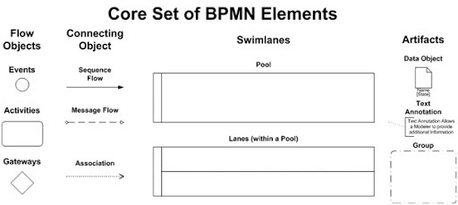

# BPMN 2.0 Tutorial and Examples

## BPMN 2.0 分解

为了创建一个 BPMN 2.0 图形，使用了一套核心元素集，被被分类为三个主要的组：

- 流对象（圆形, 矩形, 以及菱形，用于描述特定时间或活动）。包括事件、活动、网关，是BPMN中的核心元素
- 连接对象（与流对象连接以指定方向），包括顺序流、消息流、关联；
- 泳道（Swimlanes）（就像奥林匹克泳池里的泳道，它们将流对象组织进不同的领域），包括池和道两种类型。池子可能描述不同的部门或公司。
- 人工信息（Artifacts）：包括数据对象、组、注释。

泳道可以有多份以代表每一个参与方及其关联责任。在泳道之间，你可以找到任务和数据。不变地，一个业务的不同部分永远不会完全独立。

BPMN 2.0 帮助演示连接传递一个事情如何运作的清晰的观点，并且如何施加影响。另外，它帮助演示了数据和活动如何结合以完成一个流程。如此那么你拥有构成建模的以下方面：

- 事件 – 发送一个触发器以开始注入接收一个告警或者一个问题警告
- 活动 - 这些是执行的任务如循环吗，各种实例甚至子流程。
- 网关 – 一个点，再次路径可基于所作决策改变。方向可能朝向路径 A，或者基于一个不同的决策导致趋向路径 B。
- 顺序流 – 指向活动顺序。
- 消息流 – 消息趋向方向。
- 关联 – 活动，事件或网关类的文本
- 数据对象 – 解释了在活动继续之前什么数据是需要的
- 数据组 – 这些并不改变图的流向，但组成了活动组
- 注解 – 模型的额外解释Additional explanation of the model.
- 人工信息 – 这包括数据组和注解

### 深入网关类型

正如你可以预料到的，在　BPMN 2.0，有各种各样的网关。让我们如下来深入地看看：

- 独占地：分支只会在输出路径中的一个出现
- 包含地：依赖于所作决策流可以从一个和多个输出流转向。但是，在下一个网关，所有的流必须包含地结束。唯一的例外是一个活动或触发器不明确。
- 并行：这允许多个流无条件并行运行，但流必须在网关内终结，除非没有定义好的活动和触发器。
- 独占开始：当你通过多选项网关创建一个流程时
- 并行开始：当每个接续事件发生时一个流程可以开始
- 事件：网管将保持暂停直至一个输出流触发了一个事件
- 复杂性：一种罕见的网关仅用于代表复杂的场景－－同步和分割都是需要的。

### BPMN 2.0　建模原则

- 在开始之前，你想确保从开始到结束你的流程都是清晰定义的。检查以确保没有低效的地方
- 确保图形刚好适合你所使用的页面－－页面大小没有关系。当你布局顺序流时，水平放置它们。
- 处置防止数据流和关联
- 如果参与者在流程中有不同的角色，你能够创建不同的版本，这可能会产生更好的效果。

重要的是记住　BMPN 2.0 不是数据流图。

那么，遵守这些重要的原则：

1. 创建一个简单容易理解的流程
2. 使用 BPMN 标准
3. 需要时添加标记
4. 包含清晰的图表

# 理解 BPMN 图形和符号

## 什么是 BPMN 图形（BPMN Diagram）

一个 BPMN 图形图形使用这些符号和元素来来阐明一个工作流后面的逻辑如何从头至结束运行。例如计划一次旅行的路径选择；一个 BPMN 图形准确解释了通过工作流的每个活动信息。

## 什么是 BPMN 图形（BPMN Diagram）一些常用的符号

BPMN 图形有四类主要符号：流对象（flow objects），连接对象（Connecting Objects），泳道（Swimlanes）和数据。

## Reference

- [Camunda 官方快速入门教程（中文完整版）](https://blog.csdn.net/ztx114/article/details/123549773)
- [BPMN 2.0 Tutorial and Examples](https://www.processmaker.com/blog/bpmn-2-0-tutorial-and-examples/)
- [Understanding BPMN Diagrams and Symbols](https://www.processmaker.com/blog/bpmn-diagram-and-symbols/)
