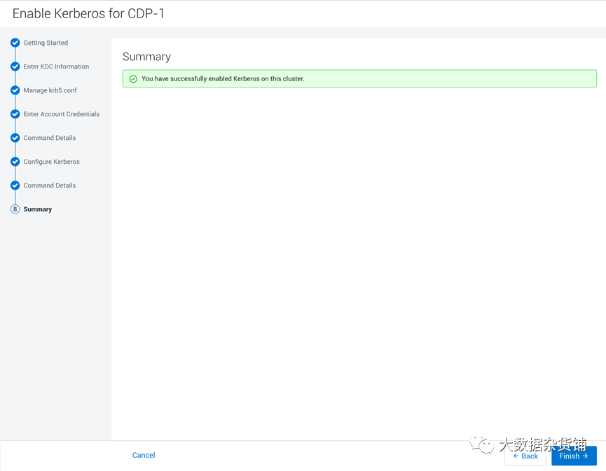

# 在 CDP 集群启用 Kerberos 手册

## 一. 文档编写目的

本文档讲述如何在 CDP 集群启用及配置 Kerberos，您将学习到以下知识：

- 如何安装及配置 KDC 服务
- 如何通过 CDP 启用 Kerberos
- 如何登录 Kerberos 并访问 Hadoop 相关服务

## 二. 文档内容

文档主要分为以下几步：

1. 安装及配置 KDC 服务
2. CDP 集群启用 Kerberos
3. Kerberos 使用

## 三. 假设前提

这篇文档将重点介绍如何在 CDP 集群启用及配置 Kerberos，并基于以下假设：

1. CDP 集群运行正常
2. 集群未启用 Kerberos
3. MySQL 5.1.73

## 四. 测试环境

以下是本次测试环境，但不是本操作手册的必需环境：

- 操作系统：CentOS 7.9
- CDP 版本为7.1.7.0
- CM 版本为7.4.4
- 采用 root 用户进行操作

## 五. Kerberos协议

Kerberos 协议主要用于计算机网络的身份鉴别(Authentication), 其特点是用户只需输入一次身份验证信息就可以凭借此验证获得的票据(ticket-granting ticket)访问多个服务，即 SSO(Single Sign On)。由于在每个 `Client` 和 `Service` 之间建立了共享密钥，使得该协议具有相当的安全性。

## 六. KDC 服务安装及配置

本文档中将 KDC 服务安装在 `Cloudera Manager Server` 所在[服务器](https://cloud.tencent.com/product/cvm?from=10680)上（KDC 服务可根据自己需要安装在其他服务器）

### 6.1 在 `Cloudera Manager` 服务器上安装 KDC 服务

```
[root@cdp-utility-1 ~]# yum -y install krb5-server krb5-libs krb5-auth-dialog krb5-workstation
```

#### 6.1.1 修改 `/etc/krb5.conf` 配置

```
[root@cdp-utility-1 ~]# vim etc/krb5.conf

# Configuration snippets may be placed in this directory as well
includedir etc/krb5.conf.d/

[logging]
default = FILE:/var/log/krb5libs.log
kdc = FILE:/var/log/krb5kdc.log
admin_server = FILE:/var/log/kadmind.log

[libdefaults]
dns_lookup_realm = false
ticket_lifetime = 24h
renew_lifetime = 7d
forwardable = true
rdns = true       ## 特别注意，默认是false
pkinit_anchors = FILE:/etc/pki/tls/certs/ca-bundle.crt
default_realm = ALIBABA.COM
# default_ccache_name = KEYRING:persistent:%{uid}  ## 特别注意，需要注释掉

[realms]
ALIBABA.COM = {
  kdc = cdp-utility-1.c-bd97232d18624d20
  admin_server = cdp-utility-1.c-bd97232d18624d20
}

[domain_realm]
.cdp-utility-1.c-bd97232d18624d20 = ALIBABA.COM
cdp-utility-1.c-bd97232d18624d20 = ALIBABA.COM
```

**说明**：

- **[logging]**：表示server端的日志的打印位置
- **[libdefaults]**：每种连接的默认配置，需要注意以下几个关键的小配置：
  + default_realm = ALIBABA.COM 默认的realm，必须跟要配置的realm的名称一致。
  + udp_preference_limit = 1 禁止使用udp可以防止一个Hadoop中的错误
  + ticket_lifetime 表明凭证生效的时限，一般为24小时。
  + renew_lifetime 表明凭证最长可以被延期的时限，一般为一个礼拜。当凭证过期之后，对安全认证的服务的后续访问则会失败。
- **[realms]**: 列举使用的realm
  + kdc：代表要kdc的位置。格式是 机器:端口
  + admin_server:代表admin的位置。格式是机器:端口
  + default_domain：代表默认的域名
- **[appdefaults]**: 可以设定一些针对特定应用的配置，覆盖默认配置

**标红部分为需要修改的信息**：


#### 6.1.2 修改 `/var/kerberos/krb5kdc/kadm5.acl` 配置

```
[root@cdp-utility-1 ~]# vim /var/kerberos/krb5kdc/kadm5.acl
*/admin@ALIBABA.COM    *
```

代表名称匹配 `*/admin@ALIBABA.COM` 都认为是 `admin`，权限是 `*`。代表全部权限。

### 6.1.3 修改 `/var/kerberos/krb5kdc/kdc.conf` 配置

```
[root@cdp-utility-1 ~]# vim var/kerberos/krb5kdc/kdc.conf

[kdcdefaults]
 kdc_ports = 88
 kdc_tcp_ports = 88

[realms]
ALIBABA.COM= {
  #master_key_type = aes256-cts
  max_renewable_life= 7d 0h 0m 0s
  acl_file = var/kerberos/krb5kdc/kadm5.acl
  dict_file = usr/share/dict/words
  admin_keytab = var/kerberos/krb5kdc/kadm5.keytab
  supported_enctypes = aes256-cts:normal aes128-cts:normal des3-hmac-sha1:normal arcfour-hmac:normal des-hmac-sha1:normal des-cbc-md5:normal des-cbc-crc:normal
}
```

**说明**：

- ALIBABA.COM: 是设定的 realms，名字随意。Kerberos 可以支持多个realms，会增加复杂度，本文不探讨。大小写敏感，一般为了识别使用全部大写。这个 realms 跟机器的 host 没有大关系。
- max_renewable_life = 7d 涉及到是否能进行 ticket 的 renew 必须配置。
- master_key_type:和supported_enctypes 默认使用 `aes256-cts`。由于 JAVA 使用 `aes256-cts` 验证方式需要安装额外的jar包(jce-policy)。
- acl_file: 标注了admin 的用户权限。文件格式是：
  + Kerberos_principal permissions [target_principal] [restrictions]支持通配符等。
  + admin_keytab:KDC 进行校验的 keytab。后文会提及如何创建。
- supported_enctypes: 支持的校验方式。

**标红部分为需要修改的配置**：


#### 6.1.4 创建Kerberos数据库

```
[root@cdp-utility-1 ~]# kdb5_util create –r ALIBABA.COM -s
Loading random data
Initializing database '/var/kerberos/krb5kdc/principal' for realm 'ALIBABA.COM',
master key name 'K/M@ALIBABA.COM'
You will be prompted for the database Master Password.
It is important that you NOT FORGET this password.
Enter KDC database master key:
Re-enter KDC database master key to verify:
[root@cdp-utility-1 ~]#
```

此处需要输入Kerberos数据库的密码。

- 其中，[-s]表示生成 `stash file`，并在其中存储 `master server key（krb5kdc）`；还可以用 `[-r]` 来指定一个 `realm name` —— 当 `krb5.conf` 中定义了多个 realm 时才是必要的。
- 保存路径为 `/var/kerberos/krb5kdc` 如果需要重建数据库，将该目录下的 `principal` 相关的文件删除即可
- 在此过程中，我们会输入 database 的管理密码。这里设置的密码一定要记住，如果忘记了，就无法管理 `Kerberos server`。

当 `Kerberos database` 创建好后，可以看到目录 `/var/kerberos/krb5kdc` 下生成了几个文件：

```
kadm5.acl
kdc.conf
principal
principal.kadm5
principal.kadm5.lock
principal.ok
```


#### 6.1.5 创建Kerberos的管理账号

```
[root@cdp-utility-1 ~]# kadmin.local
Authenticating as principal root/admin@ALIBABA.COM with password.
kadmin.local:  addprinc admin/admin@ALIBABA.COM
WARNING: no policy specified for admin/admin@ALIBABA.COM; defaulting to no policy
Enter password for principal "admin/admin@ALIBABA.COM":
Re-enter password for principal "admin/admin@ALIBABA.COM":
Principal "admin/admin@ALIBABA.COM" created.
kadmin.local:  exit
[root@cdp-utility-1 ~]#
```

#### 6.1.6 添加自服务并启动

将 Kerberos 服务添加到自启动服务，并启动 `krb5kdc` 和 `kadmin` 服务：

```
[root@cdp-utility-1 cloudera-scm-server]# systemctl enable kadmin
Created symlink from /etc/systemd/system/multi-user.target.wants/kadmin.service to /usr/lib/systemd/system/kadmin.service.
[root@cdp-utility-1 cloudera-scm-server]# systemctl enable krb5kdc
[root@cdp-utility-1 cloudera-scm-server]# systemctl restart krb5kdc
[root@cdp-utility-1 cloudera-scm-server]# systemctl restart kadmin
[root@cdp-utility-1 cloudera-scm-server]#
```

#### 6.1.7 测试 Kerberos 的管理员账号

```
[root@cdp-utility-1 ~]# kinit admin/admin@ALIBABA.COM
Password for admin/admin@ALIBABA.COM:
[root@cdp-utility-1 ~]# klist
Ticket cache: FILE:/tmp/krb5cc_0
Default principal: admin/admin@ALIBABA.COM


Valid starting       Expires              Service principal
2021-09-11T10:35:01  2021-09-12T10:35:01  krbtgt/ALIBABA.COM@ALIBABA.COM
  renew until 2021-09-18T10:35:01
[root@cdp-utility-1 ~]#
```

### 6.2 为集群安装所有 Kerberos 客户端，包括 `Cloudera Manager Server`

```
[root@cdp-master-1 ~]# yum -y install krb5-libs krb5-workstation
```

### 6.3 在 `Cloudera Manager Server` 服务器上安装额外的包

```
[root@cdp-utility-1 ~]# yum -y install openldap-clients
```

### 6.4 将 `KDC Server` 上的 `krb5.conf` 文件拷贝到所有 Kerberos 客户端

```
[root@cdp-utility-1 ~]# scp -r /etc/krb5.conf 192.168.2.26:/etc/krb5.conf
```

此处使用脚本进行拷贝：

```
[root@cdp-utility-1 ~]# for i in {26..29}; do scp -r /etc/krb5.conf 192.168.2.$i:/etc/krb5.conf ; done
krb5.conf                                  100%  705     2.2MB/s   00:00
krb5.conf                                  100%  705     1.6MB/s   00:00
krb5.conf                                  100%  705     2.0MB/s   00:00
krb5.conf                                  100%  705     2.0MB/s   00:00
[root@cdp-utility-1 ~]#
```

## 七. CDP 集群启用 Kerberos

### 7.1 在 KDC 中给 `Cloudera Manager` 添加管理员账号

```
[root@cdp-utility-1 ~]#  kadmin.local
Authenticating as principal admin/admin@ALIBABA.COM with password.
kadmin.local:   addprinc cloudera-scm/admin@ALIBABA.COM
WARNING: no policy specified for cloudera-scm/admin@ALIBABA.COM; defaulting to no policy
Enter password for principal "cloudera-scm/admin@ALIBABA.COM":
Re-enter password for principal "cloudera-scm/admin@ALIBABA.COM":
Principal "cloudera-scm/admin@ALIBABA.COM" created.
kadmin.local:
```

### 7.2 启用 Kerberos

#### 进入 `Cloudera Manager` 的“管理”-> “安全”界面


#### 在安全页面进入 `Status` 页面，然后点击 `Enable Kerberos`


#### 开始 KDC 配置


选择对应的KDC类型，我们这里使用的是MIT KDC，如果使用其他的 KDC 类型，请选择对应的类型。然后检查是否对应操作系统的客户端都已经安装完毕，如果没有部署客户端，请按
照指示部署完客户端，再复选完成上述所有步骤。

#### 输入 KDC 信息


#### krb5.conf 受管方式

点击继续，进行 `krb5.conf` 文件的受管方式和文件路径，推荐不复选，不使用 `Cloudera Manager` 来管理 `krb5.conf` 文件


#### 输入账号凭证

点击继续，进入到输入 KDC 账户凭证的页面，在页面中输入 `Cloudera Manager` 的 KDC 的管理员账号和密码信息


#### 导入账户凭证

点击下一步，导入KDC的账户凭证并进行验证，如果没有问题，则点击继续，有问题的话则回到之前的步骤进行问题修复。


### 7.3 配置 Kerberos

确认配置 Kerberos 客户端的信息和数据节点的端口号，以及启用 Kerberos 的 Principal。正常保持默认即可，也可以根据自己需求进行调整。然后点击继续


#### 启用 Kerberos 的命令执行

系统会自动停止集群，配置所有服务启用 Kerberos，生成凭据，部署客户端，并启用 `Cloudera Management` 服务和启动集群。


#### 待所有命令执行完成后，点击继续


#### 执行总结



#### 点击完成，进入到 `Cloudera Manager` 首页


#### 进入到管理→安全页面


可以看到 Kerberos 已经启用。

## 八. Kerberos使用

使用 `test` 用户运行 MapReduce 任务及操作 Hive，需要在集群所有节点创建 `test` 用户。

### 8.1 所有节点创建test用户

在所有节点上执行下面的命令创建test用户：

```
useradd -p `openssl passwd -1 -salt 'cloudera' cloudera` test
```

### 8.2 在 hdfs 中创建 `/user/test` 目录

使用 hdfs 用户在 hdfs 中创建 `/user/test` 目录，并将该目录的 owner 设置为 test 用户。

### 8.3 使用 hdfs 的 Principal 认证 KDC

切换到有 hdfs 角色的机器，进入到 `/var/run/cloudera-scm-agent/process/` 目录，找到 hdfs 的最新目录：

```
ls /var/run/cloudera-scm-agent/process/
```


进入到 hdfs 的最新目录：

```
cd var/run/cloudera-scm-agent/process/108-hdfs-DATANODE/
```


**使用 hdfs.keytab** 认证 kdc：

```
[root@cdp-core-1 108-hdfs-DATANODE]# kinit -kt hdfs.keytab hdfs/cdp-core-1.c-bd97232d18624d20@ALIBABA.COM
[root@cdp-core-1 108-hdfs-DATANODE]# klist
Ticket cache: FILE:/tmp/krb5cc_0
Default principal: hdfs/cdp-core-1.c-bd97232d18624d20@ALIBABA.COM

Valid starting       Expires              Service principal
2021-09-11T16:57:40  2021-09-12T16:57:40  krbtgt/ALIBABA.COM@ALIBABA.COM
renew until 2021-09-16T16:57:40
[root@cdp-core-1 108-hdfs-DATANODE]#
```


### 8.4 hdfs 创建 `/user/test` 目录

使用 hdfs 目录创建 `/user/test` 目录，并将 owner 修改为 test：

```
[root@cdp-core-1 108-hdfs-DATANODE]# hdfs dfs -mkdir /user/test
[root@cdp-core-1 108-hdfs-DATANODE]# hdfs dfs -chown -R test:hadoop /user/test
[root@cdp-core-1 108-hdfs-DATANODE]# hdfs dfs -ls /user
Found 8 items
drwxrwxrwx   - mapred hadoop              0 2021-09-07 23:08 /user/history
drwxrwxr-t   - hive   hive                0 2021-09-07 23:08 /user/hive
drwxrwxr-x   - hue    hue                 0 2021-09-07 23:10 /user/hue
drwx------   - livy   livy                0 2021-09-07 23:08 /user/livy
drwxr-x--x   - spark  spark               0 2021-09-07 23:06 /user/spark
drwxr-xr-x   - test   hadoop              0 2021-09-11 16:59 /user/test
drwxr-xr-x   - hdfs   supergroup          0 2021-09-07 23:05 /user/tez
drwxr-xr-x   - hdfs   supergroup          0 2021-09-07 23:07 /user/yarn
[root@cdp-core-1 108-hdfs-DATANODE]#
```


### 8.5 使用 kadmin 创建一个 test 的 principal

```
[root@cdp-utility-1 ~]# kadmin.local
Authenticating as principal admin/admin@ALIBABA.COM with password.
kadmin.local:  addprinc test@ALIBABA.COM
WARNING: no policy specified for test@ALIBABA.COM; defaulting to no policy
Enter password for principal "test@ALIBABA.COM":
Re-enter password for principal "test@ALIBABA.COM":
Principal "test@ALIBABA.COM" created.
kadmin.local:  quit
[root@cdp-utility-1 ~]#
```


### 8.6 使用 test 用户登录 Kerberos

```
[root@cdp-utility-1 ~]# kdestroy
[root@cdp-utility-1 ~]# klist
klist: No credentials cache found (filename: /tmp/krb5cc_0)
[root@cdp-utility-1 ~]# kinit test
Password for test@ALIBABA.COM:
[root@cdp-utility-1 ~]# klist
Ticket cache: FILE:/tmp/krb5cc_0
Default principal: test@ALIBABA.COM


Valid starting       Expires              Service principal
2021-09-11T16:45:35  2021-09-12T16:45:35  krbtgt/ALIBABA.COM@ALIBABA.COM
  renew until 2021-09-18T16:45:35
[root@cdp-utility-1 ~]#
```


### 8.7 运行 MapReduce 作业

```
[root@cdp-core-1 ~]# hadoop jar /opt/cloudera/parcels/CDH/jars/hadoop-mapreduce-examples-3.1.1.7.1.7.0-551.jar pi 10 2
WARNING: Use "yarn jar" to launch YARN applications.
……
  Shuffle Errors
    BAD_ID=0
    CONNECTION=0
    IO_ERROR=0
    WRONG_LENGTH=0
    WRONG_MAP=0
    WRONG_REDUCE=0
  File Input Format Counters
    Bytes Read=1180
  File Output Format Counters
    Bytes Written=97
Job Finished in 33.783 seconds
Estimated value of Pi is 3.80000000000000000000
[root@cdp-core-1 ~]#
```


### 8.8 使用 beeline 连接 hive 进行测试

```
[root@cdp-core-1 108-hdfs-DATANODE]# klist
Ticket cache: FILE:/tmp/krb5cc_0
Default principal: test@ALIBABA.COM


Valid starting       Expires              Service principal
2021-09-11T17:15:20  2021-09-12T17:15:20  krbtgt/ALIBABA.COM@ALIBABA.COM
  renew until 2021-09-18T17:15:20
[root@cdp-core-1 108-hdfs-DATANODE]# beeline
SLF4J: Class path contains multiple SLF4J bindings.
SLF4J: Found binding in [jar:file:/opt/cloudera/parcels/CDH-7.1.7-1.cdh7.1.7.p0.15945976/jars/log4j-slf4j-impl-2.13.3.jar!/org/slf4j/impl/StaticLoggerBinder.class]
……
Connecting to jdbc:hive2://cdp-core-1.c-bd97232d18624d20:2181,cdp-core-2.c-bd97232d18624d20:2181,cdp-core-3.c-bd97232d18624d20:2181/default;principal=hive/_HOST@ALIBABA.COM;serviceDiscoveryMode=zooKeeper;zooKeeperNamespace=hiveserver2
21/09/11 17:22:34 [main]: INFO jdbc.HiveConnection: Connected to cdp-utility-1.c-bd97232d18624d20:10000
Connected to: Apache Hive (version 3.1.3000.7.1.7.0-551)
Driver: Hive JDBC (version 3.1.3000.7.1.7.0-551)
Transaction isolation: TRANSACTION_REPEATABLE_READ
Beeline version 3.1.3000.7.1.7.0-551 by Apache Hive
```


```
0: jdbc:hive2://cdp-core-1.c-bd97232d18624d20> show tables;
……
INFO  : Completed executing command(queryId=hive_20210911172238_b23c8786-3222-4e98-a1a0-ae3a686f4921); Time taken: 0.047 seconds
INFO  : OK
+-----------+
| tab_name  |
+-----------+
| students  |
| test      |
+-----------+
2 rows selected (0.147 seconds)
```


```
0: jdbc:hive2://cdp-core-1.c-bd97232d18624d20> select * from students;
……
INFO  : Completed executing command(queryId=hive_20210911172245_24b3801a-468f-4a8c-8142-73235922af19); Time taken: 0.006 seconds
INFO  : OK
+------------------+---------------+---------------+
|  students.name   | students.age  | students.gpa  |
+------------------+---------------+---------------+
| fred flintstone  | 35            | 1.28          |
| barney rubble    | 32            | 2.32          |
+------------------+---------------+---------------+
2 rows selected (0.132 seconds)
```


```
0: jdbc:hive2://cdp-core-1.c-bd97232d18624d20> INSERT INTO TABLE students VALUES ('harry flintstone', 26, 1.15), ('john rubble', 37, 1.32);
INFO  : Compiling command(queryId=hive_20210911172328_1f699125-6b2c-4c66-80fe-389e8e9a3b0e): INSERT INTO TABLE students VALUES ('harry flintstone', 26, 1.15), ('john rubble', 37, 1.32)
……
----------------------------------------------------------------------------------------------
        VERTICES      MODE        STATUS  TOTAL  COMPLETED  RUNNING  PENDING  FAILED  KILLED
----------------------------------------------------------------------------------------------
Map 1 .......... container     SUCCEEDED      1          1        0        0       0       0
Reducer 2 ...... container     SUCCEEDED      1          1        0        0       0       0  0/warehouse/tablespace/managed/hive/students
----------------------------------------------------------------------------------------------
VERTICES: 02/02  [==========================>>] 100%  ELAPSED TIME: 5.09 s
----------------------------------------------------------------------------------------------
2 rows affected (5.737 seconds
```


```
0: jdbc:hive2://cdp-core-1.c-bd97232d18624d20> select * from students;
INFO  : Compiling command(queryId=hive_20210911172347_1efcac40-8a27-44ea-9dda-e3720cf419fc): select * from students
……
INFO  : Completed executing command(queryId=hive_20210911172347_1efcac40-8a27-44ea-9dda-e3720cf419fc); Time taken: 0.007 seconds
INFO  : OK
+-------------------+---------------+---------------+
|   students.name   | students.age  | students.gpa  |
+-------------------+---------------+---------------+
| fred flintstone   | 35            | 1.28          |
| barney rubble     | 32            | 2.32          |
| harry flintstone  | 26            | 1.15          |
| john rubble       | 37            | 1.32          |
+-------------------+---------------+---------------+
4 rows selected (0.129 seconds)
0: jdbc:hive2://cdp-core-1.c-bd97232d18624d20>
```

## 九. 常见问题

### 9.1 使用 Kerberos 用户身份运行 MapReduce 作业报错

```
[root@cdp-utility-1 ~]# hadoop jar /opt/cloudera/parcels/CDH/jars/hadoop-mapreduce-examples-3.1.1.7.1.7.0-551.jar pi 10 2
WARNING: Use "yarn jar" to launch YARN applications.
Number of Maps  = 10
Samples per Map = 2
org.apache.hadoop.security.AccessControlException: Permission denied: user=admin, access=WRITE, inode="/user":hdfs:supergroup:drwxr-xr-x
at org.apache.hadoop.hdfs.server.namenode.FSPermissionChecker.check(FSPermissionChecker.java:553)
at org.apache.hadoop.hdfs.server.namenode.FSPermissionChecker.checkPermission(FSPermissionChecker.java:393)
at org.apache.hadoop.hdfs.server.namenode.FSPermissionChecker.checkPermissionWithContext(FSPermissionChecker.java:417)
at org.apache.hadoop.hdfs.server.namenode.FSPermissionChecker.checkPermission(FSPermissionChecker.java:296)
at org.apache.hadoop.hdfs.server.namenode.FSDirectory.checkPermission(FSDirectory.java:1951)
at org.apache.hadoop.hdfs.server.namenode.FSDirectory.checkPermission(FSDirectory.java:1932)
at org.apache.hadoop.hdfs.server.namenode.FSDirectory.checkAncestorAccess(FSDirectory.java:1891)
at org.apache.hadoop.hdfs.server.namenode.FSDirMkdirOp.mkdirs(FSDirMkdirOp.java:60)
at org.apache.hadoop.hdfs.server.namenode.FSNamesystem.mkdirs(FSNamesystem.java:3290)
at org.apache.hadoop.hdfs.server.namenode.NameNodeRpcServer.mkdirs(NameNodeRpcServer.java:1125)
at org.apache.hadoop.hdfs.protocolPB.ClientNamenodeProtocolServerSideTranslatorPB.mkdirs(ClientNamenodeProtocolServerSideTranslatorPB.java:735)
at org.apache.hadoop.hdfs.protocol.proto.ClientNamenodeProtocolProtos$ClientNamenodeProtocol$2.callBlockingMethod(ClientNamenodeProtocolProtos.java)
at org.apache.hadoop.ipc.ProtobufRpcEngine$Server$ProtoBufRpcInvoker.call(ProtobufRpcEngine.java:533)
at org.apache.hadoop.ipc.RPC$Server.call(RPC.java:1070)
at org.apache.hadoop.ipc.Server$RpcCall.run(Server.java:989)
at org.apache.hadoop.ipc.Server$RpcCall.run(Server.java:917)
at java.security.AccessController.doPrivileged(Native Method)
at javax.security.auth.Subject.doAs(Subject.java:422)
at org.apache.hadoop.security.UserGroupInformation.doAs(UserGroupInformation.java:1898)
at org.apache.hadoop.ipc.Server$Handler.run(Server.java:2894)

at sun.reflect.NativeConstructorAccessorImpl.newInstance0(Native Method)
at sun.reflect.NativeConstructorAccessorImpl.newInstance(NativeConstructorAccessorImpl.java:62)
at sun.reflect.DelegatingConstructorAccessorImpl.newInstance(DelegatingConstructorAccessorImpl.java:45)
at java.lang.reflect.Constructor.newInstance(Constructor.java:423)
at org.apache.hadoop.ipc.RemoteException.instantiateException(RemoteException.java:121)
at org.apache.hadoop.ipc.RemoteException.unwrapRemoteException(RemoteException.java:88)
at org.apache.hadoop.hdfs.DFSClient.primitiveMkdir(DFSClient.java:2481)
at org.apache.hadoop.hdfs.DFSClient.mkdirs(DFSClient.java:2455)
at org.apache.hadoop.hdfs.DistributedFileSystem$27.doCall(DistributedFileSystem.java:1477)
at org.apache.hadoop.hdfs.DistributedFileSystem$27.doCall(DistributedFileSystem.java:1474)
at org.apache.hadoop.fs.FileSystemLinkResolver.resolve(FileSystemLinkResolver.java:81)
at org.apache.hadoop.hdfs.DistributedFileSystem.mkdirsInternal(DistributedFileSystem.java:1491)
at org.apache.hadoop.hdfs.DistributedFileSystem.mkdirs(DistributedFileSystem.java:1466)
at org.apache.hadoop.fs.FileSystem.mkdirs(FileSystem.java:2391)
at org.apache.hadoop.examples.QuasiMonteCarlo.estimatePi(QuasiMonteCarlo.java:283)
at org.apache.hadoop.examples.QuasiMonteCarlo.run(QuasiMonteCarlo.java:360)
at org.apache.hadoop.util.ToolRunner.run(ToolRunner.java:76)
at org.apache.hadoop.examples.QuasiMonteCarlo.main(QuasiMonteCarlo.java:368)
at sun.reflect.NativeMethodAccessorImpl.invoke0(Native Method)
at sun.reflect.NativeMethodAccessorImpl.invoke(NativeMethodAccessorImpl.java:62)
at sun.reflect.DelegatingMethodAccessorImpl.invoke(DelegatingMethodAccessorImpl.java:43)
at java.lang.reflect.Method.invoke(Method.java:498)
at org.apache.hadoop.util.ProgramDriver$ProgramDescription.invoke(ProgramDriver.java:71)
at org.apache.hadoop.util.ProgramDriver.run(ProgramDriver.java:144)
at org.apache.hadoop.examples.ExampleDriver.main(ExampleDriver.java:74)
at sun.reflect.NativeMethodAccessorImpl.invoke0(Native Method)
at sun.reflect.NativeMethodAccessorImpl.invoke(NativeMethodAccessorImpl.java:62)
at sun.reflect.DelegatingMethodAccessorImpl.invoke(DelegatingMethodAccessorImpl.java:43)
at java.lang.reflect.Method.invoke(Method.java:498)
at org.apache.hadoop.util.RunJar.run(RunJar.java:318)
at org.apache.hadoop.util.RunJar.main(RunJar.java:232)
Caused by: org.apache.hadoop.ipc.RemoteException(org.apache.hadoop.security.AccessControlException): Permission denied: user=admin, access=WRITE, inode="/user":hdfs:supergroup:drwxr-xr-x
```


问题原因：KDC 认证的用户没有 hdfs 的 /user 目录的权限
解决方法：使用 hdfs 用户在 hdfs 的 /user 下创建对应用户的目录，并将 owner 设置为该用户，参考4.2章节。

### 9.2 GSS initiate failed，找不到TGT

```
[root@cdswdemo-1 ~]# hdfs dfs -ls /
18/03/26 17:54:25 WARN security.UserGroupInformation: PriviledgedActionException as:root (auth:KERBEROS) cause:javax.security.sasl.SaslException: GSS initiate failed [Caused by GSSException: No valid credentials provided (Mechanism level: Failed to find any Kerberos tgt)]
18/03/26 17:54:25 WARN ipc.Client: Exception encountered while connecting to the server : javax.security.sasl.SaslException: GSS initiate failed [Caused by GSSException: No valid credentials provided (Mechanism level: Failed to find any Kerberos tgt)]
18/03/26 17:54:25 WARN security.UserGroupInformation: PriviledgedActionException as:root (auth:KERBEROS) cause:java.io.IOException: javax.security.sasl.SaslException: GSS initiate failed [Caused by GSSException: No valid credentials provided (Mechanism level: Failed to find any Kerberos tgt)]
ls: Failed on local exception: java.io.IOException: javax.security.sasl.SaslException: GSS initiate failed [Caused by GSSException: No valid credentials provided (Mechanism level: Failed to find any Kerberos tgt)]; Host Details : local host is: "cdswdemo-1.gce.cloudera.com/172.31.112.15"; destination host is: "cdswdemo-1.gce.cloudera.com":8020;
[root@cdswdemo-1 ~]
```

问题原因：Kerberos 某个版本的 bug
解决方案：如果配置都正确的话，也可以正常获取到 TGT，则检查一下 `/etc/krb5.conf` 文件，注释掉下面这句，这是 kerberos 的某个版本的 bug

```
# default_ccache_name = KEYRING:persistent:%{uid}
```

不建议客户使用该参数

### 9.3 KrbException: Server not found in Kerberos database (7) -LOOKING_UP_SERVER

```
KrbException: Server not found in Kerberos database (7) - LOOKING_UP_SERVER
at sun.security.krb5.KrbTgsRep.<init>(KrbTgsRep.java:73)
at sun.security.krb5.KrbTgsReq.getReply(KrbTgsReq.java:192)
at sun.security.krb5.KrbTgsReq.sendAndGetCreds(KrbTgsReq.java:203)
at sun.security.krb5.internal.CredentialsUtil.serviceCreds(CredentialsUtil.java:309)
at sun.security.krb5.internal.CredentialsUtil.acquireServiceCreds(CredentialsUtil.java:115)
at sun.security.krb5.Credentials.acquireServiceCreds(Credentials.java:454)
at sun.security.jgss.krb5.Krb5Context.initSecContext(Krb5Context.java:641)
at sun.security.jgss.GSSContextImpl.initSecContext(GSSContextImpl.java:248)
at sun.security.jgss.GSSContextImpl.initSecContext(GSSContextImpl.java:179)
at com.sun.security.sasl.gsskerb.GssKrb5Client.evaluateChallenge(GssKrb5Client.java:193)
at org.apache.thrift.transport.TSaslClientTransport.handleSaslStartMessage(TSaslClientTransport.java:94)
at org.apache.thrift.transport.TSaslTransport.open(TSaslTransport.java:271)
at org.apache.thrift.transport.TSaslClientTransport.open(TSaslClientTransport.java:37)
at org.apache.hadoop.hive.thrift.client.TUGIAssumingTransport$1.run(TUGIAssumingTransport.java:52)
at org.apache.hadoop.hive.thrift.client.TUGIAssumingTransport$1.run(TUGIAssumingTransport.java:49)
at java.security.AccessController.doPrivileged(Native Method)
at javax.security.auth.Subject.doAs(Subject.java:415)
at org.apache.hadoop.security.UserGroupInformation.doAs(UserGroupInformation.java:1917)
at org.apache.hadoop.hive.thrift.client.TUGIAssumingTransport.open(TUGIAssumingTransport.java:49)
at org.apache.hive.jdbc.HiveConnection.openTransport(HiveConnection.java:204)
at org.apache.hive.jdbc.HiveConnection.<init>(HiveConnection.java:169)
at org.apache.hive.jdbc.HiveDriver.connect(HiveDriver.java:105)
at java.sql.DriverManager.getConnection(DriverManager.java:571)
at java.sql.DriverManager.getConnection(DriverManager.java:187)
at org.apache.hive.beeline.DatabaseConnection.connect(DatabaseConnection.java:146)
at org.apache.hive.beeline.DatabaseConnection.getConnection(DatabaseConnection.java:211)
at org.apache.hive.beeline.Commands.connect(Commands.java:1526)
at org.apache.hive.beeline.Commands.connect(Commands.java:1421)
at sun.reflect.NativeMethodAccessorImpl.invoke0(Native Method)
at sun.reflect.NativeMethodAccessorImpl.invoke(NativeMethodAccessorImpl.java:57)
at sun.reflect.DelegatingMethodAccessorImpl.invoke(DelegatingMethodAccessorImpl.java:43)
at java.lang.reflect.Method.invoke(Method.java:606)
at org.apache.hive.beeline.ReflectiveCommandHandler.execute(ReflectiveCommandHandler.java:52)
at org.apache.hive.beeline.BeeLine.execCommandWithPrefix(BeeLine.java:1135)
at org.apache.hive.beeline.BeeLine.dispatch(BeeLine.java:1174)
at org.apache.hive.beeline.BeeLine.execute(BeeLine.java:1010)
at org.apache.hive.beeline.BeeLine.begin(BeeLine.java:922)
at org.apache.hive.beeline.BeeLine.mainWithInputRedirection(BeeLine.java:518)
at org.apache.hive.beeline.BeeLine.main(BeeLine.java:501)
at sun.reflect.NativeMethodAccessorImpl.invoke0(Native Method)
at sun.reflect.NativeMethodAccessorImpl.invoke(NativeMethodAccessorImpl.java:57)
at sun.reflect.DelegatingMethodAccessorImpl.invoke(DelegatingMethodAccessorImpl.java:43)
at java.lang.reflect.Method.invoke(Method.java:606)
at org.apache.hadoop.util.RunJar.run(RunJar.java:221)
at org.apache.hadoop.util.RunJar.main(RunJar.java:136)
Caused by: KrbException: Identifier doesn't match expected value (906)
at sun.security.krb5.internal.KDCRep.init(KDCRep.java:143)
at sun.security.krb5.internal.TGSRep.init(TGSRep.java:66)
at sun.security.krb5.internal.TGSRep.<init>(TGSRep.java:61)
at sun.security.krb5.KrbTgsRep.<init>(KrbTgsRep.java:55)
... 44 more
```

问题原因：连接使用的是 IP 地址，而不是 hostname
解决方案：将连接修改成 `hostname`

```
!connect jdbc:hive2://172.31.112.15:10000/;principal=hive/172.31.112.15@ALIBABA.COM
```

修改为：

```
!connect jdbc:hive2://172.31.112.15:10000/;principal=hive/cdswdemo-1.gce.cloudera.com@ALIBABA.COM
```

## Reference

- [在 CDP 集群启用 Kerberos 手册](https://www.modb.pro/db/115753)
- [在 CDP 集群启用 Kerberos 手册](https://cloud.tencent.com/developer/article/1886263)
