# Get started with Camunda

## 1. Camunda 快速入门 (Java / JS)

本教程将指导您使用 Camunda 平台建模并实现您的第一个工作流程。在这个指南上，你将会选择使用 Java 或 JavaScript (NodeJS) Camunda 平台方便易用的客户端来实现可执行流程。

### 1.1 下载和安装

首先，你需要安装 `Camunda Platform` 和 `Camunda Modeler`。

在下面的章节里，我们将描述如何在你的本地机器上安装 `Camunda Platform`。

> 注意：如果愿意，你也可以通过 `Docker` 来运行 `Camunda Platform`：
```
docker pull camunda/camunda-bpm-platform:run-latest
docker run -d --name camunda -p 8080:8080 camunda/camunda-bpm-platform:run-latest
```
> 稍后。我们将看到[安装 Camunda Modeler](https://docs.camunda.org/get-started/quick-start/install/#camunda-modeler)。

#### 前提

请确保你已经安装了以下软件：

+ Java Runtime Environment 1.8+

你可以使用你的终端, shell, 或者命令行来验证这个：

```
java -version
```

如果你需要安装 JRE，请参考[从Oracle找到下载链接](https://www.oracle.com/technetwork/java/javase/downloads/index.html)。

#### [Camunda 平台](https://docs.camunda.org/get-started/quick-start/install/#camunda-platform)

首先，下载一个 `Camunda Platform` 发布。你可以为[不同的应用服务器](https://docs.camunda.org/manual/latest/installation/full/)从不同的发布中选择。在这个教程中，我们将使用 `Camunda Platform Run`。从[下载页面](https://camunda.com/download/)下载它。

下载发布之后，在你选择的一个目录里解压它。

在你成功解压 `Camunda Platform` 发布之后，执行脚本 `start.bat` (对 `Windows` 用户) 或者 `start.sh` (对 `Unix` 用户)。

这个脚本将启动应用服务器。打开你的浏览器并导航到 `http://localhost:8080/` 以访问欢迎页面。

#### [Camunda Modeler](https://docs.camunda.org/get-started/quick-start/install/#camunda-modeler)

从这个[下载链接](https://camunda.com/download/modeler/)下载 `Camunda Modeler`。

下载 `Modeler` 之后，在你选择的一个目录里解压它。

在你成功解压 `Camunda Modeler` 发布之后，执行脚本 `camunda-modeler.exe` (对 `Windows` 用户)，`camunda-modeler.app` (对 `Mac` 用户) 或者 `camunda-modeler.sh ` (对 `Unix` 用户)。

### 1.2 可执行流程

在这一节，你将学会如何利用 `Camunda Modeler` 创建你的第一个 `BPMN 2.0` 流程，以及如何执行自动化步骤。让我们从打开 `Camunda Modeler` 开始。

#### 1.2.1 [创建一个新的 BPMN 图形](https://docs.camunda.org/get-started/quick-start/service-task/#create-a-new-bpmn-diagram)

通过点击 `File > New File > BPMN Diagram (Camunda Platform)` 来创建一个新的 BPMN 图形。

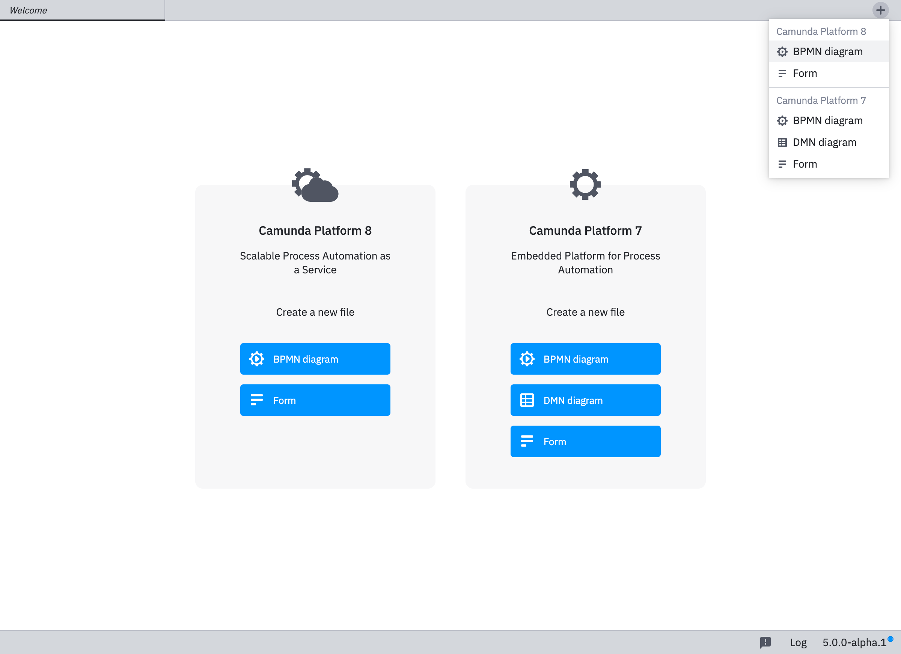

#### 1.2.2 开始一个简单流程

从建模一个简单流程开始。

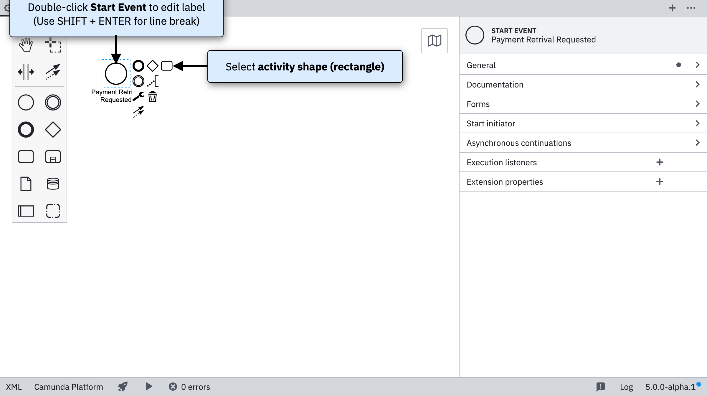

在 `Start Event` 上双击。一个文本框将会出现。将 `Start Event` 命名为 `“Payment Retrieval Requested”`。

> 提示：当你编辑标签时，你可以使用 `Shift + Enter` 添加换行符。

点击开始事件，从其上下文菜单，选中活动（activity）形状（圆角矩形）。它将被自动放在画布上，你可以将它拖曳到你喜欢的位置，将其命名为 `Charge Credit Card`。通过点击活动图形使用扳手按钮将活动类型修改为服务任务（`Service Task`）。

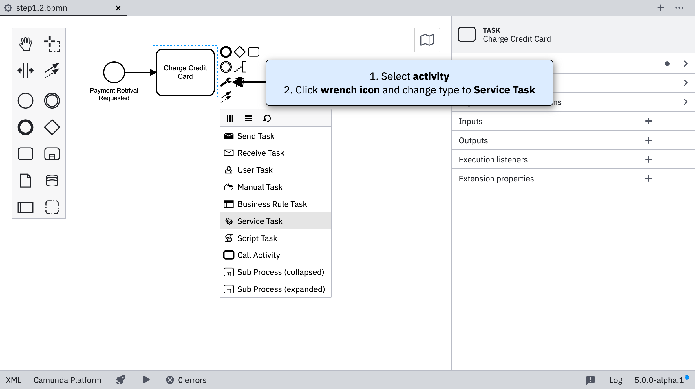

添加一个结束事件（`End Event`）命名为 `Payment Received`。

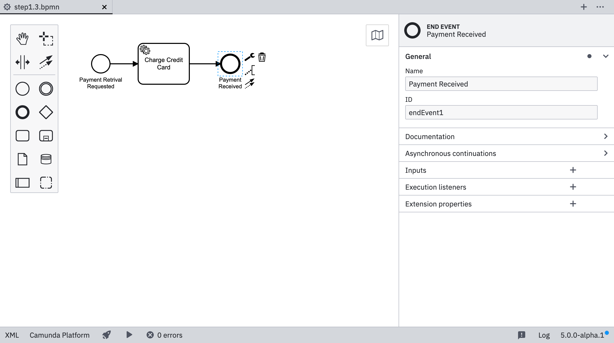

#### 1.2.3 [配置一个服务任务](https://docs.camunda.org/get-started/quick-start/service-task/#configure-the-service-task)

有不同的方式使用 `Camunda Platform` 来执行[服务任务](https://docs.camunda.org/manual/latest/reference/bpmn20/tasks/service-task/)。在这个指南中，我们将使用[外部任务模式](https://docs.camunda.org/manual/latest/user-guide/process-engine/external-tasks/)。在 `Camunda Modeler` 里打开属性面板，点击你刚创建的服务任务。修改其实现为 `External` 并采用 `charge-card` 为标题。

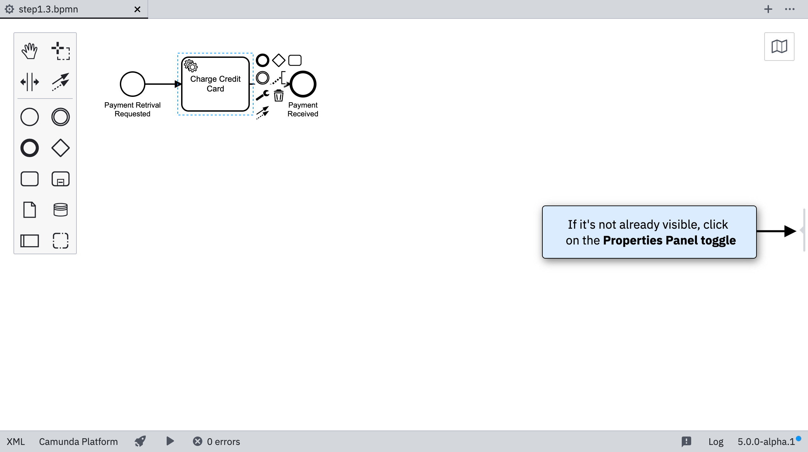

#### 1.2.4 [配置执行属性](https://docs.camunda.org/get-started/quick-start/service-task/#configure-properties-for-execution)

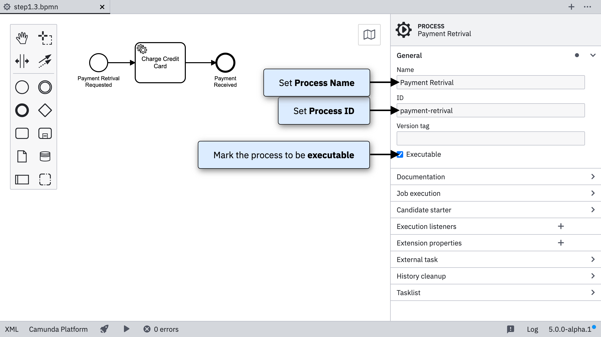

因为我们正在对一个可执行流程建模，我们应该给它一个 `ID`，并设置 `isExecutable` 属性为 `true`。在画布的右手边，你可找到属性面板。当你在建模画布的空白处点击时，属性面板将显示流程自身的属性。

首先，为流程配置一个 `ID`。在属性字段 `Id` 输入 `payment-retrieval`。属性 `ID` 被流程引擎是为可执行流程的标识符，最佳实践时将其设为一个对人易读的名字。

其次，配置流程名。在属性字段 `Name` 输入 `Payment Retrieval`。

最好，确保紧挨这可执行属性的选择框是选中的。如果你不选中它，流程定义将会被流程引擎忽略。

#### 1.2.5 [保存 BPMN 图形](https://docs.camunda.org/get-started/quick-start/service-task/#save-the-bpmn-diagram)

当你完成后，点击 `File > Save File As...` 来保存你的修改。当对话框出现时，导航到你选中的目录并将图形存储为 `payment.bpmn`。

#### 1.2.6 [实现一个外部任务工作者](https://docs.camunda.org/get-started/quick-start/service-task/#implement-an-external-task-worker)

建模流程之后，我们期待执行一些业务逻辑。

`Camunda Platform` 被构建为可以基于不同的语言来实现你的业务逻辑。你可以选择最合适你的项目的语言。

在这个快速入门中，我们将为你介绍 `Camunda` 容易上手的客户端：

+ [Java](https://docs.camunda.org/get-started/quick-start/service-task/#a-using-java)
+ [JavaScript (NodeJS)](https://docs.camunda.org/get-started/quick-start/service-task/#b-using-javascript-nodejs)

##### 0) 前提

确保你安装了以下工具：

- JDK 1.8
- 一个 Java IDE (例如 Eclipse)

##### 1) 创建一个新的 `Maven` 项目

让我们从 IDE 创建一个新的 `Maven` 项目开始。

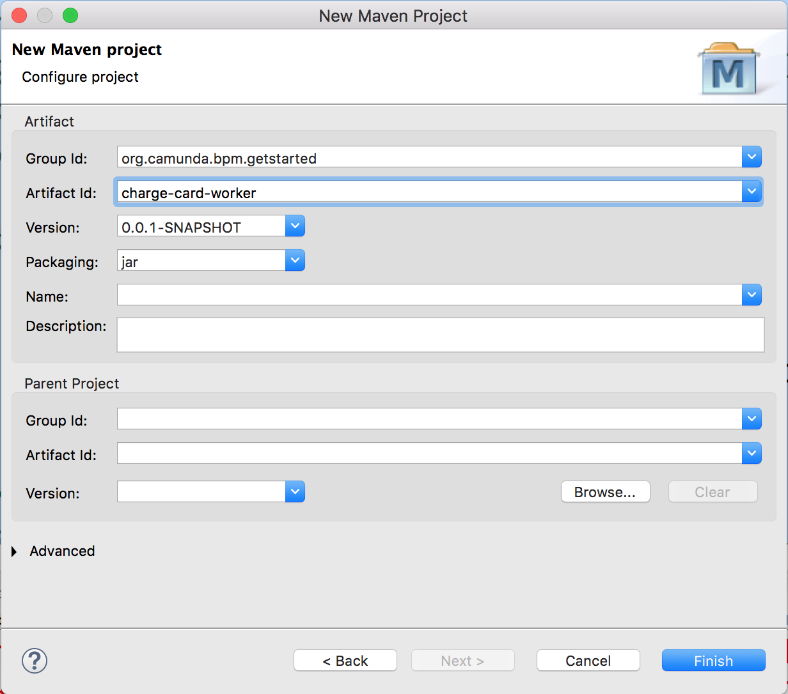

##### 2) 添加 `Camunda` 外部任务依赖

下一步包括为你新的流程应用设置外部任务客户端 Maven 依赖。你的项目 `pom.xml` 应该看起来像这样：

```
<project xmlns="http://maven.apache.org/POM/4.0.0" xmlns:xsi="http://www.w3.org/2001/XMLSchema-instance"
	xsi:schemaLocation="http://maven.apache.org/POM/4.0.0 http://maven.apache.org/xsd/maven-4.0.0.xsd">
	<modelVersion>4.0.0</modelVersion>

	<groupId>org.camunda.bpm.getstarted</groupId>
	<artifactId>charge-card-worker</artifactId>
	<version>0.0.1-SNAPSHOT</version>

	<properties>
		<camunda.external-task-client.version>7.17.0</camunda.external-task-client.version>
		<maven.compiler.source>1.8</maven.compiler.source>
		<maven.compiler.target>1.8</maven.compiler.target>
	</properties>

	<dependencies>
		<dependency>
			<groupId>org.camunda.bpm</groupId>
			<artifactId>camunda-external-task-client</artifactId>
			<version>${camunda.external-task-client.version}</version>
		</dependency>
		<dependency>
			<groupId>org.slf4j</groupId>
			<artifactId>slf4j-simple</artifactId>
			<version>1.6.1</version>
		</dependency>
		<dependency>
			<groupId>javax.xml.bind</groupId>
			<artifactId>jaxb-api</artifactId>
			<version>2.3.1</version>
		</dependency>
	</dependencies>
</project>
```

##### 3) 添加 Java 类

接下来，我们将创建一个新的 `ExternalTaskClient`，它订阅了 `charge-card` 主题。

当流程引擎碰到了一个服务任务配置为外部处理，他将创建一个外部任务实例，我们的处理器将会针对这个实例工作。我们将在 `ExternalTaskClient` 里使用[长轮询](https://docs.camunda.org/manual/latest/user-guide/process-engine/external-tasks/#long-polling-to-fetch-and-lock-external-tasks) 使通信效率更高。

接下来，我们将创建一个包，例如 `org.camunda.bpm.getstarted.chargecard`，并添加一个 Java 类，例如 `ChargeCardWorker`。

```
package org.camunda.bpm.getstarted.chargecard;

import java.util.logging.Logger;
import java.awt.Desktop;
import java.net.URI;

import org.camunda.bpm.client.ExternalTaskClient;

public class ChargeCardWorker {
  private final static Logger LOGGER = Logger.getLogger(ChargeCardWorker.class.getName());

  public static void main(String[] args) {
    ExternalTaskClient client = ExternalTaskClient.create()
        .baseUrl("http://localhost:8080/engine-rest")
        .asyncResponseTimeout(10000) // long polling timeout
        .build();

    // subscribe to an external task topic as specified in the process
    client.subscribe("charge-card")
        .lockDuration(1000) // the default lock duration is 20 seconds, but you can override this
        .handler((externalTask, externalTaskService) -> {
          // Put your business logic here

          // Get a process variable
          String item = externalTask.getVariable("item");
          Integer amount = externalTask.getVariable("amount");

          LOGGER.info("Charging credit card with an amount of '" + amount + "'€ for the item '" + item + "'...");

          try {
              Desktop.getDesktop().browse(new URI("https://docs.camunda.org/get-started/quick-start/complete"));
          } catch (Exception e) {
              e.printStackTrace();
          }

          // Complete the task
          externalTaskService.complete(externalTask);
        })
        .open();
  }
}
```

##### 4) 运行工作者

你可以通过点击类 `ChargeCardWorker` 选择 `Run as Java` 来运行你的 Java 程序。

注意：注意这个工作者将在这个快速指南的整个过程中保持运行。

### 1.3 部署流程

下一步，你将部署一个流程并开始一个新的实例，如此你就可以看看你的简单流程是否工作正常。

> 部署支持：BPMN 图形必须是为它即将部署的流程引擎创建的。你不能在 `Camunda Cloud` 运行为 `Camunda Platform` 建模的 BPMN 图形，或者相反。

#### 1.3.1 [使用 Camunda Modeler 部署流程](https://docs.camunda.org/get-started/quick-start/deploy/#use-the-camunda-modeler-to-deploy-the-process)

为了部署流程，在 `Camunda Modeler` 中点击部署按钮，然后给定部署名 `“Payment Retrieval”` 并点击部署按钮。从版本 `3.0.0` 开始，你被要求在部署细节中的端点配置提供一个 URL。这可以是这个 `REST API` 的根端点（例如 http://localhost:8080/engine-rest ），或者一个适合部署创建方法的精确端点（如 http://localhost:8080/engine-rest/deployment/create）。

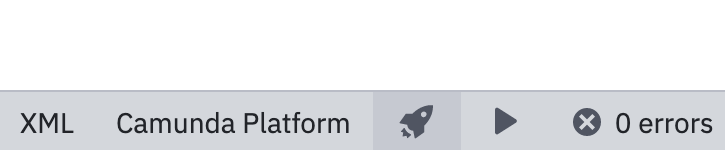

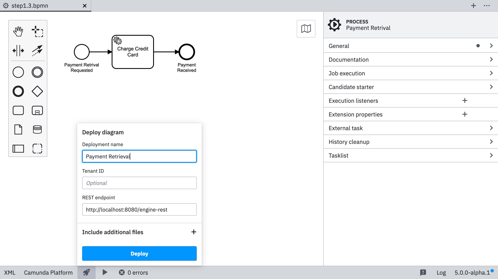

你应该在 `Camunda Modeler` 里看到一条成功的消息。

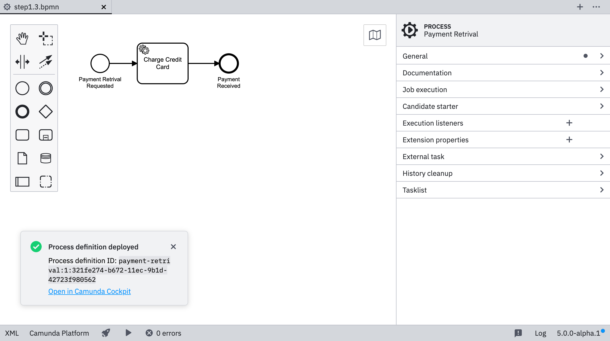

关于更多在 Camunda Modeler 部署的细节请参看[这里](https://blog.camunda.com/post/2019/01/camunda-modeler-3.0.0-0-released/?__hstc=12929896.c4aa629522d594361168db2b707e121f.1662537055065.1662963507111.1663026825002.5&__hssc=12929896.16.1663026825002&__hsfp=389442867#completely-reworked-deployment-tool)。对 `Camunda Modeler 2.2.4` 及更早版本，请参看[这个博文](https://blog.camunda.com/post/2018/03/camunda-modeler-1120-alpha-3-released/?__hstc=12929896.c4aa629522d594361168db2b707e121f.1662537055065.1662963507111.1663026825002.5&__hssc=12929896.16.1663026825002&__hsfp=389442867)。

#### 1.3.2 [利用驾驶舱验证部署](https://docs.camunda.org/get-started/quick-start/deploy/#verify-the-deployment-with-cockpit)

接下来，利用驾驶舱验证是否成功部署。导航到 `http://localhost:8080/camunda/app/cockpit/`，以安全凭证 `demo/demo` 登录，你的流程 `Payment Retrieval` 应该在 `dashboard` 上可见。

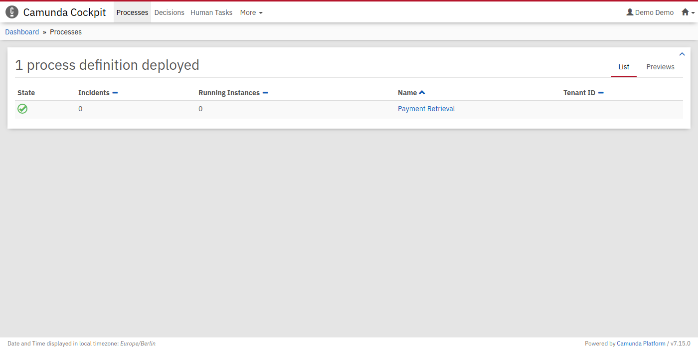

#### 1.3.3 [开启一个流程实例](https://docs.camunda.org/get-started/quick-start/deploy/#start-a-process-instance)

在 Camunda 中，有许多方法来开启一个新的流程实例。你可以利用 `Camunda REST API` 通过发送一个 `POST` 请求来开启一个新的流程实例。

##### a) [curl](https://docs.camunda.org/get-started/quick-start/deploy/#a-curl)

```
curl -H "Content-Type: application/json" -X POST -d '{"variables": {"amount": {"value":555,"type":"integer"}, "item": {"value":"item-xyz"} } }' http://localhost:8080/engine-rest/process-definition/key/payment-retrieval/start
```

在你的工作者中，你现在应该能够在终端上看到输出。这证明了你已经成功地开启并执行了你的第一个简单流程。

##### b) [REST Client](https://docs.camunda.org/get-started/quick-start/deploy/#b-rest-client)

如果你不喜欢使用 `curl` 来发送 `REST` 请求，你可以使用任何 `REST` 客户端。

向这个端点 http://localhost:8080/engine-rest/process-definition/key/payment-retrieval/start 发送一个 POST 请求：

JSON 载荷看起来像这样：

```
{
	"variables": {
		"amount": {
			"value":555,
			"type":"integer"
		},
		"item": {
			"value": "item-xyz"
		}
	}
}
```

> 提示：确保你的请求头中 Content-Type 已被正确设置为 application/json。

这个请求在 `Postman` 上看起来像这样：

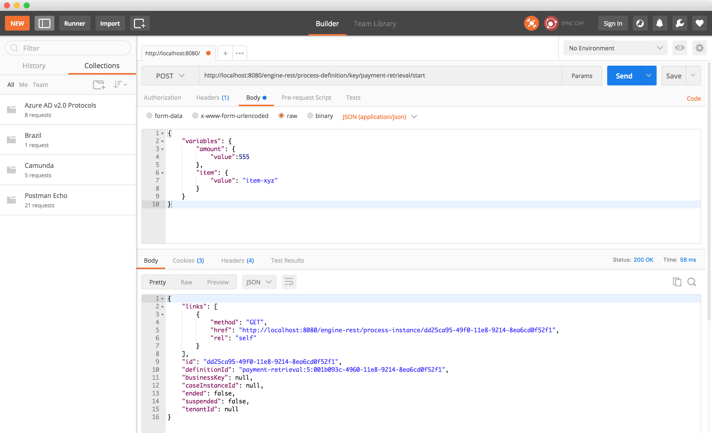

在你的工作者（我们在上面的章节启动的）终端上，你应该能看到输出。这证明了你已经成功地开启并执行了你的第一个简单流程。

### 1.4 添加人工任务

在这一节，你将学会如何使用 `BPMN 2.0` 人工任务在你的流程中引入人工服务。

#### 1.4.1 [添加人工任务](https://docs.camunda.org/get-started/quick-start/user-task/#add-a-user-task)

我们想修改我们的流程以方便我们引入人工。

为了实现这个，在 `Camunda Modeler` 中打开流程。

从 `Modeler` 左手边菜单里选择 `create/remove space` 工具（`<||>`），并使用它在 `Start Event` 和 `“Charge Credit Card”` 服务任务之间创建空间（点击并拖曳鼠标到右边）。

接下来，从 `Modeler` 左手边菜单里选择活动形状（圆角矩形）并将其拖曳到 `Start Event` 和 `“Charge Credit Card”` 服务任务之间位置。将其命名为 `Approve Payment`。

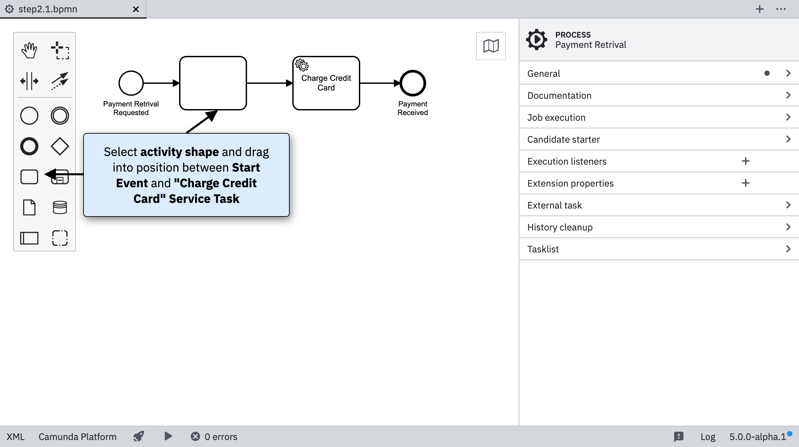

点击它并使用扳手按钮将活动类型改变为用户任务。

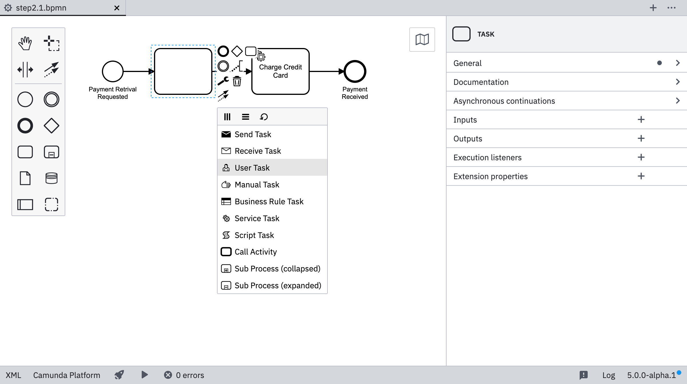

#### 1.4.2 [配置人工任务](https://docs.camunda.org/get-started/quick-start/user-task/#configure-a-user-task)

接下来，打开属性试图。如果属性试图不可见，在 `Modeler` 画布右手边点击 `“Properties Panel”` 标签。

在画布上选中用户任务。这会在属性试图中更新选择。滚动到 `Assignee` 属性，输入 `demo` 以当流程运行时自动将任务指派给 `demo` 用户。

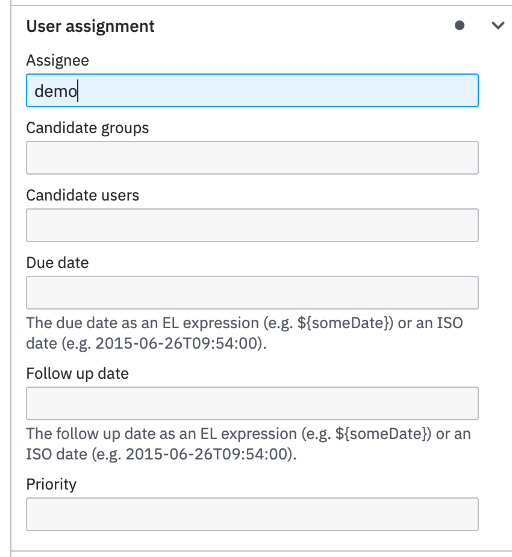

#### 1.4.3 [在人工任务中配置基本表单](https://docs.camunda.org/get-started/quick-start/user-task/#configure-a-basic-form-in-the-user-task)

这一步依然在属性面板上操作。如果面板不可见，在 `Modeler` 画布右手边点击 `“Properties Panel”` 标签。

在画布上选中用户任务。这会在属性试图中更新选择。

在属性面板上点击 `Tab Forms`。

这个指南使用 [Camunda Forms](https://docs.camunda.org/manual/latest/user-guide/task-forms/#camunda-forms) 来向流程添加表单。我们将创建一个名为 `payment.form` 的表单文件。设置下面的属性以将这个流程连接到你将创建的表单。

- Type: Camunda Forms
- Form Ref: payment-form
- Binding: deployment

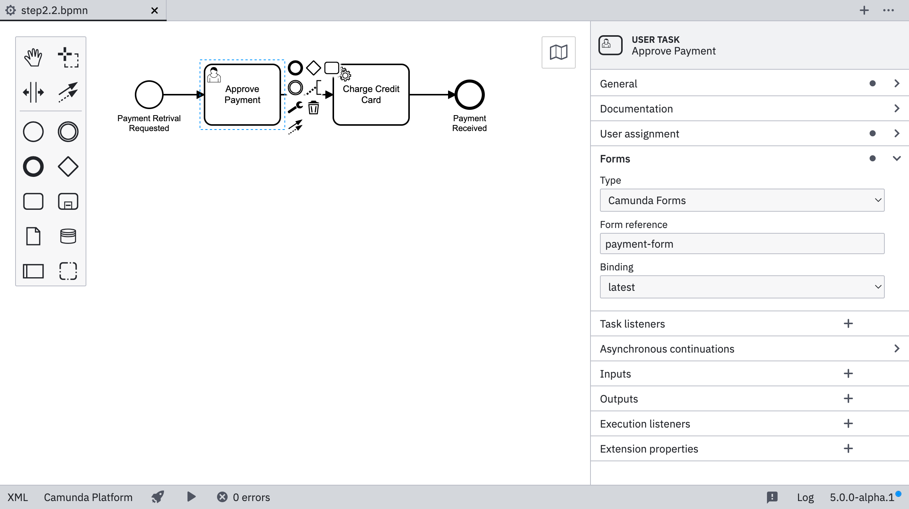

现在，通过点击 `File > New File > Form` 以创建一个新的表单，并在 `Id` 字段里输入 `payment-form`。

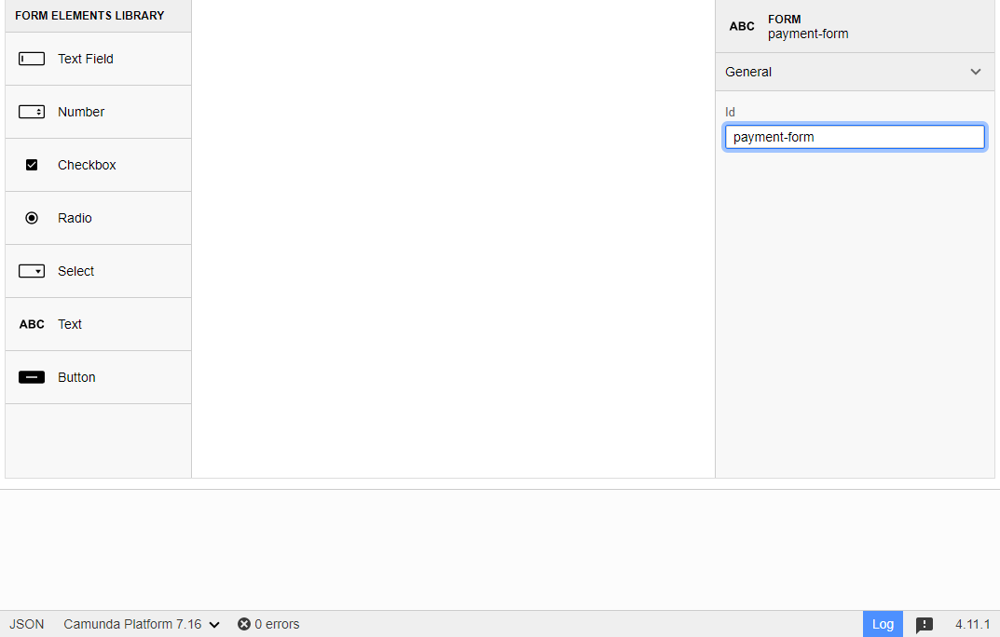

你可以从左边的 `FORM ELEMENTS LIBRARY` 中拖曳元素以添加表单字段。添加下面三个表单字段：

字段1：

- Type: Number
- Key: amount
- Field Label: Amount

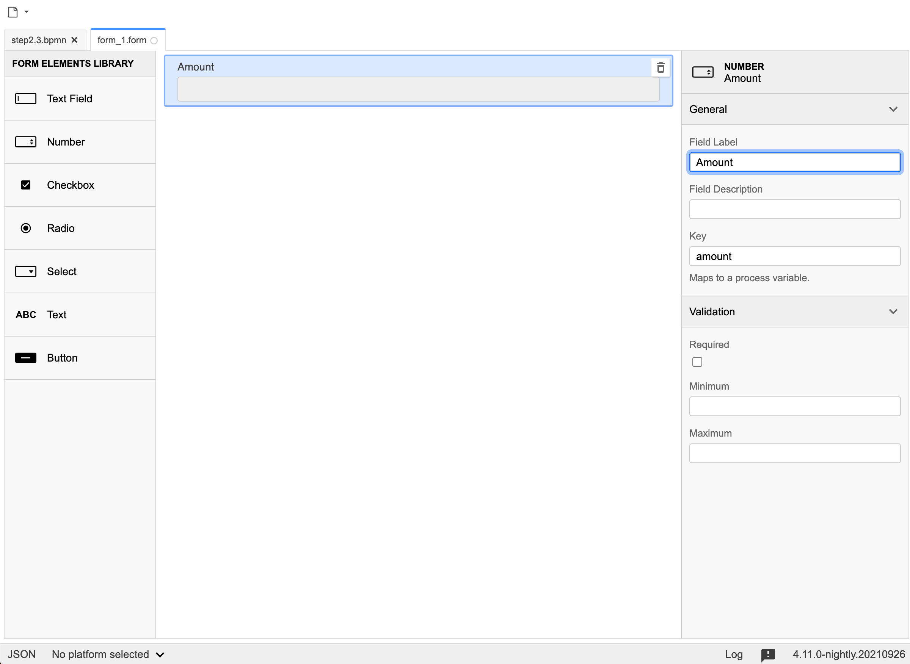

字段2：

- Type: Text Field
- Key: item
- Field Label: Item

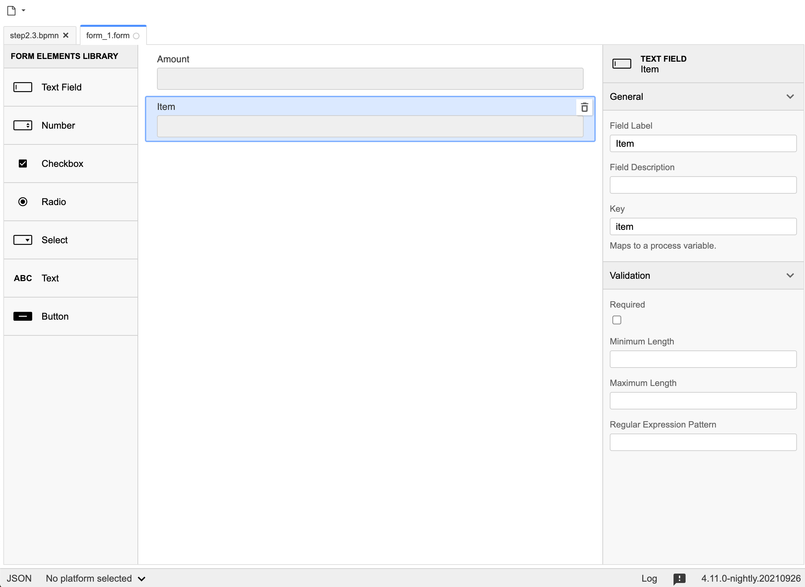

字段3：

- Type: Checkbox
- Key: approved
- Field Label: Approved?

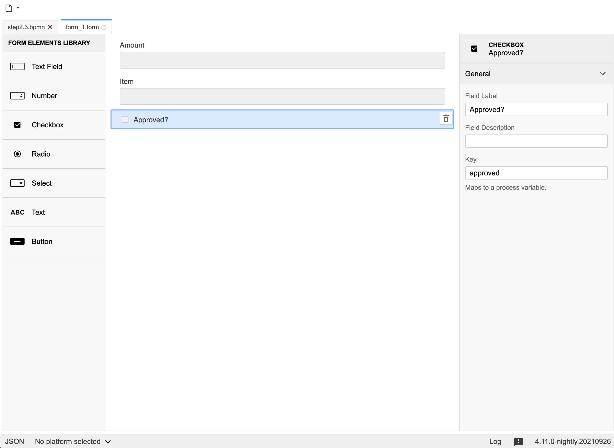

现在，从 `modeler` 左下角选择 `Camunda Platform` 作为执行平台并点击 `Apply`。

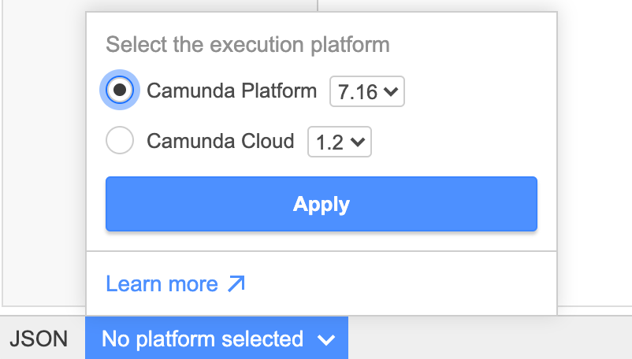

最后，将表单保存为 `payment.form`。

#### 1.4.4 [部署流程](https://docs.camunda.org/get-started/quick-start/user-task/#deploy-the-process)

1. 切换到流程图
2. 在 `Camunda Modeler` 点击 "Deplou current diagram" 按钮
3. 在部署面板，在包含额外文件里选择 `payment.form` 文件
4. 点击 `Deploy`

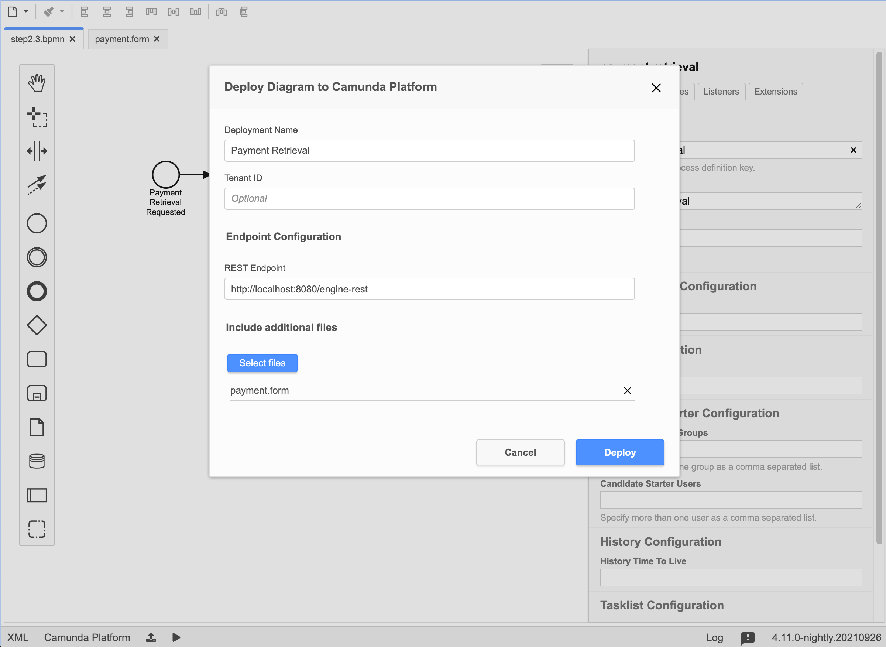

#### 1.4.5 [测试任务](https://docs.camunda.org/get-started/quick-start/user-task/#work-on-the-task)

导航到任务列表（http://localhost:8080/camunda/app/tasklist/），以 “demo/demo” 登录。点击 “Start process“ 以开启一个流程实例。这开起了一个对话框，你可以从列表中选择 `Payment Retrieval`。你还可以使用一个通用表单为流程实例设置变量。

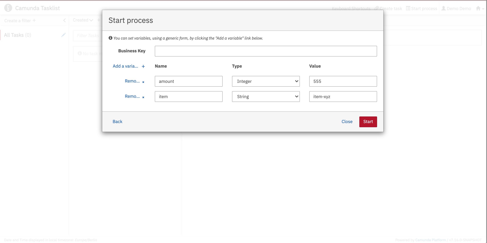

无论何时当你没有为你的用户任务或 `Start Event` 添加专用表单，你就可以使用通用表单。点击 `Add a variable` 按钮一创建一个新行。在表单里输入如截图里的内容。当你完成后， 点击 `Start`。

> 提示：如果你没在你的 `Tasklist` 看到任何任务，你可能需要一个过滤器。在左边点击 `Add a simple filter` 以添加一个。

你现在应该能够在你的任务列表里看到 `Approve Payment` 任务。选中任务并点击 `Diagram` 属性页。这展示了流程图，它高亮显示了等待继续工作的用户任务。

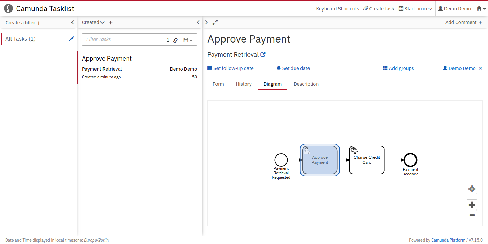

为了在任务上继续工作，选中表单属性页。因为我们在 `Camunda Modeler` 的 `Form Tab` 中定义了变量，任务列表已经为们自动产生了表单字段。

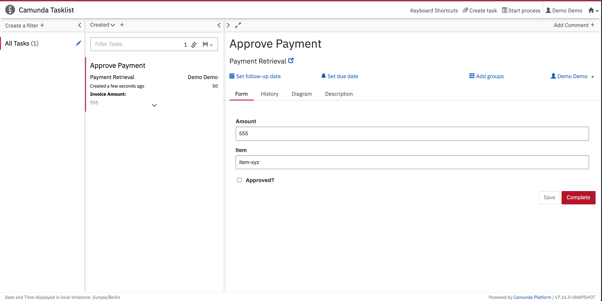

### 1.5 添加网关

本节中，我们将使用 `BPMN 2.0` **排它性网关**（Exclusive Gateways）来使得你的流程更动态。

#### 1.5.1 [添加两个网关](https://docs.camunda.org/get-started/quick-start/gateway/#add-two-gateways)

我们想修改我们的流程使其更动态。

为了实现这个，现在 `Camunda Modeler` 里打开流程。

接下来，从 `Modeler` 的左手边菜单，选择 `gateway` 形状（菱形）并将其拖曳到 `Start Event` 和服务任务之间。必要时再次使用 `create space` 工具。将用户任务下移并在其后增加另一个网关。最后，调整顺序流使得模型看起来像这样：

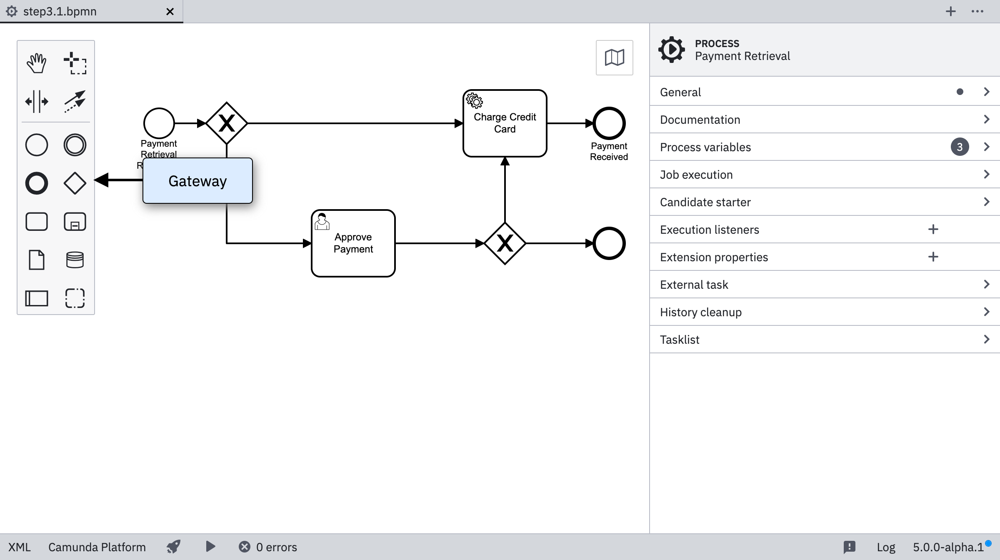

现在相应地为新元素命名：

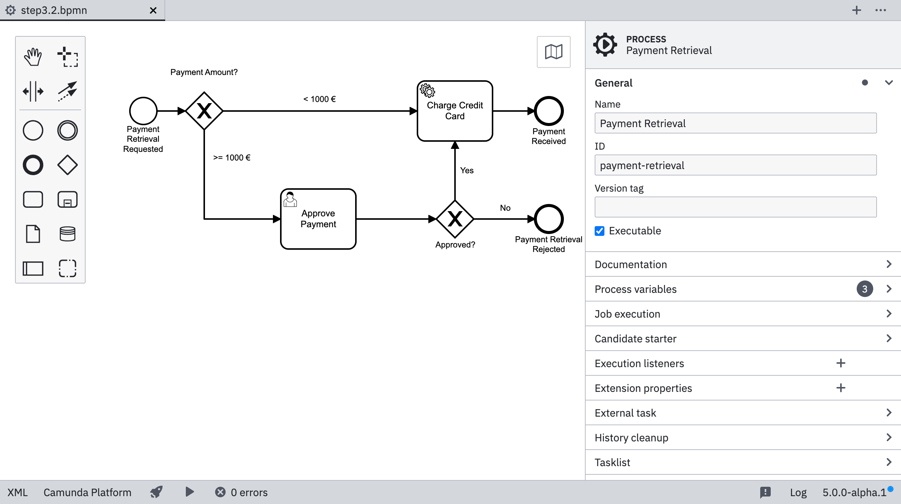

#### 1.5.2 [配置流程](https://docs.camunda.org/get-started/quick-start/gateway/#configure-the-gateways)

接下来，打开属性面板，在画布上网关之后选择 `<1000 €` 顺序流。这将在属性面板中更新选择。滚动到 “Condition Type” 属性并将其修改为 “Expression”，然后输入 `${amount<1000}` 作为表达式。我们使用 [Java 统一表达式语言](https://docs.camunda.org/manual/latest/user-guide/process-engine/expression-language/)来对网关求值。

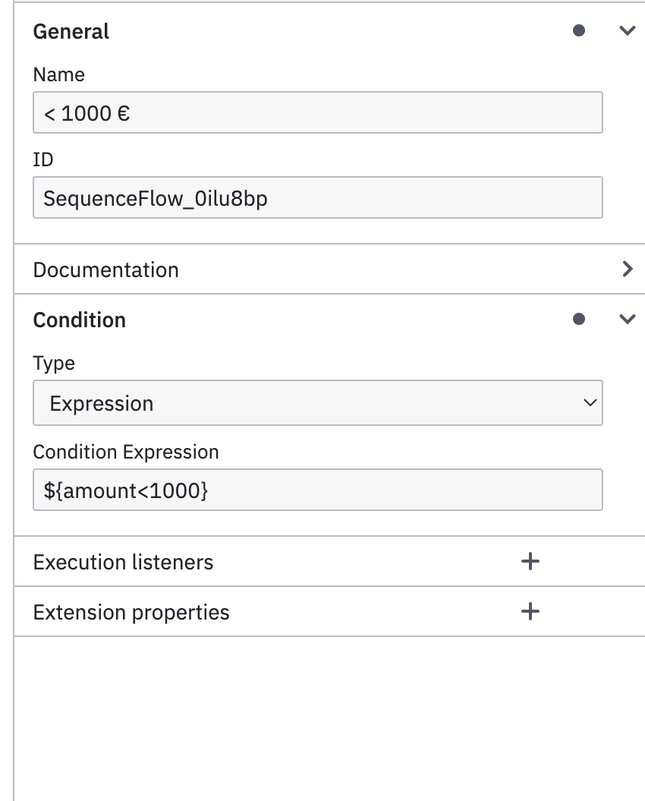

接下来，我们也要为顺序流修改表达式。

对于 `the >=1000 €` 顺序流，使用表达式: `${amount>=1000}`:

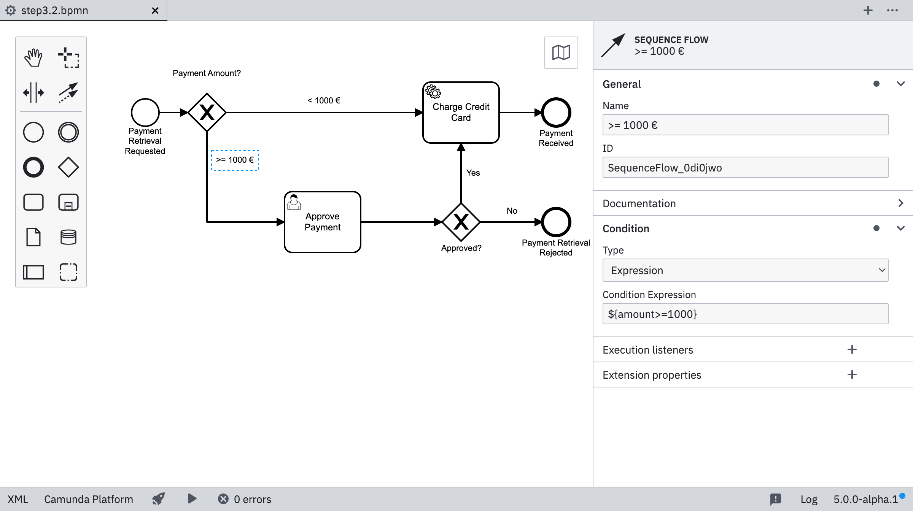

对于 `Yes` 顺序流，使用表达式：`${approved}`:

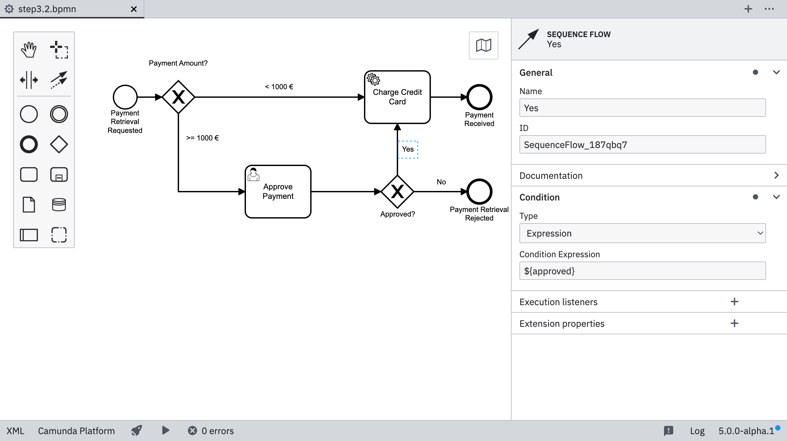

对于 `No` 顺序流，使用表达式：`${!approved}`:

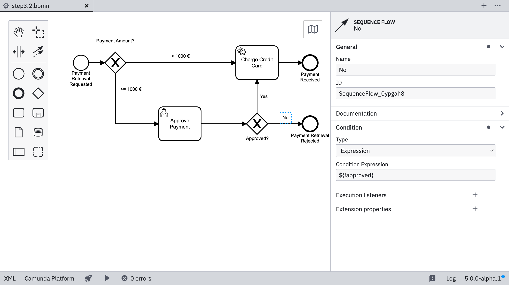

#### 1.5.3 [部署流程](https://docs.camunda.org/get-started/quick-start/gateway/#deploy-the-process)

使用 `Camunda Modeler` 中的部署将流更改过的程上传到 `Camunda`。

#### 1.5.4 [测试一下](https://docs.camunda.org/get-started/quick-start/gateway/#work-on-the-task)

导航到任务列表（http://localhost:8080/camunda/app/tasklist/），以 “demo/demo” 登录。点击 “Start process“ 为 `Payment Retrieval` 流程开启一个新的流程实例。解析来，你还可以像我们在用户任务一节中那样使用一个通用表单为流程实例设置变量。


在表单里输入如截图里的内容，并确保你输入了一个大于等于 `1000` 的数量以观察用户任务 `Approve Payment`。当你完成后，点击 `Start`。

当你点击 `All Tasks` 时你应该看到 `Approve Payment` 任务。在这个快速指南中，我们以一个 `admin` 用户的身份登陆进 `Tasklist`，因此我们能够看到与我们的流程关联的所有任务。但是，有可能[在任务列表中创建过滤器](https://docs.camunda.org/manual/latest/webapps/tasklist/filters/)，基于[用户授权](https://docs.camunda.org/manual/latest/webapps/admin/authorization-management/)和其它标准来决定哪些用户可以可以看见什么任务。

为了在任务上继续工作，点击表单属性页并选中 `approved` 选择框，如此我们的支付查询得到允许。我们能够看到我们的工作者在终端上打印了一些信息。

接下来，重复这一步骤但只一次，拒绝支付。你也可以创建一个实例，其数量小于 `1000` 来确认第一个网关可以正确工作。


### 1.6 决策自动化

## 2. RPA Orchestration

## 3. Spring Boot


## Reference

- [Quick Start (Java / JS)](https://docs.camunda.org/get-started/quick-start/)
- [Camunda 官方快速入门教程（中文完整版）](https://blog.csdn.net/ztx114/article/details/123549773)
- [camunda-spring-boot-example](https://github.com/huksley/camunda-spring-boot-example)
- [camunda入门（一个流程的欣赏）](https://www.jianshu.com/p/b01d605b089b)
- [Camunda工作流引擎简单入门](https://www.cnblogs.com/Tom-shushu/p/15000311.html)
- [Start and Step Through a Process with REST (feat. SwaggerUI)](https://camunda.com/blog/2021/10/start-and-step-through-a-process-with-rest-feat-swaggerui/)
- [Start Process Instance](https://docs.camunda.org/manual/7.17/reference/rest/process-definition/post-start-process-instance/)
- [Process Engine API](https://docs.camunda.org/manual/latest/user-guide/process-engine/process-engine-api/)
