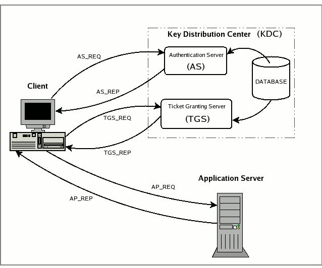
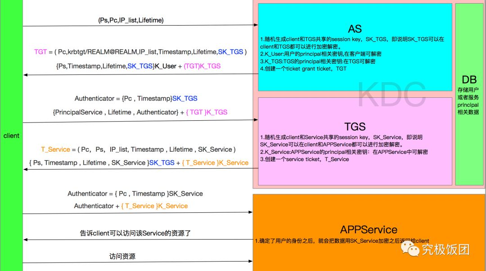

# Kerberos详解

## Kerberos原理

### 介绍

**Kerberos is an authentication protocol for trusted hosts on untrusted networks**

Kerberos 是一种网络认证协议，在互不信任的网络中，Kerberos 提供了一种可靠的中心化认证协议，以便网络中的各个机器之间能够相互访问。

它的目的：
- 用户的密码从不会在网络中传输，从不会以任何形式存储在客户端机器上，使用完之后立即删除，也从不会把明文密码存储在认证服务器(KDC)上的数据库里。
- 实现单点登录（Single Sign-On），用户在每一个 `work session` 仅仅会输入一次密码或者指定 `keytab`，之后用户就可以免密显示地访问他们授权的所有服务了。
- Kerberos认证管理是中心化管理的。所有会有一个认证服务器，即KDC。

总的来说：Kerberos 通过密钥系统为客户端/服务器应用程序提供强大的认证服务：保护服务器防止错误的用户使用，同时保护它的用户使用正确的服务器，即支持双向验证；

Kerberos 协议的整个认证过程实现不依赖于主机操作系统的认证，无需基于主机地址的信任，不要求网络上所有主机的物理安全，并假定网络上传送的数据包可以被任意地读取、修改和插入数据。说白了， Kerberos通过传统的加密技术（共享密钥）实现了一种可信任的第三方认证服务。

kerberos 安装在这篇文章没讲，因为在 `CDH`，`HDP` 集群管理中可以自动安安装，不过也可以去 kerberos 官网去看下如何手动安装。着重了解下利用 `kdc.conf` 如何配置 Realm的。

### 概念和术语

#### Realm
realm 这个术语表示一个认证管理域，每一个 realm 都有着不同的认证方案。这个认证方案使用 `/var/kerberos/krb5kdc/kdc.conf` 来配置，在 `kdc.conf` 中，每个realm 中很多配置项是不同的，比如 `database` 的位置，`ACL` 设置等。

```
[kdcdefaults]
kdc_ports = 88
kdc_tcp_ports = 88

[realms]
EXAMPLE.COM = {
  #master_key_type = aes256-cts
  acl_file = /var/kerberos/krb5kdc/kadm5.acl
  dict_file = /usr/share/dict/words
  admin_keytab = /var/kerberos/krb5kdc/kadm5.keytab
  supported_enctypes = aes256-cts:normal aes128-cts:normal des3-hmac-sha1:normal arcfour-hmac:normal des-hmac-sha1:normal des-cbc-md5:normal des-cbc-crc:normal
}
```

在一个 realm 内，这个 realm 的认证服务才能认证一个用户，主机或者服务。但这并不意味着如果一个用户和一个服务属于不同的 realm，它们就无法互相认证，如果它们不在同一个 realm 中，但是它们所属的 realm 有信任关系，那么认证就可以通过。

基本上可以认为，只有当一个用户/服务和一个 realm 的认证服务共享一个密钥时，这个用户/服务才属于这个 realm。

**realm的名字是大小写敏感的**，也就是说，大写和小写字符是有区别的，通常的 realm 的名字都用大写字母。推荐在一个 realm 中，让 realm 名字和 `DNS` 域名一致(但是要大写)。在选择 realm 名字的时候遵循这些建议，将会显著减少 Kerberos 客户端的配置，而且如果想要在子域(subdomain)间建立信任关系，这样配置是首要的。比如，如果一个网络域属于 `DNS`域 `example.com`，那么最好把相关的 Kerberos realm 配成 `EXAMPLE.COM`。

#### Principal

一个 Principal 代表着唯一的身份标识，KDC 中数据库中存储的数据就是 Principal。**一个Principal可以代表一个特定realm的用户或者服务**。

Kerberos5中的一个principal有以下的形式：
```
component1/component2/…/componentN@REALM
```

但是，实际情况，最多只使用两个 component。

##### 用户principal

用户principal的形式：
```
Name[/Instance]@REALM
```

其中 `Instance` 是可选的，通常用于更好地限定用户的类型。比如，一个管理员用户通常会有 `admin instance`，即 `Name/admin@REALM`。

下面是指代用户的 一些 principal 的例子：

- `pippo@EXAMPLE.COM`
- `admin/admin@EXAMPLE.COM`
- `cnicetoupp/admin@EXAMPLE.COM`

##### 服务principal

服务principal的形式：
```
Service/Hostname@REALM
```

第一部分是 service 的名字，比如 `imap`，`AFS`，`ftp`. 通常 'host' 这个名字被用于指明对一台机器的通用的访问(`telnent`，`rsh`，`ssh`)。

第二个 component 是提供这个服务的机器的全限定域名(FQDN)。这个 component 跟 DNS 对应用服务器的 IP 地址进行逆向解析后得到的主机名。

下面是指代服务 principal 的例子：
- `imap/mbox.example.com@EXAMPLE.COM`
- `host/server.example.com@EXAMPLE.COM`
- `afs/example.com@EXAMPLE.COM`

需要指出的是最后一条是一个例外，因为它的第二个compoment不是主机名，而是 `AFS cell` 的名字。

最后，有一些 principal 即不用来指代用户，也不用于指代服务，而是在 Kerberos 认证系统的操作中扮演一个角色。一个首要的例子就是 `krbtgt/REALM@REALM`，这个principal 和它的相关的密钥会被用来加密 `Tikcet Granting Ticket`，`krb` 就是指 `kerberos`，`tgt` 就是指 `Ticket Granting Ticket`，所以这个特殊的principal 前缀就是 `krbtgt`。只有 KDC 拥有这个 principal 和它的相关的密钥，所以 TGT 才不能被伪造.

#### Ticket

Ticket 分两种：
- **Ticket Granting Ticket(票据授予票据)**，**TGT**：这是 KDC 中的 `Authentication Server`(简称AS) 产生的，TGT 是向 `Ticket Granting Server`(TGS) 用于表明自己真实身份的东西
- **Service Ticket(服务授予票据)**：这是 KDC 中的 `Ticket Granting Server`(简称TGS) 产生的，`Service Ticket` 是用于向应用服务器表明自己身份的东西

虽然这是两种不同的 Ticket，但是我们也把 `Ticket Granting Server` 当做一个应用服务器，所以 Ticket 是客户端提供给应用服务器用于表明自己真实身份的东西。加密Ticket 的密钥是 AS 或者 TGS 与应用服务器之间共享的密钥加密的(后面直接说即 service 的密钥)，因此即使请求 ticket 的客户端也不能查看或更改它的内容。ticket 包括的主要信息包括：
- **Pc**：发出请求的用户的 principal（通常就是用户名）
- **Ps**：想要访问的服务的 principal
- **IP_list**：想要使用这个 ticket 的客户端所在机器的IP地址。在 Kerberos 5 中这个字段是可选的，并且可是有多个，以便可以在 NAT 或者多宿主主机（multihomed）下使用，
- **Timestamp**：准备启用 ticket 的日期和时间(以时间戳的形式)（The date and time when the tickets validity commences）
- **lifetime**：ticket的最长使用期。
- **session key**：客户端与应用服务器之间共享会话密钥(session key)(这个密钥有非常重要的作用，在下面将会描述它的角色)

**每个 ticket 都会有一个过期时间(通常是10小时)**。这非常关键，因为发出 ticket 的服务，例如 AS，无法控制一个已经分发去出的 ticket(译注：因为 AS 和提供 service的 server 之间是没有联系的。因此，AS 是没办法主动销毁一个已经分发出去的 ticket 的)。尽管 realm 的管理员可以在任何时间停止给特定的用户分发新的 ticket，但是却无法阻止用户使用已经拥有的 ticket。限制一个 ticket 的最长使用期，就是为了防止无时间限制的滥用。

#### 密钥版本号(kvno)

当用户修改密码或者管理员为应用服务器升级密钥的时候，这个修改会被以增加计数器计数的形式记录下来。计数器的当前值表示密钥的版本，这被称为 `Key Version Number`， 或者简称为 `kvno`.

#### 加密

就像你所看到的 一样，Kerberos经常需要加密和解密在认证过程中的参与者之间传递的消息(ticket和authenticator)(译注：authenticator的概念后面会讲)。**需要强调的是，Kerberos只使用对称加密算法(也就是说同样的密钥即用于加密也用于解密)**。某些工程(比如pkinit)致力于引用公钥系统，利于与特定公钥相关的私钥来对初始用户进行验证，但是鉴于这种做法并没有一个标准，所以我们会暂时跳过。

#### 密钥分发中心(KDC)

在 Kerberos 环境中，KDC具有分发 ticket 的功能，被称为密钥分发中心(Key Distribution Center)，或者简称为 KDC。因为它整个在一个物理的服务器上，其中包含三个组件：
- principal 数据库
- 认证服务器(Authentication Server)
- 票据分发服务器(Ticket Granting Server)

##### 数据库

数据库中存储着与用户 principal 和服务 principal 有关的条目(entry)。每个条目包括以下的信息：
- 这个条目相关联的principal
- 密钥和相关的kvno（译注: 注意这里并不是密码，而是密钥）;
- 与这个principal相关联的ticket最长可用时间
- 与这个principal相关联的ticket的最长的renew时间，这个是指这个ticket通过renew机制累计可用的时间，只在kerberos 5中可用)
- 决定这个ticket的具体行为的属性和标志位。
- 密码过期时间
- 这个principal的过期时间，在此之后就不为这个 principal 分发 ticket 了。

为了使得窃取数据库中的密钥更加因难，Kerberos的实现们使用 `master key` 来对数据库进行加密，`master key` 被关联在 `K/M@REALM` 这个 principal 上。即使是数据库的 `dump`，`备份` 和 `master KDC` 到 `salve KDC` 的 propagation 也会被用这个密钥加密，因此，如果想要重新加载它们，就必须知道这个密钥。

##### AS

AS是一个认证服务。AS 认证用户时，AS 接受到 client 的认证请求（一般是用 `kinit` 命令进行认证）时，AS会分发一个特殊的 ticket，被称为 `Ticket Granting Ticket`，简称为 TGT，TGT 使用 `krbtgt/REALM＠REALM` 这个 principal 的密钥来加密。然后把 TGT 返回给 client，用户必须输入密码(也可以使用 keytab)，以完成认证。之后TGT存储在 client 的 cache中。客户端用户获得 TGT 之后，它们就可以使用 TGT 来获取其它应用服务的 ticket，而不需要重新输入密码。

##### TGS

KDC 的 TGS 组件用于为拥有可用的TGT的客户端分发 `service ticket`，在 client 用户请求一个应用服务器上的资源时，`service ticket` 可以确保用户身份的真伪(意思是，TGS 可以确保访问服务的人的身份是真实的)。TGS 可以被看成是一个应用服务器(application server)，因为访问它必需要使用一个 ticket，TGT。

不要把TGT和TGS搞混：第一个表示ticket，第二个表示service。

#### 会话密钥 Session Key

在认证用户的时候，用户和服务会与KDC共享密钥。用户与服务也有必要共享密钥。在将 kerberos 的流程中会应用到这些密钥。

#### Authenticator

注意：这一段对于理解Kerberos认证流程的设计原理非常非常重要。

尽管ticket中含有用户的principal信息，并且只有应用服务器可以获取和(可能)管理这些信息(因为ticket被应用服务的密钥加密)，但这不足以保证用户身份的真伪。一个冒名顶替者可以在一个合法的客户端向应用服务器发送ticket时捕捉(记住Kerberos的假设是在一个开放以及不安全的网络)这个ticket，并且在适当的时候发送它，来非法获取服务。另一方面，在 ticket 中包含可以使用这个 ticket 的 ip 地址并不是非常有用：众所周知的是在一个开放和不安全的网络环境中，网各地址可以很容易地伪造。

为了解决这个问题，我们必须利于一个事实：客户端和服务器至少在一个会话中共享会话密钥，并且只有它们知道这个密钥(KDC也知道，因为正是KDC产生了这个密钥，但是根据定义，KDC一定是可信的！！！)。因此，以下的策略被采用:  在访问TGS或者应用服务器时，和包含ticket的请求一起，客户端添加了另一个包(就是authenticator)，用户的principal和时间戳(当时的时间)被用session key加密后放在这个包里；提供服务的服务器在收到这个请求后，解开第一个包，获取session key，如果用户的确是他/她所声称，那么服务器就可以解密 authenticator，并且提取时间戳。如果这个时间戳和服务器的时间相差在两分种以内(这个值是可以配置 的)，那么这个认证成功。这个时间给同一个realm中的服务器的同步划了一个底线。

不过以上的逻辑并不足以阻止攻击者的重放攻击。攻击者可以窃听客户最终向服务器发送的信息，即加密后的ticket和authenticator，然后接下来重放这些信息给服务器。实际上，Kerberos协议也可以阻止这种攻击。就是服务器不仅会检查authenticator中的时间戳，还会检查它是否曾经见到过这个authenticator。**以上这些也表明了Kerberos本身并不能保证客户端和服务器之间传递的消息并不会被窃听**。

#### Replay Cache

以下的可能性仍然存在：一个冒名顶替者同时窃取了ticket和authenticator，并且authenticator可用的2分钟内使用它。这很难，但不是不可能。为了在Kerberos 5中解决这个问题，引入了Replay Cache。应用服务器application server(也在TGS中)可以记住过去两分种内到达的authenticator，并且拒绝重复的authenticator。只有冒名顶替者没有能力在合法请求到达前复制ticket和authenticator然后发送它们到service，他的攻击就不能得逞。如果他能够做到的话，那么真正的用户就会被拒绝，而冒名顶替者将会成功获取服务。

#### Credential Cache

客户端从不保存用户的密码，也不会记住 它通过string2key获得的密钥：密钥被用于解密KDC的回复并且被立即丢弃。但是，另一方面，为了实现单点登录(single sign-on)功能，也就是说用户在一个工作会话中只被要求输入一次密码，必须要存储ticket和相关的会话密钥。这些数据被存储的地方叫做"Credential Cache". 这个cache的位置并不由kerberos协议来指定，而是由它的实现来决定。通常为了可移值性的原因，这个cache被放在文件系统中(MIT和Heimdal)。在其它的实现中(AFS和  Active Directory)，为了增加脆弱的客户端的安全性，credential cache被放在了一个只有内核才能访问的内存区域，并且不会被交换到磁盘。

#### keytab

keytab是一个包含了Kerberos princpals和加密的密钥的一个文件，这个加密的密钥是从Kerberos的用户密码转化来的，当你的用户密码改变了，你就需要重新生成你的keytabs。你可以在client上用kinit -k -t keytab principal无密码的认证principal用户或者服务，获取principal对应的ticket granting ticket（TGT）文件。

## Kerberos 工作原理

了解完上面那些术语之后，我们就可以来讨论下 `Kerberos` 的工作原理了，其中讲到了在认证期间，客户端和 `KDC`，`client` 和 `application server` 之间的通信机制，要注意的一点是，一个 `application server` 是从不会和 `KDC` 直接进行通信的，而是通过 TGS 包装的 `server ticket` 间接进行通信的。

- **AS_REQ** 是在初始化一个用户（kinit）的时候发出的用户认证请求，这个请求是发给 KDC 中的 Authentication Server (AS)；
- **AS_REP** 是 AS 回复给 client 的信息，其中包括 TGT (用TGS secret key加密过的) 和 session key (用发请求的用户的secret key加密过的);
- **TGS_REQ** 是client为了一个 `service ticket` 向 `Ticket Granting Server` (TGS)的信息. 其中包括上一条信息中获得的 TGT (用TGS secret key加密过的) ，一个客户端产生的一个 `authenticator`(用session key加密过的).
- **TGS_REP** 是TGS回复给 `TGS_REQ` 的信息. 其中包括 `service ticket`（用appservice的secret key加密过），和 一个 TGS 产生的 `service sessinon key`（之前AS产生的一条session key给加密过的）
- **AP_REQ** 是一条客户端发给 appserver 的访问服务的请求，其中包括 `service ticket` 和一个 `authenticator`（使用TGS产生的service session key 加密过的）
- **AP_REP** 是appserver 回复给 client 的一条信息，证明这个 appserver 确实是客户端希望访问的 server。不过这条信息也不一定总是要回复的。比如当客户端和appserver需要相互认证的时候，客户端向appserver发出请求，这个时候就不需要回复信息。





### AS_REQ
### AS_REP
### TGS_REQ
### TGS_REP
### AP_REQ
### AP_REP

## 缺点
- KDC 有单点故障的问题
- Keytab 文件和TGT cache 文件必须要被严格保护。不然会被其他用户使用获取服务应用里的数据。
- Kerberos是为了客户端和那些长期运行的服务所设计的，而对于 `spark executor` 这些服务，Kerberos不能应用到这些临时服务。

## 常用命令

## 总结

## 参考
- [Kerberos详解](https://www.modb.pro/db/323372)