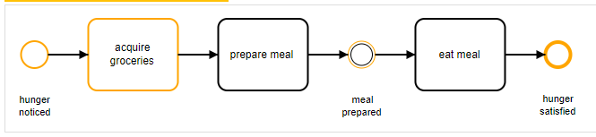
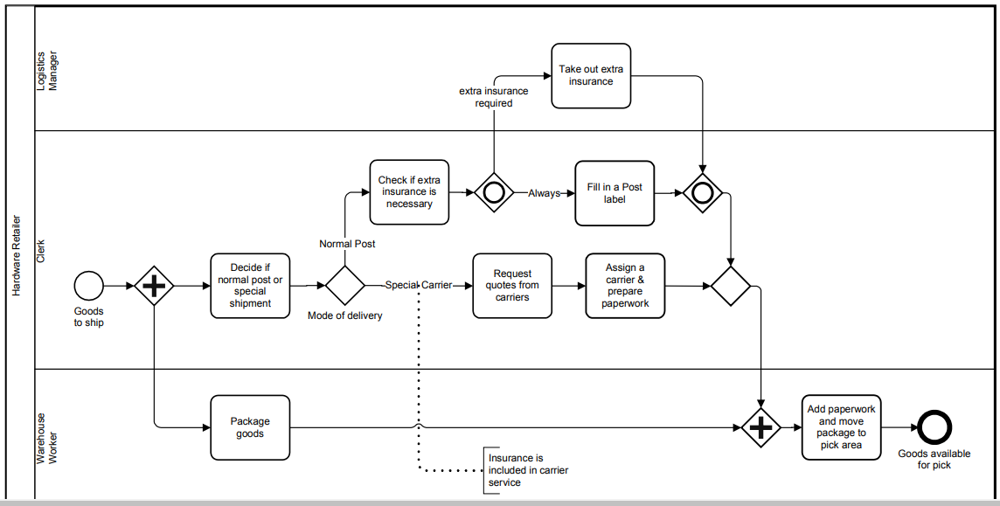
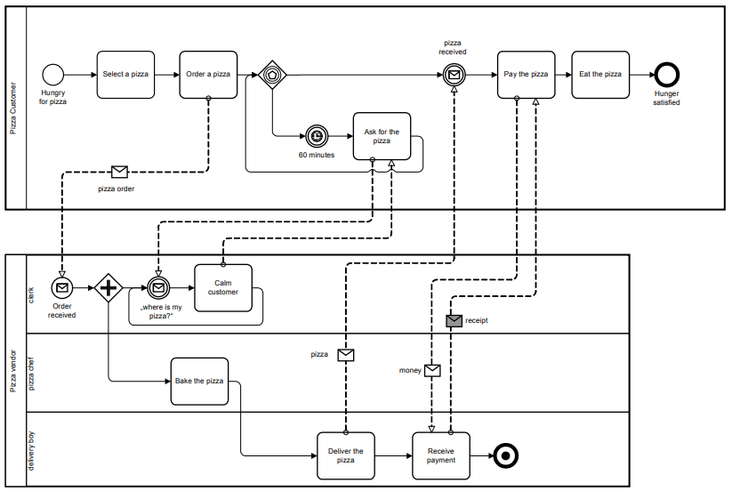

# BPMN Tutorial: Get started with Process Modeling using BPMN

## 为什么我要关心业务流程建模符号

业务流程建模符号（Business Process Model and Notation (BPMN)）是流程建模的全球性标准，也是最成功的 Business-IT 融合组件中的一个。

越来越多的组织在使用 BPMN，在越来愈多的高校 BPMN 成为一门课程。其中主要原因如下：

特性|描述
--------|--------
标准化|BPMN并不被某个企业而是被一个协会[OMG](https://www.omg.org/)拥有，它已经建立其它一些世界标准如 `UML`。标准被许多软件产品支持，你并不需要绑定于特定供应商产品。
简化|BPMN 背后的哲学是尽量简化，这就是你可以快速使用这个符号的原因
表达能力|如果必要，你可以使用 BPMN 精确地描述一个流程如何工作。但是，这比仅仅粗略地描述流程更困难。精准建模的方式是可能的，但不是必须的。
IT实施|BPMN 被开发用于支持流程（流程自动化）的技术实现。更重要的是，如果 IT 在一个公司内部，则 BPMN 变得更为有用。

## 一个简单 BPMN 流程

让我们从一个简单的流程图开始我们的 BPMN 教程。

这个图显示了一个由一个饥饿的人触发的简单流程。结果是这个人必须出门购买生活用品，并准备正餐。之后，这个人就可以进餐了以满足它他的饥饿感。

当命名任务时，我们努力遵循使用 `[动词] + [名词]模式` 的面向对象设计原则。例如，我们会说 `“acquire groceries”`，而不是 `“first take care of shopping for groceries”`。

事件（Events）指代已经发生的一些事情，无关流程（如果他们是捕捉事件（catching events））或者流程的结果（如果它们是抛出事件（throwing events））。基于这个原因， 我们 使用被动词来命名它们，因此我们写下 “hunger noticed”。BPMN 并不需要你为一个流程建模开始和结束事件--你可以省去它们--但如果你建模了开始事件，你就必须为每一条路径建模结束事件。这对结束事件也成立，他必须需要开始事件。基于两个原因，卫门通常为我们的模型建立开始结束事件：首先，这种方式容易判断流程的触发；第二，你可以描述每条路径结尾的最终状态。我们只在某些子流程种放弃这种最佳实践。稍后我们将更多地讨论它。

常见问题：必须在水平方向上描绘 BPMN 图吗？如果我在垂直方向上描绘它可以吗？

你可以总是从顶部到底部绘图而不是从左至右--BPMN 2.0 标准并没禁止这点。但是，我们并不推荐它：这并不常见，经验证明如同编辑文本（从左至右，至少在西方世界）一样的顺序那样绘图人们更容易理解流程六。

## 示例

### 简单流程

在这个例子中，你能够找到在下单的货物被运送给客户之前，硬件销售商必须从事的准备步骤。

在这个例子中，我们仅仅使用了一个池子，但多个泳道用于流程中包括的人，这自动意味着我们取消了这些人之间的交流：我们假设他们以某种方式互相交流。如果我们由某个流程引擎驱动该流程，引擎将指定用户任务，并负责这些人之间的交流。如果我们没有这种流程引擎，但要为这些涉及的人之间的交流显式建模，我们将不得不使用下面章节将涉及的协作图。

### 披萨协作

这个例子有关业务协作。因为我们想显式地对披萨消费者与披萨供应商之间的交互建模，我们将其归类为“参与者”，因此为他们提供了单独的泳池。

请注意这种类型的建模没有默认语义，这意味着你可以对协作图建模来展示业务伙伴间的交互，缩小到一个公司内部，对协作图上不同部门，团队甚至单个员工以及软件系统的交互建模。这完全取决于建模的目的，然后才有建模者做出的决策；是否协作图中多个泳池时有用的，或者是否坚持如上一章的多个泳道的泳池。

## Reference

- [Get started with Process Modeling using BPMN](https://camunda.com/bpmn/)
- [BPMN 2.0 Tutorial and Examples](https://www.processmaker.com/blog/bpmn-2-0-tutorial-and-examples/)
- [BPMN Tutorial for Beginners](http://www.mastertheboss.com/bpm/bpmn-20/bpmn-tutorial-for-beginners/)
- [Read a Model](https://docs.camunda.org/manual/latest/user-guide/model-api/bpmn-model-api/read-a-model/)
- [工作流的基础知识梳理](https://zhuanlan.zhihu.com/p/514804348)
- [基于BPMN2.0的工单系统架构设计（上）](https://juejin.cn/post/6844903612917743623)
- [基于BPMN2.0的工单系统架构设计（中）](https://juejin.cn/post/6844903613874044935)
- [基于BPMN2.0的工单系统架构设计（下）](https://juejin.cn/post/6844903614327029774)
- [标准流程描述语言 WDL 阿里云最佳实践](https://developer.aliyun.com/article/716546?scm=20140722.184.2.173)