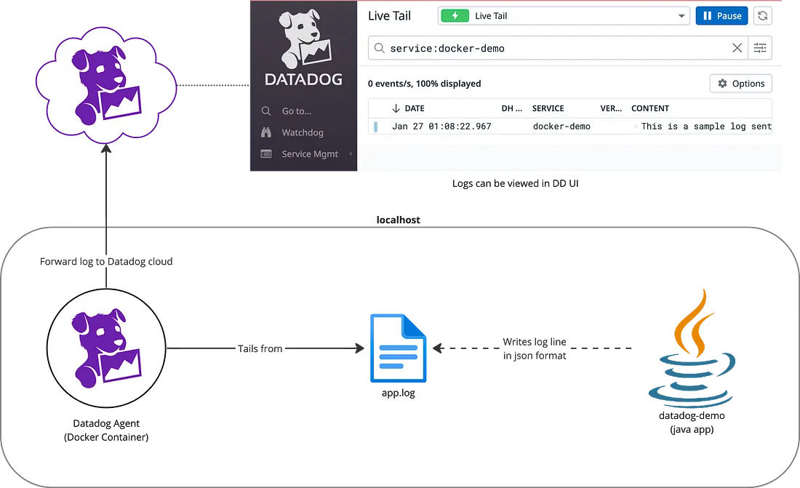
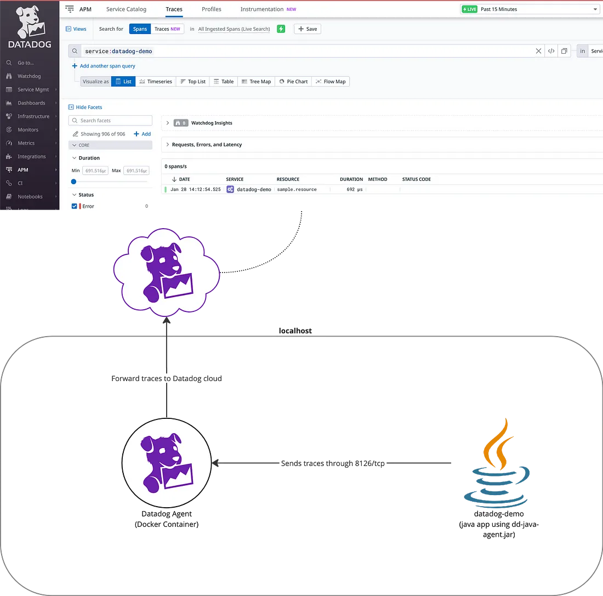
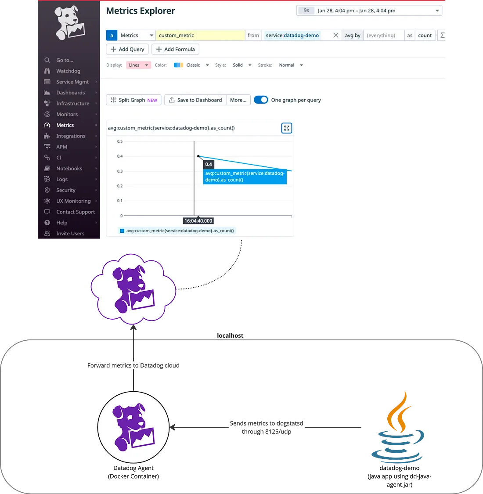

# 向 Datadog 发送日志，追踪以及度量的开发者友好指南

Datadog 已经提供了丰富的[文档](https://docs.datadoghq.com/)，为什么我还要创建这篇博文？关于本地发送日志的信息会与[日志发送指南](https://docs.datadoghq.com/logs/log_collection)里包含的是否冗余？

在创建这篇博文背后有两个引人注目的原因。首先，当前我在使用[Colima](https://github.com/abiosoft/colima)，用于发送 Datadog 度量的前提条件。其次，我不得不把许多指南合并在一起并最终找个一个可行的设置。这个指南的目的是巩固我的只是和经验，如此其他人可以避免踩到同样的坑、

## 前提条件

- Docker 引擎已安装：如果你已经拥有[Colima](https://github.com/abiosoft/colima)，那你必须安装 [buildx](https://github.com/docker/buildx/releases)
- [Datadog API Key](https://docs.datadoghq.com/account_management/api-app-keys/#api-keys)：Datadog Agent 需要用它来向 Datadog 提交日志，度量和事件。

## 如何从本地发送日志



系统核心在于 Datadog Agent，它从一个日志文件的尾部追踪其新增内容并上传至 Datadog 云。你可以手动写下任意行，或使用任何语言的一个日志库来产生日志行或带有 Datalog 可以理解的属性（如 `@timestamp`）的 JSON 格式日志行。

### 步骤 1: 运行一个 datadog agent docker 容器

```
docker run --rm --name datadog-agent \
   -e DD_HOSTNAME=my-local \
   -e DD_API_KEY=${DD_API_KEY} \
   -e DD_SITE=datadoghq.eu \
   -e DD_LOGS_ENABLED=true \
   -v /absolute/path/to/custom_log_source_dir:/etc/datadog-agent/conf.d/java.d:ro \
   -v /absolute/path/to/logs:/logs:ro \
   public.ecr.aws/datadog/agent
```

#### 分解：

- `-e DD_HOSTNAME` 为所有发送至 datadog 的日志，追踪，度量设置 hostname 属性。另一个选项是使用 `--pid`。但这会使用 docker 宿主机的 hostname，例如colima 如果你在使用 Colima。如果他不能解析出 `hostname` ，设置 `hostname` 的缺席将会导致错误。
- `-e DD_API_KEY` — 用于与 Datadog 交互的 [API Key](https://docs.datadoghq.com/account_management/api-app-keys/#api-keys) 。
- `-e DD_SITE` — 默认为 `datadoghq.com`。如果你来自欧洲，你必须设置为 `datadoghq.eu`。
- `-e DD_LOGS_ENABLED` — [开启日志收集](https://docs.datadoghq.com/logs/log_collection/?tab=host#setup)。
- `-v /absolute/path/to/custom_log_source_dir:/etc/datadog-agent/conf.d/java.d:ro` — 将目录挂载到 `conf.yaml` 配置的[定制日志收集](https://docs.datadoghq.com/agent/logs/?tab=tailfiles#custom-log-collection)存储的，`datadog-agent` 的配置目录的根目录。`path` 配置应该匹配 `app.log` 文件挂载目录。下面是一个 `conf.yaml` 的例子：
  ```
  logs:
    - type: file
    # The log file should be mounted in /logs directory in the datadog-agent docker container
    path: "/logs/app.log"
    service: docker-demo
    source: java
  ```
- `-v /absolute/path/to/logs:/logs:ro` — 将 `app.log` 文件坐在目录挂载至 `datadog-agent` 容器的 `/logs` 目录。


### 步骤 2: 在 app.log 中写下日志行

如上所述，你可以打开 `app.log` 编辑并写入任意行。如果你那么做，`timestamp` 属性将被设置为 `Datadog 云` 收到日志的时间。你可以手动创建一个带有[属性惯例](https://docs.datadoghq.com/logs/log_configuration/attributes_naming_convention)和[pipeline](https://docs.datadoghq.com/logs/log_configuration/pipelines/?tab=date)列出的属性的 JSON 日志文件以获取对日志的更多控制，你也可以创建一个程序利用[第三方日志库](https://docs.datadoghq.com/logs/log_collection/?tab=host)来创建日志。

我创建了一个 [Kotlin 项目](https://github.com/ramirezag/datadog-demo)以向你展示系列文章相关代码。

从现在开始，你可以继续了解[本地发送跟踪指南](https://medium.com/@ramirezag/developer-friendly-guide-for-sending-local-logs-traces-and-metrics-to-datadog-part-2-c14e55c29c21)，以及[本地发送度量指南](https://medium.com/@ramirezag/developer-friendly-guide-for-sending-local-logs-traces-and-metrics-to-datadog-part-3-7bbc00955932)。


## 如何从本地发送追踪



魔法依然隐藏于 Datatadog Agent 之下，它被配置为监听任何主机发给 TCP 8126 的追踪，一个应用（本例为[datadog-demo](https://github.com/ramirezag/datadog-demo)）可以使用 Opentracing（供应商中立的 API以及分布式追踪仪表盘）发送追踪。

### 步骤 1: 运行一个 datadog agent docker 容器

```
docker run --rm --name datadog-agent \
  --cgroupns host \
  -v /var/run/docker.sock:/var/run/docker.sock \
  -v /proc/:/host/proc/:ro \
  -v /sys/fs/cgroup:/host/sys/fs/cgroup:ro \
  -p 8126:8126/tcp \
  -e DD_HOSTNAME=my-local \
  -e DD_API_KEY=${DD_API_KEY} \
  -e DD_SITE=datadoghq.eu \
  -e DD_APM_ENABLED=true \
  -e DD_APM_NON_LOCAL_TRAFFIC=true \
  public.ecr.aws/datadog/agent
```

### Related Source Codes

```
fun createTrace() {
		val tracer: Tracer = GlobalTracer.get()
		// Service and resource name tags are required.
		// You can set them when creating the span:
		val span: Span = tracer.buildSpan("sample.operation")
			.withTag(DDTags.SERVICE_NAME, "datadog-demo")
			.withTag(DDTags.RESOURCE_NAME, "sample.resource")
			.start()
		try {
			tracer.activateSpan(span)
		} catch (e: Exception) {
			println(e)
		} finally {
			// Close span in a finally block
			span.finish()
		}
	}
```

#### 分解：

从 --cgroupns 到 -v /sys...，这些是追踪工作正常运行必须的参数https://docs.datadoghq.com/containers/docker/apm/?tab=linux#tracing-from-the-host。

-p 8125:8125/udp，默认地，DogStatsD 在 UDP 端口 8125 上监听，这个参数将 datadog-agent UDP 端口 8125 绑定到主机端口 8125。

## 如何从本地发送度量



Datadog 使用[DogstatsD](https://docs.datadoghq.com/developers/dogstatsd/?tab=hostagent)系统图

### 步骤 1: 运行一个 datadog agent docker 容器

```
docker run --rm --name datadog-agent \
  --cgroupns host \
  -v /var/run/docker.sock:/var/run/docker.sock \
  -v /proc/:/host/proc/:ro \
  -v /sys/fs/cgroup:/host/sys/fs/cgroup:ro \
  -p 8125:8125/udp \
  -p 8126:8126/tcp \
  -e DD_HOSTNAME=my-local \
  -e DD_API_KEY=${DD_API_KEY} \
  -e DD_SITE=datadoghq.eu \
  -e DD_DOGSTATSD_NON_LOCAL_TRAFFIC=true \
  public.ecr.aws/datadog/agent
```

#### 分解：

从 --cgroupns 到 -v /sys...，这些是追踪工作正常运行[必须的参数](https://docs.datadoghq.com/containers/docker/apm/?tab=linux#tracing-from-the-host_。

`-p 8125:8125/udp`，默认地，`DogStatsD`` 在 UDP 端口 8125 上监听，这个参数将 datadog-agent UDP 端口 8125 绑定到主机端口 8125。

### Related Source Codes

```
fun createMetrics() {
		lateinit var client: StatsDClient
		try {
			client = NonBlockingStatsDClientBuilder()
				.hostname("localhost")
				.port(8125)
				.build()
			for (i in 0..5) {
				client.incrementCounter("custom_metric", i.toDouble(), "service:datadog-demo")
				println("Metric custom_metric incremented to $i.")
				Thread.sleep(1000)
			}
		} finally {
			client.close()
		}
	}
```

## Refence 

- [Developer-friendly guide for sending local logs, traces, and metrics to Datadog (Part 1)](https://medium.com/@ramirezag/developer-friendly-guide-for-locally-sending-logs-traces-and-metrics-to-datadog-part-1-9b38addb97a7)
- [本地发送跟踪指南](https://medium.com/@ramirezag/developer-friendly-guide-for-sending-local-logs-traces-and-metrics-to-datadog-part-2-c14e55c29c21)
- [本地发送度量指南](https://medium.com/@ramirezag/developer-friendly-guide-for-sending-local-logs-traces-and-metrics-to-datadog-part-3-7bbc00955932)
- [datadog-demo](https://github.com/ramirezag/datadog-demo)
- [Set Up the Datadog Cluster Agent](https://docs.datadoghq.com/containers/cluster_agent/setup/?tab=helm)
- [About LSEG Strategic Datadog](https://lsegroup.sharepoint.com/sites/CloudCentral/SitePages/LSEG-Strategic.aspx?xsdata=MDV8MDJ8fGJhYWNmNzY3ZjNmYTRlZWI5ZjQyMDhkYzkxMzIxMTYzfDI4N2U5ZjBlOTFlYzRjZjBiN2E0YzYzODk4MDcyMTgxfDB8MHw2Mzg1NDQ4OTE0MDU5MDE2MzR8VW5rbm93bnxWR1ZoYlhOVFpXTjFjbWwwZVZObGNuWnBZMlY4ZXlKV0lqb2lNQzR3TGpBd01EQWlMQ0pRSWpvaVYybHVNeklpTENKQlRpSTZJazkwYUdWeUlpd2lWMVFpT2pFeGZRPT18MXxMMk5vWVhSekx6RTVPbTFsWlhScGJtZGZUV3BhYVU1cVZUQlBSMUYwVFhwbk1VMURNREJhYW1NMFRGUnNhRnBFUVhSYWFtTTFUbnBLYkUxcVFUVlphbFV4UUhSb2NtVmhaQzUyTWk5dFpYTnpZV2RsY3k4eE56RTRPRGt5TXpNNU5qUTB8NTE5MDIxZmI3MDJmNGRkZDlmNDIwOGRjOTEzMjExNjN8ZmUwOWExMTVhNTRiNDEwZmIxZjk5NDE3ZDJjYzAzZWI%3D&sdata=N05na2VJRjNydVVuNno4ZmJnN0YyVTBQTkFYNGdscmt4WWlYaE5nNVpsUT0%3D&ovuser=287e9f0e-91ec-4cf0-b7a4-c63898072181%2CBingbing.Wang%40lseg.com&OR=Teams-HL&CT=1718929860732&clickparams=eyJBcHBOYW1lIjoiVGVhbXMtRGVza3RvcCIsIkFwcFZlcnNpb24iOiI0OS8yNDA1MTYyMjIyMCIsIkhhc0ZlZGVyYXRlZFVzZXIiOnRydWV9)