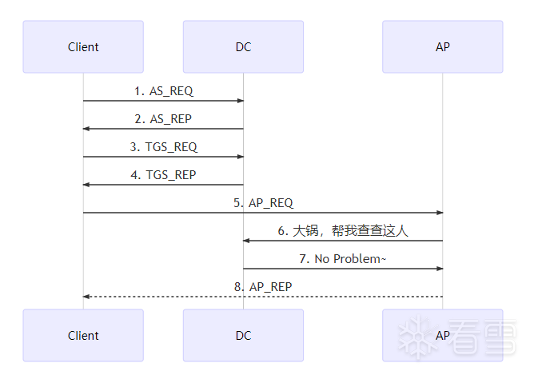

# 由浅入深理解Kerberos协议

Kerberos是一种基于票据的、集中式的网络认证协议，适用于C/S模型，由[MIT开发和实现](http://web.mit.edu/kerberos/dist/)。

这里所谓的认证，就是保证使用票据（Ticket）的用户必须是票据中指定的用户。
 
简单回忆一下，密码学涉及机密性、完整性、认证性（实体认证+消息认证）、可用性、不可否认性。kerberos认证主要为了实现认证性中的实体认证。当然，每次交互发送的消息都会包含checksum，并被对称加密（也可以配置为非对称加密），保证了完整性和机密性。

## 1. Kerberos认证

Kerberos提供了单点登录（SSO，Single Sign-On）机制，对于每个会话只需向服务进行一次自我验证，即可自动保护该会话过程中所有后续事务的安全。
 
整个认证过程涉及3方（所以以三头犬命名~）：客户端、KDC、服务端(或者说应用服务器 AP，比如 web 服务器)。

密钥分发中心KDC （Key Distribution Center）是 Kerberos 的核心组件，默认安装在域控里，由两个服务组成：

- AS(Authentication Server)，负责用户信息认证，给客户端提供TGT（Ticket Granting Tickets，即黄金票据）；
- TGS(Ticket Granting Server)，向客户端提供ST（Service Ticket，即白银票据）和Session Key（服务会话密钥）。

还有一个概念叫 `principal`，代表一个用户唯一的身份，由三部分组成：
- primary，主名称；
- instance(可选)，实例，有则说明是服务主体；
- realm，域。

以starr/admin@FOOBAR.COM这个kerberos主体为例，

- starr-->primary
- admin-->instance
- FOOBAR.COM-->realm

完整的认证流程，有客户端与 `AS`, `TGS`, `AP` 的 `3` 次交互，每次交互，响应包都会包含两条信息，一条可以用本地密钥解密，另一条需要转发。

### 1.1 认证流程v1.0


AS_REQ 请求内容如下：
```
AS_REQ =
    principal_client      // 我是谁
    + principal_server    // AP id, 又叫SPN，service principal name，标识客户端要访问的服务
    + nonce               // 随机数，用来匹配响应
    + Authenticator = encrypt(    // 可译作[认证因子]
            key=hashUser,         // 用户的NTLM hash，后续所提到作密钥的hash都是指NTLM hash
            TimeStamp             // 加密的时间戳，防御重放攻击，一般5分钟有效期
        )
```
这里省略了客户端主机名、加密类型、随机数（匹配请求和响应）等信息。

密钥所使用的 `NTLM Hash` 是 Windows 的一种基于 `MD4` 算法的散列加密算法，前身是 `LM Hash（LAN Manager Hash）`。

AS收到请求后，会从活动目录查询此用户信息，之后返回的 AS_REP 响应内容如下：
```
AS_REP =
    T1 = encrypt(                  //客户端收到后可以解密
            key = hashUser,        // 使用用户hash作为加密密钥
            content = principal_server    // AP id
                + SessionKeyAP    //用户与服务的会话密钥，即Service Session Key
                + nonce           // 随机数
        )
    +T2 = encrypt(
            key = hashAP,        // 用 AP 的hash作为密钥，转发给 AP 后可以解密
            content = principal_client    // 客户端ID
                + SessionKeyAP            // 同一个会话密钥也要转发给AP
        )
```
每个域控都有一个 `krbtgt` 账户，创建域控时自动生成。

之所以 KDC 能用客户端、服务端的密钥 `hash` 加密数据包，顾名思义，是因为密钥分发中心（KDC）有所有 `principal` 的密钥 `hash`。`AS` 收到请求后也会用用户的 `hash` 来解密认证因子获取时间戳，确认请求没有过期。

客户端收到 `AS` 的响应后，从 `AS_REP.T1` 解密出自己与服务的会话密钥，并转发 `AS_REP.T2` 给服务, 作为认证：
```
AP_REQ =
    T2    // 转发给AP解密
    + Authenticator =              // 新的认证因子
        encrypt(
            key = SessionKeyAP,         // 客户端从AS_REP.T1解密出来的会话密钥
            content = TimeStamp         // AP用来判断是否过期，默认有效期也是5分钟
                + T2_checksum           // 校验T2完整性
        )
```

AP用自己的hash解密AP_REQ.T2后，至少要确认以下几件事：

- 用 `T2.SessionKeyAP` 会话密钥解密 `AP_REQ.Authenticator`；
- 读取 `T2.principal_client`，可以理解成 KDC 说“此人已在我这里认证通过”，需要验证发送方是否为此人；
- 读取 `Authenticator.T2_checksum`，检查 `T2` 是否被篡改；
- 读取 `Authenticator.TimeStamp`，检查是否过期。

到这里已经可以看出，AP不是通过与KDC交互来完成认证，而是通过解密客户端的请求来进行认证。

密码学的认证问题和现实生活中很多场景都非常相似，比如像质检这样的第三方权威机构，通过给货物贴上有类似“检验通过”字样的、高度防伪的标识，来发挥作用。

AP认证完成后，会发送 `enc(SessionKeyAP, TimeStamp)` 作为 `AP_REP` 通知客户端认证完成。这一步是可选的，双向认证时才会有。

那么v1.0现在存在的缺陷是什么呢？试想如果要访问几个服务，那么客户端就要多次访问AS来重复认证，频繁传输用户的密钥会增加被窃听的风险，既不合理也不安全。
 
如果使用长时间不变的值作密钥，比如这里的用户口令hash，那就可能在某一天被破解，是不安全的，使用临时密钥才是正解。

### 1.2 认证流程v2.0

v1.0 域控已经配备了 `AS`，现在要加上 `TGS`，构成完整的 KDC。

可以理解成在景区买那种联票，用身份证在AS完成身份证明，有效期内去 TGS 取票口出示联票，就能取出景区门票（应该还算恰当吧~），这样就省去了多次认证。

注意AS和TGS都在域控服务器上，所以流程仍然涉及三方（下面的图没有体现出来）：


AS_REQ 相比 v1.0, 把 `principal_server` 换成了 `tgs`，即 `principal_tgs`，也就是用来告诉 `AS`，我要去找 `TGS` 服务取票。

当然 AS_REP 响应也有了变化（请看注释部分）：
```
AS_REP =
    T1 = encrypt(
            key = hashUser,
            content = principal_tgs    // tgs id，告知去哪领票
                + SessionKeyTGS        // 用户与TGS的会话密钥，即Login Session Key
                + nonce
                + TGTExpirationTime    // TGT默认有效期8小时
        )
    +TGT = encrypt(                    // 带着它去领票
            key = hashKrbtgt ,         // 密钥用krbtgt账户的hash，TGS可以解密
            content = SessionKeyTGS    // 同一个会话密钥也要转发给TGS   
                + principal_client
                + TGTExpirationTime       
                + enc(key = hashKrbtgt, PAC)    // pac被krbtgt_hash密钥加密了两次，v3.0再提它
        )
```

客户端收到响应后，解密 `AS_REP.T1`，并缓存 `Login Session Key` 和 `TGT`（统称为凭证，credentials）。

这里我将 `T2` 改名为 `TGT`，也就是黄金票据(票据许可票据)。

然后客户端向 TGS 发出请求。再次强调，每次交互，都会收到两条信息，一条（T1）可以用本地密钥解密，另一条(TGT)需要转发。
```
TGS_REQ = 
    principal_client
    + principal_server        // AP id，告知TGS我要访问哪个服务
    + TGT                     // 转发给TGS解密
    + nonce
    + Authenticator =          // TGS解密TGT后再解密这个认证因子
         encrypt(
             key = SessionKeyTGS,    // 客户端从T1解密出来的会话密钥
            content = TimeStamp      // 验证TGT是否过期，防止重放
                + TGT_checksum       // 验证TGT是否被篡改
         )
```

这里之所以 TGT 能被 TGS 解密，是因为 TGS 和 AS 在同一服务器上，数据库中有 Krbtgt 用户的 hash，即 TGT 的加密密钥。

TGS用hashKrbtgt解密TGT后，同样要确认以下几件事：

- 用 `TGT.SessionKeyTGS` 解密 Authenticator；
- 读取 `TGT.principal_client`，验证发送方是否为此人；
- 读取 `Authenticator.TGT_checksum`，检查TGT是否被篡改；
- 读取 `Authenticator.TimeStamp`，检查是否过期。

认证完成就到了 TGS 发放 ST（Service/Silver Ticket，即白银票据，服务票据）一步了:
```
TGS_REP =
    T3 = encrypt(
        key = SessionKeyTGS,      // 客户端可以用login session key解密
        content = principal_server
            + SessionKeyAP        //  客户端与AP的会话密钥, 即Service Session Key
            + nonce
            + STExpirationTime
    )
    + ST= encrypt(        // 白银票据
        key = hashAP,     //  AP可以解密
        content = SessionKeyAP
            + principal_client
            + enc(key = hashKrbtgt, PAC)    // 源于TGT
            + STExpirationTime
    )
```

客户端再次收到两条信息，一条（T3）用收到 AS_REP 时缓存的 SessionKeyTGS 解密，于是得到了与 AP 的会话密钥，另一条（ST）转发给 AP：
```

AP_REQ =
    ST                                // 转发白银票据, 由AP解密
    + Authenticator =                 
         encrypt(
             key = SessionKeyAP,
            content = principal_client
                + TimeStamp           // 验证ST是否过期，防止重放
                + TGT_checksum        // 验证ST是否被篡改
         )
```

AP用自己的 hash 解密ST后，取出 SessionKeyAP，验收发送方、checksum 和时间戳（和TGS_REQ那一步一样）。认证通过后返给客户端 AP_REP, 告知可以开始愉快地交流了。
 
1、2 两步发生在用户首次登录时，3、4 发生在请求访问新的服务时。

### 1.3 认证流程v3.0(完整)



KDC(AS+TGS)的角色常常由DC担任, 现在上图把AS和TGS合并为DC，简单提一下AP和DC的交互。

到第5步，客户端已经证明自己是自己了，v1.0部分也提到，AP不是通过与KDC交互来完成认证，但AP为了确认凭客户端的身份，是否有权限访问服务，就需要向KDC确认。

再看一下ST的内容，里面有被 `krbtgt hash` 加密过的 `PAC（Privilege Attribute Certificate）`，即特权访问证书，包含了当前用户的 SID，用户组，UNC路径等信息。它会作为token保留在客户端与AP的会话中，而AP就是把 PAC 信息发给KDC来确认的，而 KDC 会将确认结果通过 RPC 返回给 AP。
 
有些服务并没有验证 PAC 这一步。

## 2. 抓包

### 2.1 环境

- Windows 2012 R2， 域内IP 192.168.1.1
- Windows 7 x86 pro， 域内IP 192.168.1.2

域名：`foobar.domain`

域环境的搭建此处就省略了。看下win7上的环境：
```

C:\Users\foo>ipconfig /all
 
Windows IP 配置
 
   主机名  . . . . . . . . . . . . . : win7
   主 DNS 后缀 . . . . . . . . . . . : foobar.domain
   节点类型  . . . . . . . . . . . . : 混合
   IP 路由已启用 . . . . . . . . . . : 否
   WINS 代理已启用 . . . . . . . . . : 否
   DNS 后缀搜索列表  . . . . . . . . : foobar.domain
                                       localdomain
...
以太网适配器 本地连接:
   ...
   IPv4 地址 . . . . . . . . . . . . : 192.168.1.2(首选)
   子网掩码  . . . . . . . . . . . . : 255.255.255.0
   ...
   DNS 服务器  . . . . . . . . . . . : 192.168.1.1
...
C:\Users\foo>whoami
foobar\foo
```

Win2012：
```

C:\Windows\System32>ipconfig
 
Windows IP 配置
 
以太网适配器 Ethernet0:
   ...
   IPv4 地址 . . . . . . . . . . . . : 192.168.1.1
   子网掩码  . . . . . . . . . . . . : 255.255.255.0
   ...
```

在win2012上安装好wireshark，监听Ethernet0网卡。Win7登录foo用户（如已登录，注销即可），win2012那边就会抓到包，停止抓包，过滤条件填kerberos即可。
 
> PS：真实数据包的结构与上面的伪代码有差异。

### 2.2 与AS的交互

先看AS请求：


再看下req-body：


然后看下响应，先看黄金票据：


其中，etype加密类型是根据请求包里支持的加密类型来选择的。
 
在ticket下面的enc-part就是用用户foo的hash加密的与TGS的会话密钥、随机数、有效期等信息。
 
而上面的padata，类型变成了pA-ETYPE-INFO2，在RFC4120里有详细描述：
> When the AS server is to include pre-authentication data in a KRB-ERROR or in an AS-REP, it MUST use PA-ETYPE-INFO2, not PA-ETYPE-INFO.

没有细究，就不截图了。
 
另外可以记一下，在传输层，目标端口是88，就不截图了。

### 2.3 与TGS的交互

客户端发出的tgs请求包：


客户端收到的tgs的响应包：


### 2.4 与AP的交互

在wireshark列表里是看不见ap-req, ap-rep两个包的，因为这个交互过程集成在与服务的第一次请求中。为了查看ap-req, 不需要改变wireshark的过滤器，只需要在列表中找一个不是KRB5协议的数据包，里面就会有ap-req和ap-rep。
 
比如，DCERPC协议包中的目录访问服务：


响应：


这些服务，在前面的tgs-req包的sname字段中都是可以找到的。
 
对LDAP协议不太了解，不知道为什么 DCERPC 和 LDAP 两种包里都会有LDAP服务的请求和响应，如果有哪位 师傅知道，欢迎留言赐教。


其它的，还有SMB协议中的cifs服务请求与响应：


## 3. Kerberos一些攻击方式

很多攻击方式我本人其实还没有实践过，只是简单梳理一下。

### 3.1 AS-REQ阶段

三种手法：PTH (Pass The Hash), 用户枚举，密码喷洒。

- PTH: HASH传递攻击（Pass The Hash, PTH），捕获用户的密码hash来做身份验证，获取TGT，横向访问其它主机。
  
  场景：内网渗透中要横向移动，但获取不到明文口令。

- 域内用户枚举及密码喷洒
  和web爆破原理类似，根据响应包返回码来判断是否爆破成功：

  

  登录一个不存在的域用户：

  

  登录密码错误：

  

  当然域策略可以设置密码尝试次数，超过则锁定账户。
 
  针对SPN，也可以枚举一下，看看目标域有哪些服务。

### 3.2 AS-REP阶段

针对黄金票据的攻击发生在这一阶段。因为TGT黄金票据是由krbtgt用户的hash加密的，所以如果我们获取了这个hash，就可以用mimikatz伪造任意TGT。

总共需要以下信息：

- 要伪造的域用户（名称、hash），一般是域管理员；
- 域名；
- 域的SID；
- krbtgt用户的hash。

注意不是为了提权或者横移。因为如 v3.0 中 AP 与 DC 的交互部分所说，权限是目标账户本身、或者所在用户组决定的。

此类攻击方法被称为票据传递攻击(Pass the Ticket,PtT)。

黄金、白银票据主要为了维持权限，尤其是黄金票据，是后门的万能钥匙。

### 3.3 TGS-REP阶段

#### Kerberoasting

域上的任何经过身份验证的用户，只要TGT没问题，就能够从TGS处根据SPN请求ST，然后进行暴力破解。
 
SPN格式：SERVICE/host.name。可以用Windows自带的SetSPN.exe查询SPN, 命令为setspn -Q */*。
 
之后，可以用mimikatz指定服务目标、导出ST，用tgsrepcrack破解，相关工具有很多。

#### 白银票据

TGS生成的ST虽然只能访问特定的服务，但不依赖KDC，所以相比伪造黄金票据动静更小。
 
ST用AP的hash加密，如果获取了这个hash，就可以伪造ST，进而跳过KDC的认证，直接和AP通信。
 
总共需要以下信息：

- 域用户名称、hash；
- 域名；
- 域的SID；
- 目标AP的服务名、ntlm hash等。

其实这也属于票据传递攻击。

需要注意，伪造的ST是不带kdc签名的，所以如果目标要验证签名（也就是V3.0所说的AP与KDC的交互），那就GG了。
 
也可以尝试碰撞一下AP的hash来破解ST，成功率较小（所以更别提破解TGT了）。

### 3.4 委派（delegation）

假设用户A访问服务B，请求服务的资源C，但是服务B没有资源C，那么服务B就需要以用户A的身份去访问另外一台机器去获取资源C，再响应到用户A。
 
如果服务B的服务账户开启了非约束委派，那么当用户A访问服务B的时候，用户A的TGT会被发送给服务B，服务B就能够以用户A的身份去访问用户A能够访问的任意服务。
 
setspn工具可以设置服务账户。

如果我们已经拿到管理员的TGT（PTT），使用mimikatz导入后就可以实现对非约束委派的攻击。
 
Windows2003引入了约束委派，以及两个Kerberos扩展协议S4u2self和S4u2Proxy：
S4U2self（service for user to self）使服务B可以代表用户A向KDC请求一个可转发的ST；

S4U2proxy（service for user to proxy）使服务B可以通过可转发的ST代表用户A访问请求目标服务的ST，而不能访问其它服务。

这个过程共申请了两个ST。
 
Mimikatz的作者还提供了一个工具叫kekeo，它可以先发起一次AS-REQ请求tgt，再发起两次TGS-REQ请求两个ST，那么用mimikatz导入目标ST后就可以实现对约束委派的攻击。

## Reference

- [由浅入深理解Kerberos协议](https://mp.weixin.qq.com/s/0CdROpu_AQroqHVg_qZKRQ)
- [Kerberos Protocol Extensions | Microsoft Docs](https://docs.microsoft.com/en-us/openspecs/windows_protocols/ms-kile/2a32282e-dd48-4ad9-a542-609804b02cc9)
- [Kerberos协议探索系列](https://www.anquanke.com/post/id/171552)
- [RFC 4120 - The Kerberos Network Authentication Service (V5) (ietf.org)](https://datatracker.ietf.org/doc/html/rfc4120/)
- [Pre-authentication Data | Microsoft Docs](https://docs.microsoft.com/en-us/openspecs/windows_protocols/ms-kile/ae60c948-fda8-45c2-b1d1-a71b484dd1f7)
- [浅析 Kerberos 认证过程以及黄金票据和白银票据 | K0rz3n's Blog](https://bbs.pediy.com/thread-272145.htm)
- [一文搞定Kerberos - 知乎 (zhihu.com)](https://zhuanlan.zhihu.com/p/266491528)
- [内网渗透测试：Kerberos 协议& Kerberos 认证原理 - FreeBuf网络安全行业门户](https://www.freebuf.com/articles/network/273725.html)
- [Kerberos: An Authentication Service for Computer Networks (isi.edu)](http://gost.isi.edu/publications/kerberos-neuman-tso.htm)
- [Windows协议学习-Kerberos协议(上)_白帽子技术/思路_i春秋社区-分享你的技术，为安全加点温度. (ichunqiu.com)](https://bbs.ichunqiu.com/thread-61557-1-1.html)
- [Kerberos从0到1 - 知乎 (zhihu.com)](https://zhuanlan.zhihu.com/p/420834577)
- [Kerberos协议探索系列之委派篇 - FreeBuf网络安全行业门户](https://www.freebuf.com/articles/system/198381.html)