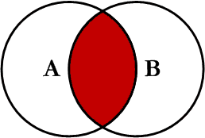

## 一张图看懂 SQL 的各种 JOIN 用法

### 0. SQL JOIN 图

下图展示了 LEFT JOIN、RIGHT JOIN、INNER JOIN、OUTER JOIN 相关的 7 种用法。


### 1. 数据准备

```
 create table websites
 (
   id int,
   name varchar(200),
   url varchar(200),
   alexa int,
   country varchar(4)
 );
 
 insert into websites values(1,'Google', null,1, 'USA');
 insert into websites values(2, '淘宝','https://www.taobao.com',13,'CN');
 insert into websites values(3, 'runoob','https://www.runoob.com',4689,'CN');
 insert into websites values(4, 'weibo','https://www.weibo.com',20,'CN');
 insert into websites values(5, 'Facebook', null,3,'USA');
 insert into websites values(7, 'Stackoverflow', null, 0,'IND');
 
 create table access_log
 (
   aid int,
   site_id int,
   count int,
   date date
 );
 
 insert into access_log values(1, 1, 45, '2016-05-10');
 insert into access_log values(2, 3, 100, '2016-05-13');
 insert into access_log values(3, 1, 230, '2016-05-14');
 insert into access_log values(4, 2, 10, '2016-05-14');
 insert into access_log values(5, 5, 205, '2016-05-14');
 insert into access_log values(6, 4, 13, '2016-05-15');
 insert into access_log values(7, 3, 220, '2016-05-15');
 insert into access_log values(8, 5, 545, '2016-05-16');
 insert into access_log values(9, 3, 201, '2016-05-17');
```

### 2. JOIN 详解

### 2.1 Inner JOIN



用法：

```
SELECT <select_list>
FROM Table_A A
INNER JOIN Table_B B
ON A.Key = B.Key
```

示例：

```
select websites.id, websites.name, access_log.count, access_log.date
FROM websites
INNER JOIN access_log
ON websites.id = access_log.site_id;
```

输出：

```
 id |   name   | count |    date
----+----------+-------+------------
  1 | Google   |    45 | 2016-05-10
  3 | runoob   |   100 | 2016-05-13
  1 | Google   |   230 | 2016-05-14
  2 | 淘宝     |    10 | 2016-05-14
  5 | Facebook |   205 | 2016-05-14
  4 | weibo    |    13 | 2016-05-15
  3 | runoob   |   220 | 2016-05-15
  5 | Facebook |   545 | 2016-05-16
  3 | runoob   |   201 | 2016-05-17
(9 rows)
```

### 2.2 Left JOIN


用法：

```
SELECT <select_list>
FROM Table_A A
LEFT JOIN Table_B B
ON A.Key = B.Key
```

示例：

```
select websites.id, websites.name, access_log.count, access_log.date
FROM websites
LEFT JOIN access_log
ON websites.id = access_log.site_id;
```

输出：

```
 id |     name      | count |    date
----+---------------+-------+------------
  1 | Google        |    45 | 2016-05-10
  3 | runoob        |   100 | 2016-05-13
  1 | Google        |   230 | 2016-05-14
  2 | 淘宝          |    10 | 2016-05-14
  5 | Facebook      |   205 | 2016-05-14
  4 | weibo         |    13 | 2016-05-15
  3 | runoob        |   220 | 2016-05-15
  5 | Facebook      |   545 | 2016-05-16
  3 | runoob        |   201 | 2016-05-17
  7 | Stackoverflow |       |
(10 rows)
```

### 2.3 Right JOIN


用法：

```
SELECT <select_list>
FROM Table_A A
RIGHT JOIN Table_B B
ON A.Key = B.Key
```

示例：

```
select websites.id, websites.name, access_log.count, access_log.date
FROM websites
RIGHT JOIN access_log
ON websites.id = access_log.site_id;
```

输出：

```
 id |   name   | count |    date
----+----------+-------+------------
  1 | Google   |    45 | 2016-05-10
  3 | runoob   |   100 | 2016-05-13
  1 | Google   |   230 | 2016-05-14
  2 | 淘宝     |    10 | 2016-05-14
  5 | Facebook |   205 | 2016-05-14
  4 | weibo    |    13 | 2016-05-15
  3 | runoob   |   220 | 2016-05-15
  5 | Facebook |   545 | 2016-05-16
  3 | runoob   |   201 | 2016-05-17
(9 rows)
```


### 2.4 Outer JOIN


用法：

```
SELECT <select_list>
FROM Table_A A
FULL OUTER JOIN Table_B B
ON A.Key = B.Key
```

示例：

```
select websites.id, websites.name, access_log.count, access_log.date
FROM websites
FULL OUTER JOIN access_log
ON websites.id = access_log.site_id;
```

输出：

```
 id |     name      | count |    date
----+---------------+-------+------------
  1 | Google        |    45 | 2016-05-10
  3 | runoob        |   100 | 2016-05-13
  1 | Google        |   230 | 2016-05-14
  2 | 淘宝          |    10 | 2016-05-14
  5 | Facebook      |   205 | 2016-05-14
  4 | weibo         |    13 | 2016-05-15
  3 | runoob        |   220 | 2016-05-15
  5 | Facebook      |   545 | 2016-05-16
  3 | runoob        |   201 | 2016-05-17
  7 | Stackoverflow |       |
(10 rows)
```

### 2.5 Left Excluding JOIN


用法：

```
SELECT <select_list>
FROM Table_A A
LEFT JOIN Table_B B
ON A.Key = B.Key
WHERE B.Key IS NULL
```

示例：

```
select websites.id, websites.name, access_log.count, access_log.date
FROM websites
LEFT JOIN access_log
ON websites.id = access_log.site_id
where access_log.count > 100;
```

输出：

```
 id |   name   | count |    date
----+----------+-------+------------
  1 | Google   |   230 | 2016-05-14
  5 | Facebook |   205 | 2016-05-14
  3 | runoob   |   220 | 2016-05-15
  5 | Facebook |   545 | 2016-05-16
  3 | runoob   |   201 | 2016-05-17
(5 rows)
```


### 2.6 Right Excluding JOIN


用法：

```
SELECT <select_list>
FROM Table_A A
RIGHT JOIN Table_B B
ON A.Key = B.Key
WHERE A.Key IS NULL
```

示例：

```
select websites.id, websites.name, access_log.count, access_log.date
FROM websites
RIGHT JOIN access_log
ON websites.id = access_log.site_id
where websites.url is NULL;
```

输出：

```

 id |   name   | count |    date
----+----------+-------+------------
  1 | Google   |    45 | 2016-05-10
  1 | Google   |   230 | 2016-05-14
  5 | Facebook |   205 | 2016-05-14
  5 | Facebook |   545 | 2016-05-16
(4 rows)
```


### 2.7 Outer Excluding JOIN


用法：

```
SELECT <select_list>
FROM Table_A A
FULL OUTER JOIN Table_B B
ON A.Key = B.Key
WHERE A.Key IS NULL OR B.Key IS NULL
```

示例：

```
select websites.id, websites.name, access_log.count, access_log.date
FROM websites
FULL OUTER JOIN access_log
ON websites.id = access_log.site_id
where websites.url is NULL or access_log.count > 10; 
```

输出：

```
 id |     name      | count |    date
----+---------------+-------+------------
  1 | Google        |    45 | 2016-05-10
  3 | runoob        |   100 | 2016-05-13
  1 | Google        |   230 | 2016-05-14
  5 | Facebook      |   205 | 2016-05-14
  4 | weibo         |    13 | 2016-05-15
  3 | runoob        |   220 | 2016-05-15
  5 | Facebook      |   545 | 2016-05-16
  3 | runoob        |   201 | 2016-05-17
  7 | Stackoverflow |       |
(9 rows)
```

### Reference

- [一张图看懂 SQL 的各种 JOIN 用法](https://www.runoob.com/w3cnote/sql-join-image-explain.html)
- [SQL 教程](https://www.runoob.com/sql/sql-tutorial.html)