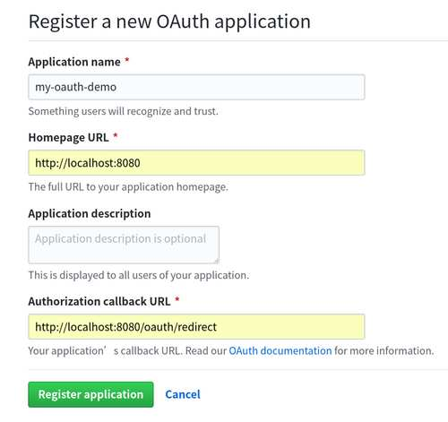

# GitHub OAuth 第三方登录示例教程
这组 OAuth 系列教程，[第一篇](http://www.ruanyifeng.com/blog/2019/04/oauth_design.html)介绍了基本概念，[第二篇](http://www.ruanyifeng.com/blog/2019/04/oauth-grant-types.html)介绍了获取令牌的四种方式，今天演示一个实例，如何通过 OAuth 获取 API 数据。

很多网站登录时，允许使用第三方网站的身份，这称为"第三方登录"。


## 一、第三方登录的原理
所谓第三方登录，实质就是 OAuth 授权。用户想要登录 A 网站，A 网站让用户提供第三方网站的数据，证明自己的身份。获取第三方网站的身份数据，就需要 OAuth 授权。

举例来说，A 网站允许 GitHub 登录，背后就是下面的流程：
1. A 网站让用户跳转到 GitHub。
2. GitHub 要求用户登录，然后询问"A 网站要求获得 xx 权限，你是否同意？"
3. 用户同意，GitHub 就会重定向回 A 网站，同时发回一个授权码。
4. A 网站使用授权码，向 GitHub 请求令牌。
5. GitHub 返回令牌.
6. A 网站使用令牌，向 GitHub 请求用户数据。

下面就是这个流程的代码实现。
## 二、应用登记
一个应用要求 OAuth 授权，必须先到对方网站登记，让对方知道是谁在请求。

所以，你要先去 GitHub 登记一下。当然，我已经登记过了，你使用我的登记信息也可以，但为了完整走一遍流程，还是建议大家自己登记。这是免费的。

访问这个[网址](https://github.com/settings/applications/new)，填写登记表。


应用的名称随便填，主页 `URL` 填写`http://localhost:8080`，跳转网址填写 `http://localhost:8080/oauth/redirect`。

提交表单以后，GitHub 应该会返回客户端 `ID（client ID）`和客户端密钥`（client secret）`，这就是应用的身份识别码。
## 三、示例仓库
我写了一个[代码仓库](https://github.com/ruanyf/node-oauth-demo)，请将它克隆到本地。
```
$ git clone git@github.com:ruanyf/node-oauth-demo.git
$ cd node-oauth-demo
```

两个配置项要改一下，写入上一步的身份识别码:
- index.js：改掉变量clientID and clientSecret
- public/index.html：改掉变量client_id

然后，安装依赖:
```
$ npm install
```

启动服务:
```
$ node index.js
```

浏览器访问`http://localhost:8080`，就可以看到这个示例了。
## 四、浏览器跳转 GitHub
示例的首页很简单，就是一个链接，让用户跳转到 GitHub:


跳转的 URL 如下:
```
https://github.com/login/oauth/authorize?
  client_id=7e015d8ce32370079895&
  redirect_uri=http://localhost:8080/oauth/redirect
```
这个 URL 指向 `GitHub` 的 `OAuth` 授权网址，带有两个参数：`client_id`告诉 `GitHub` 谁在请求，`redirect_uri`是稍后跳转回来的网址。

用户点击到了 GitHub，GitHub 会要求用户登录，确保是本人在操作。
## 五、授权码
登录后，GitHub 询问用户，该应用正在请求数据，你是否同意授权。


用户同意授权， GitHub 就会跳转到redirect_uri指定的跳转网址，并且带上授权码，跳转回来的 URL 就是下面的样子:
```
http://localhost:8080/oauth/redirect?
  code=859310e7cecc9196f4af
```
后端收到这个请求以后，就拿到了授权码（code参数）。
## 六、后端实现
示例的[后端](https://github.com/ruanyf/node-oauth-demo/blob/master/index.js)采用 `Koa` 框架编写，具体语法请看[教程](http://www.ruanyifeng.com/blog/2017/08/koa.html)。
```
const oauth = async ctx => {
  // ...
};

app.use(route.get('/oauth/redirect', oauth));
```
上面代码中，oauth函数就是路由的处理函数。下面的代码都写在这个函数里面。

路由函数的第一件事，是从 URL 取出授权码。
```
const requestToken = ctx.request.query.code;
```
## 七、令牌
后端使用这个授权码，向 GitHub 请求令牌:
```
const tokenResponse = await axios({
  method: 'post',
  url: 'https://github.com/login/oauth/access_token?' +
    `client_id=${clientID}&` +
    `client_secret=${clientSecret}&` +
    `code=${requestToken}`,
  headers: {
    accept: 'application/json'
  }
});
```
上面代码中，GitHub 的令牌接口`https://github.com/login/oauth/access_token`需要提供三个参数:
- client_id：客户端的 ID
- client_secret：客户端的密钥
- code：授权码

作为回应，GitHub 会返回一段 JSON 数据，里面包含了令牌accessToken:
```
const accessToken = tokenResponse.data.access_token;
```
## 八、API 数据
有了令牌以后，就可以向 API 请求数据了。
```
const result = await axios({
  method: 'get',
  url: `https://api.github.com/user`,
  headers: {
    accept: 'application/json',
    Authorization: `token ${accessToken}`
  }
});
```
上面代码中，GitHub API 的地址是`https://api.github.com/user`，请求的时候必须在 HTTP 头信息里面带上令牌`Authorization: token 361507da`。

然后，就可以拿到用户数据，得到用户的身份:
```
const name = result.data.name;
ctx.response.redirect(`/welcome.html?name=${name}`);
```

## Reference
- [GitHub OAuth 第三方登录示例教程](http://www.ruanyifeng.com/blog/2019/04/github-oauth.html)