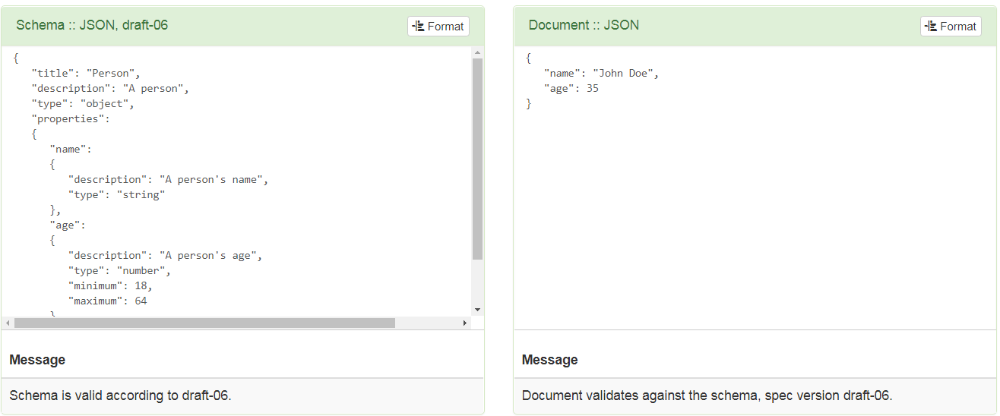
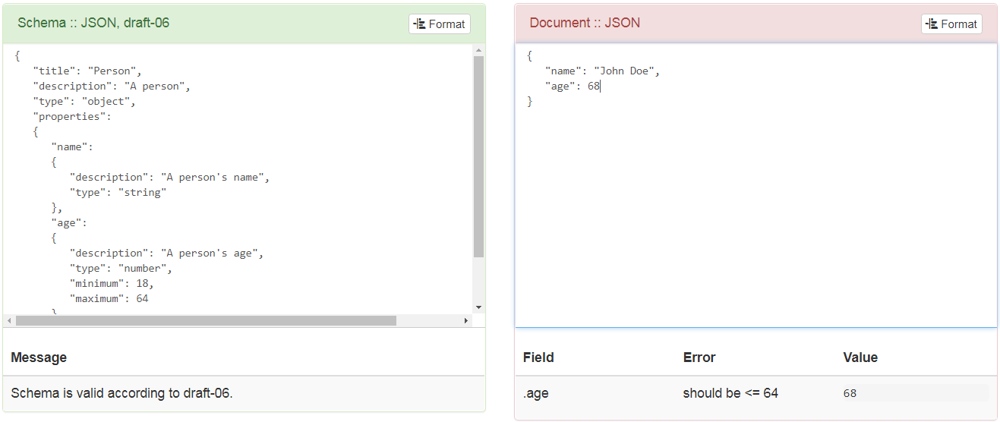

# JSON 教程
## 一 什么是 JSON
JSON (JavaScript Object Notation) 是网站数据交换使用最广泛的数据格式。数据交换可能发生在位于不同地区的或同一机器的两个不同应用之间。

好消息是 JSON 是一种易于人阅读机器也易于阅读的格式。因此应用/库可以解析 JSON 文档--人也可以查看数据并了解其含义。

所有现代编程语言（如 `Java`, `JavaScript`, `Ruby`, `C#`, `PHP`, `Python`, 和 `Groovy`）和应用平台产生（序列化）和消费（反序列化）JSON 数据提供了优秀的支持。
### 1. JSON 规范
`Douglas Crockford` 最早于 2001 年创建了 JSON，而后于 `2006` 年通过 `IETF` 在 [RFC 4627](https://www.ietf.org/rfc/rfc4627.txt)下首次标准化。`2013` Ecma 国际也在 [ECMA 404](https://www.ecma-international.org/publications/standards/Ecma-404.htm) 下标准化了 JSON。

新的规范移除了于其它 JSON 规范的不一致之处，修正了一些规范里的错误，提供了基于经验的互操作指南。
### 2. JSON 文件和 MIME 类型
在文件系统里存储 JSON 文档的标准文件类型是 `.json`。

JSON 的 Internet Assigned Numbers Authority (IANA) 媒体类型是 [application/json](https://www.iana.org/assignments/media-types/application/json)。
### 3. JSON 文档
一个 JSON 文档可能含有文本，大括号，中括号，分毫，逗号，双引号，可能还有一些其它字符。

基本上，一个有效的 JSON 文档包含两个部分：
1. 一个大括号包裹的一个对象，包含多个名称/值对。不同的语言中，它被实现为纪录（record），结构（struct），字典（dictionary），哈希表（hash table），有键列表（keyed list），或者关联数组 （associative array）。
2. 一个由中括号包裹的值的有序列表（An ordered list of values）或者数组。在大部分语言中，它被实现为 vector, list, 或 sequence.。
### 4. JSON 示例
一个 JSON 文档示例：
```
//JSON Object
{
    "employee": {
        "id": 1,
        "name": "Admin",
        "location": "USA"
    }
}
//JSON Array
{
    "employees": [
        {
            "id": 1,
            "name": "Admin",
            "location": "India"
        },
        {
            "id": 2,
            "name": "Author",
            "location": "USA"
        },
        {
            "id": 3,
            "name": "Visitor",
            "location": "USA"
        }
    ]
}
```
正如我们能够看到的，JSON 文档还有名称/值对。这些名称/值对反应了数据的结构。
### 5. 学习 JSON
在这个 JSON 教程中，我们将会学到 JSON 的各种概念以及示例：
- JSON 与 XML 的不同
- JSON 语法与文档类型
- 如何读 JSON 文档
- 如何写 JSON 文档
- 将 JSON 转换为字符串以及字符串转换为 JSON 等
## 二 JSON 语法
一个 JSON 文档可以包含由下列分隔符或记号分割的信息：
+ ":" 用于分割名称与值
+ "," 用于分割名称与值对
+ "{" 和 "}" 用于对象
+ "[" 和 "]" 用于数组
### 1. JSON 名称-值对示例
名称-值对在它们之间由一个冒号：`"name" : "value"`。

JSON 名称在冒号左边，它们需要用于用冒号包裹，如 `"name"`，它可以是任何有效的字符串。在每个对象内部，每个键必须是唯一的。

JSON 值位于冒号右边。在细粒度上，它们需要是以下6种数据类型中的一种：
- 字符串
- 数字
- 对象
- 数组
- boolean
- null 或 empty

每个名称-值对由逗号分隔，因此 JSON 看起来像这样：
```
"name" : "value", "name" : "value", "name": "value"
```
例如：
```
{
    "color" : "Purple",
    "id" : "210"
}
```
### 2. JSON 对象示例
一个 JSON 对象是一个名称-值对数据格式，典型地由大括号包围。一个 JSON 对象看起来像这样：
```
{
    "color" : "Purple",
    "id" : "210",
    "composition" : {
        "R" : 70,
        "G" : 39,
        "B" : 89
    }
}
```
### 3. JSON 数组示例
通过使用 JavaScript 数组数据可以在 JSON 内嵌套，它通过以一个值的形式传递并在数组值的首位添加中括号。

JSON 数据是有序集合且可以包含不同数据类型的值：
```
{
    "colors" :
    [
        {
        "color" : "Purple",
        "id" : "210"
        },
        {
        "color" : "Blue",
        "id" : "211"
        },
        {
        "color" : "Black",
        "id" : "212"
        }
    ]
}
```
## 三 JSON 数据类型
在细粒度级别，JSON 包括六种数据类型。前四种数据类型（string, number, boolean 和 null）可被成为简单数据类型，后两种数据类型（object 和 array）可被视为复杂数据类型。
- string
- number
- boolean
- null/empty
- object
- array

让我们逐个学习这些数据类型。
### 1. string
字符串是零个或多个 `Unicode` 字符的序列，以 `“` 和 `”` 包裹（双引号）。以单引号 `'` 包裹的字符串是无效的。
```
{
    "color" : "Purple"
}
```
JSON 字符串可以包括以下反斜杠转义字符：
- \\" – 双引号
- \\\ – 反斜杠
- \\/ – 斜杠
- \b – 回退键
- \f – 换页
- \n – 换行
- \r – 回车
- \t – 制表符
- \u – 后跟4个十六进制数
### 2. number
JSON 数字遵从 `JavaScript` 的双精度浮点数格式。
+ 以10进制表示，没有多余的前导0（如 67, 1, 100）
+ 包括 0 ~ 9 之间的数字
+ 可以是负数如 `-10`
+ 可以有一个以 `10` 为底的指数，加以前缀 `e` 或 `E`，以及一个正号或负号以指示是正或负指数
+ 8进制以及16进制不被支持
+ 没有一个值为 NaN （非数字）及 Infinity
```
{
    "number_1" : 210,
    "number_2" : -210,
    "number_3" : 21.05,
    "number_4" : 1.0E+2
}
```
## 3. boolean
Booleans 值可以为 `true` 或 `false`。布尔值无需引号包围，可被作为字符串值看待：
```
{
    "visibility" : true
}
```
### 4. null
虽然从技术上看不是一个值类型，`null` 在JSON 中是一个特殊值。当没有一个字指派给一个键时，它可被视为一个 `null`。

null 不应该被引号包围：
```
{
    "visibility" : true,
    "popularity" : null, //empty
    "id" : 210
}
```
### 5. object
+ 一个无序的名称/值对的集合，位于 {} 之间（大括号）
+ 一个对象可以包括零个或多个名称/值对
+ 多个名称/值对以逗号分隔
```
{
    "visibility" : true,
    "popularity" : "immense",
    "id" : 210
}
```
### 6. array
+ 一个无序的值的集合
+ 以  [ 开始，以 ] 结尾
+ 它的值以逗号分隔
```
{
    "ids" : ["1","2","3"]
}

//or
{
"ids" : [
        {"id" : 1},
        {"id" : 2},
        {"id" : 3}
    ]
}
```
## 四 JSON Schema
经常应用需要验证 JSON 对象的有效性，以确保必要的属性存在，以及满足了额外的验证性限制（例如价格不能少于1美元）。这些验证典型地在 JSON Schema 的背景下执行。
### 1. 语法 vs 语义验证（Syntactic vs Semantic Validation）
当没有其 Schema 时，我们验证一个 JSON 文档就仅仅只能验证其语法。语法的验证仅能保证文档时格式良好的。

工具如 [JSONLint](https://jsonlint.com/) 以及 JSON 解析器仅仅执行语法验证。

语义验证比语法验证包含更多，它执行语法检查以及数据检查。

语义验证可以帮助确保客户仅仅发送 JSON 文档允许的字段，禁止无效名/值对。

它也能帮助检查诸如一个电话号码，日期/时间，邮政编码，邮件地址以及信用卡号等的格式。
### 2. 什么是 JSON Schema？
JSON Schema 是一门语法语言用于定义结构，内容，（一定程度上）JSON 对象的语义。它让你指定元数据（关于数据的数据），用于描述对象的属性意味着什么，以及对于这些属性什么值时是有效的。

在 JSON 文档上应用语法语言的结果是 schema （蓝图）描述了JSON 对象集中根据 Schema 哪些是有效的：
1. JSON Schema 本身是一个 JSON 对象
2. JSON Schema 的语法在 http://json-schema.org 维护
3. 它描述了现存数据结构
4. 它提供了清晰的，人与机器都可读的文档
5. 它提供了完整的结构化验证，这对于自动化测试以及验证客户提交的数据是有用的
### 3. JSON Schema 验证示例
让我们考虑下面的 JSON schema：
```
{
    "$schema": "http://json-schema.org/draft-04/schema#",
    "title": "Person",
    "description": "A person",
    "type": "object",
    "properties":
    {
        "name":
        {
            "description": "A person's name",
            "type": "string"
        },
        "age":
        {
            "description": "A person's age",
            "type": "number",
            "minimum": 18,
            "maximum": 64
        }
    },
    "required": ["name", "age"]
}
```
JSON 文档：
```
{
    "name": "John Doe",
    "age": 35
}
```
JSON Schema 网站提供了对各种被编程语言（http://json-schema.org/implementations.html ）的多种验证器实现的连接。我们可以下载其实现并将其集成到我们的应用中，当然需要考虑许可证的限制。

对于给定示例，我们使用了位于 [JSONSchemaLint](http://jsonschemalint.com/)的在线验证器。
#### 3.1. 有效 JSON 文档示例

#### 3.2. 无效 JSON 文档示例 (年龄 > 64)

## 五 JSON 对象
JSON 对象数据类型以大括号包围的名称-值对列表：
1. JSON 对象非常像 javascript 对象
2. JSON 以名称/值对的方式书写
3. JSON 对象以 `{ }` 包裹
4. 键必须是字符串，值必须是一个有效的 JSON 数据类型（字符串，数字，对象，数组，布尔类型或 null）。
5. 键与值由分号分隔
6. 每个键值对以逗号分隔
### 5.1 访问对象值
你可以有两种方式访问对象值。
#### 5.1.1. 使用 `.` 号记法
```
var author = {
    "name" : "Admin",
    "age" : 36,
    "rights" : [ "admin", "editor", "contributor" ]
}

console.log( author.name );

//Output

Admin
```
#### 5.1.2. 使用 `[]` 括号记法
```
var author = {
    "name" : "Admin",
    "age" : 36,
    "rights" : [ "admin", "editor", "contributor" ]
}

console.log( author [ "name" ] );
console.log( author [ "age" ] );

//Output

Admin
36
```
### 5.2 循环迭代对象值
你可以使用 `for` 循环来迭代对象的所有值，就像迭代循环一个数组：
```
var author = {
    "name" : "Admin",
    "age" : 36,
    "rights" : [ "admin", "editor", "contributor" ]
}

//Looping

for (x in author)
{
    console.log(x + " - " + (author[x]));
}

//Output
name - Admin
age - 36
rights - admin,editor,contributor
```
### 5.3 修改对象值
可以使用下面两种方法来修改对象值。
#### 5.3.1. 使用 `.` 号记法
```
var author = {
    "name" : "Admin",
    "age" : 36,
    "rights" : [ "admin", "editor", "contributor" ]
}

author.name = "Lokesh";

console.log( author.name );

//Output

Lokesh
```
#### 5.3.2. 使用 `[]` 括号记法
```
var author = {
    "name" : "Admin",
    "age" : 36,
    "rights" : [ "admin", "editor", "contributor" ]
}

author["name"] = "Lokesh";
author["age"] = 35;

console.log( author [ "name" ] );
console.log( author [ "age" ] );

//Output

Lokesh
35
```
### 5.4 删除对象值
可以使用 `delete` 关键字来从一个 JSON 对象中删除属性：
```
delete author.name;
```
## 六 JSON 数组
和其它编程语言一样，一个 JSON 数组是一个以中国括号（`[]`）包围的元素列表。数组中的元素以逗号分隔。
- 数组从 0 开始索引
- 中括号  [...] 用于声明一个 JSON 数组
- JSON 数组是有序的值列表
- JSON 数组可以包括多种数据类型
- JSON 数组可以存储字符串，数字，布尔类型，对象，或嵌套数组
- 在 JSON 数组中，值必须以逗号分隔
- JSON 中的数组和 JavaScript 中的数组几乎一样

例如，下面是一个包含一个访问权限数组的 JSON 文档：
```
{
    "name" : "Admin",
    "age" : 36,
    "rights" : [ "admin", "editor", "contributor" ]
}
```
### 6.1 数组操作
#### 6.1.1. 从数组中得到值
你可以使用索引号来访问数组中的值：
```
x = myObj.rights[0];

// output
admin
```
#### 6.1.2. 从数组中删除值
可以使用 `delete` 关键字来从一个 数组中删除值：
```
delete myObj.rights[1];
```
#### 6.1.3. 更新数组值
使用索引号来修改数组：
```
myObj.rights[1] = "blogger";
```
#### 6.1.4. 迭代数组
可以使用 `for-in` 循环来访问数组中的值：
```
for (i in myObj.rights) 
{
    x = myObj.rights[i];
    console.log(x);
}

// output
admin
editor
contributor
```
### 6.2 多维数组
#### 6.2.1. 创建多维数组
我们可以在一个数组中存储数组，它被称为数组的数组或者多维 JSON 数组。
```
var siteInfo = {
    "name" : "blogger",
    "users" : [
        [ "admins", "1", "2" , "3"],
        [ "editors", "4", "5" , "6"],
    ]
}
```
#### 6.2.2. 迭代多维数组
一个简单的 `for` 循环以迭代一个 JSON 多维数组：
```
for (i in siteInfo.users) 
{
    for (j in siteInfo.users[i]) 
    {
        x = siteInfo.users[i][j];
        console.log(x);
    }
}

// output
admins
1
2
3
editors
4
5
6
```
## 七 JSON parse()
> JSON parse() 方法，正如其名字所说，反序列化一个 JSON 字符串表示至一个 JavaScript 对象。

JSON 字符串典型地从远端（例如，API 回复）获取，在浏览器中被用于更新用户界面。

`parse()` 方法接收 JSON 字符串，比如 API 回复，将其转换为一个 JavaScript 对象。

`parse()` 方法可以可选地在返回前使用 `reviver` 函数在返回结果对象上执行转换，
### 7.1. JSON.parse() 语法
`JSON.parse()` 的语法如下：
```
JSON.parse(string[, reviver])
```
记住 JSON 字符串是有效的 JSON 文档，否则你会得到一个语法错误。
#### 7.1.1. 方法参数
- `string` – 一个序列化的 JSON 字符串
- `reviver` – 一个可选函数，指定了解析过程产生的值在返回前如何被转化
#### 7.1.2. 返回值
如果解析成功，`parse()` 方法将返回一个 JavaScript 对象。返回值可被赋值给一个变量，转换结果可在应用稍后被引用。

如果 `string` 不是一个有效的 JSON 文档，`parse()` 将抛出一个 `SyntaxError` 异常。
### 7.2. JSON.parse() 示例
```
var jsonString = '{ "x": 5, "y": 6 }';

var obj = JSON.parse( jsonString );

console.log(obj);
```
程序输出：
```
{x: 5, y: 6}
```
### 7.3. JSON.parse() Reviver 函数示例
`reviver` 函数在解析 JSON 文档字符串的每一个名值对都会被调用，我们可以在名值对被添加到结果 JavaScript 对象之前查找并修改任意值。

在这个程序中，我们检查每个值类型，如果值是偶数我们就将其乘以2。
```
var obj = JSON.parse('{"1": 1, "2": 2, "3": {"4": 4, "5": {"6": 6}}}', (key, value) => {
    if(value % 2 == 0)
        return value * 2; //If value is even number than multiply by 2
    else
        return value; //else return original value
});
```
程序输出：
```
{1: 1, 2: 4, 3: {4: 8, 5: {6: 12}}}
```
### 7.43. JSON.parse() 与 JSON 数组
挡在一个JSON 数组字符串上应用 `parse()` 方法时，方法将返回一个 JavaScript 数组而非一个对象。
```
var jsonArrayString = '["A", "B", "C"]';

var arrObject = JSON.parse( jsonArrayString );

console.log(arrObject);;
```
程序输出：
```
["A", "B", "C"]
```
## 八 JSON stringify()
> JSON stringify() 方法，正如其名字所说，将一个 JavaScript 对象转换为一个 序列化的JSON 字符串。

`JSON.stringify()` 可以可选地使用一个 `replacer` 函数根据自定义逻辑来替换值。
### 8.1. JSON.stringify() 语法
JSON.stringify() 方法的语法如下：
```
JSON.stringify(value[, replacer[, space]])
```
#### 8.1.1.1. 方法参数
- 值（必须） – 需要被转化成一个 JSON 字符串的 JavaScript 对象
- replacer 函数 (可选) – 改变字符串化过程的函数。如果 replacer 函数未提供，对象的所有属性都会被包含在结果 JSON 字符串中
- 空格 (可选) – 用于缩进目的。一个字符串或数字处于可读性用于插入空白字符到输出 JSON 字符串。如果他是一个数字，它指示插入的空格的数目。
### 8.2. JSON.stringify() 示例
```
console.log( JSON.stringify({ x: 5, y: 6 }) );
console.log( JSON.stringify({ x: 5, y: 6 }, null, ' ') ); //with space
```
程序输出：
```
{"x":5,"y":6}

{
"x": 5,
"y": 6
}
```
### 8.3. JSON.stringify() Replacer 函数示例
```
var unmaskedData = { "name":"Lokesh", "accountNumber":"3044444444", "city":"New York"};

var maskedData = JSON.stringify( unmaskedData, maskInfo );

function maskInfo (key, value) {
    var maskedValue = value;
    if (key == "accountNumber")
    {
        if(value && value.length > 5) {
            maskedValue = "*" + maskedValue.substring(value.length - 4, value.length);
        } else {
            maskedValue = "****";
        }
    }
    return maskedValue;
}
```
程序输出：
```
{
    "name": "Lokesh",
    "accountNumber": "*4444", //Masked account number
    "city": "New York"
}
```
了解更多可阅读：[Replacer 函数使用](https://howtodoinjava.com/javascript/mask-sensitive-info-json-logs/)
### 8.4. 处理未定义值
对于未定义值，JSON.stringify() 按下列其一处理：
- 如果它是对象的一部分，放弃该值
- 如果该值属于一个数组，将值设置为 null 

在下面的例子中，name 被从序列化 JSON 中移除；同时，admins 中的未定义值被转化为 null。
```
var siteInfo = {
"name" : undefined,
"users" : [
        [ "admins", "1", "2" , undefined],
        [ "editors", "4", "5" , "6"],
    ]
}

console.log( JSON.stringify(siteInfo) );
```
程序输出：
```
{"users":[ ["admins","1","2",null], ["editors","4","5","6"] ]}
```
## 九 JSON vs XML
## 十 JSON with Ajax
## 十一 JSONPath
JSONPath 是 用于[JSON](https://restfulapi.net/introduction-to-json/)的查询语言，其特性就如同[XPath](https://howtodoinjava.com/java/xml/java-xpath-tutorial-example/)之于XML。JSONPath 用于从一个 JSON 文档选择并抽取一部分。
### 11.1. JSONPath 依赖
为了使用 JSONPath，我们需要引入它的依赖然后再使用它：
语言|依赖
--------|--------
JavaScript|[JSONPath JavaScript File](https://storage.googleapis.com/google-code-archive-downloads/v2/code.google.com/jsonpath/jsonpath-0.8.0.js.txt)
Node|`npm install JSONPath`
PHP|[JSONPath PHP include file](https://storage.googleapis.com/google-code-archive-downloads/v2/code.google.com/jsonpath/jsonpath-0.8.1.php)
Python|`pip install jsonpath-rw`
Java|[json-path](https://mvnrepository.com/artifact/com.jayway.jsonpath/json-path)
### 11.2. JSONPath 语法
一个 JsonPath 表达式以一个美元（`$`）符号开始，它引用查询的根元素。美元符后跟一系列子元素，它们以 `.` 号分隔，或者借助中括号。

重要的 JSONPath 语法规则如下：
- `$` 符号引用根对象或元素
- `@` 符号引用当前对象或元素
- `.` 操作符是点-子操作符，你可以用它指定当前元素的子元素
- `[ ]` 是下标操作符，你可以用它指定当前元素的子元素（通过名字或索引）
- `*` 操作符是一个全部匹配，无论什么名字的所有对象或元素都返回
- `,` 操作符是联合操作符，它返回子元素或索引的联合
- `:` 操作符是数组切片操作符，因此你可以使用语法`[start:end:step]`对集合切片以返回集合的子集合
- `()` 允许你利用底层脚本语言的实现传递一个脚本表达式。但不是每一种语言的 JSONPath 都支持。
- `? ()` 用于查询满足一个特定条件的所有元素
- `..` 深层扫描。 必要时在任何地方可以使用名称。
### 11.3. JSONPath 表达式示例
下面给出了 JSONPath 的两个例子：
```
$.store.book[0].title
$.store.book[*].title
$..book[3]

//or using brackets

$['store']['book'][0].['title']
$['store']['book'][*].['title']
$..['book'][3]

$.store.book[?(@.price &lt; 10)].title
```
### 11.4. 使用 JavaScript 的 JSONPath 示例
我们有下面的 JSON 文档，我们将在其上应用 JSONPath：
```
{ 
    "store": 
    {
        "book": [
            { 
                "category": "reference",
                "author": "Nigel Rees",
                "title": "Sayings of the Century",
                "price": 8.95
            },
            { 
                "category": "fiction",
                "author": "Evelyn Waugh",
                "title": "Sword of Honour",
                "price": 12.99
            },
            { 
                "category": "fiction",
                "author": "Herman Melville",
                "title": "Moby Dick",
                "isbn": "0-553-21311-3",
                "price": 8.99
            },
            { 
                "category": "fiction",
                "author": "J. R. R. Tolkien",
                "title": "The Lord of the Rings",
                "isbn": "0-395-19395-8",
                "price": 22.99
            }
        ],
        "bicycle": {
            "color": "red",
            "price": 19.95
        }
    }
}
```
#### 11.4.1. 例 1
使用 JSONPath 来找到所有作者的名字：
```
var response = jsonPath(store , "$..author").toJSONString();   // or $.store.book[*].author
```
程序输出：
```
[
"Nigel Rees",
"Evelyn Waugh",
"Herman Melville",
"J. R. R. Tolkien"
]
```
#### 11.4.2. 例 2 
使用 JSONPath 来找到书目 4 的所有细节，数组索引是基于 `0` 的：
```
var response = jsonPath(store , "$..book[3]").toJSONString();
```
程序输出：
```
[
    {
        "category":"fiction",
        "author":"J. R. R. Tolkien",
        "title":"The Lord of the Rings",
        "isbn":"0-395-19395-8",
        "price":22.99
    }
]
```
#### 11.4.3 例 3
```
book = jsonpath.jsonpath(data_json, '$..book[?(@.price<10)]')
```

## Reference 
- [JSON Tutorial](https://restfulapi.net/introduction-to-json/)
- [Introducing JSON](https://www.json.org/)
- [Learn REST](https://restfulapi.net/)
- [使用 JSONPath 解析 JSON 完整内容详解](https://blog.csdn.net/lwg_1540652358/article/details/84111339)