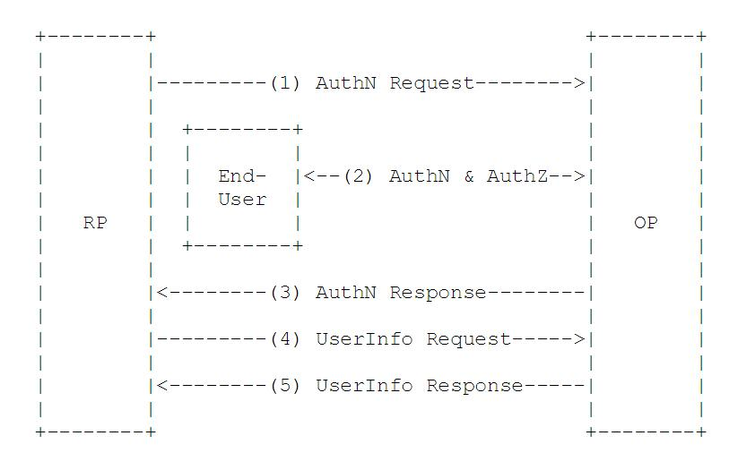
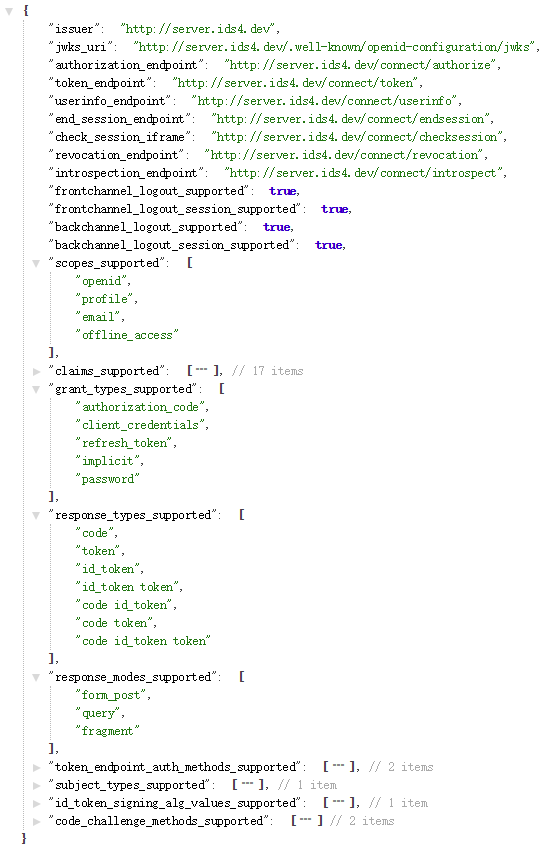
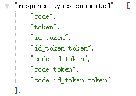
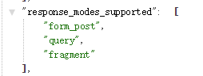
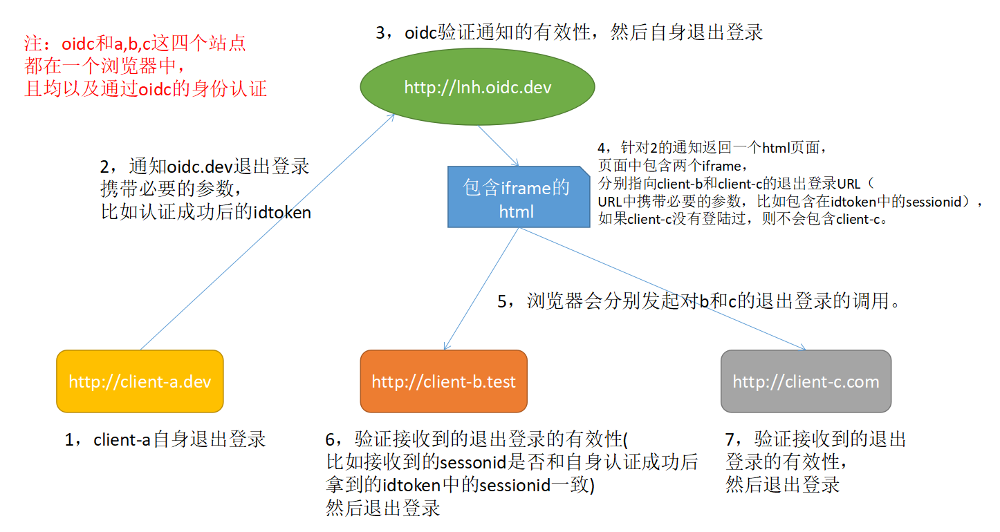
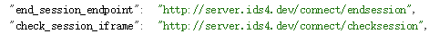
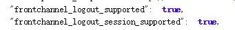

# OIDC（OpenId Connect）身份认证
## 1. 什么是OIDC？
看一下官方的介绍（http://openid.net/connect/）：
> OpenID Connect 1.0 is a simple identity layer on top of the OAuth 2.0 protocol. It allows Clients to verify the identity of the End-User based on the authentication performed by an Authorization Server, as well as to obtain basic profile information about the End-User in an interoperable and REST-like manner.

> OpenID Connect allows clients of all types, including Web-based, mobile, and JavaScript clients, to request and receive information about authenticated sessions and end-users. The specification suite is extensible, allowing participants to use optional features such as encryption of identity data, discovery of OpenID Providers, and session management, when it makes sense for them.

简单来说：OIDC是OpenID Connect的简称，OIDC=(Identity, Authentication) + OAuth 2.0。它在OAuth2上构建了一个身份层，是一个基于OAuth2协议的身份认证标准协议。我们都知道OAuth2是一个授权协议，它无法提供完善的身份认证功能（关于这一点请参考[[认证授权] 3.基于OAuth2的认证（译）](http://www.cnblogs.com/linianhui/p/authentication-based-on-oauth2.html)），OIDC使用OAuth2的授权服务器来为第三方客户端提供用户的身份认证，并把对应的身份认证信息传递给客户端，且可以适用于各种类型的客户端（比如服务端应用，移动APP，JS应用），且完全兼容OAuth2，也就是说你搭建了一个OIDC的服务后，也可以当作一个OAuth2的服务来用。应用场景如图：


OIDC已经有很多的企业在使用，比如Google的账号认证授权体系，Microsoft的账号体系也部署了OIDC，当然这些企业有的也是OIDC背后的推动者。除了这些之外，有很多各个语言版本的开源服务端组件，客户端组件等等（http://openid.net/developers/certified/）；

理解OIDC的前提是需要理解OAuth2，这里假设大家都有OAuth2的基础，不清楚的可以先阅读本系列的前几篇OAuth2的文章。
## 2. OIDC协议族
OIDC本身是有多个规范构成，其中包含一个核心的规范，多个可选支持的规范来提供扩展支持，简单的来看一下：
1. [Core](http://openid.net/specs/openid-connect-core-1_0.html)：必选。定义OIDC的核心功能，在OAuth 2.0之上构建身份认证，以及如何使用Claims来传递用户的信息。
2. [Discovery](http://openid.net/specs/openid-connect-discovery-1_0.html)：可选。发现服务，使客户端可以动态的获取OIDC服务相关的元数据描述信息（比如支持那些规范，接口地址是什么等等）。
3. [Dynamic Registration](http://openid.net/specs/openid-connect-registration-1_0.html)：可选。动态注册服务，使客户端可以动态的注册到OIDC的OP（这个缩写后面会解释）。
4. [OAuth 2.0 Multiple Response Types](http://openid.net/specs/oauth-v2-multiple-response-types-1_0.html)：可选。针对OAuth2的扩展，提供几个新的response_type。
5. [OAuth 2.0 Form Post Response Mode](http://openid.net/specs/oauth-v2-form-post-response-mode-1_0.html)：可选。针对OAuth2的扩展，OAuth2回传信息给客户端是通过URL的querystring和fragment这两种方式，这个扩展标准提供了一基于form表单的形式把数据post给客户端的机制。
6. [Session Management](http://openid.net/specs/openid-connect-session-1_0.html)：可选。Session管理，用于规范OIDC服务如何管理Session信息。
7. [Front-Channel Logout](http://openid.net/specs/openid-connect-frontchannel-1_0.html)：可选。基于前端的注销机制，使得RP（这个缩写后面会解释）可以不使用OP的iframe来退出。
8. [Back-Channel Logout](http://openid.net/specs/openid-connect-backchannel-1_0.html)：可选。基于后端的注销机制，定义了RP和OP直接如何通信来完成注销。

除了上面这8个之外，还有其他的正在制定中的扩展。看起来是挺多的，不要被吓到，其实并不是很复杂，除了Core核心规范内容多一点之外，另外7个都是很简单且简短的规范，另外Core是基于OAuth2的，也就是说其中很多东西在复用OAuth2，所以说你理解了OAuth2之后，OIDC就是非常容易理解的了，我们这里就只关注OIDC引入了哪些新的东西（Core，其余7个可选规范不做介绍，但是可能会提及到）。千言万语都不如一张图，没图你说个bird:


上图是官方给出的一个OIDC组成结构图，我们暂时只关注Core的部分，其他的部分了解是什么东西就可以了，当作黑盒来用。就像当初的AJAX一样，它其实并不是一个新的技术，而是结合很多已有的技术，按照规范的方式组合起来，就是AJAX。同理，OIDC也不是新技术，它主要是借鉴OpenId的身份标识，OAuth2的授权和JWT包装数据的方式，把这些技术融合在一起就是OIDC。
## 3. OIDC 核心概念
OAuth2提供了Access Token来解决授权第三方客户端访问受保护资源的问题；OIDC在这个基础上提供了ID Token来解决第三方客户端标识用户身份认证的问题。OIDC的核心在于在OAuth2的授权流程中，一并提供用户的身份认证信息（ID Token）给到第三方客户端，ID Token使用JWT格式来包装，得益于JWT（JSON Web Token）的自包含性，紧凑性以及防篡改机制，使得ID Token可以安全的传递给第三方客户端程序并且容易被验证。此外还提供了UserInfo的接口，用户获取用户的更完整的信息。
### 3.1 OIDC 主要术语
主要的术语以及概念介绍（完整术语参见http://openid.net/specs/openid-connect-core-1_0.html#Terminology）：
1. EU：End User：一个人类用户。
2. RP：Relying Party ,用来代指OAuth2中的受信任的客户端，身份认证和授权信息的消费方；
3. OP：OpenID Provider，有能力提供EU认证的服务（比如OAuth2中的授权服务），用来为RP提供EU的身份认证信息；
4. ID Token：JWT格式的数据，包含EU身份认证的信息。
5. UserInfo Endpoint：用户信息接口（受OAuth2保护），当RP使用Access Token访问时，返回授权用户的信息，此接口必须使用HTTPS。
### 3.2 OIDC 工作流程
从抽象的角度来看，OIDC的流程由以下5个步骤构成：
1. RP发送一个认证请求给OP；
2. OP对EU进行身份认证，然后提供授权；
3. OP把ID Token和Access Token（需要的话）返回给RP；
4. RP使用Access Token发送一个请求UserInfo EndPoint；
5. UserInfo EndPoint返回EU的Claims。


上图取自Core规范文档，其中AuthN=Authentication，表示认证；AuthZ=Authorization，代表授权。注意这里面RP发往OP的请求，是属于Authentication类型的请求，虽然在OIDC中是复用OAuth2的Authorization请求通道，但是用途是不一样的，且OIDC的AuthN请求中scope参数必须要有一个值为的openid的参数（后面会详细介绍AuthN请求所需的参数），用来区分这是一个OIDC的Authentication请求，而不是OAuth2的Authorization请求。
### 3.3 ID Token
上面提到过OIDC对OAuth2最主要的扩展就是提供了ID Token。ID Token是一个安全令牌，是一个授权服务器提供的包含用户信息（由一组Cliams构成以及其他辅助的Cliams）的JWT格式的数据结构。ID Token的主要构成部分如下（使用OAuth2流程的OIDC）:
1. iss = Issuer Identifier：必须。提供认证信息者的唯一标识。一般是一个https的url（不包含querystring和fragment部分）。
2. sub = Subject Identifier：必须。iss提供的EU的标识，在iss范围内唯一。它会被RP用来标识唯一的用户。最长为255个ASCII个字符。
3. aud = Audience(s)：必须。标识ID Token的受众。必须包含OAuth2的client_id。
4. exp = Expiration time：必须。过期时间，超过此时间的ID Token会作废不再被验证通过。
5. iat = Issued At Time：必须。JWT的构建的时间。
6. auth_time = AuthenticationTime：EU完成认证的时间。如果RP发送AuthN请求的时候携带max_age的参数，则此Claim是必须的。
7. nonce：RP发送请求的时候提供的随机字符串，用来减缓重放攻击，也可以来关联ID Token和RP本身的Session信息。
8. acr = Authentication Context Class Reference：可选。表示一个认证上下文引用值，可以用来标识认证上下文类。
9. amr = Authentication Methods References：可选。表示一组认证方法。
10. azp = Authorized party：可选。结合aud使用。只有在被认证的一方和受众（aud）不一致时才使用此值，一般情况下很少使用。

ID Token通常情况下还会包含其他的Claims（毕竟上述claim中只有sub是和EU相关的，这在一般情况下是不够的，必须还需要EU的用户名，头像等其他的资料，OIDC提供了一组公共的cliams，请移步这里http://openid.net/specs/openid-connect-core-1_0.html#StandardClaims）。另外ID Token必须使用JWS进行签名和JWE加密，从而提供认证的完整性、不可否认性以及可选的保密性。一个ID Token的例子如下：
```
{
   "iss": "https://server.example.com",
    "sub": "24400320",
    "aud": "s6BhdRkqt3",
    "nonce": "n-0S6_WzA2Mj",
    "exp": 1311281970,
    "iat": 1311280970,
    "auth_time": 1311280969,
    "acr": "urn:mace:incommon:iap:silver"
}
```
### 3.4 认证
解释完了ID Token是什么，下面就看一下OIDC如何获取到ID Token，因为OIDC基于OAuth2，所以OIDC的认证流程主要是由OAuth2的几种授权流程延伸而来的，有以下3种：
1. Authorization Code Flow：使用OAuth2的授权码来换取Id Token和Access Token。
2. Implicit Flow：使用OAuth2的Implicit流程获取Id Token和Access Token。
3. Hybrid Flow：混合Authorization Code Flow+Implici Flow。
> 这里有个小问题大家可以思考下，OAuth2中还有基于Resource Owner Password Credentials Grant和Client Credentials Grant的方式来获取Access Token，为什么OIDC没有扩展这些方式呢？

> Resource Owner Password Credentials Grant是需要用途提供账号密码给RP的，账号密码给到RP了，还要什么自行车（ID Token）。。。

> Client Credentials Grant这种方式根本就不需要用户参与，更谈不上用户身份认证了。这也能反映授权和认证的差异，以及只使用OAuth2来做身份认证的事情是远远不够的，也是不合适的。
#### 3.4.1 基于Authorization Code的认证请求
这种方式使用OAuth2的Authorization Code的方式来完成用户身份认证，所有的Token都是通过Token EndPoint（OAuth2中定义：https://tools.ietf.org/html/rfc6749#section-3.2）来发放的。构建一个OIDC的Authentication Request需要提供如下的参数：
1. scope：必须。OIDC的请求必须包含值为“openid”的scope的参数。
2. response_type：必选。同OAuth2。
3. client_id：必选。同OAuth2。
4. redirect_uri：必选。同OAuth2。
5. state：推荐。同OAuth2。防止CSRF, XSRF。

以上这5个参数是和OAuth2相同的。除此之外，还定义了如下的参数：
1. response_mode：可选。OIDC新定义的参数（[OAuth 2.0 Form Post Response Mode](http://openid.net/specs/oauth-v2-form-post-response-mode-1_0.html)），用来指定Authorization Endpoint以何种方式返回数据。
2. nonce：可选。ID Token中的出现的nonce就是来源于此。
3. display ： 可选。指示授权服务器呈现怎样的界面给EU。有效值有（page，popup，touch，wap），其中默认是page。page=普通的页面，popup=弹出框，touch=支持触控的页面，wap=移动端页面。
4. prompt：可选。这个参数允许传递多个值，使用空格分隔。用来指示授权服务器是否引导EU重新认证和同意授权（consent，就是EU完成身份认证后的确认同意授权的页面）。有效值有（none，login，consent，select_account）。none=不实现现任何认证和确认同意授权的页面，如果没有认证授权过，则返回错误login_required或interaction_required。login=重新引导EU进行身份认证，即使已经登录。consent=重新引导EU确认同意授权。select_account=假如EU在授权服务器有多个账号的话，允许EU选择一个账号进行认证。
5. max_age：可选。代表EU认证信息的有效时间，对应ID Token中auth_time的claim。比如设定是20分钟，则超过了时间，则需要引导EU重新认证。
6. ui_locales：可选。用户界面的本地化语言设置项。
7. id_token_hint：可选。之前发放的ID Token，如果ID Token经过验证且是有效的，则需要返回一个正常的响应；如果有误，则返回对应的错误提示。
8. login_hint：可选。向授权服务器提示登录标识符，EU可能会使用它登录(如果需要的话)。比如指定使用用户使用blackheart账号登录，当然EU也可以使用其他账号登录，这只是类似html中input元素的placeholder。
9. acr_values：可选。Authentication Context Class Reference values，对应ID Token中的acr的Claim。此参数允许多个值出现，使用空格分割。

以上是基于Authorization Code方式的OIDC的认证请求所需的参数。在OIDC的其他认证流程中也会有其他的参数或不同的参数值（稍有差异）。一个简单的示例如下：
```
GET /authorize?
    response_type=code
    &scope=openid%20profile%20email
    &client_id=s6BhdRkqt3
    &state=af0ifjsldkj
    &redirect_uri=https%3A%2F%2Fclient.example.org%2Fcb HTTP/1.1
  Host: server.example.com
```
也可以是一个基于302的重定向方式。
#### 3.4.2 基于Authorization Code的认证请求的响应
在授权服务器接收到认证请求之后，需要对请求参数做严格的验证，具体的规则参见http://openid.net/specs/openid-connect-core-1_0.html#AuthRequestValidation，验证通过后引导EU进行身份认证并且同意授权。在这一切都完成后，会重定向到RP指定的回调地址，并且把code和state参数传递过去。比如：
```
HTTP/1.1 302 Found
  Location: https://client.example.org/cb?code=SplxlOBeZQQYbYS6WxSbIA&state=af0ifjsldkj
```
#### 3.4.3 获取ID Token
RP使用上一步获得的code来请求Token EndPoint，这一步同OAuth2，就不再展开细说了。然后Token EndPoint会返回响应的Token，其中除了OAuth2规定的部分数据外，还会附加一个id_token的字段。id_token字段就是上面提到的ID Token。例如：
```
HTTP/1.1 200 OK
  Content-Type: application/json
  Cache-Control: no-store
  Pragma: no-cache

  {
   "access_token": "SlAV32hkKG",
   "token_type": "Bearer",
   "refresh_token": "8xLOxBtZp8",
   "expires_in": 3600,
   "id_token": "eyJhbGciOiJSUzI1NiIsImtpZCI6IjFlOWdkazcifQ.ewogImlzc
     yI6ICJodHRwOi8vc2VydmVyLmV4YW1wbGUuY29tIiwKICJzdWIiOiAiMjQ4Mjg5
     NzYxMDAxIiwKICJhdWQiOiAiczZCaGRSa3F0MyIsCiAibm9uY2UiOiAibi0wUzZ
     fV3pBMk1qIiwKICJleHAiOiAxMzExMjgxOTcwLAogImlhdCI6IDEzMTEyODA5Nz
     AKfQ.ggW8hZ1EuVLuxNuuIJKX_V8a_OMXzR0EHR9R6jgdqrOOF4daGU96Sr_P6q
     Jp6IcmD3HP99Obi1PRs-cwh3LO-p146waJ8IhehcwL7F09JdijmBqkvPeB2T9CJ
     NqeGpe-gccMg4vfKjkM8FcGvnzZUN4_KSP0aAp1tOJ1zZwgjxqGByKHiOtX7Tpd
     QyHE5lcMiKPXfEIQILVq0pc_E2DzL7emopWoaoZTF_m0_N0YzFC6g6EJbOEoRoS
     K5hoDalrcvRYLSrQAZZKflyuVCyixEoV9GfNQC3_osjzw2PAithfubEEBLuVVk4
     XUVrWOLrLl0nx7RkKU8NXNHq-rvKMzqg"
  }
```
其中看起来一堆乱码的部分就是JWT格式的ID Token。在RP拿到这些信息之后，需要对id_token以及access_token进行验证（具体的规则参见http://openid.net/specs/openid-connect-core-1_0.html#IDTokenValidation和http://openid.net/specs/openid-connect-core-1_0.html#ImplicitTokenValidation）。至此，可以说用户身份认证就可以完成了，后续可以根据UserInfo EndPoint获取更完整的信息。
#### 3.4.4 Implicit Flow和Hybrid Flow
Implicit Flow的工作方式是在OAuth2 Implicit Flow上附加提供id_token，当然，认证请求的参数和基于Authorization Code的流程稍有不同，具体的差异参见http://openid.net/specs/openid-connect-core-1_0.html#ImplicitAuthRequest，这里就不做详细介绍了。

Hybrid Flow则=Authorization Code Flow+Implicit Flow，也不再详细介绍了。
### 3.5 UserInfo Endpoint
UserIndo EndPoint是一个受OAuth2保护的资源。在RP得到Access Token后可以请求此资源，然后获得一组EU相关的Claims，这些信息可以说是ID Token的扩展，比如如果你觉得ID Token中只需包含EU的唯一标识sub即可（避免ID Token过于庞大），然后通过此接口获取完整的EU的信息。此资源必须部署在TLS之上，例如：
```
GET /userinfo HTTP/1.1
  Host: server.example.com
  Authorization: Bearer SlAV32hkKG
```
成功之后响应如下：
```
HTTP/1.1 200 OK
  Content-Type: application/json

  {
   "sub": "248289761001",
   "name": "Jane Doe",
   "given_name": "Jane",
   "family_name": "Doe",
   "preferred_username": "j.doe",
   "email": "janedoe@example.com",
   "picture": "http://example.com/janedoe/me.jpg"
  }
```
其中sub代表EU的唯一标识，这个claim是必须的，其他的都是可选的。
## 4. 总结
继OAuth2之后，感觉OIDC也要大放异彩了。其本身是一个完全开放的标准，而且兼容众多的已有的IDP（身份提供商），比如基于SAML的、基于WS-Federation的等等已有的身份认证系统，都可以作为OIDC的OP存在。总结一下OIDC有那些特性和好处吧：
+ OIDC使得身份认证可以作为一个服务存在。
+ OIDC可以很方便的实现SSO（跨顶级域）。
+ OIDC兼容OAuth2，可以使用Access Token控制受保护的API资源。
+ OIDC可以兼容众多的IDP作为OIDC的OP来使用。
+ OIDC的一些敏感接口均强制要求TLS，除此之外，得益于JWT,JWS,JWE家族的安全机制，使得一些敏感信息可以进行数字签名、加密和验证，进一步确保整个认证过程中的安全保障。
## 5. Example
笔者基于IdentityServer3和IdentitySever4（两者都是基于OIDC的一个.NET版本的开源实现）写的一个集成SSO，API访问授权控制，QQ联合登陆（作为OP）的demo：https://github.com/linianhui/oidc.example 。
## 6. OIDC Discovery 规范
顾名思义，Discovery定义了一个服务发现的规范，它定义了一个api（ /.well-known/openid-configuration ），这个api返回一个json数据结构，其中包含了一些OIDC中提供的服务以及其支持情况的描述信息，这样可以使得oidc服务的RP可以不再硬编码OIDC服务接口信息。这个api返回的示例信息如下（这里面只是一部分，更完整的信息在官方的规范中有详细的描述和解释说明：http://openid.net/specs/openid-connect-discovery-1_0.html）：


相信大家都看得懂的，它包含有授权的url，获取token的url，注销token的url，以及其对OIDC的扩展功能支持的情况等等信息，这里就不再详细解释每一项了。
## 7. OAuth2 扩展：Multiple Response Types
在本系列的第一篇博客[认证授权] 1.OAuth2授权中解释OAuth2的授权请求的时候，其请求参数中有一个 response_type 的参数，其允许的值有 code 和 token 两个，在这两个的基础上，OIDC增加了一个新值 id_token （详细信息定义在http://openid.net/specs/oauth-v2-multiple-response-types-1_0.html）：
- code：oauth2定义的。用于获取authorization_code。
- token：oauth2定义的。用户获取access_token。
- id_token：OIDC定义的。用户获取id_token。

至此OIDC是支持三种类型的response_type的，不但如此，OIDC还允许了可以组合这三种类型，即在一个response_type中包含多个值（空格分隔）。比如当参数是这样的时候 response_type=id_token token ，OIDC服务就会把access_token和id_token一并给到调用方。OIDC对这些类型的支持情况体现在上面提到的Discovery服务中返回的response_types_supported字段中：


## 8. Form Post Response Mode
在oauth2的授权码流程中，当response_type设置为code的时候，oauth2的授权服务会把authorization_code通过url的query部分传递给调用方，比如这样“https://client.lnh.dev/oauth2-callback?code=SplxlOBeZQQYbYS6WxSbIA&state=xyz”。

在oauth2的隐式授权流程中，当response_type设置为token的时候，oauth2的授权服务会直接把access_token通过url的fragment部分传递给调用方，比如这样“http://client.lnh.dev/oauth2-callback#access_token=2YotnFZFEjr1zCsicMWpAA&state=xyz&expires_in=3600”；

在oauth2中，上面的两种情况是其默认行为，并没有通过参数来显示的控制。OIDC在保持oauth2的默认行为的基础上，增加了一个名为response_mode的参数，并且增加了一种通过form表单传递信息的方式，即form_post（详细信息定义在http://openid.net/specs/oauth-v2-form-post-response-mode-1_0.html）。OIDC服务对这个扩展的支持情况体现在上面提到的Discovery服务中返回的response_modes_supported字段中：



当reponse_mode设置为form_post的时候，OIDC则会返回如下的信息：
```
  <html>
   <head><title>Submit This Form</title></head>
   <body onload="javascript:document.forms[0].submit()">
    <form method="post" action="https://client.lnh.dev/oidc-callback">
      <input type="hidden" name="state"
       value="DcP7csa3hMlvybERqcieLHrRzKBra"/>
      <input type="hidden" name="id_token"
       value="eyJhbGciOiJSUzI1NiIsImtpZCI6IjEifQ.eyJzdWIiOiJqb2huIiw
         iYXVkIjoiZmZzMiIsImp0aSI6ImhwQUI3RDBNbEo0c2YzVFR2cllxUkIiLC
         Jpc3MiOiJodHRwczpcL1wvbG9jYWxob3N0OjkwMzEiLCJpYXQiOjEzNjM5M
         DMxMTMsImV4cCI6MTM2MzkwMzcxMywibm9uY2UiOiIyVDFBZ2FlUlRHVE1B
         SnllRE1OOUlKYmdpVUciLCJhY3IiOiJ1cm46b2FzaXM6bmFtZXM6dGM6U0F
         NTDoyLjA6YWM6Y2xhc3NlczpQYXNzd29yZCIsImF1dGhfdGltZSI6MTM2Mz
         kwMDg5NH0.c9emvFayy-YJnO0kxUNQqeAoYu7sjlyulRSNrru1ySZs2qwqq
         wwq-Qk7LFd3iGYeUWrfjZkmyXeKKs_OtZ2tI2QQqJpcfrpAuiNuEHII-_fk
         IufbGNT_rfHUcY3tGGKxcvZO9uvgKgX9Vs1v04UaCOUfxRjSVlumE6fWGcq
         XVEKhtPadj1elk3r4zkoNt9vjUQt9NGdm1OvaZ2ONprCErBbXf1eJb4NW_h
         nrQ5IKXuNsQ1g9ccT5DMtZSwgDFwsHMDWMPFGax5Lw6ogjwJ4AQDrhzNCFc
         0uVAwBBb772-86HpAkGWAKOK-wTC6ErRTcESRdNRe0iKb47XRXaoz5acA"/>
    </form>
   </body>
  </html>
```
这是一个会在html加载完毕后，通过一个自动提交的form表单，把id_token，access_token，authorization_code或者其他的相关数据POST到调用方指定的回调地址上。
## 9. OIDC 会话管理
综合上篇提到的idtoken和前面的discovery服务以及针对oauth2的扩展，则可以让OIDC服务的RP完成用户认证的过程。那么如何主动的撤销这个认证呢（也就是我们常说的退出登录）？总结来说就是其认证的会话管理，OIDC单独定义了3个独立的规范来完成这件事情：
+ [Session Management](http://openid.net/specs/openid-connect-session-1_0.html)：可选。Session管理，用于规范OIDC服务如何管理Session信息。
+ [Front-Channel Logout](http://openid.net/specs/openid-connect-frontchannel-1_0.html)：可选。基于前端的注销机制。
+ [Back-Channel Logout](http://openid.net/specs/openid-connect-backchannel-1_0.html)：可选。基于后端的注销机制。

其中Session Management是OIDC服务自身管理会话的机制；Back-Channel Logout则是定义在纯后端服务之间的一种注销机制，应用场景不多，这里也不详细解释了。这里重点关注一下Front-Channel Logout这个规范（http://openid.net/specs/openid-connect-frontchannel-1_0.html），它的使用最为广泛，其工作的具体的流程如下（结合Session Management规范）：



在上图中的2和3属于session management这个规范的一部。其中第2步中，odic的退出登录的地址是通过Discovery服务中返回的end_session_endpoint字段提供的RP的。其中还有一个check_session_iframe字段则是供纯前端的js应用来检查oidc的登录状态用的。



4567这四步则是属于front-channel logout规范的一部分，OIDC服务的支持情况在Discovery服务中也有对应的字段描述：



4567这一部分中重点有两个信息：
- RP退出登录的URL地址（这个在RP注册的时候会提供给OIDC服务）；
- URL中的sessionid这个参数，这个参数一般是会包含在idtoken中给到OIDC客户端，或者在认证完成的时候以一个独立的sessionid的参数给到OIDC客户端，通常来讲都是会直接把它包含在IDToken中以防止被篡改。
## 10. 总结
本篇博客介绍了OIDC的发现服务，OAuth2的两个扩展规范，以及OIDC管理会话的机制。至此则可以构成一个完整的认证和退出的流程。其中有一点需要特别注意，这个流程中用到的token是OIDC定义的IDToken，IDToken，IDToken（重要要的事情说三遍），而不是OAuth2中定义的Access Token，千万不要混淆这两者，它们是有着本质的区别的（这一点在[认证授权] 3.基于OAuth2的认证（译）和[认证授权] 4.OIDC（OpenId Connect）身份认证授权（核心部分）中都有解释）。

## Reference
- [OIDC（OpenId Connect）身份认证（核心部分）](https://www.cnblogs.com/linianhui/p/openid-connect-core.html)
- [OIDC（OpenId Connect）身份认证（扩展部分）](https://www.cnblogs.com/linianhui/p/openid-connect-extension.html)
- [JWT](https://tools.ietf.org/html/rfc7519)
- [JWS](https://tools.ietf.org/html/rfc7515)
- [JWE](https://tools.ietf.org/html/rfc7516)
- 视频: [Identity, Authentication + OAuth = OpenID Connect](https://www.youtube.com/watch?v=Kb56GzQ2pSk)
- [基于OIDC（OpenID Connect）的SSO](https://www.cnblogs.com/linianhui/p/oidc-in-action-sso.html)