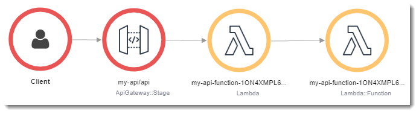
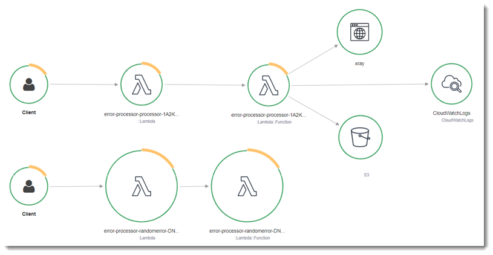
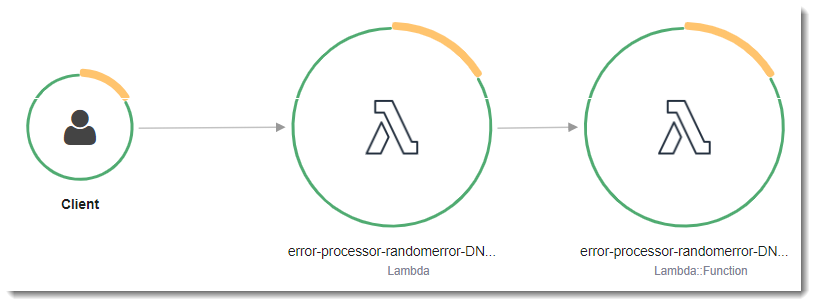
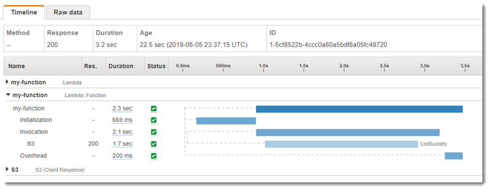

# AWS Lambda Building with Go

Go 的实施方式与其他托管式运行时系统不同。由于 Go 可编译为原生代码，因此 Lambda 将 Go 视为自定义运行时系统。建议您使用 `provided.al2` 运行时系统将 Go 函数部署到 Lambda。

### Go 运行时系统支持

Lambda 的 `Go 1.x` 托管式运行时系统基于 `Amazon Linux AMI（AL1）`。Lambda 将继续支持 `Go 1.x` 托管式运行时系统，直到2023年12月31日结束对 Amazon Linux AMI 的维护支持。如果您使用的是 `Go 1.x` 运行时系统，则必须将函数迁移到 `provided.al2`。此迁移无需更改任何代码。唯一需要进行的更改涉及如何构建部署包以及使用哪个运行时系统来创建函数。有关更多信息，请参阅 [.zip 程序包](https://docs.aws.amazon.com/zh_cn/lambda/latest/dg/golang-package.html)和[容器映像](https://docs.aws.amazon.com/zh_cn/lambda/latest/dg/go-image.html)的部署说明。

名称|标识符|操作系统|架构|弃用（阶段 1）
----|----|----|----|----
Go 1.x|go1.x|Amazon Linux|x86_64|2023年12月31日

与 `go1.x` 相比，`provided.al2` 运行时系统具有多种优势，包括支持 `arm64` 架构（`AWS Graviton2` 处理器）、二进制文件更小以及调用时间稍快。

名称|标识符|操作系统|架构|弃用（阶段 1）
----|----|----|----|----
自定义运行时|provided.al2|Amazon Linux 2|x86_64，arm64|
自定义运行时|provided|Amazon Linux|x86_64|2023年12月31日

### 工具和库

**Lambda 为 Go 运行时提供了以下工具和库**

- [适用于 Go 的 AWS 开发工具包](https://github.com/aws/aws-sdk-go)：适用于 Go 编程语言的官方 AWS 开发工具包。
- [github.com/aws/aws-lambda-go/lambda](https://github.com/aws/aws-lambda-go/tree/master/lambda)：适用于 Go 的 Lambda 编程模型的实现。AWS Lambda 使用此程序包调用您的[处理程序](https://docs.aws.amazon.com/zh_cn/lambda/latest/dg/golang-handler.html)。
- [github.com/aws/aws-lambda-go/lambdacontext](https://github.com/aws/aws-lambda-go/tree/master/lambdacontext)：用于帮助访问[上下文对象](https://docs.aws.amazon.com/zh_cn/lambda/latest/dg/golang-context.html)中的上下文信息。
- [github.com/aws/aws-lambda-go/events](https://github.com/aws/aws-lambda-go/tree/master/events)：此库提供常见事件源集成的类型定义。
- [github.com/aws/aws-lambda-go/cmd/build-lambda-zip](https://github.com/aws/aws-lambda-go/tree/master/cmd/build-lambda-zip)：此工具可用于在 Windows 上创建 .zip 文件存档。

有关更多信息，请参阅 GitHub 上的 [aws-lambda-go](https://github.com/aws/aws-lambda-go)。

**Lambda 为 Go 运行时提供了以下示例应用程序**

Go 中的 Lambda 应用程序示例:

- [go-al2](https://github.com/aws-samples/sessions-with-aws-sam/tree/master/go-al2)：返回公有 IP 地址的 `hello world` 函数。此应用程序使用 `provided.al2` 自定义运行时系统。
- [blank-go](https://github.com/awsdocs/aws-lambda-developer-guide/tree/main/sample-apps/blank-go) – 此 Go 函数显示 Lambda 的 Go 库、日志记录、环境变量和 AWS SDK 的使用情况。此应用程序使用 `go1.x` 运行时系统。

## AWS Lambda function handler in Go

Lambda 函数处理函数 `handler` 是函数代码中处理事件的方法。当调用函数时，Lambda 运行 `handler` 方法。您的函数会一直运行，直到 `handler` 返回响应、退出或超时。

在 Go 中 Lambda 函数被编写为 Go 可执行文件。在 Lambda 函数代码中，您需要包含 `github.com/aws/aws-lambda-go/lambda` 程序包，该程序包将实现适用于 Go 的 Lambda 编程模型。此外，您需要实现 `handler` 函数代码和 一个 main() 函数。

```
package main

import (
	"context"
	"fmt"
	"github.com/aws/aws-lambda-go/lambda"
)

type MyEvent struct {
	Name string `json:"name"`
}

func HandleRequest(ctx context.Context, event *MyEvent) (*string, error) {
	if event == nil {
		return nil, fmt.Errorf("received nil event")
	}
	message := fmt.Sprintf("Hello %s!", event.Name)
	return &message, nil
}

func main() {
	lambda.Start(HandleRequest)
}
```

这里是函数的示例输入：

```
{
  "name": "Jane"
}
```

请注意以下几点：

- **package main**：在 Go 中，包含 `func main()` 的程序包必须始终名为 `main`。
- **import**：您可以使用它来包含 Lambda 函数所需的库。在此实例中，它包括：
  + **上下文**：[Go 中的 AWS Lambda上下文对象](https://docs.aws.amazon.com/lambda/latest/dg/golang-context.html)。
  + **fmt**：用于格式化您的函数返回的值的 Go [格式化](https://golang.org/pkg/fmt/)对象。
  + `github.com/aws/aws-lambda-go/lambda`：如前所述，您可以用它来实现适用于 Go 的 Lambda 编程模型。

- **func HandleRequest(ctx context.Context, name MyEvent) (string, error)**：这是您的 Lambda 处理程序签名。它是 Lambda 的主要入口点，且包括你的代码被执行时的主要逻辑。此外，包含的参数表示以下含义：
  + **ctx context.Context**：为您的 Lambda 函数调用提供运行时信息。`ctx` 是您声明的变量，用于访问通过[Go 中的 AWS Lambda上下文对象](https://docs.aws.amazon.com/lambda/latest/dg/golang-context.html)提供的信息。
  + **event \*MyEvent**：名为 `event` 的参数指向 `MyEvent`，它代表了 Lambda 函数的输入。
  + **string, error**：处理器返回两个值：第一个结果指向一个 Lambda 函数结果的字符串；第二个结果是一个 `error` 类型，当没有错误时它是 `nil`，如果有错误发生则它包含一个[标准错误](https://golang.org/pkg/builtin/#error)信息。有关自定义错误处理的更多信息，请参阅[Go 中的 AWS Lambda 函数错误](https://docs.aws.amazon.com/lambda/latest/dg/golang-exceptions.html)。
  + **return &message, nil**：返回两个值。第一个指向一条字符串消息，它是使用输入事件中的 `Name` 字段构造的欢迎消息；第二个值 `nil` 则指示函数没遇到任何错误。

- **func main()**：这是运行您的 Lambda 函数代码的入口点。该项为必填项。
  通过在 **func main(){}** 代码括号之间添加 `lambda.Start(HandleRequest)`，可以执行您的 Lambda 函数。按照 Go 语言标准，开括号即 `{` 必须直接置于 `main` 函数签名末尾。

### 命名

#### provided.al2 运行时系统

对于使用 [.zip 部署包](https://docs.aws.amazon.com/lambda/latest/dg/golang-package.html)中的 `provided.al2` 运行时系统的 Go 函数，包含函数代码的可执行文件必须命名为 `bootstrap`。对于在[容器映像](https://docs.aws.amazon.com/lambda/latest/dg/go-image.html#go-image-al2)中使用 `provided.al2` 运行时系统的 Go 函数，可执行文件可以使用任何名称。

处理程序(handler)可以使用任何名称。要在代码中引用处理程序值，可以使用 `_HANDLER` 环境变量。

#### go1.x 运行时系统

对于使用 `go1.x` 运行时系统的 Go 函数，可执行文件和处理程序可以共享任何名称。例如，如果您将处理程序的值设置为 `Handler`，Lambda 将在 `Handler` 可执行文件中调用该 `main()` 函数。

要在 Lambda 控制台中更改函数处理程序名称，请在 `Runtime settings`（运行时设置）窗格中，选择 `Edit`（编辑）。

### 使用结构化类型的 Lambda 函数处理程序

在上述示例中，输入类型是简单的字符串。但是，您也可以将结构化事件传递到您的函数处理程序：

```
package main

import (
	"fmt"
	"github.com/aws/aws-lambda-go/lambda"
)

type MyEvent struct {
	Name string `json:"What is your name?"`
	Age  int    `json:"How old are you?"`
}

type MyResponse struct {
	Message string `json:"Answer"`
}

func HandleLambdaEvent(event *MyEvent) (*MyResponse, error) {
	if event == nil {
		return nil, fmt.Errorf("received nil event")
	}
	return &MyResponse{Message: fmt.Sprintf("%s is %d years old!", event.Name, event.Age)}, nil
}

func main() {
	lambda.Start(HandleLambdaEvent)
}
```

下面是该函数的一个示例输入：

```
{
    "What is your name?": "Jim",
    "How old are you?": 33
}
```

而响应将如下所示：

```
{
    "Answer": "Jim is 33 years old!"
}
```

若要导出，事件结构中的字段名称必须大写。有关来自AWS事件源的处理事件的更多信息，请参阅 [aws-lambda-go/events](https://github.com/aws/aws-lambda-go/tree/master/events)。

### 有效处理程序签名

在 Go 中构建 Lambda 函数处理程序时，您有多个选项，但您必须遵守以下规则：

- 处理程序必须为函数。
- 处理程序可能需要 0 到 2 个参数。如果有两个参数，则第一个参数必须实现 `context.Context`。
- 处理程序可能返回 0 到 2 个参数。如果有一个返回值，则它必须实现 `error`。如果有两个返回值，则第二个值必须实现 `error`。有关实现错误处理信息的更多信息，请参阅 [Go 中的 AWS Lambda 函数错误](https://docs.aws.amazon.com/lambda/latest/dg/golang-exceptions.html)。

下面列出了有效的处理程序签名。`TIn` 和 `TOut` 表示类型与 `encoding/json` 标准库兼容。有关更多信息，请参阅 [func Unmarshal](https://golang.org/pkg/encoding/json/#Unmarshal) 以了解如何反序列化这些类型。

```
func ()
func () error
func (TIn) error
func () (TOut, error)
func (context.Context) error
func (context.Context, TIn) error
func (context.Context) (TOut, error)
func (context.Context, TIn) (TOut, error)
```

### 使用全局状态

您可以声明并修改独立于 Lambda 函数的处理程序代码的全局变量。此外，您的处理程序可能声明一个 `init` 函数，该函数在加载您的处理程序时执行。AWS Lambda 的这种行为方式与标准 Go 程序一样。您的 Lambda 函数的单个实例绝不会同时处理多个事件。

使用全局状态的 Go 函数示例：
> 代码使用了 AWS SDK for Go V2。更多信息，请参见[AWS SDK for Go V2 入门指南](https://aws.github.io/aws-sdk-go-v2/docs/getting-started/)

```
package main
 
import (
    "log"
    "github.com/aws/aws-lambda-go/lambda"
    "github.com/aws/aws-sdk-go/aws/session"
    "github.com/aws/aws-sdk-go/service/s3"
    "github.com/aws/aws-sdk-go/aws"
)
 
var invokeCount = 0
var myObjects []*s3.Object
func init() {
    svc := s3.New(session.New())
    input := &s3.ListObjectsV2Input{
            Bucket: aws.String("examplebucket"),
    }
    result, _ := svc.ListObjectsV2(input)
    myObjects = result.Contents
}
 
func LambdaHandler() (int, error) {
    invokeCount = invokeCount + 1
    log.Print(myObjects)
    return invokeCount, nil
}
 
func main() {
    lambda.Start(LambdaHandler)
}
```

## 上下文

当 Lambda 运行您的函数时，它会将上下文对象传递到[处理程序](https://docs.aws.amazon.com/lambda/latest/dg/golang-handler.html)。此对象提供的方法和属性包含有关调用、函数和执行环境的信息。

Lambda 上下文库提供以下全局变量、方法和属性。

#### 全局变量

- `FunctionName` – Lambda 函数的名称。
- `FunctionVersion` – 函数的版本。
- `MemoryLimitInMB` – 为函数分配的内存量。
- `LogGroupName` – 函数的日志组。
- `LogStreamName` – 函数实例的日志流。

#### 上下文方法

- `Deadline` – 返回执行超时的日期（Unix 时间格式，以毫秒为单位）。

#### 上下文属性

- `InvokedFunctionArn` – 用于调用函数的 `Amazon Resource Name (ARN)`。表明调用者是否指定了版本号或别名。
- `AwsRequestID` – 调用请求的标识符。
- `Identity` –（移动应用程序）有关授权请求的 `Amazon Cognito` 身份的信息。
- `ClientContext` –（移动应用程序）客户端应用程序提供给 Lambda 的客户端上下文。

### 访问调用上下文信息

Lambda 函数可以访问有关其环境和调用请求的元数据。这可以在[程序包上下文](https://golang.org/pkg/context/)处访问。如果您的处理程序将 `context.Context` 作为参数包含在内，则 Lambda 会将有关您的函数的信息插入上下文的 `Value` 属性。请注意，您需要导入 `lambdacontext` 库才能访问 `context.Context` 对象的内容。

```
package main
 
import (
    "context"
    "log"
    "github.com/aws/aws-lambda-go/lambda"
    "github.com/aws/aws-lambda-go/lambdacontext"
)
 
func CognitoHandler(ctx context.Context) {
    lc, _ := lambdacontext.FromContext(ctx)
    log.Print(lc.Identity.CognitoIdentityPoolID)
}
 
func main() {
    lambda.Start(CognitoHandler)
}
```

在上述示例中，`lc` 是用于使用 `context` 对象捕获的信息的变量，`log.Print(lc.Identity.CognitoIdentityPoolID)` 将输出该信息 (在本例中为 `CognitoIdentityPoolID`)。

以下示例介绍了如何使用上下文对象来监控您的 Lambda 函数完成任务所需的时间。这让您能够分析性能期望并相应地调整您的函数代码 (如果需要)。

```
package main

import (
    "context"
    "log"
    "time"
    "github.com/aws/aws-lambda-go/lambda"
)

func LongRunningHandler(ctx context.Context) (string, error) {
    deadline, _ := ctx.Deadline()
    deadline = deadline.Add(-100 * time.Millisecond)
    timeoutChannel := time.After(time.Until(deadline))

    for {

        select {
            case <- timeoutChannel:
                return "Finished before timing out.", nil

            default:
                log.Print("hello!")
                time.Sleep(50 * time.Millisecond)
        }
    }
}

func main() {
    lambda.Start(LongRunningHandler)
}
```

## 部署 .zip 文件归档

您的 AWS Lambda 函数代码由脚本或编译的程序及其依赖项组成。您可以使用部署程序包将函数代码部署到 Lambda。Lambda 支持两种类型的部署程序包：容器镜像和 .zip 文件归档。

本页将介绍如何创建 `.zip` 文件作为 Go 运行时系统的部署包，然后使用 `.zip` 文件通过 `AWS Management Console`、`AWS Command Line Interface（AWS CLI）` 和 `AWS Serverless Application Model（AWS SAM）` 将函数代码部署到 AWS Lambda。

请注意，Lambda 使用 POSIX 文件权限，因此在创建 .zip 文件归档之前，您可能需要[为部署包文件夹设置权限](https://aws.amazon.com/premiumsupport/knowledge-center/lambda-deployment-package-errors/)。

### 在 macOS 和 Linux 上创建 .zip 文件

以下步骤显示如何使用 go build 命令编译可执行文件并为 Lambda 创建 .zip 文件部署包。在编译代码之前，请确保您已从 `GitHub` 安装 lambda 程序包。此模块提供运行时系统接口的实现，用于管理 Lambda 与函数代码之间的交互。要下载此库，请运行以下命令。

```
go get github.com/aws/aws-lambda-go/lambda
```

如果您的函数使用 AWS SDK for Go，请下载标准的开发工具包模块集以及应用程序所需的任何 AWS 服务 API 客户端。要了解如何安装适用于 Go 的开发工具包，请参阅 [AWS SDK for Go V2 入门](https://aws.github.io/aws-sdk-go-v2/docs/getting-started/)。

#### 使用 provided.al2 运行时系统（推荐）

Go 的实施方式与其他托管式运行时系统不同。由于 Go 可编译为原生代码，因此 Lambda 将 Go 视为自定义运行时系统。建议您使用 `provided.al2` 运行时系统将 Go 函数部署到 Lambda。

**创建 .zip 部署包（macOS/Linux）**

1. 在包含应用程序的 `main.go` 文件的项目目录中，编译可执行文件。请注意以下几点：
   
   + 可执行文件必须命名为 `bootstrap`。有关更多信息，请参阅[命名](https://docs.aws.amazon.com/lambda/latest/dg/golang-handler.html#golang-handler-naming)。
  + 设置目标指令集架构。`provided.al2` 运行时系统支持 `arm64` 和 `x86_64`。
  + 您可以使用可选的 `lambda.norpc` 标签排除 lambda 库的远程过程调用（RPC）组件。只有在使用 Go 1.x 运行时系统时才需要 RPC 组件。排除 RPC 会减小部署包的大小。

  对于 arm64 架构：
  ```
  GOOS=linux GOARCH=arm64 go build -tags lambda.norpc -o bootstrap main.go
  ```
  对于 x86_64 架构：
  ```
  GOOS=linux GOARCH=amd64 go build -tags lambda.norpc -o bootstrap main.go
  ```
2. （可选）您可能需要使用 Linux 上的 `CGO_ENABLED=0` 编译程序包：
   ```
   GOOS=linux GOARCH=arm64 CGO_ENABLED=0 go build -o bootstrap -tags lambda.norpc main.go
   ```
   此命令为标准 C 库 (libc) 版本创建稳定的二进制程序包，这在 Lambda 和其他设备上可能有所不同。
3. 通过将可执行文件打包为 .zip 文件来创建部署程序包。
   ```
   zip myFunction.zip bootstrap
   ```
4. 创建函数。请注意以下几点：
   + 处理程序值必须是 `bootstrap`。有关更多信息，请参阅[命名](https://docs.aws.amazon.com/lambda/latest/dg/golang-handler.html#golang-handler-naming)。
   + 仅在使用 `arm64` 时，必须使用 `--architectures` 选项。默认值为 `x86_64`。
  + 对于 `--role`，指定[执行角色](https://docs.aws.amazon.com/zh_cn/lambda/latest/dg/lambda-intro-execution-role.html)的 Amazon 资源名称（ARN）。
    ```
    aws lambda create-function --function-name myFunction \
    --runtime provided.al2 --handler bootstrap 
    --architectures arm64 \
    --role arn:aws:iam::111122223333:role/lambda-ex \
    --zip-file fileb://myFunction.zip
    ```

### 在 Windows 上创建 .zip 文件

以下步骤演示如何从 GitHub 下载用于 Windows 的 [build-lambda-zip](https://github.com/aws/aws-lambda-go/tree/main/cmd/build-lambda-zip) 工具、如何编译可执行文件，以及如何创建 .zip 部署包。

> 注意：如果您尚未完成此操作，则必须安装 [git](https://git-scm.com/)，然后将 git 可执行文件添加到您的 `Windows %PATH%` 环境变量。

在编译代码之前，请确保您已从 GitHub 安装 [lambda](https://github.com/aws/aws-lambda-go/tree/master/lambda) 库。要下载此库，请运行以下命令。

```
go get github.com/aws/aws-lambda-go/lambda
```

如果您的函数使用 `AWS SDK for Go`，请下载标准的开发工具包模块集以及应用程序所需的任何 AWS 服务 API 客户端。要了解如何安装适用于 Go 的开发工具包，请参阅 [AWS SDK for Go V2 入门](https://aws.github.io/aws-sdk-go-v2/docs/getting-started/)。

#### 使用 provided.al2 运行时系统（推荐）

Go 的实施方式与其他托管式运行时系统不同。由于 Go 可编译为原生代码，因此 Lambda 将 Go 视为自定义运行时系统。建议您使用 `provided.al2` 运行时系统将 Go 函数部署到 Lambda。

**创建 .zip 部署包（Windows）**

1. 从 GitHub 下载 `build-lambda-zip` 工具。
   ```
   go install github.com/aws/aws-lambda-go/cmd/build-lambda-zip@latest
   ```
2. 使用来自 `GOPATH` 的工具创建 .zip 文件。如果您有 Go 的默认安装，则该工具通常在 `%USERPROFILE%\Go\bin` 中。否则，请导航到安装 Go 运行时的位置，然后执行以下任一操作：
   
   **cmd.exe**
   在 cmd.exe 中，根据目标[指令集架构](https://docs.aws.amazon.com/zh_cn/lambda/latest/dg/foundation-arch.html)运行以下任一命令。`provided.al2` 运行时系统支持 `arm64` 和 `x86_64`。

   您可以使用可选的 `lambda.norpc` 标签排除 [lambda 库](https://github.com/aws/aws-lambda-go/tree/master/lambda)的远程过程调用（RPC）组件。只有在使用 `Go 1.x` 运行时系统时才需要 RPC 组件。排除 RPC 会减小部署包的大小。

   **例 – 对于 x86_64 架构:**
   ```
   set GOOS=linux
   set GOARCH=amd64
   set CGO_ENABLED=0
   go build -tags lambda.norpc -o bootstrap main.go
   %USERPROFILE%\Go\bin\build-lambda-zip.exe -o myFunction.zip bootstrap
   ```

   **例 – 对于 arm64 架构**
   ```
   set GOOS=linux
   set GOARCH=arm64
   set CGO_ENABLED=0
   go build -tags lambda.norpc -o bootstrap main.go
   %USERPROFILE%\Go\bin\build-lambda-zip.exe -o myFunction.zip bootstrap
   ```

   **PowerShell**
3. 创建函数。请注意以下几点：
   + 处理程序值必须是 `bootstrap`。有关更多信息，请参阅[命名](https://docs.aws.amazon.com/lambda/latest/dg/golang-handler.html#golang-handler-naming)。
   + 仅在使用 `arm64` 时，必须使用 `--architectures` 选项。默认值为 `x86_64`。
   + 对于 `--role`，指定[执行角色](https://docs.aws.amazon.com/zh_cn/lambda/latest/dg/lambda-intro-execution-role.html)的 Amazon 资源名称（ARN）。
    ```
    aws lambda create-function --function-name myFunction \
    --runtime provided.al2 --handler bootstrap \
    --architectures arm64 \
    --role arn:aws:iam::111122223333:role/lambda-ex \
    --zip-file fileb://myFunction.zip
    ```

### 使用 .zip 文件创建和更新 Go Lambda 函数

创建 .zip 部署包后，您可以使用它来创建新的 Lambda 函数或更新现有的 Lambda 函数。您可以使用 Lambda 控制台、`AWS Command Line Interface` 和 Lambda API 部署 .zip 程序包。您也可以使用 `AWS Serverless Application Model（AWS SAM）` 和 `AWS CloudFormation` 创建和更新 Lambda 函数。

Lambda 的 .zip 部署包的最大大小为 `250MB`（已解压缩）。请注意，此限制适用于您上传的所有文件（包括任何 Lambda 层）的组合大小。

#### 使用控制台通过 .zip 文件创建和更新函数

要创建新函数，必须先在控制台中创建该函数，然后上传您的 .zip 归档。要更新现有函数，请打开函数页面，然后按照相同的步骤添加更新的 .zip 文件。

如果您的 .zip 文件小于 `50MB`，则可以通过直接从本地计算机上传该文件来创建或更新函数。对于大于 `50MB` 的 .zip 文件，必须首先将您的程序包上传到 Amazon S3 存储桶。有关如何使用 AWS Management Console 将文件上传到 Amazon S3 存储桶的说明，请参阅 [Amazon S3 入门](https://docs.aws.amazon.com/AmazonS3/latest/userguide/GetStartedWithS3.html)。要使用 AWS CLI 上传文件，请参阅《AWS CLI 用户指南》中的[移动对象](https://docs.aws.amazon.com/cli/latest/userguide/cli-services-s3-commands.html#using-s3-commands-managing-objects-move)。

> **注意** 您无法将现有容器映像函数转换为使用 .zip 归档。您必须创建新函数。

**创建新函数（控制台）**
1. 打开 Lambda 控制台的[“函数”页面](https://console.aws.amazon.com/lambda/home#/functions)，然后选择**创建函数**。
2. 选择 **Author from scratch (从头开始创作)**。
3. 在 **Basic information (基本信息)**中，执行以下操作：
   - 对于**函数名称**，输入函数的名称。
   - 对于运行时系统，根据您创建的部署包类型，选择以下选项之一：
     + 在 `Amazon Linux 2` 上提供您自己的引导程序（推荐）：选择此选项可使用 `provided.al2` 运行时系统创建函数。
     + `Go 1.x`（旧版）：此运行时系统基于 `Amazon Linux AMI（AL1）`。Lambda 将继续支持 `Go 1.x` 运行时系统，直到 2023年12月31日结束对 `Amazon Linux AMI` 的维护支持。建议您改用 `provided.al2` 运行时系统。
4. （可选）在 **Permissions（权限）**下，展开 **Change default execution role**（更改默认执行角色）。您可以创建新的执行角色，也可以使用现有角色。
5. 选择 **Create function**（创建函数）。Lambda 使用您选择的运行时系统创建基本“Hello world”函数。

**从本地计算机上传 .zip 归档（控制台）**
1. 在 Lambda 控制台的[“函数”页面](https://console.aws.amazon.com/lambda/home#/functions)中，选择要为其上传 .zip 文件的函数。
2. 选择**代码**选项卡。
3. 在**代码源**窗格中，选择从**数据源上传**。
4. 选择 **.zip 文件**。
5. 要上传 .zip 文件，请执行以下操作：
  a. 选择**上传**，然后在文件选择器中选择您的 .zip 文件。
  b. 选择 **Open**（打开）。
  c. 选择 **Save**（保存）。

**从 Amazon S3 存储桶上传 .zip 归档（控制台）**
1. 在 Lambda 控制台的[“函数”页面](https://console.aws.amazon.com/lambda/home#/functions)中，选择要为其上传 .zip 文件的函数。
2. 选择**代码**选项卡。
3. 在**代码源**窗格中，选择从**数据源上传**。
4. 选择 **Amazon S3 位置**。
5. 粘贴 .zip 文件的 Amazon S3 链接 URL，然后选择**保存**。

#### 使用 AWS CLI 通过 .zip 文件创建和更新函数

您可以使用 [AWS CLI](https://docs.aws.amazon.com/cli/latest/userguide/getting-started-install.html) 创建新函数或使用 .zip 文件更新现有函数。使用 [create-function](https://docs.aws.amazon.com/cli/latest/reference/lambda/create-function.html) 和 [update-function-code](https://docs.aws.amazon.com/cli/latest/reference/lambda/create-function.html) 命令部署 .zip 程序包。如果您的 .zip 文件小于 50MB，则可以从本地生成计算机上的文件位置上传 .zip 程序包。对于较大的文件，必须从 Amazon S3 存储桶上传 .zip 程序包。有关如何使用 AWS CLI 将文件上传到 Amazon S3 存储桶的说明，请参阅《AWS CLI 用户指南》中的[移动对象](https://docs.aws.amazon.com/cli/latest/userguide/cli-services-s3-commands.html#using-s3-commands-managing-objects-move)。

> **注意** 如果您使用 AWS CLI 从 Amazon S3 存储桶上传 .zip 文件，则该存储桶必须与您的函数位于同一个 AWS 区域中。

要通过 AWS CLI 使用 .zip 文件创建新函数，则必须指定以下内容：
- 函数的名称 (`--function-name`)
- 函数的运行时系统 (`--runtime`)
- 函数的[执行角色](https://docs.aws.amazon.com/lambda/latest/dg/lambda-intro-execution-role.html) (`--role`) 的 Amazon 资源名称（ARN）
- 函数代码 (`--handler`) 中处理程序方法的名称

还必须指定 .zip 文件的位置。如果 .zip 文件位于本地生成计算机上的文件夹中，请使用 `--zip-file` 选项指定文件路径，如以下示例命令所示。

```
aws lambda create-function --function-name myFunction \
--runtime provided.al2 --handler bootstrap \
--role arn:aws:iam::111122223333:role/service-role/my-lambda-role \
--zip-file fileb://myFunction.zip
```

要指定 .zip 文件在 `Amazon S3` 存储桶中的位置，请使用 `--code` 选项，如以下示例命令所示。您只需对版本控制对象使用 `S3ObjectVersion` 参数。

```
aws lambda create-function --function-name myFunction \
--runtime provided.al2 --handler bootstrap \
--role arn:aws:iam::111122223333:role/service-role/my-lambda-role \
--code S3Bucket=myBucketName,S3Key=myFileName.zip,S3ObjectVersion=myObjectVersion
```

要使用 CLI 更新现有函数，请使用 `--function-name` 参数指定函数的名称。您还必须指定要用于更新函数代码的 .zip 文件的位置。如果 .zip 文件位于本地生成计算机上的文件夹中，请使用 `--zip-file` 选项指定文件路径，如以下示例命令所示。

```
aws lambda update-function-code --function-name myFunction \
--zip-file fileb://myFunction.zip
```

要指定 .zip 文件在 Amazon S3 存储桶中的位置，请使用 `--s3-bucket` 和 `--s3-key` 选项，如以下示例命令所示。您只需对版本控制对象使用 `--s3-object-version` 参数。

```
aws lambda update-function-code --function-name myFunction \
--s3-bucket myBucketName --s3-key myFileName.zip --s3-object-version myObject Version
```

#### 使用 Lambda API 通过 .zip 文件创建和更新函数

要使用 .zip 文件归档创建和更新函数，请使用以下 API 操作：

- [CreateFunction](https://docs.aws.amazon.com/lambda/latest/dg/API_CreateFunction.html)
- [UpdateFunctionCode](https://docs.aws.amazon.com/lambda/latest/dg/API_UpdateFunctionCode.html)

#### 使用 AWS SAM 通过 .zip 文件创建和更新函数

AWS Serverless Application Model（AWS SAM）是一个工具包，可帮助简化在 AWS 上构建和运行无服务器应用程序的过程。您可以在 YAML 或 JSON 模板中为应用程序定义资源，并使用 AWS SAM 命令行界面（AWS SAM CLI）构建、打包和部署应用程序。当您通过 AWS SAM 模板构建 Lambda 函数时，AWS SAM 会使用您的函数代码和您指定的任何依赖项自动创建 .zip 部署包或容器映像。要了解有关使用 AWS SAM 构建和部署 Lambda 函数的更多信息，请参阅《AWS Serverless Application Model 开发人员指南》中的 [AWS SAM 入门](https://docs.aws.amazon.com/serverless-application-model/latest/developerguide/serverless-getting-started.html)。

您可以使用 AWS SAM 创建使用现有 .zip 文件归档的 Lambda 函数。要使用 AWS SAM 创建 Lambda 函数，您可以将 .zip 文件保存在 Amazon S3 存储桶或生成计算机上的本地文件夹中。有关如何使用 AWS CLI 将文件上传到 Amazon S3 存储桶的说明，请参阅《AWS CLI 用户指南》中的[移动对象](https://docs.aws.amazon.com/cli/latest/userguide/cli-services-s3-commands.html#using-s3-commands-managing-objects-move)。

在 AWS SAM 模板中，`AWS::Serverless::Function` 资源将指定 Lambda 函数。在此资源中，设置以下属性以创建使用 .zip 文件归档的函数：

- `PackageType` – 设置为 Zip
- `CodeUri` – 设置为函数代码的 Amazon S3 URI、本地文件夹的路径或 [FunctionCode](https://docs.aws.amazon.com/serverless-application-model/latest/developerguide/sam-property-function-functioncode.html) 对象
- `Runtime` – 设置为您选择的运行时系统

使用 AWS SAM，如果 .zip 文件大于 50MB，则不需要先将其上传到 Amazon S3 存储桶。AWS SAM 可以从本地生成计算机上的某个位置上传最大允许大小为 250MB（已解压缩）的 .zip 程序包。

要了解有关在 AWS SAM 中使用 .zip 文件部署函数的更多信息，请参阅《AWS SAM 开发人员指南》中的 [AWS::Serverless::Function](https://docs.aws.amazon.com/serverless-application-model/latest/developerguide/sam-resource-function.html)。


**示例：使用 AWS SAM，通过 provided.al2  构建 Go 函数**
1. 创建具有以下属性的 AWS SAM 模板：
   + **BuildMethod**：为应用程序指定编译器。使用 `go1.x`。
   + **Runtime**：使用 `provided.al2`。
   + **CodeUri**：输入代码路径。
   + **Architectures**：对于 `arm64` 架构，使用 `[arm64]`。对于 `x86_64` 指令集架构，使用 `[amd64]` 或删除 `Architectures` 属性。

   **例 template.yaml**:
   ```
   AWSTemplateFormatVersion: '2010-09-09'
   Transform: 'AWS::Serverless-2016-10-31'
   Resources:
   HelloWorldFunction:
    Type: AWS::Serverless::Function
    Metadata:
      BuildMethod: go1.x
    Properties:
      CodeUri: hello-world/ # folder where your main program resides
      Handler: bootstrap
      Runtime: provided.al2
      Architectures: [arm64]
   ```
2. 使用 [sam build](https://docs.aws.amazon.com/serverless-application-model/latest/developerguide/sam-cli-command-reference-sam-build.html) 命令编译可执行文件。
   ```
   sam build
   ```
3. 使用 [sam deploy](https://docs.aws.amazon.com/serverless-application-model/latest/developerguide/sam-cli-command-reference-sam-deploy.html) 命令将函数部署到 Lambda。
   ```
   sam deploy --guided
   ```

#### 使用 AWS CloudFormation 通过 .zip 文件创建和更新函数

您可以使用 AWS CloudFormation 创建使用 .zip 文件归档的 Lambda 函数。要从 .zip 文件创建 Lambda 函数，必须先将您的文件上传到 Amazon S3 存储桶。有关如何使用 AWS CLI 将文件上传到 Amazon S3 存储桶的说明，请参阅《AWS CLI 用户指南》中的[移动对象](https://docs.aws.amazon.com/cli/latest/userguide/cli-services-s3-commands.html#using-s3-commands-managing-objects-move)。

在 AWS CloudFormation 模板中，`AWS::Lambda::Function` 资源将指定 Lambda 函数。在此资源中，设置以下属性以创建使用 .zip 文件归档的函数：

- **PackageType** – 设置为 Zip
- **Code** – 在 `S3Bucket` 和 `S3Key` 字段中输入 Amazon S3 存储桶名称和 .zip 文件名。
- **Runtime** – 设置为您选择的运行时系统

AWS CloudFormation 生成的 .zip 文件不能超过 4MB。要了解有关在 AWS CloudFormation 中使用 .zip 文件部署函数的更多信息，请参阅《AWS CloudFormation 用户指南》中的 [AWS::Lambda::Function](https://docs.aws.amazon.com/AWSCloudFormation/latest/UserGuide/aws-resource-lambda-function.html)。

### 为依赖项创建 Go 层

> **注意** 在 Go 等编译语言中将层与函数结合使用，不一定会产生与使用 Python 等解释性语言的相同效果。由于 Go 是一种编译语言，因此函数仍然需要在初始化阶段将所有共享程序集手动加载到内存中，而这可能会增加冷启动时间。我们建议您改为在编译时包含任何共享代码，以充分利用内置编译器的优化。

本部分中的说明旨在向您展示如何将依赖项包含在层中。

Lambda 会自动检测 `/opt/lib` 目录中的任何库，以及 `/opt/bin` 目录中的任何二进制文件。为确保 Lambda 正确获取层内容，请创建包含以下结构的层：
```
custom-layer.zip
└ lib
    | lib_1
    | lib_2
└ bin
    | bin_1
    | bin_2
```
打包层后，请参阅[在 Lambda 中创建和删除层](https://docs.aws.amazon.com/zh_cn/lambda/latest/dg/creating-deleting-layers.html)和[向函数添加层](https://docs.aws.amazon.com/zh_cn/lambda/latest/dg/adding-layers.html)以完成层设置。

## 部署容器镜像

有三种方法可以为 Go Lambda 函数构建容器映像：

- [使用 provided.al2 AWS 基础映像](https://docs.aws.amazon.com/zh_cn/lambda/latest/dg/go-image.html#go-image-al2)
  Go 的实施方式与其他托管式运行时系统不同。由于 Go 可编译为原生代码，因此 Lambda 将 Go 视为自定义运行时系统。建议您使用自定义运行时系统的 [provided.al2](https://gallery.ecr.aws/lambda/provided) 基础映像，为 Lambda 构建 Go 映像。要使映像与 Lambda 兼容，您必须在映像中包含 `aws-lambda-go/lambda` 软件包。
- [使用非 AWS 基础映像](https://docs.aws.amazon.com/zh_cn/lambda/latest/dg/go-image.html#go-image-other)
  您还可以使用其它容器库的备用基础映像，例如 Alpine Linux 或 Debian。您还可以使用您的组织创建的自定义映像。要使映像与 Lambda 兼容，您必须在映像中包含 `aws-lambda-go/lambda` 软件包。
- [使用 Go 1.x AWS 基础映像（旧版）](https://docs.aws.amazon.com/zh_cn/lambda/latest/dg/go-image.html#go-image-v1)

Lambda 将继续支持 Go 1.x 基础映像，直到 2023 年 12 月 31 日结束对 Amazon Linux AMI 的维护支持。建议您[使用 provided.al2 自定义运行时系统](https://docs.aws.amazon.com/zh_cn/lambda/latest/dg/go-image.html#go-image-al2)，而不是 [Go 1.x 基础映像](https://gallery.ecr.aws/lambda/go)。

> **提示** 要缩短 Lambda 容器函数激活所需的时间，请参阅 Docker 文档中的[使用多阶段构建](https://docs.docker.com/develop/develop-images/dockerfile_best-practices/#use-multi-stage-builds)。要构建高效的容器映像，请遵循[编写 Dockerfiles 的最佳实践](https://docs.docker.com/develop/develop-images/dockerfile_best-practices/)。

本页面介绍了如何为 Lambda 构建、测试和部署容器映像。

### Go AWS 基础映像

AWS 为 Go 提供了以下基础映像：

标签|运行时|操作系统|Dockerfile|淘汰
----|----|----|----|----
1|Go 1.x|Amazon Linux|[GitHub 上适用于 Go 1.x 的 Dockerfile](https://github.com/aws/aws-lambda-base-images/blob/go1.x/Dockerfile.go1.x)|2023年12月31日

Amazon Elastic Container Registry 存储库：[gallery.ecr.aws/lambda/go](https://gallery.ecr.aws/lambda/go)

### Go 运行时系统接口客户端

`aws-lambda-go/lambda` 程序包包括运行时接口的实施。有关如何在映像中使用 `aws-lambda-go/lambda` 的示例，请参阅[使用 provided.al2 AWS 基础映像](https://docs.aws.amazon.com/zh_cn/lambda/latest/dg/go-image.html#go-image-al2)或[使用非 AWS 基础映像](https://docs.aws.amazon.com/zh_cn/lambda/latest/dg/go-image.html#go-image-other)。

### 使用 provided.al2 AWS 基础映像

Go 的实施方式与其他托管式运行时系统不同。由于 Go 可编译为原生代码，因此 Lambda 将 Go 视为自定义运行时系统。建议您使用自定义运行时系统的 `provided.al2` 基本映像，为 Go 函数构建容器映像。

标签|运行时|操作系统|Dockerfile|淘汰
----|----|----|----|----
al2|自定义运行时|Amazon Linux 2|[GitHub 上用于自定义运行时系统的 Dockerfile](https://github.com/aws/aws-lambda-base-images/blob/provided.al2/Dockerfile.provided.al2)|
alami|自定义运行时|Amazon Linux|[GitHub 上用于自定义运行时系统的 Dockerfile](https://github.com/aws/aws-lambda-base-images/blob/provided/Dockerfile.provided)|2023年12月31日

有关这些基础映像的更多信息，请参阅 `Amazon ECR Public Gallery` 中的[provided](https://gallery.ecr.aws/lambda/provided)。

您必须在 Go 处理程序中包含 `aws-lambda-go/lambda` 程序包。此程序包实施 Go 的编程模型，包括运行时系统接口。

#### 先决条件

要完成本节中的步骤，您必须满足以下条件：

- Go
- [Docker](https://docs.docker.com/get-docker)
- [AWS Command Line Interface (AWS CLI) 版本 2](https://docs.aws.amazon.com/cli/latest/userguide/getting-started-install.html)

#### 从 provided.al2 基础映像创建映像

使用 `provided.al2` 基础映像构建和部署 Go 函数。

1. 为项目创建一个目录，然后切换到该目录。
   
   ```
   mkdir hello
   cd hello
   ```
2. 初始化一个新的 Go 模块。
   ```
   go mod init example.com/hello-world
   ```
3. 添加 lambda 库作为新模块的依赖项。
   ```
   go get github.com/aws/aws-lambda-go/lambda
   ```
4. 创建一个名为 `main.go` 的文件，然后在文本编辑器中打开它。这是适用于 Lambda 函数的代码。您可以使用以下示例代码进行测试，也可以将其替换为您自己的代码。
   ```
   package main

   import (
    "context"
    "github.com/aws/aws-lambda-go/events"
    "github.com/aws/aws-lambda-go/lambda"
   )

   func handler(ctx context.Context, event events.APIGatewayProxyRequest) (events.APIGatewayProxyResponse, error) {
    response := events.APIGatewayProxyResponse{
      StatusCode: 200,
      Body:       "\"Hello from Lambda!\"",
    }
    return response, nil
   }

   func main() {
    lambda.Start(handler)
   }
   ```
5. 使用文本编辑器在项目目录中创建一个 Dockerfile。以下示例 Dockerfile 将使用[多阶段构建](https://docs.docker.com/develop/develop-images/dockerfile_best-practices/#use-multi-stage-builds)。这样便可在每个步骤中使用不同的基本映像。您可以使用一个映像（例如 [Go 基本映像](https://hub.docker.com/_/golang)）来编译代码并构建可执行二进制文件。然后，您可以在最后的 FROM 语句中使用不同的映像（例如 `provided.al2`）来定义部署到 Lambda 的映像。构建过程与最终部署映像分开，因此最终映像仅包含运行应用程序所需的文件。您可以使用可选的 `lambda.norpc` 标签排除 [lambda 库](https://github.com/aws/aws-lambda-go/tree/master/lambda)的远程过程调用（RPC）组件。只有在使用 Go 1.x 运行时系统时才需要 RPC 组件。排除 RPC 会减小部署包的大小。

   > **注意** 确保您在 Dockerfile 中指定的 Go 版本（例如 golang:1.20）与用于创建应用程序的 Go 版本相同。

   ```
   FROM golang:1.20 as build
   WORKDIR /helloworld
   # Copy dependencies list
   COPY go.mod go.sum ./
   # Build with optional lambda.norpc tag
   COPY main.go .
   RUN go build -tags lambda.norpc -o main main.go
   # Copy artifacts to a clean image
   FROM public.ecr.aws/lambda/provided:al2
   COPY --from=build /helloworld/main ./main
   ENTRYPOINT [ "./main" ]
   ```

6. 使用 [docker build](https://docs.docker.com/engine/reference/commandline/build/) 命令构建 Docker 镜像。以下示例将镜像命名为 `docker-image` 并为其提供 `test` [标签](https://docs.docker.com/engine/reference/commandline/build/#tag)。
   ```
   docker build --platform linux/amd64 -t docker-image:test .
   ```

   > **注意** 该命令指定了 **--platform linux/amd64** 选项，可确保无论生成计算机的架构如何，容器始终与 Lambda 执行环境兼容。如果打算使用 `ARM64` 指令集架构创建 Lambda 函数，请务必将命令更改为使用 **--platform linux/arm64** 选项。

#### （可选）在本地测试镜像

使用[运行时系统接口仿真器](https://docs.aws.amazon.com/zh_cn/lambda/latest/dg/images-test.html)在本地测试镜像。`provided.al2` 基础镜像还包括运行时系统接口仿真器。

在本地计算机上运行运行时系统接口仿真器：

1. 使用 `docker run` 命令启动 Docker 镜像。请注意以下几点：
   
   - `docker-image` 是映像名称，`test` 是标签。
   - `./main` 是您的 Dockerfile 中的 `ENTRYPOINT`。
   
   ```
   docker run -d -v ~/.aws-lambda-rie:/aws-lambda -p 9000:8080 --entrypoint /aws-lambda/aws-lambda-rie docker-image:test ./main
   ```
   
   此命令会将镜像作为容器运行，并在 `localhost:9000/2015-03-31/functions/function/invocations` 创建本地端点。
2. 在新的终端窗口中，使用 curl 命令将事件发布到以下端点：
   
   ```
   curl "http://localhost:9000/2015-03-31/functions/function/invocations" -d '{}'
   ```

   此命令使用空事件调用函数并返回响应。某些函数可能需要 JSON 负载。示例：
   ```
   curl "http://localhost:9000/2015-03-31/functions/function/invocations" -d '{"payload":"hello world!"}'
   ```
3. 获取容器 ID。
   ```
   docker ps
   ```
4. 使用 [docker kill](https://docs.docker.com/engine/reference/commandline/kill/) 命令停止容器。在此命令中，将 `3766c4ab331c` 替换为上一步中的容器 ID。
   ```
   docker kill 3766c4ab331c
   ```

#### 部署镜像

将映像上传到 Amazon ECR 并创建 Lambda 函数：

1. 运行 [get-login-password](https://awscli.amazonaws.com/v2/documentation/api/latest/reference/ecr/get-login-password.html) 命令，以针对 Amazon ECR 注册表进行 Docker CLI 身份验证。
   - 将 `--region` 值设置为要在其中创建 Amazon ECR 存储库的 AWS 区域。
   - 将 `111122223333` 替换为您的 AWS 账户 ID。

   ```
   aws ecr get-login-password --region us-east-1 | docker login --username AWS --password-stdin 111122223333.dkr.ecr.us-east-1.amazonaws.com
   ```
2. 使用 [create-repository](https://awscli.amazonaws.com/v2/documentation/api/latest/reference/ecr/create-repository.html) 命令在 Amazon ECR 中创建存储库。
   
   ```
   aws ecr create-repository --repository-name hello-world --image-scanning-configuration scanOnPush=true --image-tag-mutability MUTABLE
   ```

   如果成功，您将会看到如下响应：
   ```
   {
      "repository": {
          "repositoryArn": "arn:aws:ecr:us-east-1:111122223333:repository/hello-world",
          "registryId": "111122223333",
          "repositoryName": "hello-world",
          "repositoryUri": "111122223333.dkr.ecr.us-east-1.amazonaws.com/hello-world",
          "createdAt": "2023-03-09T10:39:01+00:00",
          "imageTagMutability": "MUTABLE",
          "imageScanningConfiguration": {
              "scanOnPush": true
          },
          "encryptionConfiguration": {
              "encryptionType": "AES256"
          }
      }
   }
   ```
3. 从上一步的输出中复制 `repositoryUri`。
4. 运行 [docker tag](https://docs.docker.com/engine/reference/commandline/tag/) 命令，将本地映像作为最新版本标记到 Amazon ECR 存储库中。在此命令中：
   
   - 将 `docker-image:test` 替换为 Docker 镜像的名称和标签。
   - 将 `<ECRrepositoryUri>` 替换为复制的 `repositoryUri`。确保 URI 末尾包含 `:latest`。

   ```
   docker tag docker-image:test <ECRrepositoryUri>:latest
   ```

   示例：

   ```
   docker tag docker-image:test 111122223333.dkr.ecr.us-east-1.amazonaws.com/hello-world:latest
   ```
    
5. 运行 [docker push](https://docs.docker.com/engine/reference/commandline/push/) 命令，以将本地映像部署到 Amazon ECR 存储库。确保存储库 URI 末尾包含 `:latest`。

   ```
   docker push 111122223333.dkr.ecr.us-east-1.amazonaws.com/hello-world:latest
   ```
6. 如果您还没有函数的执行角色，请[创建执行角色](https://docs.aws.amazon.com/zh_cn/lambda/latest/dg/gettingstarted-awscli.html#with-userapp-walkthrough-custom-events-create-iam-role)。在下一步中，您需要提供角色的 Amazon 资源名称（ARN）。
7. 创建 Lambda 函数。对于 `ImageUri`，指定之前的存储库 URI。确保 URI 末尾包含 `:latest`。
   
   ```
   aws lambda create-function \
    --function-name hello-world \
    --package-type Image \
    --code ImageUri=111122223333.dkr.ecr.us-east-1.amazonaws.com/hello-world:latest \
    --role arn:aws:iam::111122223333:role/lambda-ex
   ```
8. 调用函数。
   
   ```
   aws lambda invoke --function-name hello-world response.json
   ```

   应出现如下响应：

   ```
   {
    "ExecutedVersion": "$LATEST", 
    "StatusCode": 200
   }
   ```
9.  要查看函数的输出，请检查 `response.json` 文件。

要更新函数代码，您必须再次构建镜像，将新镜像上传到 Amazon ECR 存储库，然后使用 [update-function-code](https://awscli.amazonaws.com/v2/documentation/api/latest/reference/lambda/update-function-code.html) 命令将镜像部署到 Lambda 函数。

### 使用非 AWS 基础镜像

您可以从非 AWS 基础映像为 Go 构建容器镜像。以下步骤中的示例 Dockerfile 使用 [Alpine 基础镜像](https://hub.docker.com/_/golang/)。

您必须在 Go 处理程序中包含 [aws-lambda-go/lambda](https://github.com/aws/aws-lambda-go) 程序包。此程序包实施 Go 的编程模型，包括运行时系统接口。

#### 先决条件

要完成本节中的步骤，您必须满足以下条件：

- Go
- [Docker](https://docs.docker.com/get-docker)
- [AWS Command Line Interface (AWS CLI) 版本 2](https://docs.aws.amazon.com/cli/latest/userguide/getting-started-install.html)

#### 从备用基础镜像创建镜像

使用 Alpine 基本映像构建和部署 Go 函数：

1. 为项目创建一个目录，然后切换到该目录。
   
   ```
   mkdir hello
   cd hello
   ```
2. 初始化一个新的 Go 模块。
   
   ```
   go mod init example.com/hello-world
   ```
3. 添加 lambda 库作为新模块的依赖项。
   
   ```
   go get github.com/aws/aws-lambda-go/lambda
   ```
4. 创建一个名为 `main.go` 的文件，然后在文本编辑器中打开它。这是适用于 Lambda 函数的代码。您可以使用以下示例代码进行测试，也可以将其替换为您自己的代码。
   
   ```
   package main

   import (
      "context"
      "github.com/aws/aws-lambda-go/events"
      "github.com/aws/aws-lambda-go/lambda"
   )

   func handler(ctx context.Context, event events.APIGatewayProxyRequest) (events.APIGatewayProxyResponse, error) {
      response := events.APIGatewayProxyResponse{
         StatusCode: 200,
         Body:       "\"Hello from Lambda!\"",
      }
      return response, nil
   }

   func main() {
      lambda.Start(handler)
   }
   ```
5. 使用文本编辑器在项目目录中创建一个 Dockerfile。以下示例 Dockerfile 使用 [Alpine 基础映像](https://hub.docker.com/_/golang/)。
   
   > **注意** 确保您在 Dockerfile 中指定的 Go 版本（例如 `golang:1.20`）与用于创建应用程序的 Go 版本相同。

   ```
   FROM golang:1.20.2-alpine3.16 as build
   WORKDIR /helloworld
   # Copy dependencies list
   COPY go.mod go.sum ./
   # Build
   COPY main.go .
   RUN go build -o main main.go
   # Copy artifacts to a clean image
   FROM alpine:3.16
   COPY --from=build /helloworld/main /main
   ENTRYPOINT [ "/main" ]
   ```
6. 使用 [docker build](https://docs.docker.com/engine/reference/commandline/build/) 命令构建 Docker 映像。以下示例将映像命名为 `docker-image` 并为其提供 `test` [标签](https://docs.docker.com/engine/reference/commandline/build/#tag)。
   
   ```
   docker build --platform linux/amd64 -t docker-image:test .
   ```
  
   > **注意** 该命令指定了 `--platform linux/amd64` 选项，可确保无论生成计算机的架构如何，容器始终与 Lambda 执行环境兼容。如果打算使用 ARM64 指令集架构创建 Lambda 函数，请务必将命令更改为使用 `--platform linux/arm64` 选项。
#### （可选）在本地测试镜像

使用[运行时系统接口仿真器](https://docs.aws.amazon.com/zh_cn/lambda/latest/dg/images-test.html)在本地测试映像。您可以[将仿真器构建到映像中](https://docs.aws.amazon.com/zh_cn/lambda/latest/dg/images-test.html#images-rie-build)，也可以将其安装在本地计算机上。

在本地计算机上安装并运行运行时系统接口仿真器 (Linux/macOS)：

1. 从项目目录中，运行以下命令以从 GitHub 下载运行时系统接口仿真器（x86-64 架构）并将其安装在本地计算机上。

   ```
   mkdir -p ~/.aws-lambda-rie && \
    curl -Lo ~/.aws-lambda-rie/aws-lambda-rie https://github.com/aws/aws-lambda-runtime-interface-emulator/releases/latest/download/aws-lambda-rie && \
    chmod +x ~/.aws-lambda-rie/aws-lambda-rie
   ```

   要安装 arm64 仿真器，请将上一条命令中的 GitHub 存储库 URL 替换为以下内容：

   ```
   https://github.com/aws/aws-lambda-runtime-interface-emulator/releases/latest/download/aws-lambda-rie-arm64
   ```
2. 使用 `docker run` 命令启动 Docker 映像。请注意以下几点：
   
   + `docker-image` 是映像名称，`test` 是标签。
   + `/main` 是您的 Dockerfile 中的 `ENTRYPOINT`。
   
   ```
   docker run -d -v ~/.aws-lambda-rie:/aws-lambda -p 9000:8080 \
    --entrypoint /aws-lambda/aws-lambda-rie \
    docker-image:test \
        /main
   ```
   此命令会将映像作为容器运行，并在 `localhost:9000/2015-03-31/functions/function/invocations` 创建本地端点。
3. 将事件发布到本地端点。
   
   在 Linux 和 macOS 中，运行以下 curl 命令：
   ```
   curl "http://localhost:9000/2015-03-31/functions/function/invocations" -d '{}'
   ```
   此命令使用空事件调用函数并返回响应。如果您使用自己的函数代码而不是示例函数代码，则可能需要使用 JSON 负载调用函数。示例：
   ```
   curl "http://localhost:9000/2015-03-31/functions/function/invocations" -d '{"payload":"hello world!"}'
   ```
4. 获取容器 ID: `docker ps`
5. 使用 [docker kill](https://docs.docker.com/engine/reference/commandline/kill/) 命令停止容器。在此命令中，将 3766c4ab331c 替换为上一步中的容器 ID。
   
   ```
   docker kill 3766c4ab331c
   ```

#### 部署镜像

见上节。

### 使用 Go 1.x 基础镜像

建议您使用 provided.al2 自定义运行时系统而不是 [Go 1.x 基本映像](https://gallery.ecr.aws/lambda/go)。Lambda 将继续支持 Go 1.x 基本映像，直到 2023年12月31日结束对 Amazon Linux AMI 的维护支持。有关 Amazon Linux AMI 支持的更多信息，请参阅 [Amazon Linux AMI 常见问题](http://aws.amazon.com/amazon-linux-ami/faqs/)。

如果您使用的是 Go 1.x 基本映像，则必须将函数迁移到 `provided.al2`。此迁移无需更改任何代码。唯一需要进行的更改涉及如何构建部署包以及使用哪个运行时系统来创建函数。有关更多信息，请参阅[使用 provided.al2 AWS 基本映像](https://docs.aws.amazon.com/zh_cn/lambda/latest/dg/go-image.html#go-image-al2)。

## 日志记录

AWS Lambda 将代表您自动监控 Lambda 函数并将日志记录发送至 Amazon CloudWatch。您的 Lambda 函数带有一个 CloudWatch Logs 日志组以及函数的每个实例的日志流。Lambda 运行时环境会将每个调用的详细信息发送到日志流，然后中继函数代码的日志和其他输出。有关更多信息，请参阅[访问 AWS Lambda 的 Amazon CloudWatch Logs](https://docs.aws.amazon.com/lambda/latest/dg/monitoring-cloudwatchlogs.html)。

本页介绍如何从 Lambda 函数的代码生成日志输出，或使用 `AWS Command Line Interface`、Lambda 控制台或 CloudWatch 控制台访问日志。

### 创建返回日志的函数

您可以使用 [fmt 程序包](https://golang.org/pkg/fmt/)中的方法或写入到 `stdout` 或 `stderr` 的任何日志记录库，从函数代码输出日志。以下示例使用[日志包](https://golang.org/pkg/log/)。

**例 [main.go](https://github.com/awsdocs/aws-lambda-developer-guide/tree/main/sample-apps/blank-go/function/main.go) – 日志记录**

```
func handleRequest(ctx context.Context, event events.SQSEvent) (string, error) {
  // event
  eventJson, _ := json.MarshalIndent(event, "", "  ")
  log.Printf("EVENT: %s", eventJson)
  // environment variables
  log.Printf("REGION: %s", os.Getenv("AWS_REGION"))
  log.Println("ALL ENV VARS:")
  for _, element := range os.Environ() {
    log.Println(element)
  }
```

**例 日志格式**

```
START RequestId: dbda340c-xmpl-4031-8810-11bb609b4c71 Version: $LATEST
2020/03/27 03:40:05 EVENT: {
  "Records": [
    {
      "messageId": "19dd0b57-b21e-4ac1-bd88-01bbb068cb78",
      "receiptHandle": "MessageReceiptHandle",
      "body": "Hello from SQS!",
      "md5OfBody": "7b27xmplb47ff90a553787216d55d91d",
      "md5OfMessageAttributes": "",
      "attributes": {
        "ApproximateFirstReceiveTimestamp": "1523232000001",
        "ApproximateReceiveCount": "1",
        "SenderId": "123456789012",
        "SentTimestamp": "1523232000000"
      },
      ...
2020/03/27 03:40:05 AWS_LAMBDA_LOG_STREAM_NAME=2020/03/27/[$LATEST]569cxmplc3c34c7489e6a97ad08b4419
2020/03/27 03:40:05 AWS_LAMBDA_FUNCTION_NAME=blank-go-function-9DV3XMPL6XBC
2020/03/27 03:40:05 AWS_LAMBDA_FUNCTION_MEMORY_SIZE=128
2020/03/27 03:40:05 AWS_LAMBDA_FUNCTION_VERSION=$LATEST
2020/03/27 03:40:05 AWS_EXECUTION_ENV=AWS_Lambda_go1.x
END RequestId: dbda340c-xmpl-4031-8810-11bb609b4c71
REPORT RequestId: dbda340c-xmpl-4031-8810-11bb609b4c71	Duration: 38.66 ms	Billed Duration: 39 ms	Memory Size: 128 MB	Max Memory Used: 54 MB	Init Duration: 203.69 ms	
XRAY TraceId: 1-5e7d7595-212fxmpl9ee07c4884191322	SegmentId: 42ffxmpl0645f474	Sampled: true
```

Go 运行时记录每次调用的 **START**、**END** 和 **REPORT** 行。报告行提供了以下详细信息：

**REPORT 行数据字段**

- **RequestId** – 调用的唯一请求 ID。
- **Duration**（持续时间）– 函数的处理程序方法处理事件所花费的时间。
- **Billed Duration**（计费持续时间）– 针对调用计费的时间量。
- **Memory Size**（内存大小）– 分配给函数的内存量。
- **Max Memory Used**（最大内存使用量）– 函数使用的内存量。
- **Init Duration**（初始持续时间）– 对于提供的第一个请求，为运行时在处理程序方法外部加载函数和运行代码所花费的时间。
- **XRAY TraceId** – 对于追踪的请求，为 [AWS X-Ray 追踪 ID](https://docs.aws.amazon.com/zh_cn/lambda/latest/dg/services-xray.html)。
- **SegmentId** – 对于追踪的请求，为 X-Ray 分段 ID。
- **Sampled**（采样）– 对于追踪的请求，为采样结果。

### 使用 Lambda 控制台

调用 Lambda 函数后，您可以使用 Lambda 控制台查看日志输出。

如果可以在嵌入式**代码**编辑器中测试代码，则可以在**执行结果**中找到日志。使用控制台测试功能调用函数时，可以在**详细信息**部分找到**日志输出**。

### 使用 CloudWatch 控制台

您可以使用 Amazon CloudWatch 控制台查看所有 Lambda 函数调用的日志。

使用 CloudWatch 控制台查看日志

1. 打开 CloudWatch 控制台的 [Log groups](https://console.aws.amazon.com/cloudwatch/home?#logs:)（日志组页面）。
2. 选择您的函数 (`/aws/lambda/your-function-name`) 的日志组。
3. 创建日志流。

每个日志流对应一个[函数实例](https://docs.aws.amazon.com/zh_cn/lambda/latest/dg/lambda-runtime-environment.html)。日志流会在您更新 Lambda 函数以及创建更多实例来处理多个并发调用时显示。要查找特定调用的日志，建议您使用 AWS X-Ray 检测函数。X-Ray 会在追踪中记录有关请求和日志流的详细信息。

如需使用将日志和跟踪与 X-Ray 相关联的示例应用程序，请参阅 [AWS Lambda 错误处理器示例应用程序](https://docs.aws.amazon.com/zh_cn/lambda/latest/dg/samples-errorprocessor.html)。

### 使用 AWS Command Line Interface (AWS CLI)

AWS CLI 是一种开源工具，让您能够在命令行 Shell 中使用命令与 AWS 服务进行交互。要完成本节中的步骤，您必须满足以下条件：

- [AWS Command Line Interface (AWS CLI) 版本 2](https://docs.aws.amazon.com/cli/latest/userguide/getting-started-install.html)
- [AWS CLI – 使用 aws configure 进行快速配置](https://docs.aws.amazon.com/cli/latest/userguide/cli-chap-configure.html)

您可以通过 [AWS CLI](https://docs.aws.amazon.com/cli/latest/userguide/cli-chap-welcome.html)，使用 `--log-type` 命令选项检索调用的日志。响应包含一个 `LogResult` 字段，其中包含多达 4KB 来自调用的 `base64` 编码日志。

#### 例 检索日志 ID

以下示例说明如何从 `LogResult` 字段中检索名为 `my-function` 的函数的日志 ID。

```
aws lambda invoke --function-name my-function out --log-type Tail
```

您应看到以下输出：
```
{
    "StatusCode": 200,
    "LogResult": "U1RBUlQgUmVxdWVzdElkOiA4N2QwNDRiOC1mMTU0LTExZTgtOGNkYS0yOTc0YzVlNGZiMjEgVmVyc2lvb...",
    "ExecutedVersion": "$LATEST"
}
```
#### 例 解码日志

在同一命令提示符下，使用 `base64` 实用程序解码日志。以下示例说明如何为 `my-function` 检索 `base64` 编码的日志。

```
aws lambda invoke --function-name my-function out --log-type Tail \
--query 'LogResult' --output text --cli-binary-format raw-in-base64-out | base64 --decode
```

如果使用 `cli-binary-format 版本 2`，则 AWS CLI 选项是必需的。要将其设为默认设置，请运行 `aws configure set cli-binary-format raw-in-base64-out`。有关更多信息，请参阅 [AWS CLI 支持的全局命令行选项](https://docs.aws.amazon.com/cli/latest/userguide/cli-configure-options.html#cli-configure-options-list)。

您应看到以下输出：

```
START RequestId: 57f231fb-1730-4395-85cb-4f71bd2b87b8 Version: $LATEST
"AWS_SESSION_TOKEN": "AgoJb3JpZ2luX2VjELj...", "_X_AMZN_TRACE_ID": "Root=1-5d02e5ca-f5792818b6fe8368e5b51d50;Parent=191db58857df8395;Sampled=0"",ask/lib:/opt/lib",
END RequestId: 57f231fb-1730-4395-85cb-4f71bd2b87b8
REPORT RequestId: 57f231fb-1730-4395-85cb-4f71bd2b87b8  Duration: 79.67 ms      Billed Duration: 80 ms         Memory Size: 128 MB     Max Memory Used: 73 MB
```

base64 实用程序在 Linux、macOS 和 [Ubuntu on Windows](https://docs.microsoft.com/en-us/windows/wsl/install-win10) 上可用。macOS 用户可能需要使用 `base64 -D`。

#### 例 get-logs.sh 脚本

在同一命令提示符下，使用以下脚本下载最后五个日志事件。此脚本使用 `sed` 从输出文件中删除引号，并休眠 15 秒以等待日志可用。输出包括来自 Lambda 的响应，以及来自 `get-log-events` 命令的输出。

复制以下代码示例的内容并将其作为 `get-logs.sh` 保存在 Lambda 项目目录中。

```
#!/bin/bash
aws lambda invoke --function-name my-function --cli-binary-format raw-in-base64-out --payload '{"key": "value"}' out
sed -i'' -e 's/"//g' out
sleep 15
aws logs get-log-events --log-group-name /aws/lambda/my-function --log-stream-name stream1 --limit 5
```

#### 例 macOS 和 Linux（仅限）

在同一命令提示符下，macOS 和 Linux 用户可能需要运行以下命令以确保脚本可执行。

```
chmod -R 755 get-logs.sh
```
#### 例 检索最后五个日志事件

在同一命令提示符下，运行以下脚本以获取最后五个日志事件。

```
./get-logs.sh
```

您应看到以下输出：

```
{
    "StatusCode": 200,
    "ExecutedVersion": "$LATEST"
}
{
    "events": [
        {
            "timestamp": 1559763003171,
            "message": "START RequestId: 4ce9340a-b765-490f-ad8a-02ab3415e2bf Version: $LATEST\n",
            "ingestionTime": 1559763003309
        },
        {
            "timestamp": 1559763003173,
            "message": "2019-06-05T19:30:03.173Z\t4ce9340a-b765-490f-ad8a-02ab3415e2bf\tINFO\tENVIRONMENT VARIABLES\r{\r  \"AWS_LAMBDA_FUNCTION_VERSION\": \"$LATEST\",\r ...",
            "ingestionTime": 1559763018353
        },
        {
            "timestamp": 1559763003173,
            "message": "2019-06-05T19:30:03.173Z\t4ce9340a-b765-490f-ad8a-02ab3415e2bf\tINFO\tEVENT\r{\r  \"key\": \"value\"\r}\n",
            "ingestionTime": 1559763018353
        },
        {
            "timestamp": 1559763003218,
            "message": "END RequestId: 4ce9340a-b765-490f-ad8a-02ab3415e2bf\n",
            "ingestionTime": 1559763018353
        },
        {
            "timestamp": 1559763003218,
            "message": "REPORT RequestId: 4ce9340a-b765-490f-ad8a-02ab3415e2bf\tDuration: 26.73 ms\tBilled Duration: 27 ms \tMemory Size: 128 MB\tMax Memory Used: 75 MB\t\n",
            "ingestionTime": 1559763018353
        }
    ],
    "nextForwardToken": "f/34783877304859518393868359594929986069206639495374241795",
    "nextBackwardToken": "b/34783877303811383369537420289090800615709599058929582080"
}
```

### 删除日志

删除函数时，日志组不会自动删除。要避免无限期存储日志，请删除日志组，或[配置一个保留期](https://docs.aws.amazon.com/AmazonCloudWatch/latest/logs/Working-with-log-groups-and-streams.html#SettingLogRetention)，在该保留期之后，日志将自动删除。

## 错误

您的代码引发错误时，Lambda 将会生成错误的 JSON 表示形式。此错误文档会出现在调用日志和输出中，用于同步调用。

本页介绍如何使用 Lambda 控制台和 AWS CLI 查看 Go 运行时的 Lambda 函数调用错误。

### 创建返回异常的函数

以下代码示例演示了直接从 Lambda 函数引发异常并直接对其进行处理的自定义错误处理。请注意，Go 中的自定义错误必须导入 `errors` 模块。

```
package main
 
import (
   "errors"
   "github.com/aws/aws-lambda-go/lambda"
)
 
func OnlyErrors() error {
   return errors.New("something went wrong!")
}
 
func main() {
   lambda.Start(OnlyErrors)
}
```

将返回以下内容：

```
{
  "errorMessage": "something went wrong!",
  "errorType": "errorString"
}
```

### 工作原理

调用 Lambda 函数时，Lambda 将接收调用请求并验证执行角色中的权限、验证事件文档是否是有效的 JSON 文档，并检查参数值。

如果请求通过验证，Lambda 会将请求发送到函数实例。[Lambda 运行时](https://docs.aws.amazon.com/zh_cn/lambda/latest/dg/lambda-runtimes.html)环境会将事件文档转换为一个对象，并将该对象传递给函数处理程序。

如果 Lambda 遇到错误，则会返回指示错误原因的异常类型、消息和 HTTP 状态代码。调用 Lambda 函数的客户端或服务可以通过编程方式处理错误或将其一直传递到终端用户。正确的错误处理行为取决于应用程序的类型、受众以及错误来源。

以下列表描述了您可以从 Lambda 中接收的状态码范围。

- **2xx** 2xx 响应中包含 `X-Amz-Function-Error` 标题的 2xx 系列错误会指示 Lambda 运行时或函数错误。2xx 系列状态代码表示 Lambda 已接受请求，但 Lambda 通过在响应中包含 `X-Amz-Function-Error` 标题，而不是通过错误代码来指示错误。
- **4xx** 4xx 系列错误指示调用客户端或服务可以通过修改请求、请求权限或重试请求来修复的错误。4xx 系列错误（而不是 429）通常指示请求存在错误。
- **5xx** 5xx 系列错误指示 Lambda 问题，或者函数的配置或资源存在问题。5xx 系列错误可以指示无需用户采取任何操作即可解决的临时情况。调用客户端或服务无法解决这些问题，但 Lambda 函数的拥有者可能能够修复该问题。

有关调用错误的完整列表，请参阅 [InvokeFunction 错误](https://docs.aws.amazon.com/zh_cn/lambda/latest/dg/API_Invoke.html#API_Invoke_Errors)。

### 使用 Lambda 控制台

您可以通过配置测试事件并查看输出，在 Lambda 控制台上调用函数。输出也会捕获到函数的执行日志中，当启用 [active tracing](https://docs.aws.amazon.com/zh_cn/lambda/latest/dg/services-xray.html) (活动跟踪) 时，会捕获到 AWS X-Ray 中。

在 Lambda 控制台中调用函数

1. 打开 Lamba 控制台的 [Functions page](https://console.aws.amazon.com/lambda/home#/functions)（函数页面）。
2. 选择要测试的函数，然后选择 **Test**（测试）。
3. 在 **Test event**（测试事件）中，选择 **New event**（新建事件）。
4. 选择 **Template**（模板）。
5. 对于 **Name**（名称），输入测试事件的名称。在文本输入框中，输入 JSON 测试事件。
6. 选择 **Save changes**（保存更改）。
7. 选择 **Test**（测试）。

Lambda 控制台会[同步](https://docs.aws.amazon.com/zh_cn/lambda/latest/dg/invocation-sync.html)调用您的函数并显示结果。要查看响应、日志和其他信息，请展开 **Details** (详细信息) 部分。

### 使用 AWS Command Line Interface (AWS CLI)

AWS CLI 是一种开源工具，让您能够在命令行 Shell 中使用命令与 AWS 服务进行交互。要完成本节中的步骤，您必须满足以下条件：

- [AWS Command Line Interface (AWS CLI) 版本 2](https://docs.aws.amazon.com/cli/latest/userguide/getting-started-install.html)
- [AWS CLI – 使用 aws configure 进行快速配置](https://docs.aws.amazon.com/cli/latest/userguide/cli-chap-configure.html)

在 AWS CLI 中调用 Lambda 函数时，AWS CLI 会将响应分为两个文档。AWS CLI 响应将显示在命令提示符中。如果发生错误，响应将包含一个 `FunctionError` 字段。函数返回的调用响应或错误将写入到输出文件。例如，`output.json` 或 `output.txt`。

以下调用 命令示例演示了如何调用函数并将调用响应写入 `output.txt` 文件。

```
aws lambda invoke   \
  --function-name my-function   \
      --cli-binary-format raw-in-base64-out  \
          --payload '{"key1": "value1", "key2": "value2", "key3": "value3"}' output.txt
```

如果使用 cli-binary-format 版本 2，则 AWS CLI 选项是必需的。要将其设为默认设置，请运行 `aws configure set cli-binary-format raw-in-base64-out`。有关更多信息，请参阅 [AWS CLI 支持的全局命令行选项](https://docs.aws.amazon.com/cli/latest/userguide/cli-configure-options.html#cli-configure-options-list)。

命令提示符中应该会显示 AWS CLI 响应：

```
{
    "StatusCode": 200,
    "FunctionError": "Unhandled",
    "ExecutedVersion": "$LATEST"
}
```

`output.txt` 文件中应该会显示函数调用响应：在同一命令提示符下，您还可以使用以下命令在命令提示符中查看输出：

```
cat output.txt
```

命令提示符中应该会显示调用响应。

### 其他 AWS 服务中的错误处理

当其他 AWS 服务调用您的函数时，服务会选择调用类型和重试行为。AWS 服务可以按计划调用您的函数，以响应资源上的生命周期事件或者针对来自用户的请求提供响应。某些服务异步调用函数并让 Lambda 处理错误，而其他服务则重试或将错误传回给用户。

例如，API Gateway 将所有调用和函数错误视为内部错误。如果 Lambda API 拒绝调用请求，则 API Gateway 会返回 500 错误代码。如果函数运行但返回错误，或返回格式错误的响应，则 API Gateway 返回 502 错误代码。要自定义错误响应，您必须捕获代码中的错误并以所需格式设置响应的格式。

建议使用 AWS X-Ray 来确定错误来源及其原因。您可使用 X-Ray 找出哪个组件遇到了错误，并查看有关错误的详细信息。以下示例显示导致 API Gateway 发出 502 响应的函数错误。



有关更多信息，请参阅[在 AWS Lambda 中检测 Go 代码](https://docs.aws.amazon.com/zh_cn/lambda/latest/dg/golang-tracing.html)。

## 跟踪

Lambda 与 AWS X-Ray 集成，以帮助您跟踪、调试和优化 Lambda 应用程序。您可以在某个请求遍历应用程序中的资源（其中可能包括 Lambda 函数和其他 AWS 服务）时，使用 X-Ray 跟踪该请求。

要将跟踪数据发送到 X-Ray，您可以使用以下两个软件开发工具包 (SDK) 库之一：

- [适用于 OpenTelemetry 的 AWS 发行版 (ADOT)](http://aws.amazon.com/otel) – 一种安全、可供生产、支持 AWS 的 OpenTelemetry (OTel) SDK 的分发版本。
- [适用于 Go 的 AWS X-Ray 软件开发工具包](https://docs.aws.amazon.com/xray/latest/devguide/xray-sdk-go.html) – 用于生成跟踪数据并将其发送到 X-Ray 的 SDK。

每个开发工具包均提供了将遥测数据发送到 X-Ray 服务的方法。然后，您可以使用 X-Ray 查看、筛选和获得对应用程序性能指标的洞察，从而发现问题和优化机会。

> **重要** X-Ray 和 Powertools for AWS Lambda SDK 是 AWS 提供的紧密集成的分析解决方案的一部分。ADOT Lambda Layers 是全行业通用的跟踪分析标准的一部分，该标准通常会收集更多数据，但可能不适用于所有使用案例。您可以使用任一解决方案在 X-Ray 中实现端到端跟踪。要了解有关如何在两者之间进行选择的更多信息，请参阅[在 AWS Distro for Open Telemetry 和 X-Ray 开发工具包之间进行选择](https://docs.aws.amazon.com/xray/latest/devguide/xray-instrumenting-your-app.html#xray-instrumenting-choosing)。

### 使用 ADOT 分析您的 Go 函数

ADOT 提供完全托管式 Lambda [层](https://docs.aws.amazon.com/zh_cn/lambda/latest/dg/gettingstarted-concepts.html#gettingstarted-concepts-layer)，这些层使用 OTel SDK，将收集遥测数据所需的一切内容打包起来。通过使用此层，您可以在不必修改任何函数代码的情况下，对您的 Lambda 函数进行分析。您还可以将您的层配置为对 OTel 进行自定义初始化。有关更多信息，请参阅 ADOT 文档中的[适用于 Lambda 上的 ADOT 收集器的自定义配置](https://aws-otel.github.io/docs/getting-started/lambda#custom-configuration-for-the-adot-collector-on-lambda)。

对于 Go 运行时，可以添加 适用于 ADOT Go 的 AWS 托管 Lambda 层以自动分析您的函数。有关如何添加此层的详细说明，请参阅 ADOT 文档中的 [AWS Distro for OpenTelemetry Lambda 对 Go 的支持](https://aws-otel.github.io/docs/getting-started/lambda/lambda-go)。

### 使用 X-Ray SDK 分析您的 Go 函数

要记录有关 Lambda 函数对应用程序中的其他资源进行的调用的详细信息，您还可以使用适用于 Go 的 AWS X-Ray 开发工具包。要获取开发工具包，请使用 go get 从 [GitHub 存储库](https://github.com/aws/aws-xray-sdk-go)下载开发工具包：

```
go get github.com/aws/aws-xray-sdk-go
```

要检测AWS开发工具包客户端，请将客户端传递给 `xray.AWS()` 方法。然后，您可以使用该方法的 `WithContext` 版本来跟踪调用。

```
svc := s3.New(session.New())
xray.AWS(svc.Client)
...
svc.ListBucketsWithContext(ctx aws.Context, input *ListBucketsInput)
```

在添加正确的依赖项并进行必要的代码更改后，请通过 Lambda 控制台或 API 激活函数配置中的跟踪。

### 使用 Lambda 控制台激活跟踪

要使用控制台切换 Lambda 函数的活动跟踪，请按照以下步骤操作：

**打开活跃跟踪**

1. 打开 Lamba 控制台的 [Functions](https://console.aws.amazon.com/lambda/home#/functions)（函数）页面。
2. 选择函数。
3. 选择 **Configuration**（配置），然后选择 **Monitoring and operations tools**（监控和操作工具）。
4. 选择**编辑**。
5. 在 **X-Ray** 下方，开启 **Active tracing**（活动跟踪）。
6. 选择 **Save**（保存）。

### 使用 Lambda API 激活跟踪

借助 AWS CLI 或 AWS SDK 在 Lambda 函数上配置跟踪，请使用以下 API 操作：

- [UpdateFunctionConfiguration](https://docs.aws.amazon.com/zh_cn/lambda/latest/dg/API_UpdateFunctionConfiguration.html)
- [GetFunctionConfiguration](https://docs.aws.amazon.com/zh_cn/lambda/latest/dg/API_GetFunctionConfiguration.html)
- [CreateFunction](https://docs.aws.amazon.com/zh_cn/lambda/latest/dg/API_CreateFunction.html)

以下示例 AWS CLI 命令对名为 `my-function` 的函数启用活跃跟踪。

```
aws lambda update-function-configuration --function-name my-function \
--tracing-config Mode=Active
```

跟踪模式是发布函数版本时版本特定配置的一部分。您无法更改已发布版本上的跟踪模式。

### 使用 AWS CloudFormation 激活跟踪

要对 AWS CloudFormation 模板中的 `AWS::Lambda::Function` 资源激活跟踪，请使用 `TracingConfig` 属性。

例 [function-inline.yml](https://github.com/awsdocs/aws-lambda-developer-guide/blob/master/templates/function-inline.yml) – 跟踪配置

```
Resources:
  function:
    Type: AWS::Lambda::Function
    Properties:
      TracingConfig:
        Mode: Active
      ...
```

对于 AWS Serverless Application Model (AWS SAM) `AWS::Serverless::Function` 资源，请使用 `Tracing` 属性。

例 `template.yml` – 跟踪配置

```
Resources:
  function:
    Type: AWS::Serverless::Function
    Properties:
      Tracing: Active
      ...
```

### 解释 X-Ray 跟踪

您的函数需要权限才能将跟踪数据上载到 X-Ray。在 Lambda 控制台中激活跟踪后，Lambda 会将所需权限添加到函数的执行角色。如果没有，请将 [AWSXRayDaemonWriteAccess](https://console.aws.amazon.com/iam/home#/policies/arn:aws:iam::aws:policy/AWSXRayDaemonWriteAccess) 策略添加到执行角色。

在配置活跃跟踪后，您可以通过应用程序观察特定请求。[X-Ray 服务图](https://docs.aws.amazon.com/xray/latest/devguide/xray-concepts.html#xray-concepts-servicegraph)将显示有关应用程序及其所有组件的信息。来自[错误处理器](https://docs.aws.amazon.com/zh_cn/lambda/latest/dg/samples-errorprocessor.html)示例应用程序的以下示例显示了具有两个函数的应用程序。主函数处理事件，有时会返回错误。位于顶部的第二个函数将处理第一个函数的日志组中显示的错误，并使用 AWS SDK 调用 X-Ray、Amazon Simple Storage Service (Amazon S3) 和 Amazon CloudWatch Logs。



X-Ray 无法跟踪对应用程序的所有请求。X-Ray 将应用采样算法确保跟踪有效，同时仍会提供所有请求的一个代表性样本。采样率是每秒 1 个请求和 5% 的其他请求。

> **注意**: 您无法为您的函数配置此 X-Ray 采样率。

使用活动跟踪时，Lambda 会每个跟踪记录 2 个分段，这些分段将在服务图上创建两个节点。下图突出显示了错误处理程序示例应用程序中的主函数的这两个节点。



位于左侧的第一个节点表示接收调用请求的 Lambda 服务。第二个节点表示特定的 Lambda 函数。以下示例显示了一个包含这 2 个分段的跟踪。两者都命名为 `my-function`，但其中一个函数具有 `AWS::Lambda` 源，另一个则具有 `AWS::Lambda::Function` 源。



此示例将展开函数分段，以显示其三个子分段。

- **初始化** – 表示加载函数和运行[初始化代码](https://docs.aws.amazon.com/zh_cn/lambda/latest/dg/foundation-progmodel.html)所花费的时间。此子分段仅对由您的函数的每个实例处理的第一个事件显示。
- **调用** – 表示执行处理程序代码花费的时间。
- **开销** – 表示 Lambda 运行时为准备处理下一个事件而花费的时间。

您还可以分析 HTTP 客户端、记录 SQL 查询以及使用注释和元数据创建自定义子段。有关更多信息，请参阅《AWS X-Ray 开发人员指南》中的[适用于 Go 的 AWS X-Ray 开发工具包](https://docs.aws.amazon.com/xray/latest/devguide/xray-sdk-python.html)。

## 环境变量

要在 Go 中访问[环境变量](https://docs.aws.amazon.com/zh_cn/lambda/latest/dg/configuration-envvars.html)，请使用 [Getenv](https://golang.org/pkg/os/#Getenv) 函数。

下面介绍了如何完成此步骤。请注意，函数将导入 [fmt 程序包](https://golang.org/pkg/fmt/)，以格式化打印的结果，还将导入 [os 程序包](https://golang.org/pkg/os/)，后者是一个独立于平台的系统界面，可让您访问环境变量。

```
package main

import (
	"fmt"
	"os"
	"github.com/aws/aws-lambda-go/lambda"
)

func main() {
	fmt.Printf("%s is %s. years old\n", os.Getenv("NAME"), os.Getenv("AGE"))

}
```

有关 Lambda 运行时设置的环境变量的列表，请参阅[定义运行时环境变量](https://docs.aws.amazon.com/zh_cn/lambda/latest/dg/configuration-envvars.html#configuration-envvars-runtime)。

## Reference

- [Building with Go](https://docs.aws.amazon.com/lambda/latest/dg/lambda-golang.html)