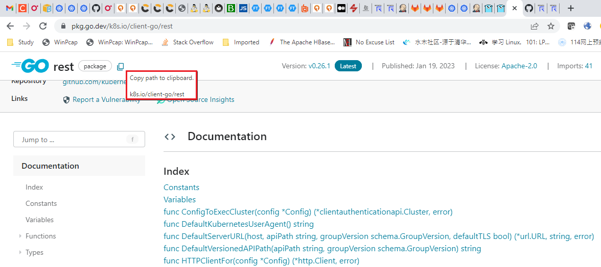

## 管理依赖

当你的代码使用外部包，这些包（以模块形式分发）成为了依赖。随着时间流逝，你可能需要升级它们或者移除它们。 Go 提供了依赖管理工具来帮助你在与外部依赖协作的同时，保持你的 Go 应用安全。

这篇文章描述如何执行任务以管理你的代码里引入的依赖。你可以使用 Go 工具来执行大部分工作。这篇文章也描述了如何执行一些可能会有用的依赖相关任务。

### 参见

1. 如果你正在从事模块依赖相关的工作，看看[入门指南](https://go.dev/doc/tutorial/getting-started)以获得一个简单介绍。
2. 使用 go 命令管理依赖帮助确保你的需求保持一致，以及你的 `go.mod` 文件内容有效。关于这些命令的引用，参见 [Go 命令](https://go.dev/cmd/go/)。你也可以从命令行上输入 `go help command-name` 来得到帮助， 例如 `go help mod tidy`。
3. 你使用的使依赖改变的 Go 命令将编辑你的 `go.mod` 文件。关于该文件内容的更多信息，参见 [go.mod 文件参考](https://go.dev/doc/modules/gomod-ref)
4. 是你的编辑器或 IDE 识别 Go 模块能够使得管理它们的工作变得容易。关于更多支持 Go 的编辑器，请参见[编辑器插件及IDEs](https://go.dev/doc/editors.html)。
5. 本文不描述如何如何开发，发布，模块版本化以供他人使用。更多信息，请参见[开发和发布模块](https://go.dev/doc/modules/developing)。

### 使用和管理依赖工作流

你可以使用 Go 工具来获取并使用有用的包。在 [pkg.go.dev](https://pkg.go.dev/)，你可以搜寻有用的包，然后使用 go 命令将这些包导入你的代码以调用其功能。

下面列出了大部分常见依赖管理的步骤，对每一步如想了解更多，参见本文相关小节。

1. 从[pkg.go.dev](https://pkg.go.dev/)[定位有用的包](https://go.dev/doc/modules/managing-dependencies#locating_packages)。
2. [导入包](https://go.dev/doc/modules/managing-dependencies#locating_packages)，将你想要的包导入你的代码。
3. 将你的代码加入一个模块以追踪依赖（如果它还没有在一个模块中）。参见[开启依赖追踪](https://go.dev/doc/modules/managing-dependencies#enable_tracking)。
4. [添加外部模块作为依赖](https://go.dev/doc/modules/managing-dependencies#adding_dependency)，如此你可以管理它们。
5. 随时间必要时[升级或降级你的依赖版本](https://go.dev/doc/modules/managing-dependencies#upgrading)。

### 以模块方式管理依赖

在 Go 中，你以模块的方式管理依赖，模块包含你导入的包。这个过程由下面这些设施支持：

- **一个去中心化发布模块及检索其代码的系统**。开发者使得模块对其他开发者从他们（模块开发者）自己的仓库可用，并以特定版本发布。
- **一个包搜索引擎**及文档浏览器（`pkg.go.dev`），在那里你可以找到模块。参见[定位并导入有用的包](https://go.dev/doc/modules/managing-dependencies#locating_packages)
- 一套模块**版本命名规范**以帮助你理解模块的稳定性及后向兼容性保证。参见[模块版本数字](https://go.dev/doc/modules/version-numbers)
- Go 工具方便你管理依赖，包括得到一个模块的源代码，升级等。参见本文相关小节以了解更多。

### 定位及导入有用的包

你可以搜寻[pkg.go.dev](https://pkg.go.dev/)以找到包含你期待功能的包。

当你找到一个你想在你的代码中使用的包后，在页面顶部定位到包路径，点击拷贝路径按钮将路径拷贝到你的剪贴板。



在你自己的代码中，将路径粘贴进一个导入语句，如下例所示：

```
import "rsc.io/quote"
```

在你的代码导入包之后，开启依赖追踪并获取包代码以编译。更多信息，请参见[开启依赖追踪](https://go.dev/doc/modules/managing-dependencies#enable_tracking)及[添加一个依赖](https://go.dev/doc/modules/managing-dependencies#adding_dependency)。

### 在你的代码中开启依赖追踪

为了追踪和管理你添加的依赖，你开始将你的代码放至它自己的模块中。这在你的云代码目录树的根部创建了一个 go.mod 文件。你添加的依赖将在这个文件中列出。

为了将你的代码添加到其模块中，使用 [go mod init](https://go.dev/ref/mod#go-mod-init) 命令。例如，从命令行，切换到你的源代码根目录下，然后运行如下所示命令：

```
$ go mod init example/mymodule
```

`go mod init` 命令的参数是你的模块的模块路径。如果可能，模块路径应该是你的源代码的仓库路径。

如果最初你不知道你的模块的最终仓库位置，使用一个安全的替代。这可能是你拥有的一个域名，或者你控制的另一个名字（例如你的公司名），模块名或者源代码目录之后跟随一个路径。更多信息，参见[命名模块](https://go.dev/doc/modules/managing-dependencies#naming_module)。

当你使用 Go 工具来管理依赖时，工具将更新 `go.mod` 文件，如此它维持一个你的依赖的当前列表。

当你添加依赖，Go 工具也创建一个 `go.sum` 文件包含你的依赖的模块的校验码。Go 使用它来验证下载的模块文件的完整性，尤其对于那些工作于你的项目的其他开发者（有用）。

在你的仓库中包括你的代码以及 `go.mod` 和 `go.sum` 文件。

参考 [go.mod 文件参考](https://go.dev/doc/modules/gomod-ref) 以了解更多。

### 命名一个模块

当你运行 `go mod init` 创建一个模块开启依赖追踪，你指定了一个模块路径用作模块名字。模块路径成为了导入模块内包时的路径前缀。确保指定的模块路径不会与其它模块的模块路径冲突。

最小要求，一个模块路径仅仅指示其起源；例如一个公司，作者或者所有者名字。但路径也可能很具描述性，例如模块是什么，主要做什么等。

模块路径典型地具有下面的形式：

```
<prefix>/<descriptive-text>
```

- 前缀典型地是个字符串，部分描述了模块，例如一个描述了模块起源的字符串。它可能是：

  + Go 工具可以找到包源代码（如果发布代码，则它时必须的）的仓库位置。

    例如，它可能是 `github.com/<project-name>/.`

    如果你可能发布模块给他人使用请使用这个最佳实践。更多关于发布的信息，请参见[开发及发布模块](https://go.dev/doc/modules/developing)。
  + 一个你控制的名字。

    如果你不使用一个仓库名，确保选择一个你有信心它不被被他人使用的前缀。一个好的选择时你的公司名，避免常见属于如 `widgets`, `utilities`, 或 `app`。

- 对于描述文本，一个好的选择是项目名。记住包名在描述权重最大，模块路径为所有包名字创建了一个名字空间。

#### 保留模块路径前缀

Go 保证下面的字符串不会用于包名。

- `test`： 当你有一个模块，其代码设计用于本地测试另一个模块的功能时，你可以使用 `test` 作为模块路径前缀。

  当模块作为测试一部分被创建的时候，可使用 `test` 作为路径前缀。例如，你的测试本身可以运行 `go mod init test` 并以特殊的方式设置这个模块，为的就是与 Go 代码分析工具一起测试。

- `example`： 在一些 Go 文档中用于模块路径前缀，例如在教程中你创建一个模块只为了追踪依赖。

   注意当示例是一个发布模块时 Go 文档也使用 `example.com` 来演示。

### 添加依赖

一旦你从发布模块里导入了包，你就可以使用 [go get 命令](https://go.dev/cmd/go/#hdr-Add_dependencies_to_current_module_and_install_them)添加该模块作为依赖管理。

命令做如下工作：

- 如果必要，它为需要的模块添加 `require` 指令到你的 `go.mod` 文件以构建命令行传入的包。一个 `require` 指令追踪你的模块以来的模块的最小版本。更多信息，请参考 [go.mod 文件参考](https://go.dev/doc/modules/gomod-ref)。
- 如果必要，它下载模块源代码如此你能够编译依赖它们的包。它可能从一个模块代理服务器如 `proxy.golang.org` 或者一个版本控制仓库下载模块。代码被本地缓存。

你可以设置 Go 工作下载模块的位置。详细信息，请参考[指定一个模块代理服务器](https://go.dev/doc/modules/managing-dependencies#proxy_server)。

下面描述了一些例子：

- 为你的模块里的一个包添加所有依赖，运行如下命令（"." 指定当前目录中的包）：

  ```
  $ go get .
  ```

- 为了增加一个特定的依赖，指定其模块路径作为命令参数。

  ```
  $ go get example.com/theirmodule
  ```

命令也将认证它下载的每一个模块。它确保了自从发布后模块从未改变。如果模块自从发布后修改过 – 例如开发者改变了提交的内容 – Go 工具将提示安全错误。这个认证检查保护了你的模块的安全性。

### 获取特定依赖版本

你就可以为 [go get 命令](https://go.dev/cmd/go/#hdr-Add_dependencies_to_current_module_and_install_them)指定一个版本号以获取一个依赖模块的特定版本。命令将在你的 `go.mod` 文件中更新 `require` 指令（虽然你也可以手动更新它）。

你可能在下列情况下出发这个操作：

- 你想得到一个模块的特定预发布版本以尝鲜试用
- 你发现你当前使用的版本不能很好的工作，因此你想得到一个你可以依赖的版本。
- 你想升级或降级你所使用的模块

下面是一些使用 [go get 命令](https://go.dev/cmd/go/#hdr-Add_dependencies_to_current_module_and_install_them)的例子：

- 为得到一个特定版本，在模块路径之后添加一个 `@` 符号，后面跟谁你期待的版本：

  ```
  $ go get example.com/theirmodule@v1.3.4
  ```

- 为了得到最新版本，在木块路径之后添加 `@latest`。

  ```
  $ go get example.com/theirmodule@latest
  ```

下面的 `go.mod` 文件 `require` 指令示例（请参考 [go.mod 文件参考](https://go.dev/doc/modules/gomod-ref)）演示了如何要求一个特定版本号：

```
require example.com/theirmodule v1.3.4
```

### 发现可用更新

你可以检查你的当前模块中得依赖是否与更新。使用 `go list` 命令来显示你的模块依赖列表，以及模块最新可用版本信息。如果你一旦发现了可用的升级，你可以使用它以决定是否升级到新版本。

关于 `go list` 命令得更多信息，请参见 `go list -m`。

下面是一些例子：

- 列出你当前模块得所有模块依赖以及其最新版本：

  ```
  $ go list -m -u all
  ```

- 列出一个特定模块得最新版本

  ```
  $ go list -m -u example.com/theirmodule
  ```

### 升级或下载依赖

你可以通过使用  Go 工具发现模块的可用版本，并将一个不同的版本作为依赖从而升级或降级依赖模块。

1. 为了发现新的版本使用 `go list` 命令，请参考[发现可用更新](https://go.dev/doc/modules/managing-dependencies#discovering_updates)
2. 为了添加一个特定的版本作为依赖，使用在[得到一特定版本依赖](https://go.dev/doc/modules/managing-dependencies#getting_version)中描述过的 `go get` 命令。

### 同步你的代码依赖

你可以保证包含你的代码导入的所有包得依赖，并移除了不再导入的包所在得模块。

当你修改你的代码和依赖时，这个特性很有用，可能创建了一个被管理的依赖已经下载的模块的一个集合，他可能不在匹配在你的代码中导入包宠儿引入的模块依赖列表。

为了保持你管理的依赖集干净，使用 `go mod tidy` 命令。使用你的代码代码导入的包的集合，这个命令将会编辑你的 `go.mod` 文件以添加需要且缺失的模块。它也移除不再提供任何相关包的模块。

这个命令没有任何参数，除了一个标记 `-v`，它打印关于移除模块的信息。

```
$ go mod tidy
```

### 针对未发布模块代码开发和测试

你可以指定你的代码使用仍未发布的依赖模块。这些模块的代码在他们单独的仓库里，可能是这些仓库的克隆，或者与客户端代码一起在一个磁盘上。

当出现如下情况时你可能会采用这种方案：

- 对外部模块代码你想自己做修改，比如创建分支或者克隆之后。例如可能想准备一个对模块的修正，然后以 `pull` 请求形式将其发送给模块开发者。
- 你在构建一个新的模块且还未发布，因此它在一个 `go get` 命令不可达的仓库里。

#### 从本地目录引用模块代码

你可以指定模块所需代码与调用模块的代码都在本地磁盘上。当你处于如下情况时你可能会觉得这很有用：

1. 开发你自己独立的模块并想从当前模块测试它。
2. 想从当前模块测试对外部模块的问题修正或特性添加。（注意你也可以从它的仓库获取外部模块的一个自己的分支，请参见[从你自己的仓库分支获取外部模块](https://go.dev/doc/modules/managing-dependencies#external_fork)）。

为了告诉 Go 命令使用模块代码的本地拷贝，在你的 `go.mod` 文件中使用 `replace` 指令来替换一个 `require` 指令中的模块路径。参考[go.mod 文件参考](https://go.dev/doc/modules/gomod-ref) 以获取更多指令。

在下面的 `go.mod` 文件示例中，当前模块需要外部模块 `example.com/theirmodule`，带有一个不存在的版本号（`v0.0.0-unpublished`）用于确保替换正确工作。`replace` 指令然后用 `../theirmodule` -- 一个与当前模块路径同级的目录-- 替换最初的模块路径。

```
module example.com/mymodule

go 1.16

require example.com/theirmodule v0.0.0-unpublished

replace example.com/theirmodule v0.0.0-unpublished => ../theirmodule
```

在设置 `require/replace` 对时，使用 [go mod edit](https://go.dev/ref/mod#go-mod-edit) 和 [go get](https://go.dev/ref/mod#go-get) 命令来确保文件描述的需求保持一致：

```
$ go mod edit -replace=example.com/theirmodule@v0.0.0-unpublished=../theirmodule
$ go get example.com/theirmodule@v0.0.0-unpublished
```

> 注意：当你使用 `replace` 指令时，Go 工具并不像[添加依赖](https://go.dev/doc/modules/managing-dependencies#adding_dependency)里描述的那样认证外部模块。

更多版本信息，请参见[模块版本数字](https://go.dev/doc/modules/version-numbers)。

#### 从你自己的仓库分支中获取外部模块代码

当你创建外部模块仓库（比如修正外部模块的问题或特性添加）的一个分支，你可以让 Go 工具来使用模块代码的分支。当从你自己的代码中测试修改时会很有用。(注意你可以要求模块代码位于与模块调用代码在同一个本地磁盘上，更多信息，请参见[从你自己的仓库分支获取外部模块](https://go.dev/doc/modules/managing-dependencies#external_fork))。

为了实现这个你可以在你的的 `go.mod` 文件中使用 `replace` 指令将外部模块的的原最初模块路径替换为你的仓库的一个分支。这告诉 Go 工具在编译时使用替代路径（例如分支位置），例如，同时允许你保留 `import` 语句基于最初模块路径不做改变。

参考[go.mod 文件参考](https://go.dev/doc/modules/gomod-ref) 以获取更多 `replace` 指令的信息。

在下面的 `go.mod` 文件示例中，当前模块需要外部模块 `example.com/theirmodule`。`replace` 指令使用模块自己仓库的一个分支替代了最初模块路径 `example.com/myfork/theirmodule`。

```
module example.com/mymodule

go 1.16

require example.com/theirmodule v1.2.3

replace example.com/theirmodule v1.2.3 => example.com/myfork/theirmodule v1.2.3-fixed
```

在设置 `require/replace` 对时，使用 Go 工具命令来确保文件描述的需求保持一致。使用 `go list` 命令来获得当前模块使用的版本。然后使用 [go mod edit](https://go.dev/ref/mod#go-mod-edit) 命令来用分支替换模块路径。

```
$ go list -m example.com/theirmodule
example.com/theirmodule v1.2.3
$ go mod edit -replace=example.com/theirmodule@v1.2.3=example.com/myfork/theirmodule@v1.2.3-fixed
```

> 注意：当你使用 `replace` 指令时，Go 工具并不像[添加依赖](https://go.dev/doc/modules/managing-dependencies#adding_dependency)里描述的那样认证外部模块。

更多版本信息，请参见[模块版本数字](https://go.dev/doc/modules/version-numbers)。

### 使用仓库标识符获取一个特定提交

你可以使用 `go get` 命令来从一个模块的仓库分支添加未发布的代码。

为了实现这个，你使用 `go get` 命令，用 `@` 标记来指定你期待的代码。当你使用 `go get`，该命令将会在 `go.mod` 文件中添加一个 `require` 指令，他要求一个外部模块，使用一个基于提交细节的伪版本号数字。

下面的例子提供了一些演示，他们基于一个位于 Git 仓库的源代码：

- 为了得到模块的一个特定提交，以如下形式添加 `@commithash`:
  
  ```
  $ go get example.com/theirmodule@4cf76c2
  ```

- 为了得到模块的一个特定分支，以如下形式添加 `@branchname`:

  ```
  $ go get example.com/theirmodule@bugfixes
  ```

### 移除一个依赖

当你的代码不再使用模块中的任何包时，你可以不再将其作为一个依赖追踪。

- 为了停止追踪所有不在使用的模块，运行 [go mod tidy](https://go.dev/ref/mod#go-mod-tidy) 命令。这个命令也添加缺失的依赖。
  
  ```
  $ go mod tidy
  ```

- 为了移除一个特定的依赖，使用 [go get](https://go.dev/ref/mod#go-get) 命令，指定一个模块的模块路径并附加 `@none`，如下所示：

  ```
  $ go get example.com/theirmodule@none
  ```

`go get` 命令也可以降级或移除已被移除模块的依赖。

### 指定一个模块代理服务器

当你使用 Go 工具工作于模块时，工具默认从 `proxy.golang.org`（一个公开由 Google 运行的模块镜像）或者模块仓库下载模块。你可以指定 Go 工具使用另一个代理服务器以下载及认证模块。

如果你已经设置或选择了一个不同的代理服务器，你可能想这么做。例如，有些人设置一个模块代理服务器期望对模块如何使用有更好的控制。

为了指定另一个模块代理服务器以供 Go 工具使用，设置 `GOPROXY` 环境变量为一个或多个服务器的 URL。Go 工具将顺序尝试你指定的每一个服务器。默认地，首先 `GOPROXY` 指定为一个公开由 Google 运行的模块服务器，然后直接从模块仓库直接下载（如同在模块路径里制定）：

```
GOPROXY="https://proxy.golang.org,direct"
```

关于 `GOPROXY` 环境变量，包括支持其它行为的值的更多信息，请参见 [go 命令参考](https://go.dev/cmd/go/#hdr-Module_downloading_and_verification)。

你可以设置变量为其它模块代理服务器的 URL，用一个逗号或管道符分割：

- 当使用逗号时，Go 工具只有当当前 URL 返回 HTTP `404` 或 `410` 时才会尝试下一个 URL。

   ```
   GOPROXY="https://proxy.example.com,https://proxy2.example.com"
   ```

- 当使用管道符时，Go 工具只要返回 HTTP 错误码就会尝试下一个 URL。

   ```
   GOPROXY="https://proxy.example.com|https://proxy2.example.com"
   ```

在版本控制服务器或者模块代理服务器上频繁开发且分发的模块不会在公网上可得。你可以设置 `GOPRIVATE` 环境变量来配置 go 命令从私有源下载并构建模块。然后 Go 工具就可以从私有源下载并构建模块。

`GOPRIVATE` 或 `GONOPROXY` 环境变量可被设置为一个 `glob` 模式列表以匹配模块前缀，它们是私有的并且不应该从任何代理服务器请求。例如：

```
GOPRIVATE=*.corp.example.com,*.research.example.com
```

### Reference

- [管理依赖](https://go.dev/doc/modules/managing-dependencies)