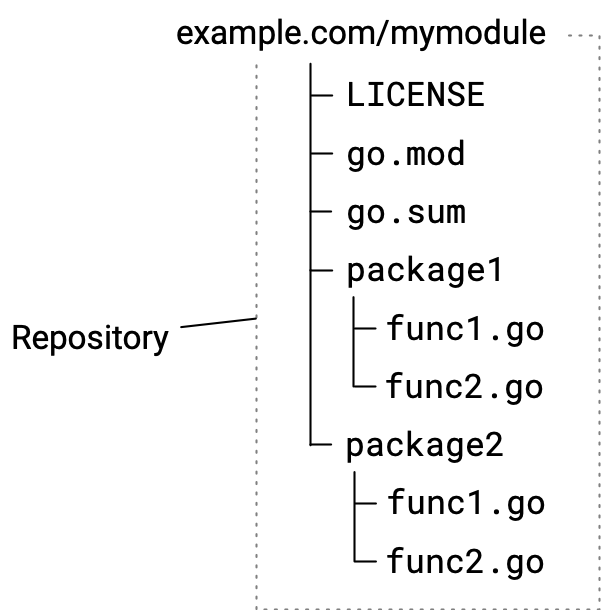
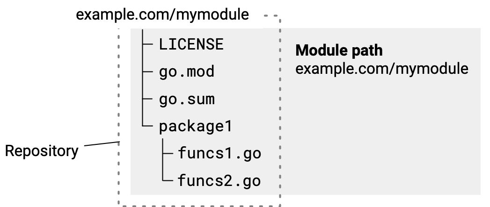

## 管理模块代码

当你在开发供其他人使用的模块时，通过遵守本文描述的仓库规范，你可以帮助确保你的模块更易于被他人使用。

本文描述了当你管理你的模块仓库时需要采取的行动，对于你的版本演化时你所采取的工作流顺序的信息，请参见[模块发布与版本演化工作流](https://go.dev/doc/modules/release-workflow)。

这里描述的规范有些是模块必须的，其它一些属于最佳实践。本文假设你已经熟悉了[管理依赖](https://go.dev/doc/modules/managing-dependencies)一文中描述的基本模块使用实践。

Go 支持如下仓库以发布模块：`Git`, `Subversion`, `Mercurial`, `Bazaar`, 和 `Fossil`。

关于模块开发入门，请参见[开发并发布模块](https://go.dev/doc/modules/developing)。

### Go 工具如何找到你的发布模块

在 Go 的去中心化模块发布及代码检索系统中，你能够把代码留在你的仓库中的同时发布模块。Go 工具依赖命名规则--它拥有仓库路径及仓库标签（tags）以指示一个模块的名字及其版本号。当你的仓库遵守这些规则，Go 工具如 [go get 命令](https://go.dev/ref/mod#go-get)就可以从你的仓库中下载你的模块代码。

当一个开发者使用 `go get` 命令以得到包的源代码以便于他们导入时，命令做了下面这些：

1. 在 Go 源代码中从 `import` 语句那里，`go get` 从包路径中识别出模块路径
2. 使用从模块路径派生的一个 URL，命令从一个模块代理服务器或直接从仓库定位模块源代码
3. 通过将模块版本号匹配到一个仓库标签以从仓库中发现代码，从而定位模块特定版本源代码并下载它。**当一个特定版本号为未知，go get 定位为最新发布版本**。
4. 检索源代码并下载它到开发者本地模块缓存。

### 在仓库中组织代码

你可以通过遵守这里描述的规则以保持你的模块维护简单并改善开发者体验。在仓库里放置模块代码与存放其它代码一样简单。

下面的截图演示了拥有两个包的简单模块的源代码结构。



你的初始提交应该包含下表中的文件：

文件|描述
--------|--------
LICENSE|模块许可证
go.mod|描述模块，包括它的模块路径（等效于其名字）和它的依赖。更多细节，参见 [go.mod 参考](https://go.dev/doc/modules/gomod-ref)。模块路径以 `module` 指令给出，例如：`module example.com/mymodule`。关于选择模块路径的更多信息，参见[管理依赖](https://go.dev/doc/modules/managing-dependencies)。虽然你可以编辑 go.mod 文件，你会发现通过 go 命令来修改它更可靠。
go.sum|包括模块依赖的加密哈希。Go 工具使用这些哈希值来认证下载的模块，并尝试确认下载的模块是真实的。当确认失败时，Go 将显示一条安全错误。如果没有依赖，这个文件可能为空或者不存在。你不应该编辑这个文件，除非通过 `go mod tidy` 命令，它将移除不再需要的条目。
包目录和 `.go` 源代码|构成 Go 包的目录和 `.go` 文件以及模块源代码

从命令行，你可以创建一个空的仓库，添加这些文件作为你初始提交的一部分，添加消息以提交。下面是一个使用 `git` 的例子：

```
$ git init
$ git add --all
$ git commit -m "mycode: initial commit"
$ git push
```

### 选择仓库范围（repository scope）

不同模块的代码应该独立以确保各自的版本演化，如此你才能发布模块代码。

设计你的仓库让其一个根目录仅仅驻留一个单一模块将帮助确保维护简单，尤其随时间流逝你发布小版本和补丁版本，新的主版本分支等等。但是，如果你确实需要，你也可以在一个单一仓库中维护多个模块。

#### 一个仓库一个模块

你可以维护一个仓库仅仅容纳一个单一模块代码。在这种模式下，你把 `go.mod` 文件放置在仓库根目录下，在包级子目录下放置 Go 源代码。

这是最简单的方式，它使你的代码即使经过很长时间也易于维护。它帮助避免了在一个目录路径前添加模块版本号的需求。



#### 一个仓库多个模块

你能够从单一仓库发布多个模块。例如，你可以在一个仓库中拥有多个模块的代码，但期待这些模块拥有不同的版本。

每个模块根目录所在的子目录必须拥有它自己的 `go.mod` 文件。

检索子目录中的模块代码改变了你你发布一个模块时你必需使用的版本标签的形式。你必须在版本标签之前带有模块根所在的子目录名。更过多版本号信息，请参见[模块版本号](https://go.dev/doc/modules/version-numbers)。

例如，对下面的 `example.com/mymodules/module1` 模块，你必须为版本 `v1.2.3` 添加这些：

- 模块路径：`example.com/mymodules/module1`
- 版本标签：`module1/v1.2.3`
- 用户导入包路径：`example.com/mymodules/module1/package1`
- 用户 `require` 指令给出的模块路径：`example.com/mymodules/module1 module1/v1.2.3`


### Reference

- [管理模块代码](https://go.dev/doc/modules/managing-source)