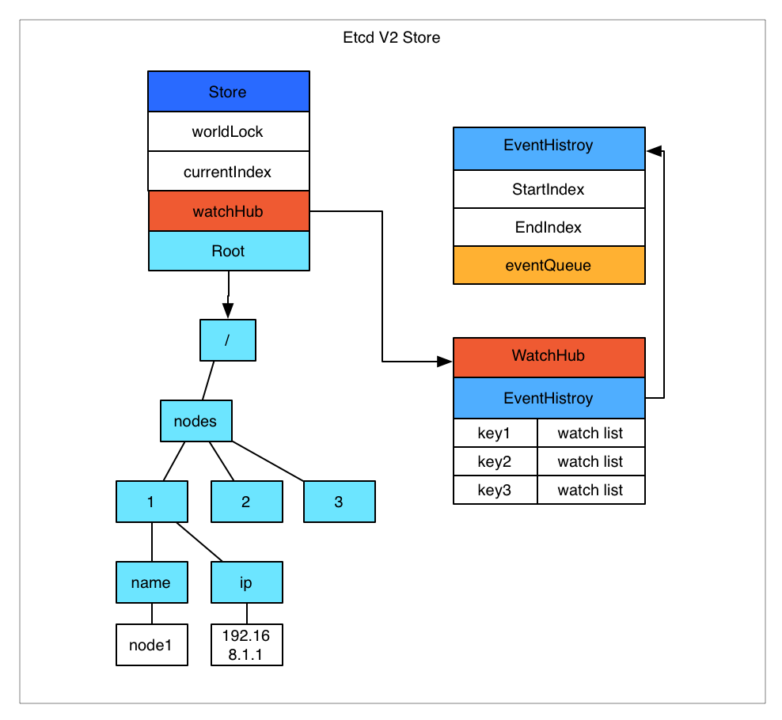

# Go学习手册
## Etcd的使用
Etcd是CoreOS团队于2013年6月发起的开源项目，它的目标是构建一个高可用的分布式键值(key-value)数据库。Etcd内部采用Raft协议作为一致性算法，Etcd基于Go语言实现。

Etcd作为服务发现系统，其主要特点是：
- 简单：安装配置简单，而且提供了HTTP API进行交互，使用也很简单.
- 安全：支持SSL证书验证.
- 快速：根据官方提供的Benchmark数据，单实例支持每秒2k+读操作.
- 可靠：采用Raft算法，实现分布式系统数据的可用性和一致性.

Etcd的主要功能：
- 基本的key-value存储.
- 监听机制.
- key的过期及续约机制，用于监控和服务发现.
- 原子CAS和CAD，用于分布式锁和leader选举.

Etcd v2 存储，Watch以及过期机制:



Etcd v2 和 v3 本质上是共享同一套 raft 协议代码的两个独立的应用，接口不一样，存储不一样，数据互相隔离。也就是说如果从 Etcd v2 升级到 Etcd v3，原来v2 的数据还是只能用 v2 的接口访问，v3 的接口创建的数据也只能访问通过 v3 的接口访问。所以我们按照 v2 和 v3 分别分析。

Etcd v2 是个纯内存的实现，并未实时将数据写入到磁盘，持久化机制很简单，就是将store整合序列化成json写入文件。数据在内存中是一个简单的树结构。比如以下数据存储到 Etcd 中的结构就如图所示：
```
/nodes/1/name  node1
/nodes/1/ip    192.168.1.1
```

store中有一个全局的currentIndex，每次变更，index会加1.然后每个event都会关联到currentIndex. 当客户端调用watch接口（参数中增加 wait参数）时，如果请求参数中有waitIndex，并且waitIndex 小于 currentIndex，则从 EventHistroy 表中查询index大于等于waitIndex，并且和watch key 匹配的 event，如果有数据，则直接返回。如果历史表中没有或者请求没有带 waitIndex，则放入WatchHub中，每个key会关联一个watcher列表。 当有变更操作时，变更生成的event会放入EventHistroy表中，同时通知和该key相关的watcher。

这里有几个影响使用的细节问题：
- EventHistroy 是有长度限制的，最长1000。也就是说，如果你的客户端停了许久，然后重新watch的时候，可能和该waitIndex相关的event已经被淘汰了，这种情况下会丢失变更。
- 如果通知watcher的时候，出现了阻塞（每个watcher的channel有100个缓冲空间），Etcd 会直接把watcher删除，也就是会导致wait请求的连接中断，客户端需要重新连接。
- Etcd store的每个node中都保存了过期时间，通过定时机制进行清理。

从而可以看出，Etcd v2 的一些限制：
- 过期时间只能设置到每个key上，如果多个key要保证生命周期一致则比较困难。
- watcher只能watch某一个key以及其子节点（通过参数 recursive)，不能进行多个watch。
- 很难通过watch机制来实现完整的数据同步（有丢失变更的风险），所以当前的大多数使用方式是通过watch得知变更，然后通过get重新获取数据，并不完全依赖于watch的变更event。

Etcd v3 存储，Watch以及过期机制:


Etcd v3 将watch和store拆开实现，我们先分析下store的实现。 Etcd v3 store 分为两部分，一部分是内存中的索引，kvindex，是基于google开源的一个golang的btree实现的，另外一部分是后端存储。按照它的设计，backend可以对接多种存储，当前使用的boltdb。boltdb是一个单机的支持事务的kv存储，Etcd 的事务是基于boltdb的事务实现的。Etcd 在boltdb中存储的key是revision，value是 Etcd 自己的key-value组合，也就是说 Etcd 会在boltdb中把每个版本都保存下，从而实现了多版本机制。

用etcdctl通过批量接口写入两条记录：
```
etcdctl txn <<<'
put key1 "v1"
put key2 "v2"

'
```
再通过批量接口更新这两条记录：
```
etcdctl txn <<<'
put key1 "v12"
put key2 "v22"

'
```
boltdb中其实有了4条数据：
```
rev={3 0}, key=key1, value="v1"
rev={3 1}, key=key2, value="v2"
rev={4 0}, key=key1, value="v12"
rev={4 1}, key=key2, value="v22"
```

revision主要由两部分组成，第一部分main rev，每次事务进行加一，第二部分sub rev，同一个事务中的每次操作加一。如上示例，第一次操作的main rev是3，第二次是4。当然这种机制大家想到的第一个问题就是空间问题，所以 Etcd 提供了命令和设置选项来控制compact，同时支持put操作的参数来精确控制某个key的历史版本数。 了解了 Etcd 的磁盘存储，可以看出如果要从boltdb中查询数据，必须通过revision，但客户端都是通过key来查询value，所以 Etcd 的内存kvindex保存的就是key和revision之前的映射关系，用来加速查询。

然后我们再分析下watch机制的实现。Etcd v3 的watch机制支持watch某个固定的key，也支持watch一个范围（可以用于模拟目录的结构的watch），所以 watchGroup 包含两种watcher，一种是 key watchers，数据结构是每个key对应一组watcher，另外一种是 range watchers, 数据结构是一个 IntervalTree（不熟悉的参看文文末链接），方便通过区间查找到对应的watcher。

每个 WatchableStore 包含两种 watcherGroup，一种是synced，一种是unsynced，前者表示该group的watcher数据都已经同步完毕，在等待新的变更，后者表示该group的watcher数据同步落后于当前最新变更，还在追赶。 当 Etcd 收到客户端的watch请求，如果请求携带了revision参数，则比较请求的revision和store当前的revision，如果大于当前revision，则放入synced组中，否则放入unsynced组。

同时 Etcd 会启动一个后台的goroutine持续同步unsynced的watcher，然后将其迁移到synced组。也就是这种机制下，Etcd v3 支持从任意版本开始watch，没有v2的1000条历史event表限制的问题（当然这是指没有compact的情况下）。 另外我们前面提到的，Etcd v2在通知客户端时，如果网络不好或者客户端读取比较慢，发生了阻塞，则会直接关闭当前连接，客户端需要重新发起请求。Etcd v3为了解决这个问题，专门维护了一个推送时阻塞的watcher队列，在另外的goroutine里进行重试。 Etcd v3 对过期机制也做了改进，过期时间设置在lease上，然后key和lease关联。这样可以实现多个key关联同一个lease id，方便设置统一的过期时间，以及实现批量续约。

相比Etcd v2, Etcd v3的一些主要变化：
1. 接口通过grpc提供rpc接口，放弃了v2的http接口。优势是长连接效率提升明显，缺点是使用不如以前方便，尤其对不方便维护长连接的场景。
2. 废弃了原来的目录结构，变成了纯粹的kv，用户可以通过前缀匹配模式模拟目录。
3. 内存中不再保存value，同样的内存可以支持存储更多的key。
4. watch机制更稳定，基本上可以通过watch机制实现数据的完全同步。
5. 提供了批量操作以及事务机制，用户可以通过批量事务请求来实现Etcd v2的CAS机制（批量事务支持if条件判断）。
### Etcd单节点安装
通常情况下Etcd在生产环境中一般推荐集群方式部署。但是为了方便和初学者使用这里讲述的是单节点Etcd安装和基本使用。 Etcd目前默认使用2379端口提供HTTP API服务，2380端口和Peer通信(这两个端口已经被IANA官方预留给Etcd)；在之前的版本中可能会分别使用4001和7001，在使用的过程中需要注意这个区别。

由于Etcd 基于Go语言实现，因此，用户可以从Etcd项目主页下载源代码自行编译，也可以下载编译好的二进制文件，甚至直接使用制作好的Docker镜像文件来体验。

这里我用二进制文件来安装,编译好的二进制文件都在Etcd页面，用户可以选择需要的版本，或通过下载工具下载。

使用 curl 工具下载压缩包，并解压。
```
curl -L  https://github.com/coreos/etcd/releases/download/v3.2.10/etcd-v3.2.10-linux-amd64.tar.gz -o etcd-v3.2.10-linux-amd64.tar.gz
tar xzvf etcd-v3.2.10-linux-amd64.tar.gz
cd etcd-v3.2.10-linux-amd64
```
解压后，可以看到文件包括:
```
$ ls
Documentation README-etcdctl.md README.md READMEv2-etcdctl.md etcd etcdctl
```
其中etcd服务端，etcdctl是提供给用户的命令客户端，其他文件是支持文档。

下面将 etcd etcdctl 文件放到系统可执行目录（例如 /usr/local/bin/）。
```
$ sudo cp etcd* /usr/local/bin/
```
默认 2379 端口处理客户端的请求，2380 端口用于集群各成员间的通信。启动 etcd 显示类似如下的信息：

启动etcd:
```
> ./etcd
2018-06-26 11:06:04.345228 I | etcdmain: etcd Version: 3.2.10
2018-06-26 11:06:04.345271 I | etcdmain: Git SHA: 694728c
2018-06-26 11:06:04.345296 I | etcdmain: Go Version: go1.8.5
2018-06-26 11:06:04.345303 I | etcdmain: Go OS/Arch: linux/amd64
2018-06-26 11:06:04.345310 I | etcdmain: setting maximum number of CPUs to 4, total number of available CPUs is 4
...
```
可以使用 etcdctl 命令进行测试，设置和获取键值 testkey: “first use etcd”，检查 etcd 服务是否启动成功：
```
> etcdctl member list
65388a54a71622c7: name=keke peerURLs=http://localhost:2380 clientURLs=http://localhost:2379 isLeader=true
> etcdctl set testkey "first use etcd"
first use etcd
> etcdctl get testkey
first use etcd
```
这样单节点Etcd就启动成功了!
### Etcd集群安装
### 设置一个 key 的值
### Etcd，Zookeeper，Consul 比较
### Etcd 的周边工具
### Etcd 使用注意事项
### 参考文档

## Reference
- [Go学习手册](https://www.bookstack.cn/read/For-learning-Go-Tutorial/README.md)