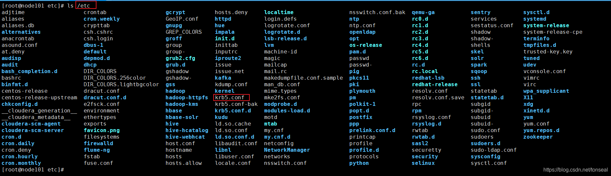
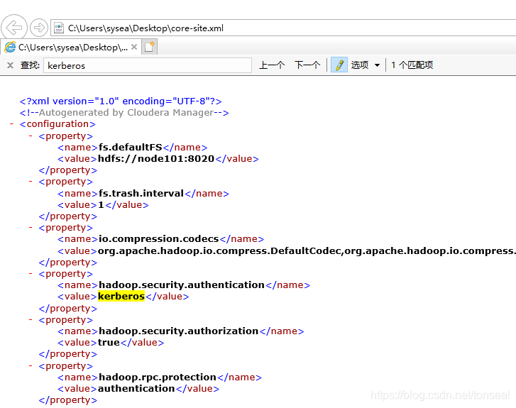
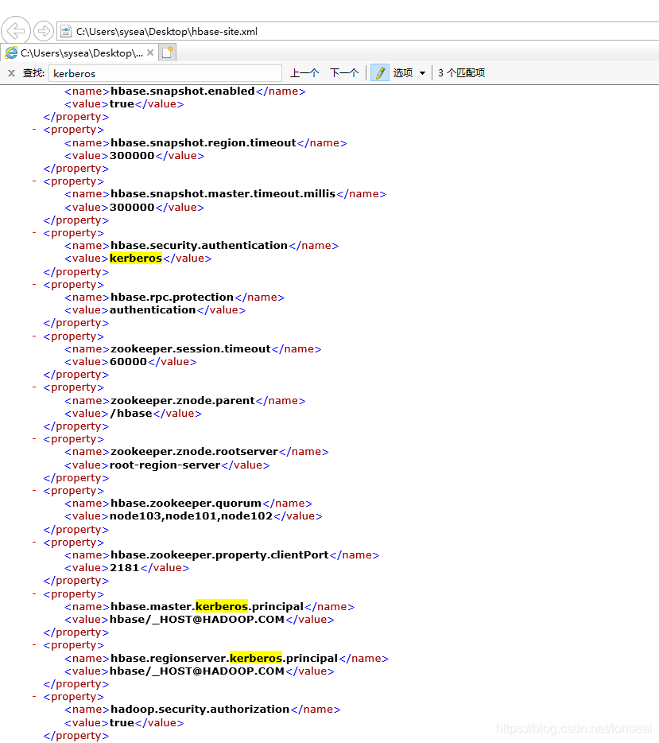

# Java API连接Kerberos认证的HBASE

网上关于 Java 代码连接启用了Kerberos认证的HBASE资料很多，但是总感觉不够准确，总是出现各种问题。经过整合网上资料和亲自试验，得出连接成功的最小配置项如下：

- java.security.krb5.conf
- hadoop.security.authentication
- hbase.security.authentication
- hbase.regionserver.kerberos.principal
- hbase.zookeeper.quorum
- hbase.zookeeper.property.clientPort

试验发现，如果上述配置项缺少了任一项都会导致HBASE连接读写不成功。先放上获取连接成功的代码：

```
import org.apache.hadoop.conf.Configuration;
import org.apache.hadoop.hbase.HBaseConfiguration;
import org.apache.hadoop.hbase.TableName;
import org.apache.hadoop.hbase.client.Admin;
import org.apache.hadoop.hbase.client.Connection;
import org.apache.hadoop.hbase.client.ConnectionFactory;
import org.apache.hadoop.security.UserGroupInformation;
 
import java.io.IOException;
 
public class HbaseConnector {
 
    public static Connection getConnection(String zkQuorum, String clientPort, String keyTabPath, 
                                           String krbConfPath, String principal) throws IOException {
 
        // krb5.conf必需
        System.setProperty("java.security.krb5.conf", krbConfPath);
 
        org.apache.hadoop.conf.Configuration conf = HBaseConfiguration.create();
 
        // 必需
        conf.set("hadoop.security.authentication", "kerberos"); 
        // 必需
        conf.set("hbase.security.authentication", "kerberos");
        conf.set("hbase.regionserver.kerberos.principal", "hbase/_HOST@ECLD.COM");
        conf.set("hbase.zookeeper.quorum", zkQuorum);
        conf.set("hbase.zookeeper.property.clientPort", clientPort);
        // (非必需)
        conf.set("hbase.master.kerberos.principal", "hbase/_HOST@ECLD.COM");
 
        UserGroupInformation.setConfiguration(conf);
 
        //登陆认证
        UserGroupInformation.loginUserFromKeytab(principal, keyTabPath);
 
        return ConnectionFactory.createConnection(conf);
    }
 
    public static void main(String[] args) throws IOException {
        Connection connection = getConnection("node101,node102,node103", "2181", 
            "C:/Users/sysea/Desktop/tonseal.keytab", 
            "C:/Users/sysea/Desktop/krb5.conf",
            "tonseal@HADOOP.COM");
        Admin admin = connection.getAdmin();
        if (admin.tableExists(TableName.valueOf("tonseal:tonseal_table"))) {
            System.out.println("表tonseal:tonseal_table存在");
        } else {
            System.err.println("表tonseal:tonseal_table不存在");
        }
        admin.close();
        connection.close();
    }
}
```

`hbase.zookeeper.quorum` 和 `hbase.zookeeper.property.clientPort` 这两个配置项是必需的，无论是否开启 Kerberos 认证都需要进行设置的。

`krb5.conf` 这个文件可以在主机的 `/etc` 目录下找到：



`krb5.conf` 示例内容如下：

```
[libdefaults]
default_realm = HADOOP.COM
dns_lookup_kdc = false
dns_lookup_realm = false
ticket_lifetime = 86400
renew_lifetime = 604800
forwardable = true
default_tgs_enctypes = aes256-cts
default_tkt_enctypes = aes256-cts
permitted_enctypes = aes256-cts
udp_preference_limit = 1
kdc_timeout = 3000
 
[realms]
HADOOP.COM = {
  kdc = node101
  admin_server = node101
}
[domain_realm]
```

下面贴出缺少上述其他配置项的连接报错信息：

- 如果缺少了 `java.security.krb5.conf`，提示无法获取 `realm`：
  
  ```
  23:14:29.533 [main] DEBUG org.apache.hadoop.security.authentication.util.KerberosName - Kerberos krb5 configuration not found, setting default realm to empty
    Exception in thread "main" java.lang.IllegalArgumentException: Can't get Kerberos realm
        at org.apache.hadoop.security.HadoopKerberosName.setConfiguration(HadoopKerberosName.java:65)
        at org.apache.hadoop.security.UserGroupInformation.initialize(UserGroupInformation.java:309)
        at org.apache.hadoop.security.UserGroupInformation.setConfiguration(UserGroupInformation.java:355)
        at com.seal.HbaseConnector.getConnection(HbaseConnector.java:49)
        at com.seal.Main.createConnectionWithKerberos(Main.java:113)
        at com.seal.Main.main(Main.java:33)
    Caused by: java.lang.reflect.InvocationTargetException
        at sun.reflect.NativeMethodAccessorImpl.invoke0(Native Method)
        at sun.reflect.NativeMethodAccessorImpl.invoke(NativeMethodAccessorImpl.java:62)
        at sun.reflect.DelegatingMethodAccessorImpl.invoke(DelegatingMethodAccessorImpl.java:43)
        at java.lang.reflect.Method.invoke(Method.java:498)
        at org.apache.hadoop.security.authentication.util.KerberosUtil.getDefaultRealm(KerberosUtil.java:110)
        at org.apache.hadoop.security.HadoopKerberosName.setConfiguration(HadoopKerberosName.java:63)
        ... 5 more
    Caused by: KrbException: Cannot locate default realm
        at sun.security.krb5.Config.getDefaultRealm(Config.java:1066)
        ... 11 more
  ```
- 如果缺少了 `hadoop.security.authenticatio`n，代码会尝试使用本机当前用户名进行认证，认证方式为 **"SIMPLE"**，而不是 **"Kerberos"**，导致连接失败：
   ```
   23:16:32.875 [main] DEBUG org.apache.hadoop.security.UserGroupInformation - hadoop login
   23:16:32.875 [main] DEBUG org.apache.hadoop.security.UserGroupInformation - hadoop login commit
   23:16:32.879 [main] DEBUG org.apache.hadoop.security.UserGroupInformation - using local user:NTUserPrincipal: sysea
   23:16:32.879 [main] DEBUG org.apache.hadoop.security.UserGroupInformation - Using user: "NTUserPrincipal: sysea" with name sysea
   23:16:32.879 [main] DEBUG org.apache.hadoop.security.UserGroupInformation - User entry: "sysea"
   23:16:32.879 [main] DEBUG org.apache.hadoop.security.UserGroupInformation - Assuming keytab is managed externally since logged in from subject.
   23:16:32.879 [main] DEBUG org.apache.hadoop.security.UserGroupInformation - UGI loginUser:sysea (auth:SIMPLE)
   23:16:32.886 [main] DEBUG org.apache.hadoop.security.UserGroupInformation - PrivilegedAction as:sysea (auth:SIMPLE) from:org.apache.hadoop.hbase.security.User$SecureHadoopUser.runAs(User.java:347)

   23:16:42.112 [hconnection-0x59fd97a8-metaLookup-shared--pool4-t1] WARN org.apache.hadoop.hbase.security.provider.BuiltInProviderSelector - No matching SASL authentication provider and supporting token found from providers for user: sysea (auth:SIMPLE)
   23:16:42.113 [hconnection-0x59fd97a8-metaLookup-shared--pool4-t1] DEBUG org.apache.hadoop.hbase.client.RpcRetryingCallerImpl - Call exception, tries=6, retries=11, started=4293 ms ago, cancelled=false, msg=Call to node101/192.168.56.101:16020 failed on local exception: java.io.IOException: java.lang.RuntimeException: Found no valid authentication method from options, details=row 'tonseal:tonseal_table,rowkey9-1615130197768,99999999999999' on table 'hbase:meta' at region=hbase:meta,,1.1588230740, hostname=node101,16020,1615095171294, seqNum=-1, see https://s.apache.org/timeout, exception=java.io.IOException: Call to node101/192.168.56.101:16020 failed on local exception: java.io.IOException: java.lang.RuntimeException: Found no valid authentication method from options
        at sun.reflect.NativeConstructorAccessorImpl.newInstance0(Native Method)
        at sun.reflect.NativeConstructorAccessorImpl.newInstance(NativeConstructorAccessorImpl.java:62)
        at sun.reflect.DelegatingConstructorAccessorImpl.newInstance(DelegatingConstructorAccessorImpl.java:45)
        at java.lang.reflect.Constructor.newInstance(Constructor.java:423)
        at org.apache.hadoop.hbase.ipc.IPCUtil.wrapException(IPCUtil.java:225)
        at org.apache.hadoop.hbase.ipc.AbstractRpcClient.onCallFinished(AbstractRpcClient.java:378)
        at org.apache.hadoop.hbase.ipc.AbstractRpcClient.access$100(AbstractRpcClient.java:89)
        at org.apache.hadoop.hbase.ipc.AbstractRpcClient$3.run(AbstractRpcClient.java:409)
        at org.apache.hadoop.hbase.ipc.AbstractRpcClient$3.run(AbstractRpcClient.java:405)
        at org.apache.hadoop.hbase.ipc.Call.callComplete(Call.java:117)
        at org.apache.hadoop.hbase.ipc.Call.setException(Call.java:132)
        at org.apache.hadoop.hbase.ipc.AbstractRpcClient.callMethod(AbstractRpcClient.java:422)
        at org.apache.hadoop.hbase.ipc.AbstractRpcClient.callBlockingMethod(AbstractRpcClient.java:316)
        at org.apache.hadoop.hbase.ipc.AbstractRpcClient.access$200(AbstractRpcClient.java:89)
        at org.apache.hadoop.hbase.ipc.AbstractRpcClient$BlockingRpcChannelImplementation.callBlockingMethod(AbstractRpcClient.java:572)
        at org.apache.hadoop.hbase.shaded.protobuf.generated.ClientProtos$ClientService$BlockingStub.scan(ClientProtos.java:45390)
        at org.apache.hadoop.hbase.client.ScannerCallable.openScanner(ScannerCallable.java:332)
        at org.apache.hadoop.hbase.client.ScannerCallable.rpcCall(ScannerCallable.java:242)
        at org.apache.hadoop.hbase.client.ScannerCallable.rpcCall(ScannerCallable.java:58)
        at org.apache.hadoop.hbase.client.RegionServerCallable.call(RegionServerCallable.java:127)
        at org.apache.hadoop.hbase.client.RpcRetryingCallerImpl.callWithoutRetries(RpcRetryingCallerImpl.java:192)
        at org.apache.hadoop.hbase.client.ScannerCallableWithReplicas$RetryingRPC.call(ScannerCallableWithReplicas.java:396)
        at org.apache.hadoop.hbase.client.ScannerCallableWithReplicas$RetryingRPC.call(ScannerCallableWithReplicas.java:370)
        at org.apache.hadoop.hbase.client.RpcRetryingCallerImpl.callWithRetries(RpcRetryingCallerImpl.java:107)
        at org.apache.hadoop.hbase.client.ResultBoundedCompletionService$QueueingFuture.run(ResultBoundedCompletionService.java:80)
        at java.util.concurrent.ThreadPoolExecutor.runWorker(ThreadPoolExecutor.java:1149)
        at java.util.concurrent.ThreadPoolExecutor$Worker.run(ThreadPoolExecutor.java:624)
        at java.lang.Thread.run(Thread.java:748)
    Caused by: java.io.IOException: java.lang.RuntimeException: Found no valid authentication method from options
        at org.apache.hadoop.hbase.ipc.IPCUtil.toIOE(IPCUtil.java:159)
        ... 17 more
    Caused by: java.lang.RuntimeException: Found no valid authentication method from options
        at org.apache.hadoop.hbase.ipc.RpcConnection.<init>(RpcConnection.java:112)
        at org.apache.hadoop.hbase.ipc.NettyRpcConnection.<init>(NettyRpcConnection.java:97)
        at org.apache.hadoop.hbase.ipc.NettyRpcClient.createConnection(NettyRpcClient.java:76)
        at org.apache.hadoop.hbase.ipc.NettyRpcClient.createConnection(NettyRpcClient.java:39)
        at org.apache.hadoop.hbase.ipc.AbstractRpcClient.getConnection(AbstractRpcClient.java:350)
        at org.apache.hadoop.hbase.ipc.AbstractRpcClient.callMethod(AbstractRpcClient.java:419)
        ... 16 more
   ```
- 如果缺少了 `hbase.security.authentication`，也会导致连接失败：
  
  ```
  23:24:34.930 [RPCClient-NioEventLoopGroup-1-1] DEBUG org.apache.hadoop.hbase.ipc.NettyRpcDuplexHandler - Unknown callId: -1, skipping over this response of 0 bytes
  23:24:34.931 [hconnection-0x2cdd0d4b-metaLookup-shared--pool4-t1] DEBUG org.apache.hadoop.hbase.client.RpcRetryingCallerImpl - Call exception, tries=6, retries=16, started=4530 ms ago, cancelled=false, msg=Call to node101/192.168.56.101:16020 failed on local exception: org.apache.hadoop.hbase.exceptions.ConnectionClosedException: Connection closed, details=row 'tonseal:tonseal_table,rowkey4-1615130670351,99999999999999' on table 'hbase:meta' at region=hbase:meta,,1.1588230740, hostname=node101,16020,1615095171294, seqNum=-1, see https://s.apache.org/timeout, exception=org.apache.hadoop.hbase.exceptions.ConnectionClosedException: Call to node101/192.168.56.101:16020 failed on local exception: org.apache.hadoop.hbase.exceptions.ConnectionClosedException: Connection closed
        at org.apache.hadoop.hbase.ipc.IPCUtil.wrapException(IPCUtil.java:206)
        at org.apache.hadoop.hbase.ipc.AbstractRpcClient.onCallFinished(AbstractRpcClient.java:378)
        at org.apache.hadoop.hbase.ipc.AbstractRpcClient.access$100(AbstractRpcClient.java:89)
        at org.apache.hadoop.hbase.ipc.AbstractRpcClient$3.run(AbstractRpcClient.java:409)
        at org.apache.hadoop.hbase.ipc.AbstractRpcClient$3.run(AbstractRpcClient.java:405)
        at org.apache.hadoop.hbase.ipc.Call.callComplete(Call.java:117)
        at org.apache.hadoop.hbase.ipc.Call.setException(Call.java:132)
        at org.apache.hadoop.hbase.ipc.NettyRpcDuplexHandler.cleanupCalls(NettyRpcDuplexHandler.java:203)
        at org.apache.hadoop.hbase.ipc.NettyRpcDuplexHandler.channelInactive(NettyRpcDuplexHandler.java:211)
        at org.apache.hbase.thirdparty.io.netty.channel.AbstractChannelHandlerContext.invokeChannelInactive(AbstractChannelHandlerContext.java:262)
        at org.apache.hbase.thirdparty.io.netty.channel.AbstractChannelHandlerContext.invokeChannelInactive(AbstractChannelHandlerContext.java:248)
        at org.apache.hbase.thirdparty.io.netty.channel.AbstractChannelHandlerContext.fireChannelInactive(AbstractChannelHandlerContext.java:241)
        at org.apache.hbase.thirdparty.io.netty.handler.codec.ByteToMessageDecoder.channelInputClosed(ByteToMessageDecoder.java:386)
        at org.apache.hbase.thirdparty.io.netty.handler.codec.ByteToMessageDecoder.channelInactive(ByteToMessageDecoder.java:351)
        at org.apache.hbase.thirdparty.io.netty.channel.AbstractChannelHandlerContext.invokeChannelInactive(AbstractChannelHandlerContext.java:262)
        at org.apache.hbase.thirdparty.io.netty.channel.AbstractChannelHandlerContext.invokeChannelInactive(AbstractChannelHandlerContext.java:248)
        at org.apache.hbase.thirdparty.io.netty.channel.AbstractChannelHandlerContext.fireChannelInactive(AbstractChannelHandlerContext.java:241)
        at org.apache.hbase.thirdparty.io.netty.channel.ChannelInboundHandlerAdapter.channelInactive(ChannelInboundHandlerAdapter.java:81)
        at org.apache.hbase.thirdparty.io.netty.handler.timeout.IdleStateHandler.channelInactive(IdleStateHandler.java:277)
        at org.apache.hbase.thirdparty.io.netty.channel.AbstractChannelHandlerContext.invokeChannelInactive(AbstractChannelHandlerContext.java:262)
        at org.apache.hbase.thirdparty.io.netty.channel.AbstractChannelHandlerContext.invokeChannelInactive(AbstractChannelHandlerContext.java:248)
        at org.apache.hbase.thirdparty.io.netty.channel.AbstractChannelHandlerContext.fireChannelInactive(AbstractChannelHandlerContext.java:241)
        at org.apache.hbase.thirdparty.io.netty.channel.DefaultChannelPipeline$HeadContext.channelInactive(DefaultChannelPipeline.java:1405)
        at org.apache.hbase.thirdparty.io.netty.channel.AbstractChannelHandlerContext.invokeChannelInactive(AbstractChannelHandlerContext.java:262)
        at org.apache.hbase.thirdparty.io.netty.channel.AbstractChannelHandlerContext.invokeChannelInactive(AbstractChannelHandlerContext.java:248)
        at org.apache.hbase.thirdparty.io.netty.channel.DefaultChannelPipeline.fireChannelInactive(DefaultChannelPipeline.java:901)
        at org.apache.hbase.thirdparty.io.netty.channel.AbstractChannel$AbstractUnsafe$8.run(AbstractChannel.java:818)
        at org.apache.hbase.thirdparty.io.netty.util.concurrent.AbstractEventExecutor.safeExecute(AbstractEventExecutor.java:164)
        at org.apache.hbase.thirdparty.io.netty.util.concurrent.SingleThreadEventExecutor.runAllTasks(SingleThreadEventExecutor.java:472)
        at org.apache.hbase.thirdparty.io.netty.channel.nio.NioEventLoop.run(NioEventLoop.java:497)
        at org.apache.hbase.thirdparty.io.netty.util.concurrent.SingleThreadEventExecutor$4.run(SingleThreadEventExecutor.java:989)
        at org.apache.hbase.thirdparty.io.netty.util.internal.ThreadExecutorMap$2.run(ThreadExecutorMap.java:74)
        at org.apache.hbase.thirdparty.io.netty.util.concurrent.FastThreadLocalRunnable.run(FastThreadLocalRunnable.java:30)
        at java.lang.Thread.run(Thread.java:748)
    Caused by: org.apache.hadoop.hbase.exceptions.ConnectionClosedException: Connection closed
        ... 26 more
  ```

有的连接代码中会使用 `core-site.xml`、`hbase-site.xml` 这些文件添加到 `Configuration` 中，这是因为 `core-site.xml` 和 `hbase-site.xml` 中包含了上述的配置项，如此一来当然可以连接成功了。

`core-site.xml` 中包含了配置项 `hadoop.security.authentication` ：



如果 `hbase-site.xml` 中包含了上述所有 `hbase` 相关的配置项，把 `hbase-site.xml` 添加到 `Configuration` 后，则 `hbase.security.authentication`、`hbase.regionserver.kerberos.principal`、`hbase.zookeeper.quorum`、`hbase.zookeeper.property.clientPort` 都不需要再指定：



使用 `core-site.xml`、`hbase-site.xml` 进行连接的代码如下：

```
import org.apache.hadoop.conf.Configuration;
import org.apache.hadoop.fs.Path;
import org.apache.hadoop.hbase.HBaseConfiguration;
import org.apache.hadoop.hbase.TableName;
import org.apache.hadoop.hbase.client.Admin;
import org.apache.hadoop.hbase.client.Connection;
import org.apache.hadoop.hbase.client.ConnectionFactory;
import org.apache.hadoop.security.UserGroupInformation;
 
import java.io.IOException;
 
public class HbaseConnector {
 
    public static Connection getConnectionByFile(String keyTabPath, String krbConfPath, String coreSitePath, String hbaseSitePath, String principal) throws IOException {
 
        // krb5.conf必需
        System.setProperty("java.security.krb5.conf", krbConfPath);
 
        org.apache.hadoop.conf.Configuration conf = HBaseConfiguration.create();
        conf.addResource(new Path(coreSitePath));
        conf.addResource(new Path(hbaseSitePath));
 
        UserGroupInformation.setConfiguration(conf);
 
        //登陆认证
        UserGroupInformation.loginUserFromKeytab(principal, keyTabPath);
        connection = ConnectionFactory.createConnection(conf);
        return connection;
    }
 
    public static void main(String[] args) throws IOException {
//        Connection connection = getConnection("node101,node102,node103", "2181", "C:/Users/sysea/Desktop/tonseal.keytab", "C:/Users/sysea/Desktop/krb5.conf", "tonseal@HADOOP.COM");
        Connection connection = getConnectionByFile("C:/Users/sysea/Desktop/tonseal.keytab", "C:/Users/sysea/Desktop/krb5.conf", "C:/Users/sysea/Desktop/core-site.xml", "C:/Users/sysea/Desktop/hbase-site.xml", "tonseal@HADOOP.COM");
        Admin admin = connection.getAdmin();
        if (admin.tableExists(TableName.valueOf("tonseal:tonseal_table"))) {
            System.out.println("表tonseal:tonseal_table存在");
        } else {
            System.err.println("表tonseal:tonseal_table不存在");
        }
        admin.close();
        connection.close();
    }
}
```

其它：Kerberos 认证获取的票据时长是有限的，程序运行一段时间后会出现无法读写 HBase 的情况，这就需要对票据进行续约。

## Reference

- [Java API连接Kerberos认证的HBASE](https://blog.csdn.net/tonseal/article/details/114500794)
- [OAuth和Kerbose](https://www.jianshu.com/p/3a8dfd45c045)
- [kerberos详解](https://blog.csdn.net/SkyChaserYu/article/details/104891996/)
- [加密与授权 Oauth2.0](https://blog.csdn.net/Stephen_mu/article/details/122308029)
- [OAuth2认证授权流程解析](https://blog.csdn.net/lixiang987654321/article/details/107745646?utm_medium=distribute.pc_relevant.none-task-blog-2~default~baidujs_baidulandingword~default-1-107745646-blog-114500794.235^v43^pc_blog_bottom_relevance_base8&spm=1001.2101.3001.4242.2&utm_relevant_index=4)