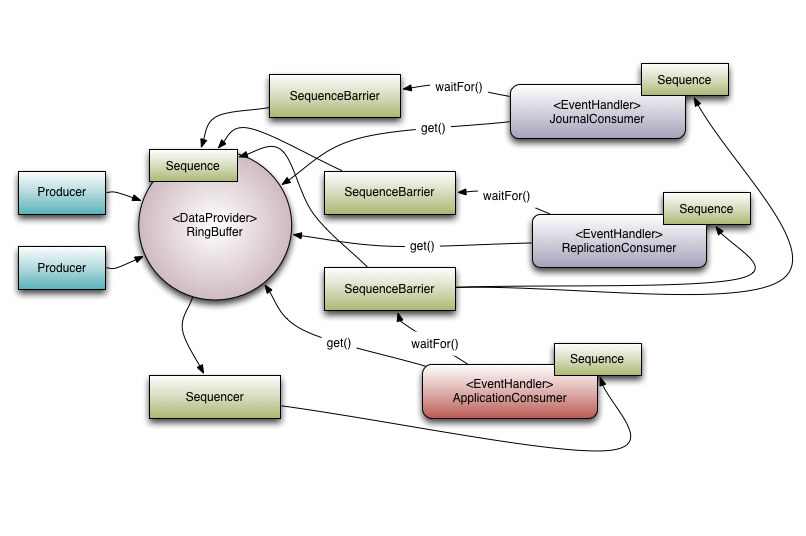

# LMAX Disruptor 用户指南

LMAX Disruptor 是一款高性能线程间消息库，它源于 LMAX 对并发，性能及非阻塞算法的研究，今天它组成了 LMAX 交易基础设施的核心部分。

## 使用 Disruptor

### 介绍

Disruptor 是一个提供了并发环形缓冲区数据结构的库。它旨在为异步事件处理架构提供低延迟、高吞吐量的工作队列。

为了理解 Disruptor 的优势，我们可以将其与一个用途相似且广为人知的类似产品进行比较。对于 Disruptor 而言，这个产品就是 Java 的 `BlockingQueue`。与队列类似，Disruptor 的用途是在同一进程内的线程之间移动数据（例如消息或事件）。然而，Disruptor 提供了一些关键特性，使其区别于队列。这些特性包括：

- 多播事件到消费者，并带有[消费者依赖关系图](https://lmax-exchange.github.io/disruptor/user-guide/index.html#_consumer_dependency_graph)
- 为事件[预分配内存](https://lmax-exchange.github.io/disruptor/user-guide/index.html#_event_pre_allocation)
- [可选无锁机制](https://lmax-exchange.github.io/disruptor/user-guide/index.html#_optionally_lock_free)

#### 核心概念

在了解 Disruptor 的工作原理之前，有必要先定义一些将在整个文档和代码中使用的术语。对于那些倾向于领域驱动设计（DDD）的人来说，可以把这看作是 Disruptor 领域的通用语言。

- **环形缓冲区**：环形缓冲区通常被认为是 Disruptor 的核心组件。然而，从 3.0 版本开始，环形缓冲区仅负责存储和更新流经 Disruptor 的数据（事件）。对于某些高级用例，用户甚至可以完全替换它。
- **序列**：Disruptor 使用序列 (Sequence) 来标识特定组件的执行进度。每个消费者（事件处理器）以及 Disruptor 自身都维护着一个序列。大部分并发代码都依赖于这些序列值的移动，因此序列支持 AtomicLong 的许多现有特性。实际上，两者之间唯一的真正区别在于，序列包含额外的功能，可以防止序列与其它值之间发生伪共享。
- **序列器**：序列器是 Disruptor 的核心。该接口的两种实现方式（单生产者和多生产者）实现了所有并发算法，以确保生产者和消费者之间数据的快速、正确传递。
- **序列屏障**：序列器生成一个序列屏障，其中包含对序列器自身发布的主序列以及所有依赖消费者的序列的引用。它包含用于确定是否有任何事件可供消费者处理的逻辑。
- **等待策略**：等待策略决定了消费者如何等待生产者将事件放入 Disruptor 中。更多详情请参见关于可选无锁机制的部分。
- **事件**：生产者传递给消费者的数据单元。事件没有特定的代码表示，因为它完全由用户定义。
- **事件处理器**：用于处理来自 Disruptor 的事件的主事件循环，并拥有消费者序列的所有权。它有一个名为 BatchEventProcessor 的单一表示形式，其中包含事件循环的高效实现，并将回调到用户提供的 EventHandler 接口的实现。
- **事件处理程序**：由用户实现的接口，代表 Disruptor 的消费者。
- **生产者**：这是调用 Disruptor 将事件加入队列的用户代码。这个概念在代码中也没有体现。

为了更好地理解这些要素，下面举例说明 LMAX 如何在其高性能核心服务（例如交易所）中使用 Disruptor。

**图1 - Disruptor 以及一批依赖型消费者**

#### 多播事件（Multicast Events）

这是队列（queues）和 Disruptor 行为上的最大差异。

当多个消费者监听同一个 Disruptor 时，它会将所有事件发布给所有消费者。相比之下，队列只会将单个事件发送给单个消费者。当需要对同一数据执行多个并行操作时，可以利用 Disruptor 的这种行为。

> 示例用例: 
> LMAX 的典型示例包含三个操作：
> - 日志记录（将输入数据写入持久日志文件）；
> - 数据复制（将输入数据发送到另一台机器，以确保数据存在远程副本）；
> - 以及业务逻辑（实际的处理工作）。
>
> 如图 1 所示，有三个事件处理程序（JournalConsumer、ReplicationConsumer 和 ApplicationConsumer）监听 Disruptor。每个事件处理程序都会接收 Disruptor 中所有可用的消息（顺序相同）。这使得每个消费者可以并行执行工作。

#### 消费者依赖关系图（Consumer Dependency Graph）

为了支持并行处理行为在实际应用中的实现，必须支持消费者之间的协调。以上述示例为例，必须阻止业务逻辑消费者在日志记录和复制消费者完成其任务之前继续执行。我们将此概念称为“门控”（或者更准确地说，该功能是一种“门控”形式）。

“门控”机制体现在两个方面：

首先，我们需要确保生产者不会过度消耗消费者。这可以通过调用 `RingBuffer.addGatingConsumers()` 将相关的消费者添加到 Disruptor 中来实现。

其次，前面提到的情况可以通过构建一个包含来自必须首先完成处理的组件的序列（`Sequences`）的 `SequenceBarrier` 来实现。

如图 1 所示，有 3 个消费者监听来自环形缓冲区的事件。本例中包含一个依赖关系图。

`ApplicationConsumer` 依赖于 `JournalConsumer` 和 `ReplicationConsumer`。这意味着 `JournalConsumer` 和 `ReplicationConsumer` 可以彼此并行运行。依赖关系可以通过 `ApplicationConsumer` 的 `SequenceBarrier` 连接到 `JournalConsumer` 和 `ReplicationConsumer` 的 `Sequence` 来体现。

值得注意的是序列器与下游消费者之间的关系。序列器的一项职责是确保发布操作不会超出环形缓冲区的大小。为此，任何下游消费者的序列号都不能小于环形缓冲区序列号减去环形缓冲区的大小。

然而，通过使用依赖关系图，可以进行一项有趣的优化。由于 `ApplicationConsumer` 的序列号保证小于或等于 `JournalConsumer` 和 `ReplicationConsumer` 的序列号（这是依赖关系所保证的），因此序列器只需查看应用程序消费者的序列号即可。更一般地说，`Sequencer` 只需要了解依赖关系树中叶节点消费者的序列号即可。

#### 事件预分配（Event Pre-allocation）

Disruptor 的目标之一是使其能够在低延迟环境下运行。在低延迟系统中，必须减少或消除内存分配。在基于 Java 的系统中，其目的是减少因垃圾回收导致的​​停顿次数 [1]。

为了实现这一点，用户可以预先分配 Disruptor 中事件所需的存储空间。在构造过程中，用户会提供一个 `EventFactory`，该 `EventFactory` 将在 Disruptor 的环形缓冲区中为每个条目调用。当向 Disruptor 发布新数据时，API 允许用户获取已构造的对象，以便他们可以调用该存储对象的方法或更新其字段。Disruptor 保证，只要这些操作正确实现，它们就是并发安全的。

#### 可选无锁机制（Optionally Lock-free）

为了实现低延迟，另一个关键的实现细节是广泛使用无锁算法来实现 Disruptor。所有内存可见性和正确性保证都通过内存屏障和/或比较交换操作来实现。

> 只有在 `BlockingWaitStrategy` 中才需要实际使用锁。
> 
> 这样做完全是为了使用 `condition` 判断，以便在等待新事件到达时，让正在执行操作的线程保持空闲状态。许多低延迟系统会使用忙等待（busy-wait）来避免使用`condition` 可能带来的抖动；然而，过多的系统忙等待操作会导致性能显著下降，尤其是在 CPU 资源严重受限的情况下，例如虚拟化环境中的 Web 服务器。

### 入门

#### 获取 Disruptor

#### 基本生产和消费

#### 发布

#### 基本调优选项

##### 单生产者 vs 多生产者

##### 其它等待策略

#### 从环形缓冲区清理对象

### 高级技术

## 设计和实现

## 已知问题

## 批量回滚

## Reference 

- [LMAX Disruptor](https://lmax-exchange.github.io/disruptor/)
- [LMAX Disruptor User Guide](https://lmax-exchange.github.io/disruptor/user-guide/index.html)
- [高性能队列——Disruptor](https://tech.meituan.com/2016/11/18/disruptor.html)