# Maven安装及配置
## 1. Overview
### 1.1 Maven是什么
Maven翻译为“专家”，“内行”。Maven是Apache下的一个纯java开发的开源项目，它是一个项目管理工具，使用Maven对java项目进行构建、依赖管理。当前使用Maven的项目在持续增长。
### 1.2 什么是项目构建
项目构建是一个项目从编写源代码到编译、测试、运行、打包、部署、运行的过程。
### 1.3 传统项目构建过程
+ 在IDEA中创建一个java web工程
+ 在工程中编写源代码及配置文件等
+ 对源代码进行编译，java文件编译成class文件
+ 执行Junit单元测试
+ 将工程打成war包部署至tomcat运行
### 1.4 Maven项目构建过程
Maven将项目构建的过程进行标准化，每个阶段使用一个命令完成，下图展示了构建过程的一些阶段，后面章节详细介绍每个阶段，这里先大概了解下：


上图中部分阶段对应命令如下：
- 清理阶段对应Maven的命令是clean，清理输出的class文件
- 编译阶段对应Maven的命令是compile，将java代码编译成class文件。
- 打包阶段对应Maven的命令是package，java工程可以打成jar包，web工程可以打成war包
- 运行一个Maven工程（web工程）需要一个命令：tomat:run

Maven工程构建的优点：
1. 一个命令完成构建、运行，方便快捷。
2. Maven对每个构建阶段进行规范，非常有利于大型团队协作开发。
## 2. 什么是依赖管理
什么是依赖？一个java项目可能要使用一些第三方的jar包才可以运行，那么我们说这个java项目依赖了这些第三方的jar包。举个例子：一个crm系统，它的架构是SSH框架，该crm项目依赖SSH框架，具体它依赖的Hibernate、Spring、Struts2。什么是依赖管理？就是对项目所有依赖的jar包进行规范化管理。
### 2.1 传统项目的依赖管理
传统的项目工程要管理所依赖的jar包完全靠人工进行，程序员从网上下载jar包添加到项目工程中，如下图：程序员手工将Hibernate、struts2、spring的jar添加到工程中的WEB-INF/lib目录下。

手工拷贝jar包添加到工程中的问题是：
1. 没有对jar包的版本统一管理，容易导致版本冲突。
2. 从网上找jar包非常不方便，有些jar找不到。
3. jar包添加到工程中导致工程过大。
### 2.2 Maven项目的依赖管理
Maven项目管理所依赖的jar包不需要手动向工程添加jar包，只需要在pom.xml（Maven工程的配置文件）添加jar包的坐标，自动从Maven仓库中下载jar包、运行.

使用Maven依赖管理添加jar的好处：
1. 通过pom.xml文件对jar包的版本进行统一管理，可避免版本冲突。
2. Maven团队维护了一个非常全的Maven仓库，里边包括了当前使用的jar包，Maven工程可以自动从Maven仓库下载jar包，非常方便。
### 2.3 使用Maven的好处
1. 一步构建
   Maven对项目构建的过程进行标准化，通过一个命令即可完成构建过程。
2. 依赖管理
   Maven工程不用手动导jar包，通过在pom.xml中定义坐标从Maven仓库自动下载，方便且不易出错。
3. Maven的跨平台，可在window、linux上使用。
4. Maven遵循规范开发有利于提高大型团队的开发效率，降低项目的维护成本，大公司都会考虑使用Maven来构建项目。
## 3. Maven的下载及配置
1. http://maven.apache.org/download.cgi下载
2. 安装很简单，解压即可
3. 配置Maven

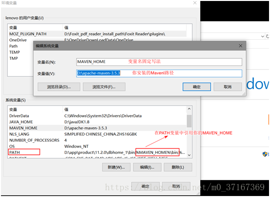

4. 查看是否配置成功可在窗口中输入 mvn –v 出现顺利输出版本号则说明配置成功。
### 3.1 Maven仓库
Maven的工作需要从仓库下载一些jar包，如下图所示，本地的项目A、项目B等都会通过maven软件从远程仓库（可以理解为互联网上的仓库）下载jar包并存在本地仓库，本地仓库 就是本地文件夹，当第二次需要此jar包时则不再从远程仓库下载，因为本地仓库已经存在了，可以将本地仓库理解为缓存，有了本地仓库就不用每次从远程仓库下载了。

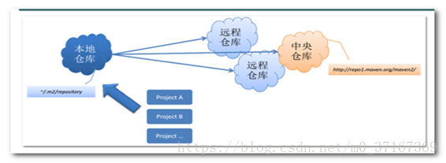

1. 本地仓库：用来存储从远程仓库或中央仓库下载的插件和jar包，项目使用一些插件或jar包，优先从本地仓库查找
默认本地仓库位置在 ${user.dir}/.m2/repository，${user.dir}表示windows用户目录。

   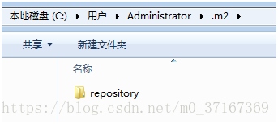

2. 远程仓库：如果本地需要插件或者jar包，本地仓库没有，默认去远程仓库下载。远程仓库可以在互联网内也可以在局域网内。
3. 中央仓库 ：在maven软件中内置一个远程仓库地址http://repo1.maven.org/maven2 ，它是中央仓库，服务于整个互联网，它是由Maven团队自己维护，里面存储了非常全的jar包，它包含了世界上大部分流行的开源项目构件。
### 3.2 配置本地仓库
1. 拷贝Maven安装目录的conf下的settings.xml到${user.dir}/.m2
2. 更改${user.dir}/.m2/settings.xml中的localRepository如下
   
   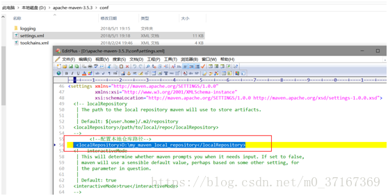

### 3.3 Maven常用命令介绍
Maven命令|解释
--------|--------
mvn –version|显示版本信息
mvn clean|清理项目生产的临时文件,一般是模块下的target目录
mvn compile|编译源代码，一般编译模块下的src/main/java目录
mvn package|项目打包工具,会在模块下的target目录生成jar或war等文件
mvn test|测试命令,或执行src/test/java/下junit的测试用例.
mvn install|将打包的jar/war文件复制到你的本地仓库中,供其他模块使用
mvn deploy|将打包的文件发布到远程参考,提供其他人员进行下载依赖
mvn site|生成项目相关信息的网站
mvn eclipse:eclipse|将项目转化为Eclipse项目
mvn dependency:tree|打印出项目的整个依赖树  
mvn archetype:generate|创建Maven的普通java项目
mvn tomcat:run|在tomcat容器中运行web应用 需要插件支持。只有tomcat1.7的插件,没有1.8的，所以tomcat8.0用不了此命令
mvn jetty:run|调用 Jetty 插件的 Run 目标在 Jetty Servlet 容器中启动 web 应用
> **注意**：运行Maven命令的时候，首先需要定位到Maven项目的目录，也就是项目的pom.xml文件所在的目录。否则，必以通过参数来指定项目的目录:
> 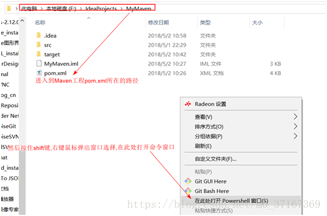
## 4. Maven命令
### 4.1 compile
compile是Maven工程的编译命令，作用是将src/main/java下的文件编译为class文件输出到target目录下。

  cmd进入命令状态，执行mvn compile，如下图提示成功：

  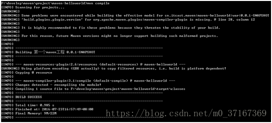
  
  查看 target目录，class文件已生成，编译完成。

  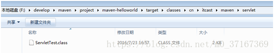
### 4.2 test
test是Maven工程的测试命令，会执行src/test/java下的单元测试类。
### 4.3 clean
clean是Maven工程的清理命令，执行 clean会删除target目录的内容。
### 4.4 package
package是Maven工程的打包命令，对于java工程执行package打成jar包，对于web工程打成war包。
### 4.4 install
install是Maven工程的安装命令，执行install将Maven打成jar包或war包发布到本地仓库。

从运行结果中，可以看出：当后面的命令执行时，前面的操作过程也都会自动执行。
## 5. 生命周期
Maven对项目构建过程分为三套相互独立的生命周期，请注意这里说的是“三套”，而且“相互独立”，这三套生命周期分别是：
+ clean Lifecycle 在进行真正的构建之前进行一些清理工作。
+ default Lifecycle 构建的核心部分，编译，测试，打包，部署等等。
+ site Lifecycle 生成项目报告，发布站点。
### 5.1 缺省生命周期的阶段
+ validate: 验证项目是正确的，所有需要的信息是完备的
+ compile: 编译项目源代码
+ test: 使用合适的测试框架来验证编译好的代码。这些测试不要求打包和部署。
+ package: 将编译好的打包成分发格式，比如jar
+ integration-test: 将包部署到集成测试环境中运行集成测试
+ verify: 运行并验证所打的包是有效的并满足质量标准
+ install: 将包安装到本地仓库中--可被其它项目用作依赖
+ deploy: 在集成环境或发布环境中进行，将最终包拷贝到远程仓库中与其它开发人员或项目共享
### 5.2 阶段详述
阶段实际上被映射到了底层的目标。每阶段执行的特定目标依赖于项目包的类型。例如，如果项目类型是JAR，package 将执行jar:jar目标；如果项目类型是WAR，package 将执行war:war目标。

> **注意**：阶段和目标可以顺序执行。
```
mvn clean dependency:copy-dependencies package
```
### 5.3 产生站点
```
mvn site
```
这个阶段将基于项目的pom产生站点信息，你可以查看`target/site`下产生的文档。
## 6. Maven项目工程目录约定
使用Maven创建的工程我们称它为Maven工程，Maven工程具有一定的目录规范：

目录/文件|解释
--------|--------
src/main/java|存放项目的.java文件
src/main/resources|存放项目资源文件，如spring, hibernate配置文件
src/main/filters|资源过滤文件
src/main/webapp|Web应用源代码
src/test/java|存放所有单元测试java文件，如JUnit测试类
src/test/resources|测试资源文件
src/test/filters|测试|资源过滤文件
src/it|集成测试(主要为插件准备的)
src/assembly|装配描述符
src/site|站点
target|输出文件所在
LICENSE.txt|项目授权
NOTICE.txt|项目依赖的库的注意事项和属性信息
README.txt|项目readme
pom.xml|Maven项目核心配置文件

如图所示 IDEA 创建出来的Maven项目结构如下:

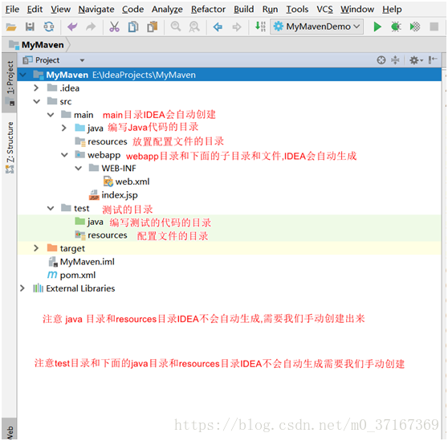

## 7. pom.xml
一个Maven工程都有一个pom.xml文件，通过pom.xml文件定义项目的坐标、项目依赖、项目信息、插件目标等。
### 7.1 依赖管理系统(Dependency Management System)
通过maven的依赖管理对项目所依赖的jar 包进行统一管理。

比如：项目依赖junit4.9，通过在pom.xml中定义junit4.9的依赖即使用junit4.9，如下所示是junit4.9的依赖定义：
```
<!-- 依赖关系 -->
<dependencies>
    <!-- 此项目运行使用junit，所以此项目依赖junit -->
    <dependency>
       <!-- junit的项目名称 -->
       <groupId>junit</groupId>
       <!-- junit的模块名称 -->
       <artifactId>junit</artifactId>
       <!-- junit版本 -->
       <version>4.9</version>
       <!-- 依赖范围：单元测试时使用junit -->
       <scope>test</scope>
    </dependency>
    ....
</dependencies>
```
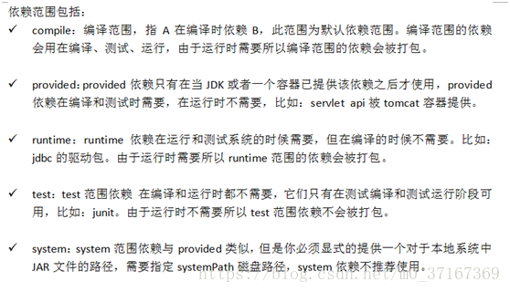

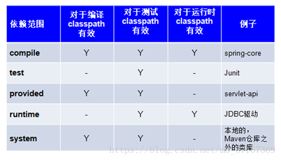

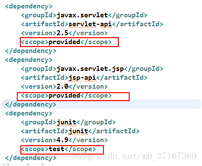
### 7.2 一个项目生命周期(Project Lifecycle)
使用Maven完成项目的构建，项目构建包括：清理、编译、测试、部署等过程，Maven将这些过程规范为一个生命周期，如下所示是生命周期的各各阶段：


Maven通过执行一些简单命令即可实现上边生命周期的各各过程，比如执行mvn compile执行编译、执行mvn clean执行清理。
### 7.3 组标准集合
Maven将整个项目管理过程定义一组标准，比如：通过Maven构建工程有标准的目录结构，有标准的生命周期阶段、依赖管理有标准的坐标定义等。
### 7.4 插件(plugin)与目标(goal)
Maven 管理项目生命周期过程都是基于插件完成的。
### 7.5 定义maven坐标
每个Maven工程都需要定义本工程的坐标，坐标是maven对jar包的身份定义，比如：入门程序的坐标定义如下：
```
<!--项目名称，定义为组织名+项目名，类似包名-->
<groupId>org.westos</groupId>
<!-- 模块名称 -->
<artifactId>maven-first</artifactId>
<!-- 当前项目版本号，snapshot为快照版本即非正式版本，release为正式发布版本 -->
<version>0.0.1-SNAPSHOT</version>
<!--打包类型: jar：执行package会打成jar包; 
             war：执行package会打成war包; 
             pom ：用于maven工程的继承，通常父工程设置为pom 
-->
<packaging>jar</packaging>
```
## 8. Maven使用
### 8.1 命令行使用Maven
1. 创建一个你的项目驻留的目录；
2. 在在目录下执行以下命令创建Maven项目
   ```
      mvn archetype:generate -DgroupId=com.refinitic.app -DartifactId=mvndemo -DarchetypeArtifactId=maven-archetype-quickstart -DarchetypeVersion=1.0 -DinteractiveMode=false
   ```

   你执行了Maven目标archetype:generate，并传递了一系列参数给这个目标。前缀archetype是提供这个目标的插件，如果你对Ant很熟悉，你就会觉得目标和task很像。archetype:generate目标依据maven-archetype-quickstart原型创建了一个项目。到目前为止你可以把插件理解为为了一个通用共同目的的目标集合。比如，jboss-maven-plugin的目的就是“处理各种jboss相关工作”。
3. cd mvndemo; mvn pacakge

    不像你刚才执行的(archetype:generate命令，你可能注意到我们仅仅输入了一个单词pacakge。它不是一个目标（goal），而是一个阶段（phase）。一个阶段是构建生命周期的一个阶段，整个构建生命周期就是由一系列顺序的阶段组成。当给定一个阶段时，Maven 将执行到传入阶段在内的每一个阶段。例如，如果我们执行compile阶段，那么实际执行的阶段包括：

     + validate
     + generate-sources
     + process-sources
     + generate-resources
     + process-resources
     + compile
4. 检验你的编译结果及创建的Jar文件：
   ```
   java -cp target/mvndemo-1.0-SNAPSHOT.jar com.refinitiv.app.App
   ```
### 8.2 Idea使用Maven


## Reference
- [Maven安装及配置](https://blog.csdn.net/m0_37167369/article/details/81628305)
- [Apache Maven Project](http://maven.apache.org/index.html)