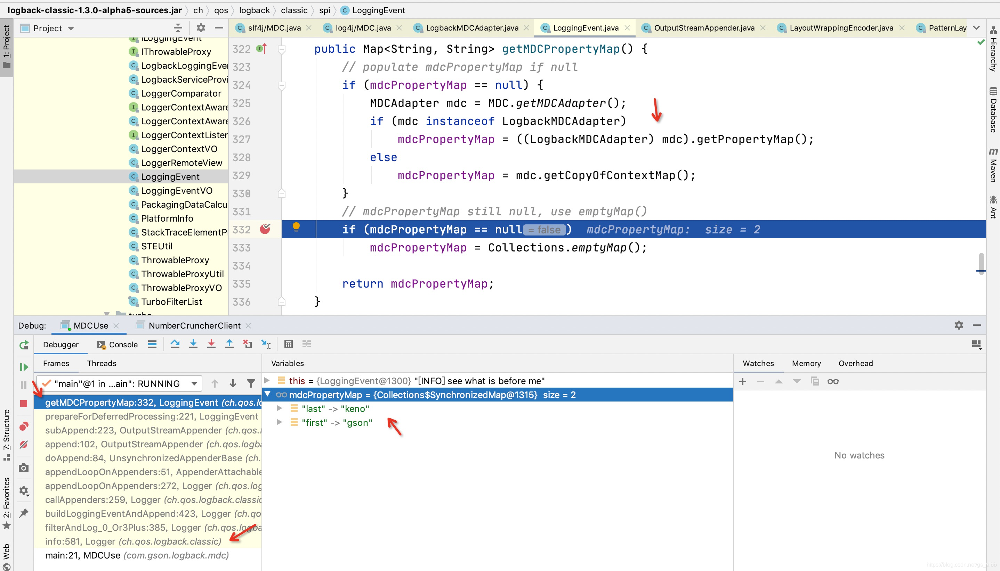
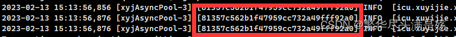

## slf4j的MDC机制

### 前言

MDC（Mapped Diagnostic Context）是一个可以追踪程序上下文日志的东西，是 Springboot 项目自带的 `org.slf4j` 包下的类，无需引入额外依赖即可使用。举例来说，对于一个web Server，如果服务端想在打印出的每行日志中都记录客户端的ip，你只需要在服务端入口获取到 `cleint ip`，设置到 `MDC` 中，服务请求结束时，移除掉。如果日志配置文件配置得当，这一过程中所有打印的日志信息中都会显示clientIp。

### 一、为什么要跟踪日志

1. 假如我们需要分析用户 a 的请求日志，但是程序的访问量很大，还有 b、c、d 用户同时访问，那怎么确定哪一条日志是 a 用户请求的呢？这时候就需要使用 `MDC` 对用户 a 的日志进行跟踪。
2. 微服务调用，我们很难确定某条日志是从哪台机器请求的，这时候也可以使用 `MDC` 进行[链路追踪](https://so.csdn.net/so/search?q=%E9%93%BE%E8%B7%AF%E8%BF%BD%E8%B8%AA&spm=1001.2101.3001.7020)。


### 二、MDC存储日志原理

`MDC` 使用 `ThreadLocal` 存储日志数据，所以它是线程安全的，它可以把同一个请求的日志都存储一个相同的值，每次打印日志的时候，会自动打印出当前日志的键值`value`，我们查询日志的时候就可以根据 `value` 来查询。如果服务端处理请求的线程需要生产更多的子线程时(Executors.execute), `MDC` 中的信息会丢失，开发者需要自己主动拷贝 `MDC` 信息到子线程中去，相关的 `api` 有 `MDC.getCopyOfContextMap()`, `MDC.setContextMapValues()`。

涉及到 `SPI` 原理，`Adapter` 适配器设计模式，`ThreadLocal` 线程副本变量等方面。

`slf4j-api` 的 `MDC` 工具类可以 `put(key,val)`，看代码可以发现，是通过 `SLF4JServiceProvider` 找到了绑定的底层日志框架，获取到了底层真正的 `MDCAdapter`, `put` 方法也是底层的 `MDCAdapter` 在执行。

`MDC` 目前只有 `log4j` 和 `logback` 有实现，`logback` 的实现类 `LogbackMDCAdapter` 利用的 `ThreadLocal` 技术保证了每个请求线程保有自己的 `MDC` 环境变量。

其实，不难猜，当打印日志时，肯定会根据配置文件中 `MDC` 的配置符去 `MDC` 中获取到相应的 `MDC` 值，替代日志格式中的占位符，这里不详细展开，只附加一张图。



### 三、开始代码

#### 1. 封装MDC工具类

此工具类定义了一个 `traceId` 作为日志的 `key`，使用 `UUID` 为不同的请求生成不同的 `traceId` 值，作为 `value`

```
import org.slf4j.MDC;

import java.util.Map;
import java.util.UUID;

public class MdcUtil {
    public static final String TRACE_ID = "traceId";

    public static String generateTraceId() {
        return UUID.randomUUID().toString().replace("-", "");
    }

    public static String getTraceId() {
        return MDC.get(TRACE_ID);
    }

    public static void setTraceId(String traceId) {
        MDC.put(TRACE_ID, traceId);
    }

    public static void setContextMap(Map<String, String> context) {
        MDC.setContextMap(context);
    }

    public static void removeTraceId() {
        MDC.remove(TRACE_ID);
    }

    public static void clear() {
        MDC.clear();
    }
}
```

#### 2.注册日志追踪拦截器

下面是当请求进入时，为该请求生成一个 `traceId`，如果有上层调用就用上层的 `ID`，否则构建一个，上层 `ID`就是微服务的时候，从消费者服务器请求过来时携带的`traceId`，这时应该沿用消费者服务器携带的ID作为，达到链路追踪的目的。(下面是拦截器代码，记得把拦截器注册一下，注册的代码略)

```
import icu.xuyijie.management.utils.log.MdcUtil;
import jakarta.servlet.http.HttpServletRequest;
import jakarta.servlet.http.HttpServletResponse;
import org.jetbrains.annotations.NotNull;
import org.springframework.web.servlet.HandlerInterceptor;

import java.util.Objects;

public class LogTraceInterceptor implements HandlerInterceptor {
    @Override
    public boolean preHandle(HttpServletRequest request, @NotNull HttpServletResponse response, @NotNull Object handler) {
        //如果有上层调用就用上层的ID，否则构建一个
        if (request.getHeader(MdcUtil.TRACE_ID) != null) {
            request.getHeaders().set(MdcUtil.TRACE_ID, MdcUtil.getTraceId());
        } else {
            request.getHeaders().set(MdcUtil.TRACE_ID, MdcUtil.generateTraceId());
        }
        MdcUtil.setTraceId(traceId);
        return true;
    }

    @Override
    public void afterCompletion(@NotNull HttpServletRequest request, @NotNull HttpServletResponse response, @NotNull Object handler, Exception ex) {
        //调用结束后删除
        MdcUtil.removeTraceId();
    }
}
```

### 四、配置logBack

```
<?xml version="1.0" encoding="UTF-8"?>
<configuration scan="true" scanPeriod="60 seconds" debug="false">
    <!-- 日志输出格式，traceId就是代码里面定义的key键名traceId -->
    <property name="log.pattern" value="%date{yyyy-MM-dd HH:mm:ss.SSS} [%thread] %-5level [%X{traceId}] %logger{36} - [%method,%line] - %msg%n"/>
    <!-- 控制台输出 -->
    <appender name="console" class="ch.qos.logback.core.ConsoleAppender">
        <encoder>
            <pattern>%d [%thread] [%X{traceId}] %-5p [%c] [%F:%L] - %msg%n</pattern>
        </encoder>
    </appender>

    <!-- 系统模块日志级别控制，下面的name改为你自己程序的包路径 -->
    <logger name="icu.xuyijie" level="info"/>
    
    <!-- Spring日志级别控制 -->
    <logger name="org.springframework" level="warn"/>
    <root level="info">
        <appender-ref ref="console"/>
    </root>
</configuration>
```

### 五、查看追踪效果

> 大家请看，下面的日志开头，多了一串 `UUI`D，这就是 `traceId`，相同的代表是同一个请求的日志，不同代表是不同请求打印的日志。



### 六、要解决traceId传递问题

#### 1. 在不同线程之间的传递

这个问题需要重写线程池，在线程池启动线程之前，为当前线程 `copy` 一份 `traceId`，需要下面3个代码文件

1. 多线程日志追踪工具类
   
   在线程池开始线程前为当前线程copy一份traceId:

   ```
    import java.util.Map;
    import java.util.concurrent.Callable;

    public class ThreadMdcUtil {
        public static void setTraceIdIfAbsent() {
            if (MdcUtil.getTraceId() == null) {
                MdcUtil.setTraceId(MdcUtil.generateTraceId());
            }
        }

        public static <T> Callable<T> wrap(final Callable<T> callable, final Map<String, String> context) {
            return () -> {
                if (context == null) {
                    MdcUtil.clear();
                } else {
                    MdcUtil.setContextMap(context);
                }
                setTraceIdIfAbsent();
                try {
                    return callable.call();
                } finally {
                    MdcUtil.clear();
                }
            };
        }

        public static Runnable wrap(final Runnable runnable, final Map<String, String> context) {
            return () -> {
                if (context == null) {
                    MdcUtil.clear();
                } else {
                    MdcUtil.setContextMap(context);
                }
                //设置traceId
                setTraceIdIfAbsent();
                try {
                    runnable.run();
                } finally {
                    MdcUtil.clear();
                }
            };
        }
    }
   ```

2. 日志追踪线程池配置

   创建了一个ThreadPoolTaskExecutor的子类，在每次提交线程的时候都会做一些子类配置的操作

   ```
    import icu.xuyijie.management.utils.log.ThreadMdcUtil;
    import org.jetbrains.annotations.NotNull;
    import org.slf4j.MDC;
    import org.springframework.scheduling.concurrent.ThreadPoolTaskExecutor;

    import java.util.concurrent.Callable;
    import java.util.concurrent.Future;

    public class CustomThreadPoolTaskExecutor extends ThreadPoolTaskExecutor {
        @Override
        public void execute(@NotNull Runnable task) {
            super.execute(ThreadMdcUtil.wrap(task, MDC.getCopyOfContextMap()));
        }

        @NotNull
        @Override
        public Future<?> submit(@NotNull Runnable task) {
            return super.submit(ThreadMdcUtil.wrap(task, MDC.getCopyOfContextMap()));
        }

        @NotNull
        @Override
        public <T> Future<T> submit(@NotNull Callable<T> task) {
            return super.submit(ThreadMdcUtil.wrap(task, MDC.getCopyOfContextMap()));
        }
    }
   ```

3. 重写线程池
   
   下面重写了@Async的线程池和手动创建线程使用的线程池

   ```
    import org.springframework.boot.SpringBootConfiguration;
    import org.springframework.context.annotation.Bean;
    import org.springframework.scheduling.concurrent.ThreadPoolTaskExecutor;

    import java.util.concurrent.*;

    @SpringBootConfiguration
    public class ThreadPoolConfig {
        /**
        * 这里定义一个日志追踪线程池，使用时直接注入ThreadPoolTaskExecutor，使用@Qualifier("getLogTraceExecutor")指定bean
        */
        @Bean
        public CustomThreadPoolTaskExecutor getLogTraceExecutor() {
            //创建了一个ThreadPoolTaskExecutor的子类，在每次提交线程的时候都会做一些子类配置的操作
            CustomThreadPoolTaskExecutor executor =new CustomThreadPoolTaskExecutor();
            // 设置线程名称前缀
            executor.setThreadNamePrefix("LogTraceExecutor-");
            executor.initialize();
            return executor;
        }

        /**
        * 重写默认线程池配置，@Async异步会使用这个线程池
        */
        @Bean
        public Executor taskExecutor() {
            //创建了一个ThreadPoolTaskExecutor的子类，在每次提交线程的时候都会做一些子类配置的操作
            ThreadPoolTaskExecutor executor = new CustomThreadPoolTaskExecutor();
            // 设置线程名称前缀
            executor.setThreadNamePrefix("logTranceAsyncPool-");
            executor.initialize();
            return executor;
        }
    }
   ```

#### 2. 远程调用时候的传递

这个问题相对简单，直接配置一个 `httpClient` 拦截器，这样就会在每次发起远程请求时携带 `traceId`，如果你使用的是 `OpenFeign` 或者 `Dubbo` 等调用工具，请根据每个工具自行配置。

```
import icu.xuyijie.management.utils.log.MdcUtil;
import org.jetbrains.annotations.NotNull;
import org.springframework.http.HttpRequest;
import org.springframework.http.client.ClientHttpRequestExecution;
import org.springframework.http.client.ClientHttpRequestInterceptor;
import org.springframework.http.client.ClientHttpResponse;

import java.io.IOException;
import java.util.Objects;

public class CustomClientHttpRequestInterceptor implements ClientHttpRequestInterceptor {
    @Override
    @NotNull
    public ClientHttpResponse intercept(HttpRequest request, @NotNull byte[] body, ClientHttpRequestExecution execution) throws IOException {
        //设置日志追踪id
        if (MdcUtil.getTraceId() != null) {
            request.getHeaders().set(MdcUtil.TRACE_ID, MdcUtil.getTraceId());
        } else {
            request.getHeaders().set(MdcUtil.TRACE_ID, MdcUtil.generateTraceId());
        }
        return execution.execute(request, body);
    }
}
```

### 总结

本文介绍的内容在线上调试的时候非常有用，可以快速在海量日志中寻找出自己需要的日志，在没有配置日志追踪之前，在线上坎巴拉里面寻找日志非常痛苦，我只想找出属于我的那个请求的10条日志，但是线上日志的刷新速度是N条/s，根本找不到，有了traceId以后就方便了，先找出我打印出的登录的用户名日志，查看此条日志的traceId，然后搜索这个traceId就可以啦！

### Refernece 

- [slf4j的MDC机制](https://blog.csdn.net/gs_albb/article/details/110352163)
- [Springboot使用MDC进行日志追踪](https://blog.csdn.net/qq_48922459/article/details/129001157)
- [slf4j介绍MDC](https://www.slf4j.org/manual.html#mdc)
- [Chapter 8: Mapped Diagnostic Context](https://logback.qos.ch/manual/mdc.html)