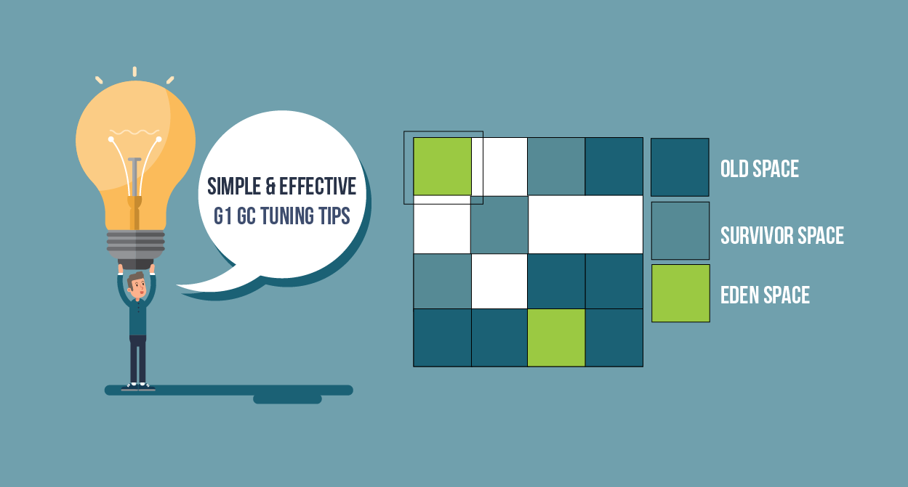
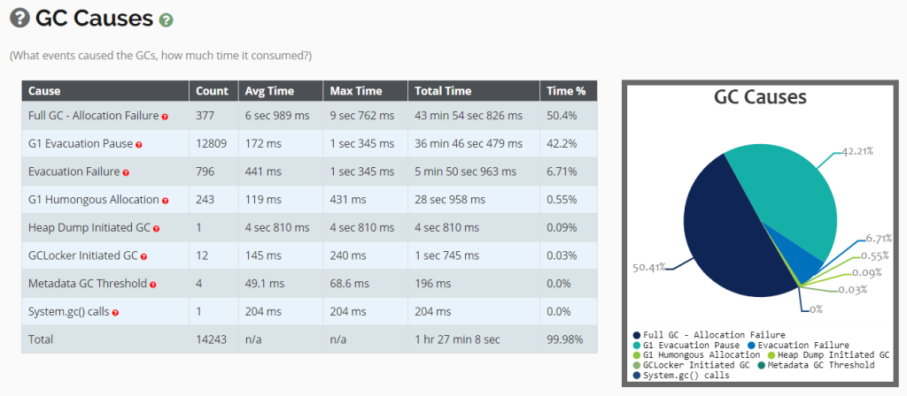

## 简单且有效的 G1GC 调优技巧



G1 GC 是一种自适应垃圾回收算法，从 Java 9 起它已经成为默认垃圾回收算法。我们将分享一些调优 G1 垃圾回收器的小技巧以帮助取得最有性能。

### 1. 最大垃圾回收停顿时间

考虑将你倾向于达到的停顿时间目标传递给 `-XX:MaxGCPauseMillis` 参数。这个参数设立了一个最大停顿时间数，G1 GC 算法将尽力达到这个目标。

### 2. 避免设立年轻代大小

避免将年轻代设置为一个特定大小（通过传递`‘-Xmn, -XX:NewRatio’`参数）。G1 GC　算法通过在运行时修改年轻代大小以达成目标停顿时间。如果你的年轻代被显式配置，目标停顿时间将不易达成。

### 3. 删去老旧参数

当你从老的 GC 算法（`CMS`, `Parallel`, …）转到 G1 GC 算法，请删除所有与老的垃圾回收算法相关的 JVM 参数。典型地传递老的垃圾回收算法的参数给 G1 将不会带来任何效果，甚至带来相反的效果。

### 4. 消除重复字符串

由于低效的编程实践，现代应用浪费了很多内存。这里有[一个案例研究](https://dzone.com/articles/memory-wasted-by-spring-boot-application) 展示了 Spring Boot 框架浪费的内存。内存浪费的一个主要原因来自于重复字符串。最近的研究表明 `13.5%`　的应用内存包含重复字符串。你可以传递 `-XX:+UseStringDeduplication` 参数，从而 G1 GC 可以通过这个选项来消除重复字符串。如果你的应用运行在 `Java8u20` 和更高版本，你可以考虑传递这个参数给你的应用。它拥有提高你的应用综合性能的潜力。你可以从[这篇文章](https://blog.gceasy.io/2018/12/23/usestringdeduplication/)学到更到关于这个属性的信息。

### 5. 理解默认设置

基于调优目的，在下表中我们总结了重要的 G1 GC 算法参数以及它们的默认值：

G1 GC 参数|描述
--------|--------
-XX:MaxGCPauseMillis=200|设置最大停顿时间值，默认值是 200 毫秒
-XX:G1HeapRegionSize=n|设置G1 区域大小，其值必须为 2 的幂，例如 256, 512, 1024,…。它可以从 1MB 到 32MB.
-XX:GCTimeRatio=12|设置花在垃圾回收上的总目标时间与花在客户事务上的时间之比。决定目标垃圾回收时间的公式为 `[1 / (1 + GCTimeRatio)]`。默认值 12 指明目标垃圾回收时间为 `[1 / (1 + 12)]`，即 `7.69%`。它意味着 JVM 将会花费 `7.69%` 的时间在垃圾回收上，剩下的 `92.3%` 用于处理客户活动。
-XX:ParallelGCThreads=n|设置 `Stop-the-world` 工作者线程数目。如果你的逻辑核小于等于8，那么将这个值设为逻辑核数目。比如如果你的服务器拥有5个逻辑核，那么设置为5。如果逻辑核多于8个，将其值设置为逻辑核数的近 `5/8`。这种设置在大多数情况下工作良好，一个例外是大型 SPARC 系统，其值应设置为逻辑核数的近 `5/16`。
-XX:ConcGCThreads=n|设置并行标记线程数。设置 `n` 为并行垃圾回收线程数(ParallelGCThreads)的近 `1/4`。
-XX:InitiatingHeapOccupancyPercent=45|当堆的使用率超过这个百分比，垃圾回收标记循环将被触发。默认值为 45%。
-XX:G1NewSizePercent=5|设置年轻代使用堆空间最小所占比例。默认值为你的 Java 堆的 5%。
-XX:G1MaxNewSizePercent=60|设置年轻代使用堆空间最大所占比例。默认值为你的 Java 堆的 60%。
-XX:G1OldCSetRegionThresholdPercent=10|设置在混合垃圾收集循环中老年代被回收的上限。默认值为你的 Java堆的 10%。
-XX:G1ReservePercent=10|设置保留未被使用的自由内存。默认值为 10%。G1　垃圾回收器将尽力保证 10% 的堆为保留的。

### 6. 研究垃圾回收原因

优化 G1 GC 性能的一种有效方式是研究触发垃圾回收的原因，并提供减少它们的方案。下面是研究垃圾回收停顿的步骤：

1. 在你的应用里开启 GC log。可以在启动时传递下面的 JVM 参数给你的应用以开启垃圾回收日志。
   截至 Java 8:
   ```
   -XX:+PrintGCDetails -XX:+PrintGCDateStamps -Xloggc:{file-path}
   ```
   Java 9 及以后版本：
   ```
   -Xlog:gc*:file={file-path}
   ```
   {file-path} 是垃圾收集日志文输出位置。
2. 你可以使用以下工具如 `GCeasy`, `Garbage Cat`, `HP Jmeter` 来研究垃圾回收日志文件。这些工具将报告触发垃圾回收活动的原因。以下是当垃圾回收日志文件被上传后 `GCeasy` 工具产生的 GC 原因表。完整的分析报告可以在[这里](https://gceasy.io/my-gc-report.jsp?p=c2hhcmVkLzIwMjAvMDUvMjkvLS1nY19ib2kuemlwLS0xNS0xOS00OA==&channel=WEB&s=t)找到。
   
   

下面是解决以上问题的方案。

#### 6.1. Full GC – 分配失败

Full GC – 分配失败基于两个原因：

- 应用创建了过多对象且不能足够快地回收
- 当堆发生碎片化时，即使还有很多自由空间老年代里的直接分配也会失败

下面是解决这个问题的潜在方案：

- 通过设置 `‘-XX:ConcGCThreads’` 值来增加并发标记线程数量。增加并发标记线程数量将使得垃圾回收更快。 
- 强迫 G1 尽早开始标记阶段，这可以通过降低 `‘-XX:InitiatingHeapOccupancyPercent’` 值达到。默认值时 45。这意味着 G1 GC 开始标记阶段在堆使用率达到 45%　时就会启动。通过降低这个值，G1 GC 开始标记阶段可以尽早触发，从而可以避免 Full GC。
- 即使堆有足够空间，由于缺少足够连续空间，Full GC 也会被触发。如果内存中有大量巨对象，这就可能发生（请参考 ‘6.3. G1 Humongous Allocation’ 这一章节）。解决这个问题的一个潜在方法是通过 `‘-XX:G1HeapRegionSize’` 来增加堆区域大小，它可以降低在需要分配大量巨对象使的内存空间浪费。

#### 6.2. G1 清空停顿或清空失败

当你看到 G1 清空停顿，那么 G1 GC 没有足够的内存来来容纳 `survivor` 或 `promoted` 对象或两者。由于已经处于最大值，Java 堆不能扩展。下面是解决这个问题的可选方案：

- 增加 `‘-XX:G1ReservePercent’` 的值。其默认值为 10%。它意味着G1 垃圾收集器无论如何都将保持 10%　自由内存空间。当我们试着增加它时，GC 将会提前触发，从而防止清空停顿
- 通过降低 `‘-XX:InitiatingHeapOccupancyPercent’` 值尽早开始始标记循环。默认值时 45，降低这个值将会提前开启标记循环。GC 标记煦暖将会在堆使用率低于 45% 时被促发。另一方面，如果标记循环触发早且未回收，可以增加 `‘-XX:InitiatingHeapOccupancyPercent’` 值到默认值之上。
- 通过设置 `‘-XX:ConcGCThreads’` 值来增加并发标记线程数量。增加并发标记线程数量将使得垃圾回收更快。
- 如果问题依旧，可以考虑增加 JVM 堆大小（例如 -Xmx）

#### 6.3. G1 大对象分配

任何超过堆区域一半大小的对象被称为“巨对象”。如果一个区域包含一个巨对象，区域中最后那个巨对象和区域边界之间的空间便不能再被使用。如果有多个巨对象，这些未使用空间会使得整个堆碎片化。[堆碎片化](https://blog.gceasy.io/2020/05/31/what-is-java-heap-fragmentation/)对应用性能有重大影响。如果你看到多个巨对象分配，请增加你的 `‘-XX:G1HeapRegionSize’` 大小。这个值是 2 的幂，范围从 1MB 到 32MB。

#### 6.4. System.gc()

当 ‘System.gc()’ 或 ‘Runtime.getRuntime().gc()’ 被从你的应用里调用时，`stop-the-world Full GC` 事件将会被触发。你可以通过下面的方案解决这个问题。

##### a. 查找并替换

这可能是传统方法，但确实能工作。在你的代码中搜索 ‘System.gc()’ 和 ‘Runtime.getRuntime().gc()’。如果你看到匹配的，删除它。这种方案仅仅在你的应用源代码中使用了 ‘System.gc()’ 才能工作。如果 ‘System.gc()’ 从第三方库，框架，或者外部源调用，那么这种方案就不能工作。在这种环境下，你可以考虑 `#b` 和 `#c` 中的方案。

##### b. -XX:+DisableExplicitGC

你可以通过在启动应用时传递 JVM 参数 ‘XX:+DisableExplicitGC’ 以强制禁止 System.gc() 调用。合格选项将从你的应用栈中彻底去除 System.gc() 调用。

##### c. -XX:+ExplicitGCInvokesConcurrentAndUnloadsClasses

你可以传递 ‘-XX:+ExplicitGCInvokesConcurrent’ JVM 参数。当这个参数被传递时，GC 收集与应用线程并行运行以减少停顿时间。

##### d. RMI

入股你的应用在使用 RMI，你可以控制 ‘System.gc()’ 被调用的频率。这个频率可以通过以下 JVM 参数在应用启动时传递：

```
-Dsun.rmi.dgc.server.gcInterval=n
-Dsun.rmi.dgc.client.gcInterval=n
```

这些属性的默认值为：

JDK 1.4.2 和 5.0 是 60000 毫秒 (例如　60 秒)

JDK 6 及之后版本为 3600000 毫秒 (例如 60 分钟)

你可能想将这些属性设置为一个极大的值以最小化其影响。

关于 ‘System.gc()’ 调用的更多细节以及其影响你可以参考[这篇文章](https://blog.gceasy.io/2019/06/30/who-why-what-fix-system-gc/)。

#### 6.5 导出堆触发的 GC

导出堆触发的 GC　表明导出的堆是使用工具如 jcmd, jmap, profilers　等从应用捕获的。在捕获导出堆之前，这些工具典型地触发一次　“full GC”，这会导致长时间停顿。除非完全必要，我们不应该捕获导出堆。

### 结论

我们期待这篇文章对你有用，衷心祝愿你可以顺利调优你的应用取得最优性能。

### Referenece
- [Simple & effective G1 GC tuning tips](https://blog.gceasy.io/2020/06/02/simple-effective-g1-gc-tuning-tips/)