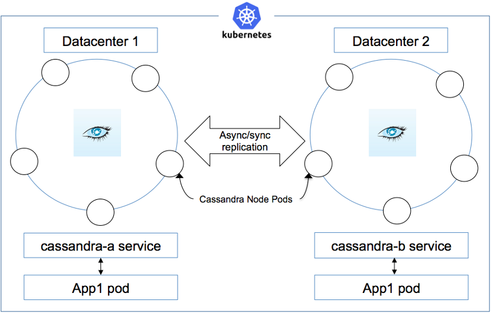

# 10 steps to set up a multi-data center Cassandra cluster on a Kubernetes platform
Apache Cassandra是一款对当前应用拥有被证明过的容错特性，及可扩展的去中心化的 NoSQL 数据库。你可以在 `Docker` 容器上部署`Cassandra`，或者通过`Kubernetes`管理`Cassandra`。

在本教程中，你将学会如何使用Kubernetes跨多个数据中心（地理上相隔几英里）建立一个Cassandra集群，数据中心可以位于不同的国家或地区，使用这种设置的原因如下：
- 执行灾备（live backups）：写到一个数据中心的数据被异步拷贝到另一个数据中心
- 在一个地区的用户（比如美国）可以就近连接数据中心，在另一个地区的用户（比如说印度）同样就近连接数据中心以确保更快的性能
- 如果一个数据中心停止了，你任可用别的数据中心提供Cassandra 数据服务
- 如果一个数据中心的一些节点停止了，Cassandra数据任可用，服务不会中断

开源Kubernetes平台管理的Docker容器是这一切成为可能。
## 创建（Setup）
为了完成本教程中的步骤，你需要利用到Kubernetes 中的一些概念如[pod](https://kubernetes.io/docs/concepts/workloads/pods/pod-overview/), [StatefulSet](https://kubernetes.io/docs/concepts/workloads/controllers/statefulset/), [headless service](https://kubernetes.io/docs/concepts/services-networking/service/#headless-services), 和[PersistentVolume](https://kubernetes.io/docs/concepts/storage/persistent-volumes/)等。下面是你所需要的：
- 一个Kubernetes 集群，带有分别位于两个数据中心的节点。确保Kubernetes 版本是V1.8.x或更高
- 每个数据中心至少有3个节点，Kubernetes 将在其上部署pods

图1显示了每个数据中心有5个节点，每个Kubernetes 节点部署一个Cassandra pod代表一个Cassandra 节点。应用程序pods部署于每个数据中心，它们利用无头服务访问本地（数据中心的）Cassandra 节点。写到一个数据中心的任何节点上的数据被异步拷贝到另一个数据中心。

图1：一个跨两个数据中心（每数据中心5节点）的Cassandra 集群

## 主意（The idea）
创建两个StatefulSets，一个数据中心一个。StatefulSet将管理一套pods的部署和缩放（scaling ），并保证这些pods的顺序和唯一性。StatefulSet 定义了节点亲缘性，如此一个StatefulSet 的pods仅仅部署在一个数据中心。这是通过在每个节点上设置标签实现的。给第一个数据中心的所有节点打上标签 `dc=DC1` ，给第而个数据中心的所有节点打上标签 `dc=DC2` 。这些将会是Cassandra 两个数据中心的种子节点，但如果你有5个节点，推荐设立两个种子节点。给Kubernetes 节点加上合适的标签.

**按数据中心给节点加标签**
```
kubectl label nodes nodea1 dc=DC1
kubectl label nodes nodea2 dc=DC1
kubectl label nodes nodea3 dc=DC1
kubectl label nodes nodeb1 dc=DC2
kubectl label nodes nodeb2 dc=DC2
kubectl label nodes nodeb3 dc=DC2
```
## 行动（The action）
本教程中的所有代码可在 [GitHub](https://github.com/ideagw/multi-dc-c7a-k8s) 上找到，克隆该仓库并从那里拷贝YAML 文件。
### 1. 创建名字空间
首先，创建一个名字空间，在哪里你将从事你所有的工作：
`kubectl create namespace c7a`
### 2. 创建无头服务
```
kubectl ‑n c7a create ‑f service.yaml
```
无头服务允许应用pods通过服务名连接到Cassandra pods。拥有两个无头服务，一个无头服务服务于一个数据中心的Cassandra Pods，另一个无头服务服务于另一个数据中心的Cassandra Pods。部署于每个数据中心的应用Pods可以利用环境变量来选择连接本地数据中心的Cassandra服务。
### 3. 创建持久卷（persistent volumes）
Cassandra 节点将数据存储到持久卷上，因为Cassandra 倾向于每个节点本地存储，你可以预先规划存储。总共有6个节点。首先，在每个节点上创建目录以存储Cassandra 数据，例如 `/data/cass/`。确保每个节点上该目录至少有10 GB空间可用。在每个数据中心的3个节点上创建该目录.

然后用GitHub上提供的YAML文件创建所有6个 `PersistentVolumes`，你可以根据需要调整目录的大小和位置：
```
kubectl ‑n c7a create ‑f local_pvs.yaml
```
### 4. 创建StatefulSets
在StatefulSet中定义的PVC将消费PV。创建两个StatefulSets（一个数据中心一个）。记住，第一个数据中心的每个节点带有 `dc=DC1` 标签，第二个数据中心的每个节点带有 `dc=DC2` 标签。StatefulSet 中的节点亲缘性spec被命名为`cassandra-a`确保pods 仅仅被调度到 `DC1` 数据中心，类似地，`cassandra-b StatefulSet`具有到 `DC2` 的亲缘性。所有使用那个StatefulSet 的pods 都被仅仅部署到DC2数据中心。
```
spec:
  affinity:
    nodeAffinity:
      requiredDuringSchedulingIgnoredDuringExecution:
        nodeSelectorTerms:
        ‑ matchExpressions:
          ‑ key: dc
            operator: In
            values:
            ‑ DC1
```
StatefulSet 是Kubernetes中功能强大的构造设施。为了理解Pods如何部署和网络如何工作，你需要理解一些核心惯例：
#### 4.1 Pod 名字
StatefulSet 中Pod是顺序创建的，以第一个Pod的名字开始，以0结束。Pod名遵循下面的语义：`<statefulset name>-<ordinal index>`。本教程中，`DC1` 的Pod被命名为`cassandra-a-0`, `cassandra-a-1`, 和 `cassandra-a-2`；`DC2` 的Pod被命名为`cassandra-b-0`等等。
#### 4.2 网络地址
一个StatefulSet 可以利用无头服务来控制器Pods的域名。服务管理的域名形如 `$(service name).$(namespace).svc.cluster.local`，这里 `cluster.local` 是集群域名。当每个Pod被创建时，它得到其匹配的DNS 子域名，形如 `$(podname).$(service name).$(namespace).svc.cluster.local`。在本教程中，`DC1`中的pod拥有名字 `cassandra-a-0.cassandra-a.c7a.svc.cluster.local`，别的pod都遵循该命名规则。
#### 4.3 PVC
在StatefulSet 中PVC模板被命名为 `cassandra-data`。最终由该StatefulSet 生成的PVC将会被命名为格式 `$(volumeClaimTemplate name)-$(pod name)`。对于这些，StatefulSet 的部署将会创建VC，例如 `cassandra-data-cassandra-a-0` 和 `cassandra-data-cassandra-b-0`。VC匹配对应的Pod。由于使用静态规划，VC选择了它们期待的卷。
#### 4.4 Cassandra 配置
在StatefulSet中有很多事关Cassandra 配置的细节，它们由Cassandra Docker镜像通过环境变量的方式暴露出来。一个重要的方面是Cassandra 种子的指定。推荐对每个数据中心至少指定一个种子节点。因此通常每个数据中心的第一个节点被指派为种子节点。注意需要种子节点的全域名（fully qualified node name）。另一个值得注意的区别是数据中心的指定。StatefulSet `cassandra-a`在 `DC1`，而StatefulSet `cassandra-b` 在数据中心 `DC2`.

现在是时间创建两个StatefulSets了，确保它们都被创建成功：
```
kubectl ‑n c7a create ‑f statefulset‑a.yaml
kubectl ‑n c7a create ‑f statefulset‑b.yaml
kubectl ‑n c7a get statefulsets
```
### 5. 验证Cassandra 种子节点
在本教程中，一个副本在每个StatefulSet 顶一种指定，因此对每个StatefulSet，在每个数据中心只有仅仅一个pod被创建。这些pod将被命名为`cassandra-a-0` 和 `cassandra-b-0`，打印其列表以确认：
```
kubectl ‑n c7a get pods ‑o wide

NAME           READY     STATUS    RESTARTS   AGE       IP           NODE
cassandra‑a‑0   1/1       Running   0          4m        10.244.0.6   iops15
cassandra‑b‑0   1/1       Running   2          3m        10.244.1.2   kube‑vm1
```
如果pod被创建成功且处于运行状态，检查Cassandra的 `nodetool status`。你应该从每个数据中心看到一个节点：
```
kubectl ‑n c7a exec ‑ti cassandra‑a‑0 ‑‑ nodetool status
Data center: DC1
===============
Status=Up/Down
|/ State=Normal/Leaving/Joining/Moving
‑‑  Address      Load       Tokens       Owns (effective)  Host ID                               Rack
UN  10.244.2.22  127.33 KiB  256          100%             59b4e526‑3a3c‑4252‑84b7‑2c6c5de05e13  Rack1
Data center: DC2
===============
Status=Up/Down
|/ State=Normal/Leaving/Joining/Moving
‑‑  Address      Load       Tokens       Owns (effective)  Host ID                               Rack
UN  10.244.5.6   108.63 KiB  256          100%             cb86a5e6‑2666‑445e‑ba96‑88640b0e7848  Rack1
```
如果两个种子节点容器任一个出现错误，检查其日志看看发生了什么。你可以利用`kubectl -n c7a logs cassandra-a-0`获取`cassandra-a-0`的日志。
### 6. 利用StatefulSet扩容
到现在为止每个数据中心仅仅创建了一个Cassandra 节点，现在是时候利用StatefulSet来扩容pods了。将每个StatefulSet的副本数量摄者为3：
```
kubectl ‑n c7a scale ‑‑replicas=3 statefulset/cassandra‑a
kubectl ‑n c7a scale ‑‑replicas=3 statefulset/cassandra‑b
```
现在每个StatefulSets 扩容到3个副本。你可以拥有更多副本，但你需要确保你已经预先规划好了PV。
### 7. 验证别的Cassandra 节点
几分钟内，剩余的pods会启动运行并加入Cassandra集群。使用 `nodetool` 工具来检验所有Cassandra节点的状态：
```
kubectl ‑n c7a exec ‑ti cassandra‑a‑0 ‑‑ nodetool status
Data center: DC1
===============
Status=Up/Down
|/ State=Normal/Leaving/Joining/Moving
‑‑  Address      Load       Tokens       Owns (effective)  Host ID                               Rack
UN  10.244.2.22  127.33 KiB  256          29.7%             59b4e526‑3a3c‑4252‑84b7‑2c6c5de05e13  Rack1
UN  10.244.1.24  108.62 KiB  256          32.9%             7749be9d‑4b66‑4c9f‑8afc‑55d484d7404f  Rack1
UN  10.244.1.25  218.27 KiB  256          32.6%             bfd26111‑21e3‑42a9‑bdf6‑b2068c1bd1c5  Rack1
Data center: DC2
===============
Status=Up/Down
|/ State=Normal/Leaving/Joining/Moving
‑‑  Address      Load       Tokens       Owns (effective)  Host ID                               Rack
UN  10.244.5.6   108.63 KiB  256          35.7%             cb86a5e6‑2666‑445e‑ba96‑88640b0e7848  Rack1
UN  10.244.5.7   196.67 KiB  256          33.8%             1a0b6ba5‑a9fd‑4d67‑bb5f‑9cdc97b5433e  Rack1
UN  10.244.5.8   127.42 KiB  256          35.4%             09fa301d‑d057‑4b2d‑a44f‑7ab57d7e5197  Rack1
```
上面的输出显式由6个节点，每个数据中心3个，已经启动成功并运行正常。
### 8. 利用副本配置来创建Cassandra keyspace
现在创建一个keyspace，并制定每个数据中心需要多少个副本。每个数据中心拥有多个副本对本地节点失败有帮助。因为即使一个节点失败了，数据也可从另一个副本得到。
```
kubectl ‑n c7a exec ‑ti cassandra‑a‑0 ‑‑ cqlsh
    Connected to Cassandra at 127.0.0.1:9042.
cqlsh 5.0.1 | Cassandra 3.11.1 | CQL spec 3.4.4 | Native protocol v4Use HELP for help.
cqlsh> create keyspace hr_keyspace with replication ={'class' : 'NetworkTopologyStrategy', 'DC1':2, 'DC2':2};
```
上面的代码显示了一个Cassandra shell会话(cqlsh)在`cassandra-a-0`节点上发起。接下来一个叫`hr_keyspace`的keyspace被创建。当该keyspace 被创建时，它需要指定副本策略。典型情况下当多个数据中心被引入时，`NetworkTopologyStrategy` 副本策略会被使用。有一个选项指定每个数据中心需要多少个副本，在上面的例子中，数据中心 `DC1` 和 `DC2` 都被指定为2个副本。

接下来，创建一个表并添加数据：
```
cqlsh> use hr_keyspace;
cqlsh> CREATE TABLE employee( emp_id int PRIMARY KEY, emp_name text, emp_city text, emp_sal varint, emp_phone varint);
#For asynchronous writes to other data center, set the #consistency level to LOCAL_QUORUM
cqlsh:hr_keyspace> consistency LOCAL_QUORUM
Consistency level set to LOCAL_QUORUM.
cqlsh:hr_keyspace> INSERT INTO employee (emp_id, emp_name, emp_city,emp_sal,emp_phone) VALUES(1,'David', 'San Francisco', 50000, 983210987);
cqlsh:hr_keyspace> INSERT INTO employee (emp_id, emp_name, emp_city,emp_sal,emp_phone) VALUES(2,'Robin', 'San Jose', 55000, 9848022339); 
cqlsh:hr_keyspace> INSERT INTO employee (emp_id, emp_name, emp_city,emp_sal,emp_phone) VALUES(3,'Bob', 'Austin', 45000, 9848022330);
cqlsh:hr_keyspace> INSERT INTO employee (emp_id, emp_name, emp_city,emp_sal,emp_phone) VALUES(4, 'Monica','San Jose', 55000, 9458022330);
```
请注意一致性级别`LOCAL_QUORUM`，它确版数据首先被写入到本地节点，然后被异步拷贝到远程数据中心节点上。这很重要，因为它告诉Cassandra异步拷贝数据到远程数据中心。

现在试着从任意节点查询数据：
```
cqlsh:hr_keyspace> select * from employee;

 emp_id | emp_city      | emp_name | emp_phone  | emp_sal
‑‑‑‑‑‑‑‑+‑‑‑‑‑‑‑‑‑‑‑‑‑‑‑+‑‑‑‑‑‑‑‑‑‑+‑‑‑‑‑‑‑‑‑‑‑‑+‑‑‑‑‑‑‑‑‑
      1 | San Francisco |    David |  983210987 |   50000
      2 |      San Jose |    Robin | 9848022339 |   55000
      4 |      San Jose |   Monica | 9458022330 |   55000
      3 |        Austin |      Bob | 9848022330 |   45000

cqlsh:hr_keyspace> quit;
```
### 9. 模拟一个站点失败
你可以通过让一个数据中心的所有Pods不可用来模拟一个站点失败。为了实现这个，删除一个StatefulSet。如果一个StatefulSet 被删除掉了，该数据中心的3个节点将会失效，从而模拟一个站点失败。如果这个发生了，你仍然可以从其它站点得到数据：
```
kubectl ‑n c7a delete statefulset cassandra‑a
statefulset "cassandra‑a" deleted

kubectl ‑n c7a get pods ‑o wide
```
这删除了StatefulSet cassandra-a及其所属Pods。现在仅仅遗留有3个Cassandra Pods，都位于数据中心DC2。连接到其中任一个并查询数据：
```
kubectl ‑n c7a exec ‑ti cassandra‑b‑1 – cqlsh
    Connected to Cassandra at 127.0.0.1:9042.
cqlsh 5.0.1 | Cassandra 3.11.1 | CQL spec 3.4.4 | Native protocol v4Use HELP for help.
cqlsh> use hr_keyspace;
cqlsh:hr_keyspace> select * from employee;

 emp_id | emp_city      | emp_name  | emp_phone   | emp_sal
‑‑‑‑‑‑‑‑+‑‑‑‑‑‑‑‑‑‑‑‑‑‑‑+‑‑‑‑‑‑‑‑‑‑‑+‑‑‑‑‑‑‑‑‑‑‑‑‑+‑‑‑‑‑‑‑‑‑
      1 | San Francisco |    David  |  983210987  |   50000
      2 |      San Jose |    Robin  | 9848022339  |   55000
      4 |      San Jose |   Monica  | 9458022330  |   55000
      3 |        Austin |      Bob  | 9848022330  |   45000

(4 rows)
cqlsh:hr_keyspace> quit;
```
这显示数据仍可从其它数据中心的节点上可用。注意上例是直接连接到Cassandra 节点上。但实践中使用Cassandra 的应用通常通过创建集群的无头服务连接，如图1所示。
### 10. 清理
为了删除Kubernetes 集群中c7a名字下的所有资源，运行下面的命令：
```
kubectl –n c7a delete statefulset,pvc,pv,svc ‑l app=cassandra
```
## 结论
在本教程中，你看到了如何在一个Kubernetes 平台上建立一个多数据中心Cassandra 集群。这个设置对于建立灾备是有用的，能够保护站点或数据中心失败。对Cassandra集群位置感知的访问方式也减小了读写延迟。
## 可下载的资源
[本文档PDF格式下载](https://www.ibm.com/developerworks/library/ba-multi-data-center-cassandra-cluster-kubernetes-platform/ba-multi-data-center-cassandra-cluster-kubernetes-platform-pdf.pdf)
## 相关主题
- [本教程代码](https://github.com/ideagw/multi-dc-c7a-k8s)
- [IBM Code中的容器编排代码模式](https://developer.ibm.com/code/technologies/container-orchestration/)
- [Apache Cassandra](http://cassandra.apache.org/)
- [Kubernetes](https://kubernetes.io/)

## Reference
- [10 steps to set up a multi-data center Cassandra cluster on a Kubernetes platform](https://developer.ibm.com/tutorials/ba-multi-data-center-cassandra-cluster-kubernetes-platform/)
- [multi-dc-c7a-k8s](https://github.com/ideagw/multi-dc-c7a-k8s)