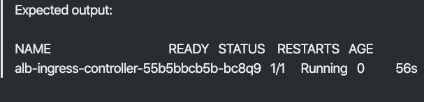
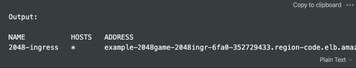

# AWS ALB-Ingress-Controller指南
在收集了海量的解决方案，处理了许多客户问题之后，我决定创建本指南来演示精彩的ALB，澄清一些AWS官方文档，并自动化99%的工作。你可能根据你的需求改变每一步，但你需要100%遵守这里的角色和策略。例如，如果你想改变命名空间，请确保在每一个文件中改变；否则你将得到一个巨大的“OOPS!”，甚至更大的坑。
## 确保你的EKS子网上下列标签已经正确设置
- 你的VPC中的所有子网应打上相应标签，如此Kubernetes 才能发现它们
```
Key: kubernetes.io/cluster/<cluster-name> Value: shared
```
- VPC中的公有子网应打上相应标签，如此Kubernetes 才能知道仅仅这些子网可用于外部负载均衡
```
Key: kubernetes.io/role/elb Value: 1
```
- 私有子网应该打上如下标签，如此Kubernetes 才能知道仅仅这些子网可用于内部负载均衡
```
Key: kubernetes.io/role/internal-elb Value: 1
```
## 安装 eksctl
https://docs.aws.amazon.com/eks/latest/userguide/getting-started-eksctl.html
## 创建一个IAM OIDC提供者（可以在一个IAM中手动创建）及身份提供者
```
eksctl utils associate-iam-oidc-provider \
    --region <region> \
    --cluster <eks cluster name> \
    --approve
```
## 创建一个IAM策略 ALBIngressControllerIAMPolicy 并附上iam-policy.yaml
```
curl -o iam-policy.json https://raw.githubusercontent.com/kubernetes-sigs/aws-alb-ingress-controller/v1.1.8/docs/examples/iam-policy.json
aws iam create-policy \
    --policy-name ALBIngressControllerIAMPolicy \
    --policy-document file://iam-policy.json
```
## 利用下面命令在kube-system名称空间创建一个Kubernetes服务账号alb-ingress-controller，一个集群角色（cluster role），以及一个与ALB Ingress Controller绑定的集群角色，
```
curl -o rbac-role-alb-ingress-controller.yaml https://raw.githubusercontent.com/kubernetes-sigs/aws-alb-ingress-controller/v1.1.8/docs/examples/rbac-role.yaml
kubectl apply -f rbac-role-alb-ingress-controller.yaml
```
## 创建角色，添加信任关系与注解
1. 创建一个文档trust.json，并添加
    ```
    {
    "Version":"2012-10-17",
    "Statement":[
        {
            "Effect":"Allow",
            "Principal":{
                "Federated":"arn:aws:iam::<AWS account ID>:oidc-provider/<OIDC url>"
            },
            "Action":"sts:AssumeRoleWithWebIdentity",
            "Condition":{
                "StringEquals":{
                "<OIDC url>:sub":"system:serviceaccount:kube-system:alb-ingress-controller"
                }
            }
        }
    ]
    }
    ```
    > 将Federated 替换为OIDC ARN；StringEquals替换为OIDC URL。这些可以在IAM > 身份提供者中找到。
2. 创建一个IAM角色并附上信任关系
   ```
   aws iam create-role --role-name eks-alb-ingress-controller --assume-role-policy-document file://trust.json
   ```
3. 将ALBIngressControllerIAMPolicy 附着到alb 角色上
   ```
   aws iam attach-role-policy --role-name eks-alb-ingress-controller --policy-arn=<ARN of the created policy>
   ```
4. 给控制器Pod添加注解来使用角色
   ```
   kubectl annotate serviceaccount -n kube-system alb-ingress-controller \
      eks.amazonaws.com/role-arn=arn:aws:iam::535518648590:role/eks-alb-ingress-controller
   ```
5. 将下面的角色添加到alb角色上
   ```
   aws iam attach-role-policy --role-name eks-alb-ingress-controller --policy-arn arn:aws:iam::aws:policy/AmazonEKSWorkerNodePolicy
   aws iam attach-role-policy --role-name eks-alb-ingress-controller --policy-arn arn:aws:iam::aws:policy/AmazonEKS_CNI_Policy
   ```
## 部署alb-ingress-controller
```
curl -o alb-ingress-controller.yaml https://raw.githubusercontent.com/kubernetes-sigs/aws-alb-ingress-controller/v1.1.8/docs/examples/alb-ingress-controller.yaml https://raw.githubusercontent.com/kubernetes-sigs/aws-alb-ingress-controller/v1.1.8/docs/examples/alb-ingress-controller.yaml
```
## 编辑alb-ingress-controller--添加一些值
1. 编辑alb-ingress-controller.yaml，如果以下这些不存在就添加它们
   ```
   spec:
    containers:
    - args:
      - --ingress-class=alb
      - --cluster-name=<name of eks cluster>
   ```
2. 如果你在使用Fargate
   ```
   spec:
   containers:
   - args:
     - --ingress-class=alb
     - --cluster-name=<name of eks cluster>
     - --aws-vpc-id=<vpcID>
     - --aws-region=<region-code>
   ```
3. 应用该yaml
   ```
   kubectl apply -f alb-ingress-controller.yaml
   ```
## 检查ALB是否已经启动

## 随ingress部署实例应用
A. 使用公共文件
```
kubectl apply -f https://raw.githubusercontent.com/kubernetes-sigs/aws-alb-ingress-controller/v1.1.8/docs/examples/2048/2048-namespace.yaml
kubectl apply -f https://raw.githubusercontent.com/kubernetes-sigs/aws-alb-ingress-controller/v1.1.8/docs/examples/2048/2048-deployment.yaml
kubectl apply -f https://raw.githubusercontent.com/kubernetes-sigs/aws-alb-ingress-controller/v1.1.8/docs/examples/2048/2048-service.yaml
kubectl apply -f https://raw.githubusercontent.com/kubernetes-sigs/aws-alb-ingress-controller/v1.1.8/docs/examples/2048/2048-ingress.yaml
```
这将部署一个ingress对象，该对象会被alb-ingress-controller选中，一个ALB 将会被部署。
B. 将这些文件存于本地以定制（推荐）
```
curl -o <fileName.yaml> <URL from the previous steps>
kubectl apply -f <fileName>.yaml
```
## 验证ingress

## alb-ingress-controller问题诊断
检查日志：
```
kubectl logs -n kube-system deployment.apps/alb-ingress-controller
```
## 检查应用
打开一个浏览器，定位到上个命令输出的地址以查看示例应用。
> 如果没有地址，检查上面命令的控制器的日志并诊断（应该不出现）。
## HTTP到HTTPS重定向
A. 将下面的注解添加到你的ingress 对象，并插入AWS ACM中你的证书的 ARN。
```
alb.ingress.kubernetes.io/actions.ssl-redirect: '{"Type": "redirect", "RedirectConfig": { "Protocol": "HTTPS", "Port": "443", "StatusCode": "HTTP_301"}}'
alb.ingress.kubernetes.io/certificate-arn: <certificate arn from ACM>
alb.ingress.kubernetes.io/listen-ports: '[{"HTTP": 80}, {"HTTPS":443}]'
```
B. 添加下面的规格：
+ 用你的服务名和端口作相应替换
```
spec:
  rules:
    - http:
        paths:
          - path: /*
            backend:
              serviceName: ssl-redirect
              servicePort: use-annotation
          - path: /*
            backend:
              serviceName: <"serviceName">
              servicePort: <servicePort>
```
+ 最好的方式是重建ingress。 
## 检查重定向
打开浏览器并定位到负载均衡的地址URL。

祝你好运。更多问题，请联系我evgenibi@cloudzone.io。

## Reference
- [AWS ALB-Ingress-Controller Guide](https://cloudzone.io/aws-alb-ingress-controller-guide-for-your-eks-cluster/)