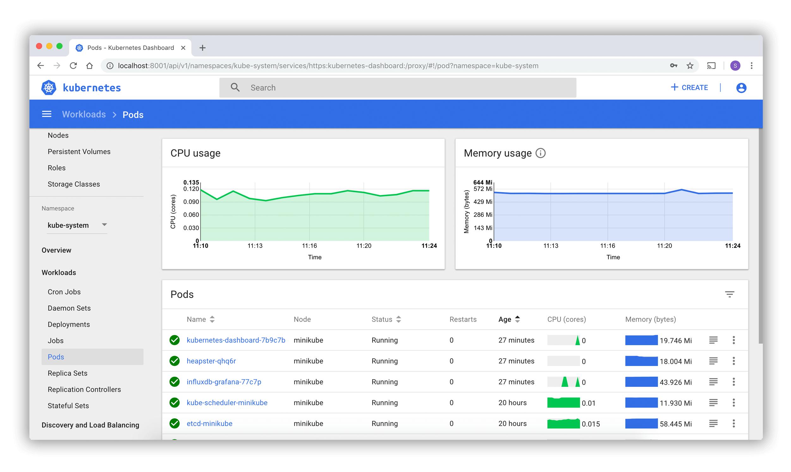

# Access Applications in a Cluster (访问集群中的应用程序)
- [Deploy and Access the Kubernetes Dashboard](https://kubernetes.io/docs/tasks/access-application-cluster/web-ui-dashboard/): Deploy the web UI (Kubernetes Dashboard) and access it.
- [Accessing Clusters](https://kubernetes.io/docs/tasks/access-application-cluster/access-cluster/)
- [Configure Access to Multiple Clusters](https://kubernetes.io/docs/tasks/access-application-cluster/configure-access-multiple-clusters/)
- [Use Port Forwarding to Access Applications in a Cluster](https://kubernetes.io/docs/tasks/access-application-cluster/port-forward-access-application-cluster/)
- [Use a Service to Access an Application in a Cluster](https://kubernetes.io/docs/tasks/access-application-cluster/service-access-application-cluster/)
- [Connect a Frontend to a Backend Using Services](https://kubernetes.io/docs/tasks/access-application-cluster/connecting-frontend-backend/)
- [Create an External Load Balancer](https://kubernetes.io/docs/tasks/access-application-cluster/create-external-load-balancer/)
- [List All Container Images Running in a Cluster](https://kubernetes.io/docs/tasks/access-application-cluster/list-all-running-container-images/)
- [Set up Ingress on Minikube with the NGINX Ingress Controller](https://kubernetes.io/docs/tasks/access-application-cluster/ingress-minikube/)
- [Communicate Between Containers in the Same Pod Using a Shared Volume](https://kubernetes.io/docs/tasks/access-application-cluster/communicate-containers-same-pod-shared-volume/)
- [Configure DNS for a Cluster](https://kubernetes.io/docs/tasks/access-application-cluster/configure-dns-cluster/)
## 一. 部署和访问Kubernetes仪表板
Dashboard 是基于网页的 Kubernetes 用户界面。 你可以使用 Dashboard 将容器应用部署到 Kubernetes 集群中，也可以对容器应用排错，还能管理集群资源。 你可以使用 Dashboard 获取运行在集群中的应用的概览信息，也可以创建或者修改 Kubernetes 资源 （如 Deployment，Job，DaemonSet 等等）。 例如，你可以对 Deployment 实现弹性伸缩、发起滚动升级、重启 Pod 或者使用向导创建新的应用。

Dashboard 同时展示了 Kubernetes 集群中的资源状态信息和所有错误信息。


### 部署 Dashboard UI
默认情况下不会部署 Dashboard。可以通过以下命令部署：
```
kubectl apply -f https://raw.githubusercontent.com/kubernetes/dashboard/v2.3.1/aio/deploy/recommended.yaml
```
### 访问 Dashboard UI
为了保护你的集群数据，默认情况下，`Dashboard` 会使用最少的 RBAC 配置进行部署。 当前，`Dashboard` 仅支持使用 `Bearer` 令牌登录。 要为此样本演示创建令牌，你可以按照 创建示例用户 上的指南进行操作。
> 警告： 在教程中创建的样本用户将具有管理特权，并且仅用于教育目的。
#### 命令行代理
你可以使用 kubectl 命令行工具访问 Dashboard，命令如下：
```
kubectl proxy
```
kubectl 会使得 Dashboard 可以通过 http://localhost:8001/api/v1/namespaces/kubernetes-dashboard/services/https:kubernetes-dashboard:/proxy/ 访问。

UI 只能 通过执行这条命令的机器进行访问。更多选项参见 kubectl proxy --help。
> 说明： Kubeconfig 身份验证方法不支持外部身份提供程序或基于 x509 证书的身份验证。
### 欢迎界面
当访问空集群的 Dashboard 时，你会看到欢迎界面。 页面包含一个指向此文档的链接，以及一个用于部署第一个应用程序的按钮。 此外，你可以看到在默认情况下有哪些默认系统应用运行在 kube-system 名字空间 中，比如 Dashboard 自己。


### 部署容器化应用
通过一个简单的部署向导，你可以使用 Dashboard 将容器化应用作为一个 Deployment 和可选的 Service 进行创建和部署。可以手工指定应用的详细配置，或者上传一个包含应用配置的 YAML 或 JSON 文件。

点击任何页面右上角的 CREATE 按钮以开始。
#### 指定应用的详细配置
部署向导需要你提供以下信息：
- 应用名称（必填）：应用的名称。内容为应用名称的[标签](https://kubernetes.io/docs/concepts/overview/working-with-objects/labels/) 会被添加到任何将被部署的 Deployment 和 Service。

  在选定的 [Kubernetes 名字空间](https://kubernetes.io/zh/docs/tasks/administer-cluster/namespaces/) 中，应用名称必须唯一。必须由小写字母开头，以数字或者小写字母结尾，并且只含有小写字母、数字和中划线（-）。小于等于24个字符。开头和结尾的空格会被忽略。
- 容器镜像（必填）：公共镜像仓库上的 [Docker 容器镜像](https://kubernetes.io/zh/docs/concepts/containers/images/) 或者私有镜像仓库 （通常是 Google Container Registry 或者 Docker Hub）的 URL。容器镜像参数说明必须以冒号结尾。
- Pod 的数量（必填）：你希望应用程序部署的 Pod 的数量。值必须为正整数。

  系统会创建一个 [Deployment](https://kubernetes.io/zh/docs/concepts/workloads/controllers/deployment/) 以保证集群中运行期望的 Pod 数量。
- 服务（可选）：对于部分应用（比如前端），你可能想对外暴露一个 [Service](https://kubernetes.io/zh/docs/concepts/services-networking/service/) ，这个 Service 可能用的是集群之外的公网 IP 地址（外部 Service）。

  > 说明： 对于外部服务，你可能需要开放一个或多个端口才行。
  其它只能对集群内部可见的 Service 称为内部 Service。

  不管哪种 Service 类型，如果你选择创建一个 Service，而且容器在一个端口上开启了监听（入向的）， 那么你需要定义两个端口。创建的 Service 会把（入向的）端口映射到容器可见的目标端口。 该 Service 会把流量路由到你部署的 Pod。支持 TCP 协议和 UDP 协议。 这个 Service 的内部 DNS 解析名就是之前你定义的应用名称的值。

如果需要，你可以打开 `Advanced Options` 部分，这里你可以定义更多设置：
- 描述：这里你输入的文本会作为一个 [注解](https://kubernetes.io/zh/docs/concepts/overview/working-with-objects/annotations/) 添加到 Deployment，并显示在应用的详细信息中。
- 标签：应用默认使用的[标签](https://kubernetes.io/zh/docs/concepts/overview/working-with-objects/labels/)是应用名称和版本。 你可以为 Deployment、Service（如果有）定义额外的标签，比如 release（版本）、 environment（环境）、tier（层级）、partition（分区） 和 release track（版本跟踪）。

  例子：
  ```
  release=1.0
  tier=frontend
  environment=pod
  track=stable
  ```
- 名字空间：Kubernetes 支持多个虚拟集群依附于同一个物理集群。 这些虚拟集群被称为[名字空间](https://kubernetes.io/zh/docs/tasks/administer-cluster/namespaces/)， 可以让你将资源划分为逻辑命名的组。

  Dashboard 通过下拉菜单提供所有可用的名字空间，并允许你创建新的名字空间。 名字空间的名称最长可以包含 63 个字母或数字和中横线（-），但是不能包含大写字母。

  名字空间的名称不能只包含数字。如果名字被设置成一个数字，比如 10，pod 就在名字空间创建成功的情况下，默认会使用新创建的名字空间。如果创建失败，那么第一个名字空间会被选中。
- 镜像拉取 Secret：如果要使用私有的 Docker 容器镜像，需要拉取 [Secret]((https://kubernetes.io/zh/docs/concepts/configuration/secret/)) 凭证。

  Dashboard 通过下拉菜单提供所有可用的 Secret，并允许你创建新的 Secret。 Secret 名称必须遵循 DNS 域名语法，比如 `new.image-pull.secret`。 Secret 的内容必须是 base64 编码的，并且在一个 .dockercfg 文件中声明。Secret 名称最大可以包含 253 个字符。

  在镜像拉取 Secret 创建成功的情况下，默认会使用新创建的 Secret。 如果创建失败，则不会使用任何 Secret。
- CPU 需求（核数）和内存需求（MiB）：你可以为容器定义最小的[资源限制](https://kubernetes.io/zh/docs/tasks/administer-cluster/manage-resources/memory-default-namespace/)。 默认情况下，Pod 没有 CPU 和内存限制。
- 运行命令和运行命令参数：默认情况下，你的容器会运行 Docker 镜像的默认[入口命令](https://kubernetes.io/zh/docs/tasks/inject-data-application/define-command-argument-container/)。 你可以使用 command 选项覆盖默认值。
- 以特权模式运行：这个设置决定了在[特权容器](https://kubernetes.io/zh/docs/concepts/workloads/pods/#privileged-mode-for-containers)中运行的进程是否像主机中使用 root 运行的进程一样。 特权容器可以使用诸如操纵网络堆栈和访问设备的功能。
- 环境变量：Kubernetes 通过[环境变量](https://kubernetes.io/zh/docs/tasks/inject-data-application/environment-variable-expose-pod-information/)暴露 Service。你可以构建环境变量，或者将环境变量的值作为参数传递给你的命令。 它们可以被应用用于查找 Service。值可以通过 `$(VAR_NAME)` 语法关联其它变量。
#### 上传 YAML 或者 JSON 文件
Kubernetes 支持声明式配置。所有的配置都存储在遵循 Kubernetes API 规范的 YAML 或者 JSON 配置文件中。

作为一种替代在部署向导中指定应用详情的方式，你可以在 YAML 或者 JSON 文件中定义应用，并且使用 Dashboard 上传文件。
### 使用 Dashboard
以下各节描述了 Kubernetes Dashboard UI 视图；包括它们提供的内容，以及怎么使用它们。
#### 导航
当在集群中定义 Kubernetes 对象时，Dashboard 会在初始视图中显示它们。 默认情况下只会显示 默认 名字空间中的对象，可以通过更改导航栏菜单中的名字空间筛选器进行改变。

Dashboard 展示大部分 Kubernetes 对象，并将它们分组放在几个菜单类别中。
#### 管理概述
对集群和名字空间管理员, Dashboard 会列出节点、名字空间和持久卷，并且有它们的详细视图。 节点列表视图包含从所有节点聚合的 CPU 和内存使用的度量值。详细信息视图显示了一个节点的度量值，它的规格、状态、分配的资源、事件和这个节点上运行的 Pod。
#### 负载
显示选中的名字空间中所有运行的应用。 视图按照负载类型（如 Deployment、ReplicaSet、StatefulSet 等）罗列应用，并且每种负载都可以单独查看。列表总结了关于负载的可执行信息，比如一个 ReplicaSet 的准备状态的 Pod 数量，或者目前一个 Pod 的内存使用量。

工作负载的详情视图展示了对象的状态、详细信息和相互关系。 例如，ReplicaSet 所控制的 Pod，或者 Deployment 关联的 新 ReplicaSet 和 Pod 水平扩展控制器。
#### 服务
展示允许暴露给外网服务和允许集群内部发现的 Kubernetes 资源。 因此，Service 和 Ingress 视图展示他们关联的 Pod、给集群连接使用的内部端点和给外部用户使用的外部端点。
#### 存储
存储视图展示持久卷申领（PVC）资源，这些资源被应用程序用来存储数据。
#### ConfigMap 和 Secret
展示的所有 Kubernetes 资源是在集群中运行的应用程序的实时配置。 通过这个视图可以编辑和管理配置对象，并显示那些默认隐藏的 secret。
#### 日志查看器
Pod 列表和详细信息页面可以链接到 Dashboard 内置的日志查看器。查看器可以钻取属于同一个 Pod 的不同容器的日志。


## 二. 访问集群
本文阐述多种与集群交互的方法。
### 1. 使用 kubectl 完成集群的第一次访问
当你第一次访问 Kubernetes API 的时候，我们建议你使用 Kubernetes CLI，`kubectl`。

访问集群时，你需要知道集群的地址并且拥有访问的凭证。通常，这些在你通过[启动安装](https://kubernetes.io/zh/docs/setup/)安装集群时都是自动安装好的，或者其他人安装时 也应该提供了凭证和集群地址。

通过以下命令检查 kubectl 是否知道集群地址及凭证：
```
kubectl config view
```
有许多[例子](https://kubernetes.io/zh/docs/reference/kubectl/cheatsheet/)介绍了如何使用 kubectl， 可以在[kubectl手册](https://kubernetes.io/zh/docs/reference/kubectl/overview/)中找到更完整的文档。
### 2. 直接访问 REST API
Kubectl 处理 apiserver 的定位和身份验证。如果要使用 `curl` 或 `wget` 等 `http` 客户端或浏览器直接访问 REST API，可以通过多种方式查找和验证：
- 以代理模式运行 kubectl。
  + 推荐此方式。
  + 使用已存储的 apiserver 地址。
  + 使用自签名的证书来验证 apiserver 的身份。杜绝 MITM 攻击。
  + 对 apiserver 进行身份验证。
  + 未来可能会实现智能化的客户端负载均衡和故障恢复。
- 直接向 http 客户端提供位置和凭据。
  + 可选的方案。
  + 适用于代理可能引起混淆的某些客户端类型。
  + 需要引入根证书到你的浏览器以防止 MITM 攻击。
#### 使用 kubectl proxy
以下命令以反向代理的模式运行 kubectl。它处理 apiserver 的定位和验证。 像这样运行：
```
kubectl proxy --port=8080 &
```
参阅 [kubectl proxy](https://kubernetes.io/docs/reference/generated/kubectl/kubectl-commands/#proxy) 获取更多详细信息。

然后，你可以使用 curl、wget 或浏览器访问 API，如果是 IPv6 则用 [::1] 替换 localhost， 如下所示：
```
curl http://localhost:8080/api/

{
  "kind": "APIVersions",
  "versions": [
    "v1"
  ],
  "serverAddressByClientCIDRs": [
    {
      "clientCIDR": "0.0.0.0/0",
      "serverAddress": "10.0.1.149:443"
    }
  ]
}
```
#### 不使用 kubectl proxy
在 Kubernetes 1.3 或更高版本中，kubectl config view 不再显示 token。 使用 kubectl describe secret ... 来获取默认服务帐户的 token，如下所示：

grep/cut 方法实现：
```
APISERVER=$(kubectl config view | grep server | cut -f 2- -d ":" | tr -d " ")
TOKEN=$(kubectl describe secret $(kubectl get secrets | grep default | cut -f1 -d ' ') | grep -E '^token' | cut -f2 -d':' | tr -d ' ')
curl $APISERVER/api --header "Authorization: Bearer $TOKEN" --insecure

{
  "kind": "APIVersions",
  "versions": [
    "v1"
  ],
  "serverAddressByClientCIDRs": [
    {
      "clientCIDR": "0.0.0.0/0",
      "serverAddress": "10.0.1.149:443"
    }
  ]
}
```
> **注意**：这里返回的APISERVE是一个列表如：https://9AE0853D7962A9E004641AA223974A4B.gr7.us-east-1.eks.amazonaws.com https://291830D24251F44BCA77BE2D3DC074DB.sk1.us-east-1.eks.amazonaws.com https://59F138489A2623D076BE061C417F8FD1.gr7.us-east-1.eks.amazonaws.com https://4284A68AD3AB4DC64902A67BB98A62B6.gr7.us-east-2.eks.amazonaws.com。因此你必须选择一个地址用于后面的测试，或者利用下面的 jsonpath 方法。
jsonpath 方法实现：
```
APISERVER=$(kubectl config view --minify -o jsonpath='{.clusters[0].cluster.server}')
TOKEN=$(kubectl get secret $(kubectl get serviceaccount default -o jsonpath='{.secrets[0].name}') -o jsonpath='{.data.token}' | base64 --decode )
curl $APISERVER/api --header "Authorization: Bearer $TOKEN" --insecure

{
  "kind": "APIVersions",
  "versions": [
    "v1"
  ],
  "serverAddressByClientCIDRs": [
    {
      "clientCIDR": "0.0.0.0/0",
      "serverAddress": "10.0.1.149:443"
    }
  ]
}
```
面的例子使用了 --insecure 参数，这使得它很容易受到 MITM 攻击。 当 kubectl 访问集群时，它使用存储的根证书和客户端证书来访问服务器 （它们安装在 ~/.kube 目录中）。 由于集群证书通常是自签名的，因此可能需要特殊配置才能让你的 http 客户端使用根证书。

在一些集群中，apiserver 不需要身份验证；它可能只服务于 localhost，或者被防火墙保护， 这个没有一定的标准。 [配置对 API 的访问](https://kubernetes.io/zh/docs/concepts/security/controlling-access/)描述了集群管理员如何进行配置。此类方法可能与未来的高可用性支持相冲突。
### 3. 以编程方式访问 API
Kubernetes 官方提供对 [Go](https://kubernetes.io/zh/docs/tasks/access-application-cluster/access-cluster/#go-client) 和 [Python](https://kubernetes.io/zh/docs/tasks/access-application-cluster/access-cluster/#python-client) 的客户端库支持。
#### Go 客户端
- 想要获得这个库，请运行命令：`go get k8s.io/client-go/<version number>/kubernetes`。查阅 [INSTALL.md](https://github.com/kubernetes/client-go/blob/master/INSTALL.md#for-the-casual-user) 可得到详细安装步骤。 参阅 https://github.com/kubernetes/client-go 来查看目前支持哪些版本。
- 基于这个 client-go 客户端库编写应用程序。 请注意，client-go 定义了自己的 API 对象，因此如果需要，请从 client-go 而不是从主存储库 导入 API 定义，例如，`import "k8s.io/client-go/kubernetes"` 才是对的。

Go 客户端可以像 kubectl CLI 一样使用相同的 [kubeconfig 文件](https://kubernetes.io/zh/docs/concepts/configuration/organize-cluster-access-kubeconfig/) 来定位和验证 apiserver。可参阅[示例](https://git.k8s.io/client-go/examples/out-of-cluster-client-configuration/main.go)。

如果应用程序以 Pod 的形式部署在集群中，那么请参阅[下一章](https://kubernetes.io/zh/docs/tasks/access-application-cluster/access-cluster/#accessing-the-api-from-a-pod)。
#### Python 客户端
如果想要使用 [Python 客户端](https://github.com/kubernetes-client/python)， 请运行命令：`pip install kubernetes`。参阅 [Python Client Library page](https://github.com/kubernetes-client/python) 以获得更详细的安装参数。

Python 客户端可以像 kubectl CLI 一样使用相同的 [kubeconfig 文件](https://kubernetes.io/zh/docs/concepts/configuration/organize-cluster-access-kubeconfig/)来定位和验证 apiserver，可参阅[示例](https://github.com/kubernetes-client/python/tree/master/examples)。
#### 其它语言
目前有多个[客户端库](https://kubernetes.io/zh/docs/reference/using-api/client-libraries/)为其它语言提供访问 API 的方法。 参阅其它库的相关文档以获取他们是如何验证的。
#### 从 Pod 中访问 API
当你从 Pod 中访问 API 时，定位和验证 apiserver 会有些许不同。

在 Pod 中定位 apiserver 的推荐方式是通过 `kubernetes.default.svc` 这个 DNS 名称，该名称将会解析为服务 IP，然后服务 IP 将会路由到 apiserver。

向 apiserver 进行身份验证的推荐方法是使用[服务帐户](https://kubernetes.io/zh/docs/tasks/configure-pod-container/configure-service-account/)凭据。 通过 kube-system，Pod 与服务帐户相关联，并且该服务帐户的凭证（token） 被放置在该 Pod 中每个容器的文件系统中，位于 `/var/run/secrets/kubernetes.io/serviceaccount/token`。

如果可用，则将证书放入每个容器的文件系统中的 `/var/run/secrets/kubernetes.io/serviceaccount/ca.crt`， 并且应该用于验证 apiserver 的服务证书。

最后，名字空间作用域的 API 操作所使用的 default 名字空间将被放置在 每个容器的 `/var/run/secrets/kubernetes.io/serviceaccount/namespace` 文件中。

在 Pod 中，建议连接 API 的方法是：
- 在 Pod 的边车容器中运行 `kubectl proxy`，或者以后台进程的形式运行。 这将把 Kubernetes API 代理到当前 Pod 的 localhost 接口， 所以 Pod 中的所有容器中的进程都能访问它。
使用 Go 客户端库，并使用 `rest.InClusterConfig()` 和 `kubernetes.NewForConfig()` 函数创建一个客户端。 他们处理 apiserver 的定位和身份验证。 [示例](https://git.k8s.io/client-go/examples/in-cluster-client-configuration/main.go) 

在每种情况下，Pod 的凭证都是为了与 apiserver 安全地通信。
### 4. 访问集群中正在运行的服务
上一节介绍了如何连接 Kubernetes API 服务。本节介绍如何连接到 Kubernetes 集群上运行的其他服务。 在 Kubernetes 中，[节点](https://kubernetes.io/zh/docs/concepts/architecture/nodes/)、 [pods](https://kubernetes.io/zh/docs/concepts/workloads/pods/) 和[服务](https://kubernetes.io/zh/docs/concepts/services-networking/service/) 都有自己的 IP。 在许多情况下，集群上的节点 IP、Pod IP 和某些服务 IP 将无法路由， 因此无法从集群外部的计算机（例如桌面计算机）访问它们。
#### 连接的方法
有多种方式可以从集群外部连接节点、Pod 和服务：
- 通过公共 IP 访问服务
  + 类型为 NodePort 或 LoadBalancer 的服务，集群外部可以访问。 请参阅[服务](https://kubernetes.io/zh/docs/concepts/services-networking/service/)和 [kubectl expose](https://kubernetes.io/docs/reference/generated/kubectl/kubectl-commands/#expose) 文档。
  + 取决于你的集群环境，该服务可能仅暴露给你的公司网络，或者也可能暴露给 整个互联网。 请考虑公开该服务是否安全。它是否进行自己的身份验证？
  + 在服务后端放置 Pod。要从一组副本中访问一个特定的 Pod，例如进行调试， 请在 Pod 上设置一个唯一的标签，然后创建一个选择此标签的新服务。
  + 在大多数情况下，应用程序开发人员不应该通过其 nodeIP 直接访问节点。
- 使用 proxy 动词访问服务、节点或者 Pod
  + 在访问远程服务之前进行 apiserver 身份验证和授权。 如果服务不能够安全地暴露到互联网，或者服务不能获得节点 IP 端口的 访问权限，或者是为了调试，那么请使用此选项。
  + 代理可能会给一些 web 应用带来问题。
  + 只适用于 HTTP/HTTPS。
  + 更多详细信息在[这里](https://kubernetes.io/zh/docs/tasks/access-application-cluster/access-cluster/#manually-constructing-apiserver-proxy-urls)。
- 从集群中的节点或者 Pod 中访问
  + 运行一个 Pod，然后使用 [kubectl exec](https://kubernetes.io/docs/reference/generated/kubectl/kubectl-commands/#exec) 来连接 Pod 里的 Shell。 然后从 Shell 中连接其它的节点、Pod 和服务。
  + 有些集群可能允许你通过 SSH 连接到节点，从那你可能可以访问集群的服务。 这是一个非正式的方式，可能可以运行在个别的集群上。 浏览器和其它一些工具可能没有被安装。集群的 DNS 可能无法使用。
#### 发现内建服务（builtin service）
通常来说，集群中会有 kube-system 创建的一些运行的服务。

通过 kubectl cluster-info 命令获得这些服务列表：
```
kubectl cluster-info
```
输出如下：
```
Kubernetes master is running at https://104.197.5.247
elasticsearch-logging is running at https://104.197.5.247/api/v1/namespaces/kube-system/services/elasticsearch-logging/proxy
kibana-logging is running at https://104.197.5.247/api/v1/namespaces/kube-system/services/kibana-logging/proxy
kube-dns is running at https://104.197.5.247/api/v1/namespaces/kube-system/services/kube-dns/proxy
grafana is running at https://104.197.5.247/api/v1/namespaces/kube-system/services/monitoring-grafana/proxy
heapster is running at https://104.197.5.247/api/v1/namespaces/kube-system/services/monitoring-heapster/proxy
```
这展示了访问每个服务的 `proxy-verb` URL。 例如，如果集群启动了集群级别的日志（使用 Elasticsearch），并且传递合适的凭证， 那么可以通过 `https://104.197.5.247/api/v1/namespaces/kube-system/services/elasticsearch-logging/proxy/` 进行访问。日志也能通过 kubectl 代理获取，例如：`http://localhost:8080/api/v1/namespaces/kube-system/services/elasticsearch-logging/proxy/`。 （参阅[使用 Kubernetes API 访问集群](https://kubernetes.io/zh/docs/tasks/administer-cluster/access-cluster-api/)了解如何传递凭据，或者使用 kubectl proxy）
**手动构建 apiserver 代理 URL（Manually constructing apiserver proxy URLs）**
如上所述，你可以使用 `kubectl cluster-info` 命令来获得服务的代理 URL。 要创建包含服务端点、后缀和参数的代理 URL，需添加到服务的代理 URL：
```
http://kubernetes_master_address/api/v1/namespaces/namespace_name/services/service_name[:port_name]/proxy
```
如果尚未为端口指定名称，则不必在 URL 中指定 `port_name`。对于已命名和未命名的端口，也可以使用端口号代替 `port_name`。

默认情况下，API server 使用 HTTP 代理你的服务。 要使用 HTTPS，请在服务名称前加上 https: 
```
http://kubernetes_master_address/api/v1/namespaces/namespace_name/services/https:service_name:[port_name]/proxy
```
URL 名称段支持的格式为：
- <service_name> - 使用 http 代理到默认或未命名的端口
- <service_name>:<port_name> - 使用 http 代理到指定的端口名称或端口号
- https:<service_name>: - 使用 https 代理到默认或未命名的端口（注意后面的冒号）
- https:<service_name>:<port_name> - 使用 https 代理到指定的端口名称或端口号

示例：
- 要访问 Elasticsearch 服务端点 `_search?q=user:kimchy`，你需要使用：`http://104.197.5.247/api/v1/namespaces/kube-system/services/elasticsearch-logging/proxy/_search?q=user:kimchy`
- 要访问 Elasticsearch 集群健康信息 `_cluster/health?pretty=true`，你需要使用：`https://104.197.5.247/api/v1/namespaces/kube-system/services/elasticsearch-logging/proxy/_cluster/health?pretty=true`
```
{
    "cluster_name" : "kubernetes_logging",
    "status" : "yellow",
    "timed_out" : false,
    "number_of_nodes" : 1,
    "number_of_data_nodes" : 1,
    "active_primary_shards" : 5,
    "active_shards" : 5,
    "relocating_shards" : 0,
    "initializing_shards" : 0,
    "unassigned_shards" : 5
  }
```
#### 使用 web 浏览器访问运行在集群上的服务
你可以在浏览器地址栏中输入 apiserver 代理 URL。但是：
- Web 浏览器通常不能传递令牌，因此你可能需要使用基本（密码）身份验证。 Apiserver 可以配置为接受基本身份验证，但你的集群可能未进行配置。
- 某些 Web 应用程序可能无法运行，尤其是那些使用客户端 javascript 以不知道代理路径前缀的方式构建 URL 的应用程序。
### 5. 请求重定向（Requesting redirects）
重定向功能已弃用并被删除。请改用代理（见下文）。
### 6. 多种代理
使用 Kubernetes 时可能会遇到几种不同的代理：
1. [kubectl 代理](https://kubernetes.io/zh/docs/tasks/access-application-cluster/access-cluster/#directly-accessing-the-rest-api)：
   + 在用户的桌面或 Pod 中运行
   + 代理从本地主机地址到 Kubernetes apiserver
   + 客户端到代理将使用 HTTP
   + 代理到 apiserver 使用 HTTPS
   + 定位 apiserver
   + 添加身份验证头部
2. [apiserver 代理](https://kubernetes.io/zh/docs/tasks/access-application-cluster/access-cluster/#discovering-builtin-services)：
   + 内置于 apiserver 中
   + 将集群外部的用户连接到集群 IP，否则这些 IP 可能无法访问
   + 运行在 apiserver 进程中
   + 客户端代理使用 HTTPS（也可配置为 http）
   + 代理将根据可用的信息决定使用 HTTP 或者 HTTPS 代理到目标
   + 可用于访问节点、Pod 或服务
   + 在访问服务时进行负载平衡
3. [kube proxy](https://kubernetes.io/zh/docs/concepts/services-networking/service/#ips-and-vips)：
   + 运行在每个节点上
   + 代理 UDP 和 TCP
   + 不能代理 HTTP
   + 提供负载均衡
   + 只能用来访问服务
4. 位于 apiserver 之前的 Proxy/Load-balancer：
   + 存在和实现因集群而异（例如 nginx）
   + 位于所有客户和一个或多个 apiserver 之间
   + 如果有多个 apiserver，则充当负载均衡器
5. 外部服务上的云负载均衡器：
   + 由一些云提供商提供（例如 AWS ELB，Google Cloud Load Balancer）
   + 当 Kubernetes 服务类型为 LoadBalancer 时自动创建
   + 只使用 UDP/TCP
   + 具体实现因云提供商而异。

除了前两种类型之外，Kubernetes 用户通常不需要担心任何其他问题。 集群管理员通常会确保后者的正确配置。
## 三. 配置对多集群的访问
本文展示如何使用配置文件来配置对多个集群的访问。 在将集群、用户和上下文定义在一个或多个配置文件中之后，用户可以使用 `kubectl config use-context` 命令快速地在集群之间进行切换。
> **说明**：用于配置集群访问的文件有时被称为 kubeconfig 文件。 这是一种引用配置文件的通用方式，并不意味着存在一个名为 kubeconfig 的文件。

> **警告**：只使用来源可靠的 kubeconfig 文件。使用特制的 kubeconfig 文件可能会导致恶意代码执行或文件暴露。 如果必须使用不受信任的 kubeconfig 文件，请首先像检查 shell 脚本一样仔细检查它。
### 1. 准备开始
你必须拥有一个 Kubernetes 的集群，同时你的 Kubernetes 集群必须带有 kubectl 命令行工具。 如果你还没有集群，你可以通过 [Minikube](https://kubernetes.io/zh/docs/tasks/tools/#minikube) 构建一 个你自己的集群，或者你可以使用下面任意一个 Kubernetes 工具构建：
- [Katacoda](https://www.katacoda.com/courses/kubernetes/playground)
- [玩转 Kubernetes](http://labs.play-with-k8s.com/)

要检查 kubectl 是否安装，执行 `kubectl version --client` 命令。 kubectl 的版本应该与集群的 API 服务器[使用同一次版本号](https://kubernetes.io/zh/releases/version-skew-policy/#kubectl)。
### 2. 定义集群、用户和上下文
假设用户有两个集群，一个用于正式开发工作，一个用于其它临时用途（scratch）。 在 `development` 集群中，前端开发者在名为 `frontend` 的名字空间下工作，存储开发者在名为 `storage` 的名字空间下工作。 在 `scratch` 集群中，开发人员可能在默认名字空间下工作，也可能视情况创建附加的名字空间。访问开发集群需要通过证书进行认证。访问其它临时用途的集群需要通过用户名和密码进行认证。

创建名为 `config-exercise` 的目录。在 `config-exercise` 目录中，创建名为 `config-demo` 的文件，其内容为：
```
apiVersion: v1
kind: Config
preferences: {}

clusters:
- cluster:
  name: development
- cluster:
  name: scratch

users:
- name: developer
- name: experimenter

contexts:
- context:
  name: dev-frontend
- context:
  name: dev-storage
- context:
  name: exp-scratch
```
配置文件描述了集群、用户名和上下文。`config-demo` 文件中含有描述两个集群、 两个用户和三个上下文的框架。

进入 config-exercise 目录。输入以下命令，将集群详细信息添加到配置文件中：
```
kubectl config --kubeconfig=config-demo set-cluster development --server=https://1.2.3.4 --certificate-authority=fake-ca-file
kubectl config --kubeconfig=config-demo set-cluster scratch --server=https://5.6.7.8 --insecure-skip-tls-verify
```
将用户详细信息添加到配置文件中：
```
kubectl config --kubeconfig=config-demo set-credentials developer --client-certificate=fake-cert-file --client-key=fake-key-seefile
kubectl config --kubeconfig=config-demo set-credentials experimenter --username=exp --password=some-password
```
注意：
- 要删除用户，可以运行 kubectl --kubeconfig=config-demo config unset users.<name>
- 要删除集群，可以运行 kubectl --kubeconfig=config-demo config unset clusters.<name>
- 要删除上下文，可以运行 kubectl --kubeconfig=config-demo config unset contexts.<name>

将上下文详细信息添加到配置文件中：
```
kubectl config --kubeconfig=config-demo set-context dev-frontend --cluster=development --namespace=frontend --user=developer
kubectl config --kubeconfig=config-demo set-context dev-storage --cluster=development --namespace=storage --user=developer
kubectl config --kubeconfig=config-demo set-context exp-scratch --cluster=scratch --namespace=default --user=experimenter
```
打开 config-demo 文件查看添加的详细信息。 也可以使用 config view 命令进行查看：
```
kubectl config --kubeconfig=config-demo view
```
输出展示了两个集群、两个用户和三个上下文：
```
apiVersion: v1
clusters:
- cluster:
    certificate-authority: fake-ca-file
    server: https://1.2.3.4
  name: development
- cluster:
    insecure-skip-tls-verify: true
    server: https://5.6.7.8
  name: scratch
contexts:
- context:
    cluster: development
    namespace: frontend
    user: developer
  name: dev-frontend
- context:
    cluster: development
    namespace: storage
    user: developer
  name: dev-storage
- context:
    cluster: scratch
    namespace: default
    user: experimenter
  name: exp-scratch
current-context: ""
kind: Config
preferences: {}
users:
- name: developer
  user:
    client-certificate: fake-cert-file
    client-key: fake-key-file
- name: experimenter
  user:
    password: some-password
    username: exp
```
其中的 `fake-ca-file`、`fake-cert-file` 和 `fake-key-file` 是证书文件路径名的占位符。 你需要更改这些值，使之对应你的环境中证书文件的实际路径名。

有时你可能希望在这里使用 `BASE64` 编码的数据而不是一个个独立的证书文件。 如果是这样，你需要在键名上添加 -data 后缀。例如，`certificate-authority-data`、`client-certificate-data` 和 `client-key-data`。

每个上下文包含三部分（集群、用户和名字空间），例如，`dev-frontend` 上下文表明：使用 `developer` 用户的凭证来访问 `development` 集群的 `frontend` 名字空间。

设置当前上下文：
```
kubectl config --kubeconfig=config-demo use-context dev-frontend
```
现在当输入 `kubectl` 命令时，相应动作会应用于 `dev-frontend` 上下文中所列的集群和名字空间，同时，命令会使用 `dev-frontend` 上下文中所列用户的凭证。

使用 `--minify` 参数，来查看与当前上下文相关联的配置信息。
```
kubectl config --kubeconfig=config-demo view --minify
```
输出结果展示了 dev-frontend 上下文相关的配置信息：
```
apiVersion: v1
clusters:
- cluster:
    certificate-authority: fake-ca-file
    server: https://1.2.3.4
  name: development
contexts:
- context:
    cluster: development
    namespace: frontend
    user: developer
  name: dev-frontend
current-context: dev-frontend
kind: Config
preferences: {}
users:
- name: developer
  user:
    client-certificate: fake-cert-file
    client-key: fake-key-file
```
现在假设用户希望在其它临时用途集群中工作一段时间。

将当前上下文更改为 `exp-scratch`：
```
kubectl config --kubeconfig=config-demo use-context exp-scratch
```
在你发出的所有 kubectl 命令都将应用于 `scratch` 集群的默认名字空间。同时，命令会使用 `exp-scratch` 上下文中所列用户的凭证。

查看更新后的当前上下文 `exp-scratch` 相关的配置。
```
kubectl config --kubeconfig=config-demo view --minify
```
最后，假设用户希望在 `development` 集群中的 `storage` 名字空间下工作一段时间。

将当前上下文更改为 `dev-storage`：
```
kubectl config --kubeconfig=config-demo use-context dev-storage
```
查看更新后的当前上下文 `dev-storage` 相关的配置。
```
kubectl config --kubeconfig=config-demo view --minify
```
### 3. 创建第二个配置文件
在 `config-exercise` 目录中，创建名为 `config-demo-2` 的文件，其中包含以下内容：
```
apiVersion: v1
kind: Config
preferences: {}

contexts:
- context:
    cluster: development
    namespace: ramp
    user: developer
  name: dev-ramp-up
```
上述配置文件定义了一个新的上下文，名为 `dev-ramp-up`。
### 4. 设置 KUBECONFIG 环境变量
查看是否有名为 `KUBECONFIG` 的环境变量。 如有，保存 `KUBECONFIG` 环境变量当前的值，以便稍后恢复。例如：
- Linux
  ```
  export KUBECONFIG_SAVED=$KUBECONFIG
  ```
- Windows PowerShell
  ```
  $Env:KUBECONFIG_SAVED=$ENV:KUBECONFIG
  ```

`KUBECONFIG` 环境变量是配置文件路径的列表，该列表在 `Linux` 和 `Mac` 中以冒号分隔， 在 `Windows` 中以分号分隔。 如果有 `KUBECONFIG` 环境变量，请熟悉列表中的配置文件。

临时添加两条路径到 KUBECONFIG 环境变量中。 例如：
- Linux
  ```
  export  KUBECONFIG=$KUBECONFIG:config-demo:config-demo-2
  ```
- Windows PowerShell
  ```
  $Env:KUBECONFIG=("config-demo;config-demo-2")
  ```
在 config-exercise 目录中输入以下命令：
```
kubectl config view
```
输出展示了 `KUBECONFIG` 环境变量中所列举的所有文件合并后的信息。特别地，注意合并信息中包含来自 `config-demo-2` 文件的 `dev-ramp-up` 上下文和来自 `config-demo` 文件的三个上下文：
```
contexts:
- context:
    cluster: development
    namespace: frontend
    user: developer
  name: dev-frontend
- context:
    cluster: development
    namespace: ramp
    user: developer
  name: dev-ramp-up
- context:
    cluster: development
    namespace: storage
    user: developer
  name: dev-storage
- context:
    cluster: scratch
    namespace: default
    user: experimenter
  name: exp-scratch
```
关于 kubeconfig 文件如何合并的更多信息，请参考[使用 kubeconfig 文件组织集群访问](https://kubernetes.io/zh/docs/concepts/configuration/organize-cluster-access-kubeconfig/)。
### 5. 探索 $HOME/.kube 目录
如果用户已经拥有一个集群，可以使用 kubectl 与集群进行交互，那么很可能在 `$HOME/.kube` 目录下有一个名为 `config` 的文件。

进入 `$HOME/.kube` 目录，看看那里有什么文件。通常会有一个名为 `config` 的文件，目录中可能还有其他配置文件。请简单地熟悉这些文件的内容。
### 6. 将 $HOME/.kube/config 追加到 KUBECONFIG 环境变量中
如果有 `$HOME/.kube/config` 文件，并且还未列在 `KUBECONFIG` 环境变量中，那么现在将它追加到 `KUBECONFIG` 环境变量中。例如：
- Linux
  ```
  export KUBECONFIG=$KUBECONFIG:$HOME/.kube/config
  ```
- Windows Powershell
  ```
  $Env:KUBECONFIG="$Env:KUBECONFIG;$HOME\.kube\config"
  ```
在配置练习目录中输入以下命令，查看当前 KUBECONFIG 环境变量中列举的所有文件合并后的配置信息：
```
kubectl config view
```
### 7. 清理
将 KUBECONFIG 环境变量还原为原始值。 例如：
- Linux
  ```
  export KUBECONFIG=$KUBECONFIG_SAVED
  ```
- Windows PowerShell
  ```
  $Env:KUBECONFIG=$ENV:KUBECONFIG_SAVED
  ```
### 8. 接下来
- [使用 kubeconfig 文件组织集群访问](https://kubernetes.io/zh/docs/concepts/configuration/organize-cluster-access-kubeconfig/)
- [kubectl config](https://kubernetes.io/docs/reference/generated/kubectl/kubectl-commands#config)
## 四. 使用端口转发来访问集群中的应用
本文展示如何使用 `kubectl port-forward` 连接到在 `Kubernetes` 集群中 运行的 `MongoDB` 服务。这种类型的连接对数据库调试很有用。
### 1. 准备开始
- 你必须拥有一个 Kubernetes 的集群，同时你的 Kubernetes 集群必须带有 kubectl 命令行工具。 如果你还没有集群，你可以通过 [Minikube](https://kubernetes.io/zh/docs/tasks/tools/#minikube) 构建一 个你自己的集群，或者你可以使用下面任意一个 Kubernetes 工具构建：
   - [Katacoda](https://www.katacoda.com/courses/kubernetes/playground)
   - [玩转 Kubernetes](http://labs.play-with-k8s.com/)
   
   要获知版本信息，请输入 kubectl version.
- 安装 [MongoDB Shell](https://www.mongodb.com/try/download/shell)
### 2. 创建 MongoDB deployment 和服务
1. 创建一个运行 MongoDB 的 deployment：
   ```
   kubectl apply -f https://k8s.io/examples/application/mongodb/mongo-deployment.yaml
   ```
   查看输出是否成功，以验证是否成功创建 deployment：
   ```
   deployment.apps/mongo created
   ```
   查看 pod 状态，检查其是否准备就绪：
   ```
   kubectl get pods
   ```
   输出显示创建的 pod：
   ```
   NAME                     READY   STATUS    RESTARTS   AGE
   mongo-75f59d57f4-4nd6q   1/1     Running   0          2m4s
   ```
   查看 Deployment 状态：
   ```
   kubectl get deployment
   ```
   输出显示创建的 Deployment：
   ```
   NAME    READY   UP-TO-DATE   AVAILABLE   AGE
   mongo   1/1     1            1           2m21s
   ```
   Deployment 自动管理 ReplicaSet。 查看 ReplicaSet 状态：
   ```
   kubectl get replicaset
   ```
   输出显示创建的 ReplicaSet：
   ```
   NAME               DESIRED   CURRENT   READY   AGE
   mongo-75f59d57f4   1         1         1       3m12s
   ```
2. 创建一个在网络上公开的 MongoDB 服务：
   ```
   kubectl apply -f https://k8s.io/examples/application/mongodb/mongo-service.yaml
   ```
   查看输出是否成功，以验证是否成功创建 Service：
   ```
   service/mongo created
   ```
   检查 Service 是否创建：
   ```
   kubectl get service mongo
   ```
   输出显示创建的 Service：
   ```
   NAME    TYPE        CLUSTER-IP     EXTERNAL-IP   PORT(S)     AGE
   mongo   ClusterIP   10.96.41.183   <none>        27017/TCP   11s
   ```
3. 验证 MongoDB 服务是否运行在 Pod 中并且监听 27017 端口：
   ```
   # Change mongo-75f59d57f4-4nd6q to the name of the Pod
   kubectl get pod mongo-75f59d57f4-4nd6q --template='{{(index (index .spec.containers 0).ports 0).containerPort}}{{"\n"}}'
   ```
   输出应该显示 Pod 中 MongoDB 的端口：
   ```
   27017
   ```
   （这是 Internet 分配给 MongoDB 的 TCP 端口）。
### 3. 转发一个本地端口到 Pod 端口
1. `kubectl port-forward` 允许使用资源名称 （例如 pod 名称）来选择匹配的 pod 来进行端口转发。
   ```
   # Change mongo-75f59d57f4-4nd6q to the name of the Pod
   kubectl port-forward mongo-75f59d57f4-4nd6q 28015:27017
   ```
   这相当于
   ```
   kubectl port-forward pods/mongo-75f59d57f4-4nd6q 28015:27017
   ```
   或者
   ```
   kubectl port-forward deployment/mongo 28015:27017
   ```
   或者
   ```
   kubectl port-forward replicaset/mongo-75f59d57f4 28015:27017
   ```
   或者
   ```
   kubectl port-forward service/mongo 28015:27017
   ```

   以上所有命令都应该有效。输出应该类似于：
   ```
   Forwarding from 127.0.0.1:28015 -> 27017
   Forwarding from [::1]:28015 -> 27017
   ```
> 说明：`kubectl port-forward` 不会返回。你需要打开另一个终端来继续这个练习。
2. 启动 MongoDB 命令行接口：
   ```
   mongosh --port 28015
   ```
3. 在 MongoDB 命令行提示符下，输入 ping 命令：
   ```
   db.runCommand( { ping: 1 } )
   ```
   成功的 ping 请求应该返回：
   ```
   { ok: 1 }
   ```
####（可选操作）让 kubectl 来选择本地端口
如果你不需要指定特定的本地端口，你可以让 kubectl 来选择和分配本地端口， 以便你不需要管理本地端口冲突。该命令使用稍微不同的语法：
```
kubectl port-forward deployment/mongo :27017
```
kubectl 工具会找到一个未被使用的本地端口号（避免使用低段位的端口号，因为他们可能会被其他应用程序使用）。输出应该类似于：
```
Forwarding from 127.0.0.1:63753 -> 27017
Forwarding from [::1]:63753 -> 27017
```
### 4. 讨论
与本地 `28015` 端口建立的连接将转发到运行 `MongoD`B 服务器的 Pod 的 `27017` 端口。通过此连接，您可以使用本地工作站来调试在 Pod 中运行的数据库。
> **警告**： kubectl port-forward 仅适用于 TCP 端口。 在 issue 47862 中跟踪了对 UDP 协议的支持。
### 5. 接下来
进一步了解 [kubectl port-forward](https://kubernetes.io/docs/reference/generated/kubectl/kubectl-commands/#port-forward)。
## 五. 使用服务来访问集群中的应用
本文展示如何创建一个 Kubernetes 服务对象，能让外部客户端访问在集群中运行的应用。 该服务为一个应用的两个运行实例提供负载均衡。
### 1. 准备开始
- 你必须拥有一个 Kubernetes 的集群，同时你的 Kubernetes 集群必须带有 kubectl 命令行工具。 如果你还没有集群，你可以通过 [Minikube](https://kubernetes.io/zh/docs/tasks/tools/#minikube) 构建一 个你自己的集群，或者你可以使用下面任意一个 Kubernetes 工具构建：
   - [Katacoda](https://www.katacoda.com/courses/kubernetes/playground)
   - [玩转 Kubernetes](http://labs.play-with-k8s.com/)
   
   要获知版本信息，请输入 kubectl version.
### 2. 教程目标
+ 运行 Hello World 应用的两个实例。
+ 创建一个服务对象来暴露 node port。
+ 使用服务对象来访问正在运行的应用。
### 3. 为运行在两个 pod 中的应用创建一个服务
这是应用程序部署的配置文件：
```
apiVersion: apps/v1
kind: Deployment
metadata:
  name: hello-world
spec:
  selector:
    matchLabels:
      run: load-balancer-example
  replicas: 2
  template:
    metadata:
      labels:
        run: load-balancer-example
    spec:
      containers:
        - name: hello-world
          image: gcr.io/google-samples/node-hello:1.0
          ports:
            - containerPort: 8080
              protocol: TCP
```
1. 在你的集群中运行一个 Hello World 应用： 使用上面的文件创建应用程序 Deployment：
   ```
   kubectl apply -f https://k8s.io/examples/service/access/hello-application.yaml
   ```
   上面的命令创建一个 [Deployment 对象](https://kubernetes.io/zh/docs/concepts/workloads/controllers/deployment/) 和一个关联的 [ReplicaSet](https://kubernetes.io/zh/docs/concepts/workloads/controllers/replicaset/) 对象。 这个 ReplicaSet 有两个 Pod，每个 Pod 都运行着 Hello World 应用。
2. 展示 Deployment 的信息：
   ```
   kubectl get deployments hello-world
   kubectl describe deployments hello-world
   ```
3. 展示你的 ReplicaSet 对象信息：
   ```
   kubectl get replicasets
   kubectl describe replicasets
   ```
4. 创建一个服务对象来暴露 Deployment：
   ```
   kubectl expose deployment hello-world --type=NodePort --name=example-service
   ```
5. 展示 Service 信息：
   ```
   kubectl describe services example-service
   ```
   输出类似于：
   ```
   Name:                   example-service
   Namespace:              default
   Labels:                 run=load-balancer-example
   Annotations:            <none>
   Selector:               run=load-balancer-example
   Type:                   NodePort
   IP:                     10.32.0.16
   Port:                   <unset> 8080/TCP
   TargetPort:             8080/TCP
   NodePort:               <unset> 31496/TCP
   Endpoints:              10.200.1.4:8080,10.200.2.5:8080
   Session Affinity:       None
   Events:                 <none>
   ```
   注意服务中的 NodePort 值。例如在上面的输出中，NodePort 是 31496。
6. 列出运行 Hello World 应用的 Pod：
   ```
   kubectl get pods --selector="run=load-balancer-example" --output=wide
   ```
   输出类似于：
   ```
   NAME                           READY   STATUS    ...  IP           NODE
   hello-world-2895499144-bsbk5   1/1     Running   ...  10.200.1.4   worker1
   hello-world-2895499144-m1pwt   1/1     Running   ...  10.200.2.5   worker2
   ```
7. 获取运行 Hello World 的 pod 的其中一个节点的公共 IP 地址。如何获得此地址取决于你设置集群的方式。 例如，如果你使用的是 Minikube，则可以通过运行 `kubectl cluster-info` 来查看节点地址。 如果你使用的是 Google Compute Engine 实例，则可以使用 `gcloud compute instances list` 命令查看节点的公共地址。
8. 在你选择的节点上，创建一个防火墙规则以开放节点端口上的 TCP 流量。例如，如果你的服务的 `NodePort` 值为 31568，请创建一个防火墙规则以允许 31568 端口上的 TCP 流量。不同的云提供商提供了不同方法来配置防火墙规则。
9.  使用节点地址和 node port 来访问 Hello World 应用：
    ```
    curl http://<public-node-ip>:<node-port>
    ```
    这里的 `<public-node-ip>` 是你节点的公共 IP 地址，`<node-port>` 是你服务的 NodePort 值。 对于请求成功的响应是一个 hello 消息：
    ```
    Hello Kubernetes!
    ```
### 4. 使用服务配置文件
作为 kubectl expose 的替代方法，你可以使用[服务配置文件](https://kubernetes.io/zh/docs/concepts/services-networking/service/)来创建服务。
### 5. 清理现场
想要删除服务，输入以下命令：
```
kubectl delete services example-service
```
想要删除运行 Hello World 应用的 Deployment、ReplicaSet 和 Pod，输入以下命令：
```
kubectl delete deployment hello-world
```
### 6. 接下来
- 进一步了解[通过服务连接应用](https://kubernetes.io/zh/docs/concepts/services-networking/connect-applications-service/)。
## 六. 使用 Service 把前端连接到后端
本任务会描述如何创建前端（Frontend）微服务和后端（Backend）微服务。后端微服务是一个 hello 欢迎程序。 前端通过 nginx 和一个 Kubernetes 服务 暴露后端所提供的服务。
### 1. 教程目标
- 使用部署对象（Deployment object）创建并运行一个 hello 后端微服务
- 使用一个 Service 对象将请求流量发送到后端微服务的多个副本
- 同样使用一个 Deployment 对象创建并运行一个 nginx 前端微服务
- 配置前端微服务将请求流量发送到后端微服务
- 使用 type=LoadBalancer 的 Service 对象将前端微服务暴露到集群外部
### 2. 准备开始
你必须拥有一个 Kubernetes 的集群，同时你的 Kubernetes 集群必须带有 kubectl 命令行工具。 如果你还没有集群，你可以通过 [Minikube](https://kubernetes.io/zh/docs/tasks/tools/#minikube) 构建一 个你自己的集群，或者你可以使用下面任意一个 Kubernetes 工具构建：
- [Katacoda](https://www.katacoda.com/courses/kubernetes/playground)
- [玩转 Kubernetes](http://labs.play-with-k8s.com/)

要获知版本信息，请输入 `kubectl version`。

本任务使用[外部负载均衡服务](https://kubernetes.io/zh/docs/tasks/access-application-cluster/create-external-load-balancer/)， 所以需要对应的可支持此功能的环境。如果你的环境不能支持，你可以使用 [NodePort](https://kubernetes.io/zh/docs/concepts/services-networking/service/#nodeport) 类型的服务代替。
### 3. 使用部署对象（Deployment）创建后端
后端是一个简单的 hello 欢迎微服务应用。这是后端应用的 Deployment 配置文件：
```
---
apiVersion: apps/v1
kind: Deployment
metadata:
  name: backend
spec:
  selector:
    matchLabels:
      app: hello
      tier: backend
      track: stable
  replicas: 3
  template:
    metadata:
      labels:
        app: hello
        tier: backend
        track: stable
    spec:
      containers:
        - name: hello
          image: "gcr.io/google-samples/hello-go-gke:1.0"
          ports:
            - name: http
              containerPort: 80
...
```
创建后端 Deployment：
```
kubectl describe deployment backend
```
输出类似于：
```
Name:                           backend
Namespace:                      default
CreationTimestamp:              Mon, 24 Oct 2016 14:21:02 -0700
Labels:                         app=hello
                                tier=backend
                                track=stable
Annotations:                    deployment.kubernetes.io/revision=1
Selector:                       app=hello,tier=backend,track=stable
Replicas:                       3 desired | 3 updated | 3 total | 3 available | 0 unavailable
StrategyType:                   RollingUpdate
MinReadySeconds:                0
RollingUpdateStrategy:          1 max unavailable, 1 max surge
Pod Template:
  Labels:       app=hello
                tier=backend
                track=stable
  Containers:
   hello:
    Image:              "gcr.io/google-samples/hello-go-gke:1.0"
    Port:               80/TCP
    Environment:        <none>
    Mounts:             <none>
  Volumes:              <none>
Conditions:
  Type          Status  Reason
  ----          ------  ------
  Available     True    MinimumReplicasAvailable
  Progressing   True    NewReplicaSetAvailable
OldReplicaSets:                 <none>
NewReplicaSet:                  hello-3621623197 (3/3 replicas created)
Events:
...
```
### 4. 创建 hello Service 对象
将请求从前端发送到到后端的关键是后端 Service。Service 创建一个固定 IP 和 DNS 解析名入口， 使得后端微服务总是可达。Service 使用 选择算符 来寻找目标 Pod。

首先，浏览 Service 的配置文件：
```
---
apiVersion: v1
kind: Service
metadata:
  name: hello
spec:
  selector:
    app: hello
    tier: backend
  ports:
  - protocol: TCP
    port: 80
    targetPort: http
...
```
配置文件中，你可以看到名为 `hello` 的 Service 将流量路由到包含 `app: hello` 和 `tier: backend` 标签的 Pod。

创建后端 Service：
```
kubectl apply -f https://k8s.io/examples/service/access/backend-service.yaml
```
此时，你已经有了一个运行着 hello 应用的三个副本的 `backend` Deployment，你也有了 一个 Service 用于路由网络流量。不过，这个服务在集群外部无法访问也无法解析。
### 5. 创建前端应用
现在你已经有了运行中的后端应用，你可以创建一个可在集群外部访问的前端，并通过代理前端的请求连接到后端。

前端使用被赋予后端 Service 的 DNS 名称将请求发送到后端工作 Pods。这一 DNS 名称为 `hello`，也就是 `examples/service/access/backend-service.yaml` 配置 文件中 `name` 字段的取值。

前端 Deployment 中的 Pods 运行一个 `nginx` 镜像，这个已经配置好的镜像会将请求转发给后端的 `hello` Service。下面是 nginx 的配置文件：
```
# The identifier Backend is internal to nginx, and used to name this specific upstream
upstream Backend {
    # hello is the internal DNS name used by the backend Service inside Kubernetes
    server hello;
}

server {
    listen 80;

    location / {
        # The following statement will proxy traffic to the upstream named Backend
        proxy_pass http://Backend;
    }
}

```
与后端类似，前端包含一个 Deployment 和一个 Service。后端与前端服务之间的一个重要区别是前端 Service 的配置文件包含了 `type: LoadBalancer`，也就是说，Service 会使用你的云服务商的默认负载均衡设备，从而实现从集群外访问的目的。
**service/access/frontend-service.yaml**
```
---
apiVersion: v1
kind: Service
metadata:
  name: frontend
spec:
  selector:
    app: hello
    tier: frontend
  ports:
  - protocol: "TCP"
    port: 80
    targetPort: 80
  type: LoadBalancer
...
```
**service/access/frontend-deployment.yaml**
```
---
apiVersion: apps/v1
kind: Deployment
metadata:
  name: frontend
spec:
  selector:
    matchLabels:
      app: hello
      tier: frontend
      track: stable
  replicas: 1
  template:
    metadata:
      labels:
        app: hello
        tier: frontend
        track: stable
    spec:
      containers:
        - name: nginx
          image: "gcr.io/google-samples/hello-frontend:1.0"
          lifecycle:
            preStop:
              exec:
                command: ["/usr/sbin/nginx","-s","quit"]
...
```
创建前端 Deployment 和 Service：
```
kubectl apply -f https://k8s.io/examples/service/access/frontend-deployment.yaml
kubectl apply -f https://k8s.io/examples/service/access/frontend-service.yaml
```
通过输出确认两个资源都已经被创建：
```
deployment.apps/frontend created
service/frontend created
```
> **说明**：这个 nginx 配置文件是被打包在容器镜像里的。 更好的方法是使用 `ConfigMap`，这样的话你可以更轻易地更改配置。
### 6. 与前端 Service 交互
一旦你创建了 LoadBalancer 类型的 Service，你可以使用这条命令查看外部 IP：
```
kubectl get service frontend
```
外部 IP 字段的生成可能需要一些时间。如果是这种情况，外部 IP 会显示为 <pending>。
```
NAME       CLUSTER-IP      EXTERNAL-IP   PORT(S)  AGE
frontend   10.51.252.116   <pending>     80/TCP   10s
```
当外部 IP 地址被分配可用时，配置会更新，在 EXTERNAL-IP 头部下显示新的 IP：
```
NAME       CLUSTER-IP      EXTERNAL-IP        PORT(S)  AGE
frontend   10.51.252.116   XXX.XXX.XXX.XXX    80/TCP   1m
```
这一新的 IP 地址就可以用来从集群外与 frontend 服务交互了。
### 7. 通过前端发送流量
前端和后端已经完成连接了。你可以使用 curl 命令通过你的前端 Service 的外部 IP 访问服务端点。
```
curl http://${EXTERNAL_IP} # 将 EXTERNAL_P 替换为你之前看到的外部 IP
```
输出显示后端生成的消息：
```
{"message":"Hello"}
```
### 8. 清理现场
要删除服务，输入下面的命令：
```
kubectl delete services frontend backend
```
要删除在前端和后端应用中运行的 Deployment、ReplicaSet 和 Pod，输入下面的命令：
```
kubectl delete deployment frontend backend
```
### 9. 接下来
- 进一步了解 [Service](https://kubernetes.io/zh/docs/concepts/services-networking/service/)
- 进一步了解 [ConfigMap](https://kubernetes.io/zh/docs/tasks/configure-pod-container/configure-pod-configmap/)
- 进一步了解 [Service 和 Pods 的 DNS](https://kubernetes.io/zh/docs/concepts/services-networking/dns-pod-service/)
## 七. 创建外部负载均衡器
本文展示如何创建一个外部负载均衡器。
> 说明： 此功能仅适用于支持外部负载均衡器的云提供商或环境。

创建服务时，你可以选择自动创建云网络负载均衡器。这提供了一个外部可访问的 IP 地址，可将流量分配到集群节点上的正确端口上（ 假设集群在支持的环境中运行，并配置了正确的云负载平衡器提供商包）。

你可以使用使用 Ingress 替换服务，更多信息，请查看 [Ingress](https://kubernetes.io/zh/docs/concepts/services-networking/ingress/) 文档。
### 准备开始
你必须拥有一个 Kubernetes 的集群，同时你的 Kubernetes 集群必须带有 kubectl 命令行工具。 如果你还没有集群，你可以通过 [Minikube](https://kubernetes.io/zh/docs/tasks/tools/#minikube) 构建一 个你自己的集群，或者你可以使用下面任意一个 Kubernetes 工具构建：
- [Katacoda](https://www.katacoda.com/courses/kubernetes/playground)
- [玩转 Kubernetes](http://labs.play-with-k8s.com/)

你的集群必须运行在云上或者其它已经提供了对配置外部负载均衡器的环境。
### 配置文件
要创建外部负载均衡器，请将以下内容添加到[服务配置文件](https://kubernetes.io/zh/docs/concepts/services-networking/service/#loadbalancer)：`type: LoadBalancer`

你的配置文件可能会如下所示：
```
apiVersion: v1
kind: Service
metadata:
  name: example-service
spec:
  selector:
    app: example
  ports:
    - port: 8765
      targetPort: 9376
  type: LoadBalancer
```
### 使用 kubectl
你也可以使用 `kubectl expose` 命令及其 `--type=LoadBalancer` 参数创建服务：
```
kubectl expose rc example --port=8765 --target-port=9376 --name=example-service --type=LoadBalancer
```
此命令通过使用与引用资源（在上面的示例的情况下，名为 `example` 的 replication controller）相同的选择器来创建一个新的服务。

更多信息（包括更多的可选参数），请参阅 [kubectl expose 指南](https://kubernetes.io/docs/reference/generated/kubectl/kubectl-commands/#expose)。
### 找到你的 IP 地址
你可以通过 kubectl 获取服务信息，找到为你的服务创建的 IP 地址：
```
kubectl describe services example-service
```
这将获得如下输出：
```
    Name:                   example-service
    Namespace:              default
    Labels:                 <none>
    Annotations:            <none>
    Selector:               app=example
    Type:                   LoadBalancer
    IP:                     10.67.252.103
    LoadBalancer Ingress:   192.0.2.89
    Port:                   <unnamed> 80/TCP
    NodePort:               <unnamed> 32445/TCP
    Endpoints:              10.64.0.4:80,10.64.1.5:80,10.64.2.4:80
    Session Affinity:       None
    Events:                 <none>
```
IP 地址列在 `LoadBalancer Ingress` 旁边。

> 说明：如果你在 Minikube 上运行服务，你可以通过以下命令找到分配的 IP 地址和端口：`minikube service example-service --url`
### 保留客户端源 IP（Preserving the client source IP）
默认地，目标容器中看到的源 IP 将不是客户端的原始源 IP。要启用保留客户端 IP，可以在服务的 spec 中配置以下字段：
- `service.spec.externalTrafficPolicy` - 表示此服务是否希望将外部流量路由到节点本地或集群范围的端点。 有两个可用选项：`Cluster（默认）`和 `Local`。 `Cluster` 隐藏了客户端源 IP，可能导致第二跳到另一个节点，但具有良好的整体负载分布。 `Local` 保留客户端源 IP 并避免 `LoadBalancer` 和 `NodePort` 类型服务的第二跳， 但存在潜在的不均衡流量传播风险。
- `service.spec.healthCheckNodePort` - 指定服务的 `healthcheck nodePort`（数字端口号）。 如果未指定 `healthCheckNodePort`，服务控制器从集群的 `NodePort` 范围内分配一个端口。 

你可以通过设置 API 服务器的命令行选项 `--service-node-port-range` 来配置上述范围。 它将会使用用户指定的 `healthCheckNodePort` 值（如果被客户端指定），仅当 `type` 设置为 `LoadBalancer` 并且 `externalTrafficPolicy` 设置为 `Local` 时才生效。

可以通过在服务的配置文件中将 `externalTrafficPolicy` 设置为 `Local` 来激活此功能：
```
apiVersion: v1
kind: Service
metadata:
  name: example-service
spec:
  selector:
    app: example
  ports:
    - port: 8765
      targetPort: 9376
  externalTrafficPolicy: Local
  type: LoadBalancer
```
#### 保留客户端源 IP 的警告和限制
一些云提供商的负载均衡服务不支持你配置不同目标的权重。

当每个目标权重均等，即流量被平均分配到节点时，外部流量在不同 Pods 间是不均衡的。外部负载均衡器对作为目标运行的节点上有多少个 Pod 并不清楚。

当 `NumServicePods` << `_NumNodes` 或 `NumServicePods` >> `NumNodes`，即使没有权重也可以获得一个相对均衡的分配。

内部 Pod 间的流量行为如同 ClusterIP 服务，尽可能保持平均。
### 回收负载均衡器（Garbage collecting load balancers）
在通常情况下，应在删除 LoadBalancer 类型服务后立即清除云提供商中的相关负载均衡器资源。 但是，众所周知，在删除关联的服务后，云资源被孤立的情况很多。引入了针对服务负载均衡器的终结器保护，以防止这种情况发生。 通过使用终结器，在删除相关的负载均衡器资源之前，也不会删除服务资源。

具体来说，如果服务具有 type LoadBalancer，则服务控制器将附加一个名为 service.kubernetes.io/load-balancer-cleanup 的终结器。 仅在清除负载均衡器资源后才能删除终结器。即使在诸如服务控制器崩溃之类的极端情况下，这也可以防止负载均衡器资源悬空。
### 外部负载均衡器提供商
请务必注意，此功能的数据路径由 Kubernetes 集群外部的负载均衡器提供。

当服务 type 设置为 LoadBalancer 时，Kubernetes 向集群中的 Pod 提供的功能等同于 type 等于 ClusterIP，并通过对相关Kubernetes pod的节点条目对负载均衡器（从外部到 Kubernetes） 进行编程来扩展它。 Kubernetes 服务控制器自动创建外部负载均衡器、健康检查（如果需要）、防火墙规则（如果需要），并获取云提供商分配的外部 IP 并将其填充到服务对象中。
### 接下来
- 进一步了解 [Service](https://kubernetes.io/zh/docs/concepts/services-networking/service/)
- 进一步了解 [ConfigMap](https://kubernetes.io/docs/concepts/services-networking/ingress/)
- 进一步了解 [利用服务连接应用](https://kubernetes.io/docs/concepts/services-networking/connect-applications-service/)
## 八. 列出集群中所有运行容器的镜像
本文展示如何使用 kubectl 来列出集群中所有运行 Pod 的容器的镜像
### 1. 准备开始
你必须拥有一个 Kubernetes 的集群，同时你的 Kubernetes 集群必须带有 kubectl 命令行工具。 如果你还没有集群，你可以通过 [Minikube](https://kubernetes.io/zh/docs/tasks/tools/#minikube) 构建一 个你自己的集群，或者你可以使用下面任意一个 Kubernetes 工具构建：
- [Katacoda](https://www.katacoda.com/courses/kubernetes/playground)
- [玩转 Kubernetes](http://labs.play-with-k8s.com/)

要获知版本信息，请输入 `kubectl version`。

在本练习中，你将使用 kubectl 来获取集群中运行的所有 Pod，并格式化输出来提取每个 Pod 中的容器列表。
### 2. 列出所有命名空间下的所有容器
- 使用 `kubectl get pods --all-namespaces` 获取所有命名空间下的所有 Pod
- 使用 `-o jsonpath={.items[*].spec.containers[*].image}` 来格式化输出，以仅包含容器镜像名称。 这将以递归方式从返回的 json 中解析出 image 字段。
  + 参阅 [jsonpath 说明](https://kubernetes.io/zh/docs/reference/kubectl/jsonpath/)获取更多关于如何使用 jsonpath 的信息。
- 使用标准化工具来格式化输出：`tr`, `sort`, `uniq`
  + 使用 `tr` 以用换行符替换空格
  + 使用 `sort` 来对结果进行排序
  + 使用 `uniq` 来聚合镜像计数
```
kubectl get pods --all-namespaces -o jsonpath="{.items[*].spec.containers[*].image}" |\
tr -s '[[:space:]]' '\n' |\
sort |\
uniq -c
```
上面的命令将递归获取所有返回项目的名为 image 的字段。

作为替代方案，可以使用 Pod 的镜像字段的绝对路径。这确保即使字段名称重复的情况下也能检索到正确的字段，例如，特定项目中的许多字段都称为 name：
```
kubectl get pods --all-namespaces -o jsonpath="{.items[*].spec.containers[*].image}"
```
jsonpath 解释如下：
- `.items[*]`: 对于每个返回的值
- `.spec`: 获取 spec
- `.containers[*]`: 对于每个容器
- `.image`: 获取镜像

> **说明**： 按名字获取单个 Pod 时，例如 `kubectl get pod nginx`，路径的 `.items[*]` 部分应该省略， 因为返回的是一个 Pod 而不是一个项目列表。
### 3. 列出 Pod 中的容器镜像
可以使用 `range` 操作进一步控制格式化，以单独操作每个元素。
```
kubectl get pods --all-namespaces -o=jsonpath='{range .items[*]}{"\n"}{.metadata.name}{":\t"}{range .spec.containers[*]}{.image}{", "}{end}{end}' |\
sort
```
### 4. 列出以标签过滤后的 Pod 的所有容器
要获取匹配特定标签的 Pod，请使用 -l 参数。以下匹配仅与标签 `app=nginx` 相符的 Pod。
```
kubectl get pods --all-namespaces -o=jsonpath="{.items[*].spec.containers[*].image}" -l app=nginx
```
### 5. 列出以命名空间过滤后的 Pod 的所有容器
要获取匹配特定命名空间的 Pod，请使用 namespace 参数。以下仅匹配 kube-system 命名空间下的 Pod。
```
kubectl get pods --namespace kube-system -o jsonpath="{.items[*].spec.containers[*].image}"
```
### 6. 使用 go-template 代替 jsonpath 来获取容器
作为 jsonpath 的替代，Kubectl 支持使用 go-templates 来格式化输出：
```
kubectl get pods --all-namespaces -o go-template --template="{{range .items}}{{range .spec.containers}}{{.image}} {{end}}{{end}}"
```
### 7. 接下来
- [Jsonpath 参考指南](https://kubernetes.io/zh/docs/reference/kubectl/jsonpath/)
- [Go template 参考指南](https://golang.org/pkg/text/template/)
## 九. 在 Minikube 环境中使用 NGINX Ingress 控制器配置 Ingress
[Ingress](https://kubernetes.io/zh/docs/concepts/services-networking/ingress/)是一种 API 对象，其中定义了一些规则使得集群中的 服务可以从集群外访问。[Ingress 控制器](https://kubernetes.io/zh/docs/concepts/services-networking/ingress-controllers/)负责实现 Ingress 中所设置的规则。

本节为你展示如何配置一个简单的 Ingress，根据 HTTP URI 将服务请求路由到服务 `web` 或 `web2`。
### 1. 准备开始
你必须拥有一个 Kubernetes 的集群，同时你的 Kubernetes 集群必须带有 kubectl 命令行工具。 如果你还没有集群，你可以通过 [Minikube](https://kubernetes.io/zh/docs/tasks/tools/#minikube) 构建一 个你自己的集群，或者你可以使用下面任意一个 Kubernetes 工具构建：
- [Katacoda](https://www.katacoda.com/courses/kubernetes/playground)
- [玩转 Kubernetes](http://labs.play-with-k8s.com/)

要获知版本信息，请输入 `kubectl version`。
### 2. 创建一个 Minikube 集群
1. 点击 Launch Terminal
2. （可选操作）如果你在本地安装了 Minikube，运行下面的命令：
   ```
   minikube start
   ```
### 3. 启用 Ingress 控制器
1. 为了启用 NGINIX Ingress 控制器，可以运行下面的命令：
   ```
   minikube addons enable ingress
   ```
2. 检查验证 NGINX Ingress 控制器处于运行状态：
   ```
   kubectl get pods -n kube-system
   ```
   > **说明**： 这一操作可能需要近一分钟时间。
   输出：
   ```
   NAME                                        READY     STATUS    RESTARTS   AGE
   default-http-backend-59868b7dd6-xb8tq       1/1       Running   0          1m
   kube-addon-manager-minikube                 1/1       Running   0          3m
   kube-dns-6dcb57bcc8-n4xd4                   3/3       Running   0          2m
   kubernetes-dashboard-5498ccf677-b8p5h       1/1       Running   0          2m
   nginx-ingress-controller-5984b97644-rnkrg   1/1       Running   0          1m
   storage-provisioner                         1/1       Running   0          2m
   ```
### 4. 部署一个 Hello World 应用
1. 使用下面的命令创建一个 Deployment：
   ```
   kubectl create deployment web --image=gcr.io/google-samples/hello-app:1.0
   ```
   输出：
   ```
   deployment.apps/web created
   ```
2. 将 Deployment 暴露出来：
   ```
   kubectl expose deployment web --type=NodePort --port=8080
   ```
   输出：
   ```
   service/web exposed
   ```
3. 验证 Service 已经创建，并且可能从节点端口访问：
   ```
   kubectl get service web
   ```
   输出：
   ```
   NAME      TYPE       CLUSTER-IP       EXTERNAL-IP   PORT(S)          AGE
   web       NodePort   10.104.133.249   <none>        8080:31637/TCP   12m
   ```
4. 使用节点端口信息访问服务：
   ```
   minikube service web --url
   ```
   输出：
   ```
   http://172.17.0.15:31637
   ```
   > **说明**： 如果使用的是 `Katacoda` 环境，在终端面板顶端，请点击加号标志。 然后点击 `Select port to view on Host 1`。 输入节点和端口号（这里是31637），之后点击 `Display Port`。
   输出：
   ```
   Hello, world!
   Version: 1.0.0
   Hostname: web-55b8c6998d-8k564
   ```
   你现在应该可以通过 Minikube 的 IP 地址和节点端口来访问示例应用了。下一步是让自己能够通过 Ingress 资源来访问应用。
### 5. 创建一个 Ingress 资源
下面是一个 Ingress 资源的配置文件，负责通过 `hello-world.info` 将服务请求 转发到你的服务。
1. 根据下面的 YAML 创建文件 `example-ingress.yaml`：
```
apiVersion: networking.k8s.io/v1
kind: Ingress
metadata:
  name: example-ingress
  annotations:
    nginx.ingress.kubernetes.io/rewrite-target: /$1
spec:
  rules:
    - host: hello-world.info
      http:
        paths:
          - path: /
            pathType: Prefix
            backend:
              service:
                name: web
                port:
                  number: 8080
```
2. 通过运行下面的命令创建 Ingress 资源：
   ```
   kubectl apply -f https://k8s.io/examples/service/networking/example-ingress.yaml
   ```
   输出：
   ```
   ingress.networking.k8s.io/example-ingress created
   ```
3. 验证 IP 地址已被设置：
   ```
   kubectl get ingress
   ```
   说明： 此操作可能需要几分钟时间。
   ```
   NAME              CLASS    HOSTS              ADDRESS        PORTS   AGE
   example-ingress   <none>   hello-world.info   172.17.0.15    80      38s
   ```
4. 在 /etc/hosts 文件的末尾添加以下内容：
   > **说明**： 如果你在本地运行 Minikube 环境，需要使用 `minikube ip` 获得外部 IP 地址。 Ingress 列表中显示的 IP 地址会是内部 IP 地址。

   ```
   172.17.0.15 hello-world.info
   ```
   此设置使得来自 `hello-world.info` 的请求被发送到 Minikube。
5. 验证 Ingress 控制器能够转发请求流量：
   ```
   curl hello-world.info
   ```
   输出：
   ```
   Hello, world!
   Version: 1.0.0
   Hostname: web-55b8c6998d-8k564
   ```
   > **说明**： 如果你在使用本地 Minikube 环境，你可以从浏览器中访问 hello-world.info。
### 6. 创建第二个 Deployment
1. 使用下面的命令创建 v2 的 Deployment：
   ```
   kubectl create deployment web2 --image=gcr.io/google-samples/hello-app:2.0
   ```
   输出：
   ```
   deployment.apps/web2 created
   ```
2. 将 Deployment 暴露出来：
   ```
   kubectl expose deployment web2 --port=8080 --type=NodePort
   ```
   输出：
   ```
   service/web2 exposed
   ```
### 7. 编辑 Ingress
1. 编辑现有的 example-ingress.yaml，添加以下行：
   ```
   - path: /v2
     pathType: Prefix
     backend:
        service:
        name: web2
        port:
            number: 8080
   ```
2. 应用所作变更：
   ```
   kubectl apply -f example-ingress.yaml
   ```
   输出：
   ```
   ingress.networking/example-ingress configured
   ```
### 8. 测试你的 Ingress
1. 访问 HelloWorld 应用的第一个版本：
   ```
   curl hello-world.info
   ```
   输出：
   ```
   Hello, world!
   Version: 1.0.0
   Hostname: web-55b8c6998d-8k564
   ```
2. 访问 HelloWorld 应用的第二个版本：
   ```
   curl hello-world.info/v2
   ```
   输出：
   ```
   Hello, world!
   Version: 2.0.0
   Hostname: web2-75cd47646f-t8cjk
   ```
> **说明**： 如果你在本地运行 Minikube 环境，你可以使用浏览器来访问 `hello-world.info` 和 `hello-world.info/v2`。
### 9. 接下来
- 进一步了解 [Ingress](https://kubernetes.io/zh/docs/concepts/services-networking/ingress/)。
- 进一步了解 [Ingress 控制器](https://kubernetes.io/zh/docs/concepts/services-networking/ingress-controllers/)
- 进一步了解[服务](https://kubernetes.io/zh/docs/concepts/services-networking/service/)
## 十. 同 Pod 内的容器使用共享卷通信
本文旨在说明如何让一个 Pod 内的两个容器使用一个卷（Volume）进行通信。 参阅如何让两个进程跨容器通过[共享进程名字空间](https://kubernetes.io/zh/docs/tasks/configure-pod-container/share-process-namespace/)。
### 1. 准备开始
你必须拥有一个 Kubernetes 的集群，同时你的 Kubernetes 集群必须带有 kubectl 命令行工具。 如果你还没有集群，你可以通过 [Minikube](https://kubernetes.io/zh/docs/tasks/tools/#minikube) 构建一 个你自己的集群，或者你可以使用下面任意一个 Kubernetes 工具构建：
- [Katacoda](https://www.katacoda.com/courses/kubernetes/playground)
- [玩转 Kubernetes](http://labs.play-with-k8s.com/)

要获知版本信息，请输入 `kubectl version`。
### 2. 创建一个包含两个容器的 Pod
在这个练习中，你会创建一个包含两个容器的 Pod。两个容器共享一个卷用于他们之间的通信。 Pod 的配置文件如下：
**pods/two-container-pod.yaml**
```
apiVersion: v1
kind: Pod
metadata:
  name: two-containers
spec:

  restartPolicy: Never

  volumes:
  - name: shared-data
    emptyDir: {}

  containers:

  - name: nginx-container
    image: nginx
    volumeMounts:
    - name: shared-data
      mountPath: /usr/share/nginx/html

  - name: debian-container
    image: debian
    volumeMounts:
    - name: shared-data
      mountPath: /pod-data
    command: ["/bin/sh"]
    args: ["-c", "echo Hello from the debian container > /pod-data/index.html"]
```
在配置文件中，你可以看到 Pod 有一个共享卷，名为 `shared-data`。

配置文件中的第一个容器运行了一个 nginx 服务器。共享卷的挂载路径是 /usr/share/nginx/html。 第二个容器是基于 debian 镜像的，有一个 /pod-data 的挂载路径。第二个容器运行了下面的命令然后终止：
```
echo Hello from the debian container > /pod-data/index.html
```
注意，第二个容器在 nginx 服务器的根目录下写了 index.html 文件。

创建一个包含两个容器的 Pod：
```
kubectl apply -f https://k8s.io/examples/pods/two-container-pod.yaml
```
查看 Pod 和容器的信息：
```
kubectl get pod two-containers --output=yaml
```
这是输出的一部分：
```
apiVersion: v1
kind: Pod
metadata:
  ...
  name: two-containers
  namespace: default
  ...
spec:
  ...
  containerStatuses:

  - containerID: docker://c1d8abd1 ...
    image: debian
    ...
    lastState:
      terminated:
        ...
    name: debian-container
    ...

  - containerID: docker://96c1ff2c5bb ...
    image: nginx
    ...
    name: nginx-container
    ...
    state:
      running:
    ...
```
你可以看到 debian 容器已经被终止了，而 nginx 服务器依然在运行。

进入 nginx 容器的 shell：
```
kubectl exec -it two-containers -c nginx-container -- /bin/bash
```
在 shell 中，确认 nginx 还在运行：
```
root@two-containers:/# ps aux
```
输出类似于这样：
```
USER       PID  ...  STAT START   TIME COMMAND
root         1  ...  Ss   21:12   0:00 nginx: master process nginx -g daemon off;
```
回忆一下，debian 容器在 nginx 的根目录下创建了 index.html 文件。 使用 curl 向 nginx 服务器发送一个 GET 请求：
```
root@two-containers:/# curl localhost
```
输出表示 nginx 提供了 debian 容器写的页面：
```
Hello from the debian container
```
### 3 讨论
Pod 能有多个容器的主要原因是为了支持辅助应用（helper applications），以协助主应用（primary application）。 辅助应用的典型例子是数据抽取，数据推送和代理。辅助应用和主应用经常需要相互通信。 就如这个练习所示，通信通常是通过共享文件系统完成的，或者，也通过回环网络接口 localhost 完成。 举个网络接口的例子，web 服务器带有一个协助程序用于拉取 Git 仓库的更新。

在本练习中的卷为 Pod 生命周期中的容器相互通信提供了一种方法。如果 Pod 被删除或者重建了， 任何共享卷中的数据都会丢失。
### 4. 接下来
- 进一步了解[复合容器的模式](https://kubernetes.io/blog/2015/06/the-distributed-system-toolkit-patterns.html)
- 学习[模块化架构中的复合容器](https://www.slideshare.net/Docker/slideshare-burns)
- 参见[配置 Pod 使用卷来存储数据](https://kubernetes.io/zh/docs/tasks/configure-pod-container/configure-volume-storage/)
- 参考[在 Pod 中的容器之间共享进程命名空间](https://kubernetes.io/zh/docs/tasks/configure-pod-container/share-process-namespace/)
- 参考 [Volume](https://kubernetes.io/docs/reference/generated/kubernetes-api/v1.22/#volume-v1-core)
- 参考 [Pod](https://kubernetes.io/docs/reference/generated/kubernetes-api/v1.22/#pod-v1-core)
## 十一. 为集群配置 DNS
Kubernetes 提供 DNS 集群插件，大多数支持的环境默认情况下都会启用。在 Kubernetes 1.11 及其以后版本中，推荐使用 `CoreDNS`，kubeadm 默认会安装 CoreDNS。

要了解关于如何为 Kubernetes 集群配置 `CoreDNS` 的更多信息，参阅[定制 DNS 服务](https://kubernetes.io/zh/docs/tasks/administer-cluster/dns-custom-nameservers/)。关于如何利用 kube-dns 配置 kubernetes DNS 的演示例子，参阅 [Kubernetes DNS 插件示例](https://github.com/kubernetes/examples/tree/master/staging/cluster-dns)。

## Appendix:
### JSONPath 支持
Kubectl 支持 JSONPath 模板。

JSONPath 模板由 {} 包起来的 JSONPath 表达式组成。Kubectl 使用 JSONPath 表达式来过滤 JSON 对象中的特定字段并格式化输出。除了原始的 JSONPath 模板语法，以下函数和语法也是有效的:
+ 使用双引号将 JSONPath 表达式内的文本引起来。
+ 使用 range，end 运算符来迭代列表。
+ 使用负片索引后退列表。负索引不会“环绕”列表，并且只要 `-index + listLength> = 0` 就有效。
> **说明**：1. $ 运算符是可选的，因为默认情况下表达式总是从根对象开始。2. 结果对象将作为其 String() 函数输出。

给定 JSON 输入:
```
{
  "kind": "List",
  "items":[
    {
      "kind":"None",
      "metadata":{"name":"127.0.0.1"},
      "status":{
        "capacity":{"cpu":"4"},
        "addresses":[{"type": "LegacyHostIP", "address":"127.0.0.1"}]
      }
    },
    {
      "kind":"None",
      "metadata":{"name":"127.0.0.2"},
      "status":{
        "capacity":{"cpu":"8"},
        "addresses":[
          {"type": "LegacyHostIP", "address":"127.0.0.2"},
          {"type": "another", "address":"127.0.0.3"}
        ]
      }
    }
  ],
  "users":[
    {
      "name": "myself",
      "user": {}
    },
    {
      "name": "e2e",
      "user": {"username": "admin", "password": "secret"}
    }
  ]
}
```

函数|描述|示例|结果
--------|--------|--------|--------
text|纯文本|kind is {.kind}|kind is List
@|当前对象|{@}|与输入相同
. or []|子运算符|{.kind}, {['kind']} or {['name\.type']}|List
..|递归下降|{..name}|127.0.0.1 127.0.0.2 myself e2e
*|通配符。获取所有对象|{.items[*].metadata.name}|[127.0.0.1 127.0.0.2]
[start:end :step]|下标运算符|{.users[0].name}|myself
[,]|并集运算符|{.items[*]['metadata.name', 'status.capacity']}|127.0.0.1 127.0.0.2 map[cpu:4] map[cpu:8]
?()|过滤|{.users[?(@.name=="e2e")].user.password}|secret
range, end|迭代列表|{range .items[*]}[{.metadata.name}, {.status.capacity}] {end}|[127.0.0.1, map[cpu:4]] [127.0.0.2, map[cpu:8]]
''|引用解释执行字符串|{range .items[*]}{.metadata.name}{'\t'}{end}|127.0.0.1 127.0.0.2

使用 kubectl 和 JSONPath 表达式的示例:
```
kubectl get pods -o json
kubectl get pods -o=jsonpath='{@}'
kubectl get pods -o=jsonpath='{.items[0]}'
kubectl get pods -o=jsonpath='{.items[0].metadata.name}'
kubectl get pods -o=jsonpath="{.items[*]['metadata.name', 'status.capacity']}"
kubectl get pods -o=jsonpath='{range .items[*]}{.metadata.name}{"\t"}{.status.startTime}{"\n"}{end}'
```
> **说明**：在 Windows 上，对于任何包含空格的 JSONPath 模板，您必须使用双引号（不是上面 bash 所示的单引号）。 反过来，这意味着您必须在模板中的所有文字周围使用单引号或转义的双引号。 例如:
> ```
> C:\> kubectl get pods -o=jsonpath="{range .items[*]}{.metadata.name}{'\t'}{.status.startTime}{'\n'}{end}"
> C:\> kubectl get pods -o=jsonpath="{range .items[*]}{.metadata.name}{\"\t\"}{.status.startTime}{\"\n\"}{end}"
> ```

> **说明**：不支持 JSONPath 正则表达式。如需使用正则表达式进行匹配操作，您可以使用如 jq 之类的工具。
> //# kubectl 的 JSONpath 输出不支持正则表达式
> //# 下面的命令不会生效
> ```
> kubectl get pods -o jsonpath='{.items[?(@.metadata.name=~/^test$/)].metadata.name}'
> ```
>
> //# 下面的命令可以获得所需的结果
> ```
> kubectl get pods -o json | jq -r '.items[] | select(.metadata.name | test("test-")).spec.containers[].image'
> ```

## Reference
- [Access Applications in a Cluster](https://kubernetes.io/docs/tasks/access-application-cluster/)
- [K8s loadbalancer externalTrafficPolicy "Local" or "Cluster"](https://medium.com/pablo-perez/k8s-externaltrafficpolicy-local-or-cluster-40b259a19404)
- [JSONPath Support](https://kubernetes.io/docs/reference/kubectl/jsonpath/)

