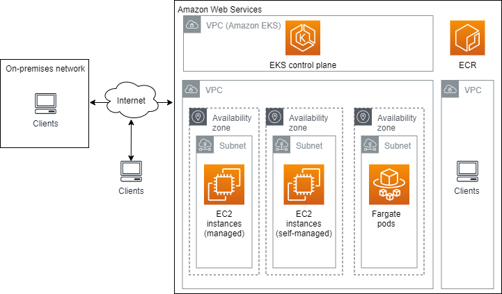

# Amazon EKS networking
本章概述了 Amazon EKS 网络。下图显示了 Amazon EKS 群集以及与VPC的组件关系。


以下解释帮助您了解图表中的组件是如何相互关联的，以及您可以参考本指南和其它一些AWS指南的哪些主题以获得更多信息：
- Amazon VPC and subnets – 所有的Amazon EKS资源都被部署到一个区域（Region），在一个已存在的VPC及一个已存在的子网中。跟多信息，请参考Amazon VPC用户指南中的 [VPC和子网](https://docs.aws.amazon.com/vpc/latest/userguide/VPC_Subnets.html)。每个子网存在于一个可用区中。VPC和子网必须满足下面的要求：
  + VPC和子网必须被合理的打上标签，如此Kubernetes 才能知道可以利用它们部署资源，比如负载均衡器。更多信息，请参阅[VPC标签需求](https://docs.aws.amazon.com/zh_cn/eks/latest/userguide/network_reqs.html#vpc-tagging)和[子网标签需求](https://docs.aws.amazon.com/zh_cn/eks/latest/userguide/network_reqs.html#vpc-subnet-tagging)。如果你使用Amazon EKS提供的[AWS CloudFormation template](https://docs.aws.amazon.com/zh_cn/eks/latest/userguide/create-public-private-vpc.html#create-vpc) 或`eksctl`来部署VPC，那么VPC和子网都已经被打上合理的标签了。
  + 一个子网可能有货没有互联网访问。如果一个子网不能对互联网可访问，部署在里面的 `pods` 必须可以访问其它AWS 资源，比如AWS ECR，以拉取容器镜像。关于使用没有互联网的子网的更多信息，请参考[私有集群](https://docs.aws.amazon.com/zh_cn/eks/latest/userguide/private-clusters.html)。
  + 任何你使用的公有子网，必须被配置为里面启动的任何Amazon EC2实例，必须被自动赋予一个共有IP。更多信息，请参考[VPC IP地址](https://docs.aws.amazon.com/zh_cn/eks/latest/userguide/network_reqs.html#vpc-cidr)。
  + 节点和控制平面通过打上合理标签的[安全组](https://docs.aws.amazon.com/vpc/latest/userguide/VPC_SecurityGroups.html)能够通过所有端口通讯。更多信息，请参考[Amazon EKS安全组考量](https://docs.aws.amazon.com/zh_cn/eks/latest/userguide/sec-group-reqs.html)。
  + 你可以实现一个网络段和租借（tenant)隔离的网络策略，网络策略和AWS安全组在有些方面是相似的：你可以创建网络进入（ingress）和发送（egress ）规则。替代指定单个实例到安全组，你可以使用 `pod selectors and labels` 指定网络策略到pods。更多信息，请参见[在Amazon EKS上安装Calico](https://docs.aws.amazon.com/zh_cn/eks/latest/userguide/calico.html)。

  你可以通过手工配置，或利用[eksctl](https://docs.aws.amazon.com/zh_cn/eks/latest/userguide/eksctl.html)，或一个Amazon EKS提供的AWS CloudFormation模板来创建适合Amazon EKS需求的VPC及其子网。eksctl 和Amazon EKS提供的AWS CloudFormation模板都可以创建所需配置的VPC和子网。更多信息，请参见[为你的Amazon EKS集群创建VPC](https://docs.aws.amazon.com/zh_cn/eks/latest/userguide/create-public-private-vpc.html#create-vpc)。
- Amazon EKS 控制平面 – 
- Amazon EC2 实例 – 
- Fargate pods – 
## 1. 为你的Amazon EKS 集群创建一个VPC
## 2. Cluster VPC considerations
创建 Amazon EKS 集群时，需要为集群指定要使用的 VPC 子网。Amazon EKS 要求指定至少两个可用区内的子网。我们建议使用同时带有公有子网和私有子网的 VPC，以便 Kubernetes 可以在公有子网中创建公有负载均衡器，进而将流量负载平衡到在私有子网中的节点上运行的 pod。

创建群集时，指定所有将主机用于群集（如节点和负载平衡器）的子网。
> **注意**：在集群中，面向 Internet 的负载均衡器需要公有子网。默认情况下，节点还需要外向互联网访问Amazon EKS API用于在启动时间内进行群集检视和节点注册。对于没有出站 Internet 访问的集群，请参阅[私有集群](https://docs.aws.amazon.com/zh_cn/eks/latest/userguide/private-clusters.html)。
> 
> 要提取容器映像，它们需要访问 Amazon S3 和 Amazon ECR API（以及任何其他容器注册表，如 DockerHub）。有关详细信息，请参阅 [Amazon EKS 安全组考量](https://docs.aws.amazon.com/zh_cn/eks/latest/userguide/sec-group-reqs.html) 和 AWS General Reference中的[AWSIP地址范围](https://docs.aws.amazon.com/general/latest/gr/aws-ip-ranges.html)。

创建集群影响的子网被 Amazon EKS 放置用于控制平面到节点通信的弹性网络接口（The subnets that you pass when you create the cluster influence where Amazon EKS places elastic network interfaces that are used for the control plane to node communication）。

您可以在创建集群时仅指定公有或私有子网，但存在与这些配置关联的一些限制：
- Private-only：任何资源都运行在私有子网里，Kubernetes 不能为你的pods创建面向互联网的负载均衡器。
- Public-only：所有资源运行在公有子网里，包括你的pods。

Amazon EKS 在私人子网中创建弹性网络接口，以便于与节点通信。此通信渠道支持Kubernetes功能，例如 kubectl exec 和 kubectl logs。在创建集群时指定的安全组应用到为群集控制平面创建的弹性网络接口。

VPC 必须具有 DNS 主机名和 DNS 解析支持。否则，您的节点无法使用群集注册。有关更多信息，请参阅 Amazon VPC 用户指南中的[在您的 VPC 中使用 DNS](https://docs.aws.amazon.com/AmazonVPC/latest/UserGuide/vpc-dns.html)。
### 2.1 VPC IP addressing
节点必须能够与控制平面和其他AWS服务通信。如果您的节点部署在私有子网中，则必须具有:
- Setup a default route for the subnet to a [NAT gateway](https://docs.aws.amazon.com/AmazonVPC/latest/UserGuide/vpc-nat-gateway.html). The NAT gateway must be assigned a public IP address to provide internet access for the nodes.
- Configured several necessary settings for the subnet and taken the necessary actions listed in [Private clusters](https://docs.aws.amazon.com/zh_cn/eks/latest/userguide/private-clusters.html).

如果自管理节点部署到公共子网，则必须配置子网以自动分配公共IP地址，或者在您的节点启动时必须分配一个公用IP地址. 如果管理的节点部署到公共子网，则必须配置子网以自动分配公共IP地址，或者不会分配公共IP地址。使用以下命令确定您的公有子网是否配置为自动分配公有 IP 地址：
```
aws ec2 describe-subnets \
    --filters "Name=vpc-id,Values=VPC-ID" | grep 'SubnetId\|MapPublicIpOnLaunch'
```
输出：
```
"MapPublicIpOnLaunch": false,
"SubnetId": "subnet-aaaaaaaaaaaaaaaaa",
"MapPublicIpOnLaunch": false,
"SubnetId": "subnet-bbbbbbbbbbbbbbbbb",
```
对于已将 MapPublicIpOnLaunch 设置为 false 的任何子网 ，请将设置更改为 true。
```
aws ec2 modify-subnet-attribute --map-public-ip-on-launch --subnet-id subnet-aaaaaaaaaaaaaaaaa
```
> **重要**“如果您在 03/26/2020之前使用 [Amazon EKS AWS CloudFormation 模板](https://docs.aws.amazon.com/zh_cn/eks/latest/userguide/create-public-private-vpc.html)部署 VPC，则需要更改公有子网的设置。

您可以在用于您的 Amazon EKS 集群的 VPC 内定义私有 (RFC 1918) 和公有（非 RFC 1918）CIDR 范围。有关详细信息，请参阅Amazon VPC 用户指南中的[将Ipv4CIDR块添加到VPC](https://docs.aws.amazon.com/vpc/latest/userguide/VPC_Subnets.html#vpc-resize)。为您的VPC和子网选择无级域间路由(CIDR)模块时，请确保数据块包含足够的IP地址，以满足所有您计划部署的 Amazon EC2 节点和POD（每个POD一个IP地址）。您可以通过使用共享服务VPC实施TransitGateway来节省IP地址使用。有关详细信息，请参阅[带共享服务的隔离VPC](https://docs.aws.amazon.com/vpc/latest/tgw/transit-gateway-isolated-shared.html)和[可以在混合网络中的VPC可路由IP地址保护模式](http://aws.amazon.com/blogs/containers/eks-vpc-routable-ip-address-conservation/)。

Amazon EKS 控制平面为VPC里的每个集群可创建最多4个[请求人管理的网络接口](https://docs.aws.amazon.com/AWSEC2/latest/UserGuide/requester-managed-eni.html)。确保指定的子网具有请求者管理的网络接口和您的PODS的足够可用的IP地址。
### 2.2 VPC tagging requirement
当您创建版本早于 1.15 的 Amazon EKS 集群时，Amazon EKS 会按以下方式，为包含您指定子网的 VPC 添加标签，以便 Kubernetes 可以发现它：
Key|Value
--------|--------
kubernetes.io/cluster/<cluster-name>|shared

- Key: The <cluster-name> value matches your Amazon EKS cluster's name.
- Value: The shared value allows more than one cluster to use this VPC.

1.15 集群不需要此标签，也不由 Amazon EKS 创建。如果您将 1.15 集群部署到已有此标签的 VPC，不会删除此标签。
### 2.3 Subnet tagging requirement
创建 Amazon EKS 集群时，Amazon EKS 按以下方式为您指定的子网添加标签，以便 Kubernetes 可以发现它们：
> **注意**：您的集群用于资源的所有子网（公有和私有）均应具有此标签。

键|值
--------|--------
kubernetes.io/cluster/<cluster-name>|shared

- Key: The <cluster-name> value matches your Amazon EKS cluster's name.
- Value: The shared value allows more than one cluster to use this VPC.
#### Private subnet tagging requirement for internal load balancers
必须按照以下方式为私有子网添加标签，以便 Kubernetes 知道它可以将这些子网用于内部负载均衡器。如果您在03/26/2020之后使用 Amazon EKS AWS CloudFormation 模板创建 VPC，则由该模板创建的子网会在创建时被添加标签。有关 Amazon EKS AWS CloudFormation VPC 模板的更多信息，请参阅[Creating a VPC for your Amazon EKS cluster](https://docs.aws.amazon.com/zh_cn/eks/latest/userguide/create-public-private-vpc.html)。

键|值
--------|--------
kubernetes.io/role/internal-elb|1
#### Public subnet tagging option for external load balancers
您必须为 VPC 中的公有子网添加标签，以便 Kubernetes 知道仅将这些子网用于外部负载均衡器，而不是在每个可用区中选择公有子网（按子网 ID 的字母表顺序选择）。如果您在03/26/2020之后使用 Amazon EKS AWS CloudFormation 模板创建 VPC，则由该模板创建的子网会在创建时被添加标签。有关 Amazon EKS AWS CloudFormation VPC 模板的更多信息，请参阅[Creating a VPC for your Amazon EKS cluster](https://docs.aws.amazon.com/zh_cn/eks/latest/userguide/create-public-private-vpc.html)。

键|值
--------|--------
kubernetes.io/role/elb|1
## 3. Amazon EKS 安全组注意事项
## 4. Pod 联网 (CNI)
Amazon EKS 支持使用适用于 Kubernetes 的 Amazon VPC 容器网络接口 (CNI) 插件的本机 VPC 网络。使用此插件允许 Kubernetes Pod 在 Pod 内具有与其在 VPC 网络上相同的 IP 地址。插件是一个在 GitHub 上维护的开源项目。有关更多信息,请参阅 [amazon-vpc-cni-k8s](https://github.com/aws/amazon-vpc-cni-k8s) 和[提议：适用于通过 AWS VPC 的 Kubernetes 联网的 CNI 插件](https://github.com/aws/amazon-vpc-cni-k8s/blob/master/docs/cni-proposal.md)GitHub。 完全支持在 Amazon EKS 和 AWS 上自行管理的 Kubernetes 集群上使用 Amazon VPC CNI 插件。
> **注意** Kubernetes 可使用容器网络接口 (CNI) 进行可配置的网络设置。Amazon VPC CNI 插件可能不会满足所有使用案例的要求。Amazon EKS 维护一个合作伙伴网络,以提供具有商业支持选项的替代 CNI 解决方案。有关更多信息，请参阅[备选的兼容 CNI 插件](https://docs.aws.amazon.com/zh_cn/eks/latest/userguide/alternate-cni-plugins.html)。

当您创建 Amazon EKS 节点时，它有一个网络接口（network interface）。所有 Amazon EC2 实例类型都支持多个网络接口。在创建实例时附加到实例的网络接口称为主网络接口。附加到实例的任何其他网络接口称为辅助网络接口。可以为每个网络接口分配多个私有 IP 地址。其中一个私有 IP 地址是主要 IP 地址，而分配给网络接口的所有其它地址是辅助 IP 地址。有关网络接口的更多信息,请参阅Amazon EC2 用户指南（适用于 Linux 实例）中的[弹性网络接口](https://docs.aws.amazon.com/AWSEC2/latest/UserGuide/using-eni.html)。有关支持多少个网络接口和每个网络接口支持多少个私有 IP 地址数量的更多信息，请参阅Amazon EC2 用户指南（适用于 Linux 实例）中的[每个实例类型的每个网络接口的 IP 地址](https://docs.aws.amazon.com/AWSEC2/latest/UserGuide/using-eni.html#AvailableIpPerENI) 。例如，m5.large 实例类型支持3个网络接口，每个网络接口有 10 个私有 IP 地址。

适用于 Kubernetes 的 Amazon VPC 容器网络接口 (CNI) 插件随您的每个节点一起部署。插件包含两个主要组件：
- L-IPAM daemon
  负责创建网络接口并将网络接口附加到 Amazon EC2 实例，将辅助 IP 地址分配给网络接口，并在每个节点上维护 IP 地址的暖池（a warm pool of IP addresses），以便当Kubernetes Pod调度到本节点时分配。当节点上运行的 Pod 数超过可分配给单个网络接口的地址数时，只要实例的最大网络接口数尚未附加，插件就会开始分配新的网络接口。有配置变量允许您更改插件创建新网络接口时的默认值。有关更多信息，请参阅GitHub上的 [WARM_ENI_TARGET、WARM_IP_TARGET 和 MINIMUM_IP_TARGET](https://github.com/aws/amazon-vpc-cni-k8s/blob/master/docs/eni-and-ip-target.md)。

  您部署的每个 Pod 都会从附加到实例的其中一个网络接口分配一个辅助私有 IP 地址。之前提到一个m5.large 实例支持三个网络接口，每个网络接口支持10个私有 IP 地址。即使 m5.large 实例支持 30 个私有 IP 地址，您也无法向该节点部署 30 个 Pod。要确定可将多少 Pod 部署该节点，请使用以下公式:
  ```
  (Number of network interfaces for the instance type × (the number of IP addressess per network interface - 1)) + 2
  ```

  使用此公式，m5.large 实例类型最多可支持 29 个 Pod。有关每种实例类型支持的最大 Pod 数的列表，请参阅GitHub 上的 [eni-max-pods.txt](https://github.com/awslabs/amazon-eks-ami/blob/master/files/eni-max-pods.txt)。 系统 Pod 计入最大 Pod（System pods count towards the maximum pods）。例如，CNI 插件和 kube-proxy Pod 在集群中的每个节点上运行，因此您只能将 27 个额外的 Pod 部署到 m5.large 实例，而不是 29 个。此外，CoreDNS 在集群中的某些节点上运行，这会为其上运行的节点将最大 Pod 减少一个。

  默认情况下，部署到节点的所有 Pod 都分配了相同的安全组，并分配了来自分配给实例的其中一个网络接口所连接子网的 CIDR 块的私有 IP 地址。您可以通过配置 CNI 自定义网络，从与主网络接口连接到的子网不同的 CIDR 块分配 IP 地址。您还可以使用 CNI 自定义网络来分配同一安全组节点上的所有 Pod。分配给所有 Pod 的安全组可能与分配给主网络接口的安全组不同。您可以使用 Pod 的安全组将唯一安全组分配给部署到多个 Amazon EC2 实例类型的 Pod。有关更多信息，请参阅[Pod 的安全组](https://docs.aws.amazon.com/eks/latest/userguide/security-groups-for-pods.html)。
- CNI plugin
  负责连接主机网络(例如，配置网络接口和虚拟以太网对)并向 Pod 命名空间添加正确的网络接口。

> **重要**：如果你在使用CNI插件1.7.0及其更新版本，并且你指定了一个自定义Pod安全策略给`aws-node` Kubernetes服务账号，该账号用于由Daemonset部署的`aws-node` Pod，那么该策略必须在其`allowedCapabilities`段中包含`NET_ADMIN` ，并在策略的`spec`中包含`hostNetwork: true` and `privileged: true`。更多信息，请参阅[Pod安全策略](https://docs.aws.amazon.com/eks/latest/userguide/pod-security-policy.html).
## 5. 安装或升级 CoreDNS
## 6. 在 Amazon EKS 上安装 Calico

## Reference
- [Amazon EKS networking](https://docs.aws.amazon.com/zh_cn/eks/latest/userguide/eks-networking.html)
- [如何解决 Amazon EKS 的服务负载均衡器问题](https://aws.amazon.com/cn/premiumsupport/knowledge-center/eks-load-balancers-troubleshooting/)
- [我如何公开在 Amazon EKS 集群上运行的 Kubernetes 服务](https://aws.amazon.com/cn/premiumsupport/knowledge-center/eks-kubernetes-services-cluster/)
- [WARM_ENI_TARGET, WARM_IP_TARGET and MINIMUM_IP_TARGET](https://github.com/aws/amazon-vpc-cni-k8s/blob/master/docs/eni-and-ip-target.md)