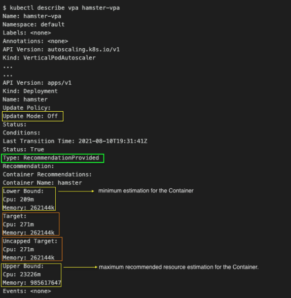

# Kubernetes 自动扩展（Kubernetes Autoscaling）
## 一. 介绍
自动扩展是 Kubernetes 平台最具吸引力的特性之一。一旦正确配置，它可以节省管理员大量时间，防止性能瓶颈的出现，并帮助防止浪费金钱。但是，设置自动扩展需要了解众多配置参数，这些甚至会使得资深 Kubernetes 管理员感到混淆--这就是我们创建这篇文章详细解释自动扩展的原因。我们将致力于每种自动扩展一篇文章，解释其方法并包括配置指令以及示例 YAML 文件。
### Kubernetes 自动扩展的三个维度
自动扩展终结了持续手动调节配置以匹配变化的应用负载级别的需求。Kubernetes 可以通过不同方式实现自动扩展：调整 pod 能力（垂直自动扩展），调整 pod 数目（水平自动扩展），以及/或增减节点数目（集群自动扩展）。

有两种类型的 pod 自动扩展器（autoscalers）：垂直 pod 自动扩展器（VPA）可以增减分配给每个 pod 的 CPU 以及 memory，另一方面水平 pod 自动扩展器（HPA）可以复制或终止 pod，从而影响整体 pod 数目。集群自动扩展器（Cluster Autoscaler (CA)）增减集群的专用节点数来提供何时数量的计算资源以满足期待的工作负载，因此 CA 是影响集群的整体能力的。组合起来，三个维度的自动扩展可以帮组在防止性能瓶颈或服务中断（outage）以及资源浪费自建维持一个平衡。


大多数应用的负载会有由用户活动驱动的每天，每周或季节性的韵律性变化。这个变化可能导致：由资源限制引起的应用性能下降，或者由于资源闲置所导致的不必要开销。

例如，我们经常说企业产品应用的高峰时段是一个时区的上午中段以及下午中段，那个时间雇员们大都坐在桌边，可能还在憧憬周末或假期的闲暇时光。有些企业金融应用在每个季度末金融报告发布后是最活跃的。相反，某些薪资管理程序一个月中通常有两次忙碌以发放薪水；批处理应用通常被安排在午夜后运行。也有季节性交通模式，例如黑色星期五或母亲节的在线零售。其它活跃性增加可能来自于一次性事件，例如新网站的大量访问。
### 度量与分配（Measurement and allocation）
如果不在意 Kubernetes 集群容量（超过需求量），管理起来很容易：例如它仅仅用于一个应用并且钱不是问题。但通常这不是现实，尤其当一个大的集群部署，有许多应用部署其上且各自预算有限。在这种常见场景下，集群成本必须得在共享 Kubernetes 资源的各团队，项目，应用公平准确地分担。

一个 Kubernetes 集群，如果静态配置且其上的两个租户资源都很好地打了标签，那么其成本分配报告是能够直接计算的。但一旦你将自动扩展引入等式，将 Kubernetes 资源分配给总舵租户将变得不可能，因为自动扩展每分钟都在改变底层集群配置。

如果你将集群命名空间用于每一个租户，他将帮助减轻管理员负担；但在共享资源的情况下测量各自租户专用资源使用仍然复杂。一个公平的成本分配方法必须考虑每个租户对集群资源随时间按比例的使用情况，包括 CPU, GPU, memory, disk, 和 network。

Kubecost 开源项目被构思出来用于应对此类挑战--提供一个简单的方法来为用户和应用测量集群资源消耗，按 Kubernetes 概念如 `deployment`, `service`, `namespace`, 以及 `label` 来分解各自成本。Kubecost 在一个任意大小的集群内部总是可用的，它可以从[这里](https://www.kubecost.com/install.html)下载。
## 二. VPA
Kubernetes Vertical Pod Autoscaler (VPA) 是一个自动扩展器，它开启了基于历史资源使用测量的自动 CPU/memory 请求/限制的自动调整。如果正确使用，它可以帮助你在容器级别高效且自动地分配 Kubernetes 集群资源。

当然，和 Kubernetes (K8s) 世界的任何技术一样，从技术角度理解 VPA 如何工作以及准确知道它做了什么可以让你更有效地实施它。

这篇文章将覆盖三种自动扩展器，并将详细解释 VPA 的使用及益处--你可以更接地气地运行 Kubernetes Vertical Pod Autoscaler。
### 2.1 三种类型 Kubernetes 自动扩展器
有三种类型的 K8s 自动扩展器，每个服务于不同的目的，包括：
- [水平 Pod 自动扩展器 (HPA)](https://kubernetes.io/docs/tasks/run-application/horizontal-pod-autoscale/):调整一个应用的副本数量。HPA 基于 CPU 使用率扩展一个 RC，Deployment，Replica Set，StatefuleSet 中的 Pod 数量。HPA 也可以配置基于自定义或外部度量来作扩展决策。
- [集群自动扩展器 (CA)](https://github.com/kubernetes/autoscaler/tree/master/cluster-autoscaler#cluster-autoscaler): 调整一个集群中节点数目。当节点没有足够的资源来运行一个 pod （增加节点），或者当一个节点未充分使用，并且其 pod 可被指派到另一个节点（删除节点）时CA 会自动增减集群中的节点数目。
- [垂直 Pod 自动扩展器 (VPA)](https://github.com/kubernetes/autoscaler/tree/master/vertical-pod-autoscaler): 调整集群中容器资源请求及限制（本文稍后将定义）
### 2.2 什么是 Kubernetes VPA?
Kubernetes Vertical Pod Autoscaler (VPA) 是一个你在你的集群中安装的组件。它增加或递减容器 CPU 和 memory 配置来使得集群资源配置与实际使用匹配。

接下来，我们将看看一些重要的 VPA 概念。

**Kubernetes VPA 资源配置类型**
利用 VPA，你可以管理每个 pod 里的每个容器的如下两种不同类型的资源配置：
1. 请求（Requests）
2. 限制（Limits）

**什么是请求？**
Requests 定义了容器需要的最小资源量。例如，一个应用可能使用超过 256 MB内存，但当请求被设置为256MB内存时 Kubernetes 可以确保最小给该容器分配 256MB。

**什么是限制？**
限制定义了一个给定容器的最大资源量。你的应用可能要求至少 256MB 内存，但你可能想确保其使用内存不超过 512MB，从而限制其内存消耗不超过 512MB。
### 2.3 Kubernetes VPA vs. HPA
基本上，VPA 和 HPA 的区别在于它们如何扩展。HPA 通过增减 pod 来扩展--因此水平扩展容量。VPA 则通过在已经存在的 pod 容器内增减CPU或内存来扩展--因此垂直扩展容量。下买你的列表详细解释了 Kubernetes VPA 和 HPA 的差异：
期待调整的容量|水平扩展（HPA）|处置扩展（VPA）
--------|--------|--------
更多资源|增加 pods|增加已经存在的 pod 容器的处理器及内存资源
更少资源|移除 pods|减少已经存在的 pod 容器的处理器及内存资源

参考下面的截图以了解 VPA 如何工作的：

### 2.4 VPA 组件
一个 VPA 部署拥有三个主要组件：VPA 建议者（Recommender）, VPA 更新器（Updater）, 以及 VPA 管理控制器（Admission Controller）。让我肯来看看它们各自做了些什么。
#### VPA Recommender
- 监控资源使用率并计算目标值
- 查看指标历史，内存用尽事件以及 VPA 部署规格并建议公平的请求值。限制基于定义的 限制-请求比例被提升/降低。
#### VPA Updater
- 驱逐那些需要新的资源限制的 Pods
- 如果定义了 “updateMode: Auto“，实现 Recommender 推荐的任何值。
#### VPA Admission Controller
- 无论何时当 VPA Updater 驱逐并重启一个 pod 时在新的 pod 重启之前（使用一个webhook）修改处理器/内存设置
- 当 VPA 设置 updateMode 为 "Auto.” 时，如果一个 pod 的资源请求需要修改则驱逐这个 pod。基于 Kubernetes 的设计，修改一个运行中的 pod 资源请求的唯一方法就是重新创建它。
### 2.5 Kubernetes VPA 如何工作？
现在我们已经定义了 VPA 的组件，让我们来解释在实际中它们如何协同工作。

下面的截图展示了一个 Kubernetes VPA 如何工作的实际例子，稍后是每一步骤的详细解释。


让我们逐步了解图中每一步发生了什么：
1. 用户配置 VPA
2. VPA Recommender 读取 VPA 配置，并从度量服务器（metric server）读取资源利用率度量。
3. VPA Recommender 提供 pod 资源建议
4. VPA Updater 读取pod 资源建议
5. VPA Updater 出发 pod 终止
6. Deployment 了解到 pod 终止，它将会创建新的 pod 来匹配其副本配置
7. 在 pod 重建过程中，VPA Admission Controller 得到 pod 资源建议。因为 Kubernetes 不支持动态改变一个运行中的 pod 的资源限制，VPA 不能更新已有 Pod 的资源限制。它终止了使用过时限制的 pod。当 pod 控制器从 Kubernetes API service 请求替代的时候，VPA Admission Controller 将更新过的资源请求/限制值注入到新的 pod 规范中。
8. 最终，VPA Admission Controller 重写了 pod 的建议值。在我们的例子中，VPA Admission Controller 增加了 “250m” CPU 给 pod。

> 注意：我们也可以运行 VPA 于建议模式。在这种模式下，VPA Recommender 将用其建议值更新负载的 VPA 资源状态字段，但它不会终止 pod 或者修改 pod 的 API 请求。
### 2.6 Kubernetes VPA 的限制
VPA 对许多应用是有用的，但是必须记住有几个很重要的限制：
- 不要混用 VPA 与 HPA，它们基于同样的资源度量例如 CPU 和内存的使用量来扩展。其原因在于当同一个度量（CPU/MEMORY）达到一个阈值时，扩展事件会为VPA 和 HPA同时触发，这可能会有未知副作用，有可能导致问题。
- VPA 可能建议比集群可用资源更多的资源，从而导致 pod 不能被指派给一个节点（原因是资源不够），并且永远不能运行。为了克服这个限制，设置限制范围为最大可用资源量是一个好主意。这可以保证 pods 不会要求比 `LimitRange` 定义更多的资源。
### 2.7 EKS 示例: 如何配置 VPA
现在我们已经检阅了 VPA 的概念，让我们来看啊看现实世界里安装和使用 VPA 的例子。在这一节，我们将遵循下面的大致步骤来在 Amazon Elastic Kubernetes Service (Amazon EKS) 上部署一个 VPA Deployment。
1. 创建一个 EKS 集群
2. 安装 metrics server
3. 安装 VPA
4. 演示：VPA 实例
#### 2.7.1 创建一个 EKS 集群
作为开始，我们将在 AWS 上创建一个 EKS。有许多方式做这个，但在本文中，我们将使用 `eksctl`，AWS 推荐的一个简单命令行工具。如果想了解更多关于 `eksctl` 的知识，请访问[官方 eksctl 网站](https://eksctl.io/)。

请确保在你的工作站/笔记本上有一个活跃的 AWS 账号配置。如果没有，请参考[这篇AWS文章](https://docs.aws.amazon.com/cli/latest/userguide/cli-configure-quickstart.html)。一旦你的账号就绪，创建下面的文件并运行如下命令来创建 EKS 集群：
```
$ cat eks.yaml
---
apiVersion: eksctl.io/v1alpha5
kind: ClusterConfig
metadata:
  name: my-cluster
  region: us-east-1
  version: "1.20"
availabilityZones:
- us-east-1a
- us-east-1b
managedNodeGroups:
- name: general
  labels:
    role: general
  instanceType: t3.medium
  minSize: 1
  maxSize: 10
  desiredCapacity: 1
  volumeSize: 20
```
创建集群：
```
$ eksctl create cluster -f eks.yaml
```
验证到 EKS 集群的连接：
```
$ kubectl get svc
NAME TYPE CLUSTER-IP EXTERNAL-IP PORT(S) AGE
kubernetes ClusterIP 10.100.0.1  443/TCP 13m
```
#### 2.7.2 安装 metrics server
现在我们已经有了 EKS 集群；下一步是在其上安装度量服务器（`metrics server`）。我们可以通过运行下面的命令来确认它是否已经安装过了。
```
$ kubectl get apiservice | grep -i metrics
```

如果没有输出，我们的 EKS 集群里就没有安装度量服务器。我们可以使用下面的命令来查看我们是否有可用的度量：
```
$ kubectl top pods -n kube-system
error: Metrics API not available
```
让我们来安装度量服务器。克隆下面的代码仓库：
```
$ git clone --branch v1.0.0 git@github.com:nonai/k8s-example-files.git
```
如下所示在所有文件上应用改变：
```
$ kubectl apply -f .
serviceaccount/metrics-server created
clusterrole.rbac.authorization.k8s.io/system:aggregated-metrics-reader created
clusterrole.rbac.authorization.k8s.io/system:metrics-server created
rolebinding.rbac.authorization.k8s.io/metrics-server-auth-reader created
clusterrolebinding.rbac.authorization.k8s.io/metrics-server:system:auth-delegator created
clusterrolebinding.rbac.authorization.k8s.io/system:metrics-server created
service/metrics-server created
deployment.apps/metrics-server created
apiservice.apiregistration.k8s.io/v1beta1.metrics.k8s.io created
```
验证我们的部署：
```
$ kubectl get pods -n kube-system
NAME READY STATUS RESTARTS AGE
aws-node-8g4wk 1/1 Running 0 29m
coredns-86d9946576-g49sk 1/1 Running 0 38m
coredns-86d9946576-kxw4h 1/1 Running 0 38m
kube-proxy-64gjd 1/1 Running 0 29m
metrics-server-9f459d97b-j4mnr 1/1 Running 0 117s
```
检索 API services 并检查度量服务器：
```
$ kubectl get apiservice |grep -i metrics
v1beta1.metrics.k8s.io kube-system/metrics-server True 2m26s
```
列出在 kube-system 命名空间里的服务：
```
$ kubectl get svc -n kube-system
NAME TYPE CLUSTER-IP EXTERNAL-IP PORT(S) AGE
kube-dns ClusterIP 10.100.0.10  53/UDP,53/TCP 40m
metrics-server ClusterIP 10.100.152.164  443/TCP 2m58s
```
我们可以直接访问 metrics API：
```
$ kubectl get --raw /apis/metrics.k8s.io/v1beta1 | jq
```
使用 kubectl 以得到度量：
```
$ kubectl top pods -n kube-system
NAME CPU(cores) MEMORY(bytes)
aws-node-8g4wk 4m 40Mi
coredns-86d9946576-g49sk 2m 8Mi
coredns-86d9946576-kxw4h 2m 8Mi
kube-proxy-64gjd 1m 11Mi
metrics-server-9f459d97b-j4mnr 3m 17Mi
```
#### 2.7.3 安装 VPA
现在我们已经创建了 EKS 集群并在其上部署了 `metrics server`，让我们来创建 VPA。

克隆下面的仓库，检出特定的提交（对我们这个教程有用），改变目录到 `autoscaler/vertical-pod-autoscaler`：
```
$ git clone https://github.com/kubernetes/autoscaler.git

$ git checkout bb860357f691313fca499e973a5241747c2e38b2

$ cd autoscaler/vertical-pod-autoscaler
```
我们可以使用下面的命令来预览安装：
```
./hack/vpa-process-yamls.sh print
```
然后，安装 VPA：
```
./hack/vpa-up.sh
customresourcedefinition.apiextensions.k8s.io/verticalpodautoscalercheckpoints.autoscaling.k8s.io created
customresourcedefinition.apiextensions.k8s.io/verticalpodautoscalers.autoscaling.k8s.io created
clusterrole.rbac.authorization.k8s.io/system:metrics-reader created
clusterrole.rbac.authorization.k8s.io/system:vpa-actor created
clusterrole.rbac.authorization.k8s.io/system:vpa-checkpoint-actor created
clusterrole.rbac.authorization.k8s.io/system:evictioner created
clusterrolebinding.rbac.authorization.k8s.io/system:metrics-reader created
clusterrolebinding.rbac.authorization.k8s.io/system:vpa-actor created
clusterrolebinding.rbac.authorization.k8s.io/system:vpa-checkpoint-actor created
clusterrole.rbac.authorization.k8s.io/system:vpa-target-reader created
clusterrolebinding.rbac.authorization.k8s.io/system:vpa-target-reader-binding created
clusterrolebinding.rbac.authorization.k8s.io/system:vpa-evictionter-binding created
serviceaccount/vpa-admission-controller created
clusterrole.rbac.authorization.k8s.io/system:vpa-admission-controller created
clusterrolebinding.rbac.authorization.k8s.io/system:vpa-admission-controller created
clusterrole.rbac.authorization.k8s.io/system:vpa-status-reader created
clusterrolebinding.rbac.authorization.k8s.io/system:vpa-status-reader-binding created
serviceaccount/vpa-updater created
deployment.apps/vpa-updater created
serviceaccount/vpa-recommender created
deployment.apps/vpa-recommender created
Generating certs for the VPA Admission Controller in /tmp/vpa-certs.
Generating RSA private key, 2048 bit long modulus (2 primes)
........................+++++
.................................+++++
e is 65537 (0x010001)
Generating RSA private key, 2048 bit long modulus (2 primes)
.....................................................+++++
..........+++++
e is 65537 (0x010001)
Signature ok
subject=CN = vpa-webhook.kube-system.svc
Getting CA Private Key
Uploading certs to the cluster.
secret/vpa-tls-certs created
Deleting /tmp/vpa-certs.
deployment.apps/vpa-admission-controller created
service/vpa-webhook created
```
检查 pod 的状态（你应该看到一些 VPA 相关的 pod 在运行）：
```
$ kubectl get pods -n kube-system
NAME READY STATUS RESTARTS AGE
aws-node-8g4wk 1/1 Running 0 42m
coredns-86d9946576-g49sk 1/1 Running 0 51m
coredns-86d9946576-kxw4h 1/1 Running 0 51m
kube-proxy-64gjd 1/1 Running 0 42m
metrics-server-9f459d97b-j4mnr 1/1 Running 0 14m
vpa-admission-controller-6cd546c4f-qsf82 1/1 Running 0 3m11s
vpa-recommender-6855ff754-6bb4g 1/1 Running 0 3m15s
vpa-updater-9fd7bfbd5-pvfrj 1/1 Running 0 3m18s
```
#### 2.7.4 演示：VPA 实例
一切已经配好，让我们哪一个基础应用将其部署到我们刚建好的集群。这个演示中，我们仅仅关注 CPU 度量，并基于 VPA 建议扩展集群。

因为我们已经克隆了整个仓库，改变当前目录到 `kubernetes-tutorials/src/master/001/vpa-demo/`：
```
$ cd kubernetes-tutorials/src/master/001/vpa-demo/

$ ls -1
deployment.yaml
vpa.yaml
```
这我们有两个文件：
```
deployment.yaml # ---> will have a config for the application.
vpa.yaml        # ---> will contain the config for the VPA.
```
我们将执行下面的步骤来测试 VPA：
1. 部署我们的示例应用，配置 CPU 100m。
2. 让 Pod 运行至少5分钟并检查 CPU 使用率
3. 检查 VPA 建议
4. 手动更新 CPU 到 200m
5. 应用这个修改
6. 检查 Pod 状态
##### 部署我们的示例应用，配置 CPU 100m
```
$ kubectl apply -f vpa-demo
deployment.apps/hamster created
verticalpodautoscaler.autoscaling.k8s.io/hamster-vpa created
```
##### 让 Pod 运行至少5分钟并检查 CPU 使用率
```
$ kubectl get vpa
NAME MODE CPU MEM PROVIDED AGE
hamster-vpa Off 271m 262144k True 5m10s
``` 
##### 检查 VPA 建议
```
$kubectl describe vpa hamster-vpa
```
示例输出：


这里我们可以看到：
- 下限是对容器的最小估计
- 上限是对容器的最大建议资源量
- 目标估计是我们用于设置资源请求值
- 所有的估计都是基于最小及最大容器容许策略来封顶的
- 未封顶的目标估计是如果没有 minAllowed 和 maxAllowed 的情况下给出的目标估计
##### 手动更新 CPU 到 200m
对于这个演示，我们将手动地在 deployment.yaml 文件中把 CPU 从 100m 更新至 180m：
```
---
apiVersion: apps/v1
kind: Deployment
…
...
requests:
cpu: 180m
memory: 50Mi
limits:
cpu: 600m
memory: 100Mi
…
...
```
##### 应用这个修改
##### 检查 Pod 状态
### 2.8 Kubernetes VPA Auto-Update Mode
### 2.9 将一个容器排除在自动扩展之外（Excluding Scaling for a Container）
### 2.10 VPA 的使用及成本报告
### 2.11 总结
## 三. HPA
## 四. CA

## Reference
- [Kubernetes Autoscaling](https://www.kubecost.com/kubernetes-autoscaling)