# Kubernetes 自动扩展（Kubernetes Autoscaling）
## 一. 介绍
自动扩展是 Kubernetes 平台最具吸引力的特性之一。一旦正确配置，它可以节省管理员大量时间，防止性能瓶颈的出现，并帮助防止浪费金钱。但是，设置自动扩展需要了解众多配置参数，这些甚至会使得资深 Kubernetes 管理员感到混淆--这就是我们创建这篇文章详细解释自动扩展的原因。我们将致力于每种自动扩展一篇文章，解释其方法并包括配置指令以及示例 YAML 文件。
### Kubernetes 自动扩展的三个维度
自动扩展终结了持续手动调节配置以匹配变化的应用负载级别的需求。Kubernetes 可以通过不同方式实现自动扩展：调整 pod 能力（垂直自动扩展），调整 pod 数目（水平自动扩展），以及/或增减节点数目（集群自动扩展）。

有两种类型的 pod 自动扩展器（autoscalers）：垂直 pod 自动扩展器（VPA）可以增减分配给每个 pod 的 CPU 以及 memory，另一方面水平 pod 自动扩展器（HPA）可以复制或终止 pod，从而影响整体 pod 数目。集群自动扩展器（Cluster Autoscaler (CA)）增减集群的专用节点数来提供何时数量的计算资源以满足期待的工作负载，因此 CA 是影响集群的整体能力的。组合起来，三个维度的自动扩展可以帮组在防止性能瓶颈或服务中断（outage）以及资源浪费自建维持一个平衡。


大多数应用的负载会有由用户活动驱动的每天，每周或季节性的韵律性变化。这个变化可能导致：由资源限制引起的应用性能下降，或者由于资源闲置所导致的不必要开销。

例如，我们经常说企业产品应用的高峰时段是一个时区的上午中段以及下午中段，那个时间雇员们大都坐在桌边，可能还在憧憬周末或假期的闲暇时光。有些企业金融应用在每个季度末金融报告发布后是最活跃的。相反，某些薪资管理程序一个月中通常有两次忙碌以发放薪水；批处理应用通常被安排在午夜后运行。也有季节性交通模式，例如黑色星期五或母亲节的在线零售。其它活跃性增加可能来自于一次性事件，例如新网站的大量访问。
### 度量与分配（Measurement and allocation）
如果不在意 Kubernetes 集群容量（超过需求量），管理起来很容易：例如它仅仅用于一个应用并且钱不是问题。但通常这不是现实，尤其当一个大的集群部署，有许多应用部署其上且各自预算有限。在这种常见场景下，集群成本必须得在共享 Kubernetes 资源的各团队，项目，应用公平准确地分担。

一个 Kubernetes 集群，如果静态配置且其上的两个租户资源都很好地打了标签，那么其成本分配报告是能够直接计算的。但一旦你将自动扩展引入等式，将 Kubernetes 资源分配给总舵租户将变得不可能，因为自动扩展每分钟都在改变底层集群配置。

如果你将集群命名空间用于每一个租户，他将帮助减轻管理员负担；但在共享资源的情况下测量各自租户专用资源使用仍然复杂。一个公平的成本分配方法必须考虑每个租户对集群资源随时间按比例的使用情况，包括 CPU, GPU, memory, disk, 和 network。

Kubecost 开源项目被构思出来用于应对此类挑战--提供一个简单的方法来为用户和应用测量集群资源消耗，按 Kubernetes 概念如 `deployment`, `service`, `namespace`, 以及 `label` 来分解各自成本。Kubecost 在一个任意大小的集群内部总是可用的，它可以从[这里](https://www.kubecost.com/install.html)下载。

## 二. VPA

Kubernetes Vertical Pod Autoscaler (VPA) 是一个自动扩展器，它开启了基于历史资源使用测量的自动 CPU/memory 请求/限制的自动调整。如果正确使用，它可以帮助你在容器级别高效且自动地分配 Kubernetes 集群资源。

当然，和 Kubernetes (K8s) 世界的任何技术一样，从技术角度理解 VPA 如何工作以及准确知道它做了什么可以让你更有效地实施它。

这篇文章将覆盖三种自动扩展器，并将详细解释 VPA 的使用及益处--你可以更接地气地运行 Kubernetes Vertical Pod Autoscaler。

### 2.1 三种类型 Kubernetes 自动扩展器

有三种类型的 K8s 自动扩展器，每个服务于不同的目的，包括：
- [水平 Pod 自动扩展器 (HPA)](https://kubernetes.io/docs/tasks/run-application/horizontal-pod-autoscale/):调整一个应用的复本数量。HPA 基于 CPU 使用率扩展一个 RC，Deployment，Replica Set，StatefuleSet 中的 Pod 数量。HPA 也可以配置基于自定义或外部度量来作扩展决策。
- [集群自动扩展器 (CA)](https://github.com/kubernetes/autoscaler/tree/master/cluster-autoscaler#cluster-autoscaler): 调整一个集群中节点数目。当节点没有足够的资源来运行一个 pod （增加节点），或者当一个节点未充分使用，并且其 pod 可被指派到另一个节点（删除节点）时CA 会自动增减集群中的节点数目。
- [垂直 Pod 自动扩展器 (VPA)](https://github.com/kubernetes/autoscaler/tree/master/vertical-pod-autoscaler): 调整集群中容器资源请求及限制（本文稍后将定义）
### 2.2 什么是 Kubernetes VPA?
Kubernetes Vertical Pod Autoscaler (VPA) 是一个你在你的集群中安装的组件。它增加或递减容器 CPU 和 memory 配置来使得集群资源配置与实际使用匹配。

接下来，我们将看看一些重要的 VPA 概念。

**Kubernetes VPA 资源配置类型**
利用 VPA，你可以管理每个 pod 里的每个容器的如下两种不同类型的资源配置：
1. 请求（Requests）
2. 限制（Limits）

**什么是请求？**
Requests 定义了容器需要的最小资源量。例如，一个应用可能使用超过 256 MB内存，但当请求被设置为256MB内存时 Kubernetes 可以确保最小给该容器分配 256MB。

**什么是限制？**
限制定义了一个给定容器的最大资源量。你的应用可能要求至少 256MB 内存，但你可能想确保其使用内存不超过 512MB，从而限制其内存消耗不超过 512MB。
### 2.3 Kubernetes VPA vs. HPA
基本上，VPA 和 HPA 的区别在于它们如何扩展。HPA 通过增减 pod 来扩展--因此水平扩展容量。VPA 则通过在已经存在的 pod 容器内增减CPU或内存来扩展--因此垂直扩展容量。下买你的列表详细解释了 Kubernetes VPA 和 HPA 的差异：
期待调整的容量|水平扩展（HPA）|处置扩展（VPA）
--------|--------|--------
更多资源|增加 pods|增加已经存在的 pod 容器的处理器及内存资源
更少资源|移除 pods|减少已经存在的 pod 容器的处理器及内存资源

参考下面的截图以了解 VPA 如何工作的：

### 2.4 VPA 组件
一个 VPA 部署拥有三个主要组件：VPA 建议者（Recommender）, VPA 更新器（Updater）, 以及 VPA 管理控制器（Admission Controller）。让我肯来看看它们各自做了些什么。
#### VPA Recommender
- 监控资源使用率并计算目标值
- 查看指标历史，内存用尽事件以及 VPA 部署规格并建议公平的请求值。限制基于定义的 限制-请求比例被提升/降低。
#### VPA Updater
- 驱逐那些需要新的资源限制的 Pods
- 如果定义了 “updateMode: Auto“，实现 Recommender 推荐的任何值。
#### VPA Admission Controller
- 无论何时当 VPA Updater 驱逐并重启一个 pod 时在新的 pod 重启之前（使用一个webhook）修改处理器/内存设置
- 当 VPA 设置 updateMode 为 "Auto.” 时，如果一个 pod 的资源请求需要修改则驱逐这个 pod。基于 Kubernetes 的设计，修改一个运行中的 pod 资源请求的唯一方法就是重新创建它。
### 2.5 Kubernetes VPA 如何工作？
现在我们已经定义了 VPA 的组件，让我们来解释在实际中它们如何协同工作。

下面的截图展示了一个 Kubernetes VPA 如何工作的实际例子，稍后是每一步骤的详细解释。


让我们逐步了解图中每一步发生了什么：
1. 用户配置 VPA
2. VPA Recommender 读取 VPA 配置，并从度量服务器（metric server）读取资源利用率度量。
3. VPA Recommender 提供 pod 资源建议
4. VPA Updater 读取pod 资源建议
5. VPA Updater 出发 pod 终止
6. Deployment 了解到 pod 终止，它将会创建新的 pod 来匹配其复本配置
7. 在 pod 重建过程中，VPA Admission Controller 得到 pod 资源建议。因为 Kubernetes 不支持动态改变一个运行中的 pod 的资源限制，VPA 不能更新已有 Pod 的资源限制。它终止了使用过时限制的 pod。当 pod 控制器从 Kubernetes API service 请求替代的时候，VPA Admission Controller 将更新过的资源请求/限制值注入到新的 pod 规范中。
8. 最终，VPA Admission Controller 重写了 pod 的建议值。在我们的例子中，VPA Admission Controller 增加了 “250m” CPU 给 pod。

> 注意：我们也可以运行 VPA 于建议模式。在这种模式下，VPA Recommender 将用其建议值更新负载的 VPA 资源状态字段，但它不会终止 pod 或者修改 pod 的 API 请求。
### 2.6 Kubernetes VPA 的限制
VPA 对许多应用是有用的，但是必须记住有几个很重要的限制：
- 不要混用 VPA 与 HPA，它们基于同样的资源度量例如 CPU 和内存的使用量来扩展。其原因在于当同一个度量（CPU/MEMORY）达到一个阈值时，扩展事件会为VPA 和 HPA同时触发，这可能会有未知副作用，有可能导致问题。
- VPA 可能建议比集群可用资源更多的资源，从而导致 pod 不能被指派给一个节点（原因是资源不够），并且永远不能运行。为了克服这个限制，设置限制范围为最大可用资源量是一个好主意。这可以保证 pods 不会要求比 `LimitRange` 定义更多的资源。
### 2.7 EKS 示例: 如何配置 VPA
现在我们已经检阅了 VPA 的概念，让我们来看啊看现实世界里安装和使用 VPA 的例子。在这一节，我们将遵循下面的大致步骤来在 Amazon Elastic Kubernetes Service (Amazon EKS) 上部署一个 VPA Deployment。
1. 创建一个 EKS 集群
2. 安装 metrics server
3. 安装 VPA
4. 演示：VPA 实例
#### 2.7.1 创建一个 EKS 集群
作为开始，我们将在 AWS 上创建一个 EKS。有许多方式做这个，但在本文中，我们将使用 `eksctl`，AWS 推荐的一个简单命令行工具。如果想了解更多关于 `eksctl` 的知识，请访问[官方 eksctl 网站](https://eksctl.io/)。

请确保在你的工作站/笔记本上有一个活跃的 AWS 账号配置。如果没有，请参考[这篇AWS文章](https://docs.aws.amazon.com/cli/latest/userguide/cli-configure-quickstart.html)。一旦你的账号就绪，创建下面的文件并运行如下命令来创建 EKS 集群：
```
$ cat eks.yaml
---
apiVersion: eksctl.io/v1alpha5
kind: ClusterConfig
metadata:
  name: my-cluster
  region: us-east-1
  version: "1.20"
availabilityZones:
- us-east-1a
- us-east-1b
managedNodeGroups:
- name: general
  labels:
    role: general
  instanceType: t3.medium
  minSize: 1
  maxSize: 10
  desiredCapacity: 1
  volumeSize: 20
```
创建集群：
```
$ eksctl create cluster -f eks.yaml
```
验证到 EKS 集群的连接：
```
$ kubectl get svc
NAME TYPE CLUSTER-IP EXTERNAL-IP PORT(S) AGE
kubernetes ClusterIP 10.100.0.1  443/TCP 13m
```
#### 2.7.2 安装 metrics server
现在我们已经有了 EKS 集群；下一步是在其上安装度量服务器（`metrics server`）。我们可以通过运行下面的命令来确认它是否已经安装过了。
```
$ kubectl get apiservice | grep -i metrics
```

如果没有输出，我们的 EKS 集群里就没有安装度量服务器。我们可以使用下面的命令来查看我们是否有可用的度量：
```
$ kubectl top pods -n kube-system
error: Metrics API not available
```
让我们来安装度量服务器。克隆下面的代码仓库：
```
$ git clone --branch v1.0.0 git@github.com:nonai/k8s-example-files.git
```
如下所示在所有文件上应用改变：
```
$ kubectl apply -f .
serviceaccount/metrics-server created
clusterrole.rbac.authorization.k8s.io/system:aggregated-metrics-reader created
clusterrole.rbac.authorization.k8s.io/system:metrics-server created
rolebinding.rbac.authorization.k8s.io/metrics-server-auth-reader created
clusterrolebinding.rbac.authorization.k8s.io/metrics-server:system:auth-delegator created
clusterrolebinding.rbac.authorization.k8s.io/system:metrics-server created
service/metrics-server created
deployment.apps/metrics-server created
apiservice.apiregistration.k8s.io/v1beta1.metrics.k8s.io created
```
验证我们的部署：
```
$ kubectl get pods -n kube-system
NAME READY STATUS RESTARTS AGE
aws-node-8g4wk 1/1 Running 0 29m
coredns-86d9946576-g49sk 1/1 Running 0 38m
coredns-86d9946576-kxw4h 1/1 Running 0 38m
kube-proxy-64gjd 1/1 Running 0 29m
metrics-server-9f459d97b-j4mnr 1/1 Running 0 117s
```
检索 API services 并检查度量服务器：
```
$ kubectl get apiservice |grep -i metrics
v1beta1.metrics.k8s.io kube-system/metrics-server True 2m26s
```
列出在 kube-system 命名空间里的服务：
```
$ kubectl get svc -n kube-system
NAME TYPE CLUSTER-IP EXTERNAL-IP PORT(S) AGE
kube-dns ClusterIP 10.100.0.10  53/UDP,53/TCP 40m
metrics-server ClusterIP 10.100.152.164  443/TCP 2m58s
```
我们可以直接访问 metrics API：
```
$ kubectl get --raw /apis/metrics.k8s.io/v1beta1 | jq
```
使用 kubectl 以得到度量：
```
$ kubectl top pods -n kube-system
NAME CPU(cores) MEMORY(bytes)
aws-node-8g4wk 4m 40Mi
coredns-86d9946576-g49sk 2m 8Mi
coredns-86d9946576-kxw4h 2m 8Mi
kube-proxy-64gjd 1m 11Mi
metrics-server-9f459d97b-j4mnr 3m 17Mi
```
#### 2.7.3 安装 VPA
现在我们已经创建了 EKS 集群并在其上部署了 `metrics server`，让我们来创建 VPA。

克隆下面的仓库，检出特定的提交（对我们这个教程有用），改变目录到 `autoscaler/vertical-pod-autoscaler`：
```
$ git clone https://github.com/kubernetes/autoscaler.git

$ git checkout bb860357f691313fca499e973a5241747c2e38b2

$ cd autoscaler/vertical-pod-autoscaler
```
我们可以使用下面的命令来预览安装：
```
./hack/vpa-process-yamls.sh print
```
然后，安装 VPA：
```
./hack/vpa-up.sh
customresourcedefinition.apiextensions.k8s.io/verticalpodautoscalercheckpoints.autoscaling.k8s.io created
customresourcedefinition.apiextensions.k8s.io/verticalpodautoscalers.autoscaling.k8s.io created
clusterrole.rbac.authorization.k8s.io/system:metrics-reader created
clusterrole.rbac.authorization.k8s.io/system:vpa-actor created
clusterrole.rbac.authorization.k8s.io/system:vpa-checkpoint-actor created
clusterrole.rbac.authorization.k8s.io/system:evictioner created
clusterrolebinding.rbac.authorization.k8s.io/system:metrics-reader created
clusterrolebinding.rbac.authorization.k8s.io/system:vpa-actor created
clusterrolebinding.rbac.authorization.k8s.io/system:vpa-checkpoint-actor created
clusterrole.rbac.authorization.k8s.io/system:vpa-target-reader created
clusterrolebinding.rbac.authorization.k8s.io/system:vpa-target-reader-binding created
clusterrolebinding.rbac.authorization.k8s.io/system:vpa-evictionter-binding created
serviceaccount/vpa-admission-controller created
clusterrole.rbac.authorization.k8s.io/system:vpa-admission-controller created
clusterrolebinding.rbac.authorization.k8s.io/system:vpa-admission-controller created
clusterrole.rbac.authorization.k8s.io/system:vpa-status-reader created
clusterrolebinding.rbac.authorization.k8s.io/system:vpa-status-reader-binding created
serviceaccount/vpa-updater created
deployment.apps/vpa-updater created
serviceaccount/vpa-recommender created
deployment.apps/vpa-recommender created
Generating certs for the VPA Admission Controller in /tmp/vpa-certs.
Generating RSA private key, 2048 bit long modulus (2 primes)
........................+++++
.................................+++++
e is 65537 (0x010001)
Generating RSA private key, 2048 bit long modulus (2 primes)
.....................................................+++++
..........+++++
e is 65537 (0x010001)
Signature ok
subject=CN = vpa-webhook.kube-system.svc
Getting CA Private Key
Uploading certs to the cluster.
secret/vpa-tls-certs created
Deleting /tmp/vpa-certs.
deployment.apps/vpa-admission-controller created
service/vpa-webhook created
```
检查 pod 的状态（你应该看到一些 VPA 相关的 pod 在运行）：
```
$ kubectl get pods -n kube-system
NAME READY STATUS RESTARTS AGE
aws-node-8g4wk 1/1 Running 0 42m
coredns-86d9946576-g49sk 1/1 Running 0 51m
coredns-86d9946576-kxw4h 1/1 Running 0 51m
kube-proxy-64gjd 1/1 Running 0 42m
metrics-server-9f459d97b-j4mnr 1/1 Running 0 14m
vpa-admission-controller-6cd546c4f-qsf82 1/1 Running 0 3m11s
vpa-recommender-6855ff754-6bb4g 1/1 Running 0 3m15s
vpa-updater-9fd7bfbd5-pvfrj 1/1 Running 0 3m18s
```
#### 2.7.4 演示：VPA 实例
一切已经配好，让我们哪一个基础应用将其部署到我们刚建好的集群。这个演示中，我们仅仅关注 CPU 度量，并基于 VPA 建议扩展集群。

因为我们已经克隆了整个仓库，改变当前目录到 `kubernetes-tutorials/src/master/001/vpa-demo/`：
```
$ cd kubernetes-tutorials/src/master/001/vpa-demo/

$ ls -1
deployment.yaml
vpa.yaml
```

这我们有两个文件：

```
deployment.yaml # ---> will have a config for the application.
vpa.yaml        # ---> will contain the config for the VPA.
```

我们将执行下面的步骤来测试 VPA：

1. 部署我们的示例应用，配置 CPU 100m。
2. 让 Pod 运行至少5分钟并检查 CPU 使用率
3. 检查 VPA 建议
4. 手动更新 CPU 到 200m
5. 应用这个修改
6. 检查 Pod 状态

##### 部署我们的示例应用，配置 CPU 100m

```
$ kubectl apply -f vpa-demo
deployment.apps/hamster created
verticalpodautoscaler.autoscaling.k8s.io/hamster-vpa created
```
##### 让 Pod 运行至少5分钟并检查 CPU 使用率

```
$ kubectl get vpa
NAME MODE CPU MEM PROVIDED AGE
hamster-vpa Off 271m 262144k True 5m10s
``` 

##### 检查 VPA 建议

```
$kubectl describe vpa hamster-vpa
```
示例输出：


这里我们可以看到：
- 下限是对容器的最小估计
- 上限是对容器的最大建议资源量
- 目标估计是我们用于设置资源请求值
- 所有的估计都是基于最小及最大容器容许策略来封顶的
- 未封顶的目标估计是如果没有 minAllowed 和 maxAllowed 的情况下给出的目标估计
 
##### 手动更新 CPU 到 200m

对于这个演示，我们将手动地在 deployment.yaml 文件中把 CPU 从 100m 更新至 180m：
```
---
apiVersion: apps/v1
kind: Deployment
…
...
requests:
cpu: 180m
memory: 50Mi
limits:
cpu: 600m
memory: 100Mi
…
...
```

##### 应用这个修改

```
$ kubectl apply -f deployment.yaml
deployment.apps/hamster created
verticalpodautoscaler.autoscaling.k8s.io/hamster-vpa created
```

##### 检查 Pod 状态

当我们修改 CPU 的度量，实验 Pod 被终止，带有我们刚声明的新 CPU 值的新 Pod 被启动。

如果你想这个过程自动化，你应该更新 `deployment.yaml` 文件中的“updateMode: off” 参数。

```
$ kubectl get pods
NAME READY STATUS RESTARTS AGE
hamster-5dff8d44d6-w42hm 1/1 Running 0 3s
hamster-7cfc7d5644-kq4qw 1/1 Terminating 0 77s
```

检查事件来看看 VPA 在后台做了些什么：
```
$ kubectl get event -n kube-system
```
示例输出：
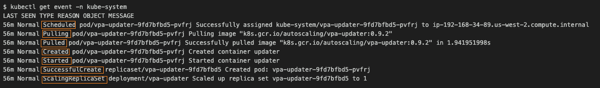

### 2.8 Kubernetes VPA Auto-Update Mode

VPA 中有多个有效的 updateMode 选项。它们是：

- **Off** – VPA 仅仅提供建议值，它不会自动修改资源需求
- **Initial** – VPA 仅仅在 Pod 创建时指定资源需求，之后绝对不会修改它们
- **Recreate** – VPA 在 Pod 创建时指定资源需求，且可通过驱逐并重建它们的方式来在已有 Pod 上更新它们
- **Auto mode** – 它基于建议创建 Pod

在上面的演示中我们增加了 CPU 度量，并手动应用修改以扩展 Pod。我们可以使用 `updateMode: "Auto"` 参数来自动做这个。

下面是一个使用 `Auto mode` 的例子：
```
apiVersion: autoscaling.k8s.io/v1beta2
kind: VerticalPodAutoscaler
metadata:
  name: nginx-vpa
  namespace: vpa
spec:
  targetRef:
    apiVersion: "apps/v1"
    kind: Deployment
    name: nginx
  updatePolicy:
    updateMode: "Auto"
  resourcePolicy:
    containerPolicies:
    - containerName: "nginx"
      minAllowed:
        cpu: "250m"
        memory: "100Mi"
      maxAllowed:
        cpu: "500m"
        memory: "600Mi"
```
因为我们声明了 `updateMode: "Auto"`，VPA 将会自动基于 VPA 建议扩展集群。
### 2.9 将一个容器排除在自动扩展之外（Excluding Scaling for a Container）
让我们假设有一个 Pod 运行两个容器，我们仅仅只期望有一个容器基于 VPA 扩展。别的容器（比如说性能监控代理容器）不应该扩展，因为他不需要扩展。

我们可以通过撤出不需要扩展的容器来实现目标。在这个例子中，我们对性能监控代理容器采用 `"Off"` 模式，因为它根本不需要扩展。

例如，执行扩展：
```
apiVersion: autoscaling.k8s.io/v1
kind: VerticalPodAutoscaler
metadata:
  name: my-opt-vpa
spec:
  targetRef:
    apiVersion: "apps/v1"
    kind:       Deployment
    name:       my-vpa-deployment
  updatePolicy:
    updateMode: "Auto"
  resourcePolicy:
    containerPolicies:
    - containerName: newrelic-sidecar-container
      mode: "Off"
```
### 2.10 VPA 的使用及成本报告
在一个静态 Kubernetes 集群中很容易测量使用率并计算成本。但当分配给 Pod 的资定期常变化时很变得很艰难。

垂直扩展增加了这个挑战，系统管理员需要依赖特定工具来测量并分配集群租户，应用，环境和标签（[Kubernetes 标签指南](https://blog.kubecost.com/blog/kubernetes-labels/)）对应的资源。

开源 Kubecost 工具解决了这个问题，通过分析使用率度量并与你的实际云费用数据关联，从而提供使用率和成本数据的仪表板及完整报告。下买你的截图展示了主要的 Kubecost 仪表板总结了集群成本，效率及健康。
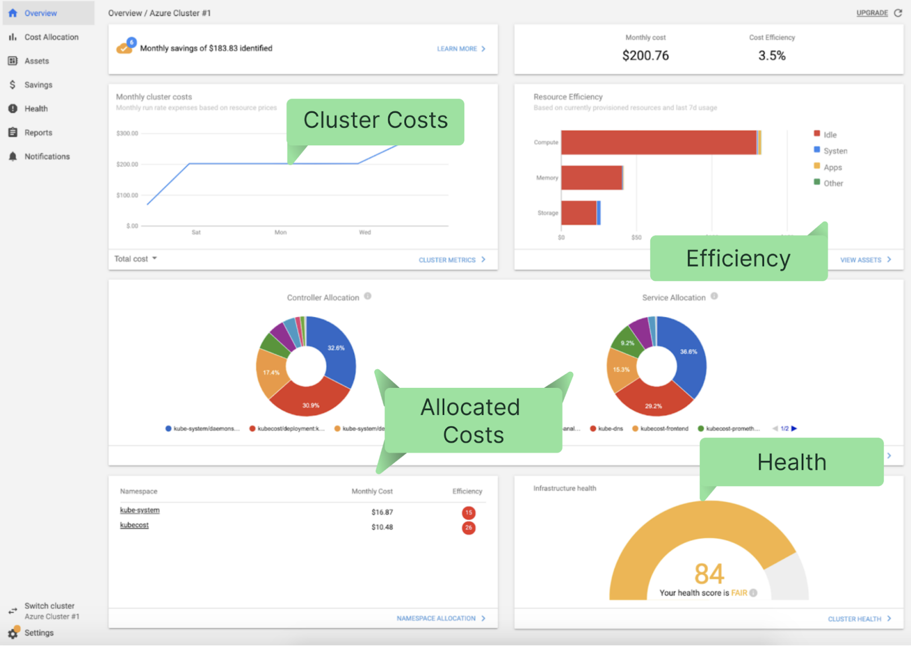

Kubecost 易于通过单个 Helm 命令安装，并且可以与你的现有 Prometheus 和 Grafana 安装集成从而帮助数据收集及展示。你可以从[此](https://www.kubecost.com/install.html)开始免费试用。 
### 2.11 总结
在本文中我们已经讨论了 Kubernetes VPA 的许多背景，下面是一些主要的知识点：

- Kubernetes 拥有三种自动扩展方式：水平扩展器，垂直扩展器以及集群自动扩展器。
- 这三种自动扩展器是不同的，理解不同的自动扩展器如何工作可以帮助你更好的配置集群
- 使用不带垂直扩展器的水平扩展器可能增加资源浪费--它会复制资源未充分使用的 Pod 以满足增长的负载需求
- 在很多情况下你可以联合使用 HPA 和 VPA，但是确保使用自定义度量以驱动 HPA。如果你仅仅使用 CPU 和内存度量，那么你不能同时使用  HPA 与 VPA。
- 由于有状态的工作负载难于水平扩展，VPA 应该用于有状态的工作负载。VPA 提供了一种自动化的方式以扩展集群消耗。
- 使用 VPA 时，确保在 `Vertical Pod Autoscaler` 对象中对每个 Pod 设置最大资源，因为 VPA 建议的可能超过集群最大可用资源量。
- 由于引入了资源分配的可变性，VPA 使得测量使用率，成本，效率更具挑战。你可以使用 [Kubecost](https://www.kubecost.com/) 自动化测量及分析过程以克服这些挑战。

## 三. HPA

扩展性是 Kubernetes (K8s) 最核心优势之一。为了利用这些优势中的大部 （并有效使用 K8s），你需要对 Kubernetes 自动扩展如何工作有坚实的理解。在我们前面的文章中我们讨论了垂直扩展，这里我们来讨论 Kubernetes 中的水平扩展。我们定义 HPA，解释它如何工作，并通过一个使用 HPA 的示例项目来手把手讲解它。

### 3.1 Kubernetes 自动扩展基础

在我们深入 HPA 之前，我们需要大体了解 Kubernetes 自动扩展。自动扩展是一个基于历史资源使用度量自动增减 K8s 工作负载的方法。Kubernetes 的自动扩展有三个维度：

- **水平 Pod 自动扩展器 (HPA)**：调整一个应用的复本数量。
- **集群自动扩展器 (CA)**: 调整一个集群中节点数目。
- **垂直 Pod 自动扩展器 (VPA)**: 调整集群中容器资源请求及限制。

不同的自动扩展器工作于两个不同的 Kubernetes 分层：

- **Pod 级别**：HPA 和 VPA 发生在 Pod 级别。HPA 和 VPA 都扩展容器的资源和可用实例。
- **Cluster 级别**：集群自动扩展器位于集群级别，它增减你的集群的节点数。

现在我们已经聊完了基础，让我们来近距离查看 HPA。

### 3.2 什么是 HPA？

HPA 是一种基于 CPU 利用率增减 replication controller, deployment, replica set, 或 stateful set 里的 Pod 数目的自动扩展形式--扩展是是平的，因为它影响实例个数而不是分配给单个容器的资源。

HPA 可以基于自定义或外部度量来做出扩展决策，在你的初始配置后自动工作。你所需要做的一切就是定义复本的最小最大值。

一旦配置，水平自动扩展器控制器将负责检查度量并据此增减你的复本数目。默认情况下，HPA 将每个 15 秒钟检查度量。

为了检查度量，HPA 依赖于另一个知名 Kubernetes 资源 Metrics Server。Metrics Server 从 **kubernetes.summary_api** 截获数据如节点与 Pod 的 CPU 和内存使用率从而提供标准资源使用率测量数据。它也可以提供对自定义度量（这可以从外部源收集）的访问，比如用于指示流量的在一个负载均衡器上有多少个活跃会话。

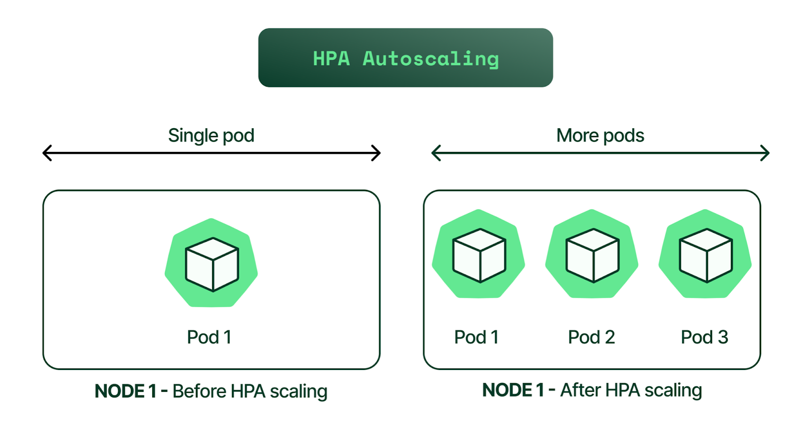

尽管 HPA 的扩展过程是自动的，但在某些情况下你可能够给出负载波动的预测。例如，你可以：

- 基于一天内的时间调整复本数量
- 为周末或非高峰期设置不同的容量需求
- 实现一个基于事件的复本容量调度（例如在代码发布时增加容量）

### 3.3 HPA 如何工作？


简单来讲，HPA 工作于一个“检查，更新，再检查”风格的循环。下面是循环的每一步是如何工作的。

1. HPA 持续监控 metrics server 以获取资源使用率。
2. 基于收集到的资源使用率，HPA 将计算需要的复本数。
3. 接下来，HPA 将扩展应用到期待的复本数。
4. 最终，HPA 改变了复本期待的数目。
5. 因为 HPA 是持续监控，该过程从步骤 1 重复。

### 3.4 Limitations of HPA 的限制

虽然 HPA 是一个功能强大的工具，但不是对每一个用例都是理想的，它也不能解决每一个集群资源问题。下面是最常见的例子：

- HPA 的一个最常见的限制就是它不能工作于 DaemonSets
- 如果你没有[有效地在 Pod 上设置 CPU和内存限制](https://blog.kubecost.com/blog/requests-and-limits/)，你的 Pod 可能会频繁中止；事情的另一面是你会浪费资源
- 如果集群容量不够，HPA 不能扩展知道有新的节点加入集群；集群自动扩展器（CA）能够自动化这个过程。我们有一篇文章专门讲 CA，下面是一个快速的背景解释。

集群自动扩展器（CA）基于来自 Pod 的资源请求增减集群中的节点数。不像 HPA，CA 并不查看自动扩展被触发时的可用 CPU 和内存。作为替代，CA 对事件作出反应，每 10 秒检查一次未调度的 Pod。

### 3.5 EKS 示例: 如何实现 HPA

为了帮助我们学习 HPA，让我们来过几个实际的例子。我们将按照下面的步骤进行：

1. 创建 EKS 集群
2. 安装 Metrics Server
3. 部署一个示例应用
4. 安装 HPA
5. 监控 HPA 事件
6. 减轻负载

#### 3.5.1 步骤 1 创建 EKS 集群

这一步我们将使用 [AWS EKS](https://aws.amazon.com/eks/)（亚马逊托管 Kubernetes 服务），因此请确保你能够访问你的 AWS 账号。我们将使用 `eksctl`，一个在 EKS 上创建和管理集群的简单命令行工具。它用 Go 语言编写并使用 CloudFormation 作为后台。

EKS 集群的 `kubeconfig` 文件将被存储在本地目录（你的工作站或笔记本），并且如果命令成功，你将看到一个就绪状态。作为开始，我们将使用下面的 `eksctl create cluster` 命令（此命令中将使用 Kubernetes 版本 `1.20`）：

```
$ eksctl create cluster  --name example-hpa-autoscaling  --version 1.20  --region us-west-2  --nodegroup-name hpa-worker-instances  --node-type c5.large  --nodes 1
2021-08-30 12:52:24 [i]  eksctl version 0.60.0
2021-08-30 12:52:24 [i]  using region us-west-2
2021-08-30 12:52:26 [i]  setting availability zones to [us-west-2a us-west-2b us-west-2d]
2021-08-30 12:52:26 [i]  subnets for us-west-2a - public:192.168.0.0/19 private:192.168.96.0/19
2021-08-30 12:52:26 [i]  subnets for us-west-2b - public:192.168.32.0/19 private:192.168.128.0/19
2021-08-30 12:52:26 [i]  subnets for us-west-2d - public:192.168.64.0/19 private:192.168.160.0/19
2021-08-30 12:52:26 [i]  nodegroup "hpa-worker-instances" will use "" [AmazonLinux2/1.20]
2021-08-30 12:52:26 [i]  using Kubernetes version 1.20
2021-08-30 12:52:26 [i]  creating EKS cluster "example-hpa-autoscaling" in "us-west-2" region with managed nodes
...
...
2021-08-30 12:53:29 [i]  waiting for CloudFormation stack 
2021-08-30 13:09:00 [i]  deploying stack "eksctl-example-hpa-autoscaling-nodegroup-hpa-worker-instances"
2021-08-30 13:09:00 [i]  waiting for CloudFormation stack 
2021-08-30 13:12:11 [i]  waiting for the control plane availability...
2021-08-30 13:12:11 [✔]  saved kubeconfig as "/Users/karthikeyan/.kube/config"
2021-08-30 13:12:11 [i]  no tasks
2021-08-30 13:12:11 [✔]  all EKS cluster resources for "example-hpa-autoscaling" have been created
2021-08-30 13:12:13 [i]  nodegroup "hpa-worker-instances" has 1 node(s)
2021-08-30 13:12:13 [i]  node "ip-192-168-94-150.us-west-2.compute.internal" is ready
2021-08-30 13:12:13 [i]  waiting for at least 1 node(s) to become ready in "hpa-worker-instances"
2021-08-30 13:12:13 [i]  nodegroup "hpa-worker-instances" has 1 node(s)
2021-08-30 13:12:13 [i]  node "ip-192-168-94-150.us-west-2.compute.internal" is ready
2021-08-30 13:14:20 [i]  kubectl command should work with "/Users/karthikeyan/.kube/config", try 'kubectl get nodes'
2021-08-30 13:14:20 [✔]  EKS cluster "example-hpa-autoscaling" in "us-west-2" region is ready
```

接下来验证集群：
```
$ aws eks describe-cluster --name my-hpa-demo-cluster --region us-west-2
```

你也可以登陆到 AWS console 来检查：

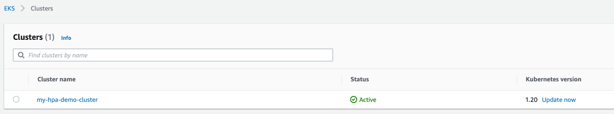

为了得到集群登陆上下文，如下读取你的 `kubeconfig` 文件：
```
$ cat  ~/.kube/config |grep "current-context"
current-context: bob@my-hpa-demo-cluster.us-west-2.eksctl.io
```

列取节点和 Pod：
```
$ kubectx bob@example-hpa-autoscaling.us-west-2.eksctl.io
Switched to context "bob@example-hpa-autoscaling.us-west-2.eksctl.io".

$ kubectl get nodes
NAME                                           STATUS   ROLES    AGE   VERSION
ip-192-168-94-150.us-west-2.compute.internal   Ready       15m   v1.20.4-eks-6b7464


$ kubectl get pods --all-namespaces
NAMESPACE     NAME                       READY   STATUS    RESTARTS   AGE
kube-system   aws-node-f45pg             1/1     Running   0          15m
kube-system   coredns-86d9946576-2h2zk   1/1     Running   0          24m
kube-system   coredns-86d9946576-4cvgk   1/1     Running   0          24m
kube-system   kube-proxy-864g6           1/1     Running   0          15m
```

kubectx 是一种在不同 Kubernetes 集群间切换的工具。现在我们已经有一个集群建立并运行起来，接下来，我们需要部署 `Metrics Server`。

#### 3.5.2 步骤 2 安装 metrics server

我们可以通过下面的命令来确认 Metrics Server 是否已经安装在我们的 EKS 集群里安装过了。
```
$ kubectl get apiservice | grep -i metrics
```

如果没有输出，我们的 EKS 集群里就没有安装度量服务器。我们可以使用下面的命令来查看我们是否有可用的度量：

```
$ kubectl top pods -n kube-system
error: Metrics API not available
```

> 注意：对于这个过程，我们在我们本地笔记本上创建了一个名为 “/Users/bob/hpa/” 的目录，并将我们本文中用到的配置文件保存到这个目录。我们建议你在你的工作站上创建一个类似的目录以下载需要的文件（下文将提到）。

让我们来安装度量服务器。从 `https://github.com/nonai/k8s-example-files/tree/main/metrics-server` 下载 `YAML` 文件：

```
$ cd /Users/bob/hpa/metrics-server && ls -l
total 56
-rw-r--r--  1 bob  1437157072   136 Aug 30 13:48 0-service-account.yaml
-rw-r--r--  1 bob  1437157072   710 Aug 30 13:48 1-cluster-roles.yaml
-rw-r--r--  1 bob  1437157072   362 Aug 30 13:48 2-role-binding.yaml
-rw-r--r--  1 bob  1437157072   667 Aug 30 13:48 3-cluster-role-bindings.yaml
-rw-r--r--  1 bob  1437157072   254 Aug 30 13:48 4-service.yaml
-rw-r--r--  1 bob  1437157072  1659 Aug 30 13:48 5-deployment.yaml
-rw-r--r--  1 bob  1437157072   331 Aug 30 13:48 6-api-service.yaml
```

一旦你下载了文件，运行下面的命令以创建所有资源：
```
$ kubectl apply -f .
serviceaccount/metrics-server created
clusterrole.rbac.authorization.k8s.io/system:aggregated-metrics-reader created
clusterrole.rbac.authorization.k8s.io/system:metrics-server created
rolebinding.rbac.authorization.k8s.io/metrics-server-auth-reader created
clusterrolebinding.rbac.authorization.k8s.io/metrics-server:system:auth-delegator created
clusterrolebinding.rbac.authorization.k8s.io/system:metrics-server created
service/metrics-server created
deployment.apps/metrics-server created
apiservice.apiregistration.k8s.io/v1beta1.metrics.k8s.io created
```
验证 `Metrics Server` 部署：
```
$ kubectl get pods --all-namespaces
NAMESPACE     NAME                             READY   STATUS    RESTARTS   AGE
kube-system   aws-node-982kv                   1/1     Running   0          14m
kube-system   aws-node-rqbg9                   1/1     Running   0          13m
kube-system   coredns-86d9946576-9k6gx         1/1     Running   0          25m
kube-system   coredns-86d9946576-m67h6         1/1     Running   0          25m
kube-system   kube-proxy-lcklc                 1/1     Running   0          13m
kube-system   kube-proxy-tk96q                 1/1     Running   0          14m
kube-system   metrics-server-9f459d97b-q5989   1/1     Running   0          41s
```

列出在 `kube-system` 命名空间里的服务：
```
$ kubectl get svc -n kube-system
NAME             TYPE        CLUSTER-IP              EXTERNAL-IP   PORT(S)         AGE
kube-dns         ClusterIP   10.100.0.10             53/UDP,53/TCP   26m
metrics-server   ClusterIP   10.100.66.231           443/TCP         82s
```

使用 `kubectl` 来查看 CPU 和 内存度量：
```
$ kubectl top pods -n kube-system
NAME                             CPU(cores)   MEMORY(bytes)
aws-node-982kv                   4m           40Mi
aws-node-rqbg9                   5m           39Mi
coredns-86d9946576-9k6gx         2m           8Mi
coredns-86d9946576-m67h6         2m           8Mi
kube-proxy-lcklc                 1m           11Mi
kube-proxy-tk96q                 1m           11Mi
metrics-server-9f459d97b-q5989   3m           15Mi
```

#### 3.5.3 步骤 3 部署一个示例应用

现在我们将使用一个自定义 Docker 镜像来运行 Apache 和 PHP。 该 Docker 镜像可以公开地访问，所以我们可以从我们的 Kubernetes 部署直接引用它。

让我们部署该应用作为 Kubernetes 集群的一部分，维持最小1个复本，最大10个复本。下面是其配置文件，你可以把它存为 "deployment.yml":
```
$ cd /Users/bob/hpa/
$ cat deployment.yml

apiVersion: apps/v1
kind: Deployment
metadata:
 name: hpa-demo-deployment
spec:
 selector:
   matchLabels:
     run: hpa-demo-deployment
 replicas: 1
 template:
   metadata:
     labels:
       run: hpa-demo-deployment
   spec:
     containers:
     - name: hpa-demo-deployment
       image: k8s.gcr.io/hpa-example
       ports:
       - containerPort: 80
       resources:
         limits:
           cpu: 500m
         requests:
           cpu: 200m
```

运行下买你的命令以应用它：
```
$ kubectl apply -f deployment.yml
deployment.apps/hpa-demo-deployment created

$ kubectl get pods
NAME                                   READY   STATUS    RESTARTS   AGE
hpa-demo-deployment-6b988776b4-b2hkb   1/1     Running   0          20s
```

我们已经成功地创建了部署，接下来让我们看看部署的状态列表：
```
$ kubectl get deploy
NAME                  READY   UP-TO-DATE   AVAILABLE   AGE
hpa-demo-deployment   1/1     1            1           9s
```

**创建 Kubernetes 服务**
下一步我们必须创建一个服务。示例应用将使用该服务在公开端点上监听。使用下面的内容创建一个服务配置文件：
```
$ cd /Users/bob/hpa/
$ cat service.yaml
apiVersion: v1
kind: Service
metadata:
 name: hpa-demo-deployment
 labels:
   run: hpa-demo-deployment
spec:
 ports:
 - port: 80
 selector:
   run: hpa-demo-deployment
```
该服务是我们已经创建的部署的前端，我们可以通过 80 端口访问。

使用该修改：
```
$ kubectl apply -f service.yaml
service/hpa-demo-deployment created
```

我们已经创建了服务，接下来，让我们检查服务是否存在以及其状态：
```
$ kubectl get svc
NAME                  TYPE        CLUSTER-IP       EXTERNAL-IP   PORT(S)   AGE
hpa-demo-deployment   ClusterIP   10.100.124.139                 80/TCP    7s
kubernetes            ClusterIP   10.100.0.1                     443/TCP   172m
```

这里我们看到：

- hpa-demo-deployment = 服务名
- 10.100.124.139，服务的 IP 地址，它在端口 80/TCP 上打开

#### 3.5.4 步骤 4 安装 HPA

现在我们已经拥有示例应用作为我们部署的一部分，并且该服务可在 80 端口访问。为了扩展我们的资源，我们将使用 HPA 在流量增加时扩展集群，在流量减少时缩小集群。

让我们创建 HPA 配置文件如下：
```
$ cd /Users/bob/hpa/
$ cat hpa.yaml
apiVersion: autoscaling/v1
kind: HorizontalPodAutoscaler
metadata:
 name: hpa-demo-deployment
spec:
 scaleTargetRef:
   apiVersion: apps/v1
   kind: Deployment
   name: hpa-demo-deployment
 minReplicas: 1
 maxReplicas: 10
 targetCPUUtilizationPercentage: 50
```

使用该修改
```
$ kubectl apply -f hpa.yaml
horizontalpodautoscaler.autoscaling/hpa-demo-deployment created
```

验证 HPA 部署：
```
$ kubectl get hpa
NAME                  REFERENCE                      TARGETS  MINPODS MAXPODS REPLICAS   AGE
hpa-demo-deployment   Deployment/hpa-demo-deployment 0%/50%    1       10      0          8s
```

上面的输出显示 HPA 维护由 `hpa-demo-deployment` 控制的 Pod 数目在 `1 ~ 10` 复本之间。在上面的例子中（参见 “TARGETS” 列），50% 目标值是 HPA 需要去维护的平均 CPU 使用率，另一方面 0% 目标值是当前使用率。

如果我们想改变最小最大值，我们可以使用这个命令。
> 注意：因为我们已经拥有了最小最大值，输出抛出一个错误提到它已经存在。

**增加负载**

到目前为止，我们已经创建了 `EKS` 集群，安装了 `Metrics Server`，部署了一个示例应用，并为其创建了一个伴生 Kubernetes 服务。我们也部署了 HPA，它将监控并我们的资源。

为了实时测试 HPA，让我们增加集群负载，并检查 HPA 如何管理资源以反应。

首先，让我们检查部署的当前状态：
```
$ kubectl get deploy
NAME                  READY   UP-TO-DATE   AVAILABLE   AGE
hpa-demo-deployment           1/1     1            1           23s
```

接下来，我们将启动一个容器，并在一个无限循环中向 `php-apache` 服务发送查询，该服务在 `80` 端口监听。打开一个新的终端并执行下面的命令：
```
# kubectl run -i --tty load-generator --rm --image=busybox --restart=Never -- /bin/sh -c "while sleep 0.01; do wget -q -O- http://hpa-demo-deployment; done"
```
> 注意：如果你的服务没有 DNS 记录，请代之以服务名。

查看服务名：
```
$ kubectl get svc
NAME                   TYPE        CLUSTER-IP      EXTERNAL-IP   PORT(S)   AGE
hpa-demo-deployment    ClusterIP   10.100.95.188           80/TCP    10m
```

在我们增加负载之前，HPA 的状态如下所示：
```
$ kubectl get hpa
NAME                REFERENCE                     TARGETS  MINPODS MAXPODS REPLICAS   AGE
hpa-demo-deployment Deployment/hpa-demo-deployment 0%/50%   1        10       1        12m
```

一旦我们触发了负载测试，使用下面的命令，它将每 `30` 秒钟显示 HPA 的状态。
```
$ kubectl get hpa -w
NAME                REFERENCE                      TARGETS MINPODS MAXPODS REPLICAS AGE
hpa-demo-deployment Deployment/hpa-demo-deployment  0%/50%  1      10      1        15m
...
...
hpa-demo-deployment Deployment/hpa-demo-deployment  38%/50% 1      10      8        25m
``` 

这里你将看到，随着使用率增加，Pod 数量从 1 增加到 7：
```
$ kubectl get deployment php-apache
NAME                READY   UP-TO-DATE   AVAILABLE     AGE
hpa-demo-deployment   7/7     7            7           21m
```

你也能看到 Pod 使用率度量。在这个例子中，负载发生器容器产生负载：
```
$ kubectl top pods --all-namespaces
NAMESPACE     NAME                                   CPU(cores)   MEMORY(bytes)
default       hpa-demo-deployment-6b988776b4-b2hkb   1m           10Mi
default       load-generator                         10m          1Mi
default       hpa-demo-deployment-d4cf67d68-2x89h    97m          12Mi
default       hpa-demo-deployment-d4cf67d68-5qxgm    86m          12Mi
default       hpa-demo-deployment-d4cf67d68-ddm54    131m         12Mi
default       hpa-demo-deployment-d4cf67d68-g6hhw    72m          12Mi
default       hpa-demo-deployment-d4cf67d68-pg67w    123m         12Mi
default       hpa-demo-deployment-d4cf67d68-rjp77    75m          12Mi
default       hpa-demo-deployment-d4cf67d68-vnd8k    102m         12Mi
kube-system   aws-node-982kv                         4m           41Mi
kube-system   aws-node-rqbg9                         4m           40Mi
kube-system   coredns-86d9946576-9k6gx               4m           9Mi
kube-system   coredns-86d9946576-m67h6               4m           9Mi
kube-system   kube-proxy-lcklc                       1m           11Mi
kube-system   kube-proxy-tk96q                       1m           11Mi
kube-system   metrics-server-9f459d97b-q5989         4m           17Mi
```

#### 3.5.5 监控 HPA 事件

如果你想查看集群扩展时 HPA 执行了哪些步骤，执行下面的命令并检查事件章部分：
```
$ kubectl describe deploy hpa-demo-deployment
Name:                   hpa-demo-deployment
Namespace:              default
CreationTimestamp:      Mon, 30 Aug 2021 17:15:34 +0530
Labels:                 
Annotations:            deployment.kubernetes.io/revision: 1
Selector:               run=php-apache
Replicas:               7 desired | 7 updated | 7 total | 7 available | 0 NewReplicaSet:          hpa-demo-deployment-d4cf67d68 (7/7 replicas created)
...
...
Events:
  Type    Reason             Age    From                   Message
  ----    ------             ----   ----                   -------
  Normal  ScalingReplicaSet  12m    deployment-controller  Scaled up replica set hpa-demo-deployment-d4cf67d68 to 1
  Normal  ScalingReplicaSet  5m39s  deployment-controller  Scaled up replica set hpa-demo-deployment-d4cf67d68 to 4
  Normal  ScalingReplicaSet  5m24s  deployment-controller  Scaled up replica set hpa-demo-deployment-d4cf67d68 to 5
  Normal  ScalingReplicaSet  4m38s  deployment-controller  Scaled up replica set hpa-demo-deployment-d4cf67d68 to 7
```

我们能够看到 Pod 从 `1` 增长到 `4`， 然后是 `5`， 最后增长到 `7`.

#### 3.5.6 减轻负载

接下来，让我们减轻负载。导航到你执行负载测试的终端，按 `Ctrl+ C` 停止负载产生。

然后，验证你的资源使用率状态：
```
$ kubectl get hpa
NAME                REFERENCE                       TARGETS  MINPODS MAXPODS REPLICAS  AGE
hpa-demo-deployment  Deployment/hpa-demo-deployment  0%/50%     1       10    1        25m

$ kubectl get deployment hpa-demo-deployment
NAME                  READY   UP-TO-DATE   AVAILABLE       AGE
hpa-demo-deployment    1/1         1            1           25m
```

验证状态的另一种方式：
```
$ kubectl get events
```

```
51m         Normal   SuccessfulCreate    replicaset/hpa-demo-deployment-cf6477c46      Created pod: hpa-demo-deployment-cf6477c46-b56vr
52m         Normal   SuccessfulRescale   horizontalpodautoscaler/hpa-demo-deployment   New size: 4; reason: cpu resource utilization (percentage of request) above target
52m         Normal   ScalingReplicaSet   deployment/hpa-demo-deployment                Scaled up replica set hpa-demo-deployment-cf6477c46 to 4
52m         Normal   SuccessfulRescale   horizontalpodautoscaler/hpa-demo-deployment   New size: 6; reason: cpu resource utilization (percentage of request) above target
52m         Normal   ScalingReplicaSet   deployment/hpa-demo-deployment                Scaled up replica set hpa-demo-deployment-cf6477c46 to 6
51m         Normal   SuccessfulRescale   horizontalpodautoscaler/hpa-demo-deployment   New size: 7; reason: cpu resource utilization (percentage of request) above target
51m         Normal   ScalingReplicaSet   deployment/hpa-demo-deployment                Scaled up replica set hpa-demo-deployment-cf6477c46 to 7
53m         Normal   Scheduled           pod/load-generator                            Successfully assigned default/load-generator to ip-192-168-74-193.us-west-2.compute.internal
53m         Normal   Pulling             pod/load-generator                            Pulling image "busybox"
52m         Normal   Pulled              pod/load-generator                            Successfully pulled image "busybox" in 1.223993555s
52m         Normal   Created             pod/load-generator                            Created container load-generator
52m         Normal   Started             pod/load-generator                            Started container load-generator
```

#### 3.5.7 销毁集群

最后，我们将使用下面的命令销毁演示 EKS 集群：
```
$ eksctl delete cluster --name my-hpa-demo-cluster --region us-west-2
2021-08-30 20:10:09 [i]  eksctl version 0.60.0
2021-08-30 20:10:09 [i]  using region us-west-2
2021-08-30 20:10:09 [i]  deleting EKS cluster "my-hpa-demo-cluster"
...
...
2021-08-30 20:12:40 [i]  waiting for CloudFormation stack "eksctl-my-hpa-demo-cluster-nodegroup-ng-1"
2021-08-30 20:12:41 [i]  will delete stack "eksctl-my-hpa-demo-cluster-cluster"
2021-08-30 20:12:42 [✔]  all cluster resources were deleted
```

### 3.6 HPA 使用及成本报告

更多的扩展带来了更多的复杂性，随着更多变量引入等式，水平扩展使得使用及成本报告更复杂。

### 3.7 总结

回顾一下，在本文中我们学到了：
- HPA 是 Kubernetes 自动扩展的原声方法之一，用于扩展资源如 `deployments`, `replica sets`, `replication controllers`, 以及 `stateful sets`。它基于观测到的度量并与给定阈值以增减 Pod 数目。
- 每个 HPA 在集群中以 `HorizontalPodAutoscaler` 对象的形式存在。为了与这些对象交互，你可以使用命令如 `“kubectl get hpa”` 或 `“kubectl describe hpa HPA_NAME”`。
- HPA 在容器级别的资源请求值做出扩展决策，因此对你的所有容器配置了资源请求值是非常重要的。
- Kubernetes 集群必须安装 Metrics Server 以便 HPA 正常工作。
- 出于其内部限制，HPA 最好与 `Cluster Autoscaler` 联合工作。当集群现有节点耗尽，HPA 可以扩展资源，因此它需要 `Cluster Autoscaler` 帮助在 Kubernetes 集群中增加节点。

## 四. CA

自动扩展是 Kubernetes（K8S）最具价值的提议之一 。与 `Vertical Pod Autoscaler (VPA)` 和 `Horizontal Pod Autoscaler (HPA)` 一样，`Cluster Autoscaler (CA)` 是 K8S 中三种自动扩展功能的一种。因此，理解 `Cluster Autoscaler` 是了解你的 Kubernetes 平台不可或缺的一部分。

为了帮助你开始了解 CA，我们将提供一个对 Kubernetes 中 `Cluster Autoscaler` 的介绍，描述其使用及益处，并使用 AWS [Elastic Kubernetes Service](https://aws.amazon.com/eks/) (EKS) 作为例子来实现 `Cluster Autoscaler`。

### 4.1 集群自动扩展器与其它自动扩展器的区别

在我们开始探寻 CA 的规范之前，让我们先来看看 Kubernetes 中的三种不同的自动扩展方式。它们是：

- 集群自动扩展器（CA）：当 Pod 不能被调度或节点未被充分使用时，调整集群中的节点数量
- 水平 Pod 自动扩展器（HPA）：调整应用复本数量
- 垂直 Pod 自动扩展器（VPA）：调整容器资源请求或限制量

一种思考 Kubernetes 自动扩展功能的简单方法是 HPA 和 VPA 运行于 Pod 级别，相反 CA 运行在集群级别。

### 4.2 什么是集群自动扩展器（CA）

集群自动扩展器基于 Pod 的资源请求自动增减集群中的节点。集群自动扩展器并不直接测量 CPU 和 内存来作扩展决策。替代地，它每 10 秒钟检查一次以检索处于 pending 状态的 Pod，它表明由于没有足额的集群容量调度器不能将它们指派给一个节点。

### 4.3 集群自动扩展器如何工作

在扩展的场景中，当由于资源缺乏导致 pending （未调度）Pods 数目增加时 CA 会自动介入并向集群添加新的节点。


上面的截图演示了当需要扩展容量时的 CA 决策过程。缩减场景存在同样的机制，其时 CA 将 Pod 迁移至更少的节点上以释放节点并终止它。

向上扩展一个集群的四个步骤包括：

1. 当 CA 处于活跃状态，它将检查 pending pods。默认扫描间隔是 10 秒，它可以通过 --scan-interval 标记配置。
2. 如果存在 pending pods 并且集群需要更多的资源，只要它还在管理员配置的限制之内，CA 就将通过启动一个新的节点来扩展集群。公有云供应商如 AWS, Azure, GCP 也支持 Kubernetes 集群自动扩展功能。例如，AWS EKS 使用它的 AWS [Auto Scaling group](https://docs.aws.amazon.com/autoscaling/ec2/userguide/what-is-amazon-ec2-auto-scaling.html) 功能自动增减 EC2虚拟机作为集群节点来与 Kubernetes 集成。
3. Kubernetes 注册控制平面新起的节点以使它对 Kubernetes 调度器指派 Pod 可用。
4. 最好，Kubernetes 调度器分配 pending pods 至新的节点。

### 4.4 集群自动扩展器的局限

当你计划你的实现 CA 有一些限制需要铭记：

- CA 并不基于 CPU 或 内存做出扩展决策。它仅仅检查一个 Pod 的 CPU 和内存资源的请求和限制，这个限制意味着由用户请求的无用计算资源将不会被 CA 检测到，从而导致集群资源浪费和低效的资源利用率。
- 无论何时当有一个扩展集群的请求时，CA 在30 - 60 秒内向云供应商发布一个扩展请求。云供应商花费的创建一个节点的实际时间可能由几分钟甚至更多。这个延迟意味着你的应用的性能在等待集群容量扩展期间可能会下降。

### 4.5 EKS 示例: 如何实现集群自动扩展器

接下来，我们将在 AWS Elastic Kubernetes Service (EKS) 中逐步实现 Kubernetes CA 的功能。EKS 使用  [AWS Auto Scaling group](https://docs.aws.amazon.com/autoscaling/ec2/userguide/what-is-amazon-ec2-auto-scaling.html)（我们偶尔会用“ASG”来引用它）的功能来与 CA 集成，并执行添加/删除节点的请求。下面时作为我们的练习的一部分的七步：

1. 检查 CA 的前提条件
2. 在 AWS 中创建 EKS
3. 创建 IAM OIDC 提供者
4. 为 CA 创建 IAM 策略
5. 为 CA 创建 IAM 角色
6. 部署 Kubernetes CA
7. 创建一个 Nginx 部署以测试 CA 功能

#### 4.5.1 前提

下面的截图显示了 ASG 的相关标记（tags）。CA 依赖这些标签来识别它将使用的 AWS ASG。如果这些标签不存在，CA 就不能发现 ASG，也就不能从 EKS 集群增加/删除节点。

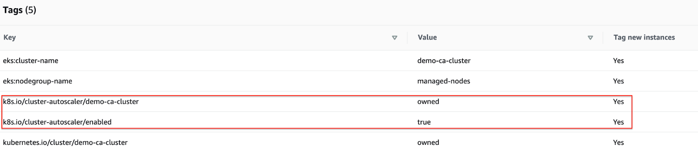

#### 4.5.2 STEP 1: 创建 EKS 集群

这个预演将在 AWS 中创建 EKS 集群，它带有两个 ASG，以此来演示 CA 如何使用 ASG 管理 EKS 集群。在创建 EKS 集群时，AWS 自动创建 EC2 ASG，但你必须确保它们含有 CA 发现它们所必需的标签。

首先，使用下面的内容创建 EKS 集群配置文件。
```
---
apiVersion: eksctl.io/v1alpha5
kind: ClusterConfig
metadata:
  name: demo-ca-cluster
  region: us-east-1
  version: "1.20"
availabilityZones:
- us-east-1a
- us-east-1b
managedNodeGroups:
- name: managed-nodes
  labels:
    role: managed-nodes
  instanceType: t3.medium
  minSize: 1
  maxSize: 10
  desiredCapacity: 1
  volumeSize: 20
nodeGroups:
- name: unmanaged-nodes
  labels:
    role: unmanaged-nodes
  instanceType: t3.medium
  minSize: 1
  maxSize: 10
  desiredCapacity: 1
  volumeSize: 20
```

这里我们为集群创建了两个 ASG（其下 AWS EKS 使用了 [node groups](https://docs.aws.amazon.com/eks/latest/userguide/managed-node-groups.html) 来简化节点的生命周期管理）：

- 管理节点（Managed-nodes）
- 未受管理节点（Unmanaged-nodes）

我们稍后将在我们的练习中的测试环节使用未受管理节点来验证 CA 是否正常工作。

接下来，利用 [eksctl](https://eksctl.io/) 来使用下面的命令创建 EKS 集群：

```
$ eksctl create cluster -f eks.yaml
```

#### 4.5.3 STEP 2: 验证 EKS 集群和 ASG

我们可以使用 kubectl 命令行来验证：

```
$ kubectl get svc
NAME         TYPE        CLUSTER-IP   EXTERNAL-IP   PORT(S)   AGE
kubernetes   ClusterIP   10.100.0.1           443/TCP   14m
```

我们也可以从 AWS 控制台验证我们集群的存在：

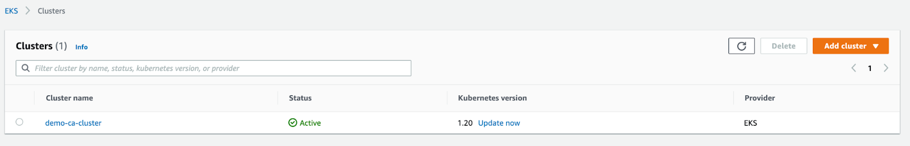

我们也可以从 AWS 控制台证明 ASG 也正确创建了：

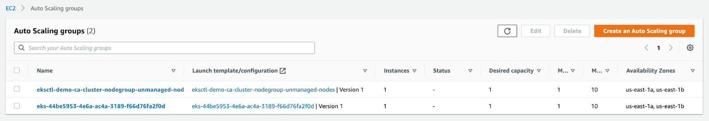

#### 4.5.4 STEP 3: 创建 IAM OIDC 提供者

IAM OIDC 用于授权 CA 在 ASG 中启动/终止实例。在这一节，我们将看到如何在 EKS 集群中配置它.

在 EKS 集群控制台，导航到配置属性页，如下所示复制 `OpenID connect URL`：

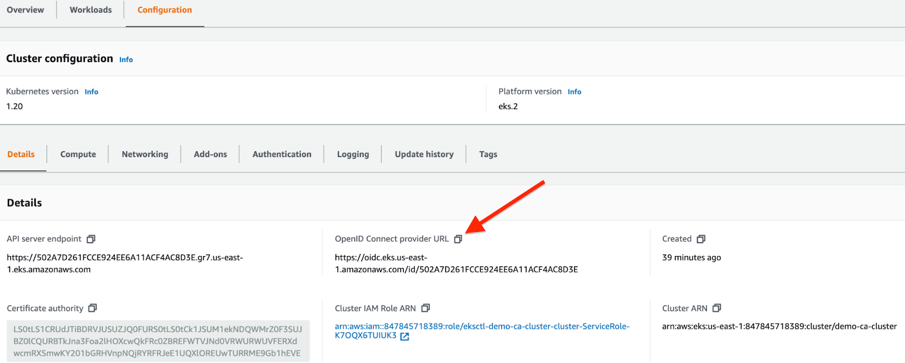

然后导航到 IAM 控制台，如下选择 `Identity provider`：

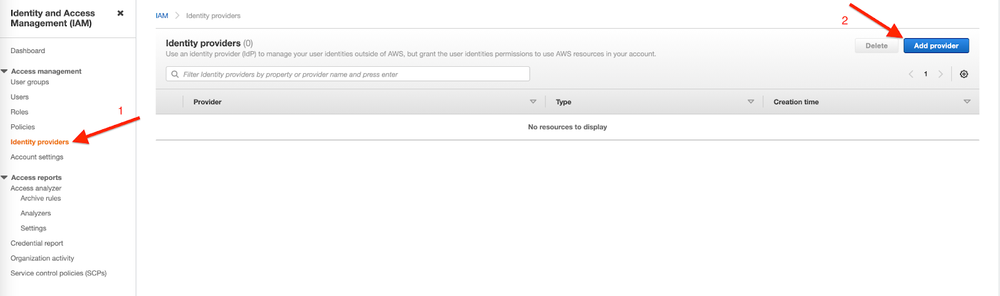

点击 “Add provider”，选择 “OpenID Connect”，然后如下点击 “Get thumbprint”：

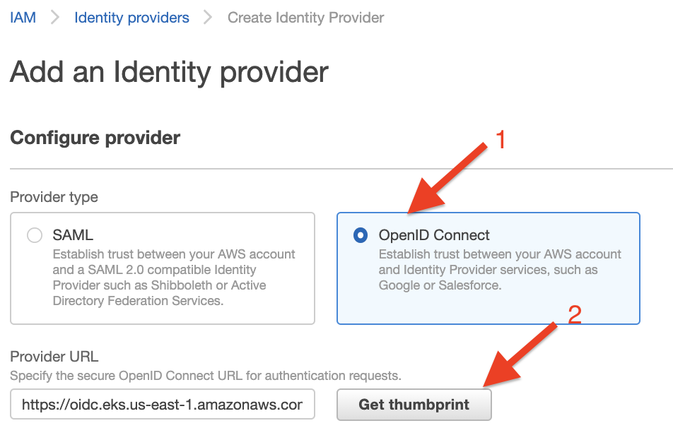

然后进入 `“Audience”`（我们的例子中 `sts.amazonaws.com` 指向 `AWS STS`，也被称为 `Security Token Service`）并添加 `provider`（从[这里](https://docs.aws.amazon.com/IAM/latest/UserGuide/id_roles_providers_create_oidc.html)了解更多 OpenID）：

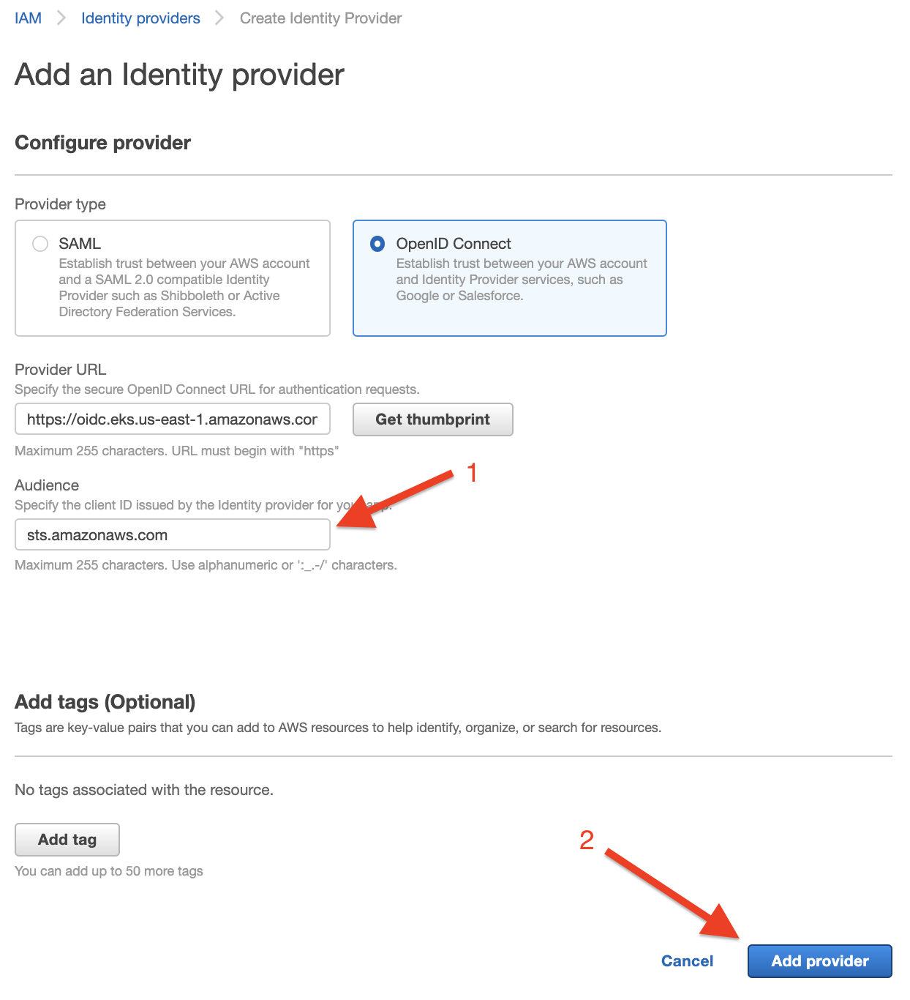

> 注意：你需要将 IAM 角色附加到这个 Provider--我们将接下来审查这个。

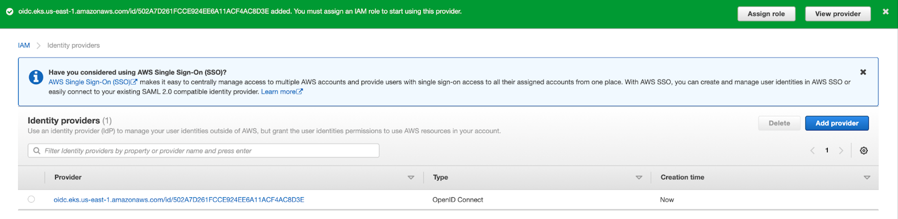

#### 4.5.5 STEP 4: 创建 IAM 策略

接下来，我们需要创建 [IAM policy](https://docs.aws.amazon.com/IAM/latest/UserGuide/access_policies.html)，它将允许 CA 增减集群中节点数目。

为了创建带有必需权限的策略，保存下面的内容为 `“AmazonEKSClusterAutoscalerPolicy.json”` 或任何你喜欢的名字：
```
{
  "Version": "2012-10-17",
  "Statement": [
      {
          "Action": [
              "autoscaling:DescribeAutoScalingGroups",
              "autoscaling:DescribeAutoScalingInstances",
              "autoscaling:DescribeLaunchConfigurations",
              "autoscaling:DescribeTags",
              "autoscaling:SetDesiredCapacity",
              "autoscaling:TerminateInstanceInAutoScalingGroup",
              "ec2:DescribeLaunchTemplateVersions"
          ],
          "Resource": "*",
          "Effect": "Allow"
      }
  ]
}
```
然后，运行下面的 AWS CLI 命令来创建策略（可以从[这里](https://docs.aws.amazon.com/cli/latest/userguide/cli-chap-getting-started.html)了解更多 AWS CLI 安装和配置知识）：
```
$ aws iam create-policy --policy-name AmazonEKSClusterAutoscalerPolicy --policy-document file://AmazonEKSClusterAutoscalerPolicy.json
```
策略的验证：
```
$ aws iam list-policies --max-items 1
{
    "NextToken": "eyJNYXJrZXIiOiBudWxsLCAiYm90b190cnVuY2F0ZV9hbW91bnQiOiAxfQ==",
    "Policies": [
        {
            "PolicyName": "AmazonEKSClusterAutoscalerPolicy",
            "PermissionsBoundaryUsageCount": 0,
            "CreateDate": "2021-10-24T15:02:46Z",
            "AttachmentCount": 0,
            "IsAttachable": true,
            "PolicyId": "ANPA4KZ4K7F2VD6DQVAZT",
            "DefaultVersionId": "v1",
            "Path": "/",
            "Arn": "arn:aws:iam::847845718389:policy/AmazonEKSClusterAutoscalerPolicy",
            "UpdateDate": "2021-10-24T15:02:46Z"
        }
    ]
}
```
#### 4.5.6 STEP 5: 为 provider 创建 IAM 角色

正如前面讨论过的，我们仍然需要创建一个 [IAM 角色](https://docs.aws.amazon.com/IAM/latest/UserGuide/id_roles.html)，并把它与在步骤 3 中创建的 Prodiver 连接到一起。

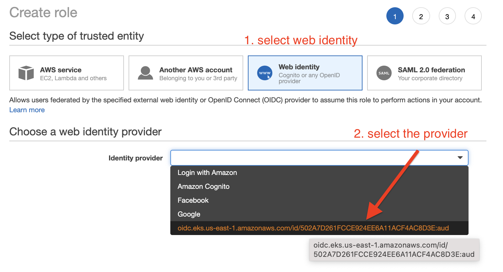

选择观众 `“sts.amazonaws.com”` 并附上你创建的策略。

然后，验证 IAM 角色并确认策略已经附上了：

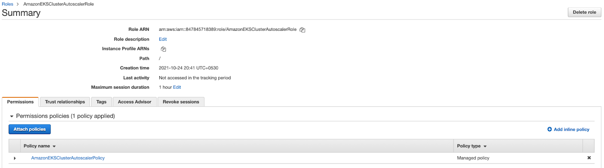

编辑 `“Trust relationships”`：

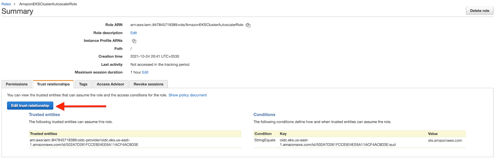

接下来，修改 `OIDC` 如下所示：

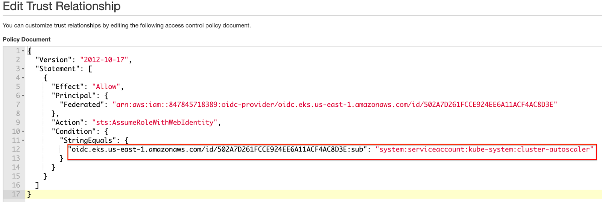

然后点击 `“Update Trust Policy”` 并保存。

#### 4.5.7 STEP 6: 部署 CA

接下来，我们部署 CA。为了实现这个，我们必须实现先前创建的 IAM 角色的 ARN 数字。

为了部署 CA，将下面命令行后面的内容存为一个文件，并运行下面的命令：

```
$ kubectl  apply -f <path of the file> 
```

保存至文件的内容如下（确保你复制了全部内容，它包含下面步骤需要的内容）：

```
apiVersion: v1
kind: ServiceAccount
metadata:
  labels:
    k8s-addon: cluster-autoscaler.addons.k8s.io
    k8s-app: cluster-autoscaler
  annotations:
    eks.amazonaws.com/role-arn: arn:aws:iam::847845718389:role/AmazonEKSClusterAutoscalerRole
  name: cluster-autoscaler
  namespace: kube-system

---
apiVersion: rbac.authorization.k8s.io/v1
kind: ClusterRole
metadata:
  name: cluster-autoscaler
  labels:
    k8s-addon: cluster-autoscaler.addons.k8s.io
    k8s-app: cluster-autoscaler
rules:
  - apiGroups: [""]
    resources: ["events", "endpoints"]
    verbs: ["create", "patch"]
  - apiGroups: [""]
    resources: ["pods/eviction"]
    verbs: ["create"]
  - apiGroups: [""]
    resources: ["pods/status"]
    verbs: ["update"]
  - apiGroups: [""]
    resources: ["endpoints"]
    resourceNames: ["cluster-autoscaler"]
    verbs: ["get", "update"]
  - apiGroups: [""]
    resources: ["nodes"]
    verbs: ["watch", "list", "get", "update"]
  - apiGroups: [""]
    resources:
      - "pods"
      - "services"
      - "replicationcontrollers"
      - "persistentvolumeclaims"
      - "persistentvolumes"
    verbs: ["watch", "list", "get"]
  - apiGroups: ["extensions"]
    resources: ["replicasets", "daemonsets"]
    verbs: ["watch", "list", "get"]
  - apiGroups: ["policy"]
    resources: ["poddisruptionbudgets"]
    verbs: ["watch", "list"]
  - apiGroups: ["apps"]
    resources: ["statefulsets", "replicasets", "daemonsets"]
    verbs: ["watch", "list", "get"]
  - apiGroups: ["storage.k8s.io"]
    resources: ["storageclasses", "csinodes"]
    verbs: ["watch", "list", "get"]
  - apiGroups: ["batch", "extensions"]
    resources: ["jobs"]
    verbs: ["get", "list", "watch", "patch"]
  - apiGroups: ["coordination.k8s.io"]
    resources: ["leases"]
    verbs: ["create"]
  - apiGroups: ["coordination.k8s.io"]
    resourceNames: ["cluster-autoscaler"]
    resources: ["leases"]
    verbs: ["get", "update"]
---
apiVersion: rbac.authorization.k8s.io/v1
kind: Role
metadata:
  name: cluster-autoscaler
  namespace: kube-system
  labels:
    k8s-addon: cluster-autoscaler.addons.k8s.io
    k8s-app: cluster-autoscaler
rules:
  - apiGroups: [""]
    resources: ["configmaps"]
    verbs: ["create","list","watch"]
  - apiGroups: [""]
    resources: ["configmaps"]
    resourceNames: ["cluster-autoscaler-status", "cluster-autoscaler-priority-expander"]
    verbs: ["delete", "get", "update", "watch"]

---
apiVersion: rbac.authorization.k8s.io/v1
kind: ClusterRoleBinding
metadata:
  name: cluster-autoscaler
  labels:
    k8s-addon: cluster-autoscaler.addons.k8s.io
    k8s-app: cluster-autoscaler
roleRef:
  apiGroup: rbac.authorization.k8s.io
  kind: ClusterRole
  name: cluster-autoscaler
subjects:
  - kind: ServiceAccount
    name: cluster-autoscaler
    namespace: kube-system


---
apiVersion: rbac.authorization.k8s.io/v1
kind: RoleBinding
metadata:
  name: cluster-autoscaler
  namespace: kube-system
  labels:
    k8s-addon: cluster-autoscaler.addons.k8s.io
    k8s-app: cluster-autoscaler
roleRef:
  apiGroup: rbac.authorization.k8s.io
  kind: Role
  name: cluster-autoscaler
subjects:
  - kind: ServiceAccount
    name: cluster-autoscaler
    namespace: kube-system

---
apiVersion: apps/v1
kind: Deployment
metadata:
  name: cluster-autoscaler
  namespace: kube-system
  labels:
    app: cluster-autoscaler
spec:
  replicas: 1
  selector:
    matchLabels:
      app: cluster-autoscaler
  template:
    metadata:
      labels:
        app: cluster-autoscaler
      annotations:
        cluster-autoscaler.kubernetes.io/safe-to-evict: 'false'
    spec:
      serviceAccountName: cluster-autoscaler
      containers:
        - image: k8s.gcr.io/autoscaling/cluster-autoscaler:v1.20.0
          name: cluster-autoscaler
          resources:
            limits:
              cpu: 100m
              memory: 500Mi
            requests:
              cpu: 100m
              memory: 500Mi
          command:
            - ./cluster-autoscaler
            - --v=4
            - --stderrthreshold=info
            - --cloud-provider=aws
            - --skip-nodes-with-local-storage=false
            - --expander=least-waste
            - --node-group-auto-discovery=asg:tag=k8s.io/cluster-autoscaler/enabled,k8s.io/cluster-autoscaler/demo-ca-cluster
            - --balance-similar-node-groups
            - --skip-nodes-with-system-pods=false
          volumeMounts:
            - name: ssl-certs
              mountPath: /etc/ssl/certs/ca-certificates.crt #/etc/ssl/certs/ca-bundle.crt for Amazon Linux Worker Nodes
              readOnly: true
          imagePullPolicy: "Always"
      volumes:
        - name: ssl-certs
          hostPath:
            path: "/etc/ssl/certs/ca-bundle.crt"
```

对于这一步，重要的参数包括：

- **--node-group-auto-discovery =** 这被 CA 用于基于其标记发现 ASG。下面这个例子演示了标记格式：`asg:tag=tagKey,anotherTagKey`
- **V1.20.0 =** 这是我们的例子中使用的 EKS 集群的发布版本。如果你在使用老版本你必须更新
- **--balance-similar-node =** 如果你将这个设置为 `“true,”`，CA 将检测相似的节点组，并平衡它们之间的节点数目。
- **--skip-nodes-with-system-pods =** 如果你设置这个标记为 `“true,”`，CA 将永不会删除驻留有与 `kube-system` 相关 Pod 的节点（`DaemonSet` 或镜像 Pod例外）

参考[这个文件](https://github.com/kubernetes/autoscaler/blob/master/cluster-autoscaler/FAQ.md#what-are-the-parameters-to-ca)可以获取集群配置参数的完整集以备将来使用。

接下来，验证你在使用正确的 kubeconfig：
```
$ kubectx
bob@demo-ca-cluster.us-east-1.eksctl.io
```

然后，使用根据先前内容保存的 YAML 配置文件如下发布命令以应用修改：

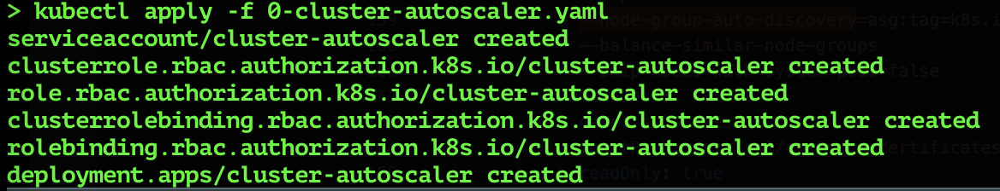

下一步，使用下面的命令以验证日志：
```
$ kubectl logs -l app=cluster-autoscaler -n kubesystem -f
```

下面红色高亮的一节指示命令行运行成功：

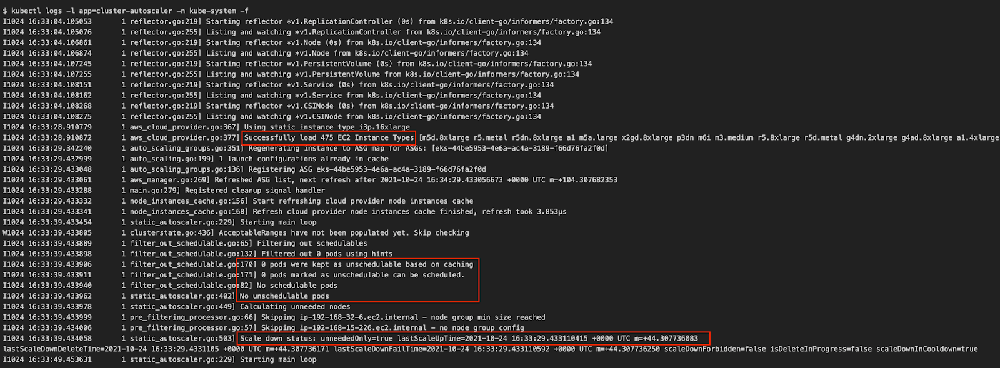

现在 CA 将会检查未调度的 Pod 并努力调度它们。你可以从日志中看到这些行动。运行下面的命令以检查 Pod 的状态：

```
$ kubectl get pods -n kube-system
```

期待的结果如下所示：

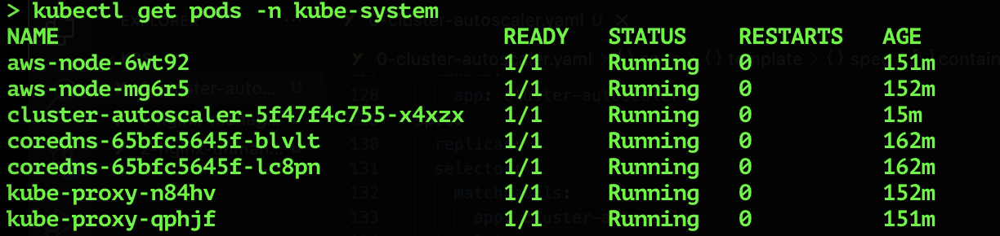

检查 EKS 集群的节点数目：

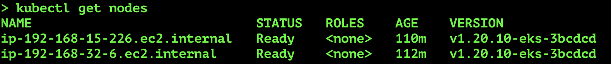

祝贺！你已经部署 CA 成功了。

这里，你看到了两个节点在集群里，其中一个节点在一个管理组中，另一个在非管理组中。这个配置允许我们在稍后的练习中测试 CA 的功能。接下来，我们将部署 Nginx 为一个实例应用 Deployment 以练习自动扩展并观测 CA 的行动。

#### 4.5.8 STEP 7: 创建一个 Nginx deployment 来测试自动扩展器功能

我们将创建两个部署：一个基于管理节点组；另一个基于非管理节点组。

##### 管理节点组

基于下面的内容创建一个配置文件：

```
apiVersion: apps/v1
kind: Deployment
metadata:
  name: nginx-managed
  namespace: default
spec:
  replicas: 2
  selector:
    matchLabels:
      app: nginx-managed
  template:
    metadata:
      labels:
        app: nginx-managed
    spec:
      containers:
      - name: nginx-managed
        image: nginx:1.14.2
        ports:
        - containerPort: 80
      affinity:
        nodeAffinity:
          requiredDuringSchedulingIgnoredDuringExecution:
            nodeSelectorTerms:
            - matchExpressions:
              - key: role
                operator: In
                values:
                - managed-nodes
        podAntiAffinity:
          requiredDuringSchedulingIgnoredDuringExecution:
          - labelSelector:
              matchExpressions:
              - key: app
                operator: In
                values:
                - nginx-managed
            topologyKey: kubernetes.io/hostname
            namespaces:
            - default
```

注意：上面的配置使用了[节点亲缘性](https://v1-20.docs.kubernetes.io/docs/concepts/scheduling-eviction/assign-pod-node/#affinity-and-anti-affinity)，它基于标签 `“role=managed-nodes”` 以选择节点组，从而帮助调度器控制 Pod 被调度的位置。

使用该修改：

```
$ kubectl apply -f 1-nginx-managed.yaml
deployment.apps/nginx-managed created
```

##### 非管理节点组

对于非管理节点组，基于下面的内容创建一个配置文件：

```
apiVersion: apps/v1
kind: Deployment
metadata:
  name: nginx-unmanaged
  namespace: default
spec:  replicas: 2
  selector:
    matchLabels:
      app: nginx-unmanaged
  template:
    metadata:
      labels:
        app: nginx-unmanaged
    spec:
      containers:
      - name: nginx-unmanaged
        image: nginx:1.14.2
        ports:
        - containerPort: 80
      affinity:
        nodeAffinity:
          requiredDuringSchedulingIgnoredDuringExecution:
            nodeSelectorTerms:
            - matchExpressions:
              - key: role
                operator: In
                values:
                - unmanaged-nodes
        podAntiAffinity:
          requiredDuringSchedulingIgnoredDuringExecution:
          - labelSelector:
              matchExpressions:
              - key: app
                operator: In
                values:
                - nginx-unmanaged
            topologyKey: kubernetes.io/hostname
            namespaces:
            - default
```

使用该修改：

```
$ kubectl apply -f 2-nginx-unmanaged.yaml
deployment.apps/nginx-unmanaged created
```

检查 Pod 状态：

```
$ kubectl get pods -n default
NAME                               READY   STATUS    RESTARTS   AGE
nginx-managed-7cf8b6449c-mctsg     1/1     Running   0          60s
nginx-managed-7cf8b6449c-vjvxf     0/1     Pending   0          60s
nginx-unmanaged-67dcfb44c9-gvjg4   0/1     Pending   0          52s
nginx-unmanaged-67dcfb44c9-wqnvr   1/1     Running   0          52s
```

现在，你可以看到，四个 Pod 中仅有两个在运行，其原因在于我们的集群中仅有两个节点。请注意我们使用了一个 [Pod 亲缘性](https://v1-20.docs.kubernetes.io/docs/concepts/scheduling-eviction/assign-pod-node/#affinity-and-anti-affinity)配置以防止 Kubernetes 同一个 deployment 的多个 Pod 被调度到同一个节点（从而避免了为了演示 CA功能添加额外的容量）上。

CA 将会检查 Pod 的状态。发现一些处于  “pending” 状态，并试着向集群添加新的节点。几分钟后，你将看到第三个节点出现了:

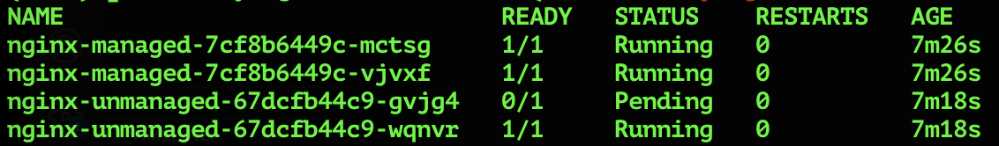

##### 基于标签列出 ASG

下面的 WS CLI 命令显示了 ASG 拥有特定标记从而被选择。你可以从结果中发现仅仅一个 ASG 组（管理组）被显示：

```
$ aws autoscaling describe-auto-scaling-groups --query "AutoScalingGroups[? Tags[? (Key=='k8s.io/cluster-autoscaler/enabled') && Value=='true']]".AutoScalingGroupName --region us-east-1
[
    "eks-44be5953-4e6a-ac4a-3189-f66d76fa2f0d"
]

$ aws autoscaling describe-auto-scaling-groups --query "AutoScalingGroups[? Tags[? (Key=='k8s.io/cluster-autoscaler/demo-ca-cluster') && Value=='owned']]".AutoScalingGroupName --region us-east-1
[
    "eks-44be5953-4e6a-ac4a-3189-f66d76fa2f0d"
]
```

##### 添加标记

现在，让我们为我们先前从AWS 控制台创建的非管理组手动添加标记：

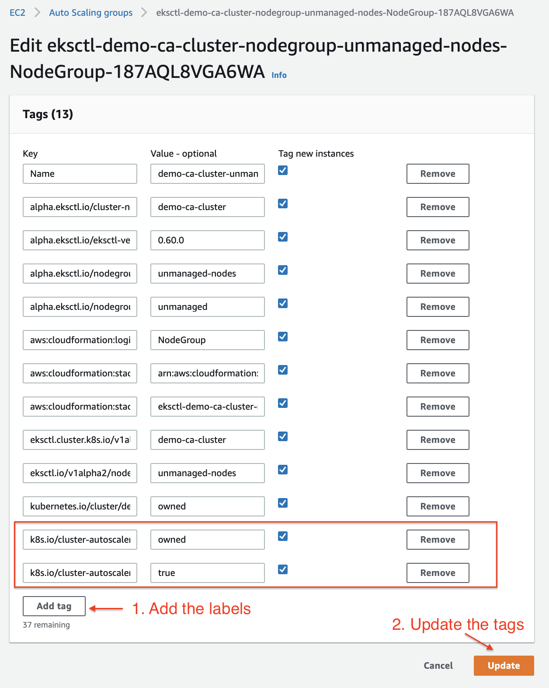

现在，管理组和非管理组都包含需要的标记：

```
$ aws autoscaling describe-auto-scaling-groups --query "AutoScalingGroups[? Tags[? (Key=='k8s.io/cluster-autoscaler/enabled') && Value=='true']]".AutoScalingGroupName --region us-east-1
[
    "eks-44be5953-4e6a-ac4a-3189-f66d76fa2f0d",
 "eksctl-demo-ca-cluster-nodegroup-unmanaged-nodes-NodeGroup-187AQL8VGA6WA"
]

$ aws autoscaling describe-auto-scaling-groups --query "AutoScalingGroups[? Tags[? (Key=='k8s.io/cluster-autoscaler/demo-ca-cluster') && Value=='owned']]".AutoScalingGroupName --region us-east-1
[
    "eks-44be5953-4e6a-ac4a-3189-f66d76fa2f0d",
 "eksctl-demo-ca-cluster-nodegroup-unmanaged-nodes-NodeGroup-187AQL8VGA6WA"
]
```

##### *Pod 的验证

让我们再次检查节点的状态以验证我们大部分最近的配置修改如何影响 CA 向我们的集群添加节点的方式。如下我们可以看到第四个节点已经被添加到我们的集群：

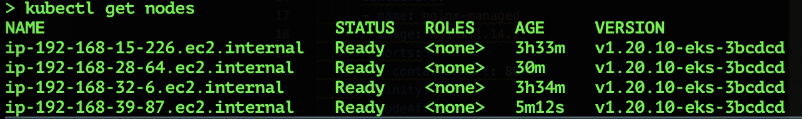


当你检查 Pod 的状态，因为我们的集群中有四个节点因此四个 Pod 都在运行：

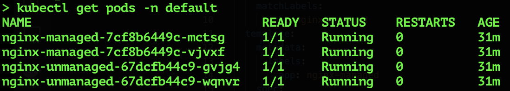

如果你从 AWS 控制台检查 ASG，你将会看到四个节点确实已经就位：

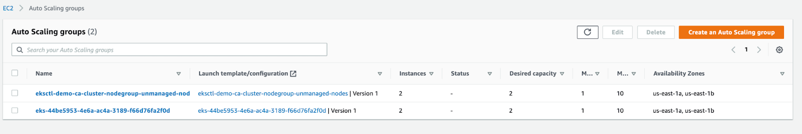

##### 缩减节点

我们也可以验证 CA 可以移除节点。为了观测这个，我们删除 Nginx deployments （Pod）并观测到 CA 从集群中移除节点以反应从而容纳缩减的集群容量需求。我们适应下面的 kubectl 命令以删除    deployments：

```
$ kubectl delete -f 1-Nginx-managed.yaml
deployment.apps "nginx-managed" deleted

$ kubectl delete -f 2-nginx-unmanaged.yaml
deployment.apps "nginx-unmanaged" deleted
```

当你删除 deployment 之后，等待几分钟，然后从 AWS 控制台检查 ASG 以验证期待的节点缩减：

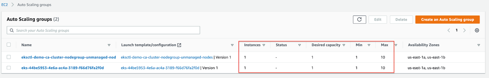

##### 完成教程后清理

一旦你完成了你的测试，记得使用下面的命令删除你的练习中使用的 EKS 集群：

```
$ eksctl delete cluster --name=demo-ca-cluster --region us-east-1
2021-10-25 00:45:38 [ℹ]  eksctl version 0.60.0
2021-10-25 00:45:38 [ℹ]  using region us-east-1
2021-10-25 00:45:38 [ℹ]  deleting EKS cluster "demo-ca-cluster"
...
...
2021-10-25 00:49:24 [ℹ]  will delete stack "eksctl-demo-ca-cluster-cluster"
2021-10-25 00:49:24 [✔]  all cluster resources were deleted
```

### 4.6 集群自动扩展器使用及成本报告

伴随扩展以及自动化是增长的监控复杂性--测量使用及分配成本变得更复杂--CA 通过增减节点改变了集群中的资源量。

记得阅读我们的 [Kubernetes 标记指南](https://blog.kubecost.com/blog/kubernetes-labels/)以学习实现标记策略的最佳实践，它可以增强你的 Kubecost 成本分配报告。你可以借助 [Helm chart](https://www.kubecost.com/install.html) 一个命令行就安装 Kubecost。Kubecost 对于单个集群无论其大小永远免费。

### 4.7 结论

通过添加节点到集群以确保足够的计算资源以及通过删除节点以节省基础设置成本，CA 在此扮演了一个非常重要的角色。CA 通过检查处于 pending 状态（它告诉 CA 需要向上扩展以增加容量）的 Pod 和简称未充分利用的节点（告诉 CA 向下缩减）以执行这些功能。CA 比 HPA 和 VPA 易于实现及维护，但这并不意味它应该代替它们。Kubernetes 自动扩展当三种自动扩展方式相互呼应时工作得最好。选择使用 CA 依赖于你的应用的架构（例如，你的应用是否基于微服务）以及扩展频率。因此，我们建议你使用我们的指南以理解 Kubernetes 支持的每一种自动扩展方式，从而能够选择满足你的需求的自动扩展器。

## Reference

- [Kubernetes Autoscaling](https://www.kubecost.com/kubernetes-autoscaling)
- [A Practical Guide to Setting Kubernetes Requests and Limits](https://blog.kubecost.com/blog/requests-and-limits/)
- [Cluster AutoScaler Frequently Asked Questions](https://github.com/kubernetes/autoscaler/blob/master/cluster-autoscaler/FAQ.md)