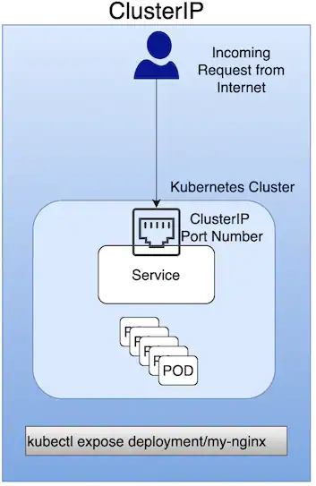
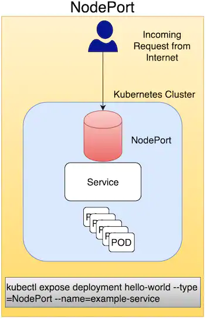
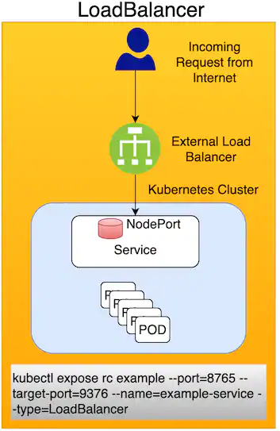
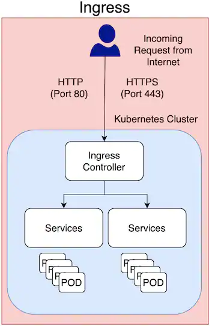

# Kubernetes Ingress 是什么？
**Kubernetes Ingress 是一个 API 对象，它提供路由规则来管理外部用户对 Kubernetes 集群内的服务的访问**。

在本文中，我们就爱你改查看为什么以及如何暴露一个应用到你的Kubernetes集群之外，有哪些可选的方法，以及在哪些场景下Kubernetes Ingress 是最合适的。

本文假设你对 Kubernetes 由基本的了解，但如果你需要更多的信息，可以试试下面的资源：
[What is Kubernetes?](https://www.ibm.com/cloud/learn/kubernetes)
[Kubernetes Clusters: Architecture for Rapid, Controlled Cloud App Delivery](https://www.ibm.com/cloud/blog/kubernetes-clusters-architecture-for-rapid-controlled-cloud-app-delivery)
[Kubernetes Explained: Watch the video](https://www.youtube.com/embed/aSrqRSk43lY)
## 暴露部署在 Kubernetes 中的应用的选项
有几种方式可将你的应用暴露到Kubernetes集群之外，你会基于你的特殊用例选择一个合适的。

本文中我们讲将比较四种方式：**ClusterIP, NodePort, LoadBalancer, 和 Ingress**。每一种都提供了暴露服务的方式，适用于不同的情况。一个服务本质是你的应用的前端，它自动将流量平均路由到可用的 Pod 上。服务作为一个网络服务，是一种将运行于一系列 Pod 上的应用导出的一种抽象方式。Pod 是不可变的，这意味着当它们死亡时，它们并不会复活。一旦一个 Pod 死亡，Kubernetes集群将会在同一个节点或一个新结点上创建一个新的 Pod。

就像  pods 和 deployments一样，services 也是 Kubernetes 的资源。一个服务提供了从 Kubernetes 集群外部的一个单点访问，允许你动态访问一组副本 Pod。

对一个 Kubernetes 集群内部的内部应用访问，**ClusterIP** 是更好的选择。它是 Kubernetes 的默认设置，并使用一个内部 IP 地址来访问服务。 

要暴露服务给外部网络访问，odePort, LoadBalancer, 和 Ingress 是可能的选项。我们将首先查看 Ingress，本文稍后我们将比较服务。
## 什么是 Kubernetes Ingress， 为什么它有用？
Kubernetes Ingress 是一个 API 对象，它提供路由规则来管理外部用户对 Kubernetes 集群内的服务的访问，典型地通过 HTTPS/HTTP。利用 Ingress，你可以很容易地制定流量路由规则，而不需要创建一大堆负载均衡器或在节点上暴露每一个服务。这使它成为产品环境使用的最佳选择。

在产品环境中，通常你需要基于内容的路由，支持多种协议及认证。Ingress 允许你在进群内配置和管理这些能力。

Ingress 由一个 Ingress API 对象以及一个 Ingress Controller（控制器）构成。正如我们谈到过的，Kubernetes Ingress 是一个 API 对象，它描述了导出到 Kubernetes 集群外部的服务的期待状态。一个 Ingress 控制器是非常关键的，因为它是 Ingress API 的实际实现。一个 Ingress 控制器读取并处理 Ingress 资源信息，通常在 Kubernetes 集群内以 Pod 的形式运行。

一个 Ingress 提供了下面这些：
- 对部署于 Kubernetes 集群内的应用的外部可访问 URL
- 基于命名的虚拟主机和基于地址（URI）的路由支持
- 负载均衡规则和流量，以及 SSL 终止

对 Kubernetes Ingress 的一个快速可视化概览，参考下面的视频：[视频](https://www.youtube.com/embed/NPFbYpb0I7w)
## 什么是 Ingress Controller？
如果Kubernetes Ingress 是一个 API 对象，它提供路由规则来管理外部用户对服务的访问，那么 Ingress控制器就是 Ingress API 的实际实现。Ingress控制器通常是一个路由外部流量到你的Kubernetes 集群的一个负载均衡器，用于负责 L4-L7 网络服务。

第四层（L4）指的是OSI网络栈的连接层，外部连接以轮询的方式负载均衡到所有 Pods。第七层（L7）指的是OSI网络栈的应用层，外部连接基于请求被负载均衡到 Pods。L7通常被优先选择，但你应该选择一个 Ingress 控制器来满足你的负载均衡和路由需求。

Ingress 控制器负责读取 Ingress 资源信息并据此处理数据。下面是一个示例 Ingress 资源：
```
apiVersion: networking.k8s.io/v1beta1
kind: Ingress
spec:
  backend:
    serviceName: ServiceName
    servicePort: <Port Number>
```
类似地，如果 Kubernetes Ingress 是一个计算机，那么 Ingress 控制器就是一个使用这个计算机并采取行动的程序员。更进一步，Ingress 规则相当于管理人员，它指导程序员利用计算机完成工作。Ingress 规则是一套处理输入HTTP流量的规则，一个没有任何规则的 Ingress 将把流浪发送到一个单一的默认后端服务上。

深入些看，Ingress 控制器是一个运行在 Kubernetes 集群里的应用，根据 Ingress 资源配置了 HTTP 负载均衡器。负载均衡器可以是一个运行在集群内的软件负载均衡器，或者是一个运行于外部的硬件或云负载均衡器。不同的负载均衡器需要不同的 Ingress 控制器实现。

市场上有不同的 Ingress 控制器可用，选择一个合适的来管理进入你的 Kubernetes 集群流量和负载是非常重要的。
## Ingress vs. ClusterIP vs. NodePort vs. LoadBalancer
Ingress, ClusterIP, NodePort, 和 LoadBalancer 都是将外部流量导入集群内部的方式，但每一种工作方式都不同。让我们看看它们是如何工作的，以及什么时候使用它们。
### ClusterIP
ClusterIP 是内部服务访问的优先选项，它使用一个内部 IP 来访问服务。ClusterIP 作为最佳选择的例子包括在开发或测试中调试服务，内部流量以及仪表板。


### NodePort
一个 NodePort 是一个[虚拟机](https://www.ibm.com/cloud/learn/virtual-machines)，用于在一个静态端口上暴露服务。它主要用于在非产品环境里（事实上，产品环境不推荐使用）导出服务。举个例子，一个 NodePort 用以导出一个单一服务（没有多个服务的负载均衡需求）：


### LoadBalancer
这个方法是用一个外部负载均衡器来导出服务到 Internet。 你可以在产品环境使用 LoadBalancer，但经常 Ingress 更被推荐。


### Ingress
Ingress 是你能够加强进入一个单一资源的流量的路由规则，并作为 Kubernetes 集群的一部分运行。Kubernetes Ingress 在产品环境中通常是导出服务的首选，其主要原因如下：
- 流量路由由 Ingress 资源定义的规则控制
- Ingress 作为 Kubernetes 集群的一部分以 Pod 的形式运行
- 一个外部负载均衡器很贵，并且你需要在 Kubernetes 集群之外管理它。Kubernetes Ingress 则在集群之内管理。

 


在产品环境中，典型地你使用 Ingress 来导出应用到 Internet。应用可以从 Internet 通过端口 80 (HTTP) 或 443 (HTTPS) 访问，而且 Ingress 是一个对象，它允许你从 Kubernetes 集群外部访问你的Kubernetes 服务。
## 总结
Kubernetes Ingress API 通过到一个单一服务的路由规则把你部署在 Kubernetes 集群内部的应用导出到 Internet。为了实现 Ingress，你需要在你的集群里配置一个 Ingress 控制器--它负责处理 Ingress 资源信息并允许基于 Ingress 规则的流量。基于上面的指南选择正确的服务及合适的配置来导出你的应用到 Internet 非常重要。

## Reference
- [What is Kubernetes Ingress?](https://www.ibm.com/cloud/blog/kubernetes-ingress)