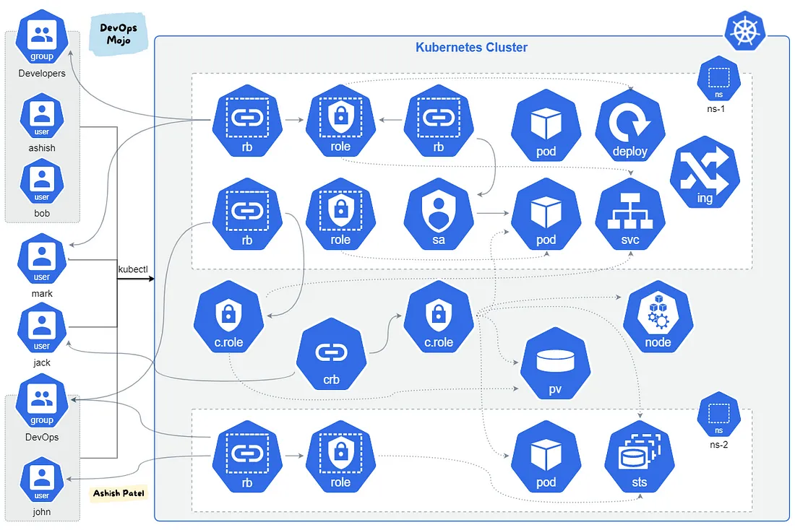

## Kubernetes — 基于角色的访问控制 (RBAC)概览

Kubernetes — 基于角色的访问控制 - 包括 `Role`, `ClusterRole`, `RoleBinding`, 和 `ClusterRoleBinding`。



TL;DR

基于角色的访问控制（RBAC）是一种授权用户访问 `Kubernetes API` 资源的方式。RBAC 是一种安全设计，它基于用户持有的角色限制对 Kubernetes 资源的访问。

配置 RBAC 的 API 对象包括：`Role`, `ClusterRole`, `RoleBinding` 和 `ClusterRoleBinding`。`Role/ClusterRole` 仅仅告诉可以做什么，但谁可以做这些在 `RoleBinding/ClusterRoleBinding` 中定义。

### 1. 角色（Role）

- 角色定义了可对 Kubernetes 资源做些什么。
- 角色包含了一条或多条规则它（们）代表了一套权限。
- 权限是添加性（additive）的，没有拒绝（deny）权限。
- 角色有命名空间，意味着权限工作于一个命名空间的限制内。如果没有显式指定，它默认为 `default` 命名空间。
- 角色被创建后，你通过创建一个角色绑定（RoleBinding）将它指定给一个用户或一组用户。

#### 示例

下面是一个定义在 “default” 命名空间的角色定义，它可被用于授予对 Pods 的读权限。

```
apiVersion: rbac.authorization.k8s.io/v1
kind: Role
metadata:
  namespace: default
  name: pod-reader
rules:
- apiGroups: [""] # "" indicates the core API group
  resources: ["pods"]
  verbs: ["get", "watch", "list"]
```

### 2. 集群角色（ClusterRole）

- 集群角色工作方式与集群一样，但它们适用于集群整体。
- 集群角色不与一个特定命名空间绑定。集群角色可以跨越一个命名空间或所有命名空间授予访问权限。
- 集群角色被创建后，你通过创建一个角色绑定（RoleBinding）或一个集群角色绑定（ClusterRoleBinding）将它指定给一个用户或一组用户。
- 集群角色典型地被用于服务账户

由于集群角色是集群范围的，你可以使用集群角色控制对各种不同资源的访问，其访问范围比角色大。

- 集群范围资源（如：Nodes, PersistentVolumes）
- 非资源端点（如 /healthz）
- 命名空间资源（如，跨整个集群的 Pods），跨所有命名空间的资源

默认集群角色：

- cluster-admin: 集群范围超级用户
- admin: 在一个命名空间拥有全部权限
- edit: 在一个命名空间内的读写权限
- view: 在一个命名空间内的只读权限

#### 示例

下面是一个集群角色的例子，它可用于授予对任意特定命名空间或所有命名空间里（依赖于它如何绑定）的 `secrets` 的读权限：

```
apiVersion: rbac.authorization.k8s.io/v1
kind: ClusterRole
metadata:
  # "namespace" omitted since ClusterRoles are not namespaced
  name: secret-reader
rules:
- apiGroups: [""]
  #
  # at the HTTP level, the name of the resource for accessing Secret
  # objects is "secrets"
  resources: ["secrets"]
  verbs: ["get", "watch", "list"]
```

### 3. 角色绑定（RoleBinding）

- 角色绑定授予对一个主体的权限。
- 角色绑定持有一系列主体（用户，组及服务账号），并持有对授予权限的引用。
- 角色及角色绑定适用于命名空间范畴。
- 角色绑定可引用同一命名空间里的任意角色。
- 一旦你创建了一个绑定，你就不能改变它引用的角色和集群角色。如果你确实想改变一个绑定的 `roleRef`，你需要删除一个绑定对象并创建一个替代。

集群角色和角色绑定用于提供对超过一个命名空间或整个集群的访问。

#### 示例

下面是一个角色绑定的例子，它在 “default” 命名空间里将 “pod-reader” 角色授予用户 “jane”。这允许 “jane” 去读取 “default” 命名空间里的 `Pods` ：

```
apiVersion: rbac.authorization.k8s.io/v1
# This role binding allows "jane" to read pods in the "default" namespace.
# You need to already have a Role named "pod-reader" in that namespace.
kind: RoleBinding
metadata:
  name: read-pods
  namespace: default
subjects:
# You can specify more than one "subject"
- kind: User
  name: jane # "name" is case sensitive
  apiGroup: rbac.authorization.k8s.io
roleRef:
  # "roleRef" specifies the binding to a Role / ClusterRole
  kind: Role #this must be Role or ClusterRole
  name: pod-reader # this must match the name of the Role or ClusterRole you wish to bind to
  apiGroup: rbac.authorization.k8s.io
```

角色绑定也可以引用一个集群角色来将集群角色定义的权限授予给角色绑定命名空间里的资源。这种类型的引用让你定义一套公共跨越集群的角色，然后在多个命名空间里复用它们。

```
apiVersion: rbac.authorization.k8s.io/v1
# This role binding allows "dave" to read secrets in the "development" namespace.
# You need to already have a ClusterRole named "secret-reader".
kind: RoleBinding
metadata:
  name: read-secrets
  #
  # The namespace of the RoleBinding determines where the permissions are granted.
  # This only grants permissions within the "development" namespace.
  namespace: development
subjects:
- kind: User
  name: dave # Name is case sensitive
  apiGroup: rbac.authorization.k8s.io
roleRef:
  kind: ClusterRole
  name: secret-reader
  apiGroup: rbac.authorization.k8s.io
```

### 4. 集群角色绑定（ClusterRoleBinding）

- 集群角色和集群角色绑定的功能与角色和角色绑定一样，除了它们拥有更大的范畴。
- 角色绑定在一个特定命名空间里授权，集群角色绑定可在集群范围和多个命名空间里授权。
- 集群角色绑定是将一个集群角色与一个主体（用户，组或服务账号）绑定或关联。

#### 示例

为了跨越整个集群授权，你可以使用集群角色绑定。下面的集群角色绑定允许组 “manager” 中的任何用户读取任意命名空间里的 `secrets`。

```
apiVersion: rbac.authorization.k8s.io/v1
# This cluster role binding allows anyone in the "manager" group to read secrets in any namespace.
kind: ClusterRoleBinding
metadata:
  name: read-secrets-global
subjects:
- kind: Group
  name: manager # Name is case sensitive
  apiGroup: rbac.authorization.k8s.io
roleRef:
  kind: ClusterRole
  name: secret-reader
  apiGroup: rbac.authorization.k8s.io
```

### 5. RBAC 定义中的元素

#### 5.1 主体（Subjects）

主体不是什么新鲜玩意，它就是一组尝试调用 `Kubernetes API` 的用户，服务和组织。它定义了一个用户，服务，组织可以执行什么操作。

- 用户：这些是全局性的，意味着驻留于集群之外的人员和进程
- 组：用户集合
- 服务账号：Kubernetes 使用服务账号来认证并授权 Pods 对 `Kubernetes API server` 的请求。这些是命名空间范围里的，意味着在集群内的在 Pods 里运行的进程。

#### 5.2 动词（Verbs）

能够作用于资源之上的操作集合被称为动词。例如，不同的动词包括 `get, watch, create, delete`。最终它们都被归之为 `Create, Read, Update 或 Delete (CRUD)` 操作。

#### 5.3 资源（Resources）

集群内可用的 `Kubernetes API` 对象的集合被称之为资源。例如，`Pods`, `Deployments`, `Services`, `Nodes`, `PersistentVolumes` 等。

> 利用 RBAC，集群管理员可以指定应用访问，添加、移除权限，并基于用户角色限制资源可见性。

### 6. 用例：什么时候该使用什么

- 在单一命名空间里的安全问题使用`角色`和`角色绑定`
- 多个或所有命名空间里的安全问题使用`集群角色`和`角色绑定`
- 所有命名空间或集群范围里的安全问题使用`集群角色`和`集群角色绑定`

> 如果你想在一个命名空间里定义也各角色，使用`角色`；如果你想定义一个集群范围的角色，使用`集群角色`。

### 7. 总结

在 Kubernetes 中 RBAC 是一种机制，它可以让你配置细粒度或特定权限集合，它们定义了一个给定用户或一组用户如何与一个集群非为或一个集群命名空间范围里的任意 Kubernetes 对象交互。

### Reference

- [Kubernetes — Role-Based Access Control (RBAC) Overview](https://medium.com/devops-mojo/kubernetes-role-based-access-control-rbac-overview-introduction-rbac-with-kubernetes-what-is-2004d13195df)