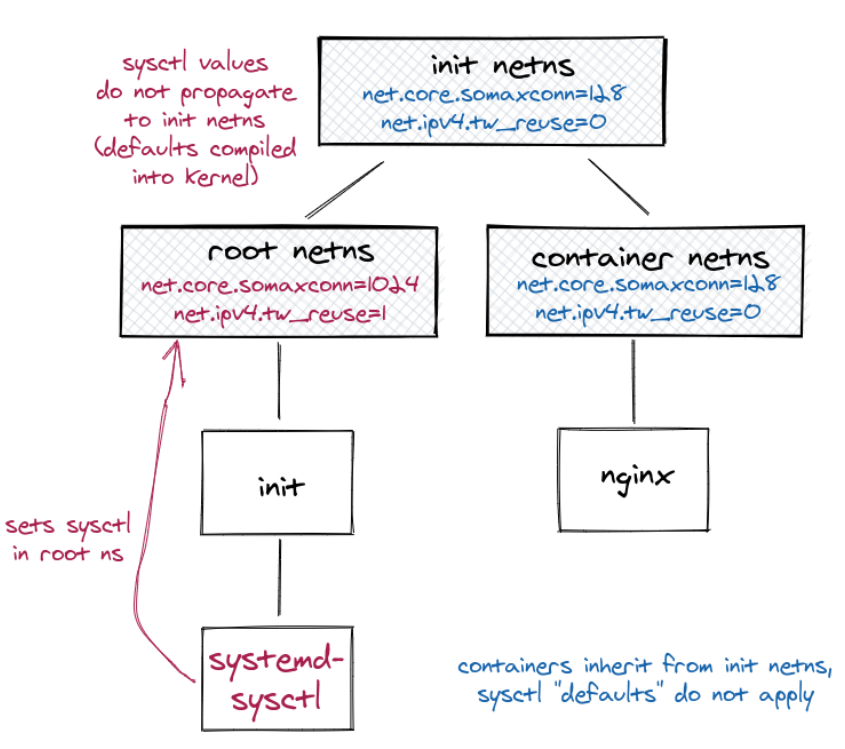

# Tuning network sysctls in Docker and Kubernetes
Docker 和 Kubernetes 用于容纳各种各样的应用--对网络栈的需求也是很广泛。Linux 允许通过网络栈中的参数对内核调优：缓存大小，连接限制等。

容器为内核调优增加了更多的复杂性：有些参数对整个系统有效，其它的是名字空间的，比如每个容器（或者Kubernetes pod）拥有自己的配置。Kubernetes 进一步区分了它们：安全 sysctl 是名字空间化的，无论他们如何设置，它们对于邻居都没有什么影响；非安全的sysctls 可能拥有意料之外的效果，比如在增加连接参数的同时扩展内存使用--可能会潜在地冻结或者过载系统。

特别地直接与 Internet 连接的应用可从中受益：[更好的防护以防止 DOS 攻击](https://blog.cloudflare.com/syn-packet-handling-in-the-wild/), [为高负载微调](https://medium.com/@pawilon/tuning-your-linux-kernel-and-haproxy-instance-for-high-loads-1a2105ea553e)；[允许大型交换网络](https://blog.cloudflare.com/syn-packet-handling-in-the-wild/)，低延迟等。注意这些目标的设置可能会导致冲突，而一个合适的讨论很容易就需要你在Linux内核的工作方式上深入更多（请参阅 Vincent Bernart 的[在繁忙服务器上TCP TIME_WAIT状态的讨论](https://vincent.bernat.ch/en/blog/2014-tcp-time-wait-state-linux)）。关于是否调优 sysctls （或调优什么）的建议远非本文的讨论主题。

好消息是：你通常不需要关心这些，因为默认设置已经足够，在平均用例下工作得很好。
## 在容器化的世界里配置网络 sysctls 
坏消息是为网络 sysctls 设置默认值通常不可能，并且通常设置 sysctls 并非易事。许多Kubernetes 调优指南犯了这个错误（它们建议在 /etc/sysctl.d 中设置）。奇怪地是，很少有人注意到--也许是默认设置在大多数情况下工作得很好。

**设置内核范围的设置可以像期待的那样工作**--它们效果一样无论应用是否是一个容器。这些是通常你并不想允许一个容器设置的，因为（如果设置）系统行为可能依据某个容器是否启动（以及顺序）而改变。

当然，**容器化的sysctls会使得情况更为复杂**。不想大多数其它Linux名字空间，网络名字空间并不从父名字空间哪里继承设置。但编译好的（compiled-in）内核默认值例外。在这个集群启用 `tw_reuse` （有些应用会从此受益，其它的也不会有损失）并不像你在一个经典的Linux服务器上配置/etc/sysctl.d那样简单，因为容器和pod的网络并不会继承新值。



改变这个行为为从父名字空间继承设置的[讨论和建议已经在一个单行pull请求中设计，但由于兼容性的源被拒绝了](https://lore.kernel.org/patchwork/patch/649250/)。
### 在 Docker 容器上设置sysctls 
Docker 允许在创建容器时配置大多数名字空间化的 sysctls 。设置上面提到的`tw_reuse`是相当直接的，在 `docker run` 中添加 `--sysctl` 选项：
```
docker run \
  --sysctl net.core.somaxconn=1024 \
  --sysctl net.ipv4.tw_reuse=1 \
  someimage
```
类似地，比较新的 Docker 支持在docker-compose 和 swarm 模式下的[Compose文件形式的sysctls](https://docs.docker.com/compose/compose-file/#sysctls)。
```
sysctls:
  net.core.somaxconn: 1024
  net.ipv4.tw_reuse: 1
```
### 在Kubernetes pod上设置sysctls
Kubernetes 集群在利用特权调优 sysctls 时有更多限制，尤其在企业级环境中使用时。
#### 老旧形式：特权初始化容器（init containers）
在 Kubernetes 1.11前，没有方法设置sysctls ，除了在pod启动时运行 `sysctl -w` 命令。这对非root用户（non-root）是不允许的。一种常见做法是使用特权root `initContainer`：
```
[...]
initContainers:
- name: init-sysctl
    image: busybox
    command:
    - sysctl
    - -w
    - net.core.somaxconn=1024
    - net.ipv4.tw_reuse=1
    securityContext:
      privileged: true
      runAsUser: 0
      runAsNonRoot: False
[...]
```
**这不再是推荐的方式**，并且当特权或root容器不被允许时或会失败。它允许设置任意 sysctls，也包括非名字空间化的 sysctls。 在企业级环境中，这可能会被通过pod安全策略禁止。
#### 安全和非安全 sysctls
Kubernetes 1.11 引入了安全和非安全 sysctls 的概念，它们可在pod  spec中配置：
```
apiVersion: v1
kind: Pod
metadata:
  name: sysctl-example
spec:
  securityContext:
    sysctls:
    - name: net.core.somaxconn
      value: "1024"
    - name: net.ipv4.tw_reuse
      value: "1"
  [...]
```
> **提示**：sysctl 值期待是字符串，因此在YAML中数字必须被用引号包裹。

这并不需要特权 root 容器，但只有极少sysctls 允许通过这种方式修改，除非集群操作员添加更多。在本文开头提到的安全sysctls 默认是允许的：
- kernel.shm_rmid_forced
- net.ipv4.ip_local_port_range
- net.ipv4.tcp_syncookies
- net.ipv4.ping_group_id

允许更深入的sysctls（就像在例子中提到的）需要[在kubelet配置和在pod安全策略上开启](https://kubernetes.io/docs/tasks/administer-cluster/sysctl-cluster/#enabling-unsafe-sysctls)。阅读你的 Kubernetes 分发版或安装文档去搜素如何添加。一个允许上面的sysctls的pod安全策略例子（不是很完整）如下：
```
apiVersion: policy/v1beta1
kind: PodSecurityPolicy
metadata:
  name: sysctl-psp
spec:
  allowedUnsafeSysctls:
  - net.core.somaxconn
  - net.ipv4.tw_reuse
[...]
```
* 是允许的，sysctls 的使用可以通过特定策略被限定在给定的用户组或Kubernetes 名字空间。只有名字空间化的 sysctls 才能以这种方式配置。

## Reference
- [Tuning network sysctls in Docker and Kubernetes](https://medium.com/daimler-tss-tech/tuning-network-sysctls-in-docker-and-kubernetes-766e05da4ff2)
- [在 Kubernetes 集群中使用 sysctl](https://kubernetes.io/zh/docs/tasks/administer-cluster/sysctl-cluster/)