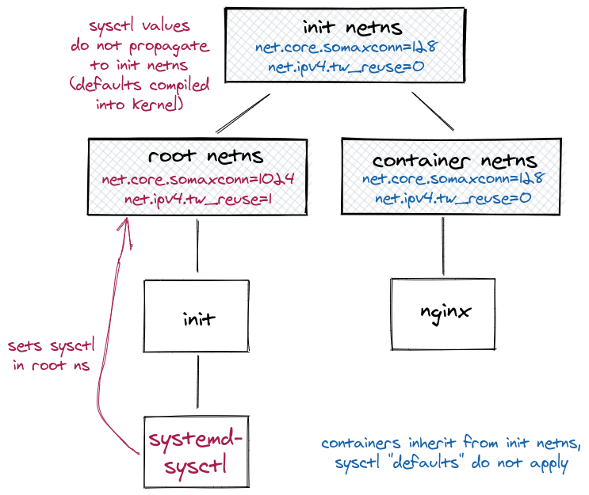

# Tuning network sysctls in Docker and Kubernetes
Docker 和 Kubernetes 用于容纳各种各样的应用--对网络栈的需求也是很广泛。Linux 允许通过网络栈中的参数对内核调优：缓存大小，连接限制等。

容器为内核调优增加了更多的复杂性：有些参数对整个系统有效，其它的是名字空间的，比如每个容器（或者Kubernetes pod）拥有自己的配置。Kubernetes 进一步区分了它们：安全 sysctl 是名字空间化的，无论他们如何设置，它们对于邻居都没有什么影响；非安全的sysctls 可能拥有意料之外的效果，比如在增加连接参数的同时扩展内存使用--可能会潜在地冻结或者过载系统。

特别地直接与 Internet 连接的应用可从中受益：[更好的防护以防止 DOS 攻击](https://blog.cloudflare.com/syn-packet-handling-in-the-wild/), [为高负载微调](https://medium.com/@pawilon/tuning-your-linux-kernel-and-haproxy-instance-for-high-loads-1a2105ea553e)；[允许大型交换网络](https://blog.cloudflare.com/syn-packet-handling-in-the-wild/)，低延迟等。注意这些目标的设置可能会导致冲突，而一个合适的讨论很容易就需要你在Linux内核的工作方式上深入更多（请参阅 Vincent Bernart 的[在繁忙服务器上TCP TIME_WAIT状态的讨论](https://vincent.bernat.ch/en/blog/2014-tcp-time-wait-state-linux)）。关于是否调优 sysctls （或调优什么）的建议远非本文的讨论主题。

好消息是：你通常不需要关心这些，因为默认设置已经足够，在平均用例下工作得很好。
## 在容器化的十几里配置网络 sysctls 
坏消息是为网络 sysctls 设置默认值通常不可能，并且通常设置 sysctls 并非易事。许多Kubernetes 调优指南犯了这个错误（它们建议在 /etc/sysctl.d 中设置）。奇怪地是，很少有人注意到--也许是默认设置在大多数情况下工作得很好。

**设置内核范围的设置可以像期待的那样工作**--它们效果一样无论应用是否是一个容器。这些是通常你并不想允许一个容器设置的，因为（如果设置）系统行为可能依据某个容器是否启动（以及顺序）而改变。

当然，**容器化的sysctls会使得情况更为复杂**。不想大多数其它Linux名字空间，网络名字空间并不从父名字空间哪里继承设置。但编译好的（compiled-in）内核默认值例外。在这个集群启用 tw_reuse （有些应用会从此受益，其它的也不会有损失）并不像你在一个经典的Linux服务器上配置/etc/sysctl.d那样简单，因为容器和pod的网络并不会继承新值。

改变这个行为为从父名字空间继承设置的[讨论和建议已经在一个单行pull请求中设计，但由于兼容性的源被拒绝了](https://lore.kernel.org/patchwork/patch/649250/)。

## Reference
- [Tuning network sysctls in Docker and Kubernetes](https://medium.com/daimler-tss-tech/tuning-network-sysctls-in-docker-and-kubernetes-766e05da4ff2)
- [在 Kubernetes 集群中使用 sysctl](https://kubernetes.io/zh/docs/tasks/administer-cluster/sysctl-cluster/)