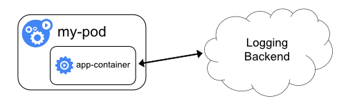

## 一. 系统日志
应用日志可以让你了解应用内部的运行状况。日志对调试问题和监控集群活动非常有用。 大部分现代化应用都有某种日志记录机制。同样地，容器引擎也被设计成支持日志记录。 针对容器化应用，最简单且最广泛采用的日志记录方式就是写入标准输出和标准错误流。

但是，由容器引擎或运行时提供的原生功能通常不足以构成完整的日志记录方案。例如，如果发生容器崩溃、Pod 被逐出或节点宕机等情况，你可能想访问应用日志。在集群中，日志应该具有独立的存储和生命周期，与节点、Pod 或容器的生命周期相独立。这个概念叫集群级的日志（cluster-level logging）。

集群级日志架构需要一个独立的后端用来存储、分析和查询日志。 Kubernetes 并不为日志数据提供原生的存储解决方案。 相反，有很多现成的日志方案可以集成到 Kubernetes 中。下面各节描述如何在节点上处理和存储日志。
### Kubernetes 中的基本日志记录
这里的示例使用包含一个容器的 Pod 规约，每秒钟向标准输出写入数据。
```
apiVersion: v1
kind: Pod
metadata:
  name: counter
spec:
  containers:
  - name: count
    image: busybox
    args: [/bin/sh, -c,
            'i=0; while true; do echo "$i: $(date)"; i=$((i+1)); sleep 1; done']
```
用下面的命令运行 Pod：
```
kubectl apply -f https://k8s.io/examples/debug/counter-pod.yaml
```
输出结果为：
```
pod/counter created
```
像下面这样，使用 kubectl logs 命令获取日志:
```
kubectl logs counter
```
输出结果为：
```
0: Mon Jan  1 00:00:00 UTC 2001
1: Mon Jan  1 00:00:01 UTC 2001
2: Mon Jan  1 00:00:02 UTC 2001
...
```
你可以使用命令 `kubectl logs --previous` 检索之前容器实例的日志。 如果 Pod 中有多个容器，你应该为该命令附加容器名以访问对应容器的日志。 详见 [kubectl logs 文档](https://kubernetes.io/docs/reference/generated/kubectl/kubectl-commands#logs)。
### 节点级日志记录（Logging at the node level）


容器化应用写入 `stdout` 和 `stderr` 的任何数据，都会被容器引擎捕获并被重定向到某个位置。例如，Docker 容器引擎将这两个输出流重定向到某个`日志驱动（Logging Driver）`，该日志驱动在 Kubernetes 中配置为以 `JSON` 格式写入文件。
> **说明**： Docker JSON 日志驱动将日志的每一行当作一条独立的消息。 该日志驱动不直接支持多行消息。你需要在日志代理级别或更高级别处理多行消息。

默认情况下，如果容器重启，kubelet 会保留被终止的容器日志。如果 Pod 在工作节点被驱逐，该 Pod 中所有的容器也会被驱逐，包括容器日志。

节点级日志记录中，需要重点考虑实现日志的轮转，以此来保证日志不会消耗节点上全部可用空间。 Kubernetes 并不负责轮转日志，而是通过部署工具建立一个解决问题的方案。例如，在用 `kube-up.sh` 部署的 Kubernetes 集群中，存在一个 [logrotate](https://linux.die.net/man/8/logrotate)，每小时运行一次。你也可以设置容器运行时来自动地轮转应用日志。

例如，你可以找到关于 `kube-up.sh` 为 `GCP` 环境的 `COS` 镜像设置日志的详细信息， 脚本为 [configure-helper 脚本](https://github.com/kubernetes/kubernetes/blob/master/cluster/gce/gci/configure-helper.sh)。

当使用某 CRI 容器运行时 时，kubelet 要负责对日志进行轮换，并管理日志目录的结构。kubelet 将此信息发送给 CRI 容器运行时，后者将容器日志写入到指定的位置。在 [kubelet 配置文件](https://kubernetes.io/docs/tasks/administer-cluster/kubelet-config-file/) 中的两个 kubelet 参数 `containerLogMaxSize` 和 `containerLogMaxFiles` 可以用来配置每个日志文件的最大长度和每个容器可以生成的日志文件个数上限。

当运行 `kubectl logs` 时， 节点上的 kubelet 处理该请求并直接读取日志文件，同时在响应中返回日志文件内容。
> 说明： 如果有外部系统执行日志轮转或者使用了 CRI 容器运行时，那么 kubectl logs 仅可查询到最新的日志内容。 比如，对于一个 `10MB` 大小的文件，通过 `logrotate` 执行轮转后生成两个文件， 一个 `10MB 大小`，一个为空，`kubectl logs` 返回最新的日志文件，而该日志文件在这个例子中为空。
#### 系统组件日志
系统组件有两种类型：在容器中运行的和不在容器中运行的。例如：
- 在容器中运行的 `kube-scheduler` 和 `kube-proxy`。
- 不在容器中运行的 kubelet 和容器运行时。

在使用 systemd 机制的服务器上，kubelet 和容器容器运行时将日志写入到 `journald` 中。如果没有 systemd，它们将日志写入到 `/var/log` 目录下的 `.log` 文件中。 容器中的系统组件通常将日志写到 `/var/log` 目录，绕过了默认的日志机制。 他们使用 [klog](https://github.com/kubernetes/klog) 日志库。 你可以在[日志开发文档](https://github.com/kubernetes/community/blob/master/contributors/devel/sig-instrumentation/logging.md)找到这些组件的日志告警级别约定。

和容器日志类似，`/var/log` 目录中的系统组件日志也应该被轮转。 通过脚本 `kube-up.sh` 启动的 Kubernetes 集群中，日志被工具 `logrotate` 执行每日轮转，或者日志大小超过 `100MB` 时触发轮转。
### 集群级日志架构
虽然Kubernetes没有为集群级日志记录提供原生的解决方案，但你可以考虑几种常见的方法。 以下是一些选项：
- 使用在每个节点上运行的节点级日志记录代理。
- 在应用程序的 Pod 中，包含专门记录日志的边车（Sidecar）容器。
- 将日志直接从应用程序中推送到日志记录后端。
#### 使用节点级日志代理


你可以通过在每个节点上使用 节点级的日志记录代理 来实现群集级日志记录。 日志记录代理是一种用于暴露日志或将日志推送到后端的专用工具。通常，日志记录代理程序是一个容器，它可以访问包含该节点上所有应用程序容器的日志文件的目录。

由于日志记录代理必须在每个节点上运行，通常可以用 `DaemonSet` 的形式运行该代理。 节点级日志在每个节点上仅创建一个代理，不需要对节点上的应用做修改。

容器向标准输出和标准错误输出写出数据，但在格式上并不统一。节点级代理 收集这些日志并将其进行转发以完成汇总。
#### 使用带有日志代理的 边车容器
你可以通过以下方式之一使用边车（Sidecar）容器：
- 边车容器将应用程序日志传送到自己的标准输出。
- 边车容器运行一个日志代理，配置该日志代理以便从应用容器收集日志。
##### 传输数据流的 sidecar 容器


利用边车容器向自己的 `stdout` 和 `stderr` 传输流的方式， 你就可以利用每个节点上的 kubelet 和日志代理来处理日志。 边车容器从文件、套接字或 `journald` 读取日志。 每个边车容器向自己的 `stdout` 和 `stderr` 流中输出日志。

这种方法允许你将日志流从应用程序的不同部分分离开，其中一些可能缺乏对写入 `stdout` 或 `stderr` 的支持。重定向日志背后的逻辑是最小的，因此它的开销几乎可以忽略不计。另外，因为 `stdout`、`stderr` 由 kubelet 处理，你可以使用内置的工具 `kubectl logs`。

例如，某 Pod 中运行一个容器，该容器向两个文件写不同格式的日志。 下面是这个 pod 的配置文件：
```
apiVersion: v1
kind: Pod
metadata:
  name: counter
spec:
  containers:
  - name: count
    image: busybox
    args:
    - /bin/sh
    - -c
    - >
      i=0;
      while true;
      do
        echo "$i: $(date)" >> /var/log/1.log;
        echo "$(date) INFO $i" >> /var/log/2.log;
        i=$((i+1));
        sleep 1;
      done      
    volumeMounts:
    - name: varlog
      mountPath: /var/log
  volumes:
  - name: varlog
    emptyDir: {}
```
不建议在同一个日志流中写入不同格式的日志条目，即使你成功地将其重定向到容器的 `stdout` 流。相反，你可以创建两个边车容器。每个边车容器可以从共享卷跟踪特定的日志文件，并将文件内容重定向到各自的 `stdout` 流。

下面是运行两个边车容器的 Pod 的配置文件：
```
apiVersion: v1
kind: Pod
metadata:
  name: counter
spec:
  containers:
  - name: count
    image: busybox
    args:
    - /bin/sh
    - -c
    - >
      i=0;
      while true;
      do
        echo "$i: $(date)" >> /var/log/1.log;
        echo "$(date) INFO $i" >> /var/log/2.log;
        i=$((i+1));
        sleep 1;
      done      
    volumeMounts:
    - name: varlog
      mountPath: /var/log
  - name: count-log-1
    image: busybox
    args: [/bin/sh, -c, 'tail -n+1 -f /var/log/1.log']
    volumeMounts:
    - name: varlog
      mountPath: /var/log
  - name: count-log-2
    image: busybox
    args: [/bin/sh, -c, 'tail -n+1 -f /var/log/2.log']
    volumeMounts:
    - name: varlog
      mountPath: /var/log
  volumes:
  - name: varlog
    emptyDir: {}
```
现在当你运行这个 Pod 时，你可以运行如下命令分别访问每个日志流：
```
kubectl logs counter count-log-1
```
输出为：
```
0: Mon Jan  1 00:00:00 UTC 2001
1: Mon Jan  1 00:00:01 UTC 2001
2: Mon Jan  1 00:00:02 UTC 2001
```

```
kubectl logs counter count-log-2
```
输出为：
```
Mon Jan  1 00:00:00 UTC 2001 INFO 0
Mon Jan  1 00:00:01 UTC 2001 INFO 1
Mon Jan  1 00:00:02 UTC 2001 INFO 2
...
```

集群中安装的节点级代理会自动获取这些日志流，而无需进一步配置。 如果你愿意，你也可以配置代理程序来解析源容器的日志行。

注意，尽管 `CPU` 和内存使用率都很低（以多个 CPU 毫核指标排序或者按内存的兆字节排序）， 向文件写日志然后输出到 `stdout` 流仍然会成倍地增加磁盘使用率。如果你的应用向单一文件写日志，通常最好设置 `/dev/stdout` 作为目标路径，而不是使用流式的边车容器方式。

应用本身如果不具备轮转日志文件的功能，可以通过边车容器实现。该方式的一个例子是运行一个小的、定期轮转日志的容器。 然而，还是推荐直接使用 `stdout` 和 `stderr`，将日志的轮转和保留策略 交给 `kubelet`。
##### 具有日志代理功能的边车容器


如果节点级日志记录代理程序对于你的场景来说不够灵活，你可以创建一个带有单独日志记录代理的边车容器，将代理程序专门配置为与你的应用程序一起运行。

> **说明**：在边车容器中使用日志代理会带来严重的资源损耗。 此外，你不能使用 `kubectl logs` 命令访问日志，因为日志并没有被 kubelet 管理。

下面是两个配置文件，可以用来实现一个带日志代理的边车容器。 第一个文件包含用来配置 `fluentd` 的 ConfigMap。
```
apiVersion: v1
kind: ConfigMap
metadata:
  name: fluentd-config
data:
  fluentd.conf: |
    <source>
      type tail
      format none
      path /var/log/1.log
      pos_file /var/log/1.log.pos
      tag count.format1
    </source>

    <source>
      type tail
      format none
      path /var/log/2.log
      pos_file /var/log/2.log.pos
      tag count.format2
    </source>

    <match **>
      type google_cloud
    </match>
```
> **说明**：要进一步了解如何配置 fluentd，请参考 fluentd 官方文档。

第二个文件描述了运行 fluentd 边车容器的 Pod 。 flutend 通过 Pod 的挂载卷获取它的配置数据。
```
apiVersion: v1
kind: Pod
metadata:
  name: counter
spec:
  containers:
  - name: count
    image: busybox
    args:
    - /bin/sh
    - -c
    - >
      i=0;
      while true;
      do
        echo "$i: $(date)" >> /var/log/1.log;
        echo "$(date) INFO $i" >> /var/log/2.log;
        i=$((i+1));
        sleep 1;
      done      
    volumeMounts:
    - name: varlog
      mountPath: /var/log
  - name: count-agent
    image: k8s.gcr.io/fluentd-gcp:1.30
    env:
    - name: FLUENTD_ARGS
      value: -c /etc/fluentd-config/fluentd.conf
    volumeMounts:
    - name: varlog
      mountPath: /var/log
    - name: config-volume
      mountPath: /etc/fluentd-config
  volumes:
  - name: varlog
    emptyDir: {}
  - name: config-volume
    configMap:
      name: fluentd-config
```
在示例配置中，你可以将 `fluentd` 替换为任何日志代理，从应用容器内的任何来源读取数据。
#### 从应用中直接暴露日志目录


从各个应用中直接暴露和推送日志数据的集群日志机制 已超出 Kubernetes 的范围。
## 二. 系统日志
系统组件的日志记录集群中发生的事件，这对于调试非常有用。 你可以配置日志的精细度，以展示更多或更少的细节。 日志可以是粗粒度的，如只显示组件内的错误， 也可以是细粒度的，如显示事件的每一个跟踪步骤（比如 HTTP 访问日志、pod 状态更新、控制器动作或调度器决策）。
### Klog
klog 是 Kubernetes 的日志库。[klog](https://github.com/kubernetes/klog) 为 Kubernetes 系统组件生成日志消息。

有关 klog 配置的更多信息，请参见[命令行工具参考](https://kubernetes.io/docs/reference/command-line-tools-reference/)。

Kubernetes 正在简化其组件日志设施的过程中。从 Kubernetes 1.23 开始，下面的命令行参数将被视为[废弃](https://github.com/kubernetes/enhancements/tree/master/keps/sig-instrumentation/2845-deprecate-klog-specific-flags-in-k8s-components)的，并将在未来的版本里移除：
- `--add-dir-header`
- `--alsologtostderr`
- `--log-backtrace-at`
- `--log-dir`
- `--log-file`
- `--log-file-max-size`
- `--logtostderr`
- `--one-output`
- `--skip-headers`
- `--skip-log-headers`
- `--stderrthreshold`

输出将总是被写到 stderr，无论其输出格式。但调用 Kubernetes 组件的组件可能会将输出重定向，这可能是一个 `POSIX shell` 或者一个工具如 `systemd`。

咋某些情况下，例如，一个 distroless 容器或者 Windows 系统服务，这些选项并可具备。这种情况下Kubernetes [kube-log-runner]二进制文件(https://github.com/kubernetes/kubernetes/blob/d2a8a81639fcff8d1221b900f66d28361a170654/staging/src/k8s.io/component-base/logs/kube-log-runner/README.md) 可被用作一个Kubernetes 组件的包装器来重定向输出。好几个 Kubernetes 基础镜像都包含预构建的二进制文件，命名如 `/go-runner` 并且在服务器和节点发不上可见 `kube-log-runner`。

下面的表格展示了对应 shell 重定向的 kube-log-runner 调用：
用法|POSIX shell (例如bash)|kube-log-runner <options> <cmd>
--------|--------|--------
合并标准输出和错误输出，写到标准输出|2>&1|kube-log-runner (default behavior)
重定向两者到一个文件|1>>/tmp/log 2>&1|kube-log-runner -log-file=/tmp/log
拷贝到日志文件和标准输出|2>&1 \| tee -a /tmp/log|kube-log-runner -log-file=/tmp/log -also-stdout
重定向标准输出到日志文件|>/tmp/log|kube-log-runner -log-file=/tmp/log -redirect-stderr=false
#### klog 输出
一个传统 klog 原生格式的示例如下：
```
I1025 00:15:15.525108       1 httplog.go:79] GET /api/v1/namespaces/kube-system/pods/metrics-server-v0.3.1-57c75779f-9p8wg: (1.512ms) 200 [pod_nanny/v0.0.0 (linux/amd64) kubernetes/$Format 10.56.1.19:51756]
```
消息字符串可能含有回车换行符：
```
I1025 00:15:15.525108       1 example.go:79] This is a message
which has a line break.
```
#### 结构化日志
> **警告**：到结构化日志消息的迁移是一个持续的过程。 在此版本中，并非所有日志消息都是结构化的。 解析日志文件时，你也必须要处理非结构化日志消息。
>
> 日志格式和值的序列化可能会发生变化。

结构化日志记录旨在日志消息中引入统一结构，以便以编程方式提取信息。你可以方便地用更小的开销来存储及处理结构化日志。产生日志消息的代码决定了它使用传统的非结构化的 klog 输出或结构化日志。


结构化日志消息的默认格式和文本一样，它与传统 klog 的格式后相兼容：
```
<klog header> "<message>" <key1>="<value1>" <key2>="<value2>" ...
```
实例：
```
I1025 00:15:15.525108       1 controller_utils.go:116] "Pod status updated" pod="kube-system/kubedns" status="ready"
```
字符串用引号括起。其它值用 `%+v` 格式化，[依赖于数据](https://github.com/kubernetes/kubernetes/issues/106428)日志消息可能会在下一行继续。
```
I1025 00:15:15.525108       1 example.go:116] "Example" data="This is text with a line break\nand \"quotation marks\"." someInt=1 someFloat=0.1 someStruct={StringField: First line,
second line.}
```
#### JSON 日志格式
> **警告**：JSON 输出并不支持太多标准 klog 参数。对于不受支持的 klog 参数的列表，请参见[命令行工具参考](https://kubernetes.io/docs/reference/command-line-tools-reference/)。
>
> 并不是所有日志都保证写成 JSON 格式（例如，在进程启动期间）。 如果你打算解析日志，请确保可以处理非 JSON 格式的日志行。
> 
> 字段名和 JSON 序列化可能会发生变化。

`--logging-format=json` 参数将日志格式从 klog 原生格式改为 `JSON` 格式。JSON 日志格式示例（美化输出）：
```
{
   "ts": 1580306777.04728,
   "v": 4,
   "msg": "Pod status updated",
   "pod":{
      "name": "nginx-1",
      "namespace": "default"
   },
   "status": "ready"
}
```
具有特殊意义的 key：
- `ts` - Unix 时间风格的时间戳（必选项，浮点值）
- `v` - 精细度（必选项，整数，默认值 0）
- `err` - 错误字符串（可选项，字符串）
- `msg` - 消息（必选项，字符串）

当前支持JSON格式的组件列表：
- [kube-controller-manager](https://kubernetes.io/docs/reference/generated/kube-controller-manager/)
- [kube-apiserver](https://kubernetes.io/zh/docs/reference/command-line-tools-reference/kube-apiserver/)
- [kube-scheduler](https://kubernetes.io/docs/reference/generated/kube-scheduler/)
- [kubelet](https://kubernetes.io/docs/reference/generated/kubelet)
#### 日志清理（Log sanitization）
> **警告**： 日志清理可能会导致大量的计算开销，因此不应启用在生产环境中。

`--experimental-logging-sanitization` 参数可用来启用 klog 清理过滤器。 如果启用后，将检查所有日志参数中是否有标记为敏感数据的字段（比如：密码，密钥，令牌），并且将阻止这些字段的记录。

当前支持日志清理的组件列表：
- kube-controller-manager
- kube-apiserver
- kube-scheduler
- kubelet
> 说明： 日志清理过滤器不会阻止用户工作负载日志泄漏敏感数据。
#### 日志精细度级别
参数 `-v` 控制日志的精细度。增大该值会增大日志事件的数量。 减小该值可以减小日志事件的数量。增大精细度会记录更多的不太严重的事件。精细度设置为 `0` 时只记录关键（critical）事件。
#### 日志位置
有两种类型的系统组件：运行在容器中的组件和不运行在容器中的组件。例如：
- Kubernetes 调度器和 kube-proxy 在容器中运行。
- kubelet 和容器运行时，例如 Docker，不在容器中运行。

在使用 systemd 的系统中，kubelet 和容器运行时写入 `journald`。 否则，日志写入 `/var/log` 目录下的 `.log` 文件中。容器中的系统组件总是绕过默认的日志记录机制，写入 `/var/log` 目录下的 `.log` 文件。与容器日志类似，你应该轮转 `/var/log` 目录下系统组件日志。在 `kube-up.sh` 脚本创建的 Kubernetes 集群中，日志轮转由 `logrotate` 工具配置。`logrotate` 工具，每天或者当日志大于 `100MB` 时，轮转日志。
## 三. 系统日志

### Reference
- [System Logs](https://kubernetes.io/docs/concepts/cluster-administration/system-logs/)
- [Linux日志文件总管——logrotate](https://linux.cn/article-4126-1.html)