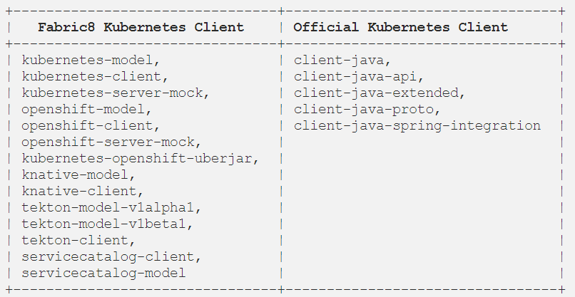

# Fabric8 和官方 Kubernetes Java 客户端的区别
## 1. 历史
Fabric8 Kubernetes 客户端由[Ioannis Cannelos](https://github.com/iocanel) 和 [Jimmy Dyson](https://github.com/jimmidyson)在 Kubernetes 早期的2015年发起用作一个与 Kubernetes 交互的Java框架。在那个时候，Fabric8 项目期待成为一个运行在 Kubernetes 上的云原生微服务的 PaaS 平台。Fabric8 Kubernete 客户端库在 Fabric8 生态中扮演的关键角色，因为它通过 Kubernetes REST API 提供了一个抽象。

官方 Kubernetes Java 客户端由 [Brendan Burns](https://github.com/brendandburns)（他也是 Kubernetes 的创建者）在 2017 年开创，同时还有免想起他几个语言的库，如 PERL, Javascript, Python 等。所有的客户端看起来都是从一个 [OpenAPI generator](https://github.com/OpenAPITools/openapi-generator)脚本生成：[kubernetes-client/gen](https://github.com/kubernetes-client/gen)，Java客户端以同样的方式生成。因此它的使用方式与其它客户端很像，毕竟它们由同一个脚本生成。
## 2. 官方和 Fabric8 Java 客户端提供的包

## 3. 用户数量
当我查看使用两个库的用户数量时，Fabric8 远远走在前头。我汇聚了所有报的使用统计，以下是基于 Github insights 的 Github 上的依赖数：
- Fabric8 Kubernetes 客户端（所有包）：8152 Github 仓库
- 官方 Kubernetes 客户端（所有包）：672 Github 仓库
## 4. 使用差异

## Reference
- [Fabric8 和官方 Kubernetes Java 客户端的区别](https://itnext.io/difference-between-fabric8-and-official-kubernetes-java-client-3e0a994fd4af?gi=2835455667bd)